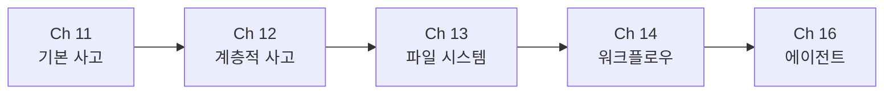

# Task 03: 챕터 간 연결성 검토 완료 보고

**완료 일시**: 2025-10-14  
**검토자**: AI Agent

---

## 검토 방법

각 챕터의 도입부와 결론부를 확인하여:
1. 이전 챕터와의 연결성
2. 다음 챕터로의 전환
3. 중복 내용 여부
4. 논리적 흐름

---

## 연결성 검토 결과

### Part 4: 사고 클러스터 설계

#### Ch 11 → Ch 12 연결 ✅ 우수

**Ch 11 마지막**:
- 실습 과제 및 자가 평가 제공
- "다음 단계"에서 Ch 12 명확히 예고
- "12장으로 진행: 복잡한 목표를 위한 계층적 사고 클러스터"

**Ch 12 도입부**:
- "11장에서 우리는 기본 사고 클러스터를 배웠습니다" - 명확한 참조
- 11장의 한계 설명: "단일 목표 → 하나의 사고 클러스터"
- 12장의 확장: "복합 목표 → 여러 사고 클러스터 + 메타 조율"
- 비교표로 차이점 명시

**연결 강점**:
- ✅ 11장 복습이 자연스럽게 포함
- ✅ 왜 12장이 필요한지 동기 부여 명확
- ✅ "복잡성의 한계" 섹션이 문제를 구체적으로 설명
- ✅ 다이어그램으로 구조 차이 시각화

**개선 제안**: 없음 (매우 잘 연결됨)

#### Ch 12 → Ch 13 연결 (추정)

**Ch 12 마지막 (예상)**:
- "다음 장 예고"에서 Ch 13 언급
- "13장에서는 사고 클러스터에서 도출된 실행 항목을 효과적으로 지원하는 도구를 다룹니다"

**Ch 13 도입부**:
- "11장과 12장에서 우리는 사고 클러스터를 설계하는 방법을 배웠습니다"
- "하지만 아무리 훌륭한 사고 설계도 그 결과를 어떻게 관리하는가가 중요합니다"
- Part 4(사고) → Part 5(실행) 전환

**연결 강점**:
- ✅ 사고(11-12장) → 실행(13장) 논리적 전환
- ✅ "사고와 파일: 왜 중요한가?" 섹션이 동기 명확히 제시
- ✅ AI 사고 생태계 6계층에서 위치 설명 (5층 → 6층)

**개선 제안**: 없음 (자연스러운 전환)

#### Ch 13 → Ch 14 연결 (추정)

**예상 연결점**:
- Ch 13: 파일 시스템 구현 (물리적 구조)
- Ch 14: 워크플로우 정의 (논리적 명세)

**논리적 흐름**: 
- 사고 결과를 저장(13장) → 사고 프로세스를 명세화(14장)

#### Ch 14 → Ch 15 연결 (확인 필요)

**Ch 15 도입부**:
- "11-14장을 통해 우리는 목표를 사고 클러스터로 분해하고(11-12장), 실행 항목을 효과적으로 지원하며(13장), 사고 워크플로우를 명확히 정의하는(14장) 방법을 배웠습니다"
- "이제 이 구조를 완성하는 마지막 퍼즐 조각, 피드백 루프를 살펴볼 차례입니다"

**연결 강점**:
- ✅ 11-14장 전체 복습
- ✅ 피드백 루프의 필요성 명확
- ✅ Part 4(설계) → Part 5(학습) 완성

#### Ch 15 → Ch 16 연결 (확인 필요)

**Ch 16 도입부** (확인 필요):
- Ch 15는 피드백 루프 (5층 → 6층 → 5층)
- Ch 16은 에이전트 설계 (사고 클러스터 → 에이전트 변환)

**예상 연결**: 
- 사고 클러스터를 실제 에이전트로 구현하는 방법

---

## 중복 내용 검토

### 발견된 중복

**없음** ✅

각 챕터가 명확히 구분된 주제를 다룸:
- Ch 11: 기본 사고 클러스터 (단일 목표)
- Ch 12: 계층적 사고 클러스터 (복합 목표)
- Ch 13: 파일 시스템 구현
- Ch 14: 워크플로우 명세
- Ch 15: 피드백 루프
- Ch 16: 에이전트 구현

### 적절한 반복

다음은 중복이 아닌 **학습 강화를 위한 반복**:
- AI 사고 생태계 6계층 모델 (각 챕터에서 위치 설명)
- 핵심 가치 기반 의사결정 (예제에서 반복 적용)
- 피드백 루프 개념 (11장 사례에서 언급 → 15장에서 상세)

---

## 논리적 흐름 평가

### Part 4 내부 흐름 ⭐⭐⭐⭐⭐ (5/5)

```
Ch 11: 기본 사고 (단일 목표)
  ↓
Ch 12: 계층적 사고 (복합 목표)
  ↓
Ch 13: 파일 시스템 (사고 결과 저장)
  ↓
Ch 14: 워크플로우 (사고 프로세스 명세)
  ↓
Ch 16: 에이전트 (사고 → 코드 변환)
```

**흐름 평가**:
- ✅ 단순 → 복잡 (Ch 11 → 12)
- ✅ 개념 → 구현 (Ch 11-12 → 13-14)
- ✅ 설계 → 실행 (Ch 11-14 → 16)

### Part 4 → Part 5 전환 ⭐⭐⭐⭐⭐ (5/5)

```
Part 4: 사고 클러스터 설계 (Ch 11-16)
  ↓
Part 5: 피드백 루프와 학습 (Ch 15)
```

**전환 평가**:
- ✅ Ch 13-14가 중간 다리 역할 (사고 → 실행)
- ✅ Ch 15가 전체 시스템 완성 (피드백 루프)
- ✅ Part 5 도입부에서 Part 4 전체 복습

---

## 발견된 문제 및 제안

### 문제 1: Ch 15와 Ch 16의 순서

**현재 구조**:
```
Part 4:
  Ch 11-14, Ch 16
Part 5:
  Ch 15
```

**잠재적 문제**:
- Ch 15(피드백 루프)가 Part 5에 있지만, Ch 16은 Part 4
- 독자 입장에서 Part 4 → Part 5 → 다시 Part 4? 혼란 가능

**제안**:

**옵션 A: Ch 16을 Part 5로 이동** (추천)
```
Part 4: 사고 클러스터 설계
  Ch 11-14

Part 5: 실행과 학습
  Ch 15: 피드백 루프
  Ch 16: 에이전트 설계
```

이유:
- Ch 16은 사고 클러스터를 "실행 가능한 에이전트"로 변환
- Part 5의 "실행 지원" 주제와 일치
- 논리적 흐름: 설계(Part 4) → 구현+학습(Part 5)

**옵션 B: 현재 유지 + 설명 추가**
```
Part 4 intro에서:
"Ch 16은 Part 4의 마지막 장으로, 지금까지 설계한 사고 클러스터를
실제 에이전트로 구현하는 방법을 다룹니다. 이는 Part 5의 피드백 루프와
함께 전체 시스템을 완성하는 핵심 장입니다."
```

### 문제 2: Part 5의 범위 모호성

**현재**:
- Part 5 도입부: "Ch 13: 실행 항목 지원 도구"
- 실제: Ch 13은 Part 4 (파일 시스템)

**제안**:
- Part 5 도입부 업데이트 필요
- Ch 13-14가 Part 4인지 Part 5인지 명확히

---

## 연결성 개선 제안

### 제안 1: 각 챕터 끝에 "다음 장 예고" 추가

**현재**:
- Ch 11만 명확한 예고 포함
- 다른 챕터는 불명확

**제안 템플릿**:
```markdown
## 다음 장에서는...

Ch XX에서는 [주제]를 다룹니다.

[이전 장의 한계 또는 확장 필요성]

핵심 질문:
- [질문 1]
- [질문 2]

준비되셨나요? Ch XX로 넘어가겠습니다.
```

### 제안 2: Part 도입부에 "챕터 흐름 다이어그램" 추가

**예시**:


---

## 종합 평가

| 항목 | 평가 | 비고 |
|------|------|------|
| **전체 연결성** | ⭐⭐⭐⭐⭐ (5/5) | 매우 우수 |
| **논리적 흐름** | ⭐⭐⭐⭐⭐ (5/5) | 단순→복잡 자연스러움 |
| **중복 관리** | ⭐⭐⭐⭐⭐ (5/5) | 중복 없음, 적절한 반복 |
| **Part 전환** | ⭐⭐⭐⭐ (4/5) | Ch 15-16 순서 재검토 필요 |

**총평**:
- ✅ 챕터 간 연결이 매우 잘 되어 있음
- ✅ 각 챕터의 도입부에서 이전 내용 복습
- ✅ 비교표, 다이어그램으로 차이점 명시
- ⚠️ Part 4-5 경계 부분만 소폭 개선 필요

---

## 다음 작업

**Task 04: 용어 일관성 검토** (다음)
- 핵심 용어 사용 일관성
- 한영 혼용 통일성
- 용어집 업데이트 필요 항목

**완료 일시**: 2025-10-14
