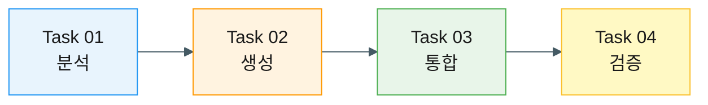

# Workflow 01: 2권 목차 생성 및 통합

**Story**: Story 02 - 2권 통합 목차 생성 및 메인 목차 업데이트

**목적**: 2권의 전체 구조를 파악하고 독자가 쉽게 탐색할 수 있는 목차를 만드는 프로세스

---

## Workflow 개요

이 워크플로우는 **분석 → 생성 → 통합 → 검증** 4단계 파이프라인입니다.

---

## Task 흐름 설계

### Task 01: 분석 (입력 준비)
**목표**: 2권의 파일 구조를 완전히 파악한다

**입력**:
- `doc/book2/` 디렉토리 전체

**처리**:
- 파일명 패턴 분석
- Part/Chapter/Section 구조 추출
- 제목 정보 수집

**출력**:
- 파일 맵핑 테이블 (Markdown)
- 구조 분석 리포트

**다음 단계 조건**: 
- ✅ 모든 파일이 테이블에 포함됨
- ✅ 구조적 이슈 식별됨 (Ch 13, 14 중복, Ch 16 미완성)

---

### Task 02: 생성 (핵심 산출물)
**목표**: `vol-2-index.md` 파일을 생성한다

**입력**:
- Task 01의 파일 맵핑 테이블
- `vol-2-part-0-preface.md` (AI 사고 생태계 내용)
- `vol-2-part-4-intro.md`, `vol-2-part-5-intro.md`
- `doc/index.md` (1권 목차 형식 참조)

**처리**:
- 2권 전체 개요 작성
- AI 사고 생태계 다이어그램 포함
- Part 0, 4, 5 구조로 목차 구성
- 각 챕터의 학습 목표 및 난이도 표시
- 1권과의 연결 관계 설명

**출력**:
- `doc/book2/vol-2-index.md`

**다음 단계 조건**:
- ✅ 파일 생성됨
- ✅ 모든 필수 섹션 포함
- ✅ AI 사고 생태계 다이어그램 포함

---

### Task 03: 통합 (메인 목차 연결)
**목표**: `doc/index.md`에 2권 섹션을 추가한다

**입력**:
- Task 02의 `vol-2-index.md`
- 기존 `doc/index.md`

**처리**:
- "전체 구성" 섹션 추가 (1권 + 2권)
- 2권 간략 소개 섹션 추가
- 학습 경로 가이드 추가
- 1권 마무리에 2권 예고 추가

**출력**:
- 업데이트된 `doc/index.md`

**다음 단계 조건**:
- ✅ 2권 섹션 추가됨
- ✅ 상호 참조 링크 정확함

---

### Task 04: 검증 (품질 확인)
**목표**: 생성된 목차의 품질을 검증한다

**입력**:
- Task 02의 `vol-2-index.md`
- Task 03의 `doc/index.md`

**처리**:
- 모든 내부 링크 검증
- 구조 일관성 확인 (헤더 레벨, 난이도 표시)
- 내용 완성도 확인 (필수 섹션 존재)
- 독자 관점 검토

**출력**:
- 검증 완료 체크리스트
- 발견된 이슈 리스트 (있는 경우)

**완료 조건**:
- ✅ 모든 링크 정상 작동
- ✅ 구조 일관성 확보
- ✅ 필수 내용 모두 포함

---

## 의존성

- Task 02는 Task 01 완료 필요
- Task 03은 Task 02 완료 필요
- Task 04는 Task 02, 03 완료 필요

---

## 예외 처리

### Task 01에서 이슈 발견 시
- Ch 13, 14 중복 파일 → Task 02에서 결정 필요 표시
- Ch 16 미완성 → Task 02에서 "예정" 표시

### Task 02에서 내용 부족 시
- 서문/도입부 내용 부족 → 간략 버전으로 작성
- 다이어그램 작성 어려움 → ASCII 아트로 대체

### Task 03에서 충돌 발생 시
- 기존 목차 구조와 불일치 → 최소 변경 원칙
- 링크 경로 오류 → 상대 경로 재확인

### Task 04에서 문제 발견 시
- 깨진 링크 → Task 02 또는 03으로 돌아가 수정
- 구조 불일치 → 해당 Task로 돌아가 수정

---

## 성공 지표

- [ ] `vol-2-index.md` 파일 생성
- [ ] 2권의 28개 파일 중 필요한 것 모두 목차에 포함
- [ ] `doc/index.md`에 2권 섹션 추가
- [ ] 모든 링크가 정상 작동 (100%)
- [ ] 1권 목차와 형식 일관성 유지

---

**작성일**: 2025-10-14  
**작성자**: AI (Claude)
