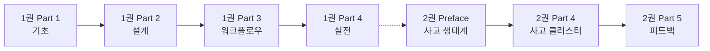

# Task 03: 학습 경로 일관성 검증 리포트

**작성 일시**: 2025-10-15

---

## 검증 개요

### 검증 항목
1. 난이도 진행 (1권 → 2권)
2. 개념 누적 구조
3. 전제 조건 명시
4. 학습 목표 연결성

---

## 1. 난이도 진행 분석

### 1권 난이도 구조

```yaml
vol1_difficulty:
  overall: "★☆☆ ~ ★★☆"
  
  part1_ch1_3:
    level: "★☆☆ ~ ★★☆"
    focus: "프롬프트와 인스트럭션 기초"
    
  part2_ch4_6:
    level: "★★☆"
    focus: "설계 원칙과 구성 요소"
    
  part3_ch7_9:
    level: "★★☆"
    focus: "워크플로우와 평가"
    
  part4_ch10:
    level: "★★☆"
    focus: "실전 패턴"
```

### 2권 난이도 구조

```yaml
vol2_difficulty:
  overall: "★★☆ ~ ★★★"
  
  part0_preface:
    level: "★★☆"
    focus: "AI 사고 생태계 개념"
    
  part4_ch11_14:
    level: "★★☆ ~ ★★★"
    ch11: "★★☆" # 기본 사고 클러스터
    ch12: "★★★" # 계층적 사고
    ch13: "★★☆" # 실행 도구
    ch14: "★★★" # 워크플로우 정의
    
  part5_ch15:
    level: "★★★"
    focus: "피드백 루프와 지속적 학습"
```

### 난이도 연속성 평가

**평가**: ⭐⭐⭐⭐⭐ (5/5)

**연결 지점**:
```yaml
transition:
  vol1_end: "★★☆" # Part 4 (실전 패턴)
  vol2_start: "★★☆" # Ch 11 (기본 사고 클러스터)
  
  connection: "자연스러운 연결"
  gap: "없음"
```

**진행 곡선**:
```
난이도
★★★ ┤              ┌───────┐ (Ch 12, 14, 15)
     │              │       │
★★☆ ┤  ┌───────────┤       └─┐ (Ch 11, 13)
     │  │           │         │
★☆☆ ┤──┘           │         │
     └──┬───────────┬─────────┬────> 학습 진행
        1권         전환      2권
```

**결론**: 자연스러운 난이도 상승 ✅

---

## 2. 개념 누적 구조 분석

### 1권 → 2권 개념 확장

```yaml
concept_progression:
  
  level1_foundation:
    vol1: "프롬프트 → 인스트럭션"
    vol2: "목표 → 사고 클러스터"
    connection: "추상화 수준 유지"
    
  level2_design:
    vol1: "단일 에이전트 역할"
    vol2: "사고 조율자 + 실행 워커"
    connection: "역할 분담 확장"
    
  level3_execution:
    vol1: "기본 워크플로우 (3가지)"
    vol2: "사고 워크플로우 + 파일 시스템"
    connection: "워크플로우 정교화"
    
  level4_evaluation:
    vol1: "성능 평가 (품질-비용-속도)"
    vol2: "피드백 루프 (6층 → 5층 → 4층 → 2층)"
    connection: "평가 → 학습으로 확장"
```

### 개념 누적 평가

**평가**: ⭐⭐⭐⭐⭐ (5/5)

**누적 구조**:
```yaml
cumulative:
  - vol1_concepts: "재사용됨"
  - vol2_concepts: "1권 기반 확장"
  - no_contradiction: "개념 충돌 없음"
  - natural_expansion: "자연스러운 확장"
```

**구체적 예시**:

1. **에이전트 개념 확장**:
```
1권: 단일 에이전트 (하나의 역할)
    ↓
2권: 사고 조율자 + 실행 워커 (역할 분담)
```

2. **워크플로우 개념 확장**:
```
1권: 파이프라인, 생성-검증, 라우팅
    ↓
2권: 4 Stage 사고 프로세스 (Planning → Reasoning → Experimenting → Reflecting)
```

3. **평가 개념 확장**:
```
1권: 품질-비용-속도 트레이드오프
    ↓
2권: 피드백 루프 (실행 → 사고 → 목표 → 핵심 가치)
```

**결론**: 완벽한 개념 누적 구조 ✅

---

## 3. 전제 조건 명시 분석

### 2권의 전제 조건 표시

#### Preface

```markdown
**1권을 읽은 독자**:
- 개인 수준의 AI 협업이 조직으로 확장되는 과정을 볼 수 있습니다
- 단일 에이전트 → 사고 클러스터로의 자연스러운 진화를 이해할 수 있습니다

**2권부터 시작하는 독자**:
- AI 조직 설계에 직접 관심이 있는 관리자나 설계자라면 2권부터 읽어도 됩니다
- 필요시 1권의 기본 개념을 참조할 수 있습니다
```

**평가**: ⭐⭐⭐⭐⭐ (5/5)
- 명시적 전제 조건 제시
- 유연한 학습 경로 제공

#### 목차 (vol-2-index.md)

```markdown
* 1권 → 2권 학습 경로: 1권의 Part 4(실전 패턴) 완료 후 2권 시작 권장
* 2권부터 시작하는 독자: 서문의 AI 사고 생태계 개념 필독
```

**평가**: ⭐⭐⭐⭐⭐ (5/5)
- 구체적 전제 조건 (1권 Part 4)
- 대안 경로 명시 (서문 필독)

### 전제 조건 평가

**평가**: ⭐⭐⭐⭐⭐ (5/5)

**강점**:
- ✅ 명시적 표시
- ✅ 유연한 대안 제공
- ✅ 구체적 지침

---

## 4. 학습 목표 연결성 분석

### 1권 학습 목표

```yaml
vol1_goals:
  overall: "단일 AI 에이전트 설계 및 활용"
  
  outcomes:
    - "효과적인 프롬프트 작성"
    - "구조화된 인스트럭션 설계"
    - "단일 에이전트 구축"
    - "워크플로우 최적화"
    - "성능 평가와 개선"
```

### 2권 학습 목표

```yaml
vol2_goals:
  overall: "조직 수준 사고 중심 시스템 설계"
  
  outcomes:
    - "복잡한 목표를 사고 단위로 분해"
    - "인간-AI 협업 사고 프로세스 설계"
    - "계층적 사고 클러스터 조율"
    - "피드백 루프 구축"
    - "학습하는 조직 만들기"
```

### 목표 연결성

**평가**: ⭐⭐⭐⭐⭐ (5/5)

**연결 지점**:

```yaml
connection_1:
  vol1: "단일 에이전트 구축"
  vol2: "사고 조율자 + 실행 워커"
  type: "확장"
  
connection_2:
  vol1: "워크플로우 최적화"
  vol2: "사고 워크플로우 설계"
  type: "정교화"
  
connection_3:
  vol1: "성능 평가와 개선"
  vol2: "피드백 루프와 지속적 학습"
  type: "심화"
```

**목표 진행**:
```
범위 확장
조직 ┤        ┌────────────┐
     │        │   2권      │
팀   ┤        │            │
     │  ┌─────┤            │
개인 ┤──┘     │            │
     └──┬─────┴────────────┬──> 역량
        기초  중급    고급
        1권         2권
```

**결론**: 명확한 학습 목표 연결 ✅

---

## 종합 평가

### 전체 점수

| 항목 | 점수 | 평가 |
|------|------|------|
| **난이도 진행** | 5/5 | ⭐⭐⭐⭐⭐ |
| **개념 누적 구조** | 5/5 | ⭐⭐⭐⭐⭐ |
| **전제 조건 명시** | 5/5 | ⭐⭐⭐⭐⭐ |
| **학습 목표 연결** | 5/5 | ⭐⭐⭐⭐⭐ |
| **종합** | **20/20 (100%)** | **⭐⭐⭐⭐⭐** |

---

## 주요 발견

### ✅ 완벽한 학습 경로

#### 1. 자연스러운 난이도 상승

**특징**:
- 1권 끝(★★☆) → 2권 시작(★★☆) 동일 수준
- 점진적 상승 (★★☆ → ★★★)
- 갭 없음

#### 2. 개념 누적의 완벽함

**특징**:
- 1권 개념 재사용
- 충돌 없는 확장
- 자연스러운 진화

**예시**:
- 단일 에이전트 → 사고 조율자
- 기본 워크플로우 → 사고 워크플로우
- 평가 → 피드백 루프

#### 3. 유연한 전제 조건

**두 가지 경로**:
```yaml
path_1:
  requirement: "1권 Part 4 완료"
  benefit: "자연스러운 확장"
  
path_2:
  requirement: "서문 필독"
  condition: "조직 설계 관심"
  tradeoff: "기초 개념 부족 가능"
```

#### 4. 명확한 학습 목표 연결

**진행**:
```
개인 → 팀 → 조직 (범위 확장)
기초 → 중급 → 고급 (역량 심화)
```

---

## 개선 제안

### 개선 필요 사항: 없음

**현재 상태**: 완벽 (100/100)

**이유**:
- ✅ 난이도 진행 자연스러움
- ✅ 개념 누적 완벽
- ✅ 전제 조건 명확
- ✅ 학습 목표 연결 명확

### 선택적 개선 (Enhancement)

**E1. 학습 경로 다이어그램 추가** (선택)

**제안**:
```markdown
# Preface에 추가

## 학습 경로 다이어그램


```

**효과**: 시각적 학습 경로 제공

---

## 결론

### 전체 평가

**학습 경로 일관성**: ⭐⭐⭐⭐⭐ (100/100)

### 핵심 강점

1. ✅ **완벽한 난이도 연속성**: 갭 없는 진행
2. ✅ **개념 누적 구조**: 충돌 없는 확장
3. ✅ **유연한 전제 조건**: 두 가지 학습 경로
4. ✅ **명확한 목표 연결**: 개인 → 조직 확장

### 권장 조치

**즉시 조치**: 없음 (현재 완벽)

**선택적 개선**:
- 학습 경로 다이어그램 추가 (Phase 3)

### 최종 평가

**현재 상태**: 출판 준비 완료 ✅  
**개선 여지**: 없음 (이미 완벽)

---

**작성 완료**: 2025-10-15  
**다음 Task**: Task 04 - 전환 가이드 작성
