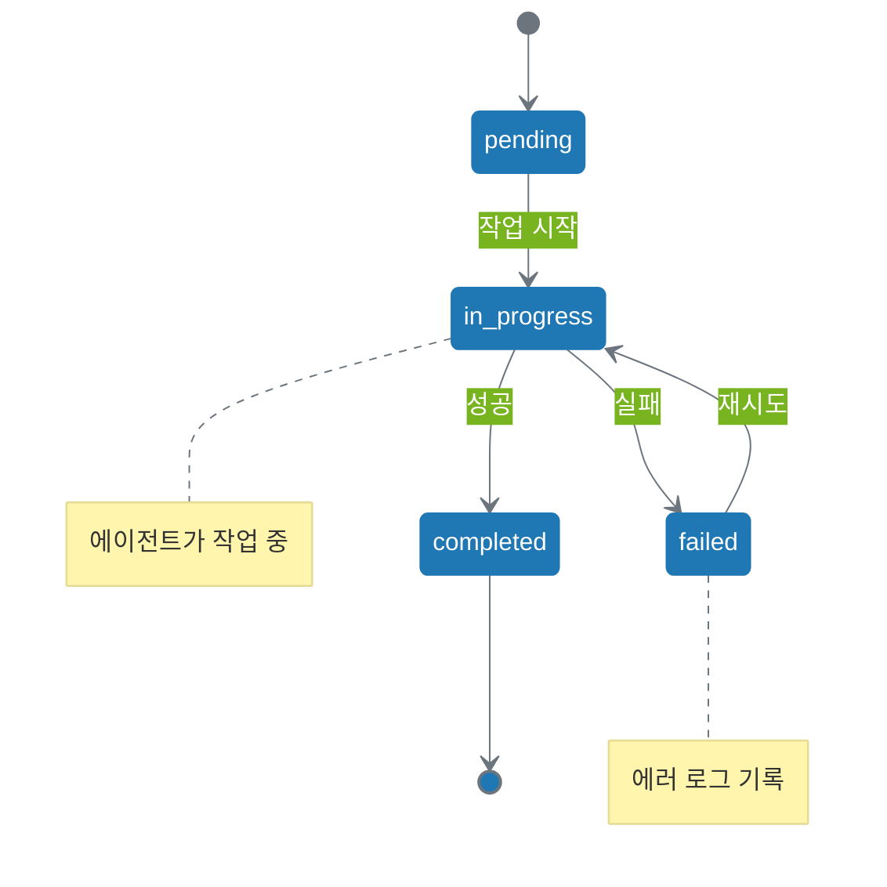

# 7.5장. 중간 규모 협업과 파일 기반 관리

**Part 3: 워크플로우, 성능과 평가**

**목적:** 3-4개 에이전트가 팀처럼 협력하는 중간 규모 워크플로우를 설계하고, 작업을 체계적으로 관리하는 방법을 배웁니다.

### 이 장에서 배우는 것
- 언제 여러 에이전트를 사용해야 하는지 판단하는 기준
- 작업별 디렉토리 구조로 파일을 체계적으로 관리하는 방법
- JSON 기반 상태 추적으로 워크플로우 진행 상황을 모니터링하는 방법
- 에이전트 간 명확한 소통을 위한 산출물 표준화 방법

---

## 7.5.1 들어가며: 혼자서는 할 수 없는 일

7장에서 우리는 1-2개 에이전트로 구성된 기본 워크플로우 패턴을 배웠습니다. 파이프라인으로 순차적으로 작업하고, 생성-검증 패턴으로 품질을 높이고, 라우팅으로 조건에 따라 분기하는 방법을 익혔죠.

하지만 실제 업무는 종종 더 복잡합니다. 예를 들어, 블로그 콘텐츠를 발행하는 과정을 생각해봅시다:

1. **작성**: 주제에 맞는 초안 작성
2. **검토**: 사실 확인 및 개선 제안
3. **편집**: 최종 교정 및 포맷팅
4. **발행**: 플랫폼 게시 및 SEO 설정

각 단계는 서로 다른 전문성을 요구합니다. 한 에이전트에게 모두 맡기면 품질이 떨어지고, 실패 확률이 높아집니다. 그렇다면 몇 개의 에이전트로 나눠야 할까요? 어떻게 협력시켜야 할까요?

### 중간 규모 협업이 필요한 4가지 신호

다음 상황 중 하나라도 해당한다면, 7장의 단순한 패턴을 넘어 7.5장의 중간 규모 협업이 필요합니다:

1. **3개 이상의 명확한 역할**: 작성, 검토, 편집처럼 전문성이 다른 역할이 3개 이상 필요할 때
2. **여러 개의 중간 산출물**: 초안, 검토 의견, 수정본처럼 단계마다 다른 형태의 결과물이 생성될 때
3. **유연한 작업 순서**: 특정 단계가 실패하면 이전 단계로 돌아가거나, 일부만 재실행해야 할 때
4. **상태 추적 필요성**: "지금 어느 단계까지 진행됐는가?"를 명확히 알아야 할 때

### 7장 vs 7.5장 vs 10장: 어느 수준이 적합한가?

| 특성 | 7장 | 7.5장 (이 장) | 10장 |
|------|-----|--------------|------|
| 에이전트 수 | 1-2개 | 3-4개 | 6개 이상 |
| 구조 | 단순 순차/분기 | 팀 협업 | 계층 조직 |
| 파일 관리 | 평면 구조 | 작업별 디렉토리 | 다층 디렉토리 |
| 상태 추적 | 없음 | status.json | _job_log.json |
| 역할 결정 | 인간이 직접 | 인간이 직접 | 메타 에이전트 |

**핵심**: 7장은 "단순 자동화", 7.5장은 "팀 협업", 10장은 "조직 시스템"입니다.

---

## 7.5.2 예제 시나리오: 콘텐츠 팀 협업

이제 구체적인 예제로 중간 규모 협업을 이해해봅시다. 우리는 4개 에이전트로 구성된 콘텐츠 발행 팀을 만들 것입니다.

### 워크플로우 개요


### 각 에이전트의 역할과 책임

**1. 작성자 에이전트 (Writer)**
- **입력**: 주제, 키워드, 목표 분량
- **처리**: 구조화된 초안 작성
- **출력**: `draft.md` (마크다운 초안)

**2. 검토자 에이전트 (Reviewer)**
- **입력**: `draft.md`
- **처리**: 사실 확인, 논리 검증, 개선 제안
- **출력**: `review.json` (구조화된 피드백)

**3. 편집자 에이전트 (Editor)**
- **입력**: `draft.md`, `review.json`
- **처리**: 피드백 반영, 문체 교정, 포맷팅
- **출력**: `edited.md` (최종 원고)

**4. 발행자 에이전트 (Publisher)**
- **입력**: `edited.md`
- **처리**: 플랫폼 포맷 변환, SEO 메타데이터 추가
- **출력**: `published.json` (발행 정보)

### 왜 이렇게 나눴는가?

- **작성과 검토 분리**: 작성자는 창의성에 집중, 검토자는 객관성 유지
- **검토와 편집 분리**: 검토는 "무엇을 고칠 것인가", 편집은 "어떻게 고칠 것인가"
- **편집과 발행 분리**: 콘텐츠 품질과 기술적 발행을 독립적으로 관리

각 에이전트는 자신의 전문성에만 집중하므로, 인스트럭션이 단순해지고 성공률이 높아집니다.

---

## 7.5.3 작업 격리: 왜 디렉토리 구조가 필요한가?

### 문제: 파일이 많아지면 혼란스럽다

7장에서는 파일이 몇 개 없었습니다:
```
project/
├── draft.md
└── final.md
```

하지만 7.5장에서는 에이전트가 4개이고, 각자 산출물을 만듭니다:
```
project/
├── input.json          # 작업 요청
├── draft.md            # 작성자 산출물
├── review.json         # 검토자 산출물
├── edited.md           # 편집자 산출물
├── published.json      # 발행자 산출물
├── status.json         # 상태 추적
└── ... (다른 작업 파일들)
```

여러 작업을 동시에 진행하면? 파일 이름 충돌이 발생하고, 어떤 파일이 어느 작업에 속하는지 알 수 없습니다.

### 해결책: 작업별 디렉토리 분리

```
project/
├── tasks/                  # 진행 중인 작업들
│   ├── task-001/           # 작업 1 (AI 생산성 블로그)
│   │   ├── input.json      # 작업 요청
│   │   ├── draft.md        # 작성자 산출물
│   │   ├── review.json     # 검토자 산출물
│   │   ├── edited.md       # 편집자 산출물
│   │   ├── published.json  # 발행자 산출물
│   │   └── status.json     # 상태 추적
│   └── task-002/           # 작업 2 (프롬프트 엔지니어링 가이드)
│       └── ...
├── outputs/                # 최종 산출물 보관
│   └── published/
│       ├── ai-productivity-2025-10-06.md
│       └── prompt-engineering-2025-10-07.md
└── shared/                 # 공통 자원
    ├── style_guide.md      # 스타일 가이드
    └── templates/          # 템플릿들
        └── blog_template.md
```

### 3가지 설계 원칙

**1. 격리 (Isolation)**: 각 작업은 독립된 디렉토리
- 다른 작업과 파일 이름 충돌 없음
- 작업 단위로 삭제/보관 가능
- 디버깅이 쉬움 (해당 디렉토리만 확인)

**2. 공유 (Sharing)**: 공통 자원은 `/shared`에
- 스타일 가이드는 모든 작업이 참조
- 템플릿은 재사용 가능
- 중복 제거 (SSOT 원칙)

**3. 명명 규칙 (Naming)**: 일관된 이름 체계
- 작업 디렉토리: `task-{id}` (예: task-001, task-002)
- ID는 순차 번호 또는 타임스탬프 (예: task-20251006-1430)
- 산출물 파일 이름은 표준화 (draft.md, review.json, edited.md)

---

## 7.5.4 상태 추적: 지금 어디까지 했는가?

### 문제: 진행 상황을 알 수 없다

작업이 여러 단계를 거치면, "지금 어느 단계인가?" "실패했다면 어디서?" 같은 질문에 답하기 어렵습니다. 파일 존재 여부만으로는 충분하지 않습니다:

- `draft.md`가 있다 = 작성 완료? 아니면 진행 중?
- `review.json`이 없다 = 검토 전? 아니면 실패?

### 해결책: `status.json`으로 상태 추적

각 작업 디렉토리에 `status.json` 파일을 두어 진행 상황을 명확히 기록합니다:

```json
{
  "task_id": "task-001",
  "title": "AI 생산성 향상 블로그 포스트",
  "created_at": "2025-10-06T10:00:00Z",
  "updated_at": "2025-10-06T10:15:00Z",
  "current_step": "editing",
  "steps": {
    "drafting": {
      "status": "completed",
      "agent": "writer",
      "started_at": "2025-10-06T10:00:00Z",
      "completed_at": "2025-10-06T10:05:00Z"
    },
    "reviewing": {
      "status": "completed",
      "agent": "reviewer",
      "started_at": "2025-10-06T10:05:00Z",
      "completed_at": "2025-10-06T10:10:00Z"
    },
    "editing": {
      "status": "in_progress",
      "agent": "editor",
      "started_at": "2025-10-06T10:10:00Z",
      "completed_at": null
    },
    "publishing": {
      "status": "pending",
      "agent": null,
      "started_at": null,
      "completed_at": null
    }
  }
}
```

### 4가지 상태

- **`pending`**: 대기 중 (아직 시작 안 함)
- **`in_progress`**: 진행 중 (에이전트가 작업 중)
- **`completed`**: 완료 (성공적으로 끝남)
- **`failed`**: 실패 (재시도 필요)

### 상태 전이 다이어그램



### 각 에이전트의 책임

**작업 시작 시**:
- `status.json`에서 현재 단계의 상태를 `pending` → `in_progress`로 변경
- `started_at` 타임스탬프 기록

**작업 완료 시**:
- 상태를 `in_progress` → `completed`로 변경
- `completed_at` 타임스탬프 기록
- 다음 단계의 상태는 `pending`으로 유지 (다음 에이전트가 시작할 때 변경)

**작업 실패 시**:
- 상태를 `in_progress` → `failed`로 변경
- 에러 메시지 기록

---

## 7.5.5 산출물 표준화: JSON으로 소통하기

### 문제: 텍스트 파일은 해석이 모호하다

작성자가 검토 의견을 텍스트로 남기면:

```
draft.md의 Introduction 섹션에 통계 출처가 명시되지 않았습니다.
Conclusion 섹션의 문장이 너무 깁니다.
Overall, 좋은 내용이지만 몇 가지 개선이 필요합니다.
```

편집자는 이걸 어떻게 처리할까요?
- "몇 가지"가 정확히 몇 개?
- 심각도는? 꼭 고쳐야 하나, 권장사항인가?
- "Conclusion 섹션"은 어디서 어디까지?

### 해결책: JSON 기반 산출물

구조화된 데이터로 명확하게 소통합니다:

```json
{
  "type": "review_comments",
  "agent": "reviewer",
  "timestamp": "2025-10-06T10:10:00Z",
  "overall_assessment": "good_with_improvements",
  "comments": [
    {
      "id": 1,
      "section": "Introduction",
      "line_number": 15,
      "severity": "major",
      "category": "citation",
      "comment": "통계 출처가 명시되지 않았습니다",
      "suggestion": "2024 McKinsey AI 생산성 보고서 인용 추가",
      "must_fix": true
    },
    {
      "id": 2,
      "section": "Conclusion",
      "line_number": 42,
      "severity": "minor",
      "category": "style",
      "comment": "문장이 너무 깁니다 (85단어)",
      "suggestion": "두 문장으로 분리",
      "must_fix": false
    }
  ],
  "summary": {
    "total_comments": 2,
    "major_issues": 1,
    "minor_issues": 1,
    "estimated_fix_time": "15 minutes"
  }
}
```

### JSON 산출물의 3가지 장점

**1. 명확성**: 필드 이름으로 의미 전달
- `severity: "major"` = 심각도가 높음
- `must_fix: true` = 반드시 수정 필요
- `line_number: 15` = 정확한 위치

**2. 검증 가능**: 필수 필드 확인 가능
- `type` 필드가 없으면 에러
- `severity`가 `major/minor` 외의 값이면 경고

**3. 자동화 친화적**: 다음 에이전트가 프로그래밍 방식으로 처리
```python
# 편집자 에이전트가 자동으로 처리 가능
for comment in review['comments']:
    if comment['must_fix']:
        apply_fix(comment['section'], comment['suggestion'])
```

### 간단한 스키마 설계 가이드

모든 산출물 JSON에 다음 필드를 포함하세요:

**필수 필드**:
- `type`: 산출물 종류 (예: "review_comments", "draft", "published")
- `agent`: 생성한 에이전트 이름
- `timestamp`: 생성 시각 (ISO 8601 형식)

**선택 필드**: 업무에 따라 추가
- `content`: 실제 콘텐츠
- `metadata`: 추가 정보 (태그, 카테고리 등)
- `references`: 참조한 파일이나 자원

---

## 7.5.6 에러 처리와 재시도

### 문제: 에이전트가 실패하면 어떻게 할 것인가?

완벽한 워크플로우는 없습니다. 다음과 같은 실패 상황이 발생할 수 있습니다:

- **검토자**: "초안이 너무 짧습니다 (300단어, 최소 500단어 필요)"
- **편집자**: "`draft.md` 파일을 찾을 수 없습니다"
- **발행자**: "API 인증 실패"

실패를 어떻게 처리할까요? 처음부터 다시? 실패한 단계만? 사람에게 알릴까?

### 3가지 재시도 정책

**1. 단계 재시도**: 실패한 단계만 다시 실행

```yaml
steps:
  - name: reviewing
    agent: reviewer
    retry:
      max_attempts: 3
      backoff: exponential  # 1초, 2초, 4초 대기
      retry_on:
        - "draft_too_short"
        - "external_api_timeout"
```

이 경우 검토가 실패하면, 최대 3번까지 재시도합니다. 각 시도 사이에 점점 더 긴 시간을 대기합니다 (과부하 방지).

**2. 조건부 라우팅**: 실패 원인에 따라 다른 행동

```yaml
on_failure:
  - condition: "draft_too_short"
    action: "return_to_writer"
    message: "최소 500단어 필요. 현재: {word_count}단어"
  
  - condition: "file_not_found"
    action: "notify_human"
    message: "파일을 찾을 수 없습니다: {file_path}"
  
  - condition: "external_api_error"
    action: "retry_with_backoff"
    max_attempts: 3
```

각 에러 유형에 맞는 대응 전략을 정의합니다.

**3. 인간 개입 (Human-in-the-Loop)**: 자동 해결 불가 시

```yaml
escalation:
  max_retry_failures: 3
  notify:
    - type: "email"
      to: "team@example.com"
    - type: "slack"
      channel: "#content-team"
  include:
    - task_id
    - error_log
    - partial_results
```

3번 재시도해도 실패하면 사람에게 알립니다.

### status.json에 실패 기록하기

```json
{
  "current_step": "reviewing",
  "steps": {
    "reviewing": {
      "status": "failed",
      "agent": "reviewer",
      "error": {
        "code": "draft_too_short",
        "message": "Draft is 320 words, minimum 500 required",
        "timestamp": "2025-10-06T10:12:00Z"
      },
      "retry_count": 1,
      "last_retry_at": "2025-10-06T10:13:00Z"
    }
  }
}
```

이렇게 실패를 기록하면:
- 무엇이 실패했는지 (draft_too_short)
- 몇 번 재시도했는지 (1회)
- 언제 실패했는지 (정확한 시각)

모두 명확히 알 수 있습니다.

---

## 7.5.7 실전 적용: 점진적 확장 전략

### 언제 7.5장 패턴을 사용할까?

다음 체크리스트로 판단하세요:

**7.5장이 필요한 경우** ✅:
- [ ] 3-4개의 명확히 구분되는 역할이 필요
- [ ] 각 역할의 산출물이 다른 형태 (텍스트, JSON, 이미지 등)
- [ ] 중간 산출물을 보관하고 싶음 (검토 의견, 수정 이력 등)
- [ ] 작업 진행 상황을 추적하고 싶음
- [ ] 실패 시 특정 단계만 재실행하고 싶음

**아직 7장으로 충분한 경우** ❌:
- [ ] 에이전트가 2개 이하면 충분
- [ ] 순차적으로만 실행되며 분기가 없음
- [ ] 상태 추적이 필요 없음
- [ ] 한 파일만 생성하면 됨

### 7.5장에서 10장으로 가는 신호

다음 상황이 발생하면 10장의 고급 아키텍처를 고려하세요:

1. **에이전트가 5개 이상 필요**: 팀 하나로는 부족하고, 여러 팀이 필요
2. **동적 역할 할당**: "누가 어떤 에이전트를 만들 것인가?"가 실행 중에 결정됨
3. **여러 프로젝트 동시 진행**: 10개 이상의 작업이 병렬로 실행됨
4. **계층적 관리 필요**: 메타 에이전트가 아키텍트를 관리하고, 아키텍트가 워커를 관리하는 구조

### 실습 로드맵

**Step 1: 7장에서 시작** (현재 상태 확인)
- 1-2개 에이전트로 기본 워크플로우 작동 확인
- 파일 몇 개만으로 충분한지 평가

**Step 2: 7.5장으로 확장** (필요 시)
- 에이전트 3-4개로 증가
- `/tasks`, `/outputs`, `/shared` 디렉토리 도입
- `status.json`으로 상태 추적 시작
- JSON 산출물 표준화

**Step 3: 10장으로 진화** (필요 시)
- 메타/아키텍트/워커 계층 구조 도입
- `/agents`, `/workflows`, `/jobs` 디렉토리
- `_job_log.json`으로 고급 추적
- 동적 에이전트 생성

**핵심**: 처음부터 10장을 목표로 하지 마세요. 7장으로 시작해서, 필요할 때만 7.5장으로, 그리고 정말 필요할 때만 10장으로 확장하세요.

---

## 실습 체크리스트

### 개념 이해
- [ ] 중간 규모 협업이 필요한 4가지 신호를 설명할 수 있다
- [ ] 7장/7.5장/10장의 차이를 3가지 기준으로 구분할 수 있다
- [ ] 디렉토리 구조 설계 3원칙(격리/공유/명명)을 적용할 수 있다
- [ ] 상태 추적의 필요성을 실제 사례로 설명할 수 있다
- [ ] JSON 산출물의 3가지 장점을 이해한다

### 실습 능력
- [ ] 3-4개 에이전트로 워크플로우를 설계할 수 있다
- [ ] `task-{id}` 디렉토리 구조를 만들 수 있다
- [ ] `status.json` 스키마를 작성할 수 있다
- [ ] JSON 기반 산출물 형식을 정의할 수 있다
- [ ] 3가지 재시도 정책(단계 재시도, 조건부 라우팅, 인간 개입)을 설계할 수 있다

### 적용 및 활용
- [ ] 내 업무에서 7.5장 패턴이 필요한 경우를 식별할 수 있다
- [ ] 기존 7장 워크플로우를 7.5장으로 확장할 수 있다
- [ ] 언제 10장의 고급 아키텍처로 넘어가야 하는지 판단할 수 있다

---

## 심화 과제

실습 과제는 [실습 과제 모음](practice-guide.md#75장-중간-규모-협업과-파일-기반-관리)을 참고하세요.
