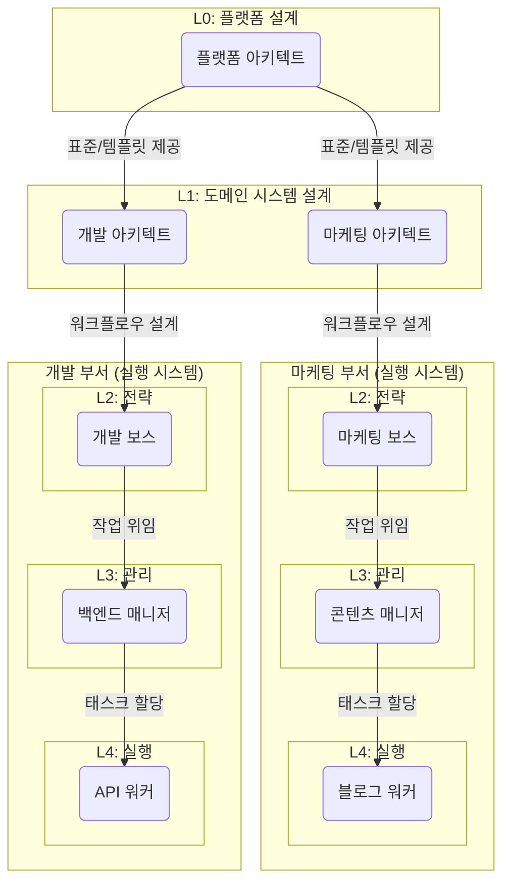
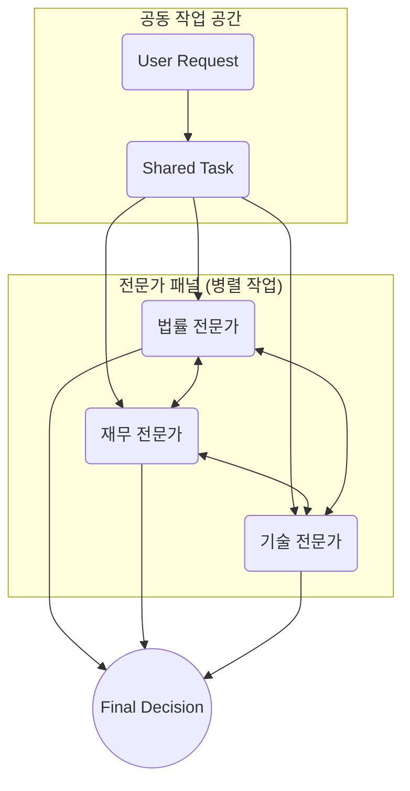
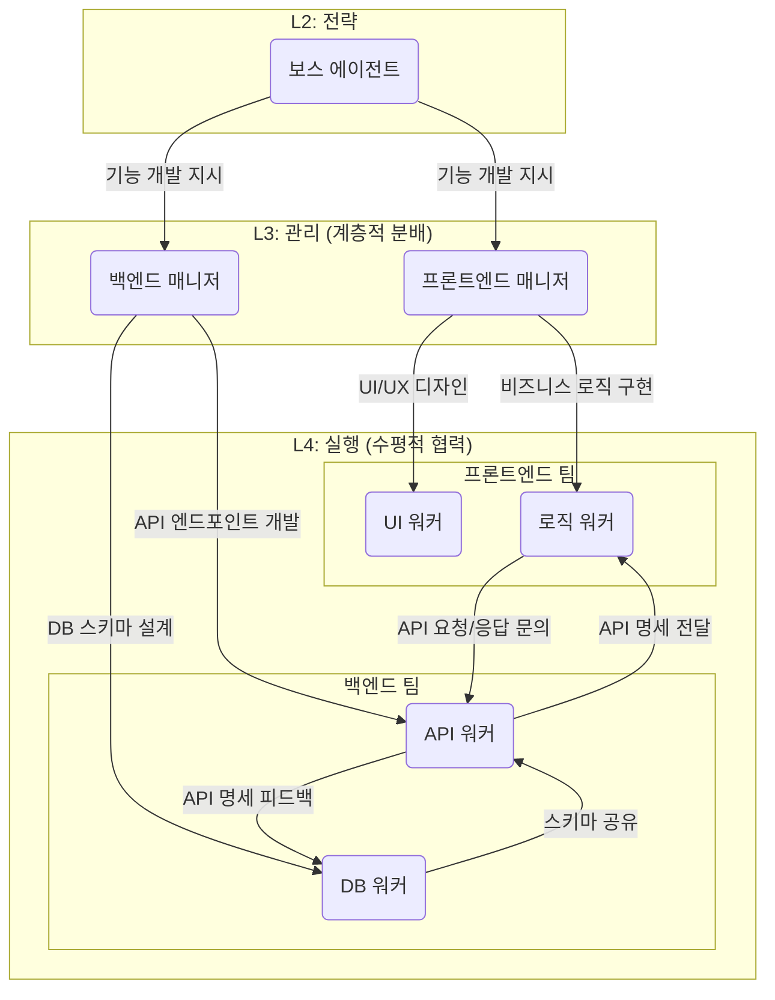

# 7장. 처리 방법과 워크플로우 설계

**Part 2: 인스트럭션 시스템 설계와 평가**

**목적:** 개별 에이전트들을 유기적으로 연결하여, 복잡한 실제 업무를 안정적으로 자동화하는 워크플로우를 설계하는 방법을 배웁니다.

### 이 장에서 배우는 것
- 개별 에이전트를 넘어 워크플로우 설계가 필요한 이유.
- 워크플로우를 구성하는 핵심 요소(에이전트, 태스크, 핸드오프 등)에 대한 이해.
- 파이프라인, 생성-검증 등 일반적인 워크플로우 설계 패턴.
- 실패에 대비하고 시스템의 안정성을 높이는 핸드오프 및 복원력 설계 방법.
- 에이전트 계층 구조, 동적 피드백 루프 등 고급 워크플로우 아키텍처.

## 7.1 왜 워크플로우 설계가 필요한가?

5장과 6장을 통해 우리는 명확한 역할과 입/출력 명세를 가진 개별 전문가 에이전트를 만드는 법을 배웠습니다. 이는 마치 뛰어난 바이올리니스트, 첼리스트, 피아니스트를 각각 섭외한 것과 같습니다. 하지만 이들이 모여 아름다운 교향곡을 연주하게 하려면, 누가 언제 연주를 시작하고, 어떤 빠르기로 연주하며, 어떻게 서로 조화를 이룰지 지휘하는 '악보'와 '지휘자'가 필요합니다. **워크플로우 설계**는 바로 이 '악보'를 그리고 '지휘'의 규칙을 정하는 과정입니다.

### 7.1.1 복잡성 관리

'신규 기능 출시'와 같은 실제 업무는 코드 작성, 테스트, 문서 업데이트, 고객 공지 등 여러 단계와 다양한 전문성이 필요합니다. 이를 하나의 거대 에이전트에게 맡기는 것은 비효율적이고 실패 확률이 높습니다. 워크플로우 설계는 이 복잡한 과업을 각 에이전트가 맡을 수 있는 작은 태스크로 나누고, 전체 프로세스를 조율하여 복잡성을 관리 가능한 수준으로 유지합니다.

### 7.1.2 불안정한 핸드오프(Handoff)

에이전트 간의 작업 전달은 마치 릴레이 경주의 '바통 터치'와 같습니다. 앞선 주자가 다음 주자에게 바통을 제대로 전달하지 못하면(불안정한 핸드오프[^1]), 경기는 그대로 중단됩니다. 한 에이전트의 결과물이 다음 에이전트가 기대하는 입력 형식과 다르면, "Garbage In, Garbage Out" 문제가 에이전트 사이에서 발생하여 전체 라인이 멈춰버립니다. 워크플로우는 이 핸드오프 과정을 명확한 '계약'으로 정의하여, 시스템이 안정적으로 작동하도록 보장합니다.

### 7.1.3 연쇄 실패(Cascading Failures)

여러 에이전트가 사슬처럼 연결된 작업에서, 중간의 한 에이전트가 실패하면 전체 프로세스가 중단될 수 있습니다. 이는 마치 공연 중 한 배우가 실수를 했을 때, 아무런 대비책이 없다면 공연 전체가 엉망이 되는 것과 같습니다. 워크플로우 설계는 이러한 실패 상황을 미리 예측하고, 재시도나 대체 경로 같은 '컨틴전시 플랜(비상 계획)'을 마련하여 시스템의 안정성과 복원력을 높입니다.

## 7.2 무엇을 설계해야 하는가?: 워크플로우의 구성 요소

'워크플로우'는 공동의 목표를 달성하기 위해 여러 에이전트의 태스크를 조율하는 자동화된 프로세스입니다. 잘 설계된 워크플로우는 다음과 같은 핵심 구성 요소들을 명확히 정의해야 합니다.

- **에이전트 (Agents):** 워크플로우의 '일꾼'입니다. 5장에서 설계한 것처럼, 각자 명확한 역할, 책임, 제약을 가집니다. (예: 코드 생성 에이전트, 데이터 분석 에이전트)
- **태스크 (Tasks):** 에이전트가 수행하는 개별 작업 단위입니다. 4장의 **원자성(Atomicity)** 원칙에 따라, 태스크는 '성공' 또는 '실패'로 명확히 끝나는 최소 단위로 설계하는 것이 이상적입니다.
- **핸드오프 (Handoffs):** 한 태스크(에이전트)의 결과물을 다음 태스크(에이전트)에게 전달하는 방식과 데이터에 대한 약속(프로토콜)입니다. 6장에서 설계한 입/출력 명세가 에이전트 간의 '인터페이스' 역할을 합니다.
- **트리거 (Triggers):** 워크플로우를 시작시키는 이벤트입니다. 특정 시간(예: 매일 오전 9시), 특정 파일 업로드, 외부 시스템의 API 호출 등 다양합니다.
- **실패 처리 규칙 (Failure Handling Rules):** 태스크 실패 시 대처 방법을 정의한 '컨틴전시 플랜'입니다. (예: 3회까지 재시도, 실패 시 담당자에게 알림)

### 실행의 주체: 자동화된 시스템 vs. 인간 중심 협업

워크플로우의 각 단계를 '누가' 실행하는지에 따라, 워크플로우는 크게 두 가지 모델로 나뉩니다. 이 책은 두 가지 모델을 모두 다룹니다.

1.  **완전 자동화 모델 (Fully-Automated Model):** '워크플로우 엔진'이 `workflow.yaml`을 읽고, 한 AI 에이전트의 작업이 끝나면 그 결과물을 다음 AI 에이전트에게 자동으로 전달하여 전체 프로세스를 실행합니다. 주로 데이터 처리, 콘텐츠 생성 등 기계가 모든 것을 처리할 수 있는 작업에 적합합니다. (예: 7.4.1 콘텐츠 제작 자동화)

2.  **인간 중심 협업 모델 (Human-Centric Model):** `workflow.yaml`은 '프로젝트 계획서' 역할을 합니다. 각 단계는 특정 '사람(팀)'이 담당하며, AI 에이전트는 그 사람의 업무를 돕는 '지능형 비서' 역할을 합니다. 단계 간의 전달(Handoff)은 사람이 직접 수행합니다. 복잡한 의사결정이 필요하거나, 여러 팀의 협업이 중요한 프로젝트에 적합합니다. (예: 10.10 신제품 마케팅 캠페인)

어떤 모델을 선택할지는 해결하려는 문제의 특성에 따라 달라지며, 좋은 설계자는 두 모델을 유연하게 조합하여 사용할 수 있어야 합니다.

## 7.3 어떻게 설계하는가?: 견고한 워크플로우 구축 패턴

견고하고 효율적인 워크플로우를 구축하기 위해, 우리는 4장에서 배운 메타 원칙들을 바탕으로 몇 가지 검증된 설계 패턴과 기법을 적용할 수 있습니다. 여기서 소개하는 패턴 중 다수는 Gregor Hohpe와 Bobby Woolf가 정립한 고전적인 '엔터프라이즈 통합 패턴'[^2]에 기반을 두고 있습니다.

### 7.3.1 기본 워크플로우 패턴

- **파이프라인 패턴 (Pipeline Pattern)[^3]:** 가장 기본적인 순차 처리 구조(A → B → C)입니다. '오디오 파일 텍스트 변환 → 변환된 텍스트 요약 → 요약문 번역'과 같이, 이전 단계의 출력이 다음 단계의 입력으로 직접 이어지는 간단한 프로세스에 적합합니다.
- **파이프라인 패턴 (Pipeline Pattern)[^3]:** 가장 기본적인 **직렬(Sequential)** 처리 구조(A → B → C)입니다. '오디오 파일 텍스트 변환 → 변환된 텍스트 요약 → 요약문 번역'과 같이, 이전 단계의 출력이 다음 단계의 입력으로 직접 이어지는 **완전 자동화 모델**의 기본입니다.

  ```mermaid
  graph TD
      A[아이디어 확장 에이전트] --> B[트윗 작성 에이전트]
      B --> C[해시태그 추천 에이전트]
      A[1. 텍스트 변환 에이전트] --> B[2. 요약 에이전트]
      B --> C[3. 번역 에이전트]
  ```

- **생성-검증 패턴 (Generate-and-Validate Pattern):** 5장에서 할루시네이션 문제의 해결책으로 제시된 패턴입니다. 하나의 '생성 에이전트'가 초안을 만들면, 다른 '검증 에이전트'가 사실 여부, 품질, 요구사항 준수 여부를 검토하고 수정합니다. 결과물의 신뢰도를 높이는 데 매우 효과적입니다.

  ```mermaid
  graph LR
      A[생성 에이전트] -- 초안 전달 --> B(검증 에이전트)
      B -- 수정 필요 --> A
      B -- 최종 승인 --> C((완료))
  ```

- **분기 패턴 (Routing Pattern):** 입력의 내용이나 조건에 따라 다음에 실행될 에이전트를 동적으로 결정하는 구조입니다. 예를 들어, '라우터 에이전트'가 고객 문의를 분석하여 '기술 지원 문의'는 개발팀 에이전트에게, '결제 문의'는 재무팀 에이전트에게 작업을 분배하는 방식입니다.

  ```mermaid
  graph TD
      A(고객 문의) --> B{라우터 에이전트}
      B -- 기술 지원? --> C[개발팀 에이전트]
      B -- 결제 문의? --> D[재무팀 에이전트]
  ```


### 7.3.2 견고한 핸드오프 설계

에이전트 간의 핸드오프는 워크플로우의 가장 취약한 지점 중 하나입니다. 6장에서 배운 구조화된 입/출력 설계를 '계약'으로 활용하여 핸드오프의 안정성을 보장해야 합니다.

- **표준화된 데이터 구조:** 모든 에이전트는 JSON Schema 등으로 명확히 정의된 데이터 구조로만 소통해야 합니다. 에이전트 A의 출력 스키마는 에이전트 B의 입력 스키마와 완벽히 호환되어야 합니다.
- **상태 정보 포함:** 데이터뿐만 아니라, 이전 태스크의 성공/실패 여부, 오류가 발생했다면 오류 코드와 메시지 등 '메타데이터'를 함께 전달해야 합니다. 이를 통해 다음 에이전트는 이전 상황을 명확히 인지하고 적절한 행동을 취할 수 있습니다.

### 7.3.3 실패 및 복원력 설계

워크플로우는 반드시 실패할 수 있다는 전제하에, 4장의 **실패 안전(Fail-safe)** 원칙을 적용하여 복원력을 설계해야 합니다.

- **재시도 (Retry):** 네트워크 타임아웃이나 일시적인 API 오류와 같이, 잠시 후 다시 시도하면 성공할 가능성이 있는 오류에 대해서는 실패할 때마다 점점 더 긴 시간 간격을 두고 재시도(엑스포넨셜 백오프[^4])하는 방식으로 2~3회 자동 재시도를 구현합니다.
- **대체 경로 (Fallback):** 핵심 에이전트가 실패했을 때, 더 단순하지만 최소한의 기능은 수행하는 '대체 에이전트'를 실행하거나, 즉시 담당자에게 알림을 보내 수동 개입을 요청하는 경로를 마련합니다.
- **모니터링 및 로깅:** 4장의 **투명성 및 추적 가능성(Transparency & Traceability)** 원칙에 따라, 모든 태스크의 시작과 끝, 입/출력 데이터, 성공/실패 상태를 로그로 기록해야 합니다. 이는 문제 발생 시 원인을 신속하게 진단하고 워크플로우를 개선하는 데 필수적입니다.

## 7.4 실제 워크플로우 설계 예제

이론적인 패턴들을 실제 업무에 어떻게 적용할 수 있을까요? 두 가지 구체적인 시나리오를 통해 워크플로우 설계 과정을 살펴보겠습니다.

### 7.4.1 예제 1: 콘텐츠 제작 및 발행 자동화

**목표:** "AI 최신 동향"이라는 주제의 블로그 포스트를 아이디어 단계부터 발행까지 자동화한다.

이 워크플로우는 **파이프라인 패턴**과 **생성-검증 패턴**을 결합하여 콘텐츠의 품질과 일관성을 보장합니다.

- **워크플로우 다이어그램:**
  ```mermaid
  graph TD
      subgraph "아이디어 구체화"
          A[아이디어 분석 에이전트] --> B{개요 확정}
      end
      subgraph "콘텐츠 생성"
          B --> C[초안 작성 에이전트]
          C --> D[이미지 생성 에이전트]
      end
      subgraph "검증 및 수정"
          D -- 초안 전달 --> E(교정/편집 에이전트)
          E -- 수정 요청 --> C
          E -- 최종 승인 --> F
      end
      subgraph "발행"
          F[발행 에이전트] --> G((CMS 업로드 완료))
      end
  ```

- **에이전트별 역할:**
  1.  **아이디어 분석 에이전트:**
      - **입력:** `"AI 최신 동향"` (주제)
      - **역할:** 관련 키워드, 타겟 독자층, 경쟁 콘텐츠를 분석하여 3~4개의 소제목으로 구성된 개요(Outline)를 생성합니다.
      - **출력:** `{ "title": "AI 최신 동향 분석", "outline": ["서론: 왜 AI 동향이 중요한가?", "주요 동향 1: 멀티모달", "..."] }` (JSON)
  2.  **초안 작성 에이전트:**
      - **입력:** 아이디어 분석 에이전트가 생성한 개요 JSON
      - **역할:** 개요에 맞춰 각 섹션의 본문을 작성합니다.
      - **출력:** `{ "title": "...", "content": "최근 AI 기술은...", "image_requests": ["멀티모달 개념도", "..."] }`
  3.  **이미지 생성 에이전트:**
      - **입력:** 초안 본문과 이미지 요청 목록
      - **역할:** 본문 내용과 요청에 가장 적합한 이미지를 생성하거나 스톡 이미지 사이트에서 검색합니다.
      - **출력:** `{ "content_with_images": "......" }`
  4.  **교정/편집 에이전트 (검증자):**
      - **입력:** 이미지가 포함된 원고
      - **역할:** 맞춤법, 문법, 스타일 가이드 준수 여부를 검토합니다. 중대한 오류 발견 시, 수정을 위해 **초안 작성 에이전트**에게 피드백과 함께 작업을 반환합니다. (생성-검증 루프)
      - **출력:** 최종 승인된 원고 또는 수정 요청
  5.  **발행 에이전트:**
      - **입력:** 최종 승인된 원고
      - **역할:** 원고를 워드프레스나 벨로그 같은 CMS(콘텐츠 관리 시스템) API를 통해 업로드하고 '발행 예약' 상태로 설정합니다.
      - **출력:** `{ "status": "success", "post_url": "..." }`

- **워크플로우 코드 예시 (`workflow.yaml`):**
  이러한 흐름은 다음과 같은 워크플로우 정의 파일로 표현될 수 있습니다. 이 파일은 전체 프로세스를 조율하는 '매니저 에이전트'가 읽고 실행하는 설계도 역할을 합니다.

  ```yaml
  # /workflows/content_creation.yaml
  name: Blog Post Generation Pipeline
  trigger: Manual

  steps:
    - name: 1. Analyze Idea
      agent: agents/idea_analyzer.md
      inputs:
        - topic: "AI 최신 동향"
      outputs:
        - file: outline.json

    - name: 2. Draft Content
      agent: agents/draft_writer.md
      inputs:
        - file: outline.json
      outputs:
        - file: draft.json

    - name: 3. Generate Images
      agent: agents/image_generator.md
      inputs:
        - file: draft.json
      outputs:
        - file: draft_with_images.md

    - name: 4. Review and Edit
      agent: agents/editor.md
      inputs:
        - file: draft_with_images.md
      outputs:
        - file: final_content.md
      # 이 단계에서 '수정 필요' 시 2단계로 피드백과 함께 돌아가는
      # 조건부 로직(피드백 루프)을 추가할 수 있습니다.

    - name: 5. Publish Content
      agent: agents/publisher.md
      inputs:
        - file: final_content.md
      outputs:
        - file: publish_result.json
  ```

### 7.4.2 예제 2: 고객 지원 티켓 처리 자동화

**목표:** 이메일로 접수된 고객 문의를 자동으로 분류하고, 가능한 경우 즉시 해결하며, 복잡한 문제는 담당자에게 전달한다.

이 워크플로우는 **분기 패턴**과 **계층적 협력 시스템**을 활용하여 효율성과 고객 만족도를 동시에 높입니다.

- **워크플로우 다이어그램:**
  ```mermaid
  graph TD
      A(고객 이메일 접수) --> B{라우터 에이전트};
      B -- "결제 문의" --> C[FAQ 답변 에이전트];
      B -- "기술 지원" --> D[기술 분석 에이전트];
      B -- "기타 문의" --> E[인간 상담사 전달];

      C -- 해결 가능 --> F((자동 답변 발송));
      C -- 해결 불가 --> E;
      
      D -- 로그 분석 후 해결 --> F;
      D -- 추가 정보 필요 --> E;
  ```

- **에이전트별 역할:**
  1.  **라우터 에이전트 (매니저):**
      - **입력:** 고객 이메일 본문
      - **역할:** 이메일 내용을 분석하여 문의 유형을 `결제`, `기술`, `계정`, `기타` 등으로 분류하고, 적절한 다음 에이전트에게 작업을 전달하는 **분기** 역할을 수행합니다.
      - **출력:** `{ "ticket_id": "...", "category": "기술", "summary": "...", "original_email": "..." }`
  2.  **FAQ 답변 에이전트 (워커):**
      - **입력:** 분류된 문의 데이터
      - **역할:** 내부 FAQ 데이터베이스를 검색하여 해당 문의에 답변할 수 있는지 확인합니다. 답변 가능 시, 고객의 이름 등을 포함하여 개인화된 답변 초안을 생성합니다.
      - **출력:** `{ "status": "resolved", "answer": "..." }` 또는 `{ "status": "escalation_needed" }`
  3.  **기술 분석 에이전트 (워커):**
      - **입력:** 기술 지원으로 분류된 문의 데이터
      - **역할:** 고객의 계정 ID를 기반으로 서버 로그나 데이터베이스를 조회하여 오류의 원인을 진단합니다. 알려진 문제일 경우 해결책을 제시합니다.
      - **출력:** `{ "status": "resolved", "answer": "..." }` 또는 `{ "status": "escalation_needed", "analysis_report": "..." }`
  4.  **인간 상담사 전달 에이전트:**
      - **입력:** 해결 불가(`escalation_needed`)로 판정된 모든 문의
      - **역할:** Zendesk나 Jira 같은 티켓 관리 시스템에 새로운 티켓을 생성합니다. 이때, 이전 에이전트들이 분석한 내용(문의 요약, 로그 분석 결과 등)을 티켓에 자동으로 첨부하여 상담사가 상황을 빠르게 파악하도록 돕습니다.
      - **출력:** `{ "ticket_system_id": "...", "message": "상담사에게 전달되었습니다." }`

- **워크플로우 코드 예시 (`workflow.yaml`):**
  이 고객 지원 워크플로우는 조건에 따라 작업 흐름이 나뉘는 **분기 패턴**을 포함합니다.

  ```yaml
  # /workflows/customer_support.yaml
  name: Customer Support Ticket Automation
  trigger: New Email

  steps:
    - name: 1. Route Ticket
      agent: agents/router.md
      inputs:
        - email_body: "{{trigger.email.body}}"
      outputs:
        - file: ticket_info.json

    - name: 2. Process Ticket
      type: switch # 입력 조건에 따라 다른 경로 실행
      input: "{{steps.1.outputs.ticket_info.json.category}}"
      cases:
        - value: "결제"
          next_step: 3.1
        - value: "기술"
          next_step: 3.2
        - default: 4 # 그 외의 경우

    - name: 3.1. Answer FAQ
      agent: agents/faq_responder.md
      inputs:
        - file: ticket_info.json
      outputs:
        - file: resolution.json
      # 이 단계의 결과에 따라 다시 분기하여, 해결되면 5단계로,
      # 해결 불가 시 4단계로 이동할 수 있습니다.

    - name: 3.2. Analyze Technical Issue
      agent: agents/tech_analyzer.md
      inputs:
        - file: ticket_info.json
      outputs:
        - file: resolution.json

    - name: 4. Escalate to Human
      agent: agents/human_escalator.md
      inputs:
        - file: ticket_info.json
        - analysis_data: "{{steps.3.outputs.resolution.json}}" # 이전 단계 결과
      outputs:
        - file: escalation_result.json

    - name: 5. Send Auto-Reply
      agent: agents/reply_sender.md
      inputs:
        - file: resolution.json
      outputs:
        - status: "Email Sent"
  ```

이러한 구체적인 예제들을 통해, 우리는 추상적인 패턴들이 어떻게 조합되어 실제 업무의 복잡성을 해결하는 강력한 자동화 시스템으로 구현될 수 있는지 이해할 수 있습니다.

## 7.5 고급 워크플로우 패턴과 아키텍처

지금까지는 비교적 단순한 워크플로우 패턴을 살펴보았습니다. 이제 더 복잡하고 동적인 문제를 해결하기 위한 고급 아키텍처를 알아봅니다.

### 7.5.1 에이전트 협력 시스템의 두 가지 패러다임

에이전트들이 협력하는 방식은 크게 **계층적 협력 시스템**과 **수평적 협력 시스템** 두 가지로 나눌 수 있습니다.

#### 계층적 에이전트 협력 시스템 (Hierarchical Agent Collaboration)

실제 회사 조직처럼, 에이전트에게 명확한 위계질서를 부여하여 복잡한 문제를 효율적으로 해결하는 방식입니다. 조직의 규모와 복잡성에 따라, 아키텍트의 역할은 **플랫폼 아키텍트**와 **도메인 아키텍트**로 분화될 수 있습니다.



- **메타 에이전트:** 가장 상위 계층으로, 문제 해결을 위한 에이전트 팀과 워크플로우 자체를 설계합니다. (예: "사용자 이탈률 분석 프로젝트를 위해 필요한 팀 구성과 업무 흐름을 설계하라.")
- **보스 에이전트:** 최종 목표를 이해하고, 이를 전략적 의사결정을 통해 여러 매니저에게 위임합니다. (예: "우리 앱의 사용자 이탈률을 분석하고 개선안을 도출하라.")
- **비서 에이전트:** 보스를 보조하여 정보를 수집·정리하고, 매니저들의 진행 상황을 모니터링하며, 보스의 의사결정을 지원합니다. (예: `일정 관리 비서`, `정보 수집 비서`, `상황 보고 비서`)
- **매니저 에이전트:** 위임받은 중간 목표를 달성하기 위해, 여러 워커 에이전트들을 조율하고 작업 순서를 결정합니다. (예: `데이터 분석 매니저`, `리포트 생성 매니저`)
- **워커 에이전트:** 구체적인 단일 태스크를 수행합니다. (예: `DB 조회 워커`, `그래프 생성 워커`, `텍스트 요약 워커`)

이 계층 구조는 복잡한 목표를 체계적으로 분해하고, 각 계층이 자신의 추상화 수준에서 최적의 의사결정을 내릴 수 있게 합니다.

#### 에이전트 계층별 역할 요약

이 책에서 다루는 에이전트들의 계층과 역할을 정리하면 다음과 같습니다.

| 계층 (Level) | 에이전트 종류 | 핵심 역할 (Key Role) | 주요 산출물 (Primary Output) |
| :--- | :--- | :--- | :--- |
| **L0: 시스템 설계** | **메타 에이전트** | 아키텍트 에이전트를 **설계/개선** | 아키텍트 에이전트의 인스트럭션 (`architect.md`) |
| **L1: 실행 시스템 설계** | **아키텍트 에이전트** | 실행 에이전트 팀과 워크플로우를 **설계/개선** | 실행 시스템의 워크플로우 (`workflow.yaml`) 및 에이전트 인스트럭션 (`*.md`) |
| **L2: 전략 및 조율** | **보스 에이전트** | 최종 목표 설정 및 전략적 의사결정 | 명확한 목표 (`goal.json`) |
| | **비서 에이전트** | 보스 보좌, 정보 취합/요약, 계획 수립 | 실행 계획 (`plan.md`), 요약 보고서 (`summary.md`) |
| | **코디네이터 에이전트** | 정의된 워크플로우를 순서대로 **실행/조율** | 워크플로우 실행 결과 |
| **L3: 전술 및 관리** | **매니저 에이전트** | 담당 분야의 중간 목표 달성을 위해 워커들을 **관리/오케스트레이션** | 팀별 성과 보고서 (`report.json`) |
| **L4: 실행** | **워커 에이전트** | 구체적이고 원자적인 단일 태스크 **수행** | 코드, 텍스트, 이미지 등 구체적인 결과물 |

이 표는 10장에서 살펴볼 다양한 아키텍처 예제를 이해하는 데 중요한 기준점이 될 것입니다.

#### 수평적 에이전트 협력 시스템 (Horizontal Agent Collaboration)

계층 없이 동등한 위치의 에이전트들이 협력하여 문제를 해결하는 방식입니다. 각 에이전트는 전문 영역에서 자율적으로 작업하며, 필요시 서로 소통하고 협업합니다.



- **전문가 패널 (Expert Panel):** 여러 전문 에이전트가 동일한 문제에 대해 각자의 관점으로 분석하고, 그 결과를 종합하여 최종 의사결정을 내립니다. (예: `법률 전문가`, `재무 전문가`, `기술 전문가`가 계약서를 각자의 관점에서 검토)
- **동료 검토 (Peer Review):** 동일한 역할을 가진 에이전트들이 서로의 결과물을 교차 검토하고 합의된 결과물을 도출합니다. (예: 두 명의 번역 에이전트가 서로의 번역을 검토하여 최종 번역문 합의)
- **라운드 로빈 (Round Robin):** 에이전트들이 순서대로 문제를 개선하며, 각자가 이전 에이전트의 결과물을 발전시킵니다. (예: 작가 → 편집자 → 디자이너 → 작가 순으로 순환하며 콘텐츠 개선)

수평적 시스템은 에이전트 간 권한이 동등하므로, 의사결정이 분산되고 각 전문가의 자율성이 보장되는 장점이 있습니다.

#### 복합적 협력 시스템 (Hybrid Collaboration)

실제 복잡한 시스템에서는 계층적 구조와 수평적 구조가 함께 사용되는 복합적인 형태가 더 일반적입니다. 즉, 전체적으로는 상위 관리자가 작업을 분배하는 계층적 구조를 가지면서, 특정 팀이나 단계에서는 전문가들이 수평적으로 협력하는 방식입니다.

예를 들어, '신규 앱 기능 개발'이라는 큰 목표 아래, **보스 에이전트**가 `프론트엔드 매니저`와 `백엔드 매니저`에게 작업을 할당하는 것은 **계층적** 협력입니다. 하지만 `백엔드 매니저` 팀 내에서 `DB 워커`와 `API 워커`가 서로의 결과물(DB 스키마와 API 명세)을 조율하는 것은 **수평적** 협력입니다.



이러한 복합적 접근법은 계층 구조의 명확한 책임 분담과 효율성, 그리고 수평 구조의 유연성과 품질 향상이라는 두 마리 토끼를 모두 잡을 수 있는 현실적인 해결책입니다.

### 7.5.2 동적 피드백 루프 (Dynamic Feedback Loops)

단순한 '생성-검증'을 넘어, 에이전트들이 서로의 작업을 동적으로 수정하고 개선하는 루프를 설계할 수 있습니다.

- **계층적 피드백:** 워커의 결과물이 만족스럽지 않으면, 매니저가 워커에게 수정을 지시하고, 기준을 통과할 때까지 이 과정이 반복됩니다.
- **수평적 피드백:** 동등한 위치의 에이전트들이 서로의 결과물에 대해 피드백을 주고받으며, 합의점에 도달할 때까지 반복적으로 개선합니다.

### 7.5.3 메타 에이전트 (Meta Agents)

이 책의 궁극적인 목표는 **'메타 에이전트(Meta Agent)'**를 설계하는 것입니다. 메타 에이전트는 이 책에서 다루는 가장 높은 수준의 추상화 계층에 위치하며, 에이전트 시스템이 스스로를 설계하고 개선하는 완전한 자율성을 상징합니다.

이 목표를 이해하기 위해, 에이전트 시스템의 계층 구조를 다음과 같이 정의할 수 있습니다.

1.  **메타 에이전트 (Meta Agent):** 이 책의 최종 목표입니다. 이 에이전트의 유일한 임무는 아래 단계의 **'아키텍트 에이전트'를 만들고 개선**하는 것입니다. 즉, 시스템을 설계하는 에이전트를 설계하는 역할을 합니다.
2.  **아키텍트 에이전트 (Architect Agent):** 메타 에이전트에 의해 생성되고 관리됩니다. 이 에이전트의 역할은 실제 비즈니스 문제를 해결하기 위한 **실행 에이전트(보스, 워커 등)와 그들의 워크플로우(`workflow.yaml`)를 만들고 개선**하는 것입니다.
3.  **실행 에이전트 (Execution Agent):** 아키텍트 에이전트가 설계한 워크플로우에 따라 실제 업무를 수행하는 모든 에이전트(보스, 비서, 매니저, 워커, 코디네이터 등)를 총칭합니다.

일반적인 실행 에이전트가 '주어진 문제'를 해결한다면, 아키텍트 에이전트는 '실행 시스템을 설계'하고, 메타 에이전트는 '아키텍트 에이전트를 설계'합니다.

이러한 고급 아키텍처의 구체적인 구현 예시는 **10장 4부: 고급 아키텍처와 실전 구현**에서 심도 있게 다룰 것입니다.

## 참고 자료

- Hohpe, G., & Woolf, B. (2003). Enterprise Integration Patterns: Designing, Building, and Deploying Messaging Solutions. Addison-Wesley Professional. https://www.enterpriseintegrationpatterns.com/
- Google SRE. Cascading Failures. https://sre.google/sre-book/cascading-failures/
- Google SRE. Handling Overload (Exponential Backoff and Jitter). https://sre.google/sre-book/handling-overload/

---

[^1]: **핸드오프(Handoff):** 하나의 작업 단위(에이전트, 컴포넌트)에서 다른 작업 단위로 책임과 제어권, 그리고 관련 데이터를 전달하는 프로세스. 시스템의 각 부분이 원활하게 협력하기 위한 핵심적인 '연결' 과정이다.

[^2]: **엔터프라이즈 통합 패턴(Enterprise Integration Patterns):** 기업 환경에서 서로 다른 애플리케이션과 시스템들을 안정적이고 확장 가능하게 연동하기 위한 재사용 가능한 해결책들의 모음. 비동기 메시징 기반의 다양한 패턴을 제시하며, 현대적인 분산 시스템 설계에 큰 영향을 주었다.

[^3]: **파이프라인 패턴(Pipeline Pattern):** 여러 처리 단계를 순차적으로 연결하여, 각 단계가 이전 단계의 출력을 입력으로 받아 작업을 수행하는 구조. 데이터 처리 및 변환 작업에 널리 사용된다.

[^4]: **엑스포넨셜 백오프(Exponential Backoff):** 실패한 작업을 재시도할 때, 매번 시도 간의 시간 간격을 기하급수적으로 늘리는 알고리즘. 일시적인 과부하 상태에 있는 시스템이 스스로 회복할 시간을 주어, 연속적인 재시도로 인한 시스템 붕괴를 막는 데 효과적이다.
