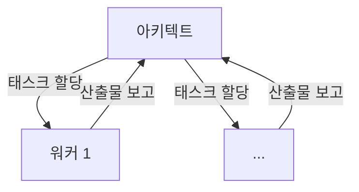
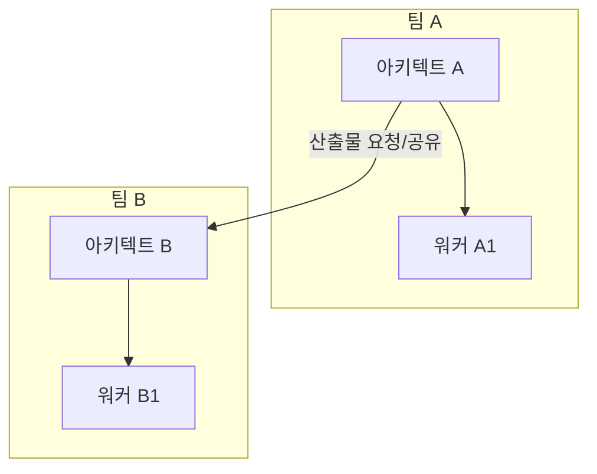
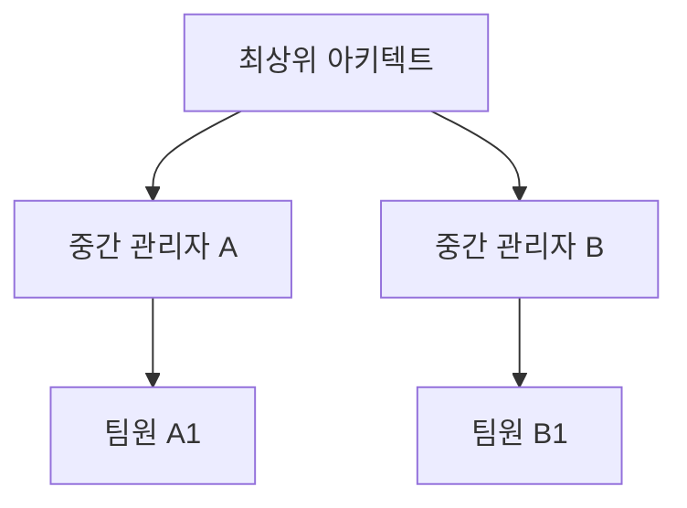
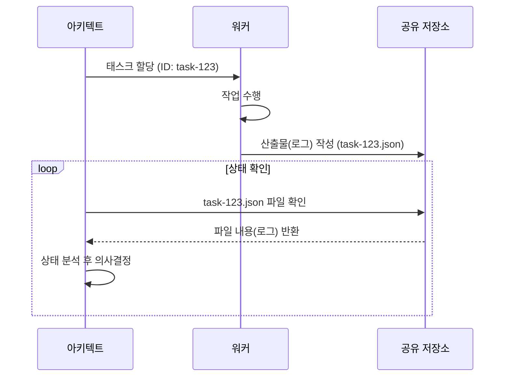

# 7장. 프로세스 설계: 협업 워크플로우 만들기

**Part 2: 인스트럭션 시스템 설계와 평가**

**목적:** 개별 전문가 에이전트들을 유기적으로 연결하여, 복잡한 실제 업무를 안정적으로 자동화하는 워크플로우를 **인스트럭션만으로 설계하는 방법**을 배웁니다.

### 이 장에서 배우는 것
- 왜 하나의 거대 에이전트가 아닌, 여러 에이전트의 협업이 필요한가.
- LLM 프레임워크의 접근법과 **인스트럭션 기반 접근법**의 차이점.
- 에이전트 간의 소통 규약, **산출물 인터페이스**의 설계 방법.
- 협력의 복잡도에 따라 발전하는 **4단계 협업 아키텍처**.
- **산출물 기반 실행 감독** 및 다중 작업 관리 방법.

---

## 7.1 문제 해결 방식의 진화: ‘협업’의 필요성

5장과 6장에서 우리는 명확한 역할과 입/출력을 가진 개별 전문가 에이전트를 만들었습니다. 하지만 ‘신규 기능 출시’ 같은 실제 업무는 단 한 명의 전문가가 해결할 수 없습니다. 코드 작성, 테스트, 문서 업데이트, 고객 공지 등 여러 전문가의 ‘협업’이 필요합니다.

이를 하나의 거대 에이전트에게 맡기는 것은 모든 일을 한 사람에게 맡기는 것과 같아 비효율적이고 실패 확률이 높습니다. 따라서 우리는 여러 에이전트가 각자의 전문성에 따라 작업을 나누고, 서로의 결과물을 이어받아 처리하는 **워크플로우**를 설계해야 합니다.

### LLM 프레임워크 vs 인스트럭션 설계

시중의 LLM 개발 프레임워크(LangChain, LlamaIndex 등)는 코드를 통해 에이전트의 연결, 데이터 흐름, 실패 처리 등을 정의하는 강력한 기능을 제공합니다. 하지만 이는 종종 복잡한 코드와 프레임워크에 대한 깊은 이해를 요구합니다.

이 책에서 우리는 다른 접근법을 취합니다. 우리는 **잘 설계된 인스트럭션**과 **간단한 합의(프로토콜)**만으로 워크플로우를 구축합니다. 이는 일반 사용자나 개발자가 복잡한 기술 없이도 자신의 업무 프로세스를 자동화할 수 있도록 하는 것을 목표로 합니다. 프레임워크가 제공하는 ‘기능’들을 어떻게 ‘인스트럭션’으로 녹여낼 수 있는지에 집중해봅시다.

## 7.2 협업의 전제 조건: 산출물 인터페이스

본격적인 협업 모델을 살펴보기에 앞서, 모든 협업의 가장 기본이 되는 ‘소통 방식’을 정의해야 합니다. 에이전트들은 어떻게 서로의 작업을 인계받고, 진행 상황을 공유할까요? 그 해답은 **산출물(Artifact)**을 명확한 **인터페이스(Interface)**로 사용하는 데 있습니다.

산출물은 단순히 한 에이전트의 결과물이 아닙니다. 이는 워크플로우의 현재 상태를 나타내고, 다음 에이전트의 행동을 결정하며, 전체 프로세스의 기록을 담는 핵심 매개체입니다.

### 7.2.1 산출물의 이중적 역할

1.  **작업의 연결고리 (협업의 가능성):** 산출물은 에이전트 간의 ‘계약’입니다. A 에이전트의 산출물 형식과 B 에이전트의 입력 형식이 약속되어 있다면, 두 에이전트는 서로의 작업이 끝날 때까지 기다릴 필요 없이 **병렬적, 비동기적**으로 작업을 수행할 수 있습니다.

2.  **실행의 기록 (로그와 투명성):** 산출물은 그 자체로 ‘이전 단계에서 무슨 일이 있었는지’를 알려주는 명확한 **로그**가 됩니다. 문제가 발생했을 때, 각 단계의 산출물을 살펴보는 것만으로 어느 지점에서 문제가 발생했는지 쉽게 추적할 수 있습니다.

### 7.2.2 파일 기반 산출물 설계 가이드

-   **파일로 소통하세요:** 에이전트가 자신의 작업 결과를 특정 폴더에 명확한 이름의 파일로 저장하게 하세요.
-   **구조화된 데이터를 사용하세요:** 단순 텍스트보다 `JSON`이나 `YAML` 형식을 사용하여 데이터의 의미를 명확하게 전달하는 것이 좋습니다.
-   **상태와 데이터를 함께 담으세요:** 결과 데이터뿐만 아니라, 작업의 성공 여부, 타임스탬프 등 **메타데이터**를 함께 포함시켜 시스템의 상태를 명확히 하세요.

## 7.3 다중 에이전트 협업 아키텍처: 복잡도에 따른 진화

에이전트의 수와 상호작용의 복잡도에 따라 워크플로우 아키텍처는 자연스럽게 진화합니다.

### Level 1: 단위 업무 워크플로

-   **구조:** A → B → C (파이프라인)


-   **설명:** 이전 단계의 출력이 다음 단계의 입력으로 직접 이어집니다.

### Level 2: 아키텍트-워커 모델

-   **구조:** 아키텍트 1명 → 워커 N명



-   **설명:** 아키텍트가 작업을 계획하고 워커에게 분배합니다.

### Level 3: 수평적 협업 조직 (Agile Team Model)

-   **구조:** 여러 독립적인 팀(Squad)들이 서로 협력



-   **설명:** 각자 아키텍트-워커 모델을 가진 팀들이 수평적으로 협력합니다.

### Level 4: 계층적 협업 조직 (Hierarchical Model)

-   **구조:** CEO → 본부장 → 팀장 → 팀원



-   **설명:** 아키텍트-워커 모델이 조직의 계층을 따라 재귀적으로 확장됩니다.

## 7.4 실행 감독과 안정성 설계

아키텍트 에이전트가 워크플로우를 안정적으로 감독하기 위해서는 각 워커 에이전트의 작업 상태를 명확히 추적할 수 있어야 합니다. 우리는 **‘산출물이 곧 로그(Artifact as a Log)’**라는 간단한 규칙을 통해 이를 구현할 수 있습니다.

### 산출물을 이용한 실행 감독 및 로깅

모든 에이전트는 자신의 작업 결과를 **로그 정보가 포함된 표준화된 산출물**로 남겨야 합니다. 아키텍트는 이 산출물을 확인함으로써 전체 워크플로우를 감독합니다.

#### 1. 표준 로그 형식 포함

모든 산출물은 결과 데이터(data)와 함께, 작업 이력을 투명하게 보여주는 메타데이터(metadata)를 반드시 포함해야 합니다.

```json
// 예시: task-123_analysis.json
{
  "metadata": {
    "task_id": "task-123",
    "agent_name": "data-analyzer-v2",
    "status": "success", // "success", "failure"
    "timestamp_start": "2025-10-03T10:00:00Z",
    "timestamp_end": "2025-10-03T10:05:12Z"
  },
  "data": { /* 실제 결과 데이터 */ }
}
```

#### 2. 아키텍트의 모니터링 프로세스



아키텍트는 위 다이어그램처럼 주기적으로 공유 저장소를 확인하여 각 작업의 상태를 파악하고, 성공/실패 여부에 따라 다음 행동을 결정합니다.

## 7.5 확장: 다중 작업(Job) 관리

아키텍트 에이전트는 여러 종류의 워크플로 '템플릿'을 기반으로, 수많은 '작업(Job)'을 동시에 생성하고 관리해야 합니다. 이는 각 작업의 상태가 격리되도록 디렉토리 구조를 설계함으로써 체계적으로 관리할 수 있습니다.

### 1. 디렉토리 구조: 설계와 실행의 분리

워크플로의 '설계도(템플릿)'와 '실행 기록(작업)'은 명확히 분리하여 관리합니다.

-   **/workflows/**: 워크플로의 템플릿을 보관합니다. 각 워크플로는 **자체적인 폴더**로 관리하여 관련 파일들을 그룹화하고 확장성을 높입니다.
-   **/jobs/**: 실제 실행된 작업들을 저장합니다. 관리 효율성을 위해 **날짜별로 하위 디렉토리**를 생성하여 작업을 그룹화합니다.

**최종 디렉토리 구조 예시:**
```
/
├── workflows/
│   ├── ticket-processing/
│   │   └── workflow.json       // 워크플로 정의 파일
│   └── user-onboarding/
│       └── workflow.json
└── jobs/
    ├── 2025-10-03/
    │   ├── job_abc123/
    │   │   ├── _job_log.json       // 이 작업의 전체 상태 로그
    │   │   ├── ticket.txt          // 최초 입력 파일
    │   │   └── 01_category.json
    │   └── job_xyz789/
    │       └── ...
    └── 2025-10-04/
        └── ...
```

### 2. 아키텍트의 확장된 역할

1.  **신규 작업 접수:** 요청에 맞는 워크플로를 `/workflows/` 디렉토리에서 찾습니다. (e.g., `/workflows/ticket-processing/workflow.json`)
2.  **작업(Job) 생성:** `/jobs/` 아래에 **오늘 날짜(e.g., `2025-10-03`)** 디렉토리가 있는지 확인하고, 없으면 생성합니다. 그 후, 날짜 디렉토리 아래에 고유한 `job_id`를 가진 디렉토리를 만들어 작업을 초기화합니다.
3.  **다중 작업 감독:** `/jobs/` 디렉토리 전체를 순회하며 각 작업의 상태를 모니터링합니다.
4.  **컨텍스트 기반 작업 할당:** 워커 에이전트에게 **작업의 정확한 경로**를 알려줍니다. (e.g., "워커 A, `/jobs/2025-10-03/job_abc123/` 디렉토리의 `ticket.txt` 파일을 처리하라.")

> **향후 발전 방향**
> 대규모 시스템에서는 작업의 메타데이터를 **데이터베이스**에 저장하여 더 빠른 검색, 통계, 리포팅을 구현할 수 있습니다.

---