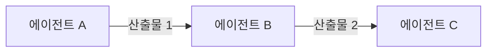
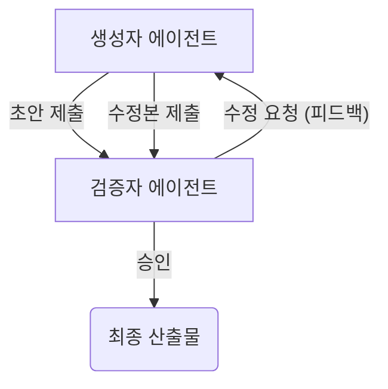

# 7장. 기본 워크플로우 패턴: 파이프라인과 피드백

**Part 2: 인스트럭션 시스템 설계와 평가**

**목적:** 단일 전문가 에이전트들을 연결하여 간단한 업무를 자동화하는 기본적인 워크플로우 패턴을 배웁니다. 복잡한 시스템을 설계하기 전, 가장 기초가 되는 두 가지 협업 방식인 '파이프라인'과 '생성-검증' 패턴을 익힙니다.

### 이 장에서 배우는 것
- 순차적인 업무 처리를 위한 **파이프라인(Pipeline) 패턴**.
- 결과물의 품질을 높이는 **생성-검증(Generate-and-Verify) 패턴**.
- `workflow.yaml` 파일을 통해 워크플로우를 코드가 아닌 **설정으로 정의**하는 방법.

---

## 7.1 순차적 협업: 파이프라인 패턴

가장 간단하고 직관적인 협업 방식은 **파이프라인(Pipeline)**입니다. 마치 공장의 조립 라인처럼, 한 에이전트의 작업 산출물(output)이 다음 에이전트의 입력(input)으로 순서대로 이어지는 구조입니다.

- **구조:** A → B → C
- **특징:** 데이터가 한 방향으로 흐르며, 각 단계는 이전 단계가 완료되어야 시작될 수 있습니다.



### 적용 사례: 콘텐츠 생성 파이프라인

1.  **아이디어 구체화(A):** 사용자의 간단한 아이디어를 입력받아, 블로그 포스트의 개요와 핵심 내용을 담은 `outline.md` 파일을 생성합니다.
2.  **초고 작성(B):** `outline.md` 파일을 입력받아, 완전한 형태의 블로그 포스트 초고인 `draft.md` 파일을 작성합니다.
3.  **교정 및 발행(C):** `draft.md` 파일을 입력받아, 문법 오류를 수정하고 서식을 다듬어 최종본인 `published.md` 파일을 만듭니다.

이처럼 파이프라인 패턴은 절차가 명확하고 순차적인 업무를 자동화하는 데 매우 효과적입니다.

## 7.2 피드백 기반 협업: 생성-검증 패턴

모든 업무가 한 방향으로만 흐르지는 않습니다. 때로는 결과물의 품질을 보장하기 위해 **검토와 수정** 과정이 필요합니다. 이때 사용하는 것이 **생성-검증(Generate-and-Verify) 패턴**, 또는 피드백 루프(Feedback Loop)입니다.

- **구조:** 생성자 ↔ 검증자
- **특징:** 한 에이전트가 결과물을 만들면(Generate), 다른 에이전트가 그 결과물을 평가하고 피드백을 제공합니다(Verify). 생성자는 이 피드백을 바탕으로 결과물을 수정하며, 이 과정은 특정 품질 기준을 만족할 때까지 반복될 수 있습니다.



### 적용 사례: 자동 코드 리뷰

1.  **코드 생성(생성자):** '개발자 에이전트'가 특정 기능 요구사항에 따라 `feature.py` 코드를 작성합니다.
2.  **리뷰 및 피드백(검증자):** '리뷰어 에이전트'가 `feature.py`를 읽고, 코딩 컨벤션, 잠재적 버그, 성능 이슈 등을 분석하여 `review_comment.txt` 파일을 생성합니다.
3.  **코드 수정(생성자):** '개발자 에이전트'는 `review_comment.txt`를 참고하여 `feature.py` 코드를 수정한 후 다시 제출합니다.
4.  **승인(검증자):** '리뷰어 에이전트'가 수정된 코드가 요구사항을 만족한다고 판단하면, 최종적으로 승인하고 워크플로우를 종료합니다.

## 7.3 워크플로우 정의하기: `workflow.yaml`

이러한 워크플로우를 실제 코드로 구현하는 대신, 우리는 간단한 설정 파일로 정의하여 '아키텍트 에이전트'가 이 파일을 읽고 작업을 총괄하도록 만들 수 있습니다. 이를 **'워크플로우 정의(Workflow Definition)'**라고 합니다.

`YAML` 형식은 사람이 읽고 쓰기 쉬워 워크플로우를 정의하는 데 적합합니다.

### `workflow.yaml` 예시 (콘텐츠 생성 파이프라인)

```yaml
# /workflows/content-creation/workflow.yaml

workflow_name: "콘텐츠 생성 파이프라인"

steps:
  - step: 1
    name: "개요 작성"
    agent: "outline-agent-v1"
    instructions: "주제 파일을 읽고 블로그 개요를 작성해줘."
    input: "topic.txt"
    output: "outline.md"

  - step: 2
    name: "초고 작성"
    agent: "draft-agent-v2"
    instructions: "개요 파일을 바탕으로 블로그 초고를 작성해줘."
    input: "outline.md"
    output: "draft.md"

  - step: 3
    name: "최종 교정"
    agent: "editor-agent-v1"
    instructions: "초고 파일의 문법과 스타일을 다듬어 최종본을 만들어줘."
    input: "draft.md"
    output: "published.md"
```

'아키텍트 에이전트'는 이 `workflow.yaml` 파일을 읽고 순서대로 각 단계(step)를 실행합니다. 각 단계마다 지정된 `agent`를 호출하고, 어떤 `input` 파일을 읽어 어떤 `output` 파일을 생성해야 하는지 지시합니다. 이처럼 워크플로우 자체를 데이터로 관리하면, 코드를 변경하지 않고도 `workflow.yaml` 파일만 수정하여 업무 프로세스를 유연하게 변경할 수 있습니다.

---

이제 우리는 가장 기본적인 두 가지 협업 패턴을 배웠습니다. 다음 장들에서는 이러한 기본 패턴들을 조합하고 확장하여, 10장에서 살펴볼 더 복잡한 '다중 에이전트 협업 아키텍처'로 나아갈 준비를 하게 될 것입니다.
