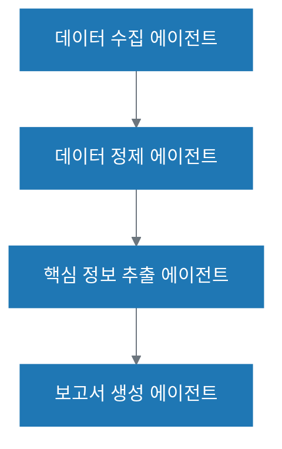
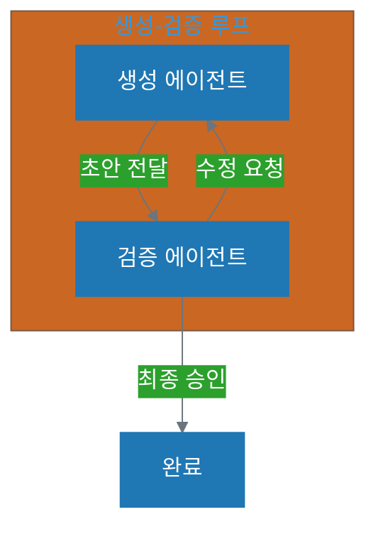
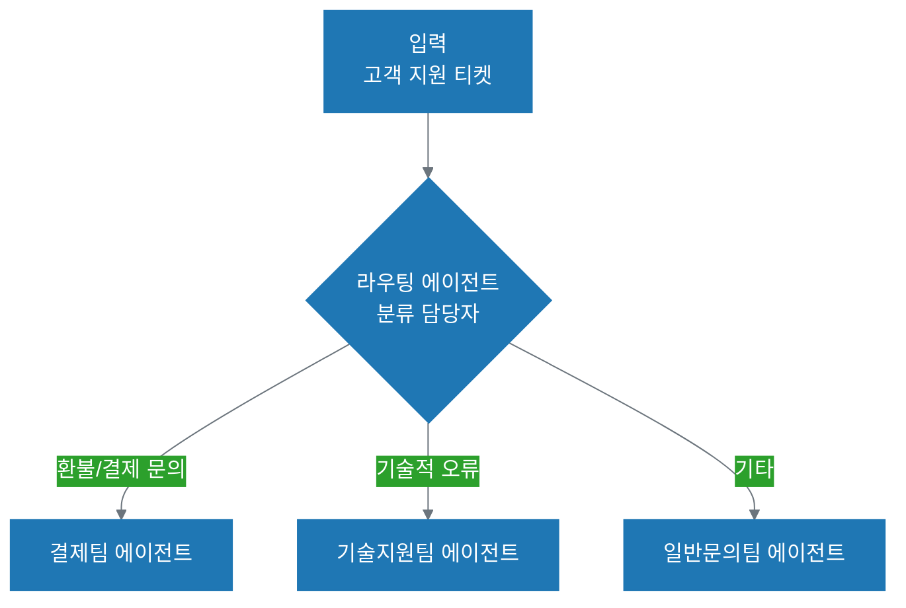
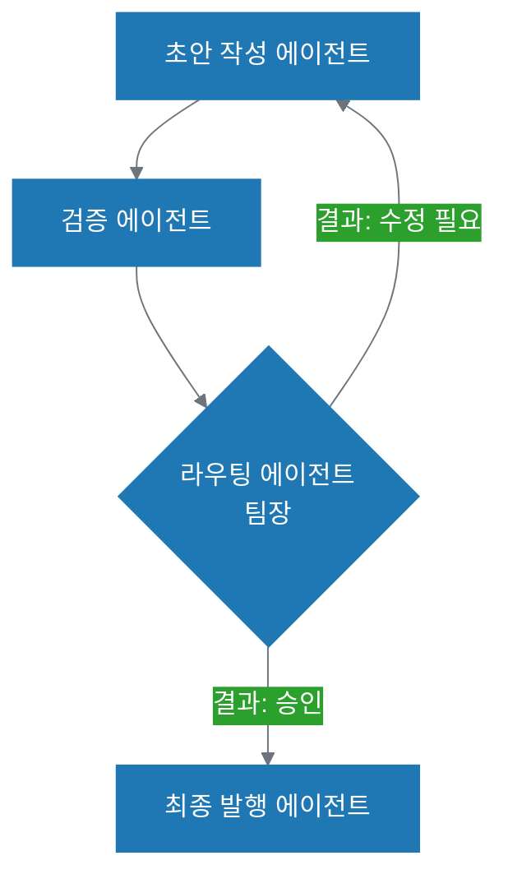

# 7장. 프로세스 설계와 워크플로우 패턴

**Part 3: 워크플로우, 성능과 평가**

에이전트가 단독으로 작업을 수행하는 것을 넘어, 여러 에이전트가 협력하여 더 복잡한 문제를 해결하는 방법을 알아봅니다. 이번 장에서는 가장 기본적이면서도 강력한 두 가지 협업 방식인 '파이프라인(Pipeline)'과 '생성-검증(Generate-and-Verify)' 패턴을 소개합니다. 이러한 협업의 전체적인 흐름을 [워크플로우(Workflow)](glossary.md#워크플로우-workflow)라고 합니다. 또한, 이러한 워크플로우를 코드가 아닌 설정 파일로 정의하고 관리하는 방법을 배웁니다.

## 7.1 파이프라인(Pipeline) 패턴

파이프라인은 가장 직관적인 협업 방식으로, 여러 에이전트가 작업을 순차적으로 처리하는 모델입니다. 마치 공장의 컨베이어 벨트처럼, 한 에이전트의 작업 결과(output)가 다음 에이전트의 입력(input)으로 전달됩니다.



이 패턴은 다음과 같은 단계로 구성된 작업에 매우 효과적입니다.

1.  **데이터 수집 에이전트**: 웹이나 문서에서 정보를 수집합니다.
2.  **데이터 정제 에이전트**: 수집된 정보에서 불필요한 부분을 제거하고 형식을 표준화합니다.
3.  **핵심 정보 추출 에이전트**: 정제된 데이터에서 핵심 내용을 요약하거나 특정 정보를 추출합니다.
4.  **보고서 생성 에이전트**: 추출된 정보를 바탕으로 최종 보고서를 작성합니다.

각 에이전트는 자신의 역할에만 집중하므로, 전체 프로세스의 효율성과 명확성이 높아집니다.

## 7.2 생성-검증(Generate-and-Verify) 패턴

'생성-검증' 패턴은 한 에이전트가 결과물을 만들면(Generate), 다른 에이전트가 그 결과물을 검증하고 피드백을 주는(Verify) 협업 모델입니다. 이 패턴은 결과물의 품질을 높이는 데 매우 중요한 역할을 하며, '피드백 루프(Feedback Loop)'를 만드는 가장 기본적인 방법입니다.



예를 들어, 다음과 같은 시나리오에 적용할 수 있습니다.

*   **콘텐츠 생성**: '작가 에이전트'가 블로그 포스트 초안을 작성하면, '편집자 에이전트'가 문법 오류나 어색한 표현을 찾아 수정 제안을 합니다.
*   **코드 리뷰**: '개발자 에이전트'가 새로운 기능에 대한 코드를 작성하면, '리뷰어 에이전트'가 코드의 버그 가능성이나 스타일 가이드 위반 여부를 검토하고 개선점을 제안합니다.

이 패턴은 한 번에 끝나지 않고, 검증 에이전트의 피드백을 바탕으로 생성 에이전트가 결과물을 수정하고 다시 검증받는 과정을 여러 번 반복할 수 있습니다.

## 7.3 라우팅 패턴

워크플로우가 항상 정해진 길로만 가는 것은 아닙니다. 상황에 따라 다른 길로 안내하는 '교통 경찰'이나 '분류 담당자'가 필요합니다. 우리는 코드가 아닌, 명확한 지시를 받은 **라우팅 에이전트(Routing Agent)**를 통해 이러한 의사결정을 자동화할 수 있습니다.

### 7.3.1 분류 기반 라우팅 (Triage Routing)

가장 흔한 라우팅 방식으로, 들어온 작업의 내용을 보고 어떤 에이전트가 처리해야 할지 결정하는 패턴입니다. 마치 우체국에서 편지의 주소를 보고 담당 지역으로 보내거나, 고객센터에서 문의 유형에 따라 담당 팀으로 연결하는 것과 같습니다.



**예시: 고객 지원 티켓 분류**

1.  **라우팅 에이전트 (분류 담당자)**가 이메일 내용을 읽습니다.
2.  내용이 '환불'에 관한 것이면, '결제팀' 에이전트에게 작업을 전달하도록 지시합니다.
3.  내용이 '기술적 오류'에 관한 것이면, '기술지원팀' 에이전트에게 전달하도록 지시합니다.

**인스트럭션 예시:**
> "당신은 고객 지원 티켓 분류 담당자입니다. 주어진 티켓의 내용을 읽고, '환불/결제' 관련 문의는 '결제팀'으로, '오류/장애' 관련 문의는 '기술지원팀'으로, 그 외에는 '일반문의팀'으로 분류하여 전달하세요."

### 7.3.2 조건부 라우팅 (Conditional Routing)

이전 단계의 결과에 따라 다음 행동을 결정하는 패턴입니다. 주로 `생성-검증` 패턴과 함께 사용되며, 검증 결과가 '성공'인지 '실패'인지에 따라 워크플로우를 분기시킵니다.



**예시: 보고서 승인 프로세스**

1.  '초안 작성 에이전트'가 보고서를 작성합니다.
2.  '검증 에이전트'가 보고서를 평가하고 '승인' 또는 '수정 필요' 태그를 붙입니다.
3.  **라우팅 에이전트 (팀장)**가 이 태그를 확인합니다.
    *   '승인' 태그가 있으면, '최종 발행 에이전트'에게 전달합니다.
    *   '수정 필요' 태그가 있으면, 피드백과 함께 '초안 작성 에이전트'에게 되돌려 보냅니다.

**인스트럭션 예시:**
> "당신은 보고서 승인 프로세스를 관리하는 팀장입니다. '검증 에이전트'의 평가 결과를 확인하세요. 결과가 '승인'이면 다음 단계로 보내고, '수정 필요'이면 작성자에게 반려하세요."

## 7.4 워크플로우 정의 (`workflow.yaml`)

워크플로우가 복잡해질수록, 각 단계를 코드에 직접 하드코딩하는 것은 비효율적이고 유지보수가 어렵습니다. 대신, 워크플로우의 구조와 각 단계에서 실행될 에이전트를 별도의 설정 파일로 정의하는 것이 좋습니다.

`YAML`이나 `JSON` 형식의 설정 파일을 사용하면, 코드 수정 없이 워크플로우의 순서를 바꾸거나 새로운 단계를 추가하는 등 유연한 변경이 가능합니다.

다음은 `workflow.yaml` 파일에 파이프라인 패턴을 정의한 간단한 예시입니다.

```yaml
name: "콘텐츠 생성 파이프라인"
workflow:
  - agent: "리서치 에이전트"
    prompt: "AI 에이전트 협업의 최신 동향을 조사해줘."
    output: "research_result.txt"

  - agent: "초안 작성 에이전트"
    prompt: "research_result.txt 파일을 기반으로 블로그 포스트 초안을 작성해줘."
    input: "research_result.txt"
    output: "draft.md"

  - agent: "검수 에이전트"
    prompt: "draft.md 파일의 문법과 사실 관계를 확인하고, 개선점을 제안해줘."
    input: "draft.md"
```

이처럼 워크플로우를 코드가 아닌 데이터로 정의함으로써, 전체 시스템의 유연성과 확장성을 크게 높일 수 있습니다.

---

이번 장에서 다룬 기본 워크플로우 패턴들은 앞으로 배울 더 복잡하고 정교한 협업 아키텍처의 기초가 됩니다. 특히 파이프라인, 생성-검증, 라우팅과 같은 패턴들은, 이어지는 10장에서 다룰 **'아키텍트 에이전트'가 워커들을 지휘하기 위해 사용하는 핵심적인 전략, 즉 '플레이북(Playbook)'**이 됩니다.

다음 장에서는 에이전트의 성능을 측정하고 최적화하는 방법을 알아보겠습니다.

## 실습 체크리스트
> 참고: 심화 과제는 [실습 과제 모음](practice-guide.md)을 참고하세요.

### 이 장을 완료하셨다면 다음을 확인하세요:
- [ ] 파이프라인/생성-검증/라우팅의 적용 조건과 장단점을 설명할 수 있다
- [ ] `workflow.yaml` 형태로 단계/에이전트/입출력 연결을 선언할 수 있다
- [ ] [Human-in-the-Loop](glossary.md#human-in-the-loop) 및 조건 분기(승인/수정 필요)를 설계에 반영할 수 있다

### 실습 과제
1. 단일 업무를 파이프라인 3단계로 정의한 `workflow.yaml` 초안을 작성하세요.
2. 동일 업무에 ‘생성-검증’ 루프와 조건부 라우팅을 추가하여 품질 보강 버전을 만드세요.

---

## 🎯 실습 체크리스트

### 이 장을 완료했다면:
- [ ] 파이프라인 패턴과 생성-검증 패턴의 차이를 설명할 수 있다
- [ ] 각 워크플로우 패턴이 어떤 상황에 적합한지 판단할 수 있다
- [ ] 라우팅 에이전트의 역할과 필요성을 이해한다
- [ ] workflow.yaml로 워크플로우를 정의하는 방법을 안다
- [ ] 단일 에이전트로는 해결하기 어려운 문제를 워크플로우로 해결할 수 있다

### 실습 과제

#### 과제 1: 파이프라인 설계하기
자신의 업무에서 순차적 처리가 필요한 작업을 찾아, 3-4단계의 파이프라인으로 설계해보세요.

**예시:**
- 회의록 → 요약 → 할일 추출 → 일정 등록
- 고객 문의 → 카테고리 분류 → 답변 생성 → 검토

**작성 내용:**
1. 각 단계의 에이전트 이름과 역할
2. 각 단계의 입력과 출력 파일
3. 전체 파이프라인 다이어그램 (Mermaid 또는 손그림)

#### 과제 2: 생성-검증 패턴 적용하기
품질 관리가 중요한 작업을 선택하고, 생성-검증 패턴을 적용해보세요.

**작성 내용:**
1. 생성 에이전트의 인스트럭션 초안
2. 검증 에이전트의 체크리스트 (무엇을 검증할 것인가?)
3. 피드백 루프를 몇 번까지 허용할 것인가?

#### 과제 3: workflow.yaml 작성하기
과제 1 또는 과제 2에서 설계한 워크플로우를 `workflow.yaml` 형식으로 작성해보세요.

```yaml
name: "[워크플로우 이름]"
workflow:
  - agent: "[에이전트 이름]"
    prompt: "[프롬프트]"
    input: "[입력 파일]"
    output: "[출력 파일]"
  # 다음 단계 추가...
```

### 심화 과제
- [ ] 라우팅 패턴이 필요한 실제 시나리오를 찾아 설계해보기
- [ ] 파이프라인 + 생성-검증을 결합한 하이브리드 워크플로우 만들어보기
- [ ] 각 패턴의 장단점을 실제 사례로 비교 분석하기
