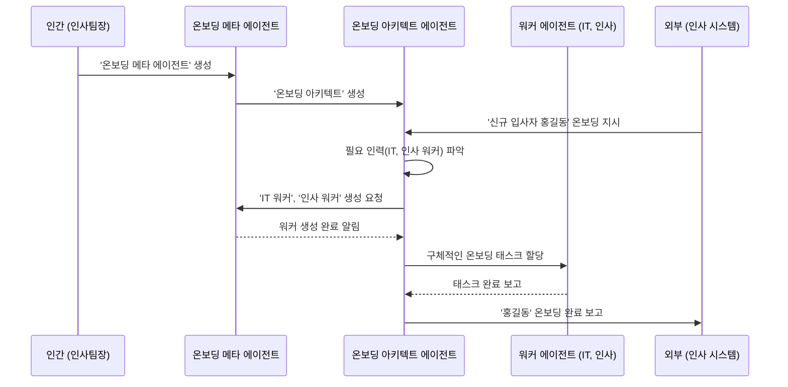
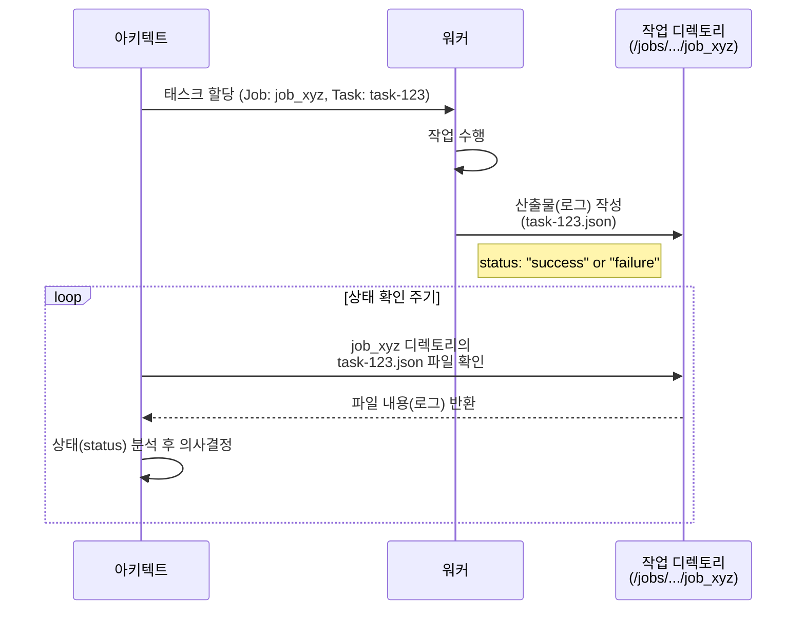

# 10장. 고급 협업 아키텍처와 시스템 설계

**Part 2: 인스트럭션 시스템 설계와 평가**

**목적:** 개별 전문가 에이전트들을 유기적으로 연결하여, 복잡한 실제 업무를 안정적으로 자동화하는 워크플로우를 **인스트럭션만으로 설계하는 방법**을 배웁니다.

### 이 장에서 배우는 것
- 왜 하나의 거대 에이전트가 아닌, 여러 에이전트의 협업이 필요한가.
- LLM 프레임워크의 접근법과 **인스트럭션 기반 접근법**의 차이점.
- 에이전트 간의 소통 규약, **산출물 인터페이스**의 설계 방법.
- 협력의 복잡도에 따라 발전하는 **4단계 협업 아키텍처**.
- **산출물 기반 실행 감독** 및 다중 작업 관리 방법.

---

## 10.1 문제 해결 방식의 진화: ‘협업’의 필요성

이전 장들에서 우리는 명확한 역할과 입/출력을 가진 개별 전문가 에이전트를 만들었습니다. 하지만 ‘신규 기능 출시’ 같은 실제 업무는 단 한 명의 전문가가 해결할 수 없습니다. 코드 작성, 테스트, 문서 업데이트, 고객 공지 등 여러 전문가의 ‘협업’이 필요합니다.

이를 하나의 거대 에이전트에게 맡기는 것은 모든 일을 한 사람에게 맡기는 것과 같아 비효율적이고 실패 확률이 높습니다. 따라서 우리는 여러 에이전트가 각자의 전문성에 따라 작업을 나누고, 서로의 결과물을 이어받아 처리하는 **워크플로우**를 설계해야 합니다.

### LLM 프레임워크 vs 인스트럭션 설계

시중의 LLM 개발 프레임워크(LangChain, LlamaIndex 등)는 코드를 통해 에이전트의 연결, 데이터 흐름, 실패 처리 등을 정의하는 강력한 기능을 제공합니다. 하지만 이는 종종 복잡한 코드와 프레임워크에 대한 깊은 이해를 요구합니다.

이 책에서 우리는 다른 접근법을 취합니다. 우리는 **잘 설계된 인스트럭션**과 **간단한 합의(프로토콜)**만으로 워크플로우를 구축합니다. 이는 일반 사용자나 개발자가 복잡한 기술 없이도 자신의 업무 프로세스를 자동화할 수 있도록 하는 것을 목표로 합니다. 프레임워크가 제공하는 ‘기능’들을 어떻게 ‘인스트럭션’으로 녹여낼 수 있는지에 집중해봅시다.

## 10.2 협업의 전제 조건: 산출물 인터페이스

에이전트 시스템, 즉 여러 에이전트가 모여 복잡한 문제를 해결하는 시스템의 주요 구성요소는 다음과 같습니다.

- **에이전트 (Agent):** 개별 작업을 수행하는 자율적인 주체입니다.
- **워크플로 (Workflow):** 에이전트들이 작업을 수행하는 순서와 방식을 정의한 프로세스입니다.
- **산출물 (Artifact):** 워크플로를 통해 생성되는 결과물입니다. (예: 코드, 문서, 보고서)
- **작업 로그 (Task Log):** 에이전트의 모든 활동(진행 상황, 성공, 실패 등)을 기록한 데이터입니다. 이 로그는 시스템의 검증, 평가, 및 운영에 필수적인 역할을 합니다.

본격적인 협업 모델을 살펴보기에 앞서, 이 구성요소들, 특히 에이전트 간의 소통을 가능하게 하는 **산출물(Artifact)**에 대해 더 깊이 이해해야 합니다. 산출물은 어떻게 에이전트 간의 명확한 **인터페이스(Interface)** 역할을 할 수 있을까요?

산출물은 단순히 한 에이전트의 결과물이 아닙니다. 이는 워크플로우의 현재 상태를 나타내고, 다음 에이전트의 행동을 결정하며, 전체 프로세스의 기록을 담는 핵심 매개체입니다.

### 10.2.1 산출물의 이중적 역할

1.  **작업의 연결고리 (협업의 가능성):** 산출물은 에이전트 간의 ‘계약’입니다. A 에이전트의 산출물 형식과 B 에이전트의 입력 형식이 약속되어 있다면, 두 에이전트는 서로의 작업이 끝날 때까지 기다릴 필요 없이 **병렬적, 비동기적**으로 작업을 수행할 수 있습니다.

2.  **실행의 기록 (로그와 투명성):** 산출물은 그 자체로 ‘이전 단계에서 무슨 일이 있었는지’를 알려주는 명확한 **로그**가 됩니다. 문제가 발생했을 때, 각 단계의 산출물을 살펴보는 것만으로 어느 지점에서 문제가 발생했는지 쉽게 추적할 수 있습니다.

### 10.2.2 파일 기반 산출물 설계 가이드

-   **파일로 소통하세요:** 에이전트가 자신의 작업 결과를 특정 폴더에 명확한 이름의 파일로 저장하게 하세요.
-   **구조화된 데이터를 사용하세요:** 단순 텍스트보다 `JSON`이나 `YAML` 형식을 사용하여 데이터의 의미를 명확하게 전달하는 것이 좋습니다.
-   **상태와 데이터를 함께 담으세요:** 결과 데이터뿐만 아니라, 작업의 성공 여부, 타임스탬프 등 **메타데이터**를 함께 포함시켜 시스템의 상태를 명확히 하세요.

## 10.3 계층적 협업 아키텍처: 시스템의 시작과 동적 실행

AI 에이전트 시스템은 어떻게 시작될까요? 그리고 각 에이전트는 어떻게 상호작용할까요? 이 절에서는 시스템의 시작점인 '태초의 메타 에이전트' 개념과, 실제 프로젝트가 실행되는 동적 흐름을 구체적인 예시를 통해 알아봅니다.

### 10.3.1 시스템의 시작점: 태초의 메타 에이전트

모든 정교한 에이전트 시스템은 **인간이 '태초의 메타 에이전트'를 하나 만드는 것**에서 시작됩니다. 이 첫 번째 메타 에이전트는 특정 도메인에 고도로 특화된 '에이전트 공장'입니다.

예를 들어, '신규 입사자 온보딩'이라는 도메인을 자동화하는 과정을 따라가 봅시다.

1.  **1단계: 인간의 설계 (Human Design):** 인간 인사팀장이 **'온보딩 전문 메타 에이전트'**를 설계하고 생성합니다. 이 에이전트의 유일한 목적은 신규 입사자 온보딩에 필요한 다른 에이전트들을 생성하고 관리하는 것입니다.

2.  **2단계: 아키텍트 생성 (Architect Creation):** 이 메타 에이전트는 자신의 역할을 수행하기 위해, 먼저 개별 온보딩 프로세스를 총괄할 **'신규 입사자 온보딩 아키텍트 에이전트'**를 생성합니다.

3.  **3단계: 동적 워커 요청 및 실행 (Dynamic Worker Request & Execution):** 이제 실제 작업이 시작됩니다.
    *   **외부 지시:** 인사 시스템에서 '신규 입사자 '홍길동' 온보딩 시작'이라는 프로젝트 지시가 '온보딩 아키텍트'에게 전달됩니다.
    *   **필요 인력 파악:** 아키텍트는 온보딩 체크리스트를 바탕으로, 'IT 장비 준비 워커'와 '인사 서류 처리 워커'가 필요하다고 판단합니다.
    *   **생성 요청:** 아키텍트는 자신을 관리하는 '온보딩 메타 에이전트'에게 필요한 워커들의 생성을 **요청**합니다.
    *   **워커 생성:** 메타 에이전트는 요청받은 사양에 맞춰 두 워커 에이전트를 생성하고, 준비가 되었음을 아키텍트에게 알립니다.
    *   **태스크 할당:** 아키텍트는 새로 충원된 워커들에게 실제 온보딩 태스크를 할당하며 프로젝트를 이끌어갑니다.

### 10.3.2 전체 흐름 다이어그램

이러한 '생성'과 '실행'의 전체 흐름을 시퀀스 다이어그램으로 표현하면 다음과 같습니다.



### 10.3.3 역할 최종 정리

이 모델을 통해 각 에이전트의 역할이 명확해집니다.

-   **메타 에이전트 (조직/자원 관리자):** 특정 도메인을 책임지며, 아키텍트의 '요청'에 따라 필요한 에이전트를 **생성**하고 제공하는 역할. 비즈니스 의사결정에는 직접 관여하지 않습니다.
-   **아키텍트 에이전트 (프로젝트 실행자):** **외부로부터 프로젝트 지시를 직접 받아** 팀(워커)을 이끌고 실행을 총괄하는 역할. 필요시 메타 에이전트에게 자원(워커) 충원을 **요청**합니다.
-   **워커 에이전트 (전문 실무자):** 아키텍트의 지시를 받아 구체적인 태스크를 수행하는 역할.


## 10.4 실행 감독과 안정성 설계 (아키텍트의 역할)

계층 모델에서 워크플로우의 안정성을 보장하는 핵심 역할은 **아키텍트 에이전트**가 담당합니다. 아키텍트는 각 워커 에이전트의 작업 상태를 명확히 추적하고 통제할 수 있어야 합니다. 우리는 **‘산출물이 곧 로그(Artifact as a Log)’**라는 간단한 규칙을 통해 이를 구현할 수 있습니다.

### 산출물을 이용한 실행 감독 및 로깅

모든 에이전트는 자신의 작업 결과를 **로그 정보가 포함된 표준화된 산출물**로 남겨야 합니다. 아키텍트는 이 산출물을 확인함으로써 전체 워크플로우를 감독합니다.

#### 1. 표준 로그 형식 포함

모든 산출물은 결과 데이터(data)와 함께, 작업 이력을 투명하게 보여주는 메타데이터(metadata)를 반드시 포함해야 합니다.

```json
// 예시: task-123_analysis.json
{
  "metadata": {
    "task_id": "task-123",
    "agent_name": "data-analyzer-v2",
    "status": "success", // "success", "failure"
    "timestamp_start": "2025-10-03T10:00:00Z",
    "timestamp_end": "2025-10-03T10:05:12Z"
  },
  "data": { /* 실제 결과 데이터 */ }
}
```

#### 2. 아키텍트의 모니터링 프로세스



아키텍트는 위 다이어그램처럼 주기적으로 각 **작업(Job) 디렉토리**를 확인하여 각 태스크의 상태를 파악하고, 성공/실패 여부에 따라 다음 행동을 결정합니다.

## 10.5 확장: 다중 작업(Job) 관리

아키텍트 에이전트는 여러 종류의 워크플로 '템플릿'을 기반으로, 수많은 '작업(Job)'을 동시에 생성하고 관리해야 합니다. 이는 각 작업의 상태가 격리되도록 디렉토리 구조를 설계하고, 작업의 상태를 명확히 추적함으로써 체계적으로 관리할 수 있습니다.

### 10.5.1 디렉토리 구조: 설계와 실행의 분리

워크플로의 '설계도(템플릿)'와 '실행 기록(작업)'은 명확히 분리하여 관리합니다.

-   **/workflows/**: 워크플로의 템플릿을 보관합니다. 각 워크플로는 **자체적인 폴더**로 관리하여 관련 파일들을 그룹화하고 확장성을 높입니다.
-   **/jobs/**: 실제 실행된 작업들을 저장합니다. 관리 효율성을 위해 **날짜별로 하위 디렉토리**를 생성하여 작업을 그룹화합니다.

**최종 디렉토리 구조 예시:**
```
/
├── workflows/
│   ├── ticket-processing/
│   │   └── workflow.json       // 워크플로 정의 파일
│   └── user-onboarding/
│       └── workflow.json
└── jobs/
    ├── 2025-10-03/
    │   ├── job_abc123/
    │   │   ├── _job_log.json       // 이 작업의 전체 상태 로그
    │   │   ├── ticket.txt          // 최초 입력 파일
    │   │   └── 01_category.json
    │   └── job_xyz789/
    │       └── ...
    └── 2025-10-04/
        └── ...
```

### 10.5.2 작업 상태 관리와 연속성 보장

아키텍트와 매니저는 개별 작업(Job)의 진행 상태를 한눈에 파악하여 전체 워크플로우의 연속성을 보장해야 합니다. `_job_log.json` 파일은 바로 이 역할을 수행하는 핵심적인 상태 관리 도구입니다.

각 작업 디렉토리의 최상단에 위치하는 `_job_log.json`은 해당 작업의 모든 메타데이터와 현재 상태를 기록합니다.

**`_job_log.json` 예시:**
```json
{
  "job_id": "job_abc123",
  "workflow_template": "ticket-processing",
  "status": "running", // pending, running, completed, failed, paused
  "created_at": "2025-10-03T09:00:00Z",
  "last_updated_at": "2025-10-03T10:05:12Z",
  "history": [
    {
      "task_id": "task-01-categorize",
      "agent_name": "category-agent-v1",
      "status": "success",
      "timestamp": "2025-10-03T09:05:00Z"
    },
    {
      "task_id": "task-02-summarize",
      "agent_name": "summary-agent-v3",
      "status": "running",
      "timestamp": "2025-10-03T10:05:12Z"
    }
  ]
}
```

**작업 상태(status)의 종류:**

*   `pending`: 작업이 생성되었지만 아직 시작되지 않음.
*   `running`: 하나 이상의 태스크가 진행 중.
*   `completed`: 모든 태스크가 성공적으로 완료됨.
*   `failed`: 태스크 중 하나가 실패하여 워크플로우가 중단됨.
*   `paused`: 관리자에 의해 수동으로 일시 중지됨.

아키텍트 에이전트는 `/jobs/` 디렉토리를 주기적으로 스캔하며 각 작업의 `_job_log.json`을 확인합니다. 이를 통해 `failed` 상태인 작업을 재시도하거나, 특정 단계에서 지연되는 `running` 상태의 작업을 확인하여 문제를 진단하는 등 선제적인 조치를 취할 수 있습니다. 이는 여러 작업이 동시에 진행될 때 시스템의 안정성과 연속성을 보장하는 핵심적인 관리 기능입니다.

### 10.5.3 아키텍트의 확장된 역할

1.  **신규 작업 접수:** 요청에 맞는 워크플로를 `/workflows/` 디렉토리에서 찾습니다. (e.g., `/workflows/ticket-processing/workflow.json`)
2.  **작업(Job) 생성:** `/jobs/` 아래에 **오늘 날짜(e.g., `2025-10-03`)** 디렉토리가 있는지 확인하고, 없으면 생성합니다. 그 후, 날짜 디렉토리 아래에 고유한 `job_id`를 가진 디렉토리를 만들어 작업을 초기화하고 `_job_log.json`을 `pending` 상태로 생성합니다.
3.  **다중 작업 감독:** `/jobs/` 디렉토리 전체를 순회하며 각 작업의 `_job_log.json`을 읽어 상태를 모니터링합니다.
4.  **컨텍스트 기반 작업 할당:** 워커 에이전트에게 **작업의 정확한 경로**를 알려줍니다. (e.g., "워커 A, `/jobs/2025-10-03/job_abc123/` 디렉토리의 `ticket.txt` 파일을 처리하라.")

> **향후 발전 방향**
> 대규모 시스템에서는 작업의 메타데이터를 **데이터베이스**에 저장하여 더 빠른 검색, 통계, 리포팅을 구현할 수 있습니다.

---