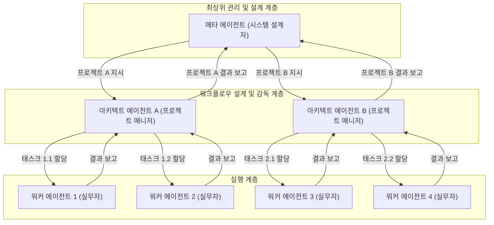
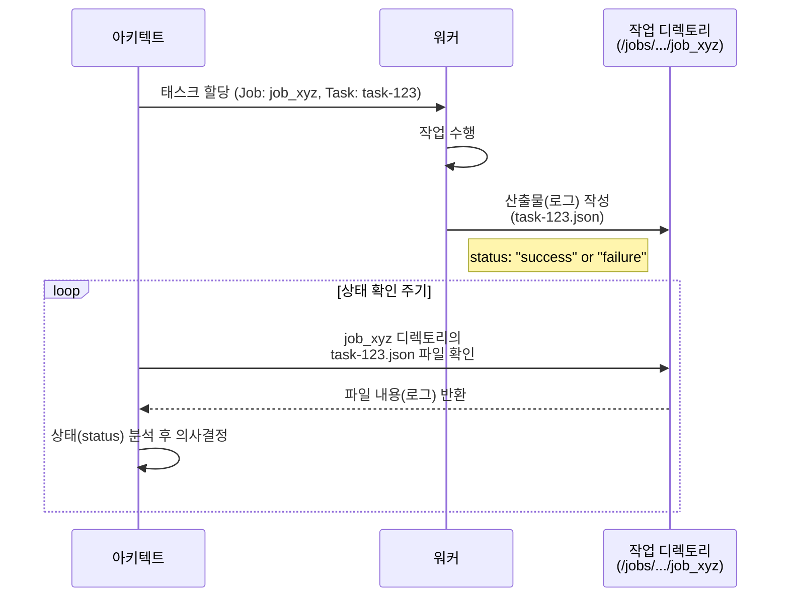

# 10장. 고급 협업 아키텍처와 시스템 설계

**Part 2: 인스트럭션 시스템 설계와 평가**

**목적:** 개별 전문가 에이전트들을 유기적으로 연결하여, 복잡한 실제 업무를 안정적으로 자동화하는 워크플로우를 **인스트럭션만으로 설계하는 방법**을 배웁니다.

### 이 장에서 배우는 것
- 왜 하나의 거대 에이전트가 아닌, 여러 에이전트의 협업이 필요한가.
- LLM 프레임워크의 접근법과 **인스트럭션 기반 접근법**의 차이점.
- 에이전트 간의 소통 규약, **산출물 인터페이스**의 설계 방법.
- 협력의 복잡도에 따라 발전하는 **4단계 협업 아키텍처**.
- **산출물 기반 실행 감독** 및 다중 작업 관리 방법.

---

## 10.1 문제 해결 방식의 진화: ‘협업’의 필요성

이전 장들에서 우리는 명확한 역할과 입/출력을 가진 개별 전문가 에이전트를 만들었습니다. 하지만 ‘신규 기능 출시’ 같은 실제 업무는 단 한 명의 전문가가 해결할 수 없습니다. 코드 작성, 테스트, 문서 업데이트, 고객 공지 등 여러 전문가의 ‘협업’이 필요합니다.

이를 하나의 거대 에이전트에게 맡기는 것은 모든 일을 한 사람에게 맡기는 것과 같아 비효율적이고 실패 확률이 높습니다. 따라서 우리는 여러 에이전트가 각자의 전문성에 따라 작업을 나누고, 서로의 결과물을 이어받아 처리하는 **워크플로우**를 설계해야 합니다.

### LLM 프레임워크 vs 인스트럭션 설계

시중의 LLM 개발 프레임워크(LangChain, LlamaIndex 등)는 코드를 통해 에이전트의 연결, 데이터 흐름, 실패 처리 등을 정의하는 강력한 기능을 제공합니다. 하지만 이는 종종 복잡한 코드와 프레임워크에 대한 깊은 이해를 요구합니다.

이 책에서 우리는 다른 접근법을 취합니다. 우리는 **잘 설계된 인스트럭션**과 **간단한 합의(프로토콜)**만으로 워크플로우를 구축합니다. 이는 일반 사용자나 개발자가 복잡한 기술 없이도 자신의 업무 프로세스를 자동화할 수 있도록 하는 것을 목표로 합니다. 프레임워크가 제공하는 ‘기능’들을 어떻게 ‘인스트럭션’으로 녹여낼 수 있는지에 집중해봅시다.

## 10.2 협업의 전제 조건: 산출물 인터페이스

에이전트 시스템, 즉 여러 에이전트가 모여 복잡한 문제를 해결하는 시스템의 주요 구성요소는 다음과 같습니다.

- **에이전트 (Agent):** 개별 작업을 수행하는 자율적인 주체입니다.
- **워크플로 (Workflow):** 에이전트들이 작업을 수행하는 순서와 방식을 정의한 프로세스입니다.
- **산출물 (Artifact):** 워크플로를 통해 생성되는 결과물입니다. (예: 코드, 문서, 보고서)
- **작업 로그 (Task Log):** 에이전트의 모든 활동(진행 상황, 성공, 실패 등)을 기록한 데이터입니다. 이 로그는 시스템의 검증, 평가, 및 운영에 필수적인 역할을 합니다.

본격적인 협업 모델을 살펴보기에 앞서, 이 구성요소들, 특히 에이전트 간의 소통을 가능하게 하는 **산출물(Artifact)**에 대해 더 깊이 이해해야 합니다. 산출물은 어떻게 에이전트 간의 명확한 **인터페이스(Interface)** 역할을 할 수 있을까요?

산출물은 단순히 한 에이전트의 결과물이 아닙니다. 이는 워크플로우의 현재 상태를 나타내고, 다음 에이전트의 행동을 결정하며, 전체 프로세스의 기록을 담는 핵심 매개체입니다.

### 10.2.1 산출물의 이중적 역할

1.  **작업의 연결고리 (협업의 가능성):** 산출물은 에이전트 간의 ‘계약’입니다. A 에이전트의 산출물 형식과 B 에이전트의 입력 형식이 약속되어 있다면, 두 에이전트는 서로의 작업이 끝날 때까지 기다릴 필요 없이 **병렬적, 비동기적**으로 작업을 수행할 수 있습니다.

2.  **실행의 기록 (로그와 투명성):** 산출물은 그 자체로 ‘이전 단계에서 무슨 일이 있었는지’를 알려주는 명확한 **로그**가 됩니다. 문제가 발생했을 때, 각 단계의 산출물을 살펴보는 것만으로 어느 지점에서 문제가 발생했는지 쉽게 추적할 수 있습니다.

### 10.2.2 파일 기반 산출물 설계 가이드

-   **파일로 소통하세요:** 에이전트가 자신의 작업 결과를 특정 폴더에 명확한 이름의 파일로 저장하게 하세요.
-   **구조화된 데이터를 사용하세요:** 단순 텍스트보다 `JSON`이나 `YAML` 형식을 사용하여 데이터의 의미를 명확하게 전달하는 것이 좋습니다.
-   **상태와 데이터를 함께 담으세요:** 결과 데이터뿐만 아니라, 작업의 성공 여부, 타임스탬프 등 **메타데이터**를 함께 포함시켜 시스템의 상태를 명확히 하세요.

## 10.3 계층적 협업 아키텍처

복잡한 시스템을 효과적으로 구축하고 관리하기 위해, 우리는 인간 조직의 구조와 유사한 계층적 아키텍처를 도입합니다. 이는 각 에이전트에게 명확한 역할과 책임 범위를 부여하여 전체 시스템의 안정성과 확장성을 높이는 핵심적인 설계 패턴입니다.

> **용어 정의: 메타, 아키텍트, 워커**
> 이 책에서 우리는 에이전트의 역할을 세 가지 계층으로 구분합니다.
> - **메타 에이전트(Meta Agent):** 전체 시스템을 설계하고, 주어진 문제에 맞춰 아키텍트 에이전트를 생성하거나 구성하는 '시스템 설계자'입니다.
> - **아키텍트 에이전트(Architect Agent):** 메타 에이전트의 지시를 받아 워크플로우를 설계하고, 여러 워커 에이전트를 지휘하며 프로젝트를 총괄하는 '프로젝트 매니저'입니다.
> - **워커 에이전트(Worker Agent):** 아키텍트의 지시를 받아 특정 실무를 수행하는 '전문 실무자'입니다.

가장 대표적인 운영 모델이 바로 **'메타 에이전트 - 아키텍트 - 워커'** 3단계 계층 구조입니다.



### 10.3.1 워커 에이전트 (Worker Agent): 실행 전문가

-   **역할**: 특정하고 명확하게 정의된 단일 태스크를 수행하는 '실무자'입니다.
-   **책임**:
    -   주어진 입력(Input)을 바탕으로 지시된 작업을 정확히 수행합니다.
    -   작업의 결과를 명시된 형식의 산출물(Artifact)로 생성합니다.
    -   자신의 작업 범위 외의 다른 에이전트나 전체 워크플로우에 대해서는 알지 못합니다.
-   **예시**: "입력된 텍스트를 요약하라", "주어진 이미지에 워터마크를 추가하라" 등

### 10.3.2 아키텍트 에이전트 (Architect Agent): 워크플로우 설계자 및 감독관

-   **역할**: 복잡한 목표(Goal)를 달성하기 위해 작업 계획을 수립하고, 워커들에게 작업을 분배하며, 전체 프로세스를 감독하는 '프로젝트 매니저'입니다.
-   **책임**:
    -   상위 목표를 구체적인 태스크(Task)들로 분해합니다. (Work Breakdown)
    -   각 태스크에 가장 적합한 워커 에이전트를 선택하고 작업을 할당합니다.
    -   워커 에이전트들이 생성한 산출물을 **평가**하고, 작업의 성공/실패 여부를 판단합니다.
    -   작업 실패 시 재시도를 지시하거나, 다른 워커에게 작업을 재할당하는 등 예외 처리를 수행합니다.
    -   전체 워크플로우가 완료되면, 최종 결과를 종합하여 상위 계층(메타 에이전트)에 보고합니다.

### 10.3.3 아키텍트의 평가 방식: 직접 평가 vs. 평가자 위임

아키텍트의 핵심 책임 중 하나는 워커의 산출물을 '평가'하는 것입니다. 이 평가 방식은 상황에 따라 두 가지로 나뉩니다.

1.  **직접 평가**: 아키텍트가 스스로 평가 기준을 가지고 워커의 결과물을 직접 검증합니다. 이는 작업 성공 여부가 파일의 존재 유무나, 데이터 형식의 정확성 등 명확한 규칙으로 판별 가능할 때 유용하고 빠릅니다.

2.  **평가자 위임 (생성자-검증자 패턴)**: 아키텍트가 '생성'을 담당하는 워커와 '검증'을 담당하는 **평가 에이전트(Evaluator Agent)**를 한 쌍으로 묶어 작업을 지시하는 고급 패턴입니다. 코드의 품질, 글의 논리성, 디자인의 심미성처럼 복잡하고 주관적인 평가가 필요할 때 매우 효과적입니다. 아키텍트는 '생성 워커'의 결과물을 '평가 에이전트'에게 전달하고, 그 평가 결과를 바탕으로 다음 행동을 결정합니다. 이는 결과물의 품질을 극대화하는 강력한 전략입니다.

### 10.3.4 메타 에이전트 (Meta Agent): 시스템 총괄 설계자

-   **역할**: 전체 시스템의 목표를 설정하고, 주어진 문제에 가장 적합한 아키텍트 에이전트를 **설계하고 생성**하며, 시스템의 전반적인 상태를 모니터링하는 '총괄 설계자'입니다.
-   **책임**:
    -   비즈니스 목표나 사용자 요청과 같은 최상위 입력을 받아, 이를 해결할 아키-텍트 에이전트를 동적으로 생성하거나 구성합니다.
    -   여러 아키텍트가 동시에 수행하는 다양한 프로젝트(워크플로우)들의 진행 상황을 종합적으로 모니터링합니다.
    -   시스템의 전반적인 성능 지표(예: 전체 작업 성공률, 평균 처리 시간)를 분석하고, 필요시 시스템 구조 자체의 개선을 지시합니다.

이러한 계층적 책임 분리는 각 에이전트의 인스트럭션을 단순하고 명확하게 유지시켜, 전체 시스템의 예측 가능성과 안정성을 크게 향상시킵니다.

### 10.3.5 심화: 실제 조직과 같은 재귀적 구조

지금까지 설명한 3단계 계층은 에이전트 시스템을 이해하기 위한 기본적인 구조입니다. 하지만 실제 복잡한 문제를 해결하기 위해 에이전트 시스템은 인간의 조직처럼 더 유연하고 재귀적인 구조를 가질 수 있습니다.

**1. 스코프를 가진 메타 에이전트:** '메타 에이전트'는 모든 것을 아우르는 단 하나의 최상위 존재가 아닐 수 있습니다. 예를 들어, '모바일 앱 개발'이라는 특정 영역(스코프)을 책임지는 메타 에이전트가 있고, '서버 백엔드 개발'을 책임지는 또 다른 메타 에이전트가 존재할 수 있습니다. 각 메타 에이전트는 자신의 전문 분야 내에서 아키텍트와 워커를 생성하고 관리합니다.

**2. 재귀적 구성:** 더 나아가, '모바일 앱 개발 메타 에이전트'는 회사 전체의 'CTO 메타 에이전트' 입장에서는 하나의 '아키텍트' 역할을 수행할 수 있습니다. 즉, `메타 -> 아키텍트 -> 워커`의 구조가 재귀적으로 반복되며 더 큰 조직을 형성할 수 있습니다.

**3. 유연한 건너뛰기:** 해결할 문제가 단순하다면 아키텍트 계층을 건너뛰고 `메타 -> 워커`로 직접 작업을 지시하는 유연한 구조도 가능합니다.

이처럼 에이전트의 계층 구조는 고정된 것이 아니라, 해결하려는 문제의 복잡성과 조직의 필요에 따라 얼마든지 유연하게 설계될 수 있습니다. 중요한 것은 각 에이전트에게 **명확한 책임의 범위(스코프)**를 부여하고, 그들 간의 **지휘 및 보고 관계**를 명확히 정의하는 것입니다.

## 10.4 실행 감독과 안정성 설계 (아키텍트의 역할)

계층 모델에서 워크플로우의 안정성을 보장하는 핵심 역할은 **아키텍트 에이전트**가 담당합니다. 아키텍트는 각 워커 에이전트의 작업 상태를 명확히 추적하고 통제할 수 있어야 합니다. 우리는 **‘산출물이 곧 로그(Artifact as a Log)’**라는 간단한 규칙을 통해 이를 구현할 수 있습니다.

### 산출물을 이용한 실행 감독 및 로깅

모든 에이전트는 자신의 작업 결과를 **로그 정보가 포함된 표준화된 산출물**로 남겨야 합니다. 아키텍트는 이 산출물을 확인함으로써 전체 워크플로우를 감독합니다.

#### 1. 표준 로그 형식 포함

모든 산출물은 결과 데이터(data)와 함께, 작업 이력을 투명하게 보여주는 메타데이터(metadata)를 반드시 포함해야 합니다.

```json
// 예시: task-123_analysis.json
{
  "metadata": {
    "task_id": "task-123",
    "agent_name": "data-analyzer-v2",
    "status": "success", // "success", "failure"
    "timestamp_start": "2025-10-03T10:00:00Z",
    "timestamp_end": "2025-10-03T10:05:12Z"
  },
  "data": { /* 실제 결과 데이터 */ }
}
```

#### 2. 아키텍트의 모니터링 프로세스



아키텍트는 위 다이어그램처럼 주기적으로 각 **작업(Job) 디렉토리**를 확인하여 각 태스크의 상태를 파악하고, 성공/실패 여부에 따라 다음 행동을 결정합니다.

## 10.5 확장: 다중 작업(Job) 관리

아키텍트 에이전트는 여러 종류의 워크플로 '템플릿'을 기반으로, 수많은 '작업(Job)'을 동시에 생성하고 관리해야 합니다. 이는 각 작업의 상태가 격리되도록 디렉토리 구조를 설계하고, 작업의 상태를 명확히 추적함으로써 체계적으로 관리할 수 있습니다.

### 10.5.1 디렉토리 구조: 설계와 실행의 분리

워크플로의 '설계도(템플릿)'와 '실행 기록(작업)'은 명확히 분리하여 관리합니다.

-   **/workflows/**: 워크플로의 템플릿을 보관합니다. 각 워크플로는 **자체적인 폴더**로 관리하여 관련 파일들을 그룹화하고 확장성을 높입니다.
-   **/jobs/**: 실제 실행된 작업들을 저장합니다. 관리 효율성을 위해 **날짜별로 하위 디렉토리**를 생성하여 작업을 그룹화합니다.

**최종 디렉토리 구조 예시:**
```
/
├── workflows/
│   ├── ticket-processing/
│   │   └── workflow.json       // 워크플로 정의 파일
│   └── user-onboarding/
│       └── workflow.json
└── jobs/
    ├── 2025-10-03/
    │   ├── job_abc123/
    │   │   ├── _job_log.json       // 이 작업의 전체 상태 로그
    │   │   ├── ticket.txt          // 최초 입력 파일
    │   │   └── 01_category.json
    │   └── job_xyz789/
    │       └── ...
    └── 2025-10-04/
        └── ...
```

### 10.5.2 작업 상태 관리와 연속성 보장

아키텍트와 매니저는 개별 작업(Job)의 진행 상태를 한눈에 파악하여 전체 워크플로우의 연속성을 보장해야 합니다. `_job_log.json` 파일은 바로 이 역할을 수행하는 핵심적인 상태 관리 도구입니다.

각 작업 디렉토리의 최상단에 위치하는 `_job_log.json`은 해당 작업의 모든 메타데이터와 현재 상태를 기록합니다.

**`_job_log.json` 예시:**
```json
{
  "job_id": "job_abc123",
  "workflow_template": "ticket-processing",
  "status": "running", // pending, running, completed, failed, paused
  "created_at": "2025-10-03T09:00:00Z",
  "last_updated_at": "2025-10-03T10:05:12Z",
  "history": [
    {
      "task_id": "task-01-categorize",
      "agent_name": "category-agent-v1",
      "status": "success",
      "timestamp": "2025-10-03T09:05:00Z"
    },
    {
      "task_id": "task-02-summarize",
      "agent_name": "summary-agent-v3",
      "status": "running",
      "timestamp": "2025-10-03T10:05:12Z"
    }
  ]
}
```

**작업 상태(status)의 종류:**

*   `pending`: 작업이 생성되었지만 아직 시작되지 않음.
*   `running`: 하나 이상의 태스크가 진행 중.
*   `completed`: 모든 태스크가 성공적으로 완료됨.
*   `failed`: 태스크 중 하나가 실패하여 워크플로우가 중단됨.
*   `paused`: 관리자에 의해 수동으로 일시 중지됨.

아키텍트 에이전트는 `/jobs/` 디렉토리를 주기적으로 스캔하며 각 작업의 `_job_log.json`을 확인합니다. 이를 통해 `failed` 상태인 작업을 재시도하거나, 특정 단계에서 지연되는 `running` 상태의 작업을 확인하여 문제를 진단하는 등 선제적인 조치를 취할 수 있습니다. 이는 여러 작업이 동시에 진행될 때 시스템의 안정성과 연속성을 보장하는 핵심적인 관리 기능입니다.

### 10.5.3 아키텍트의 확장된 역할

1.  **신규 작업 접수:** 요청에 맞는 워크플로를 `/workflows/` 디렉토리에서 찾습니다. (e.g., `/workflows/ticket-processing/workflow.json`)
2.  **작업(Job) 생성:** `/jobs/` 아래에 **오늘 날짜(e.g., `2025-10-03`)** 디렉토리가 있는지 확인하고, 없으면 생성합니다. 그 후, 날짜 디렉토리 아래에 고유한 `job_id`를 가진 디렉토리를 만들어 작업을 초기화하고 `_job_log.json`을 `pending` 상태로 생성합니다.
3.  **다중 작업 감독:** `/jobs/` 디렉토리 전체를 순회하며 각 작업의 `_job_log.json`을 읽어 상태를 모니터링합니다.
4.  **컨텍스트 기반 작업 할당:** 워커 에이전트에게 **작업의 정확한 경로**를 알려줍니다. (e.g., "워커 A, `/jobs/2025-10-03/job_abc123/` 디렉토리의 `ticket.txt` 파일을 처리하라.")

> **향후 발전 방향**
> 대규모 시스템에서는 작업의 메타데이터를 **데이터베이스**에 저장하여 더 빠른 검색, 통계, 리포팅을 구현할 수 있습니다.

---