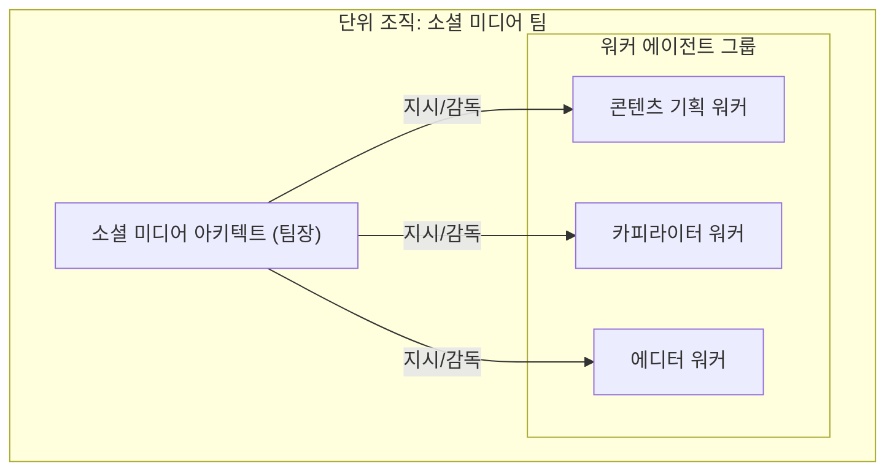
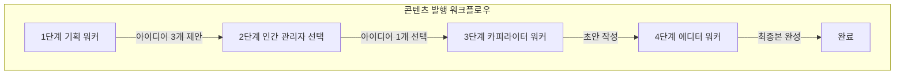

# 11장 2부: 단위 조직 설계

**Part 2: 인스트럭션 시스템 설계와 평가**

**목적:** 2~5명의 전문 에이전트가 하나의 팀, 즉 '단위 조직'처럼 협력하는 패턴을 학습하고, 이 과정에서 '아키텍트'가 외부의 지시를 받아 어떻게 팀을 이끄는지 이해합니다.

### 이 장에서 배우는 것
- 외부의 지시를 받은 아키텍트 에이전트가 여러 워커 에이전트를 지휘하여 프로젝트를 수행하는 방법을 익힙니다.
- 아키텍트가 필요시 메타 에이전트에게 자원(워커) 생성을 요청하는 상호작용을 이해합니다.
- Mermaid 다이어그램을 통해 에이전트 구조와 워크플로우를 시각적으로 설계하는 방법을 배웁니다.

---

## 들어가며: 전문가 팀 꾸리기

'단위 조직'은 특정 목표를 달성하기 위해 여러 전문 '워커 에이전트'들이 하나의 팀으로 협력하는 패턴입니다. 이 팀을 이끄는 것이 바로 **'아키텍트 에이전트'**입니다.

### 아키텍트와 메타 에이전트의 관계

이 패턴에서 프로젝트는 외부의 지시로 시작됩니다.
1.  **외부의 목표 설정:** 인간 관리자(예: 마케팅 팀장)가 "소셜 미디어에 우리 회사 제품에 대한 콘텐츠를 발행하라" 와 같은 프로젝트 목표를 설정합니다.
2.  **아키텍트의 프로젝트 실행:** '소셜 미디어 아키텍트'는 이 지시를 직접 받아, 자신의 팀에 소속된 워커들을 지휘하여 프로젝트를 수행합니다.
3.  **메타 에이전트의 역할 (배경):** '소셜 미디어 팀' 자체(아키텍트와 초기 워커들)는 사전에 **메타 에이전트**에 의해 생성되었을 수 있습니다. 또한, 만약 아키텍트가 프로젝트 수행 중 '영상 편집 워커'가 추가로 필요하다고 판단하면, 메타 에이전트에게 생성을 '요청'하게 됩니다.

이 장의 예시는 4장의 '상황별 필수 원칙 매트릭스'에서 다음 위치에 해당합니다.
*   **조직 규모:** 단위 조직 (2-5개)
*   **작업 복잡도:** 표준/전문

---

### 11.2.1 [사례 4] 표준/전문: 소셜 미디어 콘텐츠 발행

- **상황:** 인간 마케팅 팀장이 '소셜 미디어 아키텍트'에게 'AI 생산성'을 주제로 한 콘텐츠 발행을 지시했다.
- **핵심 원칙:** `SoC`, `계층 구조`, `Human-in-the-Loop`

#### 에이전트 구조 설계 (조직도)

아키텍트는 자신의 목표를 달성하기 위해 다음과 같이 세 명의 워커 에이전트로 구성된 팀을 지휘합니다.



#### 워크플로우 설계 (작업 흐름)

아키텍트는 외부로부터 받은 지시를 완수하기 위해, 다음과 같은 파이프라인 워크플로우에 따라 워커들에게 순차적으로 작업을 지시합니다.



#### 최종 인스트럭션 시스템 예시

- **`소셜 미디어 아키텍트.md`**
```markdown
  # 역할: 소셜 미디어 팀 리더 (아키텍트)
  # 목표: 외부로부터 지시받은 'AI 생산성' 주제의 소셜 미디어 콘텐츠 발행을 총괄한다.
  # 처리 방법:
  # 1. '콘텐츠 기획 워커'에게 주제에 맞는 아이디어 3개 제안을 지시한다.
  # 2. 인간 관리자(지시를 내린 사람)에게 아이디어를 보고하고, 선택된 아이디어를 전달받는다.
  # 3. 선택된 아이디어를 '카피라이터 워커'에게 전달하여 초안 작성을 지시한다.
  # 4. 초안을 '에디터 워커'에게 전달하여 최종본 완성을 지시한다.
  # 5. 최종 결과물을 외부 지시자에게 보고하고 프로젝트를 종료한다.
```

- **`콘텐츠 기획 워커.md`**
```markdown
# 역할: 창의적인 콘텐츠 전략가
# 목표: 주어진 키워드를 바탕으로, 타겟 고객의 흥미를 유발할 구체적인 콘텐츠 아이디어 3개를 제안한다.
```

- **`카피라이터 워커.md`**
```markdown
# 역할: 재치 있는 소셜 미디어 전문가
# 목표: 주어진 아이디어를 200자 이내의 간결하고 흡입력 있는 소셜 미디어 포스트 초안으로 작성한다.
```

- **`에디터 워커.md`**
```markdown
# 역할: 깐깐한 편집장
# 목표: 주어진 초안을 최종 발행 가능한 수준으로 교정/교열하고, 문장의 매력을 극대화한다.
```

#### 설계 분석
- **실행과 생성의 분리:** 프로젝트 지시는 **외부**에서 **아키텍트**에게 직접 전달됩니다. **메타 에이전트**는 이 실행 흐름에 관여하지 않고, 배경에서 이 팀을 생성했거나 필요시 아키텍트의 요청에 따라 새로운 워커를 충원해주는 역할을 합니다.
- **계층 구조:** 아키텍트가 프로젝트를 지휘하고, 워커들이 실무를 수행하는 명확한 상하 관계를 보여줍니다.
- **Human-in-the-Loop:** 창의적인 방향성을 결정하는 중요한 단계를 인간이 직접 수행하여, 자동화의 효율성과 인간의 통찰력 사이의 균형을 맞춥니다.

## 실습 체크리스트

### 이 장을 완료하셨다면 다음을 확인하세요:
- [ ] 아키텍트-워커 팀의 역할 구분과 지휘/보고 흐름을 정의할 수 있다
- [ ] 파이프라인 워크플로우로 단계별 산출물을 연결할 수 있다
- [ ] Human-in-the-Loop 승인을 적절한 지점에 배치할 수 있다

### 실습 과제
1. 팀 과제 1개를 선택해 ‘아키텍트 + 3 워커’ 구조와 단계별 산출물을 설계하세요.
2. 승인 단계 1곳을 지정하고, 승인 시/반려 시 라우팅 규칙을 정의하세요.
