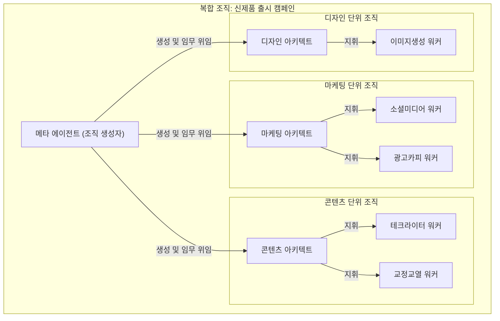
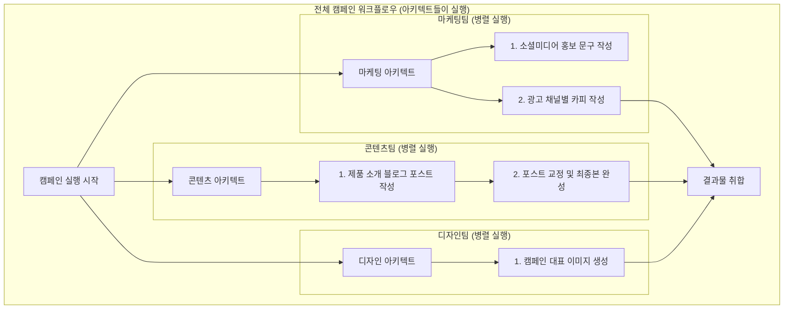

# 11장 3부: 복합 조직 설계

**Part 2: 인스트럭션 시스템 설계와 평가**

**목적:** 조직 전체의 표준으로 사용되며, 여러 팀(단위 조직)이 병렬적으로 협력하는 '복합 조직' 시스템 패턴을 학습합니다.

### 이 장에서 배우는 것
- 메타 에이전트가 비즈니스 목표에 따라 최적의 에이전트 팀을 '생성'하는 역할을 이해합니다.
- 생성된 여러 아키텍트 에이전트가 각자의 단위 조직을 이끌고 병렬적으로 작업을 수행하는 구조를 설계하는 방법을 익힙니다.
- 복잡한 계층 구조와 워크플로우를 다이어그램으로 명확하게 시각화하는 방법을 배웁니다.

---

## 들어가며: 회사의 프로세스를 자동화하기

'복합 조직'은 여러 '단위 조직'이 모여 하나의 거대한 프로젝트를 수행하는, 가장 현실적인 회사 조직과 닮은 패턴입니다. 이 구조의 핵심에는 **'메타 에이전트'**와 **'아키텍트 에이전트'**의 명확한 역할 분담이 있습니다.

### 역할 분담: 설계자 vs. 지휘자

1.  **인간의 목표 설정:** 먼저 인간 관리자(예: CMO)가 "신제품 '퀀텀 AI 글래스'의 출시 캠페인을 성공적으로 실행하라" 와 같은 최상위 비즈니스 목표를 설정합니다.
2.  **메타 에이전트 (설계자):** '캠페인 조직 생성'을 전문으로 하는 메타 에이전트는 이 목표를 입력받습니다. 메타 에이전트의 유일한 임무는 캠페인을 **실행하는 것이 아니라**, 캠페인을 실행할 **최적의 에이전트 조직(여러 아키텍트와 그들의 워커 팀)을 설계하고 생성**하는 것입니다.
3.  **아키텍트 에이전트 (지휘자):** 메타 에이전트에 의해 생성된 각 팀의 '아키텍트 에이전트'들이 실제 프로젝트를 지휘하기 시작합니다.

| 에이전트 수 ＼ 복잡도 | 간단/일상 | 표준/전문 | 복잡/중요 |
|---|---|---|---|
| **복합 조직**<br>(6개 이상) | | | **11.3.1 신제품 출시 캠페인 자동화** |

---

### 11.3.1 [사례 5] 복잡/중요: 신제품 출시 캠페인 자동화

- **상황:** 인간 CMO가 '퀀텀 AI 글래스' 출시 캠페인 실행을 지시하자, 메타 에이전트가 이를 수행할 전담 조직을 생성한다.
- **핵심 원칙:** `계층 구조`, `SoC`, `병렬 처리`

#### 에이전트 구조 설계 (조직도)

메타 에이전트는 목표를 분석하여, 마케팅, 콘텐츠, 디자인이라는 3개의 단위 조직이 필요하다고 판단하고 각 팀의 아키텍트와 워커들을 생성합니다.



#### 워크플로우 설계 (작업 흐름)

메타 에이전트가 조직 생성을 완료하면, 각 아키텍트는 자신의 팀 내에서 독립적인 워크플로우를 병렬적으로 실행합니다.



#### 최종 인스트럭션 시스템 예시 (일부)

- **`메타 에이전트.md`**
  ```markdown
  # 역할: 캠페인 조직 설계 전문가 (메타 에이전트)
  # 목표: '신제품 출시'라는 상위 목표를 입력받으면, 이를 가장 효과적으로 수행할 에이전트 조직을 설계하고 생성한다.
  # 처리 방법:
  # 1. 상위 목표를 분석하여 필요한 핵심 기능 팀(예: 마케팅, 콘텐츠, 디자인)을 식별한다.
  # 2. 각 팀의 목표와 책임을 정의하고, 이를 수행할 '아키텍트 에이전트'를 생성한다.
  # 3. 각 아키텍트가 지휘할 '워커 에이전트'들의 역할과 수를 정의하여 함께 생성한다.
  # 4. 생성된 각 아키텍트에게 하위 목표와 팀 구성원(워커) 목록을 전달하고, 프로젝트 시작을 알린다.
  ```

- **`마케팅 아키텍트.md`**
  ```markdown
  # 역할: 마케팅 캠페인 매니저
  # 목표: 할당받은 '캠페인 전략 실행' 임무를 완수한다.
  # 처리 방법:
  # 1. '소셜미디어 워커'에게 SNS 채널별 홍보 문구 작성을 지시한다.
  # 2. '광고카피 워커'에게 검색 광고 및 배너 광고에 사용할 카피 작성을 지시한다.
  # 3. 모든 결과물을 취합하여 보고한다.
  ```

- **`테크라이터 워커.md`**
  ```markdown
  # 역할: 전문 기술 작가
  # 목표: '퀀텀 AI 글래스'의 핵심 기능(실시간 통역, AR 내비)을 비전문가도 이해하기 쉽게 설명하는 블로그 포스트 초안을 작성한다.
  ```

#### 설계 분석
- **역할 분담의 명확화:** **메타 에이전트**는 '조직 생성'이라는 단일 책임을, **아키텍트**는 '프로젝트 지휘'라는 책임을, **워커**는 '실무 수행'이라는 책임을 가집니다. 이는 SoC 원칙의 가장 정교한 적용 사례입니다.
- **동적 조직 구성:** 이 구조는 고정된 팀이 아니라, 프로젝트의 목표에 따라 메타 에이전트가 매번 최적의 팀을 동적으로 구성할 수 있는 높은 유연성을 가집니다.
- **병렬 처리:** 각 아키텍트가 이끄는 팀은 독립적으로 작업을 수행하므로, 복잡한 프로젝트를 병렬적으로 처리하여 전체 소요 시간을 크게 단축할 수 있습니다.