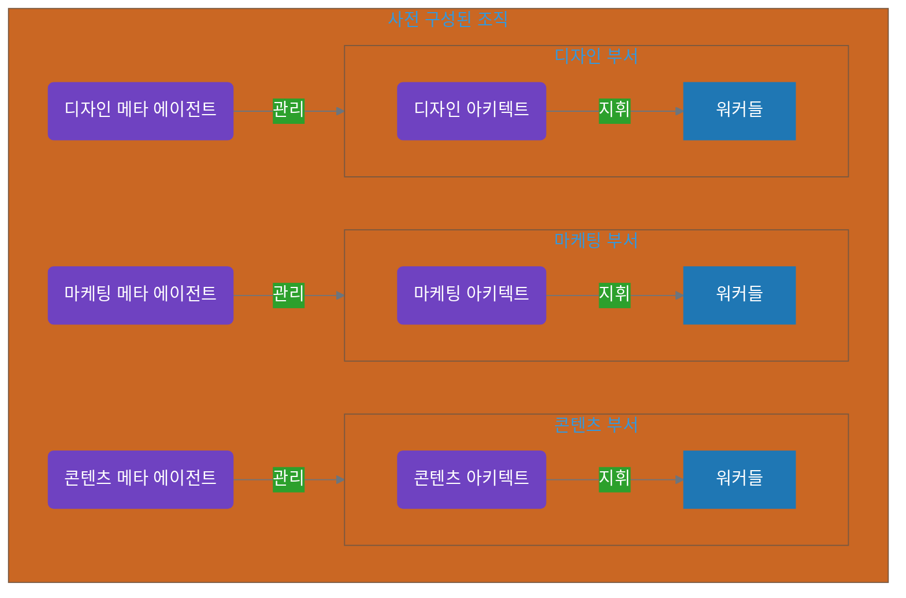
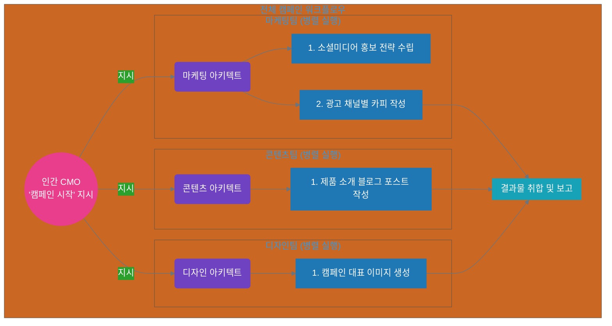

# 11장 3부: 복합 조직 설계

**Part 4: 아키텍처와 설계 패턴**

**목적:** 조직 전체의 표준으로 사용되며, 여러 팀(단위 조직)이 병렬적으로 협력하는 '복합 조직' 시스템 패턴을 학습합니다.

### 이 장에서 배우는 것
- '실행'과 '생성'이 분리된 복합 조직의 구조를 이해합니다.
- 여러 아키텍트 에이전트가 외부의 동일한 목표를 각자의 방식으로 해석하고 병렬적으로 작업을 수행하는 구조를 설계하는 방법을 익힙니다.
- 복잡한 계층 구조와 워크플로우를 다이어그램으로 명확하게 시각화하는 방법을 배웁니다.

---

## 들어가며: 회사의 프로젝트를 자동화하기

'복합 조직'은 여러 '단위 조직'이 모여 하나의 거대한 프로젝트를 수행하는, 가장 현실적인 회사 조직과 닮은 패턴입니다. 이 구조를 이해하는 핵심은 **'시스템 구성(Setup)'**과 **'프로젝트 실행(Execution)'**을 분리하는 것입니다.

1.  **시스템 구성 (메타 에이전트의 역할):** 프로젝트가 시작되기 전, **메타 에이전트**들은 회사의 부서들을 미리 구성합니다. 예를 들어, '마케팅 메타 에이전트'는 마케팅 부서에 필요한 아키텍트와 워커들을 미리 생성해두고, '콘텐츠 메타 에이전트'는 콘텐츠 팀을 미리 만들어 둡니다. 이들은 비즈니스에 직접 관여하지 않고, 회사의 조직 구조를 만들고 유지하는 역할을 합니다.

2.  **프로젝트 실행 (아키텍트의 역할):** 실제 프로젝트가 시작되면, **외부(예: 인간 CMO)**는 각 부서의 **아키텍트**들에게 직접 프로젝트 목표를 전달합니다. 예를 들어, "신제품 출시 캠페인 시작"이라는 동일한 지시가 '마케팅 아키텍트'와 '콘텐츠 아키텍트'에게 동시에 전달됩니다. 그러면 각 아키텍트는 자신의 전문성에 맞게 그 목표를 해석하여 팀(워커)을 이끌고 프로젝트를 수행합니다.

이 장의 예시는 4장의 '상황별 필수 원칙 매트릭스'에서 다음 위치에 해당합니다.
*   **조직 규모:** 복합 조직 (6개 이상)
*   **작업 복잡도:** 복잡/중요

---

### 11.3.1 [사례 5] 복잡/중요: 신제품 출시 캠페인 자동화

- **상황:** 인간 CMO가 '마케팅', '콘텐츠', '디자인' 각 부서의 아키텍트들에게 "신제품 '퀀텀 AI 글래스' 출시 캠페인을 시작하라"고 동시에 지시했다.
- **핵심 원칙:** `계층 구조`, `SoC`, `병렬 처리`

#### 에이전트 구조 설계 (사전에 구성된 조직도)

메타 에이전트들에 의해 사전에 다음과 같은 조직이 구성되어 있습니다.



#### 워크플로우 설계 (프로젝트 실행 흐름)

CMO의 지시가 각 아키텍트에게 전달되면, 세 팀은 각자의 전문성에 맞춰 병렬적으로 작업을 수행합니다.



#### 최종 인스트럭션 시스템 예시 (일부)

- **`마케팅 메타 에이전트.md` (사전 역할)**
```markdown
# 역할: 마케팅 조직 설계 전문가 (메타 에이전트)
# 목표: 마케팅 활동에 필요한 최적의 에이전트 조직(아키텍트, 워커)을 구성하고 유지보수한다.
# 트리거: 시스템 초기화 시 또는 조직 개편 요구 시.
```

- **`마케팅 아키텍트.md` (실행 역할)**
```markdown
# 역할: 마케팅 캠페인 매니저 (아키텍트)
# 목표: 외부로부터 캠페인 실행 지시를 받으면, 팀 내 워커들을 지휘하여 마케팅 산출물을 생성한다.
# 처리 방법:
# 1. 외부 지시(예: "신제품 출시")를 분석하여 구체적인 마케팅 액션 아이템으로 분해한다.
# 2. '소셜미디어 워커'에게 SNS 홍보 문구 작성을 지시한다.
# 3. '광고카피 워커'에게 광고 카피 작성을 지시한다.
# 4. (필요시) 팀에 '데이터 분석 워커'가 없으면, '마케팅 메타 에이전트'에게 생성을 요청한다.
# 5. 모든 결과물을 취합하여 외부 지시자에게 보고한다.
```

#### 팀 간 공통 산출물 스키마 예시

여러 팀이 병렬로 작업하더라도, 최종 취합을 위해서는 공통 인터페이스가 필요합니다. 아래는 각 팀이 제출하는 `campaign_artifact`의 공통 스키마 예시입니다.

```json
{
  "$schema": "https://json-schema.org/draft/2020-12/schema",
  "$id": "https://example.com/schemas/campaign_artifact.schema.json",
  "title": "CampaignArtifact",
  "type": "object",
  "additionalProperties": false,
  "properties": {
    "artifact_type": { "type": "string", "enum": ["copy", "blog_post", "image"] },
    "title": { "type": "string" },
    "description": { "type": "string" },
    "owner_team": { "type": "string", "enum": ["marketing", "content", "design"] },
    "handoff_to": { "type": "string", "enum": ["marketing", "content", "design", "final"] },
    "data_path": { "type": "string" },
    "metadata": {
      "type": "object",
      "properties": {
        "created_at": { "type": "string", "format": "date-time" },
        "tags": { "type": "array", "items": { "type": "string" } }
      }
    }
  },
  "required": ["artifact_type", "title", "owner_team", "handoff_to", "data_path"]
}
```

이 공통 스키마를 사용하면, 각 팀의 산출물은 동일한 키/형식을 따르므로 최종 단계에서 자동 취합이 용이해집니다.

#### 설계 분석
- **실행과 생성의 완벽한 분리:** **메타 에이전트**는 사전에 조직을 구성하는 '생성'의 역할만 수행합니다. 실제 프로젝트 **실행**은 **외부(CMO)**의 지시를 받은 **아키텍트**들이 각자 책임집니다. 이는 10장의 최종 모델과 완벽하게 일치합니다.
- **병렬 처리:** 각 아키텍트가 이끄는 팀은 독립적으로 작업을 수행하므로, 복잡한 프로젝트를 병렬적으로 처리하여 전체 소요 시간을 크게 단축할 수 있습니다.
- **동적 자원 요청:** 아키텍트는 프로젝트 수행 중 필요에 따라 자신을 관리하는 메타 에이전트에게 새로운 워커 생성을 요청하여 팀을 유연하게 확장할 수 있습니다.

## 실습 체크리스트
> 참고: 심화 과제는 [실습 과제 모음](practice-guide.md)을 참고하세요.

### 이 장을 완료하셨다면 다음을 확인하세요:
- [ ] 복합 조직에서 ‘시스템 구성(메타)’과 ‘프로젝트 실행(아키텍트)’을 분리해 설명할 수 있다
- [ ] 여러 팀의 병렬 실행과 최종 산출물 취합 과정을 설계할 수 있다
- [ ] 결합도를 낮추는 공통 스키마/인터페이스를 정의할 수 있다

### 실습 과제
1. ‘신제품 출시’와 같은 복합 프로젝트를 2개 팀 병렬 구조로 설계하고, 각 팀의 산출물 인터페이스를 정의하세요.
2. 최종 취합/보고 단계를 정의하고, 실패 시 재시도/재할당 전략을 간단히 기술하세요.
