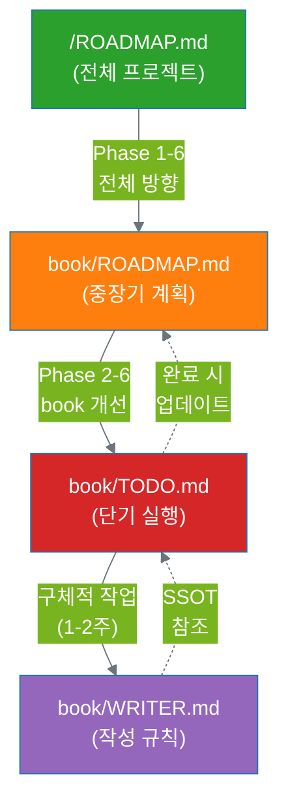
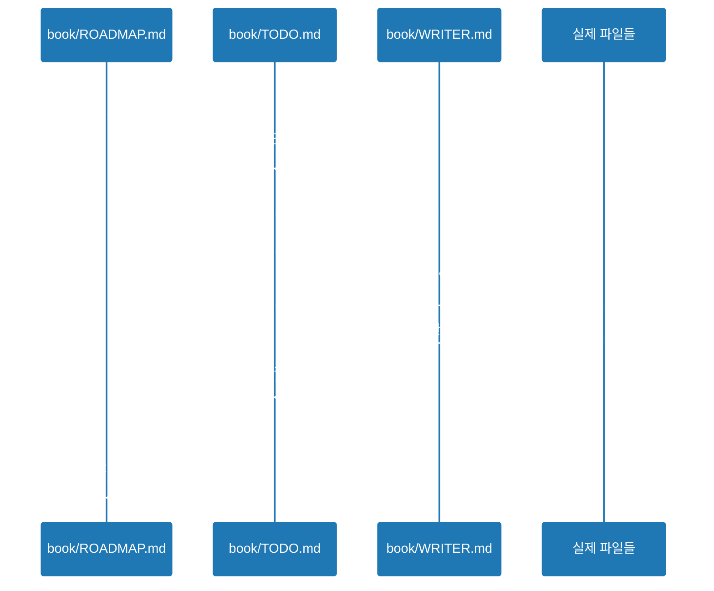

# Book 문서 구조 및 연동 가이드

이 문서는 `/book` 디렉토리의 주요 문서들이 어떻게 연동되는지 설명합니다.

## 📚 문서 계층 구조

## 🔗 문서 간 연동 규칙

### 1. ROADMAP.md (루트)
**역할:** 전체 프로젝트의 마스터 플랜
- **범위:** Phase 1-6 전체
- **기간:** 6개월 ~ 1년 이상
- **갱신:** 분기별 또는 주요 마일스톤 완료 시

**연동:**
- → `book/ROADMAP.md`: book 디렉토리 개선 계획 위임
- → `agents/`, `templates/`, `examples/`: 다른 디렉토리 계획 포함

### 2. book/ROADMAP.md
**역할:** book 콘텐츠 중장기 개선 로드맵
- **범위:** Phase 2-6 (Phase 1은 완료)
- **기간:** 3-6개월
- **갱신:** 월간 또는 Phase 완료 시

**연동:**
- ← `/ROADMAP.md`: 전체 맥락 참조
- → `book/TODO.md`: 각 Phase를 실행 작업으로 분해
- 참조: `book/WRITER.md` (작성 규칙)

### 3. book/TODO.md
**역할:** 즉시 실행 가능한 단기 작업 목록
- **범위:** 현재 진행 중인 Phase의 세부 작업
- **기간:** 1-2주
- **갱신:** 매일 또는 작업 완료 시

**연동:**
- ← `book/ROADMAP.md`: Phase별 목표 참조
- → 실제 파일 수정 작업
- ← `book/WRITER.md`: 작성 규칙 준수

### 4. book/WRITER.md
**역할:** 작성 규칙 SSOT (Single Source of Truth)
- **범위:** 문서 작성 스타일, 포맷, 원칙
- **기간:** 영구 (지속적 개선)
- **갱신:** 새로운 규칙 합의 시

**연동:**
- → `book/TODO.md`: 모든 작업이 이 규칙 준수
- → 모든 `.md` 파일: 스타일 가이드 제공

## 📋 작업 흐름 예시

### Phase 2.1 진행 과정

## 🎯 각 문서의 체크리스트

### book/ROADMAP.md 업데이트 시
- [ ] 해당 Phase의 TODO.md 링크 확인
- [ ] 완료된 Phase 체크박스 업데이트
- [ ] 다음 Phase 시작 시기 명시
- [ ] 루트 ROADMAP.md와 불일치 확인

### book/TODO.md 업데이트 시
- [ ] ROADMAP.md의 Phase 참조 링크 확인
- [ ] WRITER.md 규칙 준수 여부 점검
- [ ] 작업 이력에 날짜와 내용 기록
- [ ] 완료 시 체크박스 체크

### book/WRITER.md 업데이트 시
- [ ] 새 규칙이 기존 규칙과 충돌하지 않는지 확인
- [ ] TODO.md의 진행 중인 작업에 영향 점검
- [ ] 모든 챕터에 일관되게 적용 가능한지 검토

## 🔍 빠른 참조

| 궁금한 것 | 참조 문서 |
|---------|----------|
| 전체 프로젝트 방향은? | `/ROADMAP.md` |
| book 개선 중장기 계획은? | `book/ROADMAP.md` |
| 지금 당장 할 일은? | `book/TODO.md` |
| 문서 작성 규칙은? | `book/WRITER.md` |
| 용어 정의는? | `book/glossary.md` |
| 시각 자료 스타일은? | `book/WRITER.md` 부록 A |
| 목차 구조는? | `book/index.md` |

---

**마지막 업데이트:** 2025-10-06
