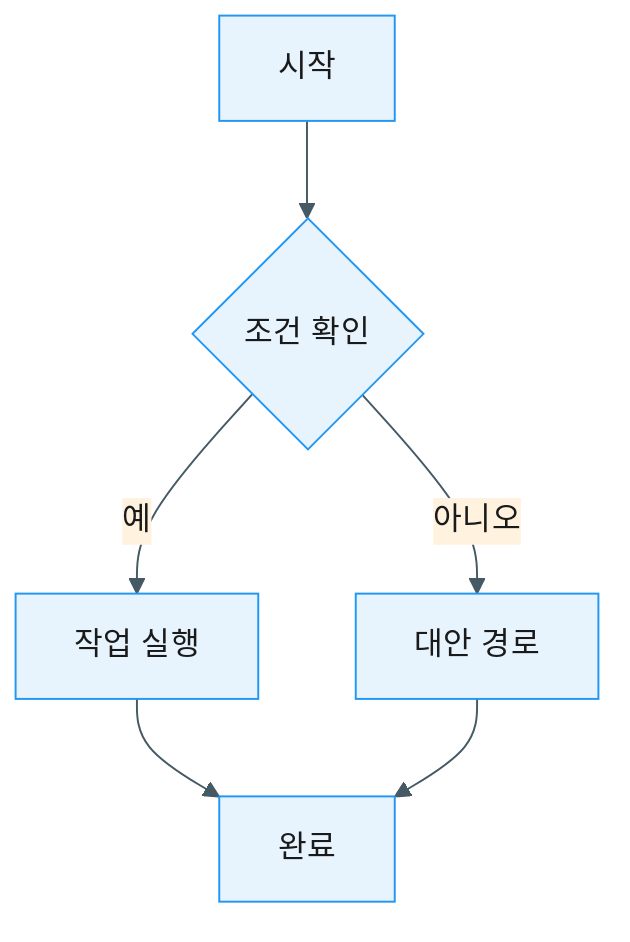
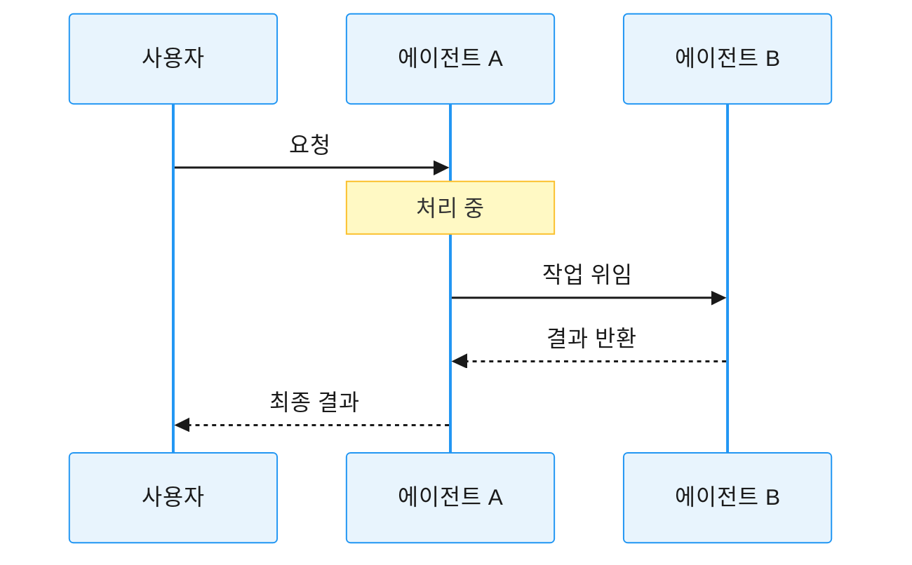
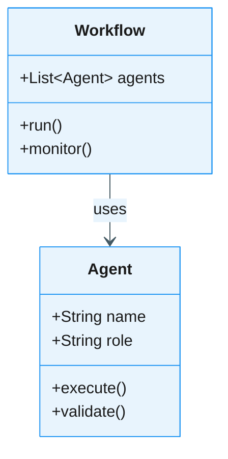
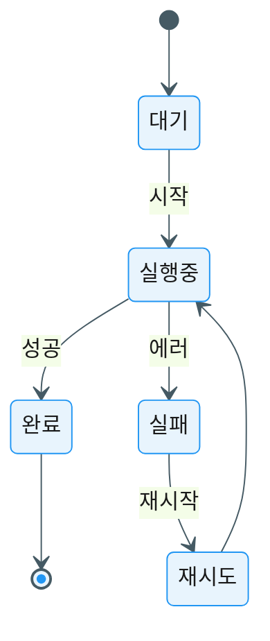
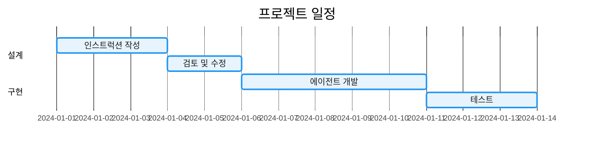

# 시각 자료 스타일 가이드

> 이 가이드는 AI 인스트럭션 설계 가이드북에서 사용하는 모든 다이어그램과 시각 자료의 표준 스타일을 정의합니다.

---

## 📋 목차

1. [기본 원칙](#기본-원칙)
2. [Mermaid 다이어그램 스타일](#mermaid-다이어그램-스타일)
3. [색상 팔레트](#색상-팔레트)
4. [다이어그램 유형별 가이드](#다이어그램-유형별-가이드)
5. [초기화 스니펫](#초기화-스니펫)

---

## 기본 원칙

### 1. 일관성 (Consistency)
- 모든 다이어그램은 동일한 스타일 가이드를 따릅니다
- 색상, 폰트, 간격은 일관되게 유지합니다

### 2. 명확성 (Clarity)
- 복잡한 개념도 한눈에 이해할 수 있도록 단순화합니다
- 불필요한 장식 요소는 최소화합니다

### 3. 접근성 (Accessibility)
- 색맹을 고려한 색상 조합 사용
- 충분한 대비와 가독성 확보

### 4. 실용성 (Practicality)
- Mermaid를 기본 도구로 사용 (코드로 관리 가능)
- 텍스트 기반으로 버전 관리 용이

---

## Mermaid 다이어그램 스타일

### 기본 설정

모든 Mermaid 다이어그램은 다음 초기화 블록으로 시작합니다:

```mermaid
%%{init: {
  'theme': 'base',
  'themeVariables': {
    'primaryColor': '#E8F4FD',
    'primaryTextColor': '#1a1a1a',
    'primaryBorderColor': '#2196F3',
    'lineColor': '#455a64',
    'secondaryColor': '#FFF3E0',
    'tertiaryColor': '#E8F5E9',
    'noteTextColor': '#1a1a1a',
    'noteBkgColor': '#FFF9C4',
    'noteBorderColor': '#FBC02D'
  }
}}%%
```

### 왜 초기화 스니펫이 필요한가?

1. **일관된 브랜딩**: 모든 다이어그램이 동일한 색상 체계 사용
2. **가독성 향상**: 최적화된 색상과 대비로 읽기 쉬움
3. **접근성**: 색맹 친화적 색상 팔레트
4. **전문성**: 통일된 스타일로 문서 품질 향상

---

## 색상 팔레트

### 주요 색상 (Primary Colors)

```
Primary: #2196F3 (파란색)
- 주요 노드, 강조 요소
- 시작점, 중요 개념

Secondary: #FF9800 (주황색)
- 보조 노드, 경고
- 선택적 경로, 대안

Tertiary: #4CAF50 (녹색)
- 성공, 완료
- 긍정적 결과, 권장사항
```

### 배경 색상 (Background Colors)

```
Primary Background: #E8F4FD (연한 파란색)
Secondary Background: #FFF3E0 (연한 주황색)
Tertiary Background: #E8F5E9 (연한 녹색)
Note Background: #FFF9C4 (연한 노란색)
```

### 테두리 및 선 (Borders & Lines)

```
Primary Border: #2196F3
Line Color: #455a64 (회색)
Note Border: #FBC02D (노란색)
```

### 텍스트 색상 (Text Colors)

```
Primary Text: #1a1a1a (거의 검정)
Note Text: #1a1a1a
```

---

## 다이어그램 유형별 가이드

### 1. Flowchart (플로우차트)

**용도**: 프로세스 흐름, 의사결정 트리

**예제**:


**권장사항**:
- 방향: 위에서 아래 (TD) 또는 왼쪽에서 오른쪽 (LR)
- 노드는 5-10개 이내로 제한
- 의사결정 포인트는 마름모 형태 사용

### 2. Sequence Diagram (시퀀스 다이어그램)

**용도**: 에이전트 간 상호작용, 메시지 교환

**예제**:


**권장사항**:
- 참여자(participant)는 축약어 사용
- 중요한 단계에는 Note 추가
- 비동기 메시지는 점선(-->>)으로 표시

### 3. Class Diagram (클래스 다이어그램)

**용도**: 에이전트 구조, 시스템 아키텍처

**예제**:


**권장사항**:
- 주요 속성과 메서드만 표시
- 관계는 명확한 레이블 추가
- 복잡도가 높으면 여러 다이어그램으로 분할

### 4. State Diagram (상태 다이어그램)

**용도**: 작업 상태, 라이프사이클

**예제**:


**권장사항**:
- 시작([*])과 종료 상태 명확히 표시
- 전이 조건은 간결하게
- 순환 구조는 주의해서 사용

### 5. Gantt Chart (간트 차트)

**용도**: 일정 계획, 타임라인

**예제**:


**권장사항**:
- 섹션으로 단계 구분
- 의존성(after)은 명확히 표시
- 전체 기간은 2-4주 이내로

---

## 초기화 스니펫

### 기본 스니펫 (모든 다이어그램 공통)

```
%%{init: {
  'theme': 'base',
  'themeVariables': {
    'primaryColor': '#E8F4FD',
    'primaryTextColor': '#1a1a1a',
    'primaryBorderColor': '#2196F3',
    'lineColor': '#455a64',
    'secondaryColor': '#FFF3E0',
    'tertiaryColor': '#E8F5E9',
    'noteTextColor': '#1a1a1a',
    'noteBkgColor': '#FFF9C4',
    'noteBorderColor': '#FBC02D'
  }
}}%%
```

### Sequence Diagram 전용

```
%%{init: {
  'theme': 'base',
  'themeVariables': {
    'primaryColor': '#E8F4FD',
    'primaryTextColor': '#1a1a1a',
    'primaryBorderColor': '#2196F3',
    'lineColor': '#455a64',
    'actorBkg': '#E8F4FD',
    'actorBorder': '#2196F3',
    'actorTextColor': '#1a1a1a',
    'noteBkgColor': '#FFF9C4',
    'noteBorderColor': '#FBC02D',
    'noteTextColor': '#1a1a1a'
  }
}}%%
```

### Gantt Chart 전용

```
%%{init: {
  'theme': 'base',
  'themeVariables': {
    'primaryColor': '#2196F3',
    'primaryTextColor': '#ffffff',
    'primaryBorderColor': '#1976D2',
    'lineColor': '#455a64',
    'gridColor': '#e0e0e0',
    'backgroundColor': '#ffffff'
  }
}}%%
```

---

## 사용 예제: 챕터별 권장 다이어그램

### Part 1-2: 기초 및 설계 원칙
- **Flowchart**: 프롬프트 → 인스트럭션 전환
- **Class Diagram**: 에이전트 구조

### Part 3: 워크플로우
- **Flowchart**: 파이프라인, 라우팅 패턴
- **Sequence Diagram**: 에이전트 간 협업
- **State Diagram**: 작업 상태 관리

### Part 4: 아키텍처
- **Class Diagram**: 시스템 구조
- **Sequence Diagram**: 계층적 협업
- **State Diagram**: 복잡한 상태 전이

### Part 5: 시스템 확장
- **Flowchart**: DSL 처리 과정
- **Gantt Chart**: 진화 로드맵
- **State Diagram**: 인스트럭션 라이프사이클

---

## 다이어그램 작성 체크리스트

- [ ] 초기화 스니펫 포함
- [ ] 색상 팔레트 준수
- [ ] 노드/요소 수 적정 (5-10개)
- [ ] 레이블 명확하고 간결
- [ ] 방향성 일관성 (TD 또는 LR)
- [ ] 범례 필요 시 추가
- [ ] 대체 텍스트 설명 포함 (접근성)

---

## 문의 및 개선

이 스타일 가이드는 지속적으로 개선됩니다. 제안사항이나 문의사항은 프로젝트 이슈 트래커를 통해 공유해주세요.

**버전**: 1.0.0  
**최종 업데이트**: 2025-10-07
