## 11.3 실전 사례

기본 설계 패턴을 실제로 어떻게 적용하는지 2가지 완전한 사례를 통해 알아보겠습니다.

### 11.3.1 콘텐츠 생성 사고 클러스터

**상황**: 마케팅 팀이 'AI 생산성'을 주제로 소셜 미디어 콘텐츠를 발행해야 합니다.

**목표**: 타겟 독자에게 공감을 얻고 인게이지먼트를 이끌어내는 200자 이내의 소셜 미디어 포스트 작성

**적용 패턴**: 단순 분기 패턴 (Simple Branching) + 순차 처리 (Sequential)

#### 사고 클러스터 설계

**전체 구조**:

```yaml
thinking_cluster:
  name: "소셜 미디어 콘텐츠 생성"
  goal: "AI 생산성 주제로 200자 소셜 미디어 포스트 발행"
  pattern: "simple_branching + sequential"
  
  coordinator:
    role: "소셜 미디어 사고 조율자"
    responsibilities:
      - "콘텐츠 전략 수립"
      - "사고 흐름 설계 (기획 → 작성 → 편집)"
      - "아이디어 선택 및 품질 기준 정의"
      - "최종 승인"
  
  workers:
    - name: "기획 워커"
      specialization: "타겟 분석 및 아이디어 제안"
    - name: "작성 워커"
      specialization: "매력적인 콘텐츠 작성"
    - name: "편집 워커"
      specialization: "품질 검증 및 최종 가공"
  
  thinking_process:
    stage_1: "기획: 아이디어 3개 제안"
    stage_2: "선택: 인간이 1개 아이디어 선택"
    stage_3: "작성: 선택된 아이디어로 초안 작성"
    stage_4: "편집: 품질 검증 및 최종 완성"
```

#### 단계별 실행

**Stage 1: 기획 (분기 시작)**

```yaml
stage_1_아이디어_제안:
  worker: "기획 워커"
  instruction:
    role: "창의적인 콘텐츠 전략가"
    context:
      topic: "AI 생산성"
      channel: "소셜 미디어"
      target_audience: "30-40대 직장인, 기술 친화적"
      brand_tone: "친근하고 전문적"
    task: "타겟 독자의 흥미를 유발할 콘텐츠 아이디어 3개 제안"
  
  output:
    - idea_A:
        angle: "실생활 사례 - 이메일 은 50% 절감"
        hook: "AI가 내 이메일을 읽고 답장을 제안하면?"
        pros: ["구체적이고 즉각적 가치", "직장인 공감대"]
        cons: ["너무 일상적일 수 있음"]
    
    - idea_B:
        angle: "생각의 전환 - 업무에서 크리에이터로"
        hook: "AI가 루틴을 맡으면, 당신은 무엇을 할 건가요?"
        pros: ["영감을 주는 메시지", "차별화된 관점"]
        cons: ["추상적일 수 있음"]
    
    - idea_C:
        angle: "데이터 기반 - 프로듀티비티 30% 증가 실험 결과"
        hook: "1000명의 직장인이 AI를 3개월 쓴 결과는?"
        pros: ["신뢰도 (데이터 기반)", "구체적 수치"]
        cons: ["데이터 입증 필요", "제3자 실험 느낌"]
```

**Stage 2: 인간 선택 (의사결정 지점)**

```yaml
stage_2_아이디어_선택:
  decision_maker: "마케팅 팀장 (인간)"
  
  evaluation_criteria:
    - "타겟 적합성: 우리 독자에게 공감 가는가?"
    - "차별성: 경쟁사와 다른 메시지인가?"
    - "실행 가능성: 현재 리소스로 제작 가능한가?"
    - "브랜드 합: 우리 브랜드 톤과 일치하는가?"
  
  decision:
    selected: "idea_B"
    rationale:
      - "우리 브랜드의 포지셔닝 (혁신적 사고)과 일치"
      - "경쟁사들이 '시간 절감'에만 집중하는 것과 차별화"
      - "독자에게 새로운 관점 제공"
      - "현재 커뮤니케이션 자산(디자인 리소스)로 제작 가능"
  
  rejected_ideas:
    - idea_A: "너무 일상적, 경쟁사와 차별화 어려움"
    - idea_C: "데이터 입증에 2주 소요, 일정 빠듯"
```

**Stage 3: 작성 (선택된 방향 실행)**

```yaml
stage_3_콘텐츠_작성:
  worker: "작성 워커"
  instruction:
    role: "재치 있는 소셜 미디어 전문가"
    selected_idea: "idea_B (크리에이터로의 전환)"
    requirements:
      length: "200자 이내"
      tone: "친근하고 전문적"
      structure: "Hook(1-2문장) + 본문(2-3문장) + Call-to-Action(1문장)"
      style: "브랜드 가이드 준수"
    task: "200자 소셜 미디어 포스트 초안 작성"
  
  output:
    draft: |
      AI가 루틴을 맡으면, 당신은 무엇을 할 건가요? 
      
      이메일 분류, 회의 요약, 보고서 작성... 이런 일들을 AI가 처리하면, 그 시간에 당신은 더 창의적인 일에 집중할 수 있습니다. 전략 수립, 문제 해결, 팀 협업처럼 말이죠.
      
      업무에서 크리에이터로. AI 시대의 새로운 역할을 상상해보세요.
    
    metadata:
      char_count: 198
      estimated_engagement: "medium-high"
      tone_check: "친근하고 전문적 ✅"
```

**Stage 4: 편집 (품질 검증)**

```yaml
stage_4_최종_편집:
  worker: "편집 워커"
  instruction:
    role: "깊까한 편집장"
    draft: "[위 초안]"
    quality_checks:
      - check_1:
          criterion: "길이 (200자 이내)"
          result: "✅ 198자"
      - check_2:
          criterion: "브랜드 톤 일치성"
          result: "✅ 통과"
      - check_3:
          criterion: "가독성 (Flesch 점수 60+)"
          result: "✅ 68점"
      - check_4:
          criterion: "호소력 (Hook 효과)"
          result: "⚠️ 개선 가능"
    task: "약점 개선 및 최종 완성"
  
  improvements:
    - area: "Hook 강화"
      before: "AI가 루틴을 맡으면, 당신은 무엇을 할 건가요?"
      after: "하루 3시간, AI에게 루티을 맡기면 무엇을 할 수 있을까요?"
      reason: "구체적 수치 추가로 현실감 증대"
  
  final_output: |
    하루 3시간, AI에게 루틴을 맡기면 무엇을 할 수 있을까요?
    
    이메일 분류, 회의 요약, 보고서 작성... 이런 일들을 AI가 처리하면, 그 시간에 당신은 더 창의적인 일에 집중할 수 있습니다. 전략 수립, 문제 해결, 팀 협업처럼 말이죠.
    
    업무에서 크리에이터로. AI 시대의 새로운 역할을 상상해보세요.
  
  final_quality_check:
    all_criteria: "✅ 통과"
    ready_for_publication: true
    approval: "팀장 최종 승인 필요"
```

#### 사고 흐름 다이어그램

```mermaid
%%{init: {
  'theme': 'base',
  'themeVariables': {
    'primaryColor': '#1f77b4',
    'primaryTextColor': '#ffffff',
    'primaryBorderColor': '#1f77b4',
    'lineColor': '#6c757d',
    'background': 'transparent',
    'edgeLabelBackground': '#2ca02c'
  }
}}%%
graph TD
    subgraph "콘텐츠 생성 사고 클러스터"
        Goal["목표: AI 생산성 콘텐츠"] --> Plan["기획 워커<br/>아이디어 3개"]
        Plan --> Ideas["아이디어 A, B, C<br/>(장단점 분석)"]
        Ideas --> Decision{{"팀장 선택<br/>(의사결정)"}}
        Decision -->|"아이디어 B"| Write["작성 워커<br/>초안 작성"]
        Write --> Draft["초안 (198자)<br/>Hook + 본문 + CTA"]
        Draft --> Edit["편집 워커<br/>품질 검증"]
        Edit --> QC{{"품질 체크<br/>(4가지 기준)"}}
        QC -->|"개선 필요"| Improve["편집 워커<br/>Hook 강화"]
        Improve --> Final["최종본<br/>(200자, 완성)"]
        QC -->|"통과"| Final
        Final --> Approval{{"팀장 승인"}}
        Approval -->|"승인"| Publish["발행 준비 완료"]
        Approval -.->|"반려"| Edit
    end
    
    classDef goal fill:#e1ffe1,stroke:#2ca02c,color:#000;
    classDef worker fill:#17a2b8,stroke:#17a2b8,color:#fff;
    classDef decision fill:#e83e8c,stroke:#e83e8c,color:#fff;
    classDef artifact fill:#ffc107,stroke:#ffc107,color:#000;
    classDef final fill:#dc3545,stroke:#dc3545,color:#fff;
    
    class Goal goal;
    class Plan,Write,Edit,Improve worker;
    class Decision,QC,Approval decision;
    class Ideas,Draft artifact;
    class Final,Publish final;
```



#### 핵심 인사이트

1. **사고 단계 분해**: "콘텐츠 생성"이라는 목표를 기획 → 선택 → 작성 → 편집으로 명확히 분해
2. **의사결정 지점**: 아이디어 선택과 최종 승인에서 인간이 전략적 판단
3. **품질 기준**: 길이, 톤, 가독성, 호소력 등 명확한 기준으로 품질 보장
4. **반복 개선**: 품질 미달 시 이전 단계로 되돌리기

---

### 11.3.2 데이터 분석 사고 클러스터

**상황**: 제품 팀이 사용자 행동 데이터를 분석하여 기능 개선 방향을 찾아야 합니다.

**목표**: 3개월 간의 사용자 행동 데이터를 분석하여 상위 3개 개선 기회를 도출하고 실행 계획 수립

**적용 패턴**: 순차 처리 (Sequential) + 병렬 처리 (Parallel)

#### 사고 클러스터 설계

**전체 구조**:

```yaml
thinking_cluster:
  name: "사용자 행동 데이터 분석"
  goal: "3개월 데이터에서 상위 3개 개선 기회 도출"
  pattern: "sequential + parallel"
  
  coordinator:
    role: "데이터 분석 사고 조율자"
    responsibilities:
      - "분석 전략 수립"
      - "병렬 분석 작업 조율"
      - "인사이트 통합 및 우선순위 결정"
      - "실행 계획 수립"
  
  workers:
    - name: "사용성 분석 워커"
      focus: "기능 사용 패턴 분석"
    - name: "성과 분석 워커"
      focus: "목표 달성률 분석"
    - name: "이탈 분석 워커"
      focus: "사용자 이탈 패턴 분석"
    - name: "통합 분석 워커"
      focus: "전체 인사이트 도출"
  
  thinking_process:
    stage_1: "데이터 준비 및 탐색 (순차)"
    stage_2: "3가지 관점 병렬 분석 (병렬)"
    stage_3: "결과 통합 및 인사이트 도출 (순차)"
    stage_4: "실행 계획 수립 (순차)"
```

#### 단계별 실행

**Stage 1: 데이터 준비 (순차)**

```yaml
stage_1_데이터_탐색:
  worker: "데이터 준비 워커"
  input:
    - "user_events.csv (3개월, 50만 행)"
    - "feature_usage.csv (10만 행)"
    - "user_goals.csv (3만 행)"
  
  actions:
    - "데이터 품질 확인"
    - "주요 패턴 개략 파악"
    - "비정상 값 식별"
  
  output:
    summary:
      - "총 사용자: 12,500명"
      - "기간: 2024-07-01 ~ 2024-09-30"
      - "주요 기능: 15개"
      - "데이터 품질: 양호 (95% 완전성)"
    
    initial_patterns:
      - "기능 A 사용률 높음 (80%)"
      - "기능 B 사용률 낮음 (15%)"
      - "사용자 이탈률 증가 추세"
```

**Stage 2: 병렬 분석 (병렬)**

```yaml
stage_2_병렬_분석:
  synchronization: "3개 워커 모두 완료 대기"
  
  # 워커 1: 사용성 분석
  usability_analysis:
    worker: "사용성 분석 워커"
    focus: "기능 사용 패턴"
    analysis:
      - metric: "기능별 사용 빈도"
        finding: "기능 A(80%), C(65%), D(50%) 상위 3개"
      - metric: "기능 조합 패턴"
        finding: "A+C 조합이 전체의 60%"
      - metric: "미사용 기능"
        finding: "기능 B, E, F는 15% 미만"
    
    insights:
      - insight_1: "기능 B는 사용자가 찾기 어려워함 (UI 문제)"
      - insight_2: "A+C 조합을 한 번에 할 수 있는 통합 기능 필요"
  
  # 워커 2: 성과 분석
  performance_analysis:
    worker: "성과 분석 워커"
    focus: "목표 달성률"
    analysis:
      - metric: "전체 목표 달성률"
        finding: "42% (낙관적 타겟: 60%)"
      - metric: "세그먼트별 차이"
        finding: "파워 유저 65%, 일반 유저 35%"
      - metric: "실패 주요 원인"
        finding: "복잡한 워크플로우 (5단계 이상)"
    
    insights:
      - insight_3: "복잡한 작업을 단순화하는 '퀀 스타트' 기능 필요"
      - insight_4: "파워 유저의 패턴을 일반 유저에게 추천"
  
  # 워커 3: 이탈 분석
  churn_analysis:
    worker: "이탈 분석 워커"
    focus: "사용자 이탈 패턴"
    analysis:
      - metric: "월별 이탈률"
        finding: "7월 8%, 8월 10%, 9월 12% (증가 추세)"
      - metric: "이탈 주요 시점"
        finding: "가입 후 7-14일 내 30%"
      - metric: "이탈 예측 신호"
        finding: "3일 연속 미접속 → 80% 이탈"
    
    insights:
      - insight_5: "초기 온보딩 강화 필수 (7일 이내)"
      - insight_6: "비활성 사용자 조기 경보 시스템"
```

**Stage 3: 결과 통합 및 우선순위 (순차)**

```yaml
stage_3_인사이트_통합:
  worker: "통합 분석 워커"
  inputs:
    - usability_insights: [insight_1, insight_2]
    - performance_insights: [insight_3, insight_4]
    - churn_insights: [insight_5, insight_6]
  
  prioritization_criteria:
    - "영향도 (사용자 수)"
    - "긴급성 (이탈률 관련)"
    - "실행 난이도 (개발 비용)"
  
  top_3_opportunities:
    - priority_1:
        insight: "insight_5 (초기 온보딩 강화)"
        impact: "고 (30% 이탈 발생 구간)"
        urgency: "고 (이탈률 증가 중)"
        difficulty: "중 (2주 개발)"
        expected_outcome: "이탈률 8%p 감소"
    
    - priority_2:
        insight: "insight_2 (A+C 통합 기능)"
        impact: "고 (60% 사용자 해당)"
        urgency: "중"
        difficulty: "중 (3주 개발)"
        expected_outcome: "효율성 40% 향상"
    
    - priority_3:
        insight: "insight_3 (퀀 스타트 기능)"
        impact: "중 (42% 목표 달성률 향상)"
        urgency: "중"
        difficulty: "높음 (4주 개발)"
        expected_outcome: "목표 달성률 60%로 증가"
```

**Stage 4: 실행 계획 (순차)**

```yaml
stage_4_실행_계획:
  coordinator: "사고 조율자"
  
  for_priority_1:
    action: "초기 온보딩 프로그램 개편"
    timeline: "2주 (Q4 Week 1-2)"
    tasks:
      - "환영 이메일 개선 (친근한 톤)"
      - "대화형 튠토리얼 3개 추가"
      - "7일 진행 체크포인트 신규 생성"
      - "달성 시 배지/인센티브 제공"
    kpi:
      - "주간 활성 사용자 (WAU) 15% 증가"
      - "7일 유지율 60% → 75%"
  
  for_priority_2:
    action: "'A+C 스마트 결합' 기능 개발"
    timeline: "3주 (Q4 Week 3-5)"
    tasks:
      - "사용자 패턴 60% 분석 후 자동 제안"
      - "원클릭 결합 UI"
      - "방금 사용한 기능 조합 추천"
    kpi:
      - "A+C 조합 사용 시간 40% 감소"
      - "사용자 만족도 (CSAT) +10%p"
  
  for_priority_3:
    action: "퀀 스타트 탬플릿 시스템"
    timeline: "4주 (Q4 Week 6-9)"
    tasks:
      - "고급 사용자 패턴 5가지 탬플릿화"
      - "상황별 자동 추천 엔진"
      - "커스터마이징 기능 추가"
    kpi:
      - "목표 달성률 42% → 60%"
      - "탬플릿 사용률 30% 달성"
  
  final_output:
    deliverable: "Q4 제품 개선 로드맵 (12페이지)"
    sections:
      - "데이터 분석 요약"
      - "상위 3개 기회 상세"
      - "실행 계획 및 타임라인"
      - "기대 효과 및 KPI"
    approval: "제품팀장 + CTO 승인 필요"
```

#### 핵심 인사이트

1. **병렬 + 순차 조합**: 독립적인 분석은 병렬로, 통합과 실행은 순차로 진행
2. **다각도 분석**: 사용성, 성과, 이탈 3가지 관점으로 종합적 인사이트
3. **우선순위 매트릭스**: 영향도, 긴급성, 난이도로 명확한 우선순위
4. **실행 중심**: 분석에서 멈추지 않고 구체적 실행 계획까지 제시


> 참고: 심화 과제는 [실습 과제 모음](practice-guide.md)을 참고하세요.

### 이 장을 완료하셨다면 다음을 확인하세요:

#### 핵심 개념 이해
- [ ] 사고 클러스터의 정의와 AI 사고 생태계에서의 역할을 설명할 수 있다
- [ ] 인간(사고 조율자)과 AI(실행 워커)의 역할 차이를 명확히 구분할 수 있다
- [ ] 사고 프로세스와 실행 항목의 차이를 이해하고 변환할 수 있다
- [ ] 목표를 관리 가능한 사고 단위로 분해하는 원칙을 적용할 수 있다

#### 설계 패턴 활용
- [ ] 단순 분기 패턴의 구조를 이해하고 적절한 상황에 적용할 수 있다
- [ ] 순차 처리 패턴의 품질 게이트를 설계할 수 있다
- [ ] 병렬 처리 패턴의 동기화 전략을 수립할 수 있다
- [ ] 실제 목표에 맞는 최적의 패턴을 선택하고 조합할 수 있다

#### 실전 적용
- [ ] YAML 형식으로 사고 클러스터 구조를 문서화할 수 있다
- [ ] Python 코드로 사고 프로세스를 구현할 수 있다
- [ ] 의사결정 지점을 식별하고 명시할 수 있다
- [ ] 완전한 사례 연구를 통해 end-to-end 사고 클러스터를 설계할 수 있다

### 실습 과제

#### 기초 실습 (필수)
1. **목표 분해 연습**
   - 자신의 업무에서 전략적 목표 1개를 선택하세요
   - 그 목표가 왜 중요한지 설명하세요 (비즈니스 가치)
   - 목표를 3-5개의 사고 단계로 분해하세요
   - 각 단계의 핵심 질문을 정의하세요

2. **역할 분담 설계**
   - 1번에서 분해한 각 사고 단계에서:
     * 사고 조율자(인간)의 책임을 명시하세요
     * 실행 워커(AI)의 작업을 정의하세요
     * 의사결정 지점을 표시하세요 (최소 2개)

3. **YAML 문서화**
   - 1-2번의 결과를 YAML 형식으로 작성하세요
   - 11.1-11.3의 예시를 참고하되, 자신의 맥락에 맞게 수정하세요
   - 다음 섹션을 포함하세요:
     * thinking_cluster (이름, 목표, 패턴)
     * coordinator (역할, 책임)
     * workers (각 워커의 전문성)
     * thinking_process (단계별 사고 흐름)

#### 심화 실습 (선택)
4. **패턴 선택 및 적용**
   - 3가지 기본 패턴(단순 분기, 순차, 병렬) 중 적합한 것을 선택하세요
   - 선택 이유를 설명하세요 (왜 다른 패턴은 안 되는가?)
   - 선택한 패턴을 자신의 목표에 적용한 구체적인 설계를 작성하세요
   - 가능하다면 여러 패턴을 조합하세요 (예: 단순 분기 + 순차)

5. **Python 구현**
   - 4번의 설계를 Python 코드로 구현하세요
   - 최소한 다음을 포함하세요:
     * ThinkingCoordinator 클래스
     * ExecutionWorker 클래스(들)
     * 사고 흐름을 표현하는 메서드
     * 의사결정 지점 처리 로직
   - 실제 데이터로 테스트하고 결과를 확인하세요

6. **완전한 사례 작성**
   - 1-5번의 결과를 11.3처럼 완전한 사례 연구로 작성하세요
   - 다음을 포함하세요:
     * 상황 및 목표 정의
     * 전체 사고 클러스터 구조 (YAML)
     * 단계별 실행 과정 (상세)
     * 사고 흐름 다이어그램 (Mermaid)
     * 핵심 인사이트 3-5개
   - 동료나 팀원과 공유하고 피드백을 받으세요

### 자가 평가

#### 이해도 체크
다음 질문에 답할 수 있으면 이 장을 충분히 이해한 것입니다:

1. "사고 클러스터가 없이 바로 실행 항목으로 가면 왜 문제인가?"
2. "인간이 사고 조율자 역할을 해야 하는 이유는?"
3. "단순 분기 패턴과 순차 처리 패턴의 핵심 차이는?"
4. "병렬 처리 패턴에서 동기화가 중요한 이유는?"
5. "사고 클러스터 설계 시 가장 먼저 해야 할 일은?"

#### 적용 수준 체크
- **레벨 1 (기초)**: YAML로 사고 클러스터를 문서화할 수 있다
- **레벨 2 (중급)**: 3가지 패턴을 구분하고 상황에 맞게 선택할 수 있다
- **레벨 3 (고급)**: Python으로 사고 클러스터를 구현하고 실제로 작동시킬 수 있다
- **레벨 4 (전문가)**: 복잡한 목표를 여러 패턴을 조합하여 최적화된 사고 클러스터로 설계할 수 있다

현재 자신의 레벨은 어디인가요? 다음 레벨로 가기 위해 어떤 실습이 필요한가요?

### 다음 단계

이 장을 완료했다면:
- **12장**으로 진행: 복잡한 목표를 위한 계층적 사고 클러스터
- **13장** 미리보기: 실행 항목을 지원하는 도구 생태계
- **15장** 참고: 피드백 루프를 통한 사고 클러스터 개선

### 추가 자료

#### 추천 읽기
- Simon, H. A. (1996). *The Sciences of the Artificial*. MIT Press. (사고 프로세스 설계에 관한 고전)
- Kahneman, D. (2011). *Thinking, Fast and Slow*. Farrar, Straus and Giroux. (인간 사고의 두 시스템)
- Tetlock, P. E., & Gardner, D. (2015). *Superforecasting: The Art and Science of Prediction*. Crown. (구조화된 사고의 힘)

#### 참고 프레임워크
- **OODA Loop** (Observe-Orient-Decide-Act): 의사결정 프로세스 설계
- **Design Thinking**: 문제 해결 사고 프로세스
- **Critical Path Method (CPM)**: 순차 및 병렬 작업 최적화