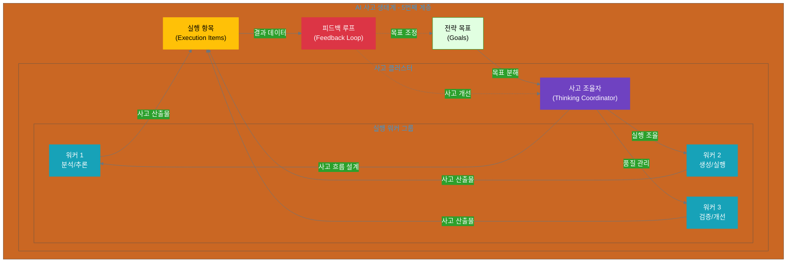
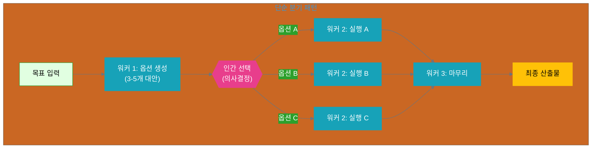
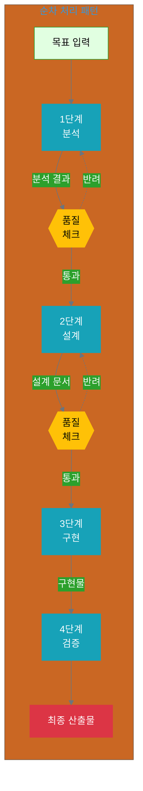
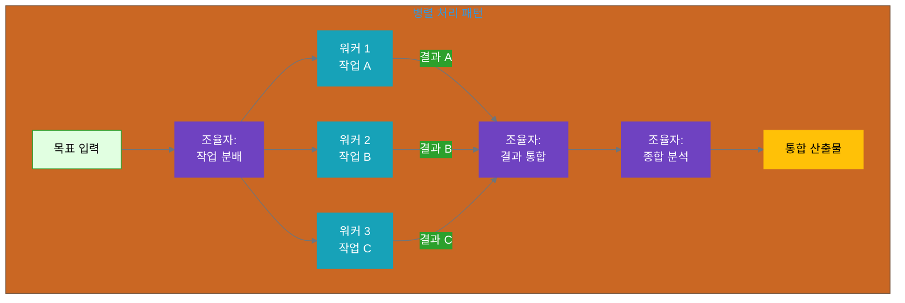

# 11장: 기본 사고 클러스터
**난이도**: ⭐⭐⭐ (중급)

**Part 4: 사고 중심 조직 아키텍처**

---

## 들어가며: 목표에서 사고로

지금까지 우리는 개인의 AI 활용(1권)에서 조직의 전략 설계(2권 서문)까지 여정을 따라왔습니다. 이제 가장 중요한 단계에 도달했습니다: **어떻게 전략적 목표를 실제로 달성할 것인가?**

전통적인 조직에서는 이 질문에 "누가 무엇을 할 것인가?"라고 답합니다. 역할을 나누고, 작업을 배분하고, 실행을 감독합니다. 하지만 AI 시대에는 다른 질문이 필요합니다: **"어떻게 생각하고 추론할 것인가?"**

이것이 바로 **사고 클러스터(Thinking Cluster)**의 핵심입니다.

### AI 사고 생태계에서의 위치

2권 서문에서 소개한 AI 사고 생태계 6계층을 기억하시나요? 11장은 그 중 **5번째 계층: 사고 클러스터**를 다룹니다.

```yaml
전략 계층 (인간 주도):
  1. 미션: 조직 존재 이유
  2. 핵심 가치: 의사결정 기준
  3. 비전: 미래 상태
  
실행 계층 (인간-AI 협업):
  4. 목표: 전략적 목표
  5. 사고 클러스터 ⭐ ← 11장이 다루는 계층
  6. 실행 항목: 구체적 작업
```

**사고 클러스터의 역할**:
- 위로부터: 전략적 목표를 받아 관리 가능한 사고 단위로 분해
- 아래로: 실행 항목들을 생성하고 조율
- 피드백: 실행 결과를 분석하여 목표 조정에 기여

### 사고 클러스터란?

**사고 클러스터(Thinking Cluster)**는 하나의 전략적 목표를 달성하기 위한 **사고 프로세스의 기본 단위**입니다.

**정의**:
> 인간과 AI가 함께 사고하고, 추론하며, 실험하고, 반성하는 작업 단위로, 복잡한 목표를 관리 가능한 사고 단위로 분해합니다.

**핵심 특징**:
1. **사고 중심**: "누가 하는가"보다 "어떻게 생각하는가"에 집중
2. **목표 지향**: 하나의 명확한 전략 목표에 집중
3. **협업 구조**: 사고 조율자(인간)와 실행 워커(AI)의 역할 분담
4. **반복 개선**: 피드백을 통해 사고 프로세스 자체를 개선

### 왜 사고 클러스터인가?

**전통적 접근의 한계**:
```
전통적 조직:
목표 → 작업 나누기 → 사람에게 배분 → 실행

문제점:
- "작업"이 구체적이지 않으면 혼란
- 역할이 고정되어 유연성 부족
- 사고 프로세스가 암묵적이어서 개선 어려움
```

**사고 클러스터 접근**:
```
사고 중심 조직:
목표 → 사고 프로세스 설계 → 사고 단위 분해 → 실행 항목 도출

장점:
- 사고 과정이 명시적이어서 검증 가능
- 프로세스가 명확해서 AI 지원 용이
- 피드백을 통해 사고 자체를 개선
```

**실전 예시**:

전통적 접근:
- 목표: "소셜 미디어에 콘텐츠 발행"
- 작업: "콘텐츠 작성" → 애매모호
- 질문: "어떤 콘텐츠? 어떤 톤? 누구를 위해?"

사고 클러스터 접근:
- 목표: "소셜 미디어에 콘텐츠 발행"
- 사고: "기획 → 작성 → 편집" 프로세스 설계
- 각 단계의 추론 방식 명시
- 의사결정 지점 정의

### 11장에서 배울 것

이 장에서는 **기본 사고 클러스터 패턴**을 다룹니다. "기본"이란 **단일 목표를 하나의 사고 클러스터로 처리**하는 가장 기본적인 형태입니다. (12장에서는 복잡한 목표를 여러 사고 클러스터로 분해하는 "계층적" 패턴을 다룹니다.)

**학습 목표**:
- [ ] 사고 클러스터의 기본 개념과 구조를 이해한다
- [ ] 인간(사고 조율자)과 AI(실행 워커)의 역할을 구분할 수 있다
- [ ] 사고와 실행의 차이를 명확히 인식한다
- [ ] 기본 설계 패턴 3가지를 적용할 수 있다
- [ ] 실전 사례를 통해 사고 클러스터를 설계할 수 있다

### 사고 클러스터 개요

다음 다이어그램은 기본 사고 클러스터의 구조를 보여줍니다:



### 이 장의 구성

- **11.1 사고 클러스터의 기본 개념**
  - 단일 목표에서 사고 단위로의 전환
  - 인간과 AI의 역할 분담
  - 사고 vs 실행 항목

- **11.2 기본 설계 패턴**
  - 단순 분기 패턴
  - 순차 처리 패턴
  - 병렬 처리 패턴

- **11.3 실전 사례**
  - 콘텐츠 생성 사고 클러스터
  - 데이터 분석 사고 클러스터

### 다음 장 예고

12장에서는 **계층적 사고 클러스터**를 다룹니다. 복잡한 목표를 여러 사고 클러스터로 분해하고, 메타 조율자가 전체 사고 구조를 관리하는 방법을 배웁니다.

---

## 11.1 사고 클러스터의 기본 개념

### 11.1.1 단일 목표에서 사고 단위로

**목표의 복잡성**

전략적 목표는 종종 추상적이고 복잡합니다:
- "소셜 미디어에 콘텐츠 발행"
- "고객 데이터 분석 보고서 작성"
- "제품 비교 콘텐츠 생성"

이러한 목표를 **바로 실행 항목으로 변환**하려고 하면 문제가 발생합니다:
- 너무 애매해서 무엇을 해야 할지 불분명
- 중간 의사결정 지점이 명확하지 않음
- 품질 기준이 주관적이고 측정하기 어려움

**사고 클러스터의 역할**

사고 클러스터는 목표와 실행 사이의 **사고 계층**을 만듭니다:

```yaml
목표: 소셜 미디어에 콘텐츠 발행

사고 클러스터 (사고 프로세스 설계):
  사고_단계_1:
    이름: 콘텐츠 기획
    질문: "무엇에 대해 쓸 것인가?"
    추론: 타겟 독자 분석 → 주제 선정 → 메시지 정의
    
  사고_단계_2:
    이름: 콘텐츠 작성
    질문: "어떻게 쓸 것인가?"
    추론: 톤앤매너 결정 → 구조 설계 → 초안 작성
    
  사고_단계_3:
    이름: 콘텐츠 편집
    질문: "품질을 어떻게 보장할 것인가?"
    추론: 브랜드 가이드 검증 → 가독성 개선 → 최종 검토

실행 항목:
  - 타겟 독자 페르소나 정의 (워커 1)
  - 아이디어 3개 생성 (워커 1)
  - 선택된 아이디어로 초안 작성 (워커 2)
  - 톤앤매너 검증 (워커 3)
  - 최종본 완성 (워커 3)
```

**사고 분해 원칙**

효과적인 사고 클러스터를 설계하려면 다음 원칙을 따릅니다:

1. **명확한 질문**: 각 사고 단계는 하나의 핵심 질문에 답합니다
2. **논리적 흐름**: 사고 단계들이 자연스럽게 연결됩니다
3. **의사결정 지점**: 인간의 판단이 필요한 지점을 명시합니다
4. **검증 가능성**: 각 단계의 산출물을 평가할 수 있습니다

**기본 패턴 YAML**

```yaml
thinking_cluster:
  name: "콘텐츠 생성 사고 클러스터"
  goal: "소셜 미디어 콘텐츠 발행"
  
  coordinator:
    role: "사고 조율자"
    responsibilities:
      - "전체 사고 흐름 설계"
      - "워커들에게 작업 분배"
      - "의사결정 지점 관리"
      - "품질 검증"
  
  thinking_process:
    - stage: 1
      name: "기획"
      question: "무엇에 대해 쓸 것인가?"
      worker: "기획 워커"
      outputs:
        - "타겟 독자 페르소나"
        - "콘텐츠 아이디어 3개"
      decision_point: "인간이 아이디어 1개 선택"
    
    - stage: 2
      name: "작성"
      question: "어떻게 쓸 것인가?"
      worker: "작성 워커"
      inputs: ["선택된 아이디어"]
      outputs: ["콘텐츠 초안"]
    
    - stage: 3
      name: "편집"
      question: "품질을 어떻게 보장할 것인가?"
      worker: "편집 워커"
      inputs: ["콘텐츠 초안"]
      outputs: ["최종 콘텐츠"]
      quality_checks:
        - "브랜드 가이드 준수"
        - "가독성 (Flesch 점수 60+)"
        - "길이 (200자 이내)"
```

### 11.1.2 인간과 AI의 역할

사고 클러스터에서 인간과 AI는 명확한 역할 분담을 합니다.

**인간의 역할: 사고 조율자 (Thinking Coordinator)**

사고 조율자는 전체 사고 프로세스를 설계하고 관리합니다:

```yaml
thinking_coordinator:
  what_to_think:
    - "어떤 문제를 풀 것인가?" (목표 이해)
    - "어떤 순서로 생각할 것인가?" (사고 흐름)
    - "어떤 판단이 중요한가?" (의사결정 지점)
  
  why_to_think:
    - "왜 이 방향인가?" (전략적 맥락)
    - "핵심 가치는 무엇인가?" (판단 기준)
    - "성공의 정의는?" (품질 기준)
  
  responsibilities:
    - 사고 프로세스 설계
    - 의사결정 지점 관리
    - 품질 기준 정의
    - 예외 상황 처리
```

**AI의 역할: 실행 워커 (Execution Worker)**

실행 워커는 정의된 사고 프로세스에 따라 분석과 실행을 담당합니다:

```yaml
execution_worker:
  how_to_think:
    - "어떻게 분석할 것인가?" (데이터 처리)
    - "어떻게 생성할 것인가?" (콘텐츠 생성)
    - "어떻게 검증할 것인가?" (품질 확인)
  
  when_to_think:
    - "언제 시작하는가?" (트리거 조건)
    - "언제 멈추는가?" (완료 조건)
    - "언제 에스컬레이션하는가?" (예외 처리)
  
  responsibilities:
    - 데이터 분석 및 패턴 인식
    - 규칙 기반 추론
    - 콘텐츠 생성 및 변환
    - 반복 작업 수행
```

**역할 분담 표**

| 측면 | 사고 조율자 (인간) | 실행 워커 (AI) |
|------|----------------|--------------|
| **사고 수준** | 전략적 사고 (What/Why) | 실행적 사고 (How/When) |
| **의사결정** | 맥락적, 가치 기반 판단 | 규칙 기반, 데이터 기반 판단 |
| **창의성** | 새로운 접근 방식 창조 | 패턴 기반 생성 |
| **책임** | 전체 사고 흐름 설계 | 정의된 단계 실행 |
| **피드백** | 사고 프로세스 개선 | 실행 효율성 개선 |

**협업 사례**

**콘텐츠 생성 시나리오**:

```python
# 사고 조율자 (인간)
class ThinkingCoordinator:
    def design_thinking_process(self, goal):
        """
        목표: 소셜 미디어 콘텐츠 발행
        사고 프로세스 설계
        """
        return {
            'stage_1': {
                'question': '무엇에 대해 쓸 것인가?',
                'worker': 'ideation_worker',
                'decision': 'human_selects_idea'
            },
            'stage_2': {
                'question': '어떻게 쓸 것인가?',
                'worker': 'writing_worker',
                'quality': 'brand_guidelines'
            },
            'stage_3': {
                'question': '품질을 어떻게 보장할 것인가?',
                'worker': 'editing_worker',
                'criteria': ['readability', 'length', 'tone']
            }
        }
    
    def make_strategic_decision(self, ideas):
        """
        전략적 판단: 3개 아이디어 중 1개 선택
        - 타겟 적합성
        - 브랜드 일치성
        - 실행 가능성
        """
        # 인간의 맥락적 판단
        return selected_idea

# 실행 워커 (AI)
class ExecutionWorker:
    def analyze_and_generate(self, instruction, context):
        """
        분석 및 생성:
        - 타겟 독자 분석
        - 아이디어 생성
        - 콘텐츠 작성
        """
        # AI의 패턴 기반 실행
        return output
    
    def verify_quality(self, content, criteria):
        """
        품질 검증:
        - 브랜드 가이드 준수
        - 가독성 점수 계산
        - 길이 확인
        """
        # AI의 규칙 기반 검증
        return quality_report
```

**의사결정 지점 관리**

사고 조율자는 특정 지점에서 인간의 판단을 요청합니다:

```yaml
decision_points:
  - stage: "기획"
    when: "아이디어 3개 생성 후"
    question: "어떤 아이디어를 진행할 것인가?"
    human_role: "전략적 선택"
    ai_role: "옵션 제공 및 분석"
    
  - stage: "작성"
    when: "초안 완성 후"
    question: "톤이 브랜드에 맞는가?"
    human_role: "브랜드 적합성 판단"
    ai_role: "가이드라인 준수 여부 체크"
    
  - stage: "편집"
    when: "최종본 전"
    question: "발행 준비가 되었는가?"
    human_role: "최종 승인"
    ai_role: "체크리스트 검증"
```

### 11.1.3 사고 vs 실행 항목

사고 클러스터와 실행 항목의 차이를 명확히 이해하는 것이 중요합니다.

**사고 클러스터 (Thinking Cluster)**

**정의**: 어떻게 생각하고 추론할 것인가의 프로세스

**특징**:
- 추상적, 반복 가능
- 사고 흐름에 집중
- 다양한 상황에 적용 가능
- 개선 가능한 프로세스

**예시**:
```yaml
thinking_cluster: "콘텐츠 생성 사고 프로세스"
  - 타겟 이해 → 메시지 정의 → 구조 설계 → 초안 작성 → 편집
```

**실행 항목 (Execution Item)**

**정의**: 무엇을 구체적으로 할 것인가의 작업

**특징**:
- 구체적, 일회성
- 결과물에 집중
- 특정 상황에 맞춤
- 완료/미완료 판정 가능

**예시**:
```yaml
execution_items:
  - "AI 생산성 주제로 아이디어 3개 생성"
  - "선택된 아이디어로 200자 소셜 미디어 포스트 작성"
  - "브랜드 톤에 맞게 최종 편집"
```

**변환 프로세스**

사고 클러스터에서 실행 항목이 도출되는 과정:

```python
# 사고 클러스터 정의
thinking_cluster = {
    'name': '콘텐츠 생성 프로세스',
    'stages': [
        {'name': '기획', 'pattern': '타겟 분석 → 아이디어 생성'},
        {'name': '작성', 'pattern': '구조 설계 → 초안 작성'},
        {'name': '편집', 'pattern': '품질 검증 → 최종 수정'}
    ]
}

# 구체적 상황 (인풋)
context = {
    'topic': 'AI 생산성',
    'channel': '소셜 미디어',
    'length': '200자',
    'tone': '친근하고 전문적'
}

# 실행 항목 도출
def generate_execution_items(thinking_cluster, context):
    """
    사고 프로세스 + 구체적 맥락 → 실행 항목
    """
    items = []
    
    for stage in thinking_cluster['stages']:
        if stage['name'] == '기획':
            items.append({
                'task': f"{context['topic']} 주제로 아이디어 3개 생성",
                'worker': 'ideation_worker',
                'output': '아이디어 리스트'
            })
        
        elif stage['name'] == '작성':
            items.append({
                'task': f"선택된 아이디어로 {context['length']} {context['tone']} 톤의 포스트 작성",
                'worker': 'writing_worker',
                'output': '콘텐츠 초안'
            })
        
        elif stage['name'] == '편집':
            items.append({
                'task': f"브랜드 가이드 준수 확인 및 최종 편집",
                'worker': 'editing_worker',
                'output': '최종 콘텐츠'
            })
    
    return items

# 결과
execution_items = generate_execution_items(thinking_cluster, context)
```

**출력 결과**:

```yaml
execution_items:
  - task: "AI 생산성 주제로 아이디어 3개 생성"
    worker: "ideation_worker"
    output: "아이디어 리스트"
    estimated_time: "5분"
    
  - task: "선택된 아이디어로 200자 친근하고 전문적인 톤의 포스트 작성"
    worker: "writing_worker"
    input: "선택된 아이디어"
    output: "콘텐츠 초안"
    estimated_time: "10분"
    
  - task: "브랜드 가이드 준수 확인 및 최종 편집"
    worker: "editing_worker"
    input: "콘텐츠 초안"
    output: "최종 콘텐츠"
    quality_checks:
      - "길이: 200자 이내"
      - "톤: 브랜드 가이드 일치"
      - "가독성: Flesch 점수 60+"
    estimated_time: "5분"
```

**비교표**

| 측면 | 사고 클러스터 | 실행 항목 |
|------|-------------|----------|
| **추상화 수준** | 높음 (프로세스) | 낮음 (작업) |
| **재사용성** | 높음 (다양한 상황) | 낮음 (특정 상황) |
| **측정 가능성** | 프로세스 품질 | 결과물 품질 |
| **개선 대상** | 사고 흐름 | 실행 효율 |
| **예시** | "타겟 이해 → 아이디어 생성" | "AI 생산성 주제 아이디어 3개" |

**핵심 통찰**

1. **사고 클러스터는 템플릿**: 반복 사용 가능한 사고 프로세스
2. **실행 항목은 인스턴스**: 특정 상황에 적용된 구체적 작업
3. **변환은 자동화 가능**: 사고 프로세스 + 맥락 → 실행 항목
4. **개선은 각각 독립적**: 사고 개선 ≠ 실행 개선

---

## 11.2 기본 설계 패턴

사고 클러스터를 설계할 때 자주 사용되는 3가지 기본 패턴이 있습니다. 각 패턴은 특정 유형의 목표에 적합하며, 실제 상황에서는 이들을 조합하여 사용할 수 있습니다.

### 11.2.1 단순 분기 패턴 (Simple Branching)

**정의**

단순 분기 패턴은 초기 단계에서 여러 옵션을 생성하고, 인간이 하나를 선택한 후 나머지 프로세스를 진행하는 패턴입니다.

**사용 시나리오**:
- 창의적 방향성 결정이 필요할 때
- 여러 대안 중 선택이 필요할 때
- 초기 결정이 전체 프로세스에 큰 영향을 미칠 때

**구조 다이어그램**:



**YAML 구조**:

```yaml
thinking_cluster:
  name: "단순 분기 패턴"
  pattern: "simple_branching"
  
  stages:
    - stage: 1
      name: "옵션 생성"
      worker: "generation_worker"
      action: "여러 대안 제시"
      output:
        type: "list"
        count: "3-5개"
        format: "각 옵션의 장단점 포함"
    
    - stage: 2
      name: "인간 선택"
      decision_maker: "human"
      criteria:
        - "전략적 적합성"
        - "리소스 제약"
        - "위험도 평가"
      output: "선택된 옵션 1개"
    
    - stage: 3
      name: "선택된 방향 실행"
      worker: "execution_worker"
      input: "선택된 옵션"
      action: "구체적 실행"
    
    - stage: 4
      name: "마무리"
      worker: "finalization_worker"
      action: "품질 검증 및 완성"
```

**적용 예시: 마케팅 캠페인 주제 선정**

```yaml
goal: "Q4 마케팅 캠페인 주제 결정"

stage_1_옵션_생성:
  worker: "campaign_ideation_worker"
  output:
    - option_A:
        theme: "고객 성공 스토리"
        pros: ["신뢰도 구축", "실제 사례 기반"]
        cons: ["고객 협조 필요", "시간 소요"]
    - option_B:
        theme: "제품 혁신 스토리"
        pros: ["차별화 강조", "내부 리소스만 필요"]
        cons: ["경쟁사와 유사 가능성"]
    - option_C:
        theme: "업계 트렌드 리포트"
        pros: ["사고 리더십 확립", "광범위한 타겟"]
        cons: ["리서치 필요", "경쟁 심화"]

stage_2_인간_선택:
  decision: "option_B (제품 혁신 스토리)"
  rationale: "Q4 신제품 출시와 타이밍 일치"

stage_3_실행:
  worker: "content_creation_worker"
  focus: "제품 혁신 스토리 콘텐츠 제작"
```

**가이드라인**:

1. **옵션 개수**: 3-5개가 적정 (너무 많으면 선택 피로)
2. **선택 기준 명시**: 의사결정 기준을 명확히 문서화
3. **옵션 품질**: 각 옵션이 실행 가능해야 함
4. **선택 후 일관성**: 선택 후 해당 방향으로 일관되게 진행

---

### 11.2.2 순차 처리 패턴 (Sequential Processing)

**정의**

순차 처리 패턴은 각 단계가 이전 단계의 산출물을 입력으로 받아 순차적으로 진행되는 파이프라인 구조입니다.

**사용 시나리오**:
- 각 단계가 명확히 구분될 때
- 이전 단계의 완료가 다음 단계의 전제조건일 때
- 품질 게이트가 필요할 때

**구조 다이어그램**:



**YAML 구조**:

```yaml
thinking_cluster:
  name: "순차 처리 패턴"
  pattern: "sequential_processing"
  
  pipeline:
    - stage: 1
      name: "분석"
      worker: "analysis_worker"
      input: "원본 데이터 / 요구사항"
      output: "분석 리포트"
      quality_gate:
        enabled: true
        criteria: ["완전성", "정확성"]
        approval_required: false
    
    - stage: 2
      name: "설계"
      worker: "design_worker"
      input: "분석 리포트"
      output: "설계 문서"
      quality_gate:
        enabled: true
        criteria: ["실행 가능성", "명확성"]
        approval_required: true  # 인간 승인 필요
    
    - stage: 3
      name: "구현"
      worker: "implementation_worker"
      input: "설계 문서"
      output: "구현물 (초안)"
      quality_gate:
        enabled: false
    
    - stage: 4
      name: "검증"
      worker: "verification_worker"
      input: "구현물 (초안)"
      output: "최종 산출물"
      quality_gate:
        enabled: true
        criteria: ["요구사항 충족", "품질 기준"]
        approval_required: true
```

**적용 예시: 데이터 분석 리포트 작성**

```yaml
goal: "고객 이탈 분석 리포트 작성"

pipeline:
  stage_1_데이터_분석:
    worker: "data_analyst_worker"
    input: "고객 데이터 (6개월)"
    actions:
      - "이탈율 계산"
      - "세그먼트별 분석"
      - "패턴 탐지"
    output:
      - "이탈율: 12.5%"
      - "고위험 세그먼트: 신규 고객 (30일 미만)"
      - "주요 패턴: 첫 구매 후 30일 내 재구매 없으면 80% 이탈"
    quality_check: "✅ 통과"
  
  stage_2_인사이트_도출:
    worker: "insight_worker"
    input: "데이터 분석 결과"
    actions:
      - "핵심 인사이트 3개 도출"
      - "액션 아이템 제안"
    output:
      - insight_1: "온보딩 강화 필요"
      - insight_2: "30일 리마인더 캠페인 효과적"
      - insight_3: "첫 구매 할인이 재구매에 역효과"
    quality_check: "✅ 인간 승인 (전략팀장)"
  
  stage_3_리포트_작성:
    worker: "report_writer_worker"
    input: "인사이트 + 액션 아이템"
    actions:
      - "경영진용 요약 작성"
      - "시각화 (차트 3개)"
      - "권장 사항 정리"
    output: "15페이지 리포트 (초안)"
  
  stage_4_최종_검토:
    worker: "review_worker"
    input: "리포트 초안"
    actions:
      - "데이터 정확성 재확인"
      - "메시지 일관성 검증"
      - "오타 및 포맷 교정"
    output: "최종 리포트"
    quality_check: "✅ 통과"
```

**가이드라인**:

1. **명확한 단계 구분**: 각 단계의 시작/종료가 명확해야 함
2. **품질 게이트**: 중요한 단계 후 품질 체크 포인트 설정
3. **반려 처리**: 품질 미달 시 이전 단계로 되돌리기
4. **의존성 관리**: 각 단계가 이전 단계 완료에 의존함을 명시

---

### 11.2.3 병렬 처리 패턴 (Parallel Processing)

**정의**

병렬 처리 패턴은 독립적인 여러 작업을 동시에 수행한 후 결과를 통합하는 구조입니다.

**사용 시나리오**:
- 독립적으로 수행 가능한 작업들이 있을 때
- 시간 효율이 중요할 때
- 여러 관점의 분석이 필요할 때

**구조 다이어그램**:



**YAML 구조**:

```yaml
thinking_cluster:
  name: "병렬 처리 패턴"
  pattern: "parallel_processing"
  
  stages:
    - stage: 0
      name: "작업 분배"
      actor: "coordinator"
      action: "독립적 작업 식별 및 분배"
    
    - stage: 1
      name: "병렬 실행"
      parallel_workers:
        - worker_A:
            task: "작업 A"
            independent: true
            output: "결과 A"
        - worker_B:
            task: "작업 B"
            independent: true
            output: "결과 B"
        - worker_C:
            task: "작업 C"
            independent: true
            output: "결과 C"
      
      synchronization:
        wait_for: "all"  # 모든 워커 완료 대기
        timeout: "30분"
    
    - stage: 2
      name: "결과 통합"
      actor: "coordinator"
      inputs: ["결과 A", "결과 B", "결과 C"]
      action: "결과 조합 및 일관성 확인"
    
    - stage: 3
      name: "종합 분석"
      actor: "coordinator"
      action: "통합 인사이트 도출"
      output: "최종 산출물"
```

**적용 예시: 경쟁사 분석**

```yaml
goal: "주요 경쟁사 3사 비교 분석"

stage_0_작업_분배:
  coordinator_decision:
    - "각 경쟁사를 독립 워커에게 할당"
    - "분석 관점 동일하게 적용"

stage_1_병렬_분석:
  worker_A_경쟁사_1:
    company: "Company X"
    analysis:
      - "제품 특징 (3개)"
      - "가격 전략"
      - "마케팅 채널"
      - "고객 리뷰 요약"
    output: "Company X 분석 리포트"
  
  worker_B_경쟁사_2:
    company: "Company Y"
    analysis:
      - "제품 특징 (3개)"
      - "가격 전략"
      - "마케팅 채널"
      - "고객 리뷰 요약"
    output: "Company Y 분석 리포트"
  
  worker_C_경쟁사_3:
    company: "Company Z"
    analysis:
      - "제품 특징 (3개)"
      - "가격 전략"
      - "마케팅 채널"
      - "고객 리뷰 요약"
    output: "Company Z 분석 리포트"

stage_2_결과_통합:
  coordinator_action:
    - "3개 리포트를 비교 테이블로 정리"
    - "일관성 확인 (같은 기준 적용 여부)"
  output: "경쟁사 비교 매트릭스"

stage_3_종합_분석:
  coordinator_insights:
    - "우리의 강점: X"
    - "시장 기회: Y"
    - "개선 영역: Z"
  output: "경쟁 전략 권장사항"
```

**가이드라인**:

1. **독립성 확인**: 병렬 작업들이 서로 의존하지 않는지 확인
2. **동기화 전략**: 모든 작업 완료를 기다릴지, 부분 결과로 진행할지 결정
3. **통합 방법**: 결과를 어떻게 조합할지 미리 정의
4. **일관성**: 병렬 워커들에게 동일한 기준/포맷 적용

---

## 11.3 실전 사례

기본 설계 패턴을 실제로 어떻게 적용하는지 2가지 완전한 사례를 통해 알아보겠습니다.

### 11.3.1 콘텐츠 생성 사고 클러스터

**상황**: 마케팅 팀이 'AI 생산성'을 주제로 소셜 미디어 콘텐츠를 발행해야 합니다.

**목표**: 타겟 독자에게 공감을 얻고 인게이지먼트를 이끌어내는 200자 이내의 소셜 미디어 포스트 작성

**적용 패턴**: 단순 분기 패턴 (Simple Branching) + 순차 처리 (Sequential)

#### 사고 클러스터 설계

**전체 구조**:

```yaml
thinking_cluster:
  name: "소셜 미디어 콘텐츠 생성"
  goal: "AI 생산성 주제로 200자 소셜 미디어 포스트 발행"
  pattern: "simple_branching + sequential"
  
  coordinator:
    role: "소셜 미디어 사고 조율자"
    responsibilities:
      - "콘텐츠 전략 수립"
      - "사고 흐름 설계 (기획 → 작성 → 편집)"
      - "아이디어 선택 및 품질 기준 정의"
      - "최종 승인"
  
  workers:
    - name: "기획 워커"
      specialization: "타겟 분석 및 아이디어 제안"
    - name: "작성 워커"
      specialization: "매력적인 콘텐츠 작성"
    - name: "편집 워커"
      specialization: "품질 검증 및 최종 가공"
  
  thinking_process:
    stage_1: "기획: 아이디어 3개 제안"
    stage_2: "선택: 인간이 1개 아이디어 선택"
    stage_3: "작성: 선택된 아이디어로 초안 작성"
    stage_4: "편집: 품질 검증 및 최종 완성"
```

#### 단계별 실행

**Stage 1: 기획 (분기 시작)**

```yaml
stage_1_아이디어_제안:
  worker: "기획 워커"
  instruction:
    role: "창의적인 콘텐츠 전략가"
    context:
      topic: "AI 생산성"
      channel: "소셜 미디어"
      target_audience: "30-40대 직장인, 기술 친화적"
      brand_tone: "친근하고 전문적"
    task: "타겟 독자의 흥미를 유발할 콘텐츠 아이디어 3개 제안"
  
  output:
    - idea_A:
        angle: "실생활 사례 - 이메일 은 50% 절감"
        hook: "AI가 내 이메일을 읽고 답장을 제안하면?"
        pros: ["구체적이고 즉각적 가치", "직장인 공감대"]
        cons: ["너무 일상적일 수 있음"]
    
    - idea_B:
        angle: "생각의 전환 - 업무에서 크리에이터로"
        hook: "AI가 루틴을 맡으면, 당신은 무엇을 할 건가요?"
        pros: ["영감을 주는 메시지", "차별화된 관점"]
        cons: ["추상적일 수 있음"]
    
    - idea_C:
        angle: "데이터 기반 - 프로듀티비티 30% 증가 실험 결과"
        hook: "1000명의 직장인이 AI를 3개월 쓴 결과는?"
        pros: ["신뢰도 (데이터 기반)", "구체적 수치"]
        cons: ["데이터 입증 필요", "제3자 실험 느낌"]
```

**Stage 2: 인간 선택 (의사결정 지점)**

```yaml
stage_2_아이디어_선택:
  decision_maker: "마케팅 팀장 (인간)"
  
  evaluation_criteria:
    - "타겟 적합성: 우리 독자에게 공감 가는가?"
    - "차별성: 경쟁사와 다른 메시지인가?"
    - "실행 가능성: 현재 리소스로 제작 가능한가?"
    - "브랜드 합: 우리 브랜드 톤과 일치하는가?"
  
  decision:
    selected: "idea_B"
    rationale:
      - "우리 브랜드의 포지셔닝 (혁신적 사고)과 일치"
      - "경쟁사들이 '시간 절감'에만 집중하는 것과 차별화"
      - "독자에게 새로운 관점 제공"
      - "현재 커뮤니케이션 자산(디자인 리소스)로 제작 가능"
  
  rejected_ideas:
    - idea_A: "너무 일상적, 경쟁사와 차별화 어려움"
    - idea_C: "데이터 입증에 2주 소요, 일정 빠듯"
```

**Stage 3: 작성 (선택된 방향 실행)**

```yaml
stage_3_콘텐츠_작성:
  worker: "작성 워커"
  instruction:
    role: "재치 있는 소셜 미디어 전문가"
    selected_idea: "idea_B (크리에이터로의 전환)"
    requirements:
      length: "200자 이내"
      tone: "친근하고 전문적"
      structure: "Hook(1-2문장) + 본문(2-3문장) + Call-to-Action(1문장)"
      style: "브랜드 가이드 준수"
    task: "200자 소셜 미디어 포스트 초안 작성"
  
  output:
    draft: |
      AI가 루틴을 맡으면, 당신은 무엇을 할 건가요? 
      
      이메일 분류, 회의 요약, 보고서 작성... 이런 일들을 AI가 처리하면, 그 시간에 당신은 더 창의적인 일에 집중할 수 있습니다. 전략 수립, 문제 해결, 팀 협업처럼 말이죠.
      
      업무에서 크리에이터로. AI 시대의 새로운 역할을 상상해보세요.
    
    metadata:
      char_count: 198
      estimated_engagement: "medium-high"
      tone_check: "친근하고 전문적 ✅"
```

**Stage 4: 편집 (품질 검증)**

```yaml
stage_4_최종_편집:
  worker: "편집 워커"
  instruction:
    role: "깊까한 편집장"
    draft: "[위 초안]"
    quality_checks:
      - check_1:
          criterion: "길이 (200자 이내)"
          result: "✅ 198자"
      - check_2:
          criterion: "브랜드 톤 일치성"
          result: "✅ 통과"
      - check_3:
          criterion: "가독성 (Flesch 점수 60+)"
          result: "✅ 68점"
      - check_4:
          criterion: "호소력 (Hook 효과)"
          result: "⚠️ 개선 가능"
    task: "약점 개선 및 최종 완성"
  
  improvements:
    - area: "Hook 강화"
      before: "AI가 루틴을 맡으면, 당신은 무엇을 할 건가요?"
      after: "하루 3시간, AI에게 루티을 맡기면 무엇을 할 수 있을까요?"
      reason: "구체적 수치 추가로 현실감 증대"
  
  final_output: |
    하루 3시간, AI에게 루틴을 맡기면 무엇을 할 수 있을까요?
    
    이메일 분류, 회의 요약, 보고서 작성... 이런 일들을 AI가 처리하면, 그 시간에 당신은 더 창의적인 일에 집중할 수 있습니다. 전략 수립, 문제 해결, 팀 협업처럼 말이죠.
    
    업무에서 크리에이터로. AI 시대의 새로운 역할을 상상해보세요.
  
  final_quality_check:
    all_criteria: "✅ 통과"
    ready_for_publication: true
    approval: "팀장 최종 승인 필요"
```

#### 사고 흐름 다이어그램

```mermaid
%%{init: {
  'theme': 'base',
  'themeVariables': {
    'primaryColor': '#1f77b4',
    'primaryTextColor': '#ffffff',
    'primaryBorderColor': '#1f77b4',
    'lineColor': '#6c757d',
    'background': 'transparent',
    'edgeLabelBackground': '#2ca02c'
  }
}}%%
graph TD
    subgraph "콘텐츠 생성 사고 클러스터"
        Goal["목표: AI 생산성 콘텐츠"] --> Plan["기획 워커<br/>아이디어 3개"]
        Plan --> Ideas["아이디어 A, B, C<br/>(장단점 분석)"]
        Ideas --> Decision{{"팀장 선택<br/>(의사결정)"}}
        Decision -->|"아이디어 B"| Write["작성 워커<br/>초안 작성"]
        Write --> Draft["초안 (198자)<br/>Hook + 본문 + CTA"]
        Draft --> Edit["편집 워커<br/>품질 검증"]
        Edit --> QC{{"품질 체크<br/>(4가지 기준)"}}
        QC -->|"개선 필요"| Improve["편집 워커<br/>Hook 강화"]
        Improve --> Final["최종본<br/>(200자, 완성)"]
        QC -->|"통과"| Final
        Final --> Approval{{"팀장 승인"}}
        Approval -->|"승인"| Publish["발행 준비 완료"]
        Approval -.->|"반려"| Edit
    end
    
    classDef goal fill:#e1ffe1,stroke:#2ca02c,color:#000;
    classDef worker fill:#17a2b8,stroke:#17a2b8,color:#fff;
    classDef decision fill:#e83e8c,stroke:#e83e8c,color:#fff;
    classDef artifact fill:#ffc107,stroke:#ffc107,color:#000;
    classDef final fill:#dc3545,stroke:#dc3545,color:#fff;
    
    class Goal goal;
    class Plan,Write,Edit,Improve worker;
    class Decision,QC,Approval decision;
    class Ideas,Draft artifact;
    class Final,Publish final;
```



#### 핵심 인사이트

1. **사고 단계 분해**: "콘텐츠 생성"이라는 목표를 기획 → 선택 → 작성 → 편집으로 명확히 분해
2. **의사결정 지점**: 아이디어 선택과 최종 승인에서 인간이 전략적 판단
3. **품질 기준**: 길이, 톤, 가독성, 호소력 등 명확한 기준으로 품질 보장
4. **반복 개선**: 품질 미달 시 이전 단계로 되돌리기

---

### 11.3.2 데이터 분석 사고 클러스터

**상황**: 제품 팀이 사용자 행동 데이터를 분석하여 기능 개선 방향을 찾아야 합니다.

**목표**: 3개월 간의 사용자 행동 데이터를 분석하여 상위 3개 개선 기회를 도출하고 실행 계획 수립

**적용 패턴**: 순차 처리 (Sequential) + 병렬 처리 (Parallel)

#### 사고 클러스터 설계

**전체 구조**:

```yaml
thinking_cluster:
  name: "사용자 행동 데이터 분석"
  goal: "3개월 데이터에서 상위 3개 개선 기회 도출"
  pattern: "sequential + parallel"
  
  coordinator:
    role: "데이터 분석 사고 조율자"
    responsibilities:
      - "분석 전략 수립"
      - "병렬 분석 작업 조율"
      - "인사이트 통합 및 우선순위 결정"
      - "실행 계획 수립"
  
  workers:
    - name: "사용성 분석 워커"
      focus: "기능 사용 패턴 분석"
    - name: "성과 분석 워커"
      focus: "목표 달성률 분석"
    - name: "이탈 분석 워커"
      focus: "사용자 이탈 패턴 분석"
    - name: "통합 분석 워커"
      focus: "전체 인사이트 도출"
  
  thinking_process:
    stage_1: "데이터 준비 및 탐색 (순차)"
    stage_2: "3가지 관점 병렬 분석 (병렬)"
    stage_3: "결과 통합 및 인사이트 도출 (순차)"
    stage_4: "실행 계획 수립 (순차)"
```

#### 단계별 실행

**Stage 1: 데이터 준비 (순차)**

```yaml
stage_1_데이터_탐색:
  worker: "데이터 준비 워커"
  input:
    - "user_events.csv (3개월, 50만 행)"
    - "feature_usage.csv (10만 행)"
    - "user_goals.csv (3만 행)"
  
  actions:
    - "데이터 품질 확인"
    - "주요 패턴 개략 파악"
    - "비정상 값 식별"
  
  output:
    summary:
      - "총 사용자: 12,500명"
      - "기간: 2024-07-01 ~ 2024-09-30"
      - "주요 기능: 15개"
      - "데이터 품질: 양호 (95% 완전성)"
    
    initial_patterns:
      - "기능 A 사용률 높음 (80%)"
      - "기능 B 사용률 낮음 (15%)"
      - "사용자 이탈률 증가 추세"
```

**Stage 2: 병렬 분석 (병렬)**

```yaml
stage_2_병렬_분석:
  synchronization: "3개 워커 모두 완료 대기"
  
  # 워커 1: 사용성 분석
  usability_analysis:
    worker: "사용성 분석 워커"
    focus: "기능 사용 패턴"
    analysis:
      - metric: "기능별 사용 빈도"
        finding: "기능 A(80%), C(65%), D(50%) 상위 3개"
      - metric: "기능 조합 패턴"
        finding: "A+C 조합이 전체의 60%"
      - metric: "미사용 기능"
        finding: "기능 B, E, F는 15% 미만"
    
    insights:
      - insight_1: "기능 B는 사용자가 찾기 어려워함 (UI 문제)"
      - insight_2: "A+C 조합을 한 번에 할 수 있는 통합 기능 필요"
  
  # 워커 2: 성과 분석
  performance_analysis:
    worker: "성과 분석 워커"
    focus: "목표 달성률"
    analysis:
      - metric: "전체 목표 달성률"
        finding: "42% (낙관적 타겟: 60%)"
      - metric: "세그먼트별 차이"
        finding: "파워 유저 65%, 일반 유저 35%"
      - metric: "실패 주요 원인"
        finding: "복잡한 워크플로우 (5단계 이상)"
    
    insights:
      - insight_3: "복잡한 작업을 단순화하는 '퀀 스타트' 기능 필요"
      - insight_4: "파워 유저의 패턴을 일반 유저에게 추천"
  
  # 워커 3: 이탈 분석
  churn_analysis:
    worker: "이탈 분석 워커"
    focus: "사용자 이탈 패턴"
    analysis:
      - metric: "월별 이탈률"
        finding: "7월 8%, 8월 10%, 9월 12% (증가 추세)"
      - metric: "이탈 주요 시점"
        finding: "가입 후 7-14일 내 30%"
      - metric: "이탈 예측 신호"
        finding: "3일 연속 미접속 → 80% 이탈"
    
    insights:
      - insight_5: "초기 온보딩 강화 필수 (7일 이내)"
      - insight_6: "비활성 사용자 조기 경보 시스템"
```

**Stage 3: 결과 통합 및 우선순위 (순차)**

```yaml
stage_3_인사이트_통합:
  worker: "통합 분석 워커"
  inputs:
    - usability_insights: [insight_1, insight_2]
    - performance_insights: [insight_3, insight_4]
    - churn_insights: [insight_5, insight_6]
  
  prioritization_criteria:
    - "영향도 (사용자 수)"
    - "긴급성 (이탈률 관련)"
    - "실행 난이도 (개발 비용)"
  
  top_3_opportunities:
    - priority_1:
        insight: "insight_5 (초기 온보딩 강화)"
        impact: "고 (30% 이탈 발생 구간)"
        urgency: "고 (이탈률 증가 중)"
        difficulty: "중 (2주 개발)"
        expected_outcome: "이탈률 8%p 감소"
    
    - priority_2:
        insight: "insight_2 (A+C 통합 기능)"
        impact: "고 (60% 사용자 해당)"
        urgency: "중"
        difficulty: "중 (3주 개발)"
        expected_outcome: "효율성 40% 향상"
    
    - priority_3:
        insight: "insight_3 (퀀 스타트 기능)"
        impact: "중 (42% 목표 달성률 향상)"
        urgency: "중"
        difficulty: "높음 (4주 개발)"
        expected_outcome: "목표 달성률 60%로 증가"
```

**Stage 4: 실행 계획 (순차)**

```yaml
stage_4_실행_계획:
  coordinator: "사고 조율자"
  
  for_priority_1:
    action: "초기 온보딩 프로그램 개편"
    timeline: "2주 (Q4 Week 1-2)"
    tasks:
      - "환영 이메일 개선 (친근한 톤)"
      - "대화형 튠토리얼 3개 추가"
      - "7일 진행 체크포인트 신규 생성"
      - "달성 시 배지/인센티브 제공"
    kpi:
      - "주간 활성 사용자 (WAU) 15% 증가"
      - "7일 유지율 60% → 75%"
  
  for_priority_2:
    action: "'A+C 스마트 결합' 기능 개발"
    timeline: "3주 (Q4 Week 3-5)"
    tasks:
      - "사용자 패턴 60% 분석 후 자동 제안"
      - "원클릭 결합 UI"
      - "방금 사용한 기능 조합 추천"
    kpi:
      - "A+C 조합 사용 시간 40% 감소"
      - "사용자 만족도 (CSAT) +10%p"
  
  for_priority_3:
    action: "퀀 스타트 탬플릿 시스템"
    timeline: "4주 (Q4 Week 6-9)"
    tasks:
      - "고급 사용자 패턴 5가지 탬플릿화"
      - "상황별 자동 추천 엔진"
      - "커스터마이징 기능 추가"
    kpi:
      - "목표 달성률 42% → 60%"
      - "탬플릿 사용률 30% 달성"
  
  final_output:
    deliverable: "Q4 제품 개선 로드맵 (12페이지)"
    sections:
      - "데이터 분석 요약"
      - "상위 3개 기회 상세"
      - "실행 계획 및 타임라인"
      - "기대 효과 및 KPI"
    approval: "제품팀장 + CTO 승인 필요"
```

#### 핵심 인사이트

1. **병렬 + 순차 조합**: 독립적인 분석은 병렬로, 통합과 실행은 순차로 진행
2. **다각도 분석**: 사용성, 성과, 이탈 3가지 관점으로 종합적 인사이트
3. **우선순위 매트릭스**: 영향도, 긴급성, 난이도로 명확한 우선순위
4. **실행 중심**: 분석에서 멈추지 않고 구체적 실행 계획까지 제시


> 참고: 심화 과제는 [실습 과제 모음](practice-guide.md)을 참고하세요.

### 이 장을 완료하셨다면 다음을 확인하세요:

#### 핵심 개념 이해
- [ ] 사고 클러스터의 정의와 AI 사고 생태계에서의 역할을 설명할 수 있다
- [ ] 인간(사고 조율자)과 AI(실행 워커)의 역할 차이를 명확히 구분할 수 있다
- [ ] 사고 프로세스와 실행 항목의 차이를 이해하고 변환할 수 있다
- [ ] 목표를 관리 가능한 사고 단위로 분해하는 원칙을 적용할 수 있다

#### 설계 패턴 활용
- [ ] 단순 분기 패턴의 구조를 이해하고 적절한 상황에 적용할 수 있다
- [ ] 순차 처리 패턴의 품질 게이트를 설계할 수 있다
- [ ] 병렬 처리 패턴의 동기화 전략을 수립할 수 있다
- [ ] 실제 목표에 맞는 최적의 패턴을 선택하고 조합할 수 있다

#### 실전 적용
- [ ] YAML 형식으로 사고 클러스터 구조를 문서화할 수 있다
- [ ] Python 코드로 사고 프로세스를 구현할 수 있다
- [ ] 의사결정 지점을 식별하고 명시할 수 있다
- [ ] 완전한 사례 연구를 통해 end-to-end 사고 클러스터를 설계할 수 있다

### 실습 과제

#### 기초 실습 (필수)
1. **목표 분해 연습**
   - 자신의 업무에서 전략적 목표 1개를 선택하세요
   - 그 목표가 왜 중요한지 설명하세요 (비즈니스 가치)
   - 목표를 3-5개의 사고 단계로 분해하세요
   - 각 단계의 핵심 질문을 정의하세요

2. **역할 분담 설계**
   - 1번에서 분해한 각 사고 단계에서:
     * 사고 조율자(인간)의 책임을 명시하세요
     * 실행 워커(AI)의 작업을 정의하세요
     * 의사결정 지점을 표시하세요 (최소 2개)

3. **YAML 문서화**
   - 1-2번의 결과를 YAML 형식으로 작성하세요
   - 11.1-11.3의 예시를 참고하되, 자신의 맥락에 맞게 수정하세요
   - 다음 섹션을 포함하세요:
     * thinking_cluster (이름, 목표, 패턴)
     * coordinator (역할, 책임)
     * workers (각 워커의 전문성)
     * thinking_process (단계별 사고 흐름)

#### 심화 실습 (선택)
4. **패턴 선택 및 적용**
   - 3가지 기본 패턴(단순 분기, 순차, 병렬) 중 적합한 것을 선택하세요
   - 선택 이유를 설명하세요 (왜 다른 패턴은 안 되는가?)
   - 선택한 패턴을 자신의 목표에 적용한 구체적인 설계를 작성하세요
   - 가능하다면 여러 패턴을 조합하세요 (예: 단순 분기 + 순차)

5. **Python 구현**
   - 4번의 설계를 Python 코드로 구현하세요
   - 최소한 다음을 포함하세요:
     * ThinkingCoordinator 클래스
     * ExecutionWorker 클래스(들)
     * 사고 흐름을 표현하는 메서드
     * 의사결정 지점 처리 로직
   - 실제 데이터로 테스트하고 결과를 확인하세요

6. **완전한 사례 작성**
   - 1-5번의 결과를 11.3처럼 완전한 사례 연구로 작성하세요
   - 다음을 포함하세요:
     * 상황 및 목표 정의
     * 전체 사고 클러스터 구조 (YAML)
     * 단계별 실행 과정 (상세)
     * 사고 흐름 다이어그램 (Mermaid)
     * 핵심 인사이트 3-5개
   - 동료나 팀원과 공유하고 피드백을 받으세요

### 자가 평가

#### 이해도 체크
다음 질문에 답할 수 있으면 이 장을 충분히 이해한 것입니다:

1. "사고 클러스터가 없이 바로 실행 항목으로 가면 왜 문제인가?"
2. "인간이 사고 조율자 역할을 해야 하는 이유는?"
3. "단순 분기 패턴과 순차 처리 패턴의 핵심 차이는?"
4. "병렬 처리 패턴에서 동기화가 중요한 이유는?"
5. "사고 클러스터 설계 시 가장 먼저 해야 할 일은?"

#### 적용 수준 체크
- **레벨 1 (기초)**: YAML로 사고 클러스터를 문서화할 수 있다
- **레벨 2 (중급)**: 3가지 패턴을 구분하고 상황에 맞게 선택할 수 있다
- **레벨 3 (고급)**: Python으로 사고 클러스터를 구현하고 실제로 작동시킬 수 있다
- **레벨 4 (전문가)**: 복잡한 목표를 여러 패턴을 조합하여 최적화된 사고 클러스터로 설계할 수 있다

현재 자신의 레벨은 어디인가요? 다음 레벨로 가기 위해 어떤 실습이 필요한가요?

### 다음 단계

이 장을 완료했다면:
- **12장**으로 진행: 복잡한 목표를 위한 계층적 사고 클러스터
- **13장** 미리보기: 실행 항목을 지원하는 도구 생태계
- **15장** 참고: 피드백 루프를 통한 사고 클러스터 개선

### 추가 자료

#### 추천 읽기
- Simon, H. A. (1996). *The Sciences of the Artificial*. MIT Press. (사고 프로세스 설계에 관한 고전)
- Kahneman, D. (2011). *Thinking, Fast and Slow*. Farrar, Straus and Giroux. (인간 사고의 두 시스템)
- Tetlock, P. E., & Gardner, D. (2015). *Superforecasting: The Art and Science of Prediction*. Crown. (구조화된 사고의 힘)

#### 참고 프레임워크
- **OODA Loop** (Observe-Orient-Decide-Act): 의사결정 프로세스 설계
- **Design Thinking**: 문제 해결 사고 프로세스
- **Critical Path Method (CPM)**: 순차 및 병렬 작업 최적화
