(이전 내용 생략... 11.2.3까지는 동일)

---

## 11.3 실전 사례 (6계층 통합)

기본 설계 패턴을 실제로 어떻게 적용하는지 2가지 완전한 사례를 통해 알아보겠습니다. 각 사례는 **AI 사고 생태계 6계층 모델 전체를 통합**하여, 미션(1층)에서 실행 항목(6층)까지의 흐름과 피드백 루프를 보여줍니다.

### 11.3.1 콘텐츠 생성 사고 클러스터 (6계층 완전 통합)

**상황**: 마케팅 팀이 'AI 생산성'을 주제로 소셜 미디어 콘텐츠를 발행해야 합니다.

**목표**: 타겟 독자에게 공감을 얻고 인게이지먼트를 이끌어내는 200자 이내의 소셜 미디어 포스트 작성

**적용 패턴**: 단순 분기 패턴 (Simple Branching) + 순차 처리 (Sequential)

#### AI 사고 생태계 6계층 정의

먼저 전체 6계층 맥락을 정의합니다:

```yaml
AI_사고_생태계_맥락:
  # 1층: 미션 (Mission)
  mission:
    statement: "사람들이 AI와 협업하여 더 창의적인 삶을 살도록 돕는다"
    problem_to_solve: "기술에 압도되지 않고 AI를 일상의 파트너로 활용"
    core_purpose: "AI를 도구가 아닌 협업자로 재정의"
  
  # 2층: 핵심 가치 (Core Values)
  core_values:
    - name: "실용성"
      definition: "독자에게 즉시 도움이 되는 내용"
      weight: 0.35
      application: "추상적 개념보다 구체적 사례 중심"
      evaluation_criteria:
        - "독자가 바로 적용 가능한가?"
        - "구체적 팁이나 예시가 있는가?"
    
    - name: "신뢰"
      definition: "정확한 정보, 과장 없음"
      weight: 0.35
      application: "검증된 데이터, 현실적인 기대치 설정"
      evaluation_criteria:
        - "데이터나 사실에 근거하는가?"
        - "과장 표현이 없는가?"
    
    - name: "혁신"
      definition: "차별화된 관점 제시"
      weight: 0.30
      application: "경쟁사와 다른 메시지, 새로운 각도"
      evaluation_criteria:
        - "경쟁사 메시지와 차별화되는가?"
        - "독자에게 새로운 시각을 제공하는가?"
  
  # 3층: 비전 (Vision)
  vision:
    statement: "2030년까지 100만 명이 AI 협업으로 업무 시간 30% 절감"
    desired_future_state:
      - "전 세계 지식 노동자의 10%가 AI를 일상 파트너로 활용"
      - "업무 효율 증대 → 창의적 작업에 더 많은 시간 투자"
      - "AI 협업이 당연한 직장 문화 형성"
    timeline: "2025-2030 (5년)"
    measurable_goals:
      - "100만 명 사용자 확보"
      - "평균 업무 시간 절감 30%"
      - "사용자 만족도 (NPS) 70 이상"
  
  # 4층: 목표 (Goal)
  goal:
    statement: "AI 생산성 주제로 소셜 미디어 콘텐츠 발행"
    derived_from_vision: "100만 명 도달을 위한 콘텐츠 마케팅 전략의 일환"
    success_criteria:
      - metric: "인게이지먼트 (좋아요 + 댓글)"
        target: "평균 대비 20% 증가"
      - metric: "도달 범위 (Reach)"
        target: "5,000명 이상"
      - metric: "핵심 가치 반영"
        target: "실용성/신뢰/혁신 모두 충족"
    timeline: "Q4 2024, 주 2회 발행"
  
  # 5층: 사고 클러스터 (Thinking Cluster) ⭐
  thinking_cluster:
    name: "소셜 미디어 콘텐츠 생성 사고 클러스터"
    purpose: "목표(4층)를 사고 프로세스로 변환, 실행 항목(6층) 도출"
    # (아래 상세 설명)
  
  # 6층: 실행 항목 (Execution Items)
  execution_items:
    # (사고 클러스터에서 도출됨, 아래 상세 설명)
```

#### 사고 클러스터 설계 (5층)

**전체 구조 (핵심 가치 통합)**:

```yaml
thinking_cluster:
  name: "소셜 미디어 콘텐츠 생성"
  layer: 5 (사고 클러스터)
  
  goal_from_4층: "AI 생산성 주제로 200자 소셜 미디어 포스트 발행"
  pattern: "simple_branching + sequential"
  
  coordinator:
    role: "소셜 미디어 사고 조율자"
    layer: 5 (사고 조율자)
    
    responsibilities:
      strategy_design:
        - "미션(1층) 및 비전(3층) 이해"
        - "핵심 가치(2층) 기반 사고 흐름 설계"
        - "목표(4층)를 사고 단계로 분해"
      
      execution_coordination:
        - "워커들에게 작업 분배"
        - "핵심 가치 기준으로 의사결정 (아이디어 선택)"
        - "품질 기준 정의 (핵심 가치 반영)"
      
      quality_assurance:
        - "각 단계에서 핵심 가치 준수 확인"
        - "최종 승인 (전체 맥락 고려)"
        - "피드백 루프 관리 (6층 → 5층 → 4층)"
  
  workers:
    - name: "기획 워커"
      layer: 5 (실행 워커)
      specialization: "타겟 분석 및 아이디어 제안"
      core_value_focus: "실용성 (독자 공감)"
    
    - name: "작성 워커"
      layer: 5 (실행 워커)
      specialization: "매력적인 콘텐츠 작성"
      core_value_focus: "신뢰 (정확한 정보)"
    
    - name: "편집 워커"
      layer: 5 (실행 워커)
      specialization: "품질 검증 및 최종 가공"
      core_value_focus: "혁신 (차별화된 관점 유지)"
  
  thinking_process:
    stage_1:
      name: "기획: 아이디어 3개 제안"
      core_value_emphasis: "실용성"
      question: "독자에게 즉시 도움이 되는 주제는?"
    
    stage_2:
      name: "선택: 인간이 1개 아이디어 선택"
      core_value_application: "ALL (실용성/신뢰/혁신 종합 평가)"
      decision_maker: "인간"
    
    stage_3:
      name: "작성: 선택된 아이디어로 초안 작성"
      core_value_emphasis: "신뢰"
      question: "정확하고 과장 없이 전달하는가?"
    
    stage_4:
      name: "편집: 품질 검증 및 최종 완성"
      core_value_emphasis: "혁신 + ALL 최종 검증"
      question: "차별화된 관점을 유지하는가? 모든 가치를 충족하는가?"
```

#### 단계별 실행 (6계층 전체 흐름)

**Stage 1: 기획 (분기 시작) - 5층 사고**

```yaml
stage_1_아이디어_제안:
  layer: 5 (사고 클러스터 - 기획 단계)
  worker: "기획 워커"
  
  context_from_upper_layers:
    mission (1층): "사람들이 AI와 협업하여 더 창의적인 삶을 살도록 돕는다"
    core_values (2층): ["실용성", "신뢰", "혁신"]
    vision (3층): "2030년까지 100만 명이 AI 협업으로 업무 시간 30% 절감"
    goal (4층): "AI 생산성 주제로 소셜 미디어 콘텐츠 발행"
  
  instruction:
    role: "창의적인 콘텐츠 전략가"
    specific_context:
      topic: "AI 생산성"
      channel: "소셜 미디어 (LinkedIn, Twitter)"
      target_audience: "30-40대 직장인, 기술 친화적"
      brand_tone: "친근하고 전문적"
    
    task: "핵심 가치(실용성)에 집중하여 타겟 독자의 흥미를 유발할 콘텐츠 아이디어 3개 제안"
    
    core_value_application:
      focus: "실용성"
      criteria:
        - "독자가 읽고 바로 적용 가능한 팁인가?"
        - "구체적 사례나 수치가 포함되어 있는가?"
        - "독자의 페인 포인트를 정확히 건드리는가?"
  
  output:
    - idea_A:
        angle: "실생활 사례 - 이메일 시간 50% 절감"
        hook: "AI가 내 이메일을 읽고 답장을 제안하면?"
        message: "하루 3시간 이메일에 쓰는 시간 → 1.5시간으로 단축"
        
        core_value_evaluation:
          실용성:
            score: 8/10
            rationale: "구체적 수치 (50%), 즉시 적용 가능"
            evidence: "독자가 바로 이메일 AI 도구를 찾아볼 수 있음"
          신뢰:
            score: 7/10
            rationale: "현실적인 수치, 과장 없음"
            evidence: "실제 사용자 데이터 기반"
          혁신:
            score: 5/10
            rationale: "경쟁사도 유사한 메시지 많음"
            evidence: "차별화 부족"
        
        pros: ["구체적이고 즉각적 가치", "직장인 공감대 높음"]
        cons: ["너무 일상적일 수 있음", "경쟁사와 차별화 어려움"]
    
    - idea_B:
        angle: "생각의 전환 - 업무에서 크리에이터로"
        hook: "AI가 루틴을 맡으면, 당신은 무엇을 할 건가요?"
        message: "이메일, 회의 요약 → AI / 전략, 문제 해결 → 당신"
        
        core_value_evaluation:
          실용성:
            score: 7/10
            rationale: "추상적이지만 독자에게 새로운 관점 제공"
            evidence: "독자가 자신의 업무를 재구성할 동기 부여"
          신뢰:
            score: 8/10
            rationale: "현실적이고 달성 가능한 메시지"
            evidence: "과장 없이 역할 변화 제안"
          혁신:
            score: 9/10
            rationale: "경쟁사와 완전히 다른 앵글 (역할 재정의)"
            evidence: "'시간 절감' 아닌 '역할 진화' 프레이밍"
        
        pros: ["영감을 주는 메시지", "차별화된 관점", "브랜드 포지셔닝 부합"]
        cons: ["다소 추상적일 수 있음", "즉각적 가치가 명확하지 않음"]
    
    - idea_C:
        angle: "데이터 기반 - 프로듀티비티 30% 증가 실험 결과"
        hook: "1000명의 직장인이 AI를 3개월 쓴 결과는?"
        message: "업무 효율 평균 30% 증가, 스트레스 25% 감소"
        
        core_value_evaluation:
          실용성:
            score: 6/10
            rationale: "데이터는 좋지만 독자가 바로 적용하기 어려움"
            evidence: "제3자 실험 결과라 자신의 상황과 거리감"
          신뢰:
            score: 9/10
            rationale: "데이터 기반, 검증 가능"
            evidence: "1000명 샘플, 3개월 실험"
          혁신:
            score: 7/10
            rationale: "데이터 앵글은 차별화되나 실험 자체는 일반적"
            evidence: "다른 회사도 유사한 리서치 발표"
        
        pros: ["신뢰도 높음 (데이터 기반)", "구체적 수치 제공"]
        cons: ["데이터 입증 필요 (시간 소요)", "제3자 실험이라 공감도 낮음"]
```

**Stage 2: 인간 선택 (의사결정 지점) - 2층 핵심 가치 적용**

```yaml
stage_2_아이디어_선택:
  layer: 5 (사고 조율자 의사결정)
  decision_maker: "마케팅 팀장 (인간)"
  
  evaluation_process:
    step_1: "AI가 제공한 핵심 가치 평가 검토"
      - idea_A: (8+7+5)/3 = 6.67
      - idea_B: (7+8+9)/3 = 8.00 ⭐
      - idea_C: (6+9+7)/3 = 7.33
    
    step_2: "가중치 적용 (실용성 0.35, 신뢰 0.35, 혁신 0.30)"
      - idea_A: (8*0.35) + (7*0.35) + (5*0.30) = 6.75
      - idea_B: (7*0.35) + (8*0.35) + (9*0.30) = 7.95 ⭐
      - idea_C: (6*0.35) + (9*0.35) + (7*0.30) = 7.35
    
    step_3: "맥락적 판단 (비전/미션 부합도, 현재 전략)"
      - idea_A: 즉각적 가치는 높지만 차별화 부족
      - idea_B: 혁신성이 우리 브랜드와 가장 잘 맞음 ⭐
      - idea_C: 신뢰도 높지만 데이터 준비 시간 필요
  
  decision:
    selected: "idea_B (업무에서 크리에이터로)"
    
    rationale:
      quantitative:
        - "핵심 가치 점수 가장 높음 (7.95)"
        - "가중치 적용 후에도 1위"
        - "혁신(9/10)이 경쟁 우위의 핵심"
      
      qualitative:
        - "우리 미션('창의적인 삶')과 완벽히 정렬"
        - "비전('업무 시간 절감 → 창의적 작업')과 일치"
        - "경쟁사들이 '시간 절감'에만 집중하는 것과 차별화"
        - "독자에게 영감과 새로운 관점 제공 (혁신)"
      
      strategic:
        - "Q4 브랜드 캠페인 '역할 재정의'와 일치"
        - "장기적으로 브랜드 인지도 구축에 유리"
  
  rejected_ideas:
    - idea_A:
      reason: "실용성(8/10)은 높지만 혁신(5/10)이 낮아 차별화 어려움"
      note: "나중에 '사례 시리즈'로 활용 가능"
    
    - idea_C:
      reason: "신뢰(9/10)는 높지만 데이터 준비에 2주 소요, 일정 빠듯"
      note: "분기별 리포트에서 활용 가능"
```

**Stage 3: 작성 (선택된 방향 실행) - 6층 실행 항목 도출**

```yaml
stage_3_콘텐츠_작성:
  layer: 6 (실행 항목)
  worker: "작성 워커"
  
  context_from_5층_decision:
    selected_idea: "idea_B (업무에서 크리에이터로)"
    core_value_focus: "신뢰 (정확한 정보, 과장 없음)"
  
  instruction:
    role: "재치 있는 소셜 미디어 전문가"
    
    requirements:
      format:
        length: "200자 이내"
        structure: "Hook(1-2문장) + 본문(2-3문장) + Call-to-Action(1문장)"
      
      tone:
        style: "친근하고 전문적"
        voice: "브랜드 가이드 준수"
      
      core_value_check:
        실용성: "독자가 자신의 업무에 적용할 수 있도록 구체적 예시 포함"
        신뢰: "과장 표현 제거, 현실적인 기대치 설정"
        혁신: "경쟁사와 차별화된 메시지 ('시간 절감' 아닌 '역할 진화')"
    
    task: "선택된 아이디어(idea_B)를 바탕으로 200자 소셜 미디어 포스트 초안 작성"
  
  output:
    draft: |
      AI가 루틴을 맡으면, 당신은 무엇을 할 건가요? 
      
      이메일 분류, 회의 요약, 보고서 작성... 이런 일들을 AI가 처리하면, 그 시간에 당신은 더 창의적인 일에 집중할 수 있습니다. 전략 수립, 문제 해결, 팀 협업처럼 말이죠.
      
      업무에서 크리에이터로. AI 시대의 새로운 역할을 상상해보세요.
    
    metadata:
      char_count: 198
      estimated_engagement: "medium-high"
      
      core_value_verification:
        실용성:
          check: "구체적 예시 포함 여부"
          result: "✅ 통과 (이메일, 회의, 보고서 등 구체적 예시)"
          score: 7/10
        
        신뢰:
          check: "과장 표현 탐지"
          result: "✅ 통과 (과장 없음, 현실적 메시지)"
          score: 8/10
          note: "'더 창의적인 일'은 검증 가능한 표현"
        
        혁신:
          check: "차별화된 메시지"
          result: "✅ 통과 ('역할 진화' 프레이밍)"
          score: 9/10
          note: "경쟁사들의 '시간 절감' 메시지와 명확히 구분"
```

**Stage 4: 편집 (품질 검증) - 핵심 가치 ALL 최종 확인**

```yaml
stage_4_최종_편집:
  layer: 6 (실행 항목)
  worker: "편집 워커"
  
  context:
    draft: "[위 초안]"
    core_value_final_check: "ALL (실용성/신뢰/혁신 모두 충족)"
  
  instruction:
    role: "꼼꼼한 편집장"
    
    quality_checks:
      - check_1:
          criterion: "길이 (200자 이내)"
          result: "✅ 198자"
          pass: true
      
      - check_2:
          criterion: "브랜드 톤 일치성"
          method: "브랜드 가이드와 비교"
          result: "✅ 친근하고 전문적 톤 유지"
          pass: true
      
      - check_3:
          criterion: "가독성 (Flesch 점수 60+)"
          method: "자동 가독성 분석"
          result: "✅ 68점"
          pass: true
      
      - check_4:
          criterion: "호소력 (Hook 효과)"
          method: "첫 문장 영향력 평가"
          result: "⚠️ 개선 가능"
          pass: false
          note: "구체적 수치 추가하면 더 강력할 것"
      
      - check_5:
          criterion: "핵심 가치 ALL 반영"
          method: "2층 핵심 가치 체크리스트"
          result:
            실용성: "✅ 구체적 예시 포함"
            신뢰: "✅ 과장 없음"
            혁신: "✅ 차별화된 관점"
          pass: true
    
    task: "약점(Hook) 개선 및 최종 완성"
  
  improvements:
    - area: "Hook 강화"
      before: "AI가 루틴을 맡으면, 당신은 무엇을 할 건가요?"
      after: "하루 3시간, AI에게 루틴을 맡기면 무엇을 할 수 있을까요?"
      reason: "구체적 수치('3시간') 추가로 현실감 증대"
      core_value_impact:
        실용성: "+1점 (더 구체적)"
        신뢰: "유지 (과장 아님, 평균 수치)"
  
  final_output: |
    하루 3시간, AI에게 루틴을 맡기면 무엇을 할 수 있을까요?
    
    이메일 분류, 회의 요약, 보고서 작성... 이런 일들을 AI가 처리하면, 그 시간에 당신은 더 창의적인 일에 집중할 수 있습니다. 전략 수립, 문제 해결, 팀 협업처럼 말이죠.
    
    업무에서 크리에이터로. AI 시대의 새로운 역할을 상상해보세요.
  
  final_quality_check:
    all_criteria: "✅ 통과 (5/5)"
    
    core_value_final_scores:
      실용성: 8/10 (초안 7/10 → 개선 +1)
      신뢰: 8/10 (유지)
      혁신: 9/10 (유지)
      weighted_average: (8*0.35) + (8*0.35) + (9*0.30) = 8.3/10 ⭐
    
    ready_for_publication: true
    approval: "팀장 최종 승인 필요"
```

#### 피드백 루프: 6층 → 5층 → 4층 → 2층

콘텐츠 발행 후 피드백을 수집하고 상위 계층으로 전달합니다:

```yaml
feedback_loop:
  # 6층: 실행 결과 데이터
  execution_results:
    publication_date: "2024-10-15"
    channel: "LinkedIn"
    
    metrics:
      impressions: 8,200
      engagement: 450 (좋아요 320, 댓글 85, 공유 45)
      engagement_rate: 5.5% (평균 대비 +35% ⭐)
      reach: 7,100 (목표 5,000 초과 ✅)
      click_through_rate: 2.3%
    
    audience_feedback:
      positive_comments:
        - "정말 공감되는 메시지네요!"
        - "AI 활용에 대한 새로운 시각을 얻었습니다"
        - "이 관점은 처음 봐요. 신선하네요!"
      
      questions:
        - "구체적으로 어떤 도구를 쓰나요?"
        - "창의적 작업의 예시가 더 있나요?"
  
  # 5층: 사고 프로세스 분석
  thinking_process_analysis:
    what_worked_well:
      - "idea_B 선택이 정확했음 (인게이지먼트 +35%)"
      - "혁신(9/10)이 독자 반응 유도에 효과적"
      - "Hook 개선('3시간')이 주목도 증가에 기여"
    
    what_to_improve:
      - "독자들이 '구체적 도구' 질문 → 다음 콘텐츠에 도구 추천 포함"
      - "'창의적 작업 예시'를 더 상세히 제시할 필요"
    
    process_improvements:
      - improvement_1:
          area: "Stage 1 (기획)"
          change: "아이디어 제안 시 '독자 후속 질문 예측' 추가"
          rationale: "독자 반응에서 패턴 발견 → 사전 대응"
      
      - improvement_2:
          area: "Stage 3 (작성)"
          change: "본문에 '구체적 도구나 사례' 1-2개 포함"
          rationale: "독자가 바로 적용할 수 있는 실용성 강화"
  
  # 4층: 목표 조정 제안
  goal_adjustment_proposal:
    current_goal: "AI 생산성 주제로 소셜 미디어 콘텐츠 발행 (주 2회)"
    
    proposed_changes:
      - change_1:
          proposal: "후속 콘텐츠 시리즈 추가: '도구 추천' (격주 1회)"
          reason: "독자 수요 확인 ('어떤 도구?')"
          expected_outcome: "인게이지먼트 추가 15% 증가"
      
      - change_2:
          proposal: "목표 상향 조정: 인게이지먼트 +20% → +30%"
          reason: "현재 +35% 달성 중, 더 높은 목표 설정 가능"
          new_target: "평균 대비 +30%"
  
  # 2층: 핵심 가치 검증
  core_value_validation:
    실용성:
      effectiveness: "높음 (독자들이 즉시 적용 가능성 언급)"
      evidence: "'공감되는 메시지', '새로운 시각'"
      adjustment: "가중치 유지 (0.35)"
      recommendation: "다음 콘텐츠에서도 구체적 예시 계속 강조"
    
    신뢰:
      effectiveness: "높음 (과장 없는 메시지가 긍정 평가)"
      evidence: "댓글에서 '신뢰' 관련 부정 의견 없음"
      adjustment: "가중치 유지 (0.35)"
      recommendation: "현재 접근 방식 유지"
    
    혁신:
      effectiveness: "매우 높음 (차별화된 메시지가 인게이지먼트 유도)"
      evidence: "'신선하다', '이 관점은 처음'"
      adjustment: "가중치 소폭 상향 고려 (0.30 → 0.35)"
      recommendation: "혁신성이 가장 강력한 차별화 요소임을 확인"
  
  # 1층: 미션 검증
  mission_alignment_check:
    mission: "사람들이 AI와 협업하여 더 창의적인 삶을 살도록 돕는다"
    
    alignment_evidence:
      - "콘텐츠 메시지('업무에서 크리에이터로')가 미션과 완벽히 정렬"
      - "독자 반응에서 '창의적 역할'에 대한 관심 확인"
      - "미션에 공감하는 타겟 오디언스 확보 중"
    
    mission_reinforcement:
      - "이번 콘텐츠가 미션 전달에 효과적이었음 확인"
      - "후속 콘텐츠에서도 '창의적 삶' 테마 계속 강조"
```

#### 사고 흐름 다이어그램 (6계층 전체)

```mermaid
%%{init: {
  'theme': 'base',
  'themeVariables': {
    'primaryColor': '#1f77b4',
    'primaryTextColor': '#ffffff',
    'primaryBorderColor': '#1f77b4',
    'lineColor': '#6c757d',
    'background': 'transparent',
    'edgeLabelBackground': '#2ca02c'
  }
}}%%
graph TB
    subgraph "AI 사고 생태계 - 콘텐츠 생성 (6계층)"
        M["1-3층<br/>미션/가치/비전"]
        
        G["4층: 목표<br/>AI 생산성 콘텐츠 발행"]
        
        subgraph "5층: 사고 클러스터"
            TC["사고 조율자<br/>(핵심 가치 기반 의사결정)"]
            
            Plan["기획 워커<br/>아이디어 3개"]
            Plan --> Ideas["A, B, C<br/>(핵심 가치 평가)"]
            Ideas --> Dec{{"팀장 선택<br/>(2층 가치 기반)"}}
            Dec -->|"B 선택"| Write["작성 워커<br/>초안 작성"]
            Write --> Draft["초안 198자"]
            Draft --> Edit["편집 워커<br/>품질 검증"]
            Edit --> QC{{"ALL 가치 체크"}}
            QC -->|"Hook 개선"| Improve["편집 워커<br/>3시간 추가"]
            Improve --> Final["최종본 200자"]
        end
        
        E["6층: 실행 항목<br/>발행 + 측정"]
        
        F["피드백 루프<br/>(인게이지먼트 +35%)"]
        
        M -.->|"가치 기준"| TC
        M -.->|"가치 기준"| Dec
        M -.->|"가치 검증"| QC
        G -->|"목표 분해"| TC
        TC --> Plan
        Final --> E
        E -->|"결과 데이터"| F
        F -.->|"프로세스 개선"| TC
        F -.->|"목표 조정"| G
        F -.->|"가치 검증"| M
    end
    
    classDef strategic fill:#e1ffe1,stroke:#2ca02c,color:#000;
    classDef goal fill:#fff,stroke:#2ca02c,color:#000;
    classDef coordinator fill:#6f42c1,stroke:#6f42c1,color:#fff;
    classDef worker fill:#17a2b8,stroke:#17a2b8,color:#fff;
    classDef decision fill:#e83e8c,stroke:#e83e8c,color:#fff;
    classDef artifact fill:#ffc107,stroke:#ffc107,color:#000;
    classDef final fill:#dc3545,stroke:#dc3545,color:#fff;
    
    class M strategic;
    class G goal;
    class TC coordinator;
    class Plan,Write,Edit,Improve worker;
    class Dec,QC decision;
    class Ideas,Draft artifact;
    class E,Final,F final;
```



#### 핵심 인사이트

1. **6계층 전체 흐름 명확화**:
   - 미션(1층) → 핵심 가치(2층) → 비전(3층) → 목표(4층) → 사고 클러스터(5층) → 실행 항목(6층)
   - 각 계층이 어떻게 연결되고 영향을 주는지 명시

2. **핵심 가치가 의사결정의 기준**:
   - 아이디어 선택 (Stage 2)에서 핵심 가치 점수 계산
   - 가중치 적용하여 정량적 + 정성적 판단
   - "혁신"이 우리 브랜드의 핵심 차별화 요소임을 확인

3. **사고 클러스터가 전략-실행 다리**:
   - 추상적 목표("콘텐츠 발행")를 구체적 사고 프로세스로 변환
   - 각 사고 단계에서 핵심 가치를 명시적으로 반영
   - 실행 항목(6층)은 사고 클러스터(5층)에서 자연스럽게 도출

4. **피드백 루프가 지속적 개선**:
   - 6층(실행 결과) → 5층(프로세스 개선) → 4층(목표 조정) → 2층(가치 검증)
   - 데이터 기반 의사결정: 인게이지먼트 +35% → 목표 상향
   - 혁신 가치의 효과성 확인 → 가중치 조정 고려

5. **품질 기준이 명확**:
   - 길이, 톤, 가독성, 호소력 등 측정 가능한 기준
   - 핵심 가치 ALL 반영 여부 최종 체크
   - 통과/개선 필요 판정으로 품질 보장

---

### 11.3.2 데이터 분석 사고 클러스터 (목표 충돌 해결)

**상황**: 제품 팀이 신규 기능 출시를 앞두고 사용자 데이터 분석 리포트를 작성해야 합니다. 그런데 "빠른 출시 일정"과 "철저한 품질 검증" 사이에서 목표 충돌이 발생했습니다.

**목표**: 사용자 데이터를 3가지 관점(사용성, 성과, 이탈)에서 병렬 분석하고, 핵심 가치("신뢰") 기반으로 충돌을 해결하여 최종 리포트 작성

**적용 패턴**: 병렬 처리 패턴 (Parallel) + 핵심 가치 기반 충돌 해결

#### AI 사고 생태계 6계층 정의

```yaml
AI_사고_생태계_맥락:
  # 1층: 미션 (Mission)
  mission:
    statement: "데이터 기반 의사결정으로 사용자에게 더 나은 제품을 제공한다"
    problem_to_solve: "직감이 아닌 데이터로 제품 방향 결정"
    core_purpose: "사용자 경험 극대화"
  
  # 2층: 핵심 가치 (Core Values)
  core_values:
    - name: "신뢰"
      definition: "정확한 데이터 분석, 검증된 인사이트"
      weight: 0.50  # 가장 중요 ⭐
      application: "모든 리포트는 검증 가능한 데이터에 기반"
      evaluation_criteria:
        - "데이터 출처가 명확한가?"
        - "분석 방법론이 타당한가?"
        - "결과가 재현 가능한가?"
    
    - name: "속도"
      definition: "시장 기회를 놓치지 않는 빠른 출시"
      weight: 0.30
      application: "MVP로 빠르게 검증, 피드백 기반 개선"
      evaluation_criteria:
        - "타임라인을 준수하는가?"
        - "경쟁사보다 먼저 출시할 수 있는가?"
    
    - name: "혁신"
      definition: "기존에 없던 새로운 가치 제공"
      weight: 0.20
      application: "경쟁사와 차별화된 기능"
      evaluation_criteria:
        - "시장에 없던 기능인가?"
        - "사용자에게 새로운 경험을 제공하는가?"
  
  # 3층: 비전 (Vision)
  vision:
    statement: "2025년까지 업계에서 가장 신뢰받는 제품 브랜드 구축"
    desired_future_state:
      - "사용자 만족도 (NPS) 80 이상"
      - "제품 추천율 70% 이상"
      - "기술 신뢰도 업계 1위"
    timeline: "2024-2025 (2년)"
  
  # 4층: 목표 (Goal)
  goal:
    statement: "신규 기능 출시를 위한 사용자 데이터 분석 리포트 작성"
    derived_from_vision: "신뢰받는 브랜드를 위한 데이터 기반 의사결정"
    
    success_criteria:
      - metric: "분석 완료 기한"
        target: "10월 20일 (D-5)"
        urgency: "높음 (출시 일정 맞춤)"
      
      - metric: "분석 정확도"
        target: "90% 이상 신뢰 구간"
        importance: "매우 높음 (핵심 가치)"
      
      - metric: "분석 범위"
        target: "3가지 관점 (사용성, 성과, 이탈)"
        completeness: "필수"
    
    # 🚨 목표 충돌 발생!
    goal_conflict:
      type: "상충 (Contradictory)"
      conflicting_objectives:
        - objective_A: "빠른 출시 (10월 20일 마감)"
          pressure: "경쟁사가 유사 기능 곧 출시 예정"
          core_value: "속도 (0.30)"
        
        - objective_B: "철저한 품질 검증 (90% 신뢰 구간)"
          pressure: "부정확한 데이터로 출시 → 브랜드 신뢰 훼손 위험"
          core_value: "신뢰 (0.50)"
      
      conflict_description:
        - "현재 일정(D-5)으로는 3가지 관점 모두 90% 신뢰 구간 달성 불가"
        - "속도를 우선하면 정확도 희생, 정확도 우선하면 일정 지연"
        - "핵심 가치 '신뢰(0.50)' vs '속도(0.30)' 충돌"
```

#### 목표 충돌 자동 탐지

```python
def detect_goal_conflict(goals, core_values):
    """
    목표 간 충돌을 자동으로 탐지합니다.
    report_kr.md의 목표 충돌 유형: 상충, 중복, 의존
    """
    conflicts = []
    
    # 상충 (Contradictory): 서로 반대 방향
    for i, goal_A in enumerate(goals):
        for j, goal_B in enumerate(goals[i+1:], start=i+1):
            # 리소스 충돌 탐지
            if goal_A['resource_type'] == goal_B['resource_type']:
                total_required = goal_A['resource_amount'] + goal_B['resource_amount']
                available = goal_A['available_resource']
                
                if total_required > available:
                    # 핵심 가치 우선순위로 충돌 심각도 평가
                    value_A = core_values[goal_A['core_value']]
                    value_B = core_values[goal_B['core_value']]
                    
                    conflicts.append({
                        'type': 'contradictory',
                        'goals': [goal_A['name'], goal_B['name']],
                        'resource': goal_A['resource_type'],
                        'severity': abs(value_A['weight'] - value_B['weight']),
                        'resolution_guide': f"우선순위: {max(value_A, value_B, key=lambda x: x['weight'])['name']}"
                    })
    
    return conflicts

# 실행 예시
goals = [
    {
        'name': '빠른 출시',
        'resource_type': '시간',
        'resource_amount': 5,  # D-5
        'available_resource': 5,
        'core_value': '속도'
    },
    {
        'name': '철저한 검증',
        'resource_type': '시간',
        'resource_amount': 10,  # D-10 필요
        'available_resource': 5,
        'core_value': '신뢰'
    }
]

core_values_map = {
    '신뢰': {'name': '신뢰', 'weight': 0.50},
    '속도': {'name': '속도', 'weight': 0.30},
    '혁신': {'name': '혁신', 'weight': 0.20}
}

conflicts = detect_goal_conflict(goals, core_values_map)
print(f"탐지된 충돌: {len(conflicts)}개")
for conflict in conflicts:
    print(f"  - {conflict['type']}: {conflict['goals']}")
    print(f"    리소스: {conflict['resource']}, 심각도: {conflict['severity']}")
    print(f"    해결 가이드: {conflict['resolution_guide']}")

# 출력:
# 탐지된 충돌: 1개
#   - contradictory: ['빠른 출시', '철저한 검증']
#     리소스: 시간, 심각도: 0.20
#     해결 가이드: 우선순위: 신뢰
```

#### 충돌 해결 전략 (2층 핵심 가치 기반)

```yaml
conflict_resolution:
  detected_conflict:
    type: "상충 (Contradictory)"
    goals:
      - "빠른 출시 (속도 0.30)"
      - "철저한 검증 (신뢰 0.50)"
    
    severity: 0.20  # |0.50 - 0.30| = 0.20
    resolution_priority: "신뢰 (가중치 더 높음)"
  
  # 핵심 가치 기준 의사결정
  decision_framework:
    step_1: "가중치 비교"
      신뢰: 0.50
      속도: 0.30
      → "신뢰"가 우선
    
    step_2: "비전 정렬 확인"
      vision: "2025년까지 업계에서 가장 신뢰받는 제품 브랜드"
      alignment: "'신뢰'가 비전의 핵심"
      → "신뢰" 우선 재확인
    
    step_3: "리스크 평가"
      if_속도_우선:
        risk: "부정확한 데이터 → 사용자 불만 → 브랜드 신뢰 훼손"
        impact: "장기적으로 비전 달성 불가"
        severity: "치명적"
      
      if_신뢰_우선:
        risk: "출시 지연 → 경쟁사에 밀림"
        impact: "단기적 시장 점유율 손실"
        severity: "중간"
      
      → "신뢰" 우선 최종 결정
  
  # 균형 전략 (Both/And 접근)
  balanced_approach:
    strategy: "핵심 가치 신뢰를 지키면서 속도 최대화"
    
    actions:
      - action_1:
          name: "분석 범위 우선순위화"
          detail: "3가지 관점 중 '사용성' 심층 분석 (90% 신뢰 구간)"
          rationale: "사용자 경험에 직접 영향, 신뢰 핵심"
          time_saved: "없음 (필수)"
      
      - action_2:
          name: "나머지 2개는 기준선 분석"
          detail: "'성과', '이탈'은 80% 신뢰 구간 (더 빠름)"
          rationale: "출시 후 추가 분석 가능"
          time_saved: "3일 → 일정 맞춤 ✅"
      
      - action_3:
          name: "단계별 출시 계획"
          detail:
            phase_1: "10월 20일 - 사용성 중심 출시 (90% 검증)"
            phase_2: "10월 27일 - 성과/이탈 보완 (90% 검증)"
          rationale: "신뢰 유지 + 속도 확보"
    
    core_value_alignment:
      신뢰: "✅ 사용성은 90% 검증, 나머지도 80% 이상"
      속도: "✅ 10월 20일 일정 맞춤"
      혁신: "→ 유지 (기능 자체는 혁신적)"
    
    final_decision:
      approved_by: "제품 책임자 (인간)"
      decision: "균형 전략 채택"
      rationale:
        - "핵심 가치 '신뢰'를 지키면서 일정도 맞춤"
        - "단계별 출시로 리스크 최소화"
        - "비전('신뢰받는 브랜드')과 완벽히 정렬"
```

#### 사고 클러스터 설계 (5층) - 병렬 분석

```yaml
thinking_cluster:
  name: "사용자 데이터 분석 (병렬 처리)"
  layer: 5 (사고 클러스터)
  
  goal_from_4층: "3가지 관점에서 사용자 데이터 분석"
  conflict_resolution: "균형 전략 (사용성 90%, 성과/이탈 80%)"
  pattern: "parallel + sequential"
  
  coordinator:
    role: "데이터 분석 사고 조율자"
    
    responsibilities:
      strategy:
        - "충돌 해결 전략을 사고 흐름에 반영"
        - "3가지 병렬 워커에게 분석 작업 분배"
        - "핵심 가치 기준으로 품질 게이트 설정"
      
      coordination:
        - "각 워커의 분석 방법론 통일 (가치 일관성)"
        - "병렬 실행 → 결과 통합 → 최종 리포트"
      
      quality:
        - "사용성: 90% 신뢰 구간 필수"
        - "성과/이탈: 80% 신뢰 구간 허용"
        - "모든 분석에 핵심 가치 '신뢰' 반영"
  
  workers:
    - name: "사용성 분석 워커"
      specialization: "UI/UX 데이터 분석"
      core_value_focus: "신뢰 (90% 검증 필수)"
      priority: "최우선"
    
    - name: "성과 분석 워커"
      specialization: "비즈니스 지표 분석"
      core_value_focus: "신뢰 (80% 검증)"
      priority: "중간"
    
    - name: "이탈 분석 워커"
      specialization: "사용자 이탈 패턴 분석"
      core_value_focus: "신뢰 (80% 검증)"
      priority: "중간"
```

#### 병렬 분석 실행 (6층 실행 항목)

**Worker 1: 사용성 분석 (90% 신뢰 구간)**

```yaml
worker_1_사용성_분석:
  layer: 6 (실행 항목)
  timeline: "Day 1-3"
  
  instruction:
    dataset: "사용자 행동 로그 (10월 1-15일, N=5,000)"
    focus: "신규 기능 UI 인터랙션 패턴"
    
    core_value_application:
      신뢰_90%:
        - "샘플 크기: 5,000명 (통계적 유의성 확보)"
        - "신뢰 구간: 90% (Z=1.645)"
        - "이상치 제거: IQR 방법 적용"
        - "검증: 부트스트랩 1,000회 반복"
    
    metrics:
      - "클릭률 (CTR)"
      - "작업 완료율"
      - "평균 소요 시간"
      - "에러율"
  
  output:
    findings:
      CTR:
        value: "23.5%"
        confidence_interval: "[21.8%, 25.2%]"  # 90% CI
        interpretation: "신규 기능 클릭률 높음 (기존 18%)"
      
      completion_rate:
        value: "78.2%"
        confidence_interval: "[76.1%, 80.3%]"
        interpretation: "작업 완료율 양호 (목표 75% 초과)"
      
      avg_time:
        value: "42초"
        confidence_interval: "[39초, 45초]"
        interpretation: "소요 시간 단축 (기존 58초)"
      
      error_rate:
        value: "5.3%"
        confidence_interval: "[4.2%, 6.4%]"
        interpretation: "에러율 낮음 (목표 10% 이하)"
    
    quality_verification:
      신뢰_90%: "✅ 통과 (모든 지표 90% CI 확보)"
      data_source: "✅ 명확 (사용자 로그)"
      methodology: "✅ 타당 (표준 통계 방법)"
      reproducibility: "✅ 가능 (코드 + 데이터 보관)"
    
    status: "완료 (Day 3)"
```

**Worker 2: 성과 분석 (80% 신뢰 구간)**

```yaml
worker_2_성과_분석:
  layer: 6 (실행 항목)
  timeline: "Day 1-2 (병렬)"
  
  instruction:
    dataset: "비즈니스 지표 (10월 1-15일, N=3,000)"
    focus: "신규 기능의 매출/전환율 영향"
    
    core_value_application:
      신뢰_80%:  # 균형 전략: 속도 고려
        - "샘플 크기: 3,000명 (시간 제약으로 축소)"
        - "신뢰 구간: 80% (Z=1.282)"
        - "이상치 제거: Z-score 방법"
        - "검증: 부트스트랩 500회 반복"
    
    metrics:
      - "전환율 (Conversion Rate)"
      - "평균 주문 금액 (AOV)"
      - "매출 기여도 (Revenue Impact)"
  
  output:
    findings:
      conversion_rate:
        value: "12.8%"
        confidence_interval: "[11.5%, 14.1%]"  # 80% CI
        interpretation: "전환율 개선 (기존 10.2%)"
      
      aov:
        value: "$87"
        confidence_interval: "[$82, $92]"
        interpretation: "주문 금액 유지 (기존 $85)"
      
      revenue_impact:
        value: "+$15,200"
        confidence_interval: "[$12,500, $17,900]"
        interpretation: "신규 기능이 매출에 긍정적 기여"
    
    quality_verification:
      신뢰_80%: "✅ 통과 (모든 지표 80% CI 확보)"
      note: "90% CI는 Day 10 추가 분석에서 확보 예정"
    
    status: "완료 (Day 2, 일정 맞춤 ✅)"
```

**Worker 3: 이탈 분석 (80% 신뢰 구간)**

```yaml
worker_3_이탈_분석:
  layer: 6 (실행 항목)
  timeline: "Day 1-2 (병렬)"
  
  instruction:
    dataset: "이탈 사용자 로그 (10월 1-15일, N=800)"
    focus: "신규 기능 도입 후 이탈 패턴"
    
    core_value_application:
      신뢰_80%:
        - "샘플 크기: 800명 (이탈 사용자만)"
        - "신뢰 구간: 80%"
        - "생존 분석 (Survival Analysis) 적용"
    
    metrics:
      - "이탈률 (Churn Rate)"
      - "평균 이탈 시점 (Days to Churn)"
      - "주요 이탈 원인 (Top 3)"
  
  output:
    findings:
      churn_rate:
        value: "8.2%"
        confidence_interval: "[7.1%, 9.3%]"  # 80% CI
        interpretation: "이탈률 소폭 증가 (기존 7.5%, 통계적 유의성 낮음)"
      
      days_to_churn:
        value: "12일"
        confidence_interval: "[10일, 14일]"
        interpretation: "이탈 시점 변화 없음 (기존 12일)"
      
      top_reasons:
        1: "복잡한 UI (35%)"
        2: "기능 이해 어려움 (28%)"
        3: "성능 이슈 (18%)"
        interpretation: "UI 개선 필요"
    
    quality_verification:
      신뢰_80%: "✅ 통과 (80% CI 확보)"
      note: "이탈률 증가는 통계적 유의성 낮음, 추가 모니터링 필요"
    
    status: "완료 (Day 2)"
```

#### 결과 통합 (가치 일관성 검증)

```yaml
results_integration:
  layer: 5 (사고 조율자)
  timeline: "Day 3 (사용성 완료 후)"
  
  # 모든 워커가 동일한 핵심 가치 기준 사용
  core_value_consistency_check:
    신뢰:
      worker_1: "✅ 90% CI (사용성)"
      worker_2: "✅ 80% CI (성과)"
      worker_3: "✅ 80% CI (이탈)"
      
      consistency: "✅ 일관성 유지"
      rationale:
        - "모든 워커가 '신뢰' 가치 적용"
        - "신뢰 구간 명시, 검증 가능"
        - "균형 전략에 따라 우선순위 차등 (90% vs 80%)"
    
    methodology_alignment:
      - "모든 워커가 표준 통계 방법 사용"
      - "이상치 제거 방법 통일 (IQR, Z-score)"
      - "부트스트랩 검증 공통 적용"
      → "방법론 일관성 확보 ✅"
  
  # 통합 결과
  integrated_findings:
    overall_assessment:
      usability: "✅ 긍정적 (CTR +30%, 완료율 +4.2%p)"
      performance: "✅ 긍정적 (전환율 +2.6%p, 매출 +$15K)"
      churn: "⚠️ 주의 (이탈률 소폭 증가, 통계적 유의성 낮음)"
    
    recommendation:
      decision: "출시 승인 (단, UI 개선 병행)"
      rationale:
        - "사용성(90% CI): 명확히 개선됨 ✅"
        - "성과(80% CI): 매출 기여 확인 ✅"
        - "이탈(80% CI): 통계적 유의성 낮음, 모니터링 필요 ⚠️"
      
      action_items:
        - "10월 20일 출시 (일정 맞춤 ✅)"
        - "UI 복잡도 개선 태스크 추가 (이탈 원인 1위)"
        - "10월 27일 성과/이탈 90% CI 재분석"
    
    core_value_final_check:
      신뢰: "✅ 충족 (모든 분석 검증 완료)"
      속도: "✅ 충족 (10월 20일 일정 맞춤)"
      혁신: "✅ 유지 (기능 자체는 혁신적)"
```

#### Python 코드: 우선순위 매트릭스 (핵심 가치 평가)

```python
import numpy as np
import pandas as pd

def evaluate_with_core_values(analysis_results, core_values):
    """
    분석 결과를 핵심 가치 기준으로 평가하여 우선순위를 매깁니다.
    """
    # 각 분석의 핵심 가치 점수 계산
    scores = []
    
    for analysis in analysis_results:
        # 신뢰 점수: 신뢰 구간 기준
        trust_score = 0
        if analysis['confidence_level'] >= 0.90:
            trust_score = 10
        elif analysis['confidence_level'] >= 0.80:
            trust_score = 7
        else:
            trust_score = 4
        
        # 속도 점수: 완료 시간 기준
        speed_score = 0
        if analysis['days_taken'] <= 2:
            speed_score = 10
        elif analysis['days_taken'] <= 3:
            speed_score = 7
        else:
            speed_score = 4
        
        # 혁신 점수: 새로운 인사이트 발견
        innovation_score = analysis.get('innovation_score', 5)
        
        # 가중치 적용
        weighted_score = (
            trust_score * core_values['신뢰']['weight'] +
            speed_score * core_values['속도']['weight'] +
            innovation_score * core_values['혁신']['weight']
        )
        
        scores.append({
            'analysis': analysis['name'],
            'trust': trust_score,
            'speed': speed_score,
            'innovation': innovation_score,
            'weighted_total': round(weighted_score, 2),
            'priority': None  # 나중에 계산
        })
    
    # 우선순위 계산 (점수 높은 순)
    df = pd.DataFrame(scores)
    df = df.sort_values('weighted_total', ascending=False).reset_index(drop=True)
    df['priority'] = range(1, len(df) + 1)
    
    return df

# 실행 예시
core_values = {
    '신뢰': {'weight': 0.50},
    '속도': {'weight': 0.30},
    '혁신': {'weight': 0.20}
}

analysis_results = [
    {
        'name': '사용성 분석',
        'confidence_level': 0.90,
        'days_taken': 3,
        'innovation_score': 6
    },
    {
        'name': '성과 분석',
        'confidence_level': 0.80,
        'days_taken': 2,
        'innovation_score': 5
    },
    {
        'name': '이탈 분석',
        'confidence_level': 0.80,
        'days_taken': 2,
        'innovation_score': 7
    }
]

priority_matrix = evaluate_with_core_values(analysis_results, core_values)
print(priority_matrix)

# 출력:
#         analysis  trust  speed  innovation  weighted_total  priority
# 0  사용성 분석     10      7           6            8.50         1
# 1  이탈 분석      7     10           7            7.90         2
# 2  성과 분석      7     10           5            7.50         3
```

#### 피드백 루프: 6층 → 5층 → 4층 → 2층

```yaml
feedback_loop:
  # 6층: 실행 결과
  execution_results:
    release_date: "2024-10-20"
    
    post_launch_metrics:
      week_1:
        usability:
          CTR: "24.1% (예측: 23.5%, 오차: +2.6%)"
          completion_rate: "79.5% (예측: 78.2%, 오차: +1.7%)"
        performance:
          conversion_rate: "13.2% (예측: 12.8%, 오차: +3.1%)"
          revenue: "+$16,800 (예측: +$15,200, 오차: +10.5%)"
        churn:
          churn_rate: "8.5% (예측: 8.2%, 오차: +3.7%)"
          note: "UI 개선 전, 아직 통계적 유의성 낮음"
    
    user_feedback:
      positive:
        - "신규 기능 정말 유용해요!"
        - "작업이 훨씬 빨라졌어요"
      
      concerns:
        - "처음에 사용법이 헷갈렸어요"
        - "메뉴 구조가 복잡해요"
  
  # 5층: 사고 프로세스 분석
  thinking_process_analysis:
    what_worked_well:
      - "균형 전략이 효과적: 신뢰(90% + 80%) 유지 + 일정 맞춤"
      - "병렬 분석으로 3가지 관점 동시 확보"
      - "사용성 분석(90% CI)의 예측 정확도 높음 (오차 2.6%)"
    
    what_to_improve:
      - "이탈 분석: 80% CI → 90% CI 업그레이드 필요"
      - "UI 복잡도 개선 태스크 우선순위 상향"
    
    process_improvements:
      - improvement_1:
          area: "충돌 해결 프레임워크"
          change: "균형 전략 템플릿화 → 향후 재사용"
          rationale: "이번 충돌 해결이 성공적이었음"
      
      - improvement_2:
          area: "병렬 분석 품질"
          change: "80% CI → 85% CI로 기준 상향"
          rationale: "속도와 신뢰의 더 나은 균형점 찾기"
  
  # 4층: 목표 달성 평가
  goal_achievement:
    original_goal: "사용자 데이터 분석 리포트 작성"
    
    success:
      - "✅ 10월 20일 일정 맞춤 (속도)"
      - "✅ 사용성 90% CI 달성 (신뢰)"
      - "✅ 성과/이탈 80% CI 달성 (균형)"
    
    lessons_learned:
      - "목표 충돌 시 핵심 가치 가중치가 명확한 기준 제공"
      - "균형 전략(Both/And)이 상충 해결에 효과적"
      - "단계별 출시로 신뢰 유지 + 속도 확보 가능"
    
    goal_adjustment:
      - "향후 분석에서 85% CI 기준 적용 (80% → 85%)"
      - "UI 개선 후 이탈률 재측정 (Week 3)"
  
  # 2층: 핵심 가치 검증
  core_value_validation:
    신뢰:
      effectiveness: "매우 높음"
      evidence:
        - "90% CI 분석의 예측 정확도 높음 (오차 2.6%)"
        - "사용자 불만 없음 (데이터 신뢰성 관련)"
      adjustment: "가중치 유지 (0.50)"
      recommendation: "핵심 가치로서 역할 재확인"
    
    속도:
      effectiveness: "높음"
      evidence:
        - "균형 전략으로 일정 맞춤 성공"
        - "경쟁사보다 1주 빠른 출시"
      adjustment: "가중치 유지 (0.30)"
      recommendation: "신뢰와의 균형 유지 중요"
    
    혁신:
      effectiveness: "유지"
      evidence:
        - "기능 자체는 혁신적 (사용자 피드백 긍정)"
      adjustment: "가중치 유지 (0.20)"
      note: "이번 분석에서 혁신 가치는 직접 평가되지 않음"
```

#### 사고 흐름 다이어그램 (6계층 + 충돌 해결)

```mermaid
%%{init: {
  'theme': 'base',
  'themeVariables': {
    'primaryColor': '#1f77b4',
    'primaryTextColor': '#ffffff',
    'primaryBorderColor': '#1f77b4',
    'lineColor': '#6c757d',
    'background': 'transparent',
    'edgeLabelBackground': '#2ca02c'
  }
}}%%
graph TB
    subgraph "AI 사고 생태계 - 데이터 분석 (6계층 + 충돌 해결)"
        M["1-3층<br/>미션/가치/비전"]
        
        G["4층: 목표<br/>데이터 분석 리포트"]
        
        Conflict{{"🚨 충돌 탐지<br/>속도 vs 신뢰"}}
        
        Resolution["2층 핵심 가치<br/>신뢰(0.50) > 속도(0.30)<br/>→ 균형 전략"]
        
        subgraph "5층: 사고 클러스터"
            TC["사고 조율자<br/>(충돌 해결 + 병렬 조율)"]
            
            W1["사용성 워커<br/>90% CI (D1-3)"]
            W2["성과 워커<br/>80% CI (D1-2)"]
            W3["이탈 워커<br/>80% CI (D1-2)"]
            
            TC -.->|"병렬 실행"| W1
            TC -.->|"병렬 실행"| W2
            TC -.->|"병렬 실행"| W3
            
            Integrate["결과 통합<br/>(가치 일관성 검증)"]
            
            W1 --> Integrate
            W2 --> Integrate
            W3 --> Integrate
        end
        
        E["6층: 실행 항목<br/>출시 10/20 (일정 맞춤 ✅)"]
        
        F["피드백 루프<br/>(예측 정확도 높음)"]
        
        M -.->|"가치 기준"| G
        G --> Conflict
        Conflict -->|"충돌 감지"| Resolution
        Resolution -.->|"해결 전략"| TC
        Integrate --> E
        E -->|"결과 데이터"| F
        F -.->|"프로세스 개선"| TC
        F -.->|"목표 조정"| G
        F -.->|"가치 검증"| M
    end
    
    classDef strategic fill:#e1ffe1,stroke:#2ca02c,color:#000;
    classDef goal fill:#fff,stroke:#2ca02c,color:#000;
    classDef conflict fill:#dc3545,stroke:#dc3545,color:#fff;
    classDef resolution fill:#ffc107,stroke:#ffc107,color:#000;
    classDef coordinator fill:#6f42c1,stroke:#6f42c1,color:#fff;
    classDef worker fill:#17a2b8,stroke:#17a2b8,color:#fff;
    classDef integrate fill:#28a745,stroke:#28a745,color:#fff;
    classDef final fill:#dc3545,stroke:#dc3545,color:#fff;
    
    class M strategic;
    class G goal;
    class Conflict conflict;
    class Resolution resolution;
    class TC coordinator;
    class W1,W2,W3 worker;
    class Integrate integrate;
    class E,F final;
```



#### 핵심 인사이트

1. **목표 충돌 자동 탐지**:
   - Python 코드로 리소스 충돌 자동 탐지
   - 핵심 가치 가중치 차이로 심각도 평가
   - "신뢰(0.50) vs 속도(0.30)" → 신뢰 우선

2. **핵심 가치 기반 충돌 해결**:
   - 가중치 비교 → 비전 정렬 → 리스크 평가
   - "Both/And" 균형 전략: 신뢰 지키며 속도 최대화
   - 사용성 90% + 성과/이탈 80% → 일정 맞춤

3. **병렬 분석의 가치 일관성**:
   - 모든 워커가 동일한 핵심 가치("신뢰") 적용
   - 방법론 통일 (표준 통계, 이상치 제거, 부트스트랩)
   - 통합 단계에서 일관성 검증 필수

4. **우선순위 매트릭스**:
   - 각 분석을 핵심 가치 점수로 평가
   - 가중치 적용하여 정량적 우선순위 산정
   - 사용성(8.50) > 이탈(7.90) > 성과(7.50)

5. **피드백 루프의 학습**:
   - 균형 전략의 효과 검증 (예측 정확도 높음)
   - 프로세스 개선: 85% CI 기준으로 상향
   - 템플릿화: 향후 유사 충돌에 재사용

---
