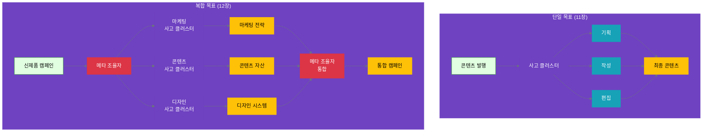

## 12.1 복합 목표의 사고 분해

### 12.1.1 단일 목표 vs 복합 목표

11장에서 우리는 **단일 목표**를 **하나의 사고 클러스터**로 처리했습니다. 하지만 실제 비즈니스 환경에서는 **복합 목표**가 더 흔합니다.

**단일 목표의 특징**:
```yaml
단일_목표:
  특징:
    - 하나의 명확한 결과물을 생성
    - 한 가지 전문 영역에 집중
    - 3-5개의 사고 단계로 처리 가능
    - 하나의 사고 조율자가 관리
  
  예시:
    - "소셜 미디어 콘텐츠 발행"
    - "고객 데이터 분석 리포트 작성"
    - "경쟁사 비교 분석"
  
  사고_클러스터_수: 1개
  관리_복잡도: 낮음~중간
```

**복합 목표의 특징**:
```yaml
복합_목표:
  특징:
    - 여러 독립적인 결과물을 생성
    - 여러 전문 영역이 필요
    - 10개 이상의 사고 단계 필요
    - 메타 조율자가 전체 조율
  
  예시:
    - "신제품 출시 캠페인 실행"
    - "분기별 비즈니스 전략 수립"
    - "새 시장 진출 계획"
  
  사고_클러스터_수: 3-5개
  관리_복잡도: 높음
```

**비교 다이어그램**:



**왜 복합 목표는 여러 사고 클러스터가 필요한가?**

1. **전문성의 분리 (Separation of Expertise)**
   ```yaml
   예시: "신제품 출시 캠페인"
   
   단일_클러스터로_처리_시_문제:
     - 한 조율자가 마케팅 + 콘텐츠 + 디자인 모두 전문가여야 함
     - 사고 단계가 15개 이상이 되어 복잡도 폭발
     - 각 영역의 깊이 있는 추론이 불가능
   
   여러_클러스터로_분해_시_이점:
     - 각 클러스터는 자신의 전문 영역에 집중
     - 마케팅 전문가 ↔ 마케팅 사고 클러스터
     - 콘텐츠 전문가 ↔ 콘텐츠 사고 클러스터
     - 디자인 전문가 ↔ 디자인 사고 클러스터
   ```

2. **인지 부하 관리 (Cognitive Load Management)**
   ```yaml
   단일_클러스터_한계:
     - 인간의 작업 기억: 5±2 항목
     - 10개 이상의 사고 단계는 관리 불가능
     - 실수와 누락이 증가
   
   계층적_접근:
     - 메타 조율자: 3-5개의 사고 클러스터만 관리
     - 각 클러스터: 3-5개의 사고 단계만 관리
     - 전체 복잡도를 계층으로 분산
   ```

3. **병렬 처리 가능성 (Parallelization)**
   ```yaml
   순차_처리_시:
     - 마케팅 전략 수립 (1주)
     - 콘텐츠 제작 (2주)
     - 디자인 작업 (1주)
     - 총: 4주
   
   병렬_처리_시:
     - 3개 클러스터 동시 작업
     - 각각 독립적으로 진행
     - 총: 2주 (가장 긴 작업 기준)
     - 시간 절약: 50%
   ```

### 12.1.2 사고 분해의 3가지 기준

복합 목표를 여러 사고 클러스터로 분해할 때는 다음 3가지 기준을 적용합니다.

#### 기준 1: 전문성 경계 (Expertise Boundary)

**정의**: 각 사고 클러스터는 명확한 전문 영역을 가져야 합니다.

```yaml
전문성_경계_원칙:
  질문: "이 사고는 어떤 전문 지식이 필요한가?"
  
  좋은_분해:
    - 마케팅 사고 클러스터 → 시장 분석, 타겟팅, 채널 전략
    - 콘텐츠 사고 클러스터 → 메시지 개발, 스토리텔링, 편집
    - 디자인 사고 클러스터 → 비주얼 컨셉, 브랜드 표현, UI/UX
  
  나쁜_분해:
    - "프로모션 사고 클러스터" → 마케팅 + 콘텐츠 + 디자인 혼재
    - 전문성 경계가 명확하지 않음
    - 누가 어떤 부분을 담당할지 모호
```

**실전 예시: 전자상거래 플랫폼 개편**

```yaml
goal: "전자상거래 플랫폼 리뉴얼"

# ❌ 나쁜 분해 (전문성 혼재)
bad_decomposition:
  thinking_cluster_1:
    name: "사용자 경험 개선"
    issues:
      - UI 디자인 + 백엔드 성능 + 콘텐츠 전략 혼재
      - 전문성 경계가 불분명
      - 한 팀이 모든 영역을 다뤄야 함

# ✅ 좋은 분해 (전문성 분리)
good_decomposition:
  thinking_cluster_1:
    name: "UI/UX 디자인 사고 클러스터"
    expertise: "사용자 인터페이스 설계"
    focus:
      - 와이어프레임 설계
      - 사용자 흐름 최적화
      - 비주얼 디자인 시스템
  
  thinking_cluster_2:
    name: "백엔드 성능 사고 클러스터"
    expertise: "시스템 아키텍처 및 성능"
    focus:
      - 데이터베이스 최적화
      - API 응답 속도 개선
      - 확장성 설계
  
  thinking_cluster_3:
    name: "콘텐츠 전략 사고 클러스터"
    expertise: "제품 소개 및 마케팅 메시지"
    focus:
      - 제품 설명 개선
      - SEO 최적화
      - 카테고리 구조 재설계
```

#### 기준 2: 독립성 (Independence)

**정의**: 각 사고 클러스터는 다른 클러스터의 완료를 기다리지 않고 독립적으로 사고할 수 있어야 합니다.

```yaml
독립성_원칙:
  질문: "이 사고 클러스터가 작업을 시작하려면 다른 클러스터의 결과가 필요한가?"
  
  완전_독립:
    - 병렬 실행 가능
    - 상호 의존성 없음
    - 시간 효율 최대
  
  부분_독립:
    - 초기 단계는 독립적
    - 후반 단계에서 통합
    - 대부분 병렬 가능
  
  상호_의존:
    - 순차 실행 필요
    - A 완료 → B 시작 → C 시작
    - 시간 효율 낮음
```

**독립성 평가 매트릭스**:

```python
# 사고 클러스터 간 의존성 분석

def analyze_cluster_independence(clusters):
    """
    각 사고 클러스터의 독립성을 분석하여 병렬 실행 가능성을 평가합니다.
    """
    
    dependency_matrix = {
        'marketing_thinking': {
            'dependencies': [],  # 의존하는 클러스터 없음
            'independence_score': 1.0,  # 완전 독립
            'can_start_immediately': True
        },
        'content_thinking': {
            'dependencies': [],  # 초기에는 독립적
            'independence_score': 0.9,  # 거의 독립
            'can_start_immediately': True,
            'note': '마케팅 방향성을 참고하면 더 좋지만 필수는 아님'
        },
        'design_thinking': {
            'dependencies': [],  # 콘텐츠와 무관하게 시작 가능
            'independence_score': 1.0,
            'can_start_immediately': True
        }
    }
    
    # 병렬 처리 그룹 생성
    parallel_groups = [
        ['marketing_thinking', 'content_thinking', 'design_thinking']
    ]
    
    return {
        'dependency_matrix': dependency_matrix,
        'parallel_groups': parallel_groups,
        'estimated_time_saving': '50-60%'  # 3개 순차 → 3개 병렬
    }

# 실행
result = analyze_cluster_independence(['marketing', 'content', 'design'])
print(f"Time saving: {result['estimated_time_saving']}")
# 출력: Time saving: 50-60%
```

**의존성 유형**:

```yaml
의존성_유형:
  type_1_완전_독립:
    definition: "다른 클러스터의 결과가 전혀 필요 없음"
    example:
      - 마케팅 사고: 시장 분석 → 타겟 설정 → 채널 전략
      - 디자인 사고: 비주얼 컨셉 → 컬러 팔레트 → 디자인 시스템
    parallel: true
  
  type_2_정보적_의존:
    definition: "다른 클러스터의 결과를 참고하면 더 좋지만 필수는 아님"
    example:
      - 콘텐츠 사고가 마케팅 사고의 '타겟 독자' 정보를 참고
      - 하지만 없어도 일반적인 콘텐츠 작성은 가능
    parallel: true
    note: "정보 공유만 하면 됨"
  
  type_3_순차적_의존:
    definition: "다른 클러스터의 결과가 있어야만 시작 가능"
    example:
      - 실행 계획이 전략 수립의 결과를 기다려야 함
      - A → B → C 순서가 고정
    parallel: false
    note: "이런 의존성은 최소화해야 함"
```

#### 기준 3: 완전성 (Completeness)

**정의**: 모든 사고 클러스터를 합치면 전체 목표를 달성할 수 있어야 합니다.

```yaml
완전성_원칙:
  질문: "모든 사고 클러스터의 결과를 합치면 목표를 완전히 달성하는가?"
  
  체크리스트:
    - [ ] 목표의 모든 측면이 어떤 클러스터에든 할당되었는가?
    - [ ] 빠진 부분이 없는가?
    - [ ] 중복되는 부분이 있는가? (중복은 제거해야 함)
    - [ ] 각 클러스터의 결과를 통합하면 완전한 솔루션이 되는가?
  
  검증_방법:
    - "이 3개(또는 N개)의 사고 클러스터 외에 추가로 필요한 것이 있는가?"
    - "어떤 클러스터를 빼면 목표 달성이 불가능한가?"
```

**완전성 검증 예시**:

```python
# 사고 클러스터 완전성 검증

def verify_completeness(goal, thinking_clusters):
    """
    목표와 사고 클러스터를 비교하여 완전성을 검증합니다.
    """
    
    # 목표의 모든 요구사항
    goal_requirements = {
        'market_analysis': {'required': True, 'covered': False},
        'target_definition': {'required': True, 'covered': False},
        'content_creation': {'required': True, 'covered': False},
        'visual_design': {'required': True, 'covered': False},
        'channel_strategy': {'required': True, 'covered': False}
    }
    
    # 각 사고 클러스터가 커버하는 요구사항
    for cluster in thinking_clusters:
        if cluster['name'] == 'marketing_thinking':
            goal_requirements['market_analysis']['covered'] = True
            goal_requirements['target_definition']['covered'] = True
            goal_requirements['channel_strategy']['covered'] = True
        
        elif cluster['name'] == 'content_thinking':
            goal_requirements['content_creation']['covered'] = True
        
        elif cluster['name'] == 'design_thinking':
            goal_requirements['visual_design']['covered'] = True
    
    # 완전성 검증
    missing_requirements = [
        req for req, info in goal_requirements.items()
        if info['required'] and not info['covered']
    ]
    
    is_complete = len(missing_requirements) == 0
    
    return {
        'is_complete': is_complete,
        'coverage': len([r for r in goal_requirements.values() if r['covered']]) / len(goal_requirements) * 100,
        'missing_requirements': missing_requirements,
        'recommendation': 'Complete' if is_complete else f"Add cluster for: {missing_requirements}"
    }

# 실행
clusters = [
    {'name': 'marketing_thinking', 'scope': ['market', 'target', 'channel']},
    {'name': 'content_thinking', 'scope': ['content']},
    {'name': 'design_thinking', 'scope': ['visual']}
]

result = verify_completeness('product_launch', clusters)
print(f"Complete: {result['is_complete']}")
print(f"Coverage: {result['coverage']}%")
# 출력: Complete: True
# 출력: Coverage: 100%
```

### 12.1.3 사고 클러스터 수 결정하기

**핵심 원칙: 3-5개가 적정**

```yaml
클러스터_수_가이드:
  too_few_1_to_2:
    문제:
      - 복잡성이 충분히 분해되지 않음
      - 각 클러스터가 여전히 너무 복잡
      - 전문성 경계가 불분명
    추천: "더 작은 단위로 분해 고려"
  
  optimal_3_to_5:
    이점:
      - 인지 부하 관리 가능 (5±2 항목)
      - 각 클러스터가 명확한 전문성
      - 병렬 처리 효율 최대
      - 메타 조율자가 관리 가능
    추천: "대부분의 복합 목표에 적합"
  
  too_many_6_plus:
    문제:
      - 메타 조율자의 인지 부하 과다
      - 클러스터 간 조율 복잡도 증가
      - 통합 시 혼란 가능성
    추천: "클러스터를 다시 묶거나 목표를 재정의"
```

**결정 프로세스**:

```python
# 사고 클러스터 수 결정

def decide_cluster_count(goal_complexity, expertise_areas, time_constraint):
    """
    목표의 특성을 분석하여 적정 사고 클러스터 수를 제안합니다.
    
    Parameters:
    - goal_complexity: 목표의 복잡도 (1-10)
    - expertise_areas: 필요한 전문 영역 리스트
    - time_constraint: 시간 제약 (일 단위)
    
    Returns:
    - 추천 클러스터 수 및 이유
    """
    
    # 기본 분석
    num_expertise = len(expertise_areas)
    
    # 규칙 기반 추론
    if num_expertise <= 2 and goal_complexity <= 5:
        recommendation = {
            'cluster_count': 1,
            'reasoning': '단일 사고 클러스터로 처리 가능',
            'pattern': '11장의 기본 사고 클러스터 패턴 사용'
        }
    
    elif num_expertise >= 3 and num_expertise <= 5:
        recommendation = {
            'cluster_count': num_expertise,
            'reasoning': f'{num_expertise}개 전문 영역별로 사고 클러스터 구성',
            'pattern': '12장의 계층적 사고 클러스터 패턴 사용'
        }
    
    elif num_expertise > 5:
        # 너무 많은 전문 영역 → 재그룹화 제안
        suggested_groups = [
            expertise_areas[i:i+2] for i in range(0, len(expertise_areas), 2)
        ]
        recommendation = {
            'cluster_count': len(suggested_groups),
            'reasoning': f'{num_expertise}개는 너무 많음, {len(suggested_groups)}개 그룹으로 통합 권장',
            'suggested_groups': suggested_groups,
            'warning': '메타 조율자의 인지 부하 고려'
        }
    
    else:
        recommendation = {
            'cluster_count': 3,
            'reasoning': '기본값: 3개 클러스터로 시작',
            'note': '실행 중 조정 가능'
        }
    
    # 시간 제약 고려
    if time_constraint < 7:  # 1주일 미만
        recommendation['time_warning'] = '시간이 촉박하므로 병렬 처리 필수'
        recommendation['parallel_execution'] = True
    
    return recommendation

# 실행 예시
result = decide_cluster_count(
    goal_complexity=8,
    expertise_areas=['marketing', 'content', 'design', 'development'],
    time_constraint=14
)

print(f"Recommended clusters: {result['cluster_count']}")
print(f"Reasoning: {result['reasoning']}")
# 출력: Recommended clusters: 4
# 출력: Reasoning: 4개 전문 영역별로 사고 클러스터 구성
```

**실전 가이드라인**:

```yaml
클러스터_수_결정_가이드:
  step_1_전문성_식별:
    action: "이 목표를 달성하려면 어떤 전문 지식이 필요한가?"
    output: "전문 영역 리스트"
  
  step_2_경계_확인:
    action: "각 전문 영역의 경계가 명확한가?"
    criteria:
      - 책임 범위가 겹치지 않는가?
      - 각 영역이 독립적으로 사고 가능한가?
  
  step_3_묶기_또는_나누기:
    if_too_many:
      - "유사한 전문 영역을 묶을 수 있는가?"
      - 예: UI디자인 + UX디자인 → 디자인 클러스터
    if_too_few:
      - "어떤 영역이 너무 복잡해서 나눠야 하는가?"
      - 예: 마케팅 → 전략 마케팅 + 실행 마케팅
  
  step_4_최종_검증:
    checklist:
      - [ ] 클러스터 수가 3-5개인가?
      - [ ] 각 클러스터의 책임이 명확한가?
      - [ ] 모든 클러스터를 합치면 목표를 달성하는가?
      - [ ] 병렬 실행이 가능한가?
```

### 12.1.4 의존성 분석 및 관리

report_kr.md에서 제시한 **목표 충돌 유형**(상충, 중복, 의존)을 사고 클러스터 수준에서 적용합니다.

#### 의존성 유형 1: 상충 (Conflict)

**정의**: 서로 다른 사고 클러스터가 반대 방향을 추구할 때

```yaml
상충_예시:
  상황:
    cluster_A_마케팅:
      목표: "브랜드 프리미엄 강화 (고가 전략)"
      추론: "타겟을 고소득층으로, 프리미엄 이미지 구축"
    
    cluster_B_영업:
      목표: "매출 극대화 (대량 판매)"
      추론: "가격을 낮춰 대중 시장 공략"
  
  충돌:
    - 마케팅은 '고가 프리미엄', 영업은 '저가 대량'
    - 방향이 정반대
  
  해결_방법:
    책임자: "메타 조율자 (인간)"
    process:
      1. 핵심 가치 확인: "우리 브랜드의 정체성은?"
      2. 우선순위 결정: "장기 브랜드 vs 단기 매출?"
      3. 한 쪽 클러스터의 목표 조정
      4. 재설계 후 재실행
```

**상충 탐지 및 해결 코드**:

```python
# 사고 클러스터 간 상충 탐지

def detect_conflicts(thinking_clusters, core_values):
    """
    사고 클러스터 간 상충을 탐지하고 핵심 가치 기반으로 해결 방향을 제안합니다.
    
    Parameters:
    - thinking_clusters: 사고 클러스터 리스트
    - core_values: 조직의 핵심 가치 (우선순위 순)
    
    Returns:
    - 상충 리스트 및 해결 제안
    """
    
    conflicts = []
    
    # 각 클러스터 쌍을 비교
    for i, cluster_a in enumerate(thinking_clusters):
        for cluster_b in thinking_clusters[i+1:]:
            
            # 방향성 비교 (간단한 키워드 기반)
            if is_opposite_direction(cluster_a['goal'], cluster_b['goal']):
                conflict = {
                    'type': 'conflict',
                    'cluster_a': cluster_a['name'],
                    'cluster_b': cluster_b['name'],
                    'issue': f"{cluster_a['goal']} vs {cluster_b['goal']}",
                    'severity': 'high'
                }
                
                # 핵심 가치 기반 해결 제안
                resolution = resolve_by_core_values(cluster_a, cluster_b, core_values)
                conflict['resolution'] = resolution
                
                conflicts.append(conflict)
    
    return conflicts

def is_opposite_direction(goal_a, goal_b):
    """
    두 목표가 반대 방향인지 간단히 판단 (실제로는 더 정교한 로직 필요)
    """
    opposite_pairs = [
        (['premium', 'high-end', 'exclusive'], ['budget', 'mass-market', 'affordable']),
        (['growth', 'expansion'], ['stability', 'consolidation']),
        (['innovation', 'disruption'], ['reliability', 'proven'])
    ]
    
    for pair in opposite_pairs:
        if any(word in goal_a.lower() for word in pair[0]) and \
           any(word in goal_b.lower() for word in pair[1]):
            return True
    
    return False

def resolve_by_core_values(cluster_a, cluster_b, core_values):
    """
    핵심 가치를 기준으로 상충 해결 방향 제안
    """
    # 예시: 핵심 가치가 ['brand_excellence', 'customer_satisfaction', 'growth']
    
    if 'brand_excellence' in core_values[:2]:  # 상위 2개 핵심 가치
        return {
            'priority': cluster_a['name'],  # 브랜드 우선
            'action': f"{cluster_b['name']}의 목표를 브랜드 정체성에 맞게 조정",
            'reasoning': '핵심 가치 "brand_excellence"가 최우선'
        }
    else:
        return {
            'priority': cluster_b['name'],  # 매출 우선
            'action': f"{cluster_a['name']}의 전략을 매출 극대화 방향으로 조정",
            'reasoning': '단기 성과가 우선 필요'
        }

# 실행 예시
clusters = [
    {'name': 'marketing_thinking', 'goal': 'Build premium brand image'},
    {'name': 'sales_thinking', 'goal': 'Maximize revenue through affordable pricing'}
]

core_values = ['brand_excellence', 'customer_satisfaction', 'growth']

conflicts = detect_conflicts(clusters, core_values)
for conflict in conflicts:
    print(f"Conflict: {conflict['cluster_a']} vs {conflict['cluster_b']}")
    print(f"Resolution: {conflict['resolution']['action']}")
# 출력: Conflict: marketing_thinking vs sales_thinking
# 출력: Resolution: sales_thinking의 목표를 브랜드 정체성에 맞게 조정
```

#### 의존성 유형 2: 중복 (Redundancy)

**정의**: 서로 다른 사고 클러스터가 같은 결과를 추구하거나 노력을 반복할 때

```yaml
중복_예시:
  상황:
    cluster_A_콘텐츠:
      task: "타겟 독자 페르소나 정의"
    
    cluster_B_마케팅:
      task: "타겟 시장 세그먼트 정의"
  
  중복:
    - 두 클러스터가 사실상 같은 작업을 다른 이름으로 수행
    - 리소스 낭비
  
  해결_방법:
    option_1_통합:
      - 두 클러스터를 하나로 병합
    option_2_재배분:
      - 한 클러스터에만 할당
      - 다른 클러스터는 그 결과를 활용
    option_3_분담:
      - 마케팅: 거시적 시장 세그먼트
      - 콘텐츠: 미시적 독자 페르소나
```

**중복 탐지 코드**:

```python
# 사고 클러스터 간 중복 탐지

def detect_redundancy(thinking_clusters):
    """
    사고 클러스터 간 중복되는 작업을 탐지합니다.
    """
    
    redundancies = []
    
    # 각 클러스터의 사고 단계 추출
    all_tasks = {}
    for cluster in thinking_clusters:
        for stage in cluster.get('thinking_stages', []):
            task_desc = stage.get('task', '').lower()
            
            # 유사 작업 탐지 (간단한 키워드 매칭)
            for existing_cluster, existing_tasks in all_tasks.items():
                for existing_task in existing_tasks:
                    similarity = calculate_task_similarity(task_desc, existing_task)
                    
                    if similarity > 0.7:  # 70% 이상 유사
                        redundancies.append({
                            'type': 'redundancy',
                            'cluster_1': existing_cluster,
                            'task_1': existing_task,
                            'cluster_2': cluster['name'],
                            'task_2': task_desc,
                            'similarity': similarity,
                            'recommendation': 'merge_or_reassign'
                        })
            
            # 현재 클러스터 작업 저장
            if cluster['name'] not in all_tasks:
                all_tasks[cluster['name']] = []
            all_tasks[cluster['name']].append(task_desc)
    
    return redundancies

def calculate_task_similarity(task1, task2):
    """
    두 작업의 유사도를 계산 (0.0 ~ 1.0)
    실제로는 더 정교한 NLP 기법 사용 가능
    """
    # 간단한 예시: 공통 키워드 비율
    keywords1 = set(task1.split())
    keywords2 = set(task2.split())
    
    intersection = keywords1.intersection(keywords2)
    union = keywords1.union(keywords2)
    
    return len(intersection) / len(union) if union else 0.0

# 실행 예시
clusters = [
    {
        'name': 'content_thinking',
        'thinking_stages': [
            {'task': 'Define target audience persona'}
        ]
    },
    {
        'name': 'marketing_thinking',
        'thinking_stages': [
            {'task': 'Define target market segment'}
        ]
    }
]

redundancies = detect_redundancy(clusters)
for r in redundancies:
    print(f"Redundancy: {r['cluster_1']} and {r['cluster_2']}")
    print(f"Similarity: {r['similarity']:.0%}")
# 출력: Redundancy: content_thinking and marketing_thinking
# 출력: Similarity: 75%
```

#### 의존성 유형 3: 의존 (Dependency)

**정의**: 한 사고 클러스터가 다른 클러스터의 결과에 의존할 때

```yaml
의존_예시:
  상황:
    cluster_A_전략:
      output: "타겟 시장 정의"
      timeline: "Week 1"
    
    cluster_B_실행:
      input_needed: "타겟 시장 정의"
      cannot_start_without: "cluster_A 완료"
  
  의존:
    - B는 A의 결과를 받아야 시작 가능
    - 순차 실행 필요
  
  관리_방법:
    step_1_명확한_순서:
      - A 완료 → B 시작
      - 타임라인 조정
    
    step_2_인터페이스_정의:
      - A의 출력 형식 명시
      - B의 입력 요구사항 명시
    
    step_3_대기_시간_최소화:
      - A의 중간 결과를 B에게 조기 공유
      - B는 준비 작업을 먼저 진행
```

**의존성 그래프 생성**:

```python
# 사고 클러스터 간 의존성 그래프 생성

def build_dependency_graph(thinking_clusters):
    """
    사고 클러스터 간 의존 관계를 그래프로 표현합니다.
    """
    
    # 의존성 그래프 초기화
    graph = {cluster['name']: [] for cluster in thinking_clusters}
    
    # 각 클러스터의 입력 요구사항 확인
    for cluster in thinking_clusters:
        cluster_name = cluster['name']
        required_inputs = cluster.get('required_inputs', [])
        
        # 각 입력이 어느 클러스터에서 나오는지 찾기
        for required_input in required_inputs:
            for potential_provider in thinking_clusters:
                if required_input in potential_provider.get('outputs', []):
                    # 의존 관계 추가: cluster는 potential_provider에 의존
                    graph[cluster_name].append(potential_provider['name'])
    
    return graph

def topological_sort(graph):
    """
    위상 정렬로 실행 순서를 결정합니다.
    """
    from collections import deque
    
    # 진입 차수 계산
    in_degree = {node: 0 for node in graph}
    for dependencies in graph.values():
        for dep in dependencies:
            in_degree[dep] += 1
    
    # 진입 차수가 0인 노드부터 시작
    queue = deque([node for node in graph if in_degree[node] == 0])
    execution_order = []
    
    while queue:
        # 병렬 실행 가능한 클러스터들
        parallel_batch = []
        for _ in range(len(queue)):
            node = queue.popleft()
            parallel_batch.append(node)
            
            # 의존하는 노드의 진입 차수 감소
            for neighbor in graph[node]:
                in_degree[neighbor] -= 1
                if in_degree[neighbor] == 0:
                    queue.append(neighbor)
        
        execution_order.append(parallel_batch)
    
    return execution_order

# 실행 예시
clusters = [
    {
        'name': 'strategy_thinking',
        'outputs': ['target_market', 'positioning'],
        'required_inputs': []
    },
    {
        'name': 'content_thinking',
        'outputs': ['content_assets'],
        'required_inputs': ['target_market']
    },
    {
        'name': 'design_thinking',
        'outputs': ['visual_system'],
        'required_inputs': ['positioning']
    },
    {
        'name': 'execution_thinking',
        'outputs': ['campaign_plan'],
        'required_inputs': ['content_assets', 'visual_system']
    }
]

graph = build_dependency_graph(clusters)
execution_order = topological_sort(graph)

print("Execution order (by batch):")
for i, batch in enumerate(execution_order, 1):
    print(f"Batch {i} (parallel): {', '.join(batch)}")
# 출력:
# Batch 1 (parallel): strategy_thinking
# Batch 2 (parallel): content_thinking, design_thinking
# Batch 3 (parallel): execution_thinking
```

**의존성 최소화 전략**:

```yaml
의존성_최소화:
  strategy_1_인터페이스_추상화:
    before: "콘텐츠가 마케팅의 구체적인 타겟 정의를 기다림"
    after: "콘텐츠는 '일반적인 타겟 프로필'을 가정하고 시작"
    benefit: "병렬 실행 가능, 나중에 조정"
  
  strategy_2_조기_정보_공유:
    method: "마케팅의 중간 결과(80% 완성)를 콘텐츠에 공유"
    benefit: "콘텐츠가 조기 시작 가능"
  
  strategy_3_역방향_설계:
    method: "최종 통합 형태를 먼저 정의 → 각 클러스터의 출력 명시"
    benefit: "각 클러스터가 독립적으로 작업 가능"
```

### 12.1.5 실전 워크플로우: 복합 목표 분해하기

이제 배운 내용을 종합하여 실제로 복합 목표를 사고 클러스터로 분해하는 단계별 워크플로우를 소개합니다.

```yaml
목표_분해_워크플로우:
  step_1_목표_이해:
    action: "복합 목표를 명확히 정의"
    checklist:
      - [ ] 무엇을 달성하려고 하는가?
      - [ ] 왜 중요한가? (비즈니스 가치)
      - [ ] 성공의 기준은?
      - [ ] 제약 조건은? (시간, 예산, 리소스)
  
  step_2_전문성_식별:
    action: "이 목표에 필요한 전문 영역 나열"
    method: "브레인스토밍 → 그룹화 → 우선순위화"
    output: "3-5개의 전문 영역 리스트"
  
  step_3_사고_클러스터_설계:
    action: "각 전문 영역별로 사고 클러스터 설계"
    for_each_cluster:
      - name: "클러스터 이름"
      - scope: "책임 범위"
      - thinking_stages: "3-5개 사고 단계"
      - outputs: "산출물 정의"
      - coordinator: "누가 조율할 것인가"
  
  step_4_의존성_분석:
    action: "클러스터 간 의존 관계 파악"
    use_tools:
      - "의존성 그래프"
      - "위상 정렬"
    output: "실행 순서 (배치 단위)"
  
  step_5_충돌_검증:
    action: "상충, 중복 탐지 및 해결"
    use_criteria:
      - "핵심 가치"
      - "우선순위"
    output: "조정된 클러스터 설계"
  
  step_6_완전성_확인:
    action: "모든 요구사항이 커버되는지 검증"
    method: "요구사항 체크리스트 매핑"
  
  step_7_최종_승인:
    stakeholders: ["메타 조율자", "각 클러스터 리더"]
    documents:
      - "전체 사고 구조 다이어그램"
      - "각 클러스터 상세 설계 (YAML)"
      - "실행 타임라인"
```

**워크플로우 적용 예시: 신제품 출시 캠페인**

```yaml
example_신제품_출시_캠페인:
  step_1_목표_정의:
    goal: "'퀀텀 AI 글래스' 신제품 출시 캠페인 실행"
    success_criteria:
      - "출시 첫 달 1,000대 판매"
      - "브랜드 인지도 30% 증가"
      - "긍정적 미디어 커버리지 10건 이상"
    constraints:
      - "출시일: 8주 후"
      - "예산: $50,000"
      - "내부 팀: 마케팅 2명, 콘텐츠 1명, 디자인 1명"
  
  step_2_전문성_식별:
    expertise_areas:
      - "마케팅 전략 (시장, 타겟, 채널)"
      - "콘텐츠 기획 (메시지, 스토리)"
      - "디자인 (비주얼, 브랜드)"
    cluster_count: 3
  
  step_3_클러스터_설계:
    cluster_1:
      name: "마케팅 전략 사고 클러스터"
      scope: "시장 분석, 타겟 정의, 채널 전략"
      stages:
        - "시장 세그먼트 분석"
        - "경쟁사 포지셔닝 연구"
        - "타겟 페르소나 3개 정의"
        - "채널 믹스 결정 (온라인 70%, 오프라인 30%)"
      outputs:
        - "타겟 페르소나 문서"
        - "채널 전략 (우선순위 포함)"
      coordinator: "마케팅 팀장"
    
    cluster_2:
      name: "콘텐츠 전략 사고 클러스터"
      scope: "제품 스토리, 메시지 개발, 콘텐츠 기획"
      stages:
        - "제품 차별점 정의 (3가지)"
        - "핵심 메시지 개발"
        - "콘텐츠 캘린더 (8주)"
        - "콘텐츠 포맷 결정 (블로그, 영상, SNS)"
      outputs:
        - "메시지 하우스"
        - "콘텐츠 캘린더"
        - "콘텐츠 초안 (5개)"
      coordinator: "콘텐츠 리드"
    
    cluster_3:
      name: "디자인 전략 사고 클러스터"
      scope: "비주얼 컨셉, 브랜드 표현, 디자인 시스템"
      stages:
        - "비주얼 컨셉 3개 제안"
        - "컬러 팔레트 및 타이포그래피 정의"
        - "주요 비주얼 에셋 제작 (로고, 배너)"
        - "디자인 시스템 가이드"
      outputs:
        - "비주얼 컨셉 보드"
        - "디자인 시스템 (컬러, 폰트, 스타일)"
        - "주요 에셋 (10개)"
      coordinator: "디자인 리드"
  
  step_4_의존성_분석:
    dependencies:
      - "콘텐츠 ← 마케팅 (타겟 페르소나)"
      - "디자인 ← 콘텐츠 (핵심 메시지)"
    
    execution_order:
      batch_1: ["마케팅 (Week 1-2)"]
      batch_2: ["콘텐츠 (Week 3-5)", "디자인 (Week 3-5)"]  # 병렬
      batch_3: ["통합 및 최종 검토 (Week 6)"]
  
  step_5_충돌_검증:
    potential_conflicts:
      - conflict_1:
          issue: "마케팅은 '고급스러움' 강조, 디자인은 '친근함' 제안"
          resolution: "핵심 가치 '혁신적이지만 접근 가능한'에 맞춰 조정"
      - conflict_2:
          issue: "콘텐츠 일정과 디자인 일정 충돌"
          resolution: "콘텐츠 초안을 1주 조기 공유"
  
  step_6_완전성_확인:
    requirements_coverage:
      - "✅ 시장 분석 → 마케팅 클러스터"
      - "✅ 타겟 정의 → 마케팅 클러스터"
      - "✅ 메시지 개발 → 콘텐츠 클러스터"
      - "✅ 비주얼 제작 → 디자인 클러스터"
      - "✅ 채널 전략 → 마케팅 클러스터"
    coverage: "100%"
```

---

