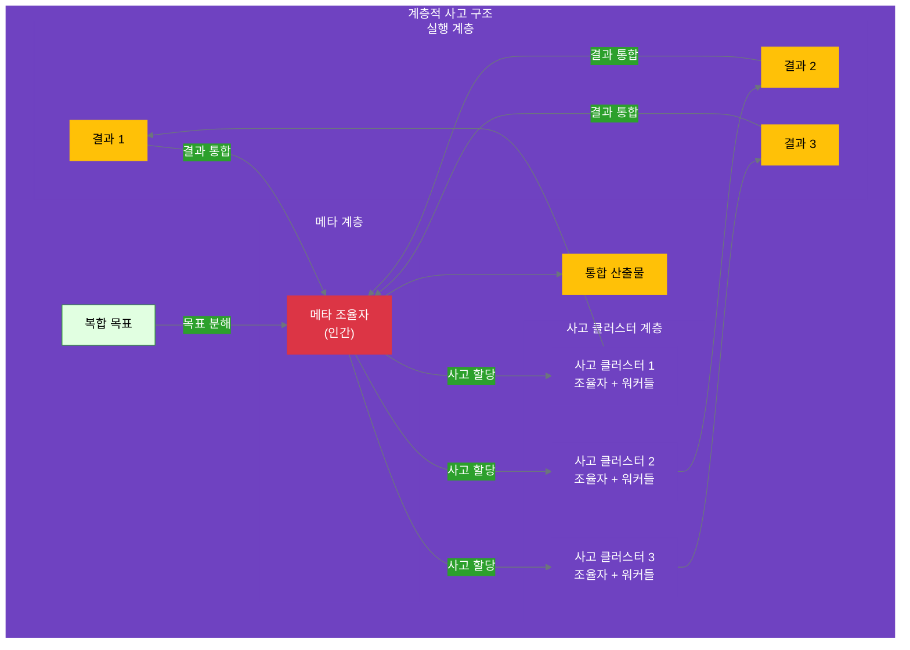

## 12.2 메타 조율자의 역할

계층적 사고 클러스터의 핵심은 **메타 조율자(Meta Coordinator)**입니다. 메타 조율자는 여러 사고 클러스터를 관장하는 상위 조율자로, 11장의 사고 조율자보다 한 단계 높은 추상화 수준에서 작동합니다.

### 12.2.1 메타 조율자란?

**정의**:
> 메타 조율자는 복합 목표를 여러 사고 클러스터로 분해하고, 각 클러스터의 사고 프로세스를 조율하며, 최종 결과를 통합하는 역할을 담당하는 인간 의사결정자입니다.

**사고 조율자 vs 메타 조율자**:

```yaml
비교:
  사고_조율자_11장:
    scope: "하나의 사고 클러스터 내부"
    manages:
      - 사고 단계들 (3-5개)
      - 실행 워커들
      - 단계 간 흐름
    decisions:
      - 어떤 사고 단계를 거칠 것인가?
      - 각 워커에게 무엇을 맡길 것인가?
    complexity: "단일 전문 영역"
    example: "콘텐츠 생성 프로세스 관리"
  
  메타_조율자_12장:
    scope: "여러 사고 클러스터 전체"
    manages:
      - 사고 클러스터들 (3-5개)
      - 각 클러스터의 조율자들
      - 클러스터 간 의존성
    decisions:
      - 어떤 사고 클러스터가 필요한가?
      - 클러스터 간 실행 순서는?
      - 충돌 발생 시 어떻게 해결할 것인가?
    complexity: "다중 전문 영역 통합"
    example: "전체 캠페인 아키텍처 설계"
```

**계층 구조**:



### 12.2.2 메타 조율자의 3가지 핵심 책임

report_kr.md에서 제시한 메타 조율자의 3가지 책임을 구체화합니다.

#### 책임 1: 사고 구조 설계 (Thinking Architecture Design)

**정의**: 복합 목표를 분석하여 최적의 사고 클러스터 구조를 설계합니다.

```yaml
사고_구조_설계:
  input: "복합 목표 + 제약 조건"
  
  process:
    step_1_목표_분석:
      - 목표의 복잡도 평가
      - 필요한 전문 영역 식별
      - 성공 기준 정의
    
    step_2_클러스터_식별:
      - 전문성 경계로 분해 (12.1.2)
      - 독립성 확인
      - 3-5개로 최적화 (12.1.3)
    
    step_3_구조_선택:
      - 계층 구조 vs 네트워크 구조
      - 의존성 패턴 정의
      - 실행 순서 결정
    
    step_4_인터페이스_정의:
      - 각 클러스터의 입력/출력
      - 데이터 교환 형식
      - 품질 기준
  
  output:
    - "사고 클러스터 목록"
    - "클러스터 간 의존성 그래프"
    - "실행 계획"
```

**구조 선택: 계층 vs 네트워크**

```python
# 사고 구조 유형 선택

def choose_thinking_structure(goal, clusters, dependencies):
    """
    목표의 특성과 클러스터 간 의존성을 분석하여
    계층 구조와 네트워크 구조 중 적합한 것을 선택합니다.
    """
    
    # 의존성 분석
    dependency_count = sum(len(deps) for deps in dependencies.values())
    total_possible_deps = len(clusters) * (len(clusters) - 1)
    dependency_ratio = dependency_count / total_possible_deps if total_possible_deps > 0 else 0
    
    # 구조 선택 로직
    if dependency_ratio < 0.3:
        # 독립적인 클러스터들 → 병렬 구조
        structure_type = "parallel"
        benefits = [
            "모든 클러스터 동시 실행 가능",
            "시간 효율 최대",
            "단순한 조율"
        ]
        pattern = {
            'execution_mode': 'parallel',
            'sync_points': ['start', 'end'],
            'coordination_frequency': 'low'
        }
    
    elif dependency_ratio < 0.6:
        # 부분적 의존성 → 계층 구조
        structure_type = "hierarchical"
        benefits = [
            "명확한 실행 순서",
            "부분 병렬 가능",
            "의존성 관리 용이"
        ]
        pattern = {
            'execution_mode': 'staged',  # 단계별 실행
            'sync_points': ['stage_transitions'],
            'coordination_frequency': 'medium'
        }
    
    else:
        # 높은 의존성 → 네트워크 구조
        structure_type = "network"
        benefits = [
            "복잡한 상호작용 지원",
            "유연한 정보 공유",
            "동적 조율 가능"
        ]
        pattern = {
            'execution_mode': 'iterative',  # 반복적 실행
            'sync_points': ['after_each_cluster'],
            'coordination_frequency': 'high'
        }
        caveat = "조율 복잡도 증가, 메타 조율자 부담 높음"
    
    return {
        'structure_type': structure_type,
        'dependency_ratio': dependency_ratio,
        'benefits': benefits,
        'pattern': pattern,
        'recommendation': f"{structure_type} 구조 권장"
    }

# 실행 예시
clusters = ['marketing', 'content', 'design']
dependencies = {
    'marketing': [],
    'content': ['marketing'],  # 콘텐츠는 마케팅에 의존
    'design': ['marketing']    # 디자인도 마케팅에 의존
}

result = choose_thinking_structure('campaign', clusters, dependencies)
print(f"Structure: {result['structure_type']}")
print(f"Dependency ratio: {result['dependency_ratio']:.0%}")
# 출력: Structure: hierarchical
# 출력: Dependency ratio: 33%
```

**구조 유형별 특성**:

```yaml
구조_유형:
  parallel_병렬:
    특징: "모든 클러스터가 독립적, 동시 실행"
    적합한_경우:
      - 의존성이 거의 없음 (< 30%)
      - 시간 제약이 심함
      - 각 클러스터가 명확히 분리됨
    장점:
      - 최대 시간 효율
      - 단순한 관리
    단점:
      - 사후 통합 시 불일치 가능성
    예시: "3개 독립 시장 조사 (미국, 유럽, 아시아)"
  
  hierarchical_계층:
    특징: "단계별 의존성, 부분 병렬 가능"
    적합한_경우:
      - 중간 수준 의존성 (30-60%)
      - 명확한 실행 순서 있음
      - 단계별 검증 필요
    장점:
      - 의존성 관리 용이
      - 부분 병렬로 효율 확보
    단점:
      - 병렬 구조보다 느림
    예시: "전략 수립 → 콘텐츠+디자인 병렬 → 통합"
  
  network_네트워크:
    특징: "높은 상호의존성, 반복적 조율"
    적합한_경우:
      - 높은 의존성 (> 60%)
      - 클러스터 간 긴밀한 협업 필요
      - 요구사항이 유동적
    장점:
      - 유연한 정보 공유
      - 동적 조정 가능
    단점:
      - 조율 복잡도 높음
      - 메타 조율자 부담
    예시: "통합 제품 개발 (기획-개발-디자인 긴밀 협업)"
```

#### 책임 2: 사고 클러스터 간 조율 (Inter-Cluster Coordination)

**정의**: 여러 사고 클러스터가 조화롭게 작동하도록 조율하고, 충돌을 해결합니다.

```yaml
조율_메커니즘:
  before_execution:
    - "각 클러스터에 사고 목표 전달"
    - "인터페이스 및 품질 기준 명시"
    - "실행 순서 및 타임라인 공유"
  
  during_execution:
    coordination_points:
      - checkpoint_1:
          when: "각 클러스터 30% 진행 시"
          purpose: "방향성 확인, 조기 문제 발견"
          action: "필요시 목표 조정"
      
      - checkpoint_2:
          when: "각 클러스터 70% 진행 시"
          purpose: "통합 준비, 인터페이스 검증"
          action: "결과 형식 확인"
      
      - sync_meeting:
          frequency: "주 1-2회"
          participants: ["메타 조율자", "각 클러스터 조율자"]
          agenda:
            - 진행 상황 공유
            - 블로커 식별 및 해결
            - 의존성 이슈 조율
  
  conflict_resolution:
    type_1_goal_conflict:
      detection: "클러스터 A와 B의 목표가 상충"
      resolution: "핵심 가치 기반 우선순위 결정 (12.1.4)"
    
    type_2_resource_conflict:
      detection: "동일한 리소스를 두 클러스터가 요구"
      resolution: "우선순위 매트릭스로 배분"
    
    type_3_timeline_conflict:
      detection: "의존 관계인데 타임라인 충돌"
      resolution: "일정 재조정 또는 임시 결과물 조기 공유"
  
  after_execution:
    - "각 클러스터 결과 수집"
    - "일관성 검증 (서로 모순되지 않는가?)"
    - "결과 통합 및 종합 분석"
```

**조율 빈도 결정**:

```python
# 조율 빈도 결정 로직

def determine_coordination_frequency(structure_type, cluster_count, dependency_ratio):
    """
    구조 유형, 클러스터 수, 의존성 비율을 고려하여
    적정 조율 빈도를 결정합니다.
    """
    
    # 기본 빈도 계산
    if structure_type == "parallel":
        base_frequency = "weekly"  # 주 1회
        meetings_per_month = 4
    elif structure_type == "hierarchical":
        base_frequency = "bi-weekly"  # 주 2회
        meetings_per_month = 8
    else:  # network
        base_frequency = "daily"  # 매일
        meetings_per_month = 20
    
    # 클러스터 수에 따른 조정
    if cluster_count > 5:
        meetings_per_month = int(meetings_per_month * 1.5)
        note = "클러스터가 많아 조율 빈도 증가"
    
    # 의존성 비율에 따른 조정
    if dependency_ratio > 0.5:
        meetings_per_month = int(meetings_per_month * 1.3)
        note = "높은 의존성으로 인한 빈번한 조율 필요"
    
    # 체크포인트 정의
    checkpoints = []
    if structure_type == "parallel":
        checkpoints = ["30% 진행", "70% 진행", "완료"]
    elif structure_type == "hierarchical":
        checkpoints = ["각 단계 전환 시", "30%", "70%", "통합 전"]
    else:
        checkpoints = ["매 클러스터 완료 시", "매주 중간 점검"]
    
    return {
        'base_frequency': base_frequency,
        'meetings_per_month': meetings_per_month,
        'checkpoints': checkpoints,
        'recommendation': f"{base_frequency} 조율 권장 (월 {meetings_per_month}회)"
    }

# 실행
result = determine_coordination_frequency('hierarchical', 3, 0.35)
print(f"Frequency: {result['base_frequency']}")
print(f"Meetings per month: {result['meetings_per_month']}")
print(f"Checkpoints: {result['checkpoints']}")
# 출력: Frequency: bi-weekly
# 출력: Meetings per month: 8
# 출력: Checkpoints: ['각 단계 전환 시', '30%', '70%', '통합 전']
```

**정보 공유 메커니즘**:

```yaml
정보_공유:
  shared_workspace:
    platform: "공유 문서 시스템 (Notion, Confluence 등)"
    structure:
      - "/meta/overall_plan.md" # 전체 계획
      - "/cluster_1/progress.md" # 각 클러스터 진행 상황
      - "/cluster_2/progress.md"
      - "/cluster_3/progress.md"
      - "/interfaces/data_exchange.md" # 인터페이스 명세
    
  communication_channels:
    async:
      - 공유 문서 업데이트
      - 진행 상황 대시보드
      - 이슈 트래커
    sync:
      - 정기 sync 미팅
      - 긴급 조율 회의
      - 의사결정 세션
  
  transparency_principles:
    - "모든 클러스터가 전체 계획을 볼 수 있음"
    - "각 클러스터의 진행 상황이 실시간 공유됨"
    - "의사결정 과정과 근거가 문서화됨"
    - "이슈는 즉시 공개되고 해결책 논의"
```

#### 책임 3: 우선순위 결정 및 리소스 배분 (Prioritization & Resource Allocation)

**정의**: 핵심 가치를 기준으로 우선순위를 결정하고, 제한된 리소스를 최적 배분합니다.

report_kr.md의 핵심 가치 기반 의사결정을 적용합니다.

```yaml
우선순위_결정_프로세스:
  step_1_핵심_가치_확인:
    source: "조직의 핵심 가치 (우선순위 순)"
    example:
      core_values:
        1: "brand_excellence" # 브랜드 우수성
        2: "customer_satisfaction" # 고객 만족
        3: "innovation" # 혁신
        4: "growth" # 성장
  
  step_2_충돌_식별:
    scenarios:
      - 두 클러스터가 같은 리소스 요구
      - 두 클러스터의 목표가 상충
      - 타임라인 제약으로 선택 필요
  
  step_3_가치_매핑:
    process: "각 클러스터의 목표를 핵심 가치에 매핑"
    example:
      cluster_A_마케팅:
        primary_value: "brand_excellence"
        secondary_value: "growth"
      cluster_B_영업:
        primary_value: "growth"
        secondary_value: "customer_satisfaction"
  
  step_4_우선순위_결정:
    rule: "더 상위의 핵심 가치를 지원하는 클러스터가 우선"
    example:
      conflict: "마케팅 vs 영업 (리소스 경쟁)"
      decision:
        - 마케팅의 primary_value: brand_excellence (1순위)
        - 영업의 primary_value: growth (4순위)
        - 결론: 마케팅 우선 배분
        - 근거: "핵심 가치 우선순위 기반"
```

**우선순위 결정 매트릭스**:

```python
# 핵심 가치 기반 우선순위 결정

def prioritize_by_core_values(clusters, core_values, conflict_scenario):
    """
    핵심 가치를 기준으로 사고 클러스터의 우선순위를 결정합니다.
    
    Parameters:
    - clusters: 사고 클러스터 리스트 (각각 primary_value 포함)
    - core_values: 조직의 핵심 가치 (우선순위 순)
    - conflict_scenario: 충돌 시나리오 (리소스, 시간 등)
    
    Returns:
    - 우선순위가 정해진 클러스터 목록
    """
    
    # 각 클러스터의 가치 점수 계산
    scored_clusters = []
    
    for cluster in clusters:
        primary_value = cluster['primary_value']
        secondary_value = cluster.get('secondary_value', None)
        
        # 핵심 가치 인덱스 (낮을수록 높은 우선순위)
        primary_index = core_values.index(primary_value) if primary_value in core_values else 999
        secondary_index = core_values.index(secondary_value) if secondary_value in core_values else 999
        
        # 우선순위 점수 계산 (primary 가중치 3, secondary 가중치 1)
        priority_score = (primary_index * 3) + secondary_index
        
        scored_clusters.append({
            'cluster': cluster['name'],
            'primary_value': primary_value,
            'priority_score': priority_score,
            'primary_index': primary_index
        })
    
    # 점수 기준 정렬 (낮은 점수 = 높은 우선순위)
    scored_clusters.sort(key=lambda x: x['priority_score'])
    
    # 우선순위 할당
    for i, cluster in enumerate(scored_clusters, 1):
        cluster['priority_rank'] = i
    
    # 결정 이유 생성
    decision_rationale = {
        'highest_priority': scored_clusters[0]['cluster'],
        'reasoning': f"{scored_clusters[0]['cluster']}가 최우선 핵심 가치 '{scored_clusters[0]['primary_value']}'를 지원",
        'conflict_resolution': conflict_scenario,
        'allocation': f"리소스를 우선순위 순으로 배분: {', '.join([c['cluster'] for c in scored_clusters])}"
    }
    
    return {
        'prioritized_clusters': scored_clusters,
        'decision': decision_rationale
    }

# 실행 예시
clusters = [
    {'name': 'marketing_thinking', 'primary_value': 'brand_excellence', 'secondary_value': 'growth'},
    {'name': 'sales_thinking', 'primary_value': 'growth', 'secondary_value': 'customer_satisfaction'},
    {'name': 'product_thinking', 'primary_value': 'innovation', 'secondary_value': 'customer_satisfaction'}
]

core_values = ['brand_excellence', 'customer_satisfaction', 'innovation', 'growth']

result = prioritize_by_core_values(clusters, core_values, '디자인 리소스 경쟁')

print(f"Highest priority: {result['decision']['highest_priority']}")
print(f"Reasoning: {result['decision']['reasoning']}")
for cluster in result['prioritized_clusters']:
    print(f"  {cluster['priority_rank']}. {cluster['cluster']} (score: {cluster['priority_score']})")
# 출력: Highest priority: marketing_thinking
# 출력: Reasoning: marketing_thinking가 최우선 핵심 가치 'brand_excellence'를 지원
#   1. marketing_thinking (score: 3)
#   2. product_thinking (score: 7)
#   3. sales_thinking (score: 13)
```

**리소스 배분 전략**:

```yaml
리소스_배분:
  scenario_1_충분한_리소스:
    approach: "각 클러스터에 필요한 만큼 할당"
    coordination: "최소한의 조율만 필요"
  
  scenario_2_제한적_리소스:
    approach:
      - step_1: "우선순위 결정 (핵심 가치 기반)"
      - step_2: "상위 클러스터에 먼저 배분"
      - step_3: "나머지를 하위 클러스터에 배분"
      - step_4: "부족한 클러스터는 일정 조정 또는 범위 축소"
    
    allocation_example:
      available_resource: "디자이너 2명 × 40시간/주 = 80시간"
      requests:
        - marketing: "40시간 (우선순위 1)"
        - product: "30시간 (우선순위 2)"
        - sales: "20시간 (우선순위 3)"
        - total_request: "90시간 (10시간 부족)"
      
      allocation_decision:
        - marketing: "40시간 배분 (100%)" # 최우선
        - product: "30시간 배분 (100%)" # 2순위
        - sales: "10시간 배분 (50% 축소)" # 3순위, 부족분 흡수
      
      mitigation:
        - "sales 클러스터는 일정 1주 연장"
        - "또는 외부 디자이너 임시 투입 검토"
  
  scenario_3_급격한_변화:
    trigger: "외부 환경 변화 (경쟁사 출시, 시장 변화 등)"
    response:
      - "핵심 가치 재확인"
      - "우선순위 재평가"
      - "필요시 리소스 재배분"
    
    example:
      situation: "경쟁사가 유사 제품 조기 출시"
      decision:
        - old_priority: ["brand_excellence", "innovation", "growth"]
        - new_priority: ["speed_to_market", "brand_excellence", "innovation"]
        - resource_shift: "개발 클러스터에 추가 리소스 투입, 일정 단축"
```

### 12.2.3 의사결정 프레임워크

메타 조율자의 의사결정을 지원하는 프레임워크입니다.

```yaml
의사결정_프레임워크:
  decision_type_1_구조_결정:
    question: "어떤 사고 구조가 적합한가?"
    inputs:
      - 목표 복잡도
      - 클러스터 간 의존성
      - 시간 제약
    framework: "12.2.2의 구조 선택 알고리즘"
    output: "parallel / hierarchical / network"
  
  decision_type_2_충돌_해결:
    question: "클러스터 간 충돌을 어떻게 해결할 것인가?"
    inputs:
      - 충돌 유형 (상충/중복/의존)
      - 관련 클러스터들
      - 핵심 가치
    framework: "12.1.4의 충돌 해결 메커니즘"
    output: "조정된 클러스터 목표 또는 일정"
  
  decision_type_3_우선순위_결정:
    question: "제한된 리소스를 어떻게 배분할 것인가?"
    inputs:
      - 각 클러스터의 가치 매핑
      - 조직의 핵심 가치 (우선순위)
      - 리소스 제약
    framework: "12.2.2의 우선순위 매트릭스"
    output: "우선순위 순서 및 배분 계획"
  
  decision_type_4_품질_판단:
    question: "클러스터 결과가 통합 가능한 품질인가?"
    inputs:
      - 각 클러스터 산출물
      - 품질 기준
      - 일관성 검증 결과
    framework: "품질 게이트 체크리스트"
    output: "승인 / 재작업 요청"
```

**의사결정 기록 템플릿**:

```yaml
decision_record:
  decision_id: "D-2025-10-15-001"
  date: "2025-10-15"
  context:
    situation: "마케팅 클러스터와 영업 클러스터가 동일한 디자인 리소스를 요구"
    stakes: "디자이너 2명, 시간 80시간/주"
    constraints: "캠페인 출시일까지 3주"
  
  options_considered:
    option_A:
      description: "마케팅 우선, 영업은 대기"
      pros: ["마케팅 품질 보장", "간단한 관리"]
      cons: ["영업 지연", "매출 기회 손실"]
    
    option_B:
      description: "리소스 50:50 분할"
      pros: ["공평한 배분", "모두 진행"]
      cons: ["둘 다 품질 저하", "목표 달성 불확실"]
    
    option_C:
      description: "핵심 가치 기반 우선순위"
      pros: ["전략적 일관성", "명확한 근거"]
      cons: ["한 쪽 불만 가능"]
  
  decision:
    chosen_option: "option_C"
    rationale:
      - "핵심 가치 'brand_excellence'가 1순위"
      - "마케팅 클러스터가 브랜드 우수성에 직접 기여"
      - "영업은 일정 1주 연장으로 충분히 대응 가능"
    
    allocation:
      marketing: "60시간 (75%)"
      sales: "20시간 (25%), + 외부 디자이너 20시간"
  
  impact:
    marketing_cluster: "목표 달성 가능, 일정 준수"
    sales_cluster: "1주 연장, 하지만 품질 보장"
    overall: "브랜드 우수성 유지하면서 양쪽 진행"
  
  lessons_learned:
    - "조기 리소스 계획의 중요성"
    - "외부 리소스 활용 옵션 미리 준비"
    - "핵심 가치 기반 결정이 명확한 커뮤니케이션 가능케 함"
```

### 12.2.4 실전 적용: 신제품 출시 캠페인의 메타 조율

12.1.5의 신제품 출시 캠페인 예시를 메타 조율자 관점에서 상세히 살펴봅니다.

```yaml
example_메타_조율_실전:
  campaign: "'퀀텀 AI 글래스' 신제품 출시 캠페인"
  
  meta_coordinator_role: "마케팅 디렉터 (CMO)"
  
  책임_1_사고_구조_설계:
    clusters_identified:
      - cluster_1: "마케팅 전략 사고 클러스터"
      - cluster_2: "콘텐츠 전략 사고 클러스터"
      - cluster_3: "디자인 전략 사고 클러스터"
    
    structure_chosen: "hierarchical"
    reasoning:
      - "의존성 비율 33% (중간)"
      - "콘텐츠와 디자인이 마케팅 타겟에 부분 의존"
      - "부분 병렬 실행으로 시간 효율 확보"
    
    execution_plan:
      phase_1:
        duration: "Week 1-2"
        cluster: "마케팅 전략"
        output: "타겟 페르소나 3개, 채널 전략"
      
      phase_2:
        duration: "Week 3-5"
        clusters: ["콘텐츠 전략", "디자인 전략"]  # 병렬
        inputs: "마케팅의 타겟 페르소나"
        outputs:
          - "메시지 하우스, 콘텐츠 초안 5개"
          - "비주얼 컨셉, 디자인 시스템"
      
      phase_3:
        duration: "Week 6"
        action: "통합 및 최종 검토"
        participants: "전체 클러스터 조율자들"
  
  책임_2_클러스터_간_조율:
    sync_meetings:
      - week_1:
          purpose: "킥오프, 전체 계획 공유"
          participants: "전체"
          outcome: "각 클러스터 목표 확인"
      
      - week_2:
          purpose: "마케팅 중간 점검"
          participants: "메타 조율자 + 마케팅 조율자"
          outcome: "타겟 페르소나 초안 검토"
      
      - week_3:
          purpose: "Phase 2 시작, 마케팅 결과 공유"
          participants: "전체"
          outcome:
            - "콘텐츠: 타겟 페르소나 3개 수령"
            - "디자인: 타겟 페르소나 + 채널 전략 수령"
      
      - week_4:
          purpose: "Phase 2 중간 점검"
          participants: "전체"
          issue_detected: "디자인이 '고급스러움', 마케팅은 '접근 가능함' 강조"
          resolution:
            action: "핵심 가치 '혁신적이지만 접근 가능한' 재확인"
            decision: "디자인 톤을 '프리미엄 하지만 친근한'으로 조정"
      
      - week_5:
          purpose: "Phase 2 최종 검토"
          participants: "전체"
          outcome: "콘텐츠와 디자인 모두 승인"
      
      - week_6:
          purpose: "통합 및 최종 승인"
          participants: "전체 + CMO"
          deliverables:
            - "통합 캠페인 가이드북"
            - "실행 체크리스트"
            - "최종 에셋 패키지"
  
  책임_3_우선순위_및_리소스_배분:
    resource_constraint:
      issue: "Week 4에 디자이너 1명 병가"
      impact: "디자인 리소스 50% 감소"
    
    prioritization:
      core_values: ["brand_excellence", "customer_satisfaction", "innovation"]
      
      affected_clusters:
        - 콘텐츠: "디자이너 지원 필요 (일러스트 3개)"
        - 디자인: "디자이너 핵심 작업 (비주얼 시스템)"
      
      decision:
        priority: "디자인 클러스터 우선"
        reasoning:
          - "디자인의 비주얼 시스템이 전체 브랜드 기반"
          - "콘텐츠의 일러스트는 임시 스톡 이미지로 대체 가능"
          - "핵심 가치 'brand_excellence' 보호"
        
        allocation:
          - "남은 디자이너 1명 → 디자인 클러스터 100%"
          - "콘텐츠 클러스터 → 스톡 이미지 활용 + 추후 교체"
        
        mitigation:
          - "디자이너 복귀 후 (Week 5) 콘텐츠 일러스트 재작업"
          - "캠페인 출시 후 지속적 개선 계획"
  
  decision_records:
    - id: "D-001"
      title: "디자인 톤 조정"
      type: "충돌 해결"
    
    - id: "D-002"
      title: "리소스 재배분 (병가 대응)"
      type: "우선순위 결정"
  
  outcome:
    success_metrics:
      - on_time: true  # 8주 일정 준수
      - on_budget: true  # $50,000 예산 내
      - quality: "high"  # 핵심 가치 유지
    
    key_success_factors:
      - "명확한 사고 구조 설계"
      - "정기적 조율 미팅"
      - "핵심 가치 기반 신속한 의사결정"
      - "투명한 커뮤니케이션"
```

---

