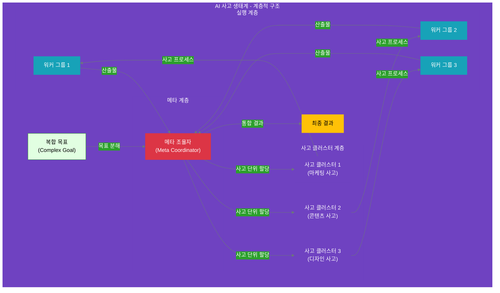

# 12장: 계층적 사고 클러스터
**난이도**: ⭐⭐⭐ (고급)

**Part 4: 사고 중심 조직 아키텍처**

---

## 들어가며: 복잡한 목표, 계층적 사고로 풀다

11장에서 우리는 **기본 사고 클러스터**를 배웠습니다. 단일 목표를 관리 가능한 사고 단위로 분해하고, 사고 조율자가 전체 프로세스를 관리하는 방법이었죠. 하지만 현실의 많은 목표들은 **하나의 사고 클러스터로 처리하기에는 너무 복잡**합니다.

예를 들어보겠습니다:

**단순한 목표 (11장 범위)**:
- "소셜 미디어에 콘텐츠 발행" → 기획 → 작성 → 편집

**복잡한 목표 (12장 범위)**:
- "신제품 출시 캠페인 실행" → ???
  - 마케팅 전략은 누가? (별도의 사고 프로세스 필요)
  - 콘텐츠 제작은 누가? (별도의 사고 프로세스 필요)
  - 디자인 작업은 누가? (별도의 사고 프로세스 필요)
  - 이 모든 것을 누가 조율하는가?

이런 복잡한 목표는 **여러 개의 독립적인 사고 클러스터로 분해**해야 합니다. 그리고 이 사고 클러스터들을 **계층적으로 조율**하는 메커니즘이 필요합니다. 바로 **계층적 사고 클러스터**입니다.

### AI 사고 생태계에서의 위치

11장이 AI 사고 생태계의 **5번째 계층 (사고 클러스터)**을 다뤘다면, 12장은 **같은 계층이지만 더 복잡한 구조**를 다룹니다.

```yaml
전략 계층 (인간 주도):
  1. 미션: 조직 존재 이유
  2. 핵심 가치: 의사결정 기준
  3. 비전: 미래 상태
  
실행 계층 (인간-AI 협업):
  4. 목표: 전략적 목표
  
  5. 사고 클러스터 ⭐ ← 11장 & 12장
     ├─ 기본 (11장): 단일 목표 → 하나의 사고 클러스터
     └─ 계층적 (12장): 복합 목표 → 여러 사고 클러스터 + 메타 조율
  
  6. 실행 항목: 구체적 작업
```

**계층적 사고 클러스터의 구조**:



### 계층적 사고 클러스터란?

**정의**:
> 복잡한 목표를 여러 개의 독립적인 사고 클러스터로 분해하고, 메타 조율자(Meta Coordinator)가 전체 사고 구조를 설계·조율하는 구조입니다.

**핵심 특징**:

1. **사고의 분해 (Decomposition)**
   - 복잡한 목표 → 여러 독립적 사고 단위
   - 각 사고 단위는 자체적인 사고 프로세스를 가짐

2. **계층적 조율 (Hierarchical Coordination)**
   - 메타 조율자: 전체 사고 구조 설계
   - 사고 클러스터: 각자의 사고 프로세스 실행

3. **독립적 추론 (Independent Reasoning)**
   - 각 사고 클러스터는 독립적으로 사고
   - 병렬 처리 가능 (시간 효율 향상)

4. **사고 결과 통합 (Integration)**
   - 메타 조율자가 각 사고 클러스터의 결과를 통합
   - 전체 목표 달성을 위한 종합 판단

### 11장과 12장의 차이

| 측면 | 11장: 기본 사고 클러스터 | 12장: 계층적 사고 클러스터 |
|------|----------------------|------------------------|
| **목표 복잡도** | 단순~중간 | 복잡~매우 복잡 |
| **사고 단위** | 1개 사고 클러스터 | 여러 사고 클러스터 |
| **조율 계층** | 1계층 (조율자-워커) | 2계층 (메타-조율자-워커) |
| **사고 분해** | 사고 단계로 분해 | 사고 클러스터로 분해 |
| **처리 방식** | 순차/병렬 (단계 수준) | 병렬 (클러스터 수준) |
| **예시** | 콘텐츠 생성, 데이터 분석 | 캠페인 실행, 제품 출시 |

### 왜 계층적 사고가 필요한가?

**복잡성의 한계**:

```yaml
단일 사고 클러스터의 한계:
  문제:
    - 하나의 조율자가 모든 사고 단계를 관리
    - 사고 단계가 10개 이상이면 복잡도 폭발
    - 서로 다른 전문성이 필요한 사고를 혼재
  
  예시: "신제품 출시 캠페인"을 단일 클러스터로
    단계1: 타겟 시장 분석 (마케팅 전문성)
    단계2: 콘텐츠 전략 수립 (콘텐츠 전문성)
    단계3: 디자인 컨셉 결정 (디자인 전문성)
    단계4: 소셜 미디어 계획 (마케팅 전문성)
    단계5: 블로그 포스트 작성 (콘텐츠 전문성)
    단계6: 비주얼 에셋 제작 (디자인 전문성)
    ...
    
  → 하나의 조율자가 모든 전문 영역을 이해해야 함 (불가능)
  → 사고 흐름이 복잡해져 관리 불가능
```

**계층적 접근의 이점**:

```yaml
계층적 사고 클러스터:
  해결:
    - 메타 조율자: 전체를 3개 사고 클러스터로 분해
      1. 마케팅 사고 클러스터
      2. 콘텐츠 사고 클러스터
      3. 디자인 사고 클러스터
    
    - 각 클러스터: 자신의 전문 영역에서 독립적 사고
    - 병렬 실행: 3개 클러스터가 동시에 작업
    - 통합: 메타 조율자가 결과를 종합
  
  이점:
    - 전문성 분리: 각 클러스터가 자신의 영역에 집중
    - 복잡도 관리: 각 클러스터는 3-5 단계로 단순
    - 시간 효율: 병렬 처리로 3배 빠름
    - 확장성: 새로운 클러스터 추가 용이
```

### 메타 조율자의 역할

계층적 사고 클러스터의 핵심은 **메타 조율자(Meta Coordinator)**입니다.

**메타 조율자의 3가지 책임**:

1. **사고 분해 설계 (Thinking Decomposition)**
   ```yaml
   질문: "이 복잡한 목표를 어떻게 나눌 것인가?"
   
   고려 사항:
     - 전문성 경계: 각 사고가 명확한 전문 영역을 가지는가?
     - 독립성: 각 사고가 독립적으로 추론 가능한가?
     - 완전성: 모든 사고를 합치면 목표를 달성하는가?
   
   산출물:
     - 사고 클러스터 목록 (3-5개가 적정)
     - 각 클러스터의 사고 목표
     - 클러스터 간 의존성 정의
   ```

2. **사고 조율 및 우선순위 (Coordination & Prioritization)**
   ```yaml
   질문: "어떤 순서로 사고할 것인가?"
   
   패턴:
     - 병렬: 모든 클러스터가 동시에 사고 (독립적인 경우)
     - 순차: 클러스터 A의 결과를 B가 사용 (의존적인 경우)
     - 혼합: 일부는 병렬, 일부는 순차
   
   조율:
     - 각 클러스터에게 사고 목표 전달
     - 진행 상황 모니터링
     - 필요시 우선순위 재조정
   ```

3. **사고 결과 통합 (Integration)**
   ```yaml
   질문: "각 사고의 결과를 어떻게 통합하는가?"
   
   통합 방법:
     - 단순 결합: 각 결과를 나열 (독립적 산출물)
     - 조화 확인: 결과들이 서로 모순되지 않는지 검증
     - 종합 판단: 전체 목표 달성 여부 평가
   
   산출물:
     - 통합 리포트
     - 부족한 부분 식별
     - 다음 액션 제안
   ```

### 실전 예시 미리보기

12장에서는 "신제품 출시 캠페인"을 계층적 사고 클러스터로 설계하는 완전한 사례를 다룹니다:

```yaml
복합 목표: "신제품 '퀀텀 AI 글래스' 출시 캠페인 실행"

메타 조율자의 사고 분해:
  사고_클러스터_1:
    이름: "마케팅 전략 사고"
    목표: "타겟 시장 분석 및 홍보 전략 수립"
    전문성: 시장 분석, 타겟 설정, 채널 기획
  
  사고_클러스터_2:
    이름: "콘텐츠 전략 사고"
    목표: "제품 스토리 및 콘텐츠 전략 수립"
    전문성: 메시지 개발, 콘텐츠 기획
  
  사고_클러스터_3:
    이름: "디자인 전략 사고"
    목표: "브랜드 비주얼 및 디자인 방향 결정"
    전문성: 비주얼 아이덴티티, 디자인 시스템

실행 방식:
  - 3개 클러스터 병렬 실행 (각각 독립적 사고)
  - 각 클러스터는 자체 사고 조율자 + 실행 워커 팀 보유
  - 메타 조율자가 3개 결과를 통합하여 최종 캠페인 계획 완성
```

### 12장에서 배울 것

이 장에서는 **계층적 사고 클러스터**의 설계와 운영을 다룹니다:

**학습 목표**:
- [ ] 복잡한 목표를 여러 사고 클러스터로 분해하는 기준을 이해한다
- [ ] 메타 조율자의 역할과 책임을 명확히 구분할 수 있다
- [ ] 사고 클러스터 간 의존성을 분석하고 관리할 수 있다
- [ ] 병렬 사고 처리의 이점과 구현 방법을 이해한다
- [ ] 사고 결과를 효과적으로 통합하는 방법을 익힌다

### 12장의 구성

- **12.1 복합 목표의 사고 분해**
  - 사고 분해 기준 (전문성, 독립성, 완전성)
  - 사고 클러스터 수 결정 (3-5개가 적정)
  - 사고 클러스터 간 의존성 분석

- **12.2 메타 조율자의 역할**
  - 전체 사고 구조 설계
  - 사고 클러스터 간 조율
  - 우선순위 결정 및 리소스 배분

- **12.3 사고 클러스터 간 의사소통**
  - 공통 사고 산출물 인터페이스
  - 사고 결과 공유 메커니즘
  - 사고 클러스터 간 의존성 처리

- **12.4 병렬 사고 처리**
  - 독립적 사고 프로세스 동시 실행
  - 사고 결과 동기화
  - 전체 사고 통합

- **12.5 실전 사례: 신제품 출시 캠페인**
  - 메타 조율자의 사고 분해 전략
  - 3개 사고 클러스터의 독립적 추론
  - 사고 결과 통합 및 최종 계획 완성

### 다음 장 예고

13장에서는 사고 클러스터에서 도출된 **실행 항목을 효과적으로 지원하는 도구**를 다룹니다. 사고가 아무리 훌륭해도 실행이 뒷받침되지 않으면 무용지물입니다. 13장에서 실행의 효율을 극대화하는 방법을 배웁니다.

---

## 12.1 복합 목표의 사고 분해

(다음 세션에서 작성 예정)

