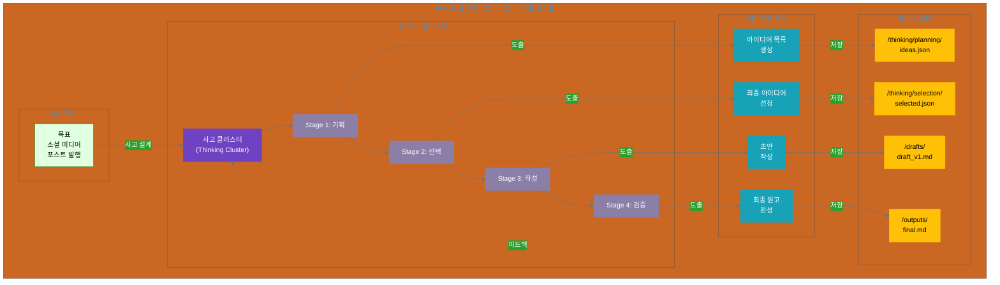

# 13장. 사고 클러스터의 파일 시스템 구현

**핵심 질문**: 사고의 결과를 어떻게 영속적으로 보관하고 공유할까?

---

## 도입

11장과 12장에서 우리는 **사고 클러스터**를 설계하는 방법을 배웠습니다. 단일 목표를 관리 가능한 사고 단위로 분해하고(11장), 복잡한 목표를 여러 사고 클러스터로 계층화하는(12장) 방법이었죠. 하지만 아무리 훌륭한 사고 설계도 **그 결과를 어떻게 관리하는가**가 중요합니다.

사고 클러스터의 결과물은 어디에 저장될까요? 사고 과정은 어떻게 추적할까요? 여러 사람이 어떻게 같은 사고 결과를 공유하고 협업할까요? 

**13장에서는 사고 클러스터의 결과물을 파일 시스템으로 구현하는 방법을 다룹니다.** 이는 AI 사고 생태계의 **6번째 계층(실행 항목)**이 물리적으로 어떻게 구체화되는지를 보여줍니다.

### 사고와 파일: 왜 중요한가?

실제 프로젝트를 생각해보세요:

**시나리오**: 콘텐츠 생성 사고 클러스터 (11장 예시)
```yaml
사고_클러스터: "소셜 미디어 포스트 작성"
  Stage 1: 아이디어 기획
  Stage 2: 핵심 가치 기반 선택
  Stage 3: 초안 작성
  Stage 4: 품질 검증
```

이 사고 클러스터가 실행되면 다음과 같은 질문들이 생깁니다:

- **영속성(Persistence)**: Stage 1의 기획 결과를 어디에 저장할까? 메모리에만 있으면 휘발성이죠.
- **공유성(Sharing)**: 팀원 B가 Stage 2의 선택 근거를 보고 싶다면? 어떻게 전달할까?
- **추적성(Traceability)**: 3개월 후 "왜 이 아이디어를 선택했지?"라는 질문에 답할 수 있을까?
- **개선성(Improvement)**: 사고 프로세스를 개선하려면 과거 사고 과정을 분석해야 하는데, 기록이 없다면?

**파일 시스템은 이 모든 문제의 해답입니다.** 사고의 결과를 파일로 저장함으로써, 사고를 **영속적이고, 공유 가능하며, 추적 가능하고, 개선 가능한** 자산으로 만들 수 있습니다.

### AI 사고 생태계와 13장의 위치

11-12장이 **5층(사고 클러스터)**에 집중했다면, 13장은 **6층(실행 항목)**이 파일 시스템으로 구현되는 과정을 다룹니다.

```yaml
AI 사고 생태계 6계층:

전략 계층 (인간 주도):
  1층: 미션 - 조직의 존재 이유
  2층: 핵심 가치 - 의사결정 기준 ⭐
  3층: 비전 - 미래 상태
  4층: 목표 - 전략적 목표

사고 계층 (인간-AI 협업):
  5층: 사고 클러스터 ⭐ ← 11-12장
     - 11장: 단일 사고 클러스터
     - 12장: 계층적 사고 클러스터

실행 계층 (AI 가속):
  6층: 실행 항목 ⭐ ← 13장
     - 사고의 결과물을 구체적 작업으로 도출
     - 파일 시스템으로 물리적 구현
     - 산출물의 영속적 보관 및 공유
```

**13장의 핵심**: 5층(사고)에서 6층(실행)으로, 그리고 파일 시스템으로



### 11-12-13장의 관계

| 장 | 초점 계층 | 핵심 질문 | 주요 개념 |
|---|---------|----------|---------|
| **11장** | 5층 (사고) | 하나의 목표를 어떻게 사고 단위로 분해할까? | 기본 사고 클러스터, 사고 단계, 사고 조율 |
| **12장** | 5층 (사고) | 복잡한 목표를 어떻게 여러 사고로 분해할까? | 계층적 사고, 메타 조율자, 사고 통합 |
| **13장** | 6층 (실행) | 사고의 결과를 어떻게 물리적으로 구현할까? | 파일 시스템, 디렉토리 구조, 산출물 표준화 |

**연결 관계**:
- 11-12장: 사고 클러스터 **설계** (5층)
- 13장: 사고 클러스터 **구현** (6층 → 파일 시스템)
- 14장: 사고 클러스터 + 파일 시스템 **실전 사례** (5층+6층 통합)

### 파일 시스템의 3가지 핵심 가치

**1. 영속성 (Persistence)**
```yaml
문제: 메모리에만 있는 사고는 휘발됨
해결: 파일로 저장하여 영구 보관
가치:
  - 사고 과정을 언제든 다시 확인 가능
  - 과거 의사결정 근거를 추적
  - 사고 히스토리 축적
```

**2. 공유성 (Sharing)**
```yaml
문제: 사고 결과를 다른 사람에게 어떻게 전달?
해결: 파일 시스템을 통한 공유
가치:
  - 팀원과 사고 과정 공유
  - 비동기 협업 가능
  - 지식의 조직적 축적
```

**3. 추적성 (Traceability)**
```yaml
문제: "왜 이렇게 결정했지?"라는 질문에 답할 수 없음
해결: 사고 과정을 파일로 기록
가치:
  - 의사결정 근거 명확화
  - 사고 프로세스 개선 근거 확보
  - 감사(Audit) 및 검증 가능
```

### 13장에서 다룰 내용

이 장은 4개의 섹션으로 구성됩니다:

**13.1 사고에서 파일로: 6계층의 구체화**
- 5층(사고 클러스터) → 6층(실행 항목) → 파일 시스템
- 사고 산출물의 물리적 표현
- 파일 시스템이 주는 3가지 이점 심화

**13.2 디렉토리 구조 설계 원칙**
- 3가지 원칙: 격리(Isolation), 공유(Sharing), 명명(Naming)
- 사고 클러스터별 디렉토리 분리 전략
- 공통 자원(`/shared`) 관리 방법
- 산출물 보관(`/outputs`) 전략

**13.3 사고 상태 추적 메커니즘**
- `thinking_state.json`: 사고 클러스터의 진행 상황
- 4가지 사고 상태: 기획(planning), 추론(reasoning), 실험(experimenting), 반성(reflecting)
- 피드백 루프: 6층 → 5층 → 4층 → 2층

**13.4 사고 산출물 표준화**
- JSON 기반 사고 기록 스키마
- 사고 과정(process)과 결과물(output) 분리
- 메타데이터: 사고 시작/종료, 핵심 가치 평가, 품질 지표

### 학습 목표

이 장을 마치면 다음을 할 수 있습니다:

1. **5층→6층 매핑**: 사고 클러스터의 각 Stage가 어떤 실행 항목을 도출하고, 이것이 어떤 파일로 저장되는지 설계할 수 있습니다.

2. **디렉토리 구조 설계**: 사고 클러스터별로 명확히 분리되고, 공통 자원은 재사용 가능한 디렉토리 구조를 만들 수 있습니다.

3. **사고 상태 추적**: `thinking_state.json`을 통해 사고 클러스터의 진행 상황을 실시간으로 추적할 수 있습니다.

4. **산출물 표준화**: JSON 기반의 일관된 산출물 형식을 정의하여, 사고 과정과 결과를 명확히 구분할 수 있습니다.

5. **피드백 루프 구현**: 파일 시스템의 산출물이 사고 프로세스 개선으로 연결되는 피드백 메커니즘을 설계할 수 있습니다.

### 실전 연결: 14장 예고

13장에서 배운 파일 시스템 구현 방법은 14장의 **실전 사례**에서 완전히 통합됩니다:

- **사례 1**: 콘텐츠 생성 워크플로우 (11장 패턴 + 파일 시스템)
- **사례 2**: 데이터 분석 워크플로우 (11장 패턴 + 파일 시스템)
- **사례 3**: 복합 프로젝트 (12장 패턴 + 파일 시스템)

각 사례는 report_kr.md의 **6계층 모델을 완전히 통합**하여, 미션(1층)부터 파일 시스템(6층)까지의 전체 흐름을 보여줍니다.

---

**이제 13.1로 넘어가 사고 클러스터가 어떻게 파일 시스템으로 구현되는지 구체적으로 살펴보겠습니다.**
