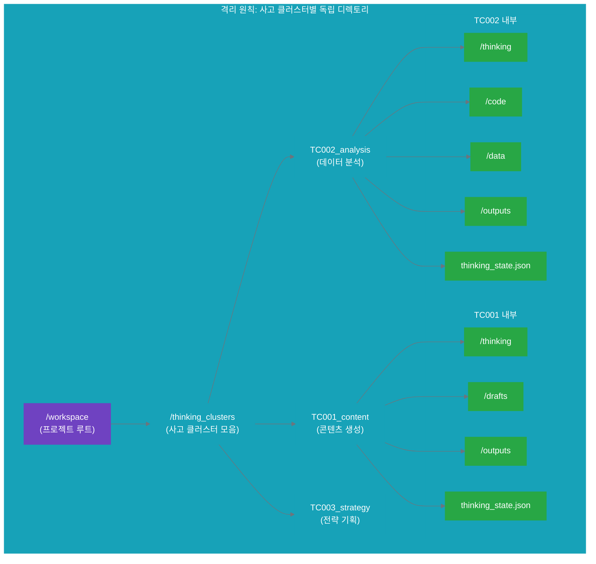
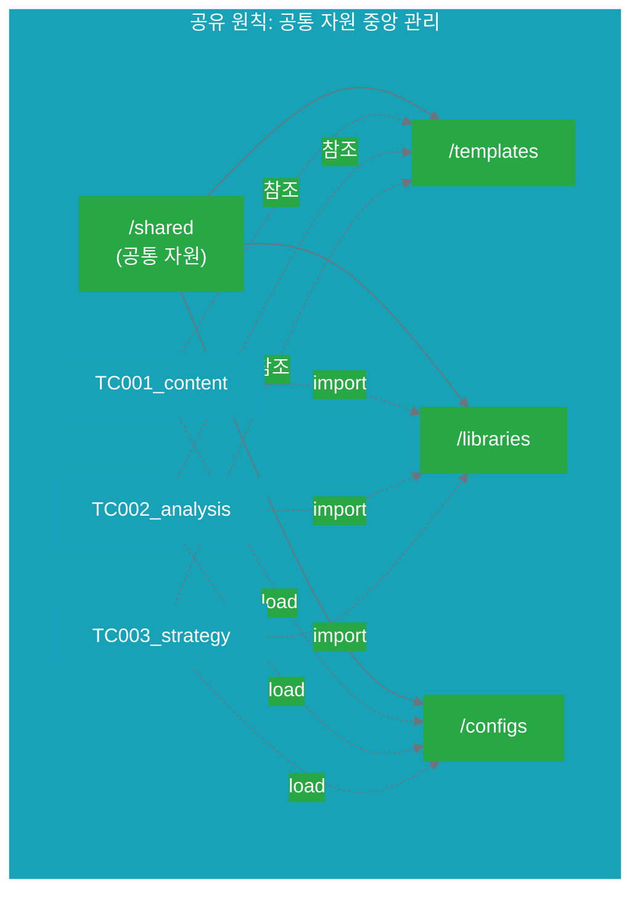
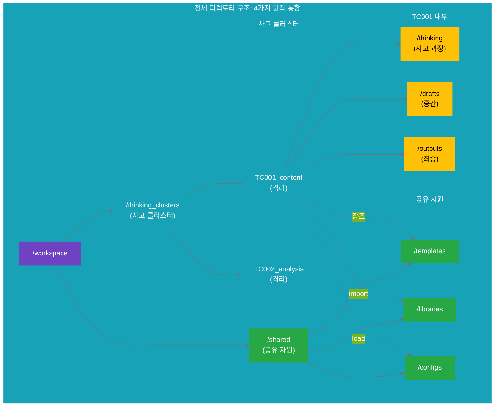

# 13.2 디렉토리 구조 설계 원칙

13.1에서 사고 클러스터(5층)의 결과가 파일 시스템으로 구현되는 과정을 배웠습니다. 이제 **여러 사고 클러스터**가 동시에 존재할 때, 디렉토리를 어떻게 구조화해야 할지 3가지 핵심 원칙을 다룹니다.

---

## 13.2.1 격리 원칙 (Isolation): 사고 클러스터별 독립성

### 왜 격리가 필요한가?

**문제: 혼재된 사고**
```yaml
격리되지 않은 디렉토리 구조:
  # 모든 사고 클러스터의 파일이 한 곳에
  /workspace/
    ideas_A.json          # 콘텐츠 생성 사고
    ideas_B.json          # 데이터 분석 사고
    draft_content.md      # 어느 클러스터?
    analysis_v1.py        # 어느 클러스터?
    final_report.md       # 어느 클러스터?
  
  문제:
    - "이 파일이 어떤 사고 클러스터의 산출물인지" 불명확
    - 파일 이름 충돌 가능 (여러 클러스터에서 draft.md 생성)
    - 한 클러스터의 문제가 다른 클러스터에 영향
    - 클러스터 단위 이동/삭제 불가능
```

**해결: 사고 클러스터별 독립 디렉토리**
```yaml
격리된 디렉토리 구조:
  /workspace/
    thinking_clusters/
      TC001_content_generation/       # 콘텐츠 생성 클러스터
        thinking/
          planning/ideas.json
          selection/selected.json
        drafts/
          draft_v1.md
        outputs/
          final.md
        thinking_state.json
      
      TC002_data_analysis/            # 데이터 분석 클러스터
        thinking/
          planning/analysis_plan.json
          reasoning/hypotheses.json
        code/
          analysis_v1.py
        outputs/
          report.md
        thinking_state.json
  
  장점:
    - 각 클러스터의 범위가 디렉토리로 명확히 구분
    - 파일 이름 충돌 없음 (각자 독립적)
    - 클러스터 단위 백업/이동/삭제 가능
    - 한 클러스터의 변경이 다른 클러스터에 영향 없음
```

### 격리 원칙의 3가지 수준

```yaml
# 레벨 1: 최상위 격리 (사고 클러스터 단위)
level_1_top_isolation:
  principle: "각 사고 클러스터는 독립된 디렉토리를 가진다"
  
  structure:
    /thinking_clusters/
      TC001_content_generation/
      TC002_data_analysis/
      TC003_strategy_planning/
  
  규칙:
    - 클러스터 ID는 고유해야 함 (TC001, TC002, ...)
    - 클러스터 이름은 목표를 반영 (content_generation)
    - 각 클러스터는 자체적인 thinking_state.json 보유

# 레벨 2: 단계별 격리 (사고 Stage 단위)
level_2_stage_isolation:
  principle: "각 사고 Stage는 독립된 하위 디렉토리를 가진다"
  
  structure:
    /thinking_clusters/TC001_content_generation/
      thinking/
        planning/        # Stage 1
        selection/       # Stage 2
        creation/        # Stage 3
        reflection/      # Stage 4
  
  규칙:
    - Stage별로 디렉토리 분리 (planning, selection, ...)
    - 각 Stage 디렉토리는 해당 Stage의 산출물만 포함
    - Stage 간 참조는 상대 경로로 (../selection/selected.json)

# 레벨 3: 파일 유형별 격리
level_3_type_isolation:
  principle: "파일 유형별로 디렉토리를 분리한다"
  
  structure:
    /thinking_clusters/TC001_content_generation/
      thinking/         # 사고 과정 파일
      drafts/           # 중간 산출물
      outputs/          # 최종 산출물
      code/             # 실행 코드 (필요 시)
      data/             # 데이터 파일 (필요 시)
  
  규칙:
    - thinking/: 사고 과정만 (ideas, reasoning, reflection)
    - drafts/: 작업 중인 버전들
    - outputs/: 완성된 산출물만
    - 파일 유형이 명확하여 검색 용이
```

### 격리 원칙 적용 예시

**시나리오**: 2개의 사고 클러스터가 동시에 진행 중
- TC001: 소셜 미디어 콘텐츠 생성
- TC002: 사용자 이탈률 분석

```yaml
# 격리된 디렉토리 구조
project_root/
  thinking_clusters/
    
    # 클러스터 1: 콘텐츠 생성
    TC001_content_generation/
      thinking/
        planning/
          ideas.json                 # 10개 아이디어
          research.md                # 타겟 분석
        selection/
          selected.json              # 선정 아이디어 + 근거
        creation/
          notes.md                   # 작성 시 참고사항
        reflection/
          quality_check.json         # 품질 검증
      
      drafts/
        draft_v1.md                  # 초안 1차
        draft_v2.md                  # 초안 2차
      
      outputs/
        final.md                     # 최종 원고
      
      thinking_state.json            # TC001 상태 추적
      metadata.json                  # 클러스터 메타데이터
    
    # 클러스터 2: 데이터 분석
    TC002_churn_analysis/
      thinking/
        planning/
          analysis_plan.json         # 분석 계획
        reasoning/
          hypotheses.json            # 가설 목록
          test_results.json          # 검증 결과
        experimenting/
          experiment_log.md          # 실험 기록
        reflection/
          findings.json              # 인사이트
      
      code/
        data_prep.py                 # 데이터 전처리
        analysis.py                  # 분석 스크립트
      
      data/
        raw_data.csv                 # 원본 데이터
        processed_data.csv           # 전처리 데이터
      
      outputs/
        report.md                    # 최종 분석 보고서
        visualizations/
          chart_1.png
          chart_2.png
      
      thinking_state.json            # TC002 상태 추적
      metadata.json                  # 클러스터 메타데이터

# 격리의 효과
isolation_benefits:
  독립성:
    - TC001의 draft_v1.md와 TC002의 파일명 충돌 없음
    - TC001 작업이 TC002에 영향 주지 않음
  
  명확성:
    - "이 파일이 어느 클러스터인지" 디렉토리로 즉시 파악
    - 클러스터별 진행 상황 한눈에 확인
  
  관리성:
    - TC001만 백업 가능
    - TC002만 삭제 가능
    - 클러스터 단위로 이동/복사 가능
```

### Mermaid 다이어그램: 격리된 구조



---

## 13.2.2 공유 원칙 (Sharing): 공통 자원의 중앙 관리

### 왜 공유가 필요한가?

**문제: 중복된 자원**
```yaml
공유되지 않는 구조:
  /thinking_clusters/
    TC001_content/
      templates/
        message_house_template.json    # 중복 1
      libraries/
        evaluation_utils.py            # 중복 1
    
    TC002_analysis/
      templates/
        message_house_template.json    # 중복 2 (같은 파일!)
      libraries/
        evaluation_utils.py            # 중복 2 (같은 파일!)
    
    TC003_strategy/
      templates/
        message_house_template.json    # 중복 3 (같은 파일!)
      libraries/
        evaluation_utils.py            # 중복 3 (같은 파일!)
  
  문제:
    - 같은 파일이 여러 곳에 복사 (저장 공간 낭비)
    - 한 곳을 수정하면 다른 곳도 수정해야 함 (유지보수 어려움)
    - 버전 불일치 발생 (TC001은 v1.0, TC002는 v1.1)
```

**해결: 공통 자원을 `/shared`에 중앙 관리**
```yaml
공유 자원 구조:
  /workspace/
    shared/                             # 공통 자원
      templates/
        message_house_template.json     # 모든 클러스터가 참조
        target_analysis_template.json
        quality_checklist_template.json
      
      libraries/
        evaluation_utils.py             # 핵심 가치 평가 유틸리티
        state_tracker.py                # 상태 추적 유틸리티
        feedback_analyzer.py            # 피드백 분석 유틸리티
      
      configs/
        core_values.yaml                # 조직의 핵심 가치
        quality_standards.yaml          # 품질 기준
      
      docs/
        naming_conventions.md           # 명명 규칙 가이드
        directory_structure.md          # 디렉토리 구조 가이드
    
    thinking_clusters/
      TC001_content/
        # templates/ 없음! → /shared/templates/ 참조
        # libraries/ 없음! → /shared/libraries/ 참조
      
      TC002_analysis/
        # templates/ 없음! → /shared/templates/ 참조
        # libraries/ 없음! → /shared/libraries/ 참조
  
  장점:
    - 중복 제거: 한 곳에만 파일 존재
    - 일관성 보장: 모든 클러스터가 동일한 버전 사용
    - 유지보수 용이: 한 곳만 수정하면 모든 곳에 반영
    - 재사용 촉진: 좋은 템플릿/라이브러리가 조직 자산으로 축적
```

### 공유 원칙의 3가지 범주

```yaml
# 범주 1: 공통 템플릿
category_1_templates:
  purpose: "반복 사용되는 파일 구조"
  location: "/shared/templates/"
  
  examples:
    - message_house_template.json:
        description: "메시지 하우스 템플릿"
        used_by: ["TC001", "TC003", "TC007"]
        content:
          core_message: ""
          supporting_points: []
          evidence: []
    
    - quality_checklist_template.json:
        description: "품질 검증 체크리스트"
        used_by: ["TC001", "TC002", "TC005"]
        content:
          checks:
            - criterion: ""
              weight: 0
              result: ""

# 범주 2: 공통 라이브러리
category_2_libraries:
  purpose: "재사용 가능한 코드/유틸리티"
  location: "/shared/libraries/"
  
  examples:
    - evaluation_utils.py:
        description: "핵심 가치 기반 평가 유틸리티"
        functions:
          - calculate_core_value_score()
          - rank_alternatives()
          - generate_rationale()
    
    - state_tracker.py:
        description: "사고 상태 추적 유틸리티"
        functions:
          - update_thinking_state()
          - get_cluster_status()
          - log_state_change()

# 범주 3: 공통 설정
category_3_configs:
  purpose: "조직 전체 기준 및 설정"
  location: "/shared/configs/"
  
  examples:
    - core_values.yaml:
        description: "조직의 핵심 가치 정의"
        content:
          values:
            - name: "실용성"
              weight: 0.4
              definition: "실제로 적용 가능하고 측정 가능한 가치"
            - name: "신뢰"
              weight: 0.3
              definition: "사실에 기반하고 검증 가능한 가치"
            - name: "혁신"
              weight: 0.3
              definition: "새롭고 창의적인 접근"
    
    - quality_standards.yaml:
        description: "품질 기준 정의"
        content:
          standards:
            - criterion: "톤앤매너 일관성"
              threshold: 8
            - criterion: "사실 확인"
              threshold: 10
```

### 공유 자원 사용 예시

**시나리오**: TC001과 TC002 모두 핵심 가치 기반 평가 필요

```yaml
# TC001: 콘텐츠 생성에서 공유 자원 사용
/thinking_clusters/TC001_content/
  thinking/
    selection/
      evaluation.py:
        # 공유 라이브러리 사용
        import sys
        sys.path.append('../../shared/libraries')
        from evaluation_utils import calculate_core_value_score
        
        # 공통 설정 로드
        import yaml
        with open('../../shared/configs/core_values.yaml') as f:
            core_values = yaml.safe_load(f)
        
        # 아이디어 평가
        ideas = load_ideas('ideas.json')
        scores = calculate_core_value_score(ideas, core_values)

# TC002: 데이터 분석에서 동일한 공유 자원 사용
/thinking_clusters/TC002_analysis/
  thinking/
    reasoning/
      hypothesis_evaluation.py:
        # 동일한 공유 라이브러리 사용
        import sys
        sys.path.append('../../shared/libraries')
        from evaluation_utils import calculate_core_value_score
        
        # 동일한 공통 설정 로드
        import yaml
        with open('../../shared/configs/core_values.yaml') as f:
            core_values = yaml.safe_load(f)
        
        # 가설 평가
        hypotheses = load_hypotheses('hypotheses.json')
        scores = calculate_core_value_score(hypotheses, core_values)

# 공유 자원의 효과
sharing_benefits:
  일관성:
    - TC001과 TC002가 동일한 평가 로직 사용
    - core_values.yaml을 한 곳에서 관리 → 모든 클러스터에 일관되게 적용
  
  효율성:
    - evaluation_utils.py를 한 번만 작성
    - 버그 수정 시 한 곳만 수정 → 모든 클러스터에 자동 반영
  
  진화:
    - 좋은 템플릿/유틸리티가 조직 자산으로 축적
    - 새 클러스터 시작 시 공유 자원 재사용 → 빠른 시작
```

### Mermaid 다이어그램: 공유 자원 참조



---

## 13.2.3 명명 원칙 (Naming): 일관된 이름 규칙

### 왜 명명 규칙이 필요한가?

**문제: 혼란스러운 이름**
```yaml
일관되지 않은 명명:
  /thinking_clusters/
    content_gen/              # 축약
    TC002-data-analysis/      # 하이픈 사용
    StrategyPlan/             # 카멜케이스
    tc3/                      # 숫자만
    my_new_project_v2/        # 불명확
  
  문제:
    - 명명 스타일이 제각각 (스네이크케이스, 하이픈, 카멜케이스)
    - 클러스터 ID와 이름의 관계 불명확
    - 파일/디렉토리 이름만으로는 내용 파악 어려움
    - 정렬 시 의도하지 않은 순서
```

**해결: 일관된 명명 규칙**
```yaml
일관된 명명 구조:
  /thinking_clusters/
    TC001_content_generation/     # ✅ TC + 3자리 숫자 + 스네이크케이스 설명
    TC002_data_analysis/          # ✅ 동일 패턴
    TC003_strategy_planning/      # ✅ 동일 패턴
  
  규칙:
    format: "TC{###}_{descriptive_name}"
    id: "TC + 3자리 숫자 (001, 002, ...)"
    name: "스네이크케이스 (snake_case)"
    length: "20-50자 (너무 짧거나 길지 않게)"
  
  장점:
    - 한눈에 클러스터 ID 파악 (TC001, TC002)
    - 알파벳 순 정렬 시 의도한 순서 유지
    - 사람과 AI 모두 이해 가능한 이름
```

### 명명 규칙 3단계

```yaml
# 레벨 1: 클러스터 디렉토리 명명
level_1_cluster_naming:
  format: "TC{###}_{goal_description}"
  
  규칙:
    - id: "TC + 3자리 숫자 (001-999)"
    - description: "목표를 간결하게 표현 (2-4단어)"
    - separator: "언더스코어 (_)"
    - case: "소문자 스네이크케이스"
  
  예시:
    ✅ 좋은 예:
      - TC001_content_generation
      - TC002_churn_analysis
      - TC003_market_research
      - TC010_customer_feedback_analysis
    
    ❌ 나쁜 예:
      - tc1 (설명 없음)
      - TC002-data-analysis (하이픈 사용)
      - ContentGeneration (카멜케이스)
      - TC100_this_is_a_very_long_and_detailed_description (너무 길음)

# 레벨 2: Stage 디렉토리 명명
level_2_stage_naming:
  format: "{stage_name}"
  
  규칙:
    - 표준 Stage 이름 사용: planning, selection, creation, reflection
    - 또는 report_kr.md의 4가지: planning, reasoning, experimenting, reflecting
    - 소문자 단수형
  
  예시:
    ✅ 표준 이름:
      - thinking/planning/
      - thinking/selection/
      - thinking/creation/
      - thinking/reflection/
    
    ✅ report_kr.md 4가지 사고 상태:
      - thinking/planning/
      - thinking/reasoning/
      - thinking/experimenting/
      - thinking/reflecting/

# 레벨 3: 파일 명명
level_3_file_naming:
  format: "{purpose}_{version}.{ext}"
  
  규칙:
    - purpose: 파일의 목적을 간결하게 (1-3단어)
    - version: 필요 시 버전 표시 (v1, v2, 또는 날짜)
    - extension: 적절한 확장자 (.json, .md, .py, .txt)
    - 소문자 스네이크케이스
  
  예시:
    ✅ 좋은 예:
      - ideas.json (버전 불필요 시)
      - selected.json
      - draft_v1.md
      - draft_v2.md
      - analysis_20251013.py (날짜 버전)
      - quality_check.json
    
    ❌ 나쁜 예:
      - Ideas.json (대문자 사용)
      - my-draft.md (하이픈 사용)
      - draftFinal.md (카멜케이스)
      - temp123.txt (의미 불명확)
```

### 명명 규칙 전체 예시

```yaml
# 전체 디렉토리/파일 명명 규칙 적용
/workspace/
  thinking_clusters/
    
    TC001_content_generation/          # ✅ 클러스터: TC + 숫자 + 설명
      thinking/
        planning/                      # ✅ Stage: 표준 이름
          ideas.json                   # ✅ 파일: 목적 명확
          research.md
        selection/
          selected.json
          evaluation_matrix.json
        creation/
          draft_v1.md                  # ✅ 버전 표시
          draft_v2.md
        reflection/
          quality_check.json
      
      outputs/
        final_20251013.md              # ✅ 날짜 버전
      
      thinking_state.json              # ✅ 표준 파일명
      metadata.json
    
    TC002_churn_analysis/              # ✅ 클러스터: TC + 숫자 + 설명
      thinking/
        planning/
          analysis_plan.json
        reasoning/                     # ✅ report_kr.md 4가지 상태 사용
          hypotheses.json
          test_results.json
        experimenting/                 # ✅ report_kr.md 4가지 상태 사용
          experiment_log.md
        reflecting/                    # ✅ report_kr.md 4가지 상태 사용
          findings.json
      
      code/
        data_prep_v1.py                # ✅ 버전 표시
        analysis_v2.py
      
      outputs/
        report_20251013.md             # ✅ 날짜 버전
      
      thinking_state.json
      metadata.json

# 명명 규칙의 효과
naming_benefits:
  탐색성:
    - 디렉토리 이름만으로 클러스터 목적 파악
    - 파일 이름만으로 내용 추측 가능
  
  정렬성:
    - TC001, TC002, TC003 순서대로 자동 정렬
    - 버전 파일도 v1, v2, v3 순서 유지
  
  확장성:
    - 클러스터 999개까지 지원 (TC001~TC999)
    - 일관된 패턴으로 자동화 용이
```

### 명명 규칙 체크리스트

```yaml
# 클러스터 명명 체크리스트
cluster_naming_checklist:
  - [ ] TC + 3자리 숫자 형식 사용 (TC001, TC002, ...)
  - [ ] 설명은 2-4단어 이내
  - [ ] 스네이크케이스 사용 (content_generation, not ContentGeneration)
  - [ ] 목표를 반영하는 명확한 이름
  - [ ] 20-50자 길이 (너무 짧거나 길지 않게)

# 파일 명명 체크리스트
file_naming_checklist:
  - [ ] 소문자 사용
  - [ ] 스네이크케이스 사용 (draft_v1.md, not draftV1.md)
  - [ ] 목적이 명확한 이름
  - [ ] 버전 표시 필요 시 _v{#} 또는 _YYYYMMDD
  - [ ] 적절한 확장자 (.json, .md, .py, .txt)
  - [ ] 1-3단어 이내 (너무 길지 않게)

# Stage 명명 체크리스트
stage_naming_checklist:
  - [ ] 표준 Stage 이름 사용 (planning, selection, creation, reflection)
  - [ ] 또는 report_kr.md 4가지 (planning, reasoning, experimenting, reflecting)
  - [ ] 소문자 단수형
  - [ ] 하나의 프로젝트 내에서 일관된 용어 사용
```

---

## 13.2.4 산출물 보관 전략

### `/outputs` 디렉토리의 역할

**문제: 산출물 혼재**
```yaml
산출물이 혼재된 구조:
  /thinking_clusters/TC001_content/
    draft_v1.md                # 중간 산출물
    draft_v2.md                # 중간 산출물
    final.md                   # 최종 산출물
    ideas.json                 # 사고 과정
    selected.json              # 사고 과정
  
  문제:
    - 최종 산출물과 중간 산출물이 섞여 있음
    - "완성된 것"과 "작업 중인 것"의 구분 불명확
    - 최종 산출물만 추출하기 어려움
```

**해결: `/outputs`에 최종 산출물만 보관**
```yaml
산출물 분리 구조:
  /thinking_clusters/TC001_content/
    thinking/              # 사고 과정만
      planning/
      selection/
      ...
    
    drafts/                # 중간 산출물만
      draft_v1.md
      draft_v2.md
    
    outputs/               # 최종 산출물만 ⭐
      final.md             # ✅ 완성된 원고
      metadata.json        # ✅ 산출물 메타데이터
  
  규칙:
    - outputs/: 완성되어 외부에 제공 가능한 산출물만
    - drafts/: 작업 중인 버전들
    - thinking/: 사고 과정 및 중간 결과
```

### 산출물 보관 3가지 패턴

```yaml
# 패턴 1: 단일 산출물
pattern_1_single_output:
  use_case: "하나의 완성된 산출물"
  
  structure:
    outputs/
      final.md                # 최종 원고
      metadata.json           # 메타데이터
  
  예시:
    TC001_content_generation:
      outputs/
        final.md:
          title: "AI 협업으로 생산성 30% 향상"
          word_count: 1000
          approved: true
        
        metadata.json:
          created_at: "2025-10-13T11:00:00Z"
          approved_by: "user@example.com"
          published_at: "2025-10-13T12:00:00Z"
          engagement:
            views: 5000
            likes: 340

# 패턴 2: 다중 산출물
pattern_2_multiple_outputs:
  use_case: "여러 개의 완성된 산출물"
  
  structure:
    outputs/
      report.md               # 분석 보고서
      presentation.pdf        # 프레젠테이션
      visualizations/         # 차트/그래프
        chart_1.png
        chart_2.png
  
  예시:
    TC002_churn_analysis:
      outputs/
        report.md:
          title: "사용자 이탈률 분석 보고서"
          pages: 15
        
        presentation.pdf:
          slides: 20
          for: "경영진 보고"
        
        visualizations/
          funnel_analysis.png
          cohort_retention.png
          churn_prediction.png

# 패턴 3: 날짜별 버전
pattern_3_dated_versions:
  use_case: "주기적으로 업데이트되는 산출물"
  
  structure:
    outputs/
      report_20251013.md      # 10월 13일 버전
      report_20251020.md      # 10월 20일 버전
      report_latest.md        # 최신 버전 (심볼릭 링크)
  
  예시:
    TC003_weekly_metrics:
      outputs/
        metrics_20251006.md   # Week 1
        metrics_20251013.md   # Week 2
        metrics_20251020.md   # Week 3
        metrics_latest.md     # → 가장 최근 파일 참조
```

### 산출물 메타데이터 구조

```yaml
# outputs/metadata.json 표준 스키마
output_metadata_schema:
  cluster_id: "TC001"
  cluster_name: "content_generation"
  
  outputs:
    - file: "final.md"
      type: "document"
      status: "published"
      
      created:
        timestamp: "2025-10-13T11:00:00Z"
        by: "AI + Human"
      
      approved:
        timestamp: "2025-10-13T11:30:00Z"
        by: "user@example.com"
      
      published:
        timestamp: "2025-10-13T12:00:00Z"
        channel: "social_media"
      
      metrics:
        engagement_rate: 6.8
        views: 5000
        likes: 340
        shares: 85
      
      references:
        - "/thinking/selection/selected.json"  # 어떤 아이디어 선택했는지
        - "/drafts/draft_v2.md"                # 최종 수정 버전

# 메타데이터 활용
metadata_usage:
  추적:
    - "이 산출물이 언제 생성되었는지"
    - "누가 승인했는지"
    - "어떤 사고 과정을 거쳤는지"
  
  피드백:
    - 실행 결과(metrics) → 사고 클러스터로 피드백
    - 인게이지먼트 6.8% → 목표 5% 초과 달성
    - 다음 목표 설정: 7%로 상향
```

### 전체 디렉토리 구조 종합

```yaml
# 격리, 공유, 명명, 산출물 보관 원칙을 모두 적용한 구조
/workspace/
  
  # 공통 자원 (공유 원칙)
  shared/
    templates/
      message_house_template.json
      quality_checklist_template.json
    libraries/
      evaluation_utils.py
      state_tracker.py
    configs/
      core_values.yaml
      quality_standards.yaml
  
  # 사고 클러스터 (격리 원칙 + 명명 원칙)
  thinking_clusters/
    
    TC001_content_generation/          # ✅ 명명: TC + 숫자 + 설명
      thinking/                        # ✅ 격리: Stage별 분리
        planning/
          ideas.json
        selection/
          selected.json
        creation/
          notes.md
        reflection/
          quality_check.json
      
      drafts/                          # 중간 산출물
        draft_v1.md
        draft_v2.md
      
      outputs/                         # ✅ 산출물: 최종만
        final.md
        metadata.json
      
      thinking_state.json
    
    TC002_churn_analysis/              # ✅ 격리: 독립 클러스터
      thinking/
        planning/
          analysis_plan.json
        reasoning/
          hypotheses.json
        experimenting/
          experiment_log.md
        reflecting/
          findings.json
      
      code/
        analysis_v2.py
      
      data/
        processed_data.csv
      
      outputs/
        report.md
        visualizations/
          chart_1.png
          chart_2.png
        metadata.json
      
      thinking_state.json
```

### Mermaid 다이어그램: 전체 디렉토리 구조



---

## 요약

13.2에서는 디렉토리 구조 설계의 3가지 핵심 원칙을 배웠습니다:

**핵심 원칙**:
1. **격리 (Isolation)**: 사고 클러스터별로 독립 디렉토리를 만들어 범위를 명확히 구분
2. **공유 (Sharing)**: 공통 자원은 `/shared`에 중앙 관리하여 중복 제거 및 일관성 보장
3. **명명 (Naming)**: 일관된 명명 규칙으로 탐색성과 확장성 확보
4. **산출물 보관**: `/outputs`에 최종 산출물만 분리하여 완성도 구분

**다음 섹션**: 13.3에서는 사고 클러스터의 진행 상태를 `thinking_state.json`으로 어떻게 추적할지, 4가지 사고 상태(planning, reasoning, experimenting, reflecting)와 상태 전이 메커니즘을 다룹니다.
