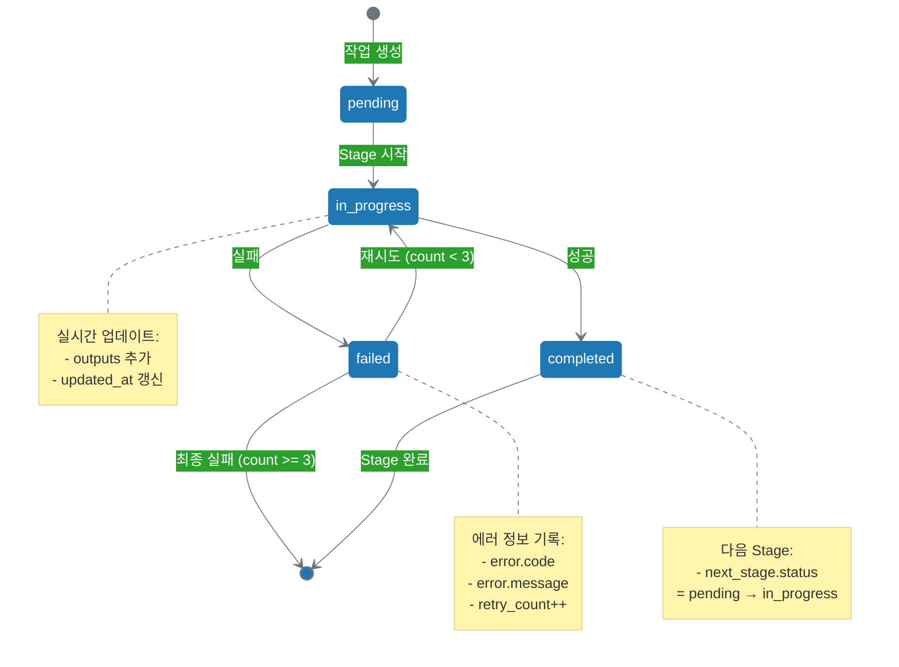

# 13.3 사고 상태 추적 메커니즘

사고 클러스터는 여러 Stage를 거쳐 진행됩니다. 각 Stage의 진행 상황을 추적하고 관리하기 위해 **사고 상태 추적 메커니즘**이 필요합니다. 이 섹션에서는 `thinking_state.json` 파일을 통한 상태 관리 방법을 다룹니다.

---

## 13.3.1 `thinking_state.json` 스키마

### 기본 구조

`thinking_state.json`은 사고 클러스터의 진행 상황을 기록하는 JSON 파일입니다:

```json
{
  "task_id": "content-001",
  "title": "AI 협업 가이드 블로그 포스트",
  "goal": "소셜 미디어에 AI 협업 콘텐츠 발행",
  "created_at": "2025-10-13T10:00:00Z",
  "updated_at": "2025-10-13T10:50:00Z",
  "current_stage": "reflection",
  "overall_status": "in_progress",
  "progress_percentage": 75,
  
  "stages": {
    "planning": {
      "status": "completed",
      "thinking_type": "divergent",
      "started_at": "2025-10-13T10:00:00Z",
      "completed_at": "2025-10-13T10:10:00Z",
      "duration_minutes": 10,
      "outputs": [
        "thinking/planning/ideas.json",
        "thinking/planning/research.md"
      ]
    },
    "selection": {
      "status": "completed",
      "thinking_type": "convergent",
      "started_at": "2025-10-13T10:15:00Z",
      "completed_at": "2025-10-13T10:25:00Z",
      "duration_minutes": 10,
      "outputs": [
        "thinking/selection/selected.json",
        "thinking/selection/rationale.md"
      ]
    },
    "creation": {
      "status": "completed",
      "thinking_type": "generative",
      "started_at": "2025-10-13T10:30:00Z",
      "completed_at": "2025-10-13T10:45:00Z",
      "duration_minutes": 15,
      "outputs": [
        "drafts/draft_v1.md",
        "drafts/draft_v2.md"
      ]
    },
    "reflection": {
      "status": "in_progress",
      "thinking_type": "critical",
      "started_at": "2025-10-13T10:50:00Z",
      "completed_at": null,
      "duration_minutes": null,
      "outputs": []
    }
  },
  
  "core_values_evaluation": {
    "practicality": 8,
    "trust": 7,
    "innovation": 8,
    "weighted_score": 7.7
  },
  
  "quality_metrics": {
    "completeness": 0.75,
    "consistency": 0.90,
    "alignment_with_values": 0.85
  },
  
  "feedback": {
    "from_previous_tasks": [],
    "for_next_tasks": []
  }
}
```

### 필수 필드 설명

```yaml
# 최상위 필드
task_id:
  설명: 작업 고유 식별자
  타입: string
  예시: "content-001"

title:
  설명: 작업 제목 (사람이 읽기 쉬운)
  타입: string
  예시: "AI 협업 가이드 블로그 포스트"

goal:
  설명: 4층 목표 (report_kr.md)
  타입: string
  예시: "소셜 미디어에 AI 협업 콘텐츠 발행"

created_at:
  설명: 작업 생성 시각
  타입: ISO 8601 datetime
  예시: "2025-10-13T10:00:00Z"

updated_at:
  설명: 마지막 업데이트 시각
  타입: ISO 8601 datetime
  예시: "2025-10-13T10:50:00Z"

current_stage:
  설명: 현재 진행 중인 Stage
  타입: string (enum)
  가능값: ["planning", "selection", "creation", "reflection"]

overall_status:
  설명: 전체 작업 상태
  타입: string (enum)
  가능값: ["pending", "in_progress", "completed", "failed"]

progress_percentage:
  설명: 전체 진행률 (0-100)
  타입: number
  계산: (완료된 Stage 수 / 전체 Stage 수) * 100

# stages 객체
stages:
  설명: 각 Stage의 상세 정보
  타입: object
  
  각 Stage 필드:
    status:
      가능값: ["pending", "in_progress", "completed", "failed"]
    
    thinking_type:
      가능값: ["divergent", "convergent", "generative", "critical"]
      의미:
        - divergent: 발산적 사고 (아이디어 탐색)
        - convergent: 수렴적 사고 (최적 선택)
        - generative: 생성적 사고 (콘텐츠 생성)
        - critical: 비판적 사고 (품질 검증)
    
    started_at: Stage 시작 시각
    completed_at: Stage 완료 시각 (null if in_progress)
    duration_minutes: 소요 시간 (분)
    outputs: 생성된 파일 목록

# core_values_evaluation
core_values_evaluation:
  설명: 핵심 가치 평가 점수 (report_kr.md 2층)
  타입: object
  예시:
    practicality: 8     # 실용성
    trust: 7            # 신뢰
    innovation: 8       # 혁신
    weighted_score: 7.7 # 가중 평균

# quality_metrics
quality_metrics:
  설명: 품질 지표 (15장 참고)
  타입: object
  범위: 0.0 ~ 1.0
  예시:
    completeness: 0.75      # 완전성
    consistency: 0.90       # 일관성
    alignment_with_values: 0.85  # 가치 일치도
```

---

## 13.3.2 4가지 사고 상태

사고 클러스터의 각 Stage는 4가지 기본 상태를 가집니다:

### 1. pending (대기 중)

**정의**: 아직 시작하지 않은 상태

**특징**:
```yaml
특징:
  - 모든 Stage의 초기 상태
  - started_at, completed_at 모두 null
  - outputs 배열 비어 있음

전이 조건:
  - 이전 Stage가 completed 상태일 때
  - 또는 첫 Stage의 경우 작업 시작 명령 시

예시:
  {
    "status": "pending",
    "thinking_type": "critical",
    "started_at": null,
    "completed_at": null,
    "duration_minutes": null,
    "outputs": []
  }
```

### 2. in_progress (진행 중)

**정의**: 현재 사고가 진행 중인 상태

**특징**:
```yaml
특징:
  - current_stage와 일치
  - started_at은 설정됨
  - completed_at은 null
  - outputs는 점진적으로 추가

전이 조건:
  - pending → in_progress: Stage 시작
  - failed → in_progress: 재시도

업데이트:
  - 실시간으로 updated_at 갱신
  - outputs 배열에 생성된 파일 추가

예시:
  {
    "status": "in_progress",
    "thinking_type": "generative",
    "started_at": "2025-10-13T10:30:00Z",
    "completed_at": null,
    "duration_minutes": null,
    "outputs": [
      "drafts/draft_v1.md"  # 진행 중 생성된 파일
    ]
  }
```

### 3. completed (완료)

**정의**: 사고가 성공적으로 완료된 상태

**특징**:
```yaml
특징:
  - started_at, completed_at 모두 설정됨
  - duration_minutes 계산됨
  - outputs에 모든 산출물 기록
  - 다음 Stage가 pending → in_progress 가능

전이 조건:
  - in_progress → completed: Stage 목표 달성

검증:
  - 모든 필수 산출물 생성 확인
  - 품질 기준 충족 확인

예시:
  {
    "status": "completed",
    "thinking_type": "convergent",
    "started_at": "2025-10-13T10:15:00Z",
    "completed_at": "2025-10-13T10:25:00Z",
    "duration_minutes": 10,
    "outputs": [
      "thinking/selection/selected.json",
      "thinking/selection/rationale.md"
    ]
  }
```

### 4. failed (실패)

**정의**: 사고가 실패한 상태

**특징**:
```yaml
특징:
  - error 필드 추가 (에러 정보)
  - retry_count 증가
  - 재시도 가능 (최대 3회)

전이 조건:
  - in_progress → failed: 에러 발생, 품질 미달, 타임아웃

에러 정보:
  {
    "status": "failed",
    "thinking_type": "generative",
    "started_at": "2025-10-13T10:30:00Z",
    "completed_at": "2025-10-13T10:35:00Z",
    "duration_minutes": 5,
    "error": {
      "code": "quality_check_failed",
      "message": "Draft length 320 words, minimum 500 required",
      "timestamp": "2025-10-13T10:35:00Z"
    },
    "retry_count": 1,
    "outputs": [
      "drafts/draft_v1.md"  # 실패했지만 파일은 생성됨
    ]
  }

재시도 로직:
  - retry_count < 3: 자동 재시도
  - retry_count >= 3: 인간 개입 필요
```

---

## 13.3.3 상태 전이 메커니즘

### 상태 전이 다이어그램



### 전체 작업 상태 계산

```yaml
# overall_status 계산 로직

overall_status: "pending"
  조건: 모든 stages.status == "pending"

overall_status: "in_progress"
  조건: 
    - 하나 이상의 stages.status == "in_progress"
    - 또는 일부 완료 + 일부 대기

overall_status: "completed"
  조건: 모든 stages.status == "completed"

overall_status: "failed"
  조건: 
    - 하나 이상의 stages.status == "failed"
    - AND retry_count >= 3

# 예시
stages:
  planning: {status: "completed"}
  selection: {status: "completed"}
  creation: {status: "in_progress"}  ← 현재
  reflection: {status: "pending"}

→ overall_status = "in_progress"
  current_stage = "creation"
  progress_percentage = 50  # 2/4 = 50%
```

### Stage 간 의존성 검증

```yaml
# Stage 시작 전 의존성 확인

before_start_stage(stage_name):
  dependencies:
    planning: []  # 의존성 없음 (첫 Stage)
    
    selection: ["planning"]  # planning 완료 필요
      verify:
        - stages.planning.status == "completed"
        - stages.planning.outputs 존재
    
    creation: ["selection"]  # selection 완료 필요
      verify:
        - stages.selection.status == "completed"
        - "thinking/selection/selected.json" 존재
    
    reflection: ["creation"]  # creation 완료 필요
      verify:
        - stages.creation.status == "completed"
        - "drafts/draft_v1.md" 이상 존재

# 의존성 미충족 시
if not dependencies_met:
  raise DependencyError(
    f"Cannot start {stage_name}: "
    f"Previous stage {dependency} not completed"
  )
```

---

## 13.3.4 상태 추적 유틸리티

### Python 유틸리티 코드

**1. 상태 파일 로드/저장**:

```python
import json
from datetime import datetime
from pathlib import Path
from typing import Dict, List, Optional

class ThinkingStateManager:
    """사고 상태 추적 관리자"""
    
    def __init__(self, task_dir: str):
        """
        Args:
            task_dir: 작업 디렉토리 경로 (예: "/tasks/content-001")
        """
        self.task_dir = Path(task_dir)
        self.state_file = self.task_dir / "thinking_state.json"
    
    def load_state(self) -> Dict:
        """상태 파일 로드"""
        if not self.state_file.exists():
            raise FileNotFoundError(f"State file not found: {self.state_file}")
        
        with open(self.state_file, 'r', encoding='utf-8') as f:
            return json.load(f)
    
    def save_state(self, state: Dict) -> None:
        """상태 파일 저장"""
        state['updated_at'] = datetime.utcnow().isoformat() + 'Z'
        
        with open(self.state_file, 'w', encoding='utf-8') as f:
            json.dump(state, f, indent=2, ensure_ascii=False)
    
    def get_current_stage(self) -> str:
        """현재 Stage 조회"""
        state = self.load_state()
        return state['current_stage']
    
    def get_overall_status(self) -> str:
        """전체 작업 상태 조회"""
        state = self.load_state()
        return state['overall_status']
    
    def get_progress(self) -> float:
        """진행률 조회 (0.0 ~ 1.0)"""
        state = self.load_state()
        return state['progress_percentage'] / 100.0
```

**2. Stage 상태 업데이트**:

```python
class ThinkingStateManager:
    # ... (위 코드 계속)
    
    def start_stage(self, stage_name: str) -> None:
        """Stage 시작"""
        state = self.load_state()
        
        # 의존성 확인
        self._verify_dependencies(state, stage_name)
        
        # 상태 업데이트
        state['current_stage'] = stage_name
        state['stages'][stage_name]['status'] = 'in_progress'
        state['stages'][stage_name]['started_at'] = \
            datetime.utcnow().isoformat() + 'Z'
        
        self.save_state(state)
        print(f"✓ Stage '{stage_name}' started")
    
    def complete_stage(self, stage_name: str, outputs: List[str]) -> None:
        """Stage 완료"""
        state = self.load_state()
        
        # 현재 Stage 확인
        if state['current_stage'] != stage_name:
            raise ValueError(
                f"Cannot complete '{stage_name}': "
                f"Current stage is '{state['current_stage']}'"
            )
        
        # 상태 업데이트
        now = datetime.utcnow().isoformat() + 'Z'
        stage = state['stages'][stage_name]
        
        stage['status'] = 'completed'
        stage['completed_at'] = now
        stage['outputs'] = outputs
        
        # 소요 시간 계산
        started = datetime.fromisoformat(stage['started_at'].replace('Z', ''))
        completed = datetime.fromisoformat(now.replace('Z', ''))
        stage['duration_minutes'] = int((completed - started).total_seconds() / 60)
        
        # 전체 상태 업데이트
        self._update_overall_status(state)
        
        self.save_state(state)
        print(f"✓ Stage '{stage_name}' completed in {stage['duration_minutes']} minutes")
    
    def fail_stage(self, stage_name: str, error_code: str, 
                   error_message: str) -> None:
        """Stage 실패"""
        state = self.load_state()
        
        stage = state['stages'][stage_name]
        stage['status'] = 'failed'
        stage['error'] = {
            'code': error_code,
            'message': error_message,
            'timestamp': datetime.utcnow().isoformat() + 'Z'
        }
        stage['retry_count'] = stage.get('retry_count', 0) + 1
        
        # 재시도 제한 확인
        if stage['retry_count'] >= 3:
            state['overall_status'] = 'failed'
            print(f"✗ Stage '{stage_name}' failed (max retries exceeded)")
        else:
            print(f"✗ Stage '{stage_name}' failed (retry {stage['retry_count']}/3)")
        
        self.save_state(state)
    
    def _verify_dependencies(self, state: Dict, stage_name: str) -> None:
        """Stage 의존성 검증"""
        dependencies = {
            'planning': [],
            'selection': ['planning'],
            'creation': ['selection'],
            'reflection': ['creation']
        }
        
        for dep in dependencies.get(stage_name, []):
            if state['stages'][dep]['status'] != 'completed':
                raise ValueError(
                    f"Cannot start '{stage_name}': "
                    f"Dependency '{dep}' not completed"
                )
    
    def _update_overall_status(self, state: Dict) -> None:
        """전체 작업 상태 업데이트"""
        statuses = [s['status'] for s in state['stages'].values()]
        
        if all(s == 'completed' for s in statuses):
            state['overall_status'] = 'completed'
        elif any(s == 'failed' for s in statuses):
            failed_stages = [
                name for name, s in state['stages'].items()
                if s['status'] == 'failed' and s.get('retry_count', 0) >= 3
            ]
            if failed_stages:
                state['overall_status'] = 'failed'
        else:
            state['overall_status'] = 'in_progress'
        
        # 진행률 계산
        completed = sum(1 for s in statuses if s == 'completed')
        total = len(statuses)
        state['progress_percentage'] = int((completed / total) * 100)
```

**3. 사용 예시**:

```python
# 작업 시작
manager = ThinkingStateManager('/tasks/content-001')

# Stage 1: 기획 시작
manager.start_stage('planning')
# ... 기획 작업 수행 ...
manager.complete_stage('planning', [
    'thinking/planning/ideas.json',
    'thinking/planning/research.md'
])

# Stage 2: 선택 시작
manager.start_stage('selection')
# ... 선택 작업 수행 ...
manager.complete_stage('selection', [
    'thinking/selection/selected.json'
])

# Stage 3: 작성 시작
manager.start_stage('creation')
# ... 작성 중 문제 발생 ...
manager.fail_stage('creation', 'draft_too_short', 
                   'Draft is 320 words, minimum 500 required')

# 재시도
manager.start_stage('creation')
# ... 작성 작업 재수행 ...
manager.complete_stage('creation', [
    'drafts/draft_v1.md',
    'drafts/draft_v2.md'
])

# 진행 상황 확인
print(f"Current stage: {manager.get_current_stage()}")
print(f"Progress: {manager.get_progress() * 100:.0f}%")
print(f"Status: {manager.get_overall_status()}")

# 출력:
# ✓ Stage 'planning' started
# ✓ Stage 'planning' completed in 10 minutes
# ✓ Stage 'selection' started
# ✓ Stage 'selection' completed in 10 minutes
# ✓ Stage 'creation' started
# ✗ Stage 'creation' failed (retry 1/3)
# ✓ Stage 'creation' started
# ✓ Stage 'creation' completed in 15 minutes
# Current stage: creation
# Progress: 75%
# Status: in_progress
```

---

## 13.3.5 피드백 루프와의 통합

`thinking_state.json`은 report_kr.md의 피드백 루프 (6층 → 5층)를 구현하는 핵심 메커니즘입니다:

```yaml
# 피드백 루프 구현

# Step 1: 6층 (실행 결과) 수집
/outputs/final.md → 발행 완료
/feedback/engagement.json:
  views: 5000
  engagement_rate: 6.8%  # 목표 5% 초과

# Step 2: thinking_state.json 업데이트
/tasks/content-001/thinking_state.json:
  feedback:
    from_execution:
      engagement_rate: 0.068
      goal_achievement: 1.36  # 6.8% / 5% = 136%
    
    learnings:
      - "Stage 1 (planning): 경쟁사 분석이 효과적"
      - "Stage 2 (selection): 핵심 가치 점수와 실제 결과 상관관계 높음"
    
    improvements:
      - "Stage 1에 경쟁사 분석 단계 추가"
      - "Stage 2의 가중치 유지 (실용성 0.4, 신뢰 0.3, 혁신 0.3)"

# Step 3: 다음 작업에 반영
/tasks/content-002/thinking_state.json:
  feedback:
    from_previous_tasks:
      - task_id: "content-001"
        learnings: [...]
        apply_to_stages: ["planning", "selection"]
```

---

## 요약

13.3에서는 `thinking_state.json`을 통한 사고 상태 추적 메커니즘을 배웠습니다:

**핵심 내용**:
1. **`thinking_state.json` 스키마**: 사고 클러스터의 진행 상황을 체계적으로 기록
2. **4가지 상태**: pending, in_progress, completed, failed
3. **상태 전이**: Stage 간 의존성 검증 및 자동 전이
4. **Python 유틸리티**: ThinkingStateManager 클래스로 상태 관리 자동화
5. **피드백 루프 통합**: 실행 결과를 사고 개선으로 연결

**다음 섹션**: 13.4에서는 사고 산출물을 표준화하는 방법 (JSON 스키마, 메타데이터)을 다룹니다.
