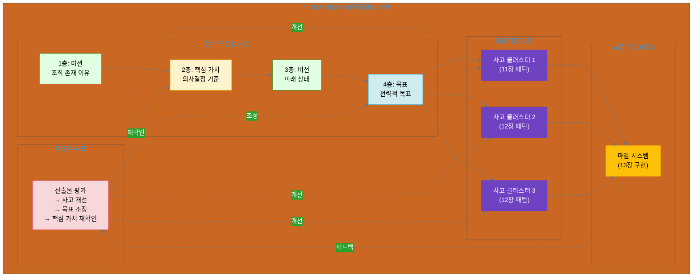

# 14장. 파일 기반 협업 실전 사례

**핵심 질문**: 사고 클러스터와 파일 시스템을 실제 프로젝트에 어떻게 적용할까?

---

## 도입

11-12장에서 우리는 **사고 클러스터**를 설계하는 방법을 배웠습니다. 단일 목표를 관리 가능한 사고 단위로 분해하고(11장), 복잡한 목표를 여러 사고 클러스터로 계층화하는(12장) 방법이었죠. 13장에서는 이러한 사고 클러스터의 결과물을 **파일 시스템으로 구현**하는 방법을 배웠습니다. 디렉토리 구조, 상태 추적, 산출물 표준화를 통해 사고를 영속적이고 공유 가능한 자산으로 만드는 방법이었습니다.

하지만 이론과 실전은 다릅니다. "디렉토리 구조 설계 원칙"을 안다고 해서 즉시 실무에 적용할 수 있을까요? "사고 상태 추적"의 개념을 이해한다고 해서 바로 프로젝트에 통합할 수 있을까요?

**14장에서는 11-13장에서 배운 모든 개념을 실제 프로젝트에 적용하는 3가지 완전한 사례를 다룹니다.** 각 사례는 AI 사고 생태계의 **6계층 전체**를 통합하여, 미션(1층)부터 파일 시스템(6층)까지의 완전한 흐름을 보여줍니다.

### 실전 사례가 중요한 이유

책으로 배운 개념을 실무에 적용할 때, 우리는 다음과 같은 질문들과 마주합니다:

**실전 질문들**:
- "11장의 단일 사고 클러스터 패턴을 내 프로젝트에 어떻게 적용하지?"
- "13.2의 디렉토리 구조 원칙을 실제로 어떻게 구현하지?"
- "thinking_state.json은 어떤 시점에 업데이트하지?"
- "사고 클러스터가 여러 개일 때는 어떻게 조율하지?"
- "피드백 루프를 실제로 어떻게 구현하지?"

**실전 사례의 가치**:
1. **구체성**: 추상적 개념이 구체적 코드와 파일로 변환됩니다.
2. **통합성**: 흩어진 개념들이 하나의 완전한 시스템으로 통합됩니다.
3. **재현성**: 사례를 그대로 따라하여 자신의 프로젝트를 만들 수 있습니다.
4. **확장성**: 기본 사례를 변형하여 더 복잡한 프로젝트로 확장할 수 있습니다.

### AI 사고 생태계와 14장의 위치

14장은 **Part 4의 종합편**입니다. 11-12-13장에서 배운 모든 개념을 실전에서 통합합니다.

```yaml
AI 사고 생태계 6계층 (report_kr.md):

전략 계층 (인간 주도):
  1층: 미션 - 조직의 존재 이유
  2층: 핵심 가치 - 의사결정 기준 ⭐
  3층: 비전 - 미래 상태
  4층: 목표 - 전략적 목표

사고 계층 (인간-AI 협업):
  5층: 사고 클러스터 ⭐
     - 11장: 단일 사고 클러스터 (기본)
     - 12장: 계층적 사고 클러스터 (고급)

실행 계층 (AI 가속):
  6층: 실행 항목 ⭐
     - 13장: 파일 시스템 구현 (이론)
     - 14장: 파일 기반 협업 (실전) ← 여기

피드백 루프:
  6층 → 5층 → 4층 → 2층
  - 14장: 실전 피드백 구현 방법
```

**14장의 핵심**: 6계층 전체를 실전에서 통합



### 11-12-13-14장의 관계

| 장 | 초점 | 핵심 질문 | 주요 개념 |
|---|------|----------|---------|
| **11장** | 5층 (사고 설계) | 하나의 목표를 어떻게 사고 단위로 분해할까? | 기본 사고 클러스터, 4가지 Stage |
| **12장** | 5층 (사고 조율) | 복잡한 목표를 어떻게 여러 사고로 분해할까? | 계층적 사고, 메타 조율자 |
| **13장** | 6층 (파일 구현) | 사고 결과를 어떻게 파일로 구현할까? | 디렉토리 구조, 상태 추적 |
| **14장** | 1-6층 (통합) | 전체 생태계를 실전에서 어떻게 통합할까? | 완전한 실전 사례, 6계층 통합 |

**연결 관계**:
```
11장 (사고 설계) + 13장 (파일 구현) = 14.1 사례 1 (콘텐츠 생성)
12장 (사고 조율) + 13장 (파일 구현) = 14.2-14.3 사례 2-3 (복잡한 프로젝트)
```

### 3가지 사례 개요

14장은 복잡도가 점진적으로 증가하는 3가지 실전 사례로 구성됩니다:

#### 사례 1: 마케팅 콘텐츠 생성 (단순 → 중간)

**프로젝트**: 블로그 포스트 발행 워크플로우
- **패턴**: 11장의 단일 사고 클러스터 + 13장의 파일 시스템
- **복잡도**: ⭐⭐☆☆☆ (입문)
- **핵심 가치**:
  - 6계층 전체 흐름 이해
  - 단일 사고 클러스터 + 파일 시스템 통합
  - 피드백 루프의 기본 구현

**다룰 내용**:
```yaml
1층: 미션 - "독자에게 가치 있는 콘텐츠 제공"
2층: 핵심 가치 - "정확성, 명료성, 독창성"
3층: 비전 - "매주 고품질 블로그 포스트 발행"
4층: 목표 - "AI 생산성 주제 포스트 3개 발행"
5층: 사고 클러스터 - "콘텐츠 생성 사고"
  - Stage 1: 아이디어 기획 (발산)
  - Stage 2: 핵심 가치 기반 선택 (수렴)
  - Stage 3: 초안 작성 (생성)
  - Stage 4: 품질 검증 (비판)
6층: 파일 시스템
  - /tasks/content-001/thinking/planning/ideas.json
  - /tasks/content-001/thinking/selection/selected.json
  - /tasks/content-001/drafts/draft_v1.md
  - /tasks/content-001/outputs/final.md
```

#### 사례 2: 고객 데이터 분석 (중간 → 고급)

**프로젝트**: 고객 세그먼트 분석 및 인사이트 도출
- **패턴**: 11장 패턴 × 2 (병렬) + 13장의 파일 시스템
- **복잡도**: ⭐⭐⭐☆☆ (중급)
- **핵심 가치**:
  - 여러 사고 클러스터의 병렬 실행
  - 사고 간 의존성 관리
  - 데이터 + 코드 통합 관리

**다룰 내용**:
```yaml
4층: 목표 - "3개 고객 세그먼트 분석 및 전략 수립"
5층: 사고 클러스터 (병렬)
  - TC-001: 데이터 수집 및 정제 사고
  - TC-002: 세그먼트 분석 사고
  - TC-003: 인사이트 도출 사고
6층: 파일 시스템 (복잡한 구조)
  - /tasks/analysis-001/data/raw/
  - /tasks/analysis-001/data/cleaned/
  - /tasks/analysis-001/thinking/tc-001/
  - /tasks/analysis-001/thinking/tc-002/
  - /tasks/analysis-001/thinking/tc-003/
  - /tasks/analysis-001/code/scripts/
  - /tasks/analysis-001/outputs/insights.json
```

#### 사례 3: 신제품 런칭 전략 (고급)

**프로젝트**: 신제품 런칭을 위한 통합 전략 수립
- **패턴**: 12장의 계층적 사고 클러스터 + 13장의 파일 시스템
- **복잡도**: ⭐⭐⭐⭐⭐ (고급)
- **핵심 가치**:
  - 계층적 사고 클러스터의 실전 구현
  - 메타 조율자의 파일 관리 역할
  - 복잡한 의존성 및 피드백 루프

**다룰 내용**:
```yaml
4층: 목표 - "Q4 신제품 런칭 성공 (매출 목표 $1M)"
5층: 계층적 사고 클러스터
  - 메타 조율자: 전체 전략 조율
  - TC-M1: 시장 조사 사고
  - TC-M2: 제품 포지셔닝 사고
  - TC-M3: 마케팅 전략 사고
  - TC-M4: 런칭 실행 계획 사고
6층: 파일 시스템 (다층 구조)
  - /projects/launch-q4/meta/coordination.json
  - /projects/launch-q4/thinking/tc-m1/
  - /projects/launch-q4/thinking/tc-m2/
  - /projects/launch-q4/thinking/tc-m3/
  - /projects/launch-q4/thinking/tc-m4/
  - /projects/launch-q4/dependencies.json
  - /projects/launch-q4/outputs/launch_plan.md
```

### 14장에서 다룰 내용

이 장은 4개의 섹션으로 구성됩니다:

**14.1 사례 1: 마케팅 콘텐츠 생성**
- 6계층 전체 설계 (미션 → 파일 시스템)
- 단일 사고 클러스터 (11장) + 파일 시스템 (13장)
- 4가지 Stage별 파일 구조 및 상태 추적
- 기본 피드백 루프 구현

**14.2 사례 2: 고객 데이터 분석**
- 병렬 사고 클러스터 조율
- 데이터 + 코드 통합 파일 구조
- 사고 간 의존성 관리 (dependencies.json)
- 복잡한 피드백 루프

**14.3 사례 3: 신제품 런칭 전략**
- 계층적 사고 클러스터 (12장) 실전 적용
- 메타 조율자의 파일 관리 역할
- 다층 디렉토리 구조 설계
- 통합 피드백 루프 (6층 → 5층 → 4층 → 2층)

**14.4 실전 적용 가이드**
- 3가지 사례에서 발견한 공통 패턴
- 프로젝트 복잡도별 적용 가이드
- 체크리스트: "내 프로젝트는 어느 사례에 가까운가?"
- 자주 하는 실수 및 해결책

### 학습 목표

이 장을 마치면 다음을 할 수 있습니다:

1. **6계층 통합**: AI 사고 생태계의 6계층을 실전 프로젝트에 완전히 통합할 수 있습니다. 미션(1층)부터 파일 시스템(6층)까지 일관된 시스템을 만들 수 있습니다.

2. **사례 선택**: 자신의 프로젝트 복잡도에 맞는 사례를 선택하여 참고할 수 있습니다. "이것은 사례 1 수준", "이것은 사례 3 수준"처럼 판단할 수 있습니다.

3. **파일 구조 설계**: 사고 클러스터의 복잡도에 맞는 디렉토리 구조를 설계할 수 있습니다. 단일, 병렬, 계층적 구조를 각각 구현할 수 있습니다.

4. **피드백 루프 구현**: 파일 시스템의 산출물이 사고 프로세스 개선으로 연결되는 실전 메커니즘을 구축할 수 있습니다.

5. **점진적 확장**: 간단한 사례 1부터 시작하여, 필요에 따라 사례 2, 사례 3으로 점진적으로 확장할 수 있습니다.

### 각 사례의 학습 전략

**사례 1 (필수)**: 모든 독자가 반드시 읽어야 합니다.
- 가장 기본적인 통합 패턴
- 6계층 전체 흐름의 완전한 이해
- 이후 사례의 기초

**사례 2 (권장)**: 복잡한 프로젝트를 다루는 독자에게 권장합니다.
- 병렬 사고 클러스터 조율 방법
- 데이터 중심 프로젝트 패턴
- 사고 간 의존성 관리

**사례 3 (선택)**: 고급 사용자 또는 대규모 프로젝트 담당자에게 권장합니다.
- 계층적 사고의 실전 구현
- 메타 조율자의 실제 역할
- 복잡한 다층 구조 설계

**14.4 (필수)**: 모든 독자가 반드시 읽어야 합니다.
- 3가지 사례의 공통 패턴 정리
- 자신의 프로젝트에 적용하기 위한 체크리스트
- 실수 방지 가이드

### 실전 연결: 15-16장 예고

14장에서 배운 실전 사례는 Part 4의 마무리 장들과 연결됩니다:

**15장: 프롬프트 엔지니어링** (이미 완료)
- 14장의 사례들에서 사용하는 프롬프트 설계
- 사고 클러스터별 프롬프트 전략

**16장: 에이전트 설계** (예정)
- 14장의 사례들을 에이전트로 구현
- 사고 클러스터를 에이전트 팀으로 변환

---

**이제 14.1로 넘어가 첫 번째 실전 사례를 살펴보겠습니다. 마케팅 콘텐츠 생성 프로젝트에서 6계층 전체를 어떻게 통합하는지 구체적으로 확인해봅시다.**
