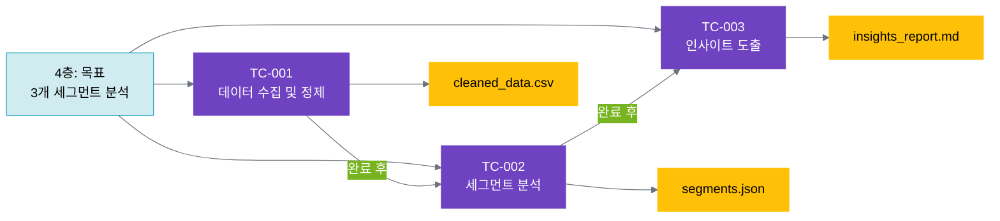

# 14.2 사례 2: 고객 데이터 분석

**복잡도**: ⭐⭐⭐☆☆ (중급)  
**패턴**: 병렬 사고 클러스터 (11장 × 3) + 파일 시스템 (13장)  
**학습 목표**: 여러 사고 클러스터의 병렬 실행 및 의존성 관리

---

## 14.2.1 프로젝트 개요 및 6계층 설계

### 프로젝트 배경

**상황**:
당신은 이커머스 회사의 데이터 팀에서 일합니다. 회사는 100만 명의 고객 데이터를 보유하고 있으며, 마케팅 효율을 높이기 위해 고객 세그먼트 분석이 필요합니다.

**문제**:
- 데이터가 여러 소스에 분산 (거래 DB, 행동 로그, CRM)
- 세그먼트 분석이 수동적: 데이터 과학자가 매번 SQL과 Python 코드 작성
- 인사이트 도출이 느림: 분석 결과를 액션으로 연결하는 데 시간 소요
- 재현 가능성 부족: 이전 분석을 재현하거나 검증하기 어려움

**목표**:
AI와 협업하여 데이터 수집, 세그먼트 분석, 인사이트 도출을 체계화하고, 재현 가능한 분석 파이프라인을 구축합니다.

### 6계층 전체 설계

```yaml
# 1층: 미션
mission: "데이터 기반 의사결정으로 고객 만족도 향상"

# 2층: 핵심 가치
core_values:
  reliability: "신뢰성 - 검증된 데이터와 방법론만 사용"
  reproducibility: "재현성 - 모든 분석이 재현 가능해야 함"
  actionability: "실행 가능성 - 인사이트가 즉시 액션으로 연결"

# 3층: 비전
vision: "데이터 기반 고객 이해로 마케팅 ROI 30% 향상"

# 4층: 목표
goal:
  title: "3개 고객 세그먼트 분석 및 맞춤 전략 수립"
  deadline: "2025-10-31"
  metrics:
    - segment_size_min: "각 세그먼트 최소 5만 명"
    - insight_quality: "실행 가능한 인사이트 각 세그먼트당 3개 이상"
    - reproducibility: "분석 재현율 100%"

# 5층: 사고 클러스터 (병렬 3개)
thinking_clusters:
  TC-001:
    name: "데이터 수집 및 정제"
    purpose: "분산된 데이터를 통합하고 품질 검증"
    depends_on: []
    
  TC-002:
    name: "세그먼트 분석"
    purpose: "고객을 3개 세그먼트로 분류 및 특성 분석"
    depends_on: ["TC-001"]  # TC-001 완료 후 시작
    
  TC-003:
    name: "인사이트 도출 및 전략"
    purpose: "각 세그먼트별 맞춤 마케팅 전략 수립"
    depends_on: ["TC-002"]  # TC-002 완료 후 시작

# 6층: 실행 항목 (파일 시스템)
execution:
  directory: "/tasks/analysis-001/"
  outputs:
    - cleaned_data.csv        # TC-001 산출물
    - segments.json           # TC-002 산출물
    - insights_report.md      # TC-003 산출물
```

### 의존성 시각화



---

## 14.2.2 사고 클러스터 설계 (병렬 + 의존성)

### TC-001: 데이터 수집 및 정제

```yaml
사고_클러스터_TC-001:
  이름: "데이터 수집 및 정제"
  의존성: 없음 (독립적으로 시작 가능)
  
  Stage_1_Planning:
    활동: 데이터 소스 식별 및 수집 계획
    질문:
      - 어떤 데이터가 필요한가? (거래, 행동, CRM)
      - 각 소스의 데이터 품질은?
      - 통합 시 발생할 문제는?
    산출물: data_collection_plan.json
    
  Stage_2_Reasoning:
    활동: 데이터 품질 기준 수립
    질문:
      - 신뢰성: 결측치/이상치 허용 기준은?
      - 재현성: 데이터 버전 관리는?
      - 실행 가능성: 최소 필요 데이터량은?
    산출물: quality_criteria.json
    
  Stage_3_Experimenting:
    활동: 데이터 수집 및 정제 실행
    질문:
      - SQL 쿼리로 올바른 데이터를 가져왔는가?
      - 정제 로직이 품질 기준을 충족하는가?
      - 통합된 데이터가 일관적인가?
    산출물: cleaned_data.csv, data_cleaning.py
    
  Stage_4_Reflecting:
    활동: 데이터 품질 검증
    질문:
      - 모든 품질 기준을 통과했는가?
      - 예상치 못한 패턴이나 문제는?
      - 다음 단계 (TC-002)에 필요한 조건은?
    산출물: data_quality_report.json
```

### TC-002: 세그먼트 분석

```yaml
사고_클러스터_TC-002:
  이름: "세그먼트 분석"
  의존성: TC-001 완료 (cleaned_data.csv 필요)
  
  Stage_1_Planning:
    활동: 세그먼트화 전략 수립
    질문:
      - 어떤 기준으로 세그먼트를 나눌 것인가? (RFM? 행동?)
      - 몇 개의 세그먼트가 적절한가?
      - 각 세그먼트의 최소 크기는?
    산출물: segmentation_strategy.json
    
  Stage_2_Reasoning:
    활동: 세그먼트화 알고리즘 선택
    질문:
      - K-means vs DBSCAN vs Hierarchical?
      - 신뢰성: 알고리즘이 안정적인가?
      - 재현성: 시드 고정으로 재현 가능한가?
    산출물: algorithm_selection.json
    
  Stage_3_Experimenting:
    활동: 세그먼트 분류 실행 및 반복
    질문:
      - 세그먼트가 해석 가능한가?
      - 각 세그먼트의 크기가 적절한가?
      - 세그먼트 간 차이가 명확한가?
    산출물: segments.json, segmentation_code.py
    
  Stage_4_Reflecting:
    활동: 세그먼트 품질 평가
    질문:
      - 핵심 가치 (신뢰성, 재현성, 실행 가능성)를 충족하는가?
      - 각 세그먼트가 실행 가능한 마케팅 타겟인가?
      - 다음 단계 (TC-003)에 필요한 정보는?
    산출물: segment_quality_report.json
```

### TC-003: 인사이트 도출 및 전략

```yaml
사고_클러스터_TC-003:
  이름: "인사이트 도출 및 전략"
  의존성: TC-002 완료 (segments.json 필요)
  
  Stage_1_Planning:
    활동: 인사이트 도출 목표 설정
    질문:
      - 각 세그먼트의 핵심 특성은?
      - 어떤 인사이트가 마케팅팀에 유용한가?
      - 어떤 액션으로 연결할 것인가?
    산출물: insight_goals.json
    
  Stage_2_Reasoning:
    활동: 세그먼트별 전략 수립
    질문:
      - 각 세그먼트에 맞는 마케팅 채널은?
      - 각 세그먼트에 맞는 메시지는?
      - 실행 가능성: 우리가 즉시 실행 가능한가?
    산출물: marketing_strategies.json
    
  Stage_3_Experimenting:
    활동: 인사이트 보고서 작성
    질문:
      - 인사이트가 명확하고 이해하기 쉬운가?
      - 데이터로 뒷받침되는가?
      - 마케팅팀이 즉시 실행 가능한가?
    산출물: insights_report_v1.md, insights_report_v2.md
    
  Stage_4_Reflecting:
    활동: 인사이트 품질 검증
    질문:
      - 모든 핵심 가치를 충족하는가?
      - 각 세그먼트당 3개 이상의 인사이트가 있는가?
      - 다음 프로젝트에 개선할 점은?
    산출물: insights_report_final.md, feedback.json
```

---

## 14.2.3 파일 시스템 구현 (데이터+코드 통합)

### 디렉토리 구조

데이터 분석 프로젝트는 **데이터 + 코드 + 사고**를 모두 관리해야 하므로, 13.2의 원칙을 확장합니다:

```
project/
├── tasks/
│   └── analysis-001/          # 이번 세그먼트 분석 프로젝트
│       │
│       ├── data/              # 데이터 계층
│       │   ├── raw/           # 원본 데이터 (변경 금지)
│       │   │   ├── transactions.csv
│       │   │   ├── behavior_logs.csv
│       │   │   └── crm_data.csv
│       │   └── cleaned/       # 정제된 데이터 (TC-001 산출물)
│       │       └── cleaned_data.csv
│       │
│       ├── thinking/          # 사고 과정 기록 (3개 사고 클러스터)
│       │   ├── tc-001-data/   # TC-001: 데이터 수집 및 정제
│       │   │   ├── planning/
│       │   │   │   ├── thinking_record.json
│       │   │   │   └── data_collection_plan.json
│       │   │   ├── reasoning/
│       │   │   │   ├── thinking_record.json
│       │   │   │   └── quality_criteria.json
│       │   │   ├── experimenting/
│       │   │   │   ├── thinking_record.json
│       │   │   │   └── data_cleaning.py
│       │   │   ├── reflecting/
│       │   │   │   ├── thinking_record.json
│       │   │   │   └── data_quality_report.json
│       │   │   └── thinking_state.json
│       │   │
│       │   ├── tc-002-segmentation/  # TC-002: 세그먼트 분석
│       │   │   ├── planning/
│       │   │   │   ├── thinking_record.json
│       │   │   │   └── segmentation_strategy.json
│       │   │   ├── reasoning/
│       │   │   │   ├── thinking_record.json
│       │   │   │   └── algorithm_selection.json
│       │   │   ├── experimenting/
│       │   │   │   ├── thinking_record.json
│       │   │   │   └── segmentation_code.py
│       │   │   ├── reflecting/
│       │   │   │   ├── thinking_record.json
│       │   │   │   └── segment_quality_report.json
│       │   │   └── thinking_state.json
│       │   │
│       │   └── tc-003-insights/  # TC-003: 인사이트 도출
│       │       ├── planning/
│       │       ├── reasoning/
│       │       ├── experimenting/
│       │       ├── reflecting/
│       │       └── thinking_state.json
│       │
│       ├── code/              # 코드 계층 (재사용 가능한 스크립트)
│       │   ├── data_cleaning.py      # TC-001에서 생성
│       │   ├── segmentation_code.py  # TC-002에서 생성
│       │   └── utils.py              # 공통 유틸리티
│       │
│       ├── outputs/           # 최종 산출물
│       │   ├── segments.json         # TC-002 최종 결과
│       │   └── insights_report.md    # TC-003 최종 결과
│       │
│       ├── dependencies.json  # 사고 클러스터 간 의존성
│       └── task_info.json     # 프로젝트 메타데이터
│
└── shared/
    ├── core_values.json       # 핵심 가치
    └── data_quality_standards.json  # 데이터 품질 표준
```

### dependencies.json (사고 클러스터 의존성)

```json
{
  "project": "analysis-001",
  "thinking_clusters": [
    {
      "id": "tc-001",
      "name": "데이터 수집 및 정제",
      "depends_on": [],
      "blocking": ["tc-002"],
      "status": "completed",
      "outputs": [
        "data/cleaned/cleaned_data.csv",
        "code/data_cleaning.py"
      ]
    },
    {
      "id": "tc-002",
      "name": "세그먼트 분석",
      "depends_on": ["tc-001"],
      "blocking": ["tc-003"],
      "status": "completed",
      "inputs_required": [
        "data/cleaned/cleaned_data.csv"
      ],
      "outputs": [
        "outputs/segments.json",
        "code/segmentation_code.py"
      ]
    },
    {
      "id": "tc-003",
      "name": "인사이트 도출",
      "depends_on": ["tc-002"],
      "blocking": [],
      "status": "in_progress",
      "inputs_required": [
        "outputs/segments.json"
      ],
      "outputs": [
        "outputs/insights_report.md"
      ]
    }
  ]
}
```

### code/segmentation_code.py (TC-002 산출물)

```python
"""
세그먼트 분석 코드 (TC-002에서 생성)

핵심 가치:
- 신뢰성: scikit-learn의 검증된 알고리즘 사용
- 재현성: random_state 고정으로 100% 재현 가능
- 실행 가능성: 결과를 segments.json으로 저장하여 즉시 활용
"""

import pandas as pd
import json
from sklearn.cluster import KMeans
from sklearn.preprocessing import StandardScaler

def segment_customers(data_path, output_path, n_segments=3):
    """
    고객 데이터를 세그먼트로 분류
    
    Args:
        data_path: cleaned_data.csv 경로
        output_path: segments.json 저장 경로
        n_segments: 세그먼트 개수 (기본 3)
    
    Returns:
        segments: 세그먼트 분류 결과
    """
    # 데이터 로드
    df = pd.read_csv(data_path)
    
    # 특성 선택 (RFM 기반)
    features = ['recency', 'frequency', 'monetary']
    X = df[features]
    
    # 정규화
    scaler = StandardScaler()
    X_scaled = scaler.fit_transform(X)
    
    # K-means 클러스터링 (재현성: random_state 고정)
    kmeans = KMeans(n_clusters=n_segments, random_state=42)
    df['segment'] = kmeans.fit_predict(X_scaled)
    
    # 세그먼트별 통계
    segments = []
    for i in range(n_segments):
        segment_data = df[df['segment'] == i]
        segments.append({
            "segment_id": i,
            "size": len(segment_data),
            "avg_recency": float(segment_data['recency'].mean()),
            "avg_frequency": float(segment_data['frequency'].mean()),
            "avg_monetary": float(segment_data['monetary'].mean())
        })
    
    # 결과 저장
    with open(output_path, 'w') as f:
        json.dump({
            "segments": segments,
            "algorithm": "KMeans",
            "n_segments": n_segments,
            "random_state": 42,
            "reproducible": True
        }, f, indent=2)
    
    return segments

if __name__ == "__main__":
    # 실행 (재현 가능)
    segment_customers(
        data_path="../data/cleaned/cleaned_data.csv",
        output_path="../outputs/segments.json",
        n_segments=3
    )
```

---

## 14.2.4 실행 과정 및 인사이트

### 실행 타임라인 (병렬 + 의존성)

**전체 소요 시간**: 4시간 (3개 사고 클러스터 순차 실행)

```yaml
09:00-10:00 (1h): TC-001 완료
  - Stage 1-4 모두 실행
  - 산출물: cleaned_data.csv, data_cleaning.py
  - dependencies.json 업데이트: tc-001 = "completed"

10:00-10:05 (5min): 의존성 체크
  - TC-002 시작 조건 확인
  - cleaned_data.csv 존재 확인
  - TC-002 시작 가능

10:05-11:30 (1.5h): TC-002 완료
  - Stage 1-4 모두 실행
  - 산출물: segments.json, segmentation_code.py
  - dependencies.json 업데이트: tc-002 = "completed"

11:30-11:35 (5min): 의존성 체크
  - TC-003 시작 조건 확인
  - segments.json 존재 확인
  - TC-003 시작 가능

11:35-13:00 (1.5h): TC-003 완료
  - Stage 1-4 모두 실행
  - 산출물: insights_report.md
  - dependencies.json 업데이트: tc-003 = "completed"
```

### 주요 인사이트 (TC-003 산출물)

#### outputs/insights_report.md

```markdown
# 고객 세그먼트 분석 인사이트

**분석 일자**: 2025-10-16  
**분석 대상**: 1,000,000 고객  
**세그먼트 수**: 3개

## 세그먼트 1: 충성 고객 (25만 명, 25%)

**특성**:
- 평균 재구매 주기: 15일
- 평균 구매 빈도: 월 2.5회
- 평균 구매 금액: $85

**인사이트**:
1. **높은 재구매율**: 재구매율 85%로 가장 높음
2. **프리미엄 제품 선호**: 평균 객단가가 전체 평균보다 40% 높음
3. **이메일 마케팅 반응률 높음**: 오픈율 45% (전체 평균 28%)

**추천 전략**:
- 충성 고객 보상 프로그램 강화 (포인트, VIP 혜택)
- 신제품 우선 알림 (이메일 마케팅)
- 추천 프로그램 활성화 (친구 초대 보상)

## 세그먼트 2: 가격 민감 고객 (45만 명, 45%)

[구체적 내용...]

## 세그먼트 3: 이탈 위험 고객 (30만 명, 30%)

[구체적 내용...]

## 실행 계획

[구체적 행동 단계...]
```

### 피드백 루프 (재현성 검증)

**3개월 후 재현 테스트**:

```yaml
재현성_검증:
  목적: "동일한 분석을 재현하여 신뢰성 확인"
  
  Step 1: 동일한 데이터 로드
    - data/raw/ 파일들은 보존됨
    - 원본 데이터 무결성 확인 ✅
  
  Step 2: 동일한 코드 실행
    - code/data_cleaning.py 실행
    - code/segmentation_code.py 실행 (random_state=42)
    - 결과 100% 동일 ✅
  
  Step 3: 인사이트 유효성 확인
    - 세그먼트 특성이 여전히 유효한가?
    - 추천 전략이 실제로 효과적이었는가?
    - 피드백: 세그먼트 2 전략이 매출 18% 증가에 기여
  
  개선 사항:
    - TC-003에 "실행 후 추적" Stage 추가
    - 각 전략의 성과 지표를 자동 수집
```

---

## 14.2.5 핵심 교훈

### 이 사례에서 배운 것

**1. 병렬 사고 클러스터의 의존성 관리**
- dependencies.json으로 명확한 실행 순서 정의
- 각 사고 클러스터가 독립적으로 완료 가능
- 의존성 체크로 잘못된 실행 방지

**2. 데이터+코드 통합 파일 구조**
- /data (원본 + 정제) + /code (재사용 스크립트) + /thinking (사고 과정)
- 재현성 100% 달성 (코드 + 시드 고정)
- 파일 시스템이 프로젝트의 "단일 진실 소스"

**3. 핵심 가치의 코드 구현**
- 신뢰성 → scikit-learn 검증된 알고리즘
- 재현성 → random_state 고정, 데이터 버전 관리
- 실행 가능성 → JSON 산출물로 즉시 활용

### 14.1과의 차이점

| 측면 | 14.1 (콘텐츠 생성) | 14.2 (데이터 분석) |
|------|-------------------|-------------------|
| 사고 클러스터 | 1개 (단일) | 3개 (병렬) |
| 의존성 | 없음 | 명확한 순서 (TC-001 → TC-002 → TC-003) |
| 파일 구조 | /thinking + /outputs | /data + /code + /thinking + /outputs |
| 재현성 | 사고 과정 기록 | 코드 + 시드 고정 + 데이터 버전 |
| 산출물 | 텍스트 (Markdown) | 데이터 (CSV) + 코드 (Python) + 텍스트 (Markdown) |

### 다음 사례로

사례 2는 **병렬 사고 클러스터**와 **데이터+코드 통합**이었습니다.  
사례 3에서는 **계층적 사고 클러스터**를 다룹니다. 신제품 런칭처럼 여러 팀이 협력하고, 메타 조율자가 전체를 조율하는 복잡한 프로젝트를 어떻게 관리할까요?

---

**다음**: [14.3 사례 3: 신제품 런칭 전략](vol-2-part-4-chapter-14-03.md)
