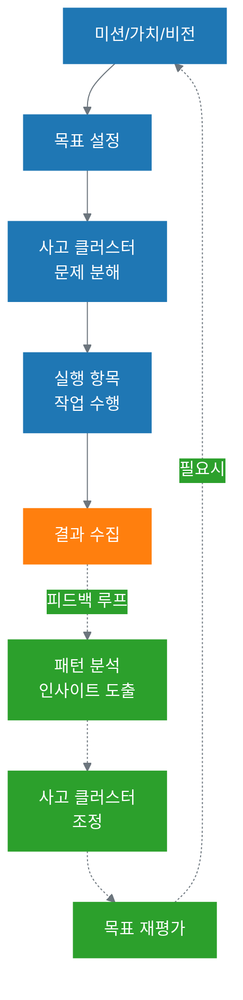
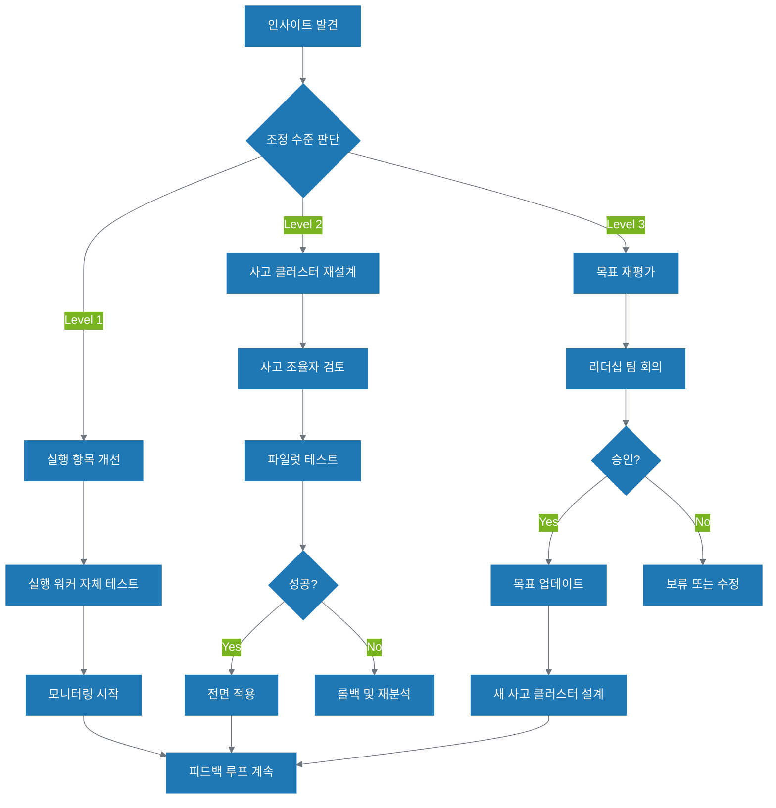

# 15장. 피드백 루프와 지속적 학습

**Part 5: 시스템 확장과 운영**

**난이도**: ⭐⭐⭐⭐ (심화)

**목적:** AI 사고 생태계의 핵심 메커니즘인 피드백 루프를 이해하고, 실행 결과를 사고와 전략으로 되돌려 지속적으로 학습하고 개선하는 조직을 만드는 방법을 배웁니다.

### 이 장에서 배우는 것
- AI 사고 생태계의 완성: 실행 → 사고 → 전략으로의 피드백 루프
- 피드백 루프의 3단계: 결과 수집, 패턴 분석, 조정
- 목표 충돌 해결: 상충, 중복, 의존성 관리
- 학습하는 조직 구축: 피드백 문화와 지속적 개선
- 시스템 진화 전략: 조직 성장과 기술 발전 대응

---

## 들어가며: AI 사고 생태계의 완성

2권 서문에서 소개한 **AI 사고 생태계 6계층 구조**를 기억하시나요?

```
미션 (Mission)
  ↓
핵심 가치 (Core Values)
  ↓
비전 (Vision)
  ↓
목표 (Goals)
  ↓
사고 클러스터 (Thinking Clusters)
  ↓
실행 항목 (Execution Items)
```

11-14장을 통해 우리는 목표를 사고 클러스터로 분해하고(11-12장), 실행 항목을 효과적으로 지원하며(13장), 사고 워크플로우를 명확히 정의하는(14장) 방법을 배웠습니다. 이제 이 구조를 완성하는 마지막 퍼즐 조각, **피드백 루프(Feedback Loop)**를 살펴볼 차례입니다.

### 피드백 루프: 학습하는 조직의 핵심

피드백 루프는 실행 항목의 결과를 다시 사고 클러스터로, 나아가 목표와 전략으로 되돌리는 메커니즘입니다. 이것이 없다면 우리의 AI 사고 생태계는 단순히 "계획하고 실행하는" 일회성 시스템에 불과합니다. 피드백 루프가 있어야 비로소 **"실행 → 학습 → 개선"의 선순환**이 만들어지고, 조직은 경험으로부터 배우며 지속적으로 진화할 수 있습니다.



### 피드백 루프가 해결하는 세 가지 핵심 과제

이 장에서는 피드백 루프를 통해 다음 세 가지 핵심 과제를 해결하는 방법을 배웁니다:

1. **지속적 개선**: 실행 결과를 체계적으로 수집하고 분석하여, 사고 프로세스를 개선합니다.
2. **목표 충돌 해결**: 서로 상충하거나, 중복되거나, 의존적인 목표들을 조기에 발견하고 조정합니다.
3. **조직 진화**: 조직의 성장과 기술의 발전에 맞춰 시스템 전체를 진화시킵니다.

이것이 바로 **2권이 1권과 차별화되는 핵심**입니다. 1권에서는 개인이 AI와 효과적으로 협업하는 방법을 배웠다면, 2권에서는 조직 전체가 **사고 중심으로 움직이며 지속적으로 학습하는 시스템**을 만드는 방법을 배우는 것입니다.

---

## 15.1 피드백 루프의 3단계

피드백 루프는 **결과 수집 → 패턴 분석 → 조정**의 3단계로 이루어집니다. 각 단계에서 인간과 AI는 각기 다른 역할을 수행하며 협력합니다.

### 15.1.1 1단계: 결과 수집 및 측정

첫 번째 단계는 실행 항목의 결과를 체계적으로 수집하고 측정하는 것입니다. 단순히 "일이 끝났다"고 기록하는 것을 넘어, **성공과 실패의 구체적인 지표**를 수집해야 합니다.

#### 수집해야 할 데이터

**1. 정량적 지표 (Quantitative Metrics)**
- **성과 지표**: 완료율, 정확도, 처리 시간, 비용
- **품질 지표**: 오류율, 재작업비율, 폐기율
- **효율성 지표**: 리소스 사용량, API 호출 횟수, 토큰 소비

**2. 정성적 피드백 (Qualitative Feedback)**
- **사용자 평가**: 만족도, 불만 사항, 개선 요청
- **팀 피드백**: 사고 프로세스의 적절성, 협업의 원활함
- **예외 상황**: 예상치 못한 문제, 엣지 케이스

**3. 컨텍스트 정보 (Context Information)**
- **실행 환경**: 언제, 누가, 어떤 상황에서
- **입력 데이터**: 어떤 데이터를 받았는가
- **의사결정 지점**: Human-in-the-Loop에서 인간의 개입이 있었는가

#### 수집 방법 및 도구

```yaml
# 결과 수집 설정 예시
result_collection:
  metrics:
    - name: "완료율"
      type: "percentage"
      threshold: 95
    
    - name: "평균 처리시간"
      type: "duration"
      target: "< 5분"
    
    - name: "사용자 만족도"
      type: "rating"
      scale: "1-5"
  
  feedback_channels:
    - "사용자 설문"
    - "팀 회고 미팅"
    - "자동 로그 분석"
  
  logging:
    level: "detailed"
    include_context: true
    retention: "90일"
```

**추천 도구**:
- **로그 수집**: Elasticsearch, Splunk, CloudWatch
- **메트릭 추적**: Datadog, Prometheus, Grafana
- **사용자 피드백**: Slack 통합, 설문 도구, 내부 티켓 시스템

#### 사례: 콘텐츠 생성 파이프라인

11장에서 다룬 "소셜 미디어 콘텐츠 발행" 사고 클러스터의 결과 수집 예시:

```markdown
주간 결과 보고 (Week 23)

정량 지표:
- 발행된 제품: 25개 (목표: 20개) ✅
- 평균 생성 시간: 4.2분 (목표: 5분) ✅
- 재작업률: 12% (목표: 15%) ✅
- 비용: $127 (예산: $150) ✅

정성 피드백:
- 좋았던 점:
  * 이미지 선택이 브랜드 가이드에 잘 맞음
  * 해시태그 제안이 트렌드에 적절

- 개선 필요:
  * 커피가 너무 길어 편집에 시간 소요
  * 제품 설명이 특정 타겟층에게는 어렵다는 피드백

예외 상황:
- 3건: 제품 링크 오류 (API 문제)
- 1건: 이미지 라이선스 확인 필요
```

이러한 데이터는 다음 단계인 패턴 분석의 기초가 됩니다.

### 15.1.2 2단계: 패턴 분석 및 인사이트 도출

수집된 데이터에서 의미있는 패턴을 발견하고 인사이트를 도출하는 단계입니다. 여기서 **AI와 인간의 협업**이 빛을 발합니다.

#### AI의 역할: 패턴 인식

AI는 대량의 데이터에서 패턴을 발견하는 데 훌륭합니다:

**1. 통계적 패턴**
- **상관관계**: "특정 제품 유형에서 재작업률이 높다"
- **시간별 추세**: "주말에 생성된 콘텐츠의 품질이 낮다"
- **이상치 탐지**: "어제 갑자기 오류율이 3배 증가했다"

**2. 의미론적 패턴**
- **피드백 분류**: "불만 사항의 70%가 '너무 길다'와 관련"
- **키워드 추출**: "사용자들이 자주 언급하는 단어: '어려움', '불명확'"
- **감정 분석**: "평균 감정 점수가 -0.3 (약간 부정적)"

**3. 예측 모델링**
- **실패 예측**: "이 유형의 입력은 80% 확률로 재작업 필요"
- **병목 현상**: "이 사고 클러스터가 점점 느려지고 있다"

```python
# AI를 활용한 패턴 분석 예시
import pandas as pd
from sklearn.cluster import KMeans

# 데이터 로드
results_df = load_execution_results()

# 패턴 1: 재작업이 많은 콘텐츠 유형 파악
high_rework = results_df[results_df['rework_rate'] > 0.2]
pattern_1 = high_rework.groupby('content_type').size()

print(f"재작업이 많은 유형: {pattern_1.nlargest(3)}")
# 출력: "제품 비교" (32건), "기술 리뷰" (28건)

# 패턴 2: 시간대별 품질 분석
results_df['hour'] = pd.to_datetime(results_df['created_at']).dt.hour
quality_by_hour = results_df.groupby('hour')['quality_score'].mean()

print(f"가장 품질이 낮은 시간대: {quality_by_hour.nsmallest(3)}")
# 출력: 22시 (3.2), 23시 (3.1), 21시 (3.4)
```

#### 인간의 역할: 의미 해석

AI가 발견한 패턴에 **비즈니스 맥락과 의미**를 부여하는 것은 인간의 몫입니다:

**1. 인과관계 파악**
```markdown
AI 분석: "주말 콘텐츠의 품질이 낮다"

인간 해석:
- 주말에 생성된 콘텐츠는 월요일 매니저 검토 없이 발행됨
- 대응: 주말 생성 콘텐츠는 월요일 아침에 최종 검토 단계 추가
```

**2. 비즈니스 영향 평가**
```markdown
AI 분석: "제품 비교 콘텐츠의 재작업률 32%"

인간 해석:
- 제품 비교는 구매 전환율이 가장 높은 콘텐츠 (비즈니스 핵심)
- 현재 품질 문제로 인한 예상 손실: 월 $45K
- 대응: 최우선 개선 필요 → 사고 클러스터 재설계
```

**3. 개선 기회 발견**
```markdown
AI 분석: "일부 제품에서 사용자 만족도 4.8/5.0"

인간 해석:
- 해당 제품들의 공통점 분석
- 발견: "고객 사례"가 포함된 콘텐츠
- 기회: 모든 콘텐츠에 사례 추가 패턴 확산 → 새로운 사고 패턴
```

#### 인사이트 보고서 예시

```markdown
# 월간 피드백 분석 보고서 (2025년 3월)

## 핵심 인사이트

### 1. 제품 비교 콘텐츠 품질 문제 ⚠️
- **패턴**: 재작업률 32% (평균대비 2.1배)
- **원인**: 사고 조율자가 기술 사양을 충분히 분석하지 못함
- **비즈니스 영향**: 월 $45K 손실 추정
- **권장 조치**: 사고 클러스터 재설계 (제품 분석 단계 추가)

### 2. 고객 사례 포함 시 품질 향상 ⭐
- **패턴**: 사례 포함 콘텐츠 만족도 4.8/5.0 (vs 평균 4.1)
- **기회**: 모든 콘텐츠에 사례 추가 패턴 확산
- **예상 효과**: 전체 만족도 +0.7점 상승
- **행동 아이템**: 사례 데이터베이스 구축 및 사고 클러스터에 통합

### 3. 주말 생성 콘텐츠 품질 하락
- **패턴**: 주말 품질 점수 3.6/5.0 (vs 평일 4.2)
- **원인**: 월요일 검토 없이 자동 발행
- **조치**: 주말 생성 콘텐츠 월요일 검토 단계 추가

## 다음 단계
1. 제품 비교 사고 클러스터 재설계 (우선순위 1)
2. 사례 데이터베이스 구축 (우선순위 2)
3. 주말 워크플로우 개선 (우선순위 3)
```

이러한 인사이트는 다음 단계인 조정의 기초가 됩니다.

### 15.1.3 3단계: 사고 클러스터 및 목표 조정

분석에서 도출된 인사이트를 바탕으로 실제로 **시스템을 개선**하는 단계입니다. AI 사고 생태계의 여러 계층에서 조정이 일어날 수 있습니다.

#### 조정의 3가지 수준

**수준 1: 실행 항목 개선 (가장 빈번함)**
- **무엇을**: 개별 작업의 효율성, 품질 개선
- **예시**: 
  - 프롬프트 개선 ("300자 이내" → "200-250자")
  - 도구 파라미터 조정
  - 검증 규칙 강화

```yaml
# 제품 비교 콘텐츠 생성 실행 항목 개선
execution_item:
  name: "제품 비교 분석"
  
  # 기존
  old_prompt: |
    두 제품을 비교하세요.
    기능, 가격, 사양을 표로 정리하세요.
  
  # 개선 (15.1.2 분석 반영)
  new_prompt: |
    두 제품을 체계적으로 비교 분석하세요.
    
    1단계: 기술 사양 수집
    - CPU, RAM, 저장용량 등 주요 사양 추출
    - 명시되지 않은 사양은 "미제공"으로 표시
    
    2단계: 비교 표 작성
    - 각 항목별로 명확한 차이점 표시
    - 설명은 기술 비전문가도 이해하기 쉽게
    
    3단계: 결론 및 추천
    - 사용 목적별 추천 (예: 게임용 vs 업무용)
```

**수준 2: 사고 클러스터 재설계 (중간 빈도)**
- **무엇을**: 사고 프로세스 자체를 변경
- **예시**:
  - 사고 단계 추가/제거
  - 사고 조율자의 역할 분리
  - Human-in-the-Loop 지점 조정

```markdown
기존 사고 흐름:
1. 키워드 분석
2. 커피 생성
3. 이미지 선택
4. 최종 검토

개선된 사고 흐름 (제품 비교 전용):
1. 키워드 분석
2. **제품 사양 수집 (신규)** ← 15.1.2 인사이트 반영
3. **사양 비교 표 작성 (신규)**
4. 커피 생성
5. 이미지 선택
6. **사례 추가 (신규)** ← 15.1.2 인사이트 반영
7. 최종 검토
```

**수준 3: 목표 재평가 (드물지만 중요)**
- **무엇을**: 목표 자체의 타당성, 우선순위 재평가
- **예시**:
  - 목표 수정 ("20개/주" → "25개/주")
  - 목표 추가 ("고객 사례 데이터베이스 구축" 신규 목표)
  - 목표 통합 (중복 목표 발견 시)

```yaml
# 목표 조정 예시
goal_adjustment:
  trigger: "15.1.2 분석에서 사례 포함 콘텐츠 효과 발견"
  
  new_goal:
    name: "고객 사례 데이터베이스 구축"
    rationale: "사례가 있는 콘텐츠의 만족도가 17% 높음"
    target: "100개 사례 수집 (3개월 내)"
    dependencies: 
      - "고객 팀과 협업"
      - "법적 검토 필요"
  
  existing_goal_update:
    name: "콘텐츠 생성 자동화"
    change: "모든 콘텐츠에 사례 포함 패턴 추가"
```

#### 조정 의사결정 프로세스

모든 조정은 명확한 근거와 승인 프로세스를 거쳐야 합니다:



#### 조정 사례: 제품 비교 콘텐츠 개선

15.1.2에서 분석한 "제품 비교 콘텐츠 품질 문제"에 대한 조정 사례:

**1단계: 실행 항목 개선 (Week 1)**
```markdown
변경 내용:
- 프롬프트에 사양 분석 단계 추가
- 기술 비전문가 언어 지침 강화

결과:
- 재작업률: 32% → 24% (현저한 개선)
- 하지만 여전히 평균(15%)보다 높음 → 더 깊은 개선 필요
```

**2단계: 사고 클러스터 재설계 (Week 2-3)**
```markdown
변경 내용:
- 사고 단계 추가: 사양 수집 → 비교 표 작성
- 사고 조율자의 역할 분리:
  * 워커 A: 제품 사양 수집 전문
  * 워커 B: 비교 분석 전문
  * 워커 C: 커피 작성

파일럿 결과 (50건):
- 재작업률: 24% → 12% (50% 감소 ✅)
- 비용: +15% 증가 (단계 추가로 인한)
- 사용자 만족도: 4.1 → 4.5 (+0.4)

결정: 전면 적용 승인 ✅
```

**3단계: 새로운 목표 추가 (Week 4)**
```markdown
변경 내용:
- 새 목표: "고객 사례 데이터베이스 구축"
- 근거: 15.1.2 분석에서 사례 효과 확인

새 사고 클러스터 설계:
- 사고 조율자: 사례 매칭 전문가
- 실행 워커:
  * 사례 수집기 (고객팀 협업)
  * 사례 필터링 (관련성 평가)
  * 사례 통합 (콘텐츠에 삽입)
```

#### 피드백 루프의 순환

조정이 완료되면, 다시 15.1.1로 돌아가 새로운 결과를 수집합니다. 이것이 **지속적 학습과 개선의 선순환**입니다.

```
결과 수집 (Week 1-2)
    ↓
패턴 분석 (Week 3)
    ↓
조정 (Week 4-5)
    ↓
새로운 결과 수집 (Week 6-7)
    ↓
새로운 패턴 분석 (Week 8)
    ↓
추가 조정 (Week 9)
    ↓
... (지속적 순환)
```

이렇게 **피드백 루프의 3단계**를 통해 AI 사고 생태계는 경험으로부터 학습하고 지속적으로 진화합니다. 다음 절에서는 피드백 루프가 해결하는 또 다른 중요한 문제인 **목표 충돌**을 다룹니다.

---

## 15.2 목표 충돌 해결

(다음 세션에서 작성 예정)

---

## 실습 체크리스트
> 참고: 심화 과제는 [실습 과제 모음](practice-guide.md)을 참고하세요.

### 이 장을 완료하셨다면 다음을 확인하세요:
- [ ] 피드백 루프의 3단계(결과 수집, 패턴 분석, 조정)를 설명할 수 있다
- [ ] AI와 인간의 역할 분담을 이해하고 적용할 수 있다
- [ ] 조정의 3가지 수준(실행 항목, 사고 클러스터, 목표)을 구분할 수 있다
- [ ] 실제 사례에 피드백 루프를 적용할 수 있다

### 실습 과제
1. 현재 운영 중인 사고 클러스터에서 결과 수집 체계를 설계하세요.
2. 수집된 데이터를 분석하여 최소 3가지 인사이트를 도출하세요.
3. 도출된 인사이트를 바탕으로 구체적인 조정 계획을 수립하세요.

## 참고 자료

- Senge, P. M. (2006). The fifth discipline: The art and practice of the learning organization. Broadway Business.
- Deming, W. E. (2000). Out of the Crisis. MIT Press.
- Kim, D. H. (1993). The link between individual and organizational learning. MIT Sloan Management Review.
