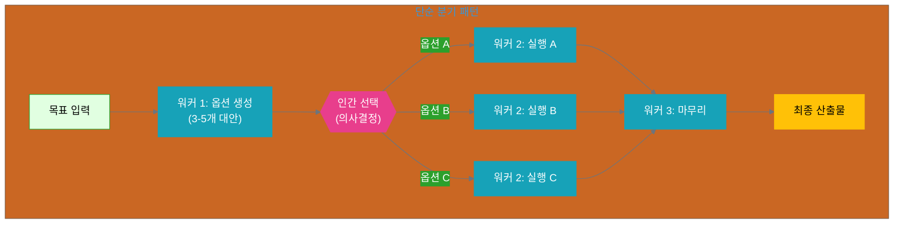
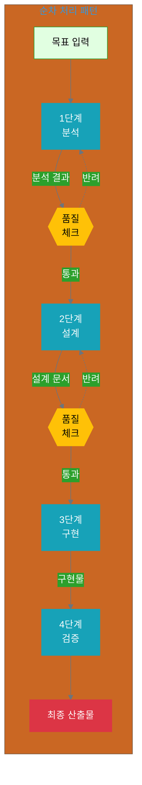
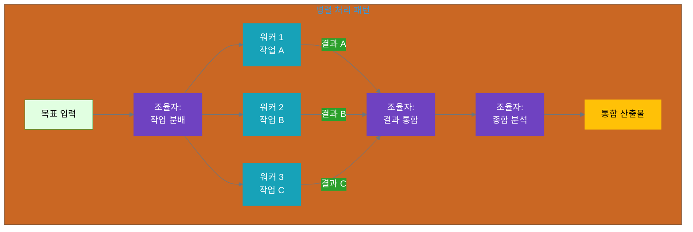

## 11.2 기본 설계 패턴

사고 클러스터를 설계할 때 자주 사용되는 3가지 기본 패턴이 있습니다. 각 패턴은 특정 유형의 목표에 적합하며, 실제 상황에서는 이들을 조합하여 사용할 수 있습니다.

### 11.2.1 단순 분기 패턴 (Simple Branching)

**정의**

단순 분기 패턴은 초기 단계에서 여러 옵션을 생성하고, 인간이 하나를 선택한 후 나머지 프로세스를 진행하는 패턴입니다.

**사용 시나리오**:
- 창의적 방향성 결정이 필요할 때
- 여러 대안 중 선택이 필요할 때
- 초기 결정이 전체 프로세스에 큰 영향을 미칠 때

**구조 다이어그램**:



**YAML 구조**:

```yaml
thinking_cluster:
  name: "단순 분기 패턴"
  pattern: "simple_branching"
  
  stages:
    - stage: 1
      name: "옵션 생성"
      worker: "generation_worker"
      action: "여러 대안 제시"
      output:
        type: "list"
        count: "3-5개"
        format: "각 옵션의 장단점 포함"
    
    - stage: 2
      name: "인간 선택"
      decision_maker: "human"
      criteria:
        - "전략적 적합성"
        - "리소스 제약"
        - "위험도 평가"
      output: "선택된 옵션 1개"
    
    - stage: 3
      name: "선택된 방향 실행"
      worker: "execution_worker"
      input: "선택된 옵션"
      action: "구체적 실행"
    
    - stage: 4
      name: "마무리"
      worker: "finalization_worker"
      action: "품질 검증 및 완성"
```

**적용 예시: 마케팅 캠페인 주제 선정**

```yaml
goal: "Q4 마케팅 캠페인 주제 결정"

stage_1_옵션_생성:
  worker: "campaign_ideation_worker"
  output:
    - option_A:
        theme: "고객 성공 스토리"
        pros: ["신뢰도 구축", "실제 사례 기반"]
        cons: ["고객 협조 필요", "시간 소요"]
    - option_B:
        theme: "제품 혁신 스토리"
        pros: ["차별화 강조", "내부 리소스만 필요"]
        cons: ["경쟁사와 유사 가능성"]
    - option_C:
        theme: "업계 트렌드 리포트"
        pros: ["사고 리더십 확립", "광범위한 타겟"]
        cons: ["리서치 필요", "경쟁 심화"]

stage_2_인간_선택:
  decision: "option_B (제품 혁신 스토리)"
  rationale: "Q4 신제품 출시와 타이밍 일치"

stage_3_실행:
  worker: "content_creation_worker"
  focus: "제품 혁신 스토리 콘텐츠 제작"
```

**가이드라인**:

1. **옵션 개수**: 3-5개가 적정 (너무 많으면 선택 피로)
2. **선택 기준 명시**: 의사결정 기준을 명확히 문서화
3. **옵션 품질**: 각 옵션이 실행 가능해야 함
4. **선택 후 일관성**: 선택 후 해당 방향으로 일관되게 진행

---

### 11.2.2 순차 처리 패턴 (Sequential Processing)

**정의**

순차 처리 패턴은 각 단계가 이전 단계의 산출물을 입력으로 받아 순차적으로 진행되는 파이프라인 구조입니다.

**사용 시나리오**:
- 각 단계가 명확히 구분될 때
- 이전 단계의 완료가 다음 단계의 전제조건일 때
- 품질 게이트가 필요할 때

**구조 다이어그램**:



**YAML 구조**:

```yaml
thinking_cluster:
  name: "순차 처리 패턴"
  pattern: "sequential_processing"
  
  pipeline:
    - stage: 1
      name: "분석"
      worker: "analysis_worker"
      input: "원본 데이터 / 요구사항"
      output: "분석 리포트"
      quality_gate:
        enabled: true
        criteria: ["완전성", "정확성"]
        approval_required: false
    
    - stage: 2
      name: "설계"
      worker: "design_worker"
      input: "분석 리포트"
      output: "설계 문서"
      quality_gate:
        enabled: true
        criteria: ["실행 가능성", "명확성"]
        approval_required: true  # 인간 승인 필요
    
    - stage: 3
      name: "구현"
      worker: "implementation_worker"
      input: "설계 문서"
      output: "구현물 (초안)"
      quality_gate:
        enabled: false
    
    - stage: 4
      name: "검증"
      worker: "verification_worker"
      input: "구현물 (초안)"
      output: "최종 산출물"
      quality_gate:
        enabled: true
        criteria: ["요구사항 충족", "품질 기준"]
        approval_required: true
```

**적용 예시: 데이터 분석 리포트 작성**

```yaml
goal: "고객 이탈 분석 리포트 작성"

pipeline:
  stage_1_데이터_분석:
    worker: "data_analyst_worker"
    input: "고객 데이터 (6개월)"
    actions:
      - "이탈율 계산"
      - "세그먼트별 분석"
      - "패턴 탐지"
    output:
      - "이탈율: 12.5%"
      - "고위험 세그먼트: 신규 고객 (30일 미만)"
      - "주요 패턴: 첫 구매 후 30일 내 재구매 없으면 80% 이탈"
    quality_check: "✅ 통과"
  
  stage_2_인사이트_도출:
    worker: "insight_worker"
    input: "데이터 분석 결과"
    actions:
      - "핵심 인사이트 3개 도출"
      - "액션 아이템 제안"
    output:
      - insight_1: "온보딩 강화 필요"
      - insight_2: "30일 리마인더 캠페인 효과적"
      - insight_3: "첫 구매 할인이 재구매에 역효과"
    quality_check: "✅ 인간 승인 (전략팀장)"
  
  stage_3_리포트_작성:
    worker: "report_writer_worker"
    input: "인사이트 + 액션 아이템"
    actions:
      - "경영진용 요약 작성"
      - "시각화 (차트 3개)"
      - "권장 사항 정리"
    output: "15페이지 리포트 (초안)"
  
  stage_4_최종_검토:
    worker: "review_worker"
    input: "리포트 초안"
    actions:
      - "데이터 정확성 재확인"
      - "메시지 일관성 검증"
      - "오타 및 포맷 교정"
    output: "최종 리포트"
    quality_check: "✅ 통과"
```

**가이드라인**:

1. **명확한 단계 구분**: 각 단계의 시작/종료가 명확해야 함
2. **품질 게이트**: 중요한 단계 후 품질 체크 포인트 설정
3. **반려 처리**: 품질 미달 시 이전 단계로 되돌리기
4. **의존성 관리**: 각 단계가 이전 단계 완료에 의존함을 명시

---

### 11.2.3 병렬 처리 패턴 (Parallel Processing)

**정의**

병렬 처리 패턴은 독립적인 여러 작업을 동시에 수행한 후 결과를 통합하는 구조입니다.

**사용 시나리오**:
- 독립적으로 수행 가능한 작업들이 있을 때
- 시간 효율이 중요할 때
- 여러 관점의 분석이 필요할 때

**구조 다이어그램**:



**YAML 구조**:

```yaml
thinking_cluster:
  name: "병렬 처리 패턴"
  pattern: "parallel_processing"
  
  stages:
    - stage: 0
      name: "작업 분배"
      actor: "coordinator"
      action: "독립적 작업 식별 및 분배"
    
    - stage: 1
      name: "병렬 실행"
      parallel_workers:
        - worker_A:
            task: "작업 A"
            independent: true
            output: "결과 A"
        - worker_B:
            task: "작업 B"
            independent: true
            output: "결과 B"
        - worker_C:
            task: "작업 C"
            independent: true
            output: "결과 C"
      
      synchronization:
        wait_for: "all"  # 모든 워커 완료 대기
        timeout: "30분"
    
    - stage: 2
      name: "결과 통합"
      actor: "coordinator"
      inputs: ["결과 A", "결과 B", "결과 C"]
      action: "결과 조합 및 일관성 확인"
    
    - stage: 3
      name: "종합 분석"
      actor: "coordinator"
      action: "통합 인사이트 도출"
      output: "최종 산출물"
```

**적용 예시: 경쟁사 분석**

```yaml
goal: "주요 경쟁사 3사 비교 분석"

stage_0_작업_분배:
  coordinator_decision:
    - "각 경쟁사를 독립 워커에게 할당"
    - "분석 관점 동일하게 적용"

stage_1_병렬_분석:
  worker_A_경쟁사_1:
    company: "Company X"
    analysis:
      - "제품 특징 (3개)"
      - "가격 전략"
      - "마케팅 채널"
      - "고객 리뷰 요약"
    output: "Company X 분석 리포트"
  
  worker_B_경쟁사_2:
    company: "Company Y"
    analysis:
      - "제품 특징 (3개)"
      - "가격 전략"
      - "마케팅 채널"
      - "고객 리뷰 요약"
    output: "Company Y 분석 리포트"
  
  worker_C_경쟁사_3:
    company: "Company Z"
    analysis:
      - "제품 특징 (3개)"
      - "가격 전략"
      - "마케팅 채널"
      - "고객 리뷰 요약"
    output: "Company Z 분석 리포트"

stage_2_결과_통합:
  coordinator_action:
    - "3개 리포트를 비교 테이블로 정리"
    - "일관성 확인 (같은 기준 적용 여부)"
  output: "경쟁사 비교 매트릭스"

stage_3_종합_분석:
  coordinator_insights:
    - "우리의 강점: X"
    - "시장 기회: Y"
    - "개선 영역: Z"
  output: "경쟁 전략 권장사항"
```

**가이드라인**:

1. **독립성 확인**: 병렬 작업들이 서로 의존하지 않는지 확인
2. **동기화 전략**: 모든 작업 완료를 기다릴지, 부분 결과로 진행할지 결정
3. **통합 방법**: 결과를 어떻게 조합할지 미리 정의
4. **일관성**: 병렬 워커들에게 동일한 기준/포맷 적용

---