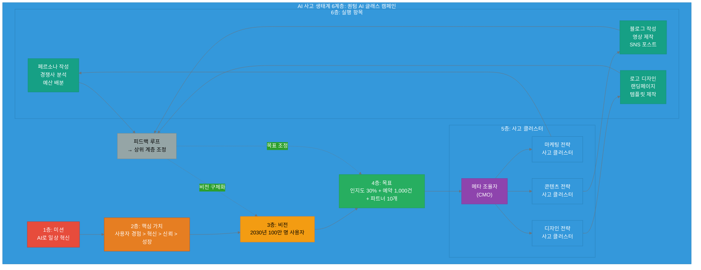

## 12.5 실전 사례: 복합 캠페인

이제 배운 모든 개념을 종합하여 실제 복합 캠페인을 처음부터 끝까지 설계하고 실행해 보겠습니다. 이 사례는 **report_kr.md의 AI 사고 생태계 6계층 모델을 완전히 통합**합니다.

### 12.5.1 프로젝트 배경 및 6계층 정의

**배경**:
AI 웨어러블 스타트업 "QuantumWear"가 신제품 **'퀀텀 AI 글래스'**를 출시합니다. 이 제품은 실시간 번역, AR 내비게이션, 스마트 비서 기능을 탑재한 차세대 AR 안경입니다. 8주 안에 성공적인 출시 캠페인을 실행하여 브랜드 인지도를 확보하고, 사전 예약 1,000건을 달성해야 합니다.

**AI 사고 생태계 6계층 적용**:

report_kr.md에서 정의한 6계층 구조를 이 캠페인에 적용합니다.

```yaml
# AI 사고 생태계 6계층: 퀀텀 AI 글래스 출시 캠페인

layer_1_mission:
  name: "미션 (Mission)"
  definition: "조직이 존재하는 철학적 이유"
  
  quantumwear_mission:
    statement: "AI 기술로 일상을 혁신하고, 누구나 쉽게 미래를 경험하게 한다"
    purpose: "웨어러블 AI를 통한 일상 혁신"
    target_problem: "복잡한 AI 기술과 일반 사용자 간의 간극"

layer_2_core_values:
  name: "핵심 가치 (Core Values)"
  definition: "모든 결정과 행동의 기준이 되는 기본 원리"
  
  quantumwear_values:
    1:
      name: "사용자 경험 (User Experience)"
      priority: 1
      description: "기술이 아니라 경험을 판다"
    
    2:
      name: "혁신 (Innovation)"
      priority: 2
      description: "AI 기술의 경계를 넓힌다"
    
    3:
      name: "신뢰 (Trust)"
      priority: 3
      description: "투명하고 윤리적인 AI 사용"
    
    4:
      name: "성장 (Growth)"
      priority: 4
      description: "지속 가능한 비즈니스 성장"

layer_3_vision:
  name: "비전 (Vision)"
  definition: "핵심 가치가 완전히 실현되었을 때의 구체적인 세상"
  
  quantumwear_vision:
    statement: "2030년까지 전 세계 100만 명이 퀀텀 AI 글래스로 하루를 시작한다"
    ideal_state:
      - "AR 안경이 스마트폰만큼 일상화"
      - "실시간 번역으로 언어 장벽 소멸"
      - "AI 비서가 모든 사람의 생산성 향상"

layer_4_goals:
  name: "목표 (Goals)"
  definition: "비전에서 도출된 전략적 목표"
  
  campaign_goals:
    goal_1:
      name: "브랜드 인지도 확보"
      metric: "타겟 시장 내 인지도 30% 달성"
      timeline: "출시 후 3개월"
      supports_vision: "100만 명 사용자 확보의 첫 단계"
    
    goal_2:
      name: "사전 예약 유도"
      metric: "1,000건 사전 예약"
      timeline: "출시 8주 전부터"
      supports_vision: "얼리 어답터 확보"
    
    goal_3:
      name: "파트너 확보"
      metric: "10개 리테일/기업 파트너"
      timeline: "출시 후 6개월"
      supports_vision: "유통 네트워크 구축"

layer_5_thinking_clusters:
  name: "사고 클러스터 (Thinking Clusters)"
  definition: "인간과 AI가 함께 사고하는 단위, 복잡한 목표를 관리 가능한 사고로 분해"
  
  campaign_thinking_clusters:
    meta_coordinator:
      role: "전체 사고 구조 설계 및 조율"
      owner: "CMO (마케팅 디렉터)"
    
    cluster_1:
      name: "마케팅 전략 사고 클러스터"
      goal: "브랜드 인지도 확보"
      supports: "Goal 1"
      thinking_stages:
        - "시장 세그먼트 분석"
        - "경쟁사 포지셔닝 연구"
        - "타겟 페르소나 정의"
        - "채널 믹스 결정"
      outputs:
        - "타겟 페르소나 3개"
        - "채널 전략 (우선순위)"
    
    cluster_2:
      name: "콘텐츠 전략 사고 클러스터"
      goal: "사전 예약 유도"
      supports: "Goal 2"
      thinking_stages:
        - "제품 차별점 정의"
        - "핵심 메시지 개발"
        - "콘텐츠 캘린더 (8주)"
        - "콘텐츠 포맷 결정"
      outputs:
        - "메시지 하우스"
        - "콘텐츠 자산 (블로그, 영상)"
    
    cluster_3:
      name: "디자인 전략 사고 클러스터"
      goal: "브랜드 신뢰 구축"
      supports: "Goal 1 + Goal 3"
      thinking_stages:
        - "비주얼 컨셉 제안"
        - "컬러/타이포 정의"
        - "주요 에셋 제작"
        - "디자인 시스템 구축"
      outputs:
        - "비주얼 시스템"
        - "디자인 에셋 (10개)"

layer_6_execution_items:
  name: "실행 항목 (Execution Items)"
  definition: "사고 클러스터에서 도출된 구체적 작업"
  
  campaign_execution:
    from_marketing_cluster:
      - "타겟 페르소나 3개 작성"
      - "경쟁사 10개 벤치마킹"
      - "채널별 예산 배분"
    
    from_content_cluster:
      - "블로그 포스트 5개 작성"
      - "제품 소개 영상 제작"
      - "소셜 미디어 포스트 30개 작성"
    
    from_design_cluster:
      - "로고 및 브랜드 가이드"
      - "랜딩 페이지 디자인"
      - "소셜 미디어 템플릿 10개"
```

**6계층 흐름 다이어그램**:



### 12.5.2 사고 클러스터 설계

메타 조율자(CMO)가 복합 목표를 3개 사고 클러스터로 분해하고 설계합니다.

**클러스터 1: 마케팅 전략 사고**

```yaml
thinking_cluster_1:
  name: "마케팅 전략 사고 클러스터"
  coordinator: "마케팅 팀장 (Sarah)"
  
  primary_goal: "브랜드 인지도 30% 달성"
  core_value_alignment: "혁신 (Innovation)"
  
  thinking_stages:
    stage_1:
      name: "시장 세그먼트 분석"
      method: "AI 도구로 시장 데이터 분석"
      output: "타겟 가능 세그먼트 5개"
      estimated_time: "3일"
    
    stage_2:
      name: "경쟁사 포지셔닝 연구"
      method: "경쟁사 10개 벤치마킹 (AI 분석)"
      output: "포지셔닝 맵 + 차별화 포인트"
      estimated_time: "4일"
    
    stage_3:
      name: "타겟 페르소나 3개 정의"
      method: "데이터 기반 페르소나 생성 (AI 협업)"
      output: "페르소나 문서 (각 2페이지)"
      estimated_time: "3일"
    
    stage_4:
      name: "채널 믹스 결정"
      method: "채널별 ROI 분석 및 우선순위화"
      output: "채널 전략 (온라인 70%, 오프라인 30%)"
      estimated_time: "2일"
  
  required_resources:
    human: "마케팅 팀장 1명, 분석가 1명"
    ai: "시장 분석 AI, 경쟁 분석 AI"
    time: "12일 (2주)"
  
  outputs:
    output_1:
      name: "target_personas"
      format: "YAML"
      consumers: ["콘텐츠 클러스터", "디자인 클러스터"]
    
    output_2:
      name: "channel_strategy"
      format: "YAML"
      consumers: ["콘텐츠 클러스터"]
  
  dependencies:
    requires: []  # 독립적, 즉시 시작 가능
```

**클러스터 2: 콘텐츠 전략 사고**

```yaml
thinking_cluster_2:
  name: "콘텐츠 전략 사고 클러스터"
  coordinator: "콘텐츠 리드 (Mike)"
  
  primary_goal: "사전 예약 1,000건 유도"
  core_value_alignment: "사용자 경험 (User Experience)"
  
  thinking_stages:
    stage_1:
      name: "제품 차별점 3가지 정의"
      method: "제품 팀과 협업, AI가 경쟁 우위 분석"
      output: "차별점 리스트 (각 설명 포함)"
      estimated_time: "2일"
    
    stage_2:
      name: "핵심 메시지 개발"
      method: "타겟 페르소나 기반 메시지 하우스 구축"
      input_needed: "마케팅의 target_personas"
      output: "메시지 하우스 (3단계: 핵심-지원-증거)"
      estimated_time: "3일"
    
    stage_3:
      name: "콘텐츠 캘린더 (8주)"
      method: "채널별 콘텐츠 계획"
      input_needed: "마케팅의 channel_strategy"
      output: "주간 콘텐츠 계획 (8주)"
      estimated_time: "2일"
    
    stage_4:
      name: "콘텐츠 제작 (초안)"
      method: "AI 협업으로 블로그/영상 스크립트 작성"
      output:
        - "블로그 포스트 5개 (초안)"
        - "영상 스크립트 3개"
        - "소셜 미디어 포스트 30개"
      estimated_time: "8일"
  
  required_resources:
    human: "콘텐츠 리드 1명"
    ai: "콘텐츠 생성 AI (GPT-4), 번역 AI"
    time: "15일 (3주)"
  
  outputs:
    output_1:
      name: "message_house"
      format: "YAML"
      consumers: ["디자인 클러스터", "메타 조율자"]
    
    output_2:
      name: "content_assets"
      format: "Markdown files"
      consumers: ["실행 팀"]
  
  dependencies:
    requires:
      - cluster: "마케팅 전략"
        output: "target_personas"
        when: "stage_2 시작 전"
      - cluster: "마케팅 전략"
        output: "channel_strategy"
        when: "stage_3 시작 전"
    
    note: "stage_1은 독립적으로 시작 가능"
```

**클러스터 3: 디자인 전략 사고**

```yaml
thinking_cluster_3:
  name: "디자인 전략 사고 클러스터"
  coordinator: "디자인 리드 (Emma)"
  
  primary_goal: "브랜드 신뢰 구축 + 파트너 확보 지원"
  core_value_alignment: "신뢰 (Trust)"
  
  thinking_stages:
    stage_1:
      name: "비주얼 컨셉 3개 제안"
      method: "타겟 페르소나 기반 비주얼 방향"
      input_needed: "마케팅의 target_personas"
      output: "컨셉 보드 3개 (각 mood board)"
      estimated_time: "4일"
    
    stage_2:
      name: "컬러 팔레트 및 타이포그래피"
      method: "브랜드 가이드라인 정의"
      input_needed: "콘텐츠의 message_house (톤앤매너 참고)"
      output: "브랜드 가이드 (컬러 5개, 폰트 2개)"
      estimated_time: "3일"
    
    stage_3:
      name: "주요 비주얼 에셋 제작"
      method: "AI 도구(Midjourney) + 수작업"
      output:
        - "로고 (3개 버전)"
        - "랜딩 페이지 디자인"
        - "소셜 미디어 템플릿 10개"
      estimated_time: "7일"
    
    stage_4:
      name: "디자인 시스템 가이드"
      method: "재사용 가능한 컴포넌트 정의"
      output: "디자인 시스템 문서 (Figma)"
      estimated_time: "3일"
  
  required_resources:
    human: "디자인 리드 1명"
    ai: "이미지 생성 AI (Midjourney, DALL-E)"
    time: "17일 (3주)"
  
  outputs:
    output_1:
      name: "visual_system"
      format: "Figma file + PDF"
      consumers: ["콘텐츠 클러스터", "실행 팀"]
    
    output_2:
      name: "design_assets"
      format: "Image files (PNG, SVG)"
      consumers: ["실행 팀"]
  
  dependencies:
    requires:
      - cluster: "마케팅 전략"
        output: "target_personas"
        when: "stage_1 시작 전"
      - cluster: "콘텐츠 전략"
        output: "message_house"
        when: "stage_2 시작 전"
    
    note: "일부 병렬 가능"
```

**의존성 그래프 및 실행 계획**:

```python
# 사고 클러스터 의존성 분석 및 실행 계획

def plan_campaign_execution():
    """
    퀀텀 AI 글래스 캠페인의 사고 클러스터 실행 계획을 수립합니다.
    """
    
    # 클러스터 정의
    clusters = {
        'marketing': {
            'name': '마케팅 전략',
            'duration': 12,  # 일
            'dependencies': []
        },
        'content': {
            'name': '콘텐츠 전략',
            'duration': 15,
            'dependencies': []  # stage_1은 독립적
        },
        'design': {
            'name': '디자인 전략',
            'duration': 17,
            'dependencies': []  # stage_1도 독립적
        }
    }
    
    # 세부 의존성 (stage 수준)
    stage_dependencies = {
        'content_stage_2': ['marketing_complete'],
        'content_stage_3': ['marketing_complete'],
        'design_stage_1': ['marketing_complete'],
        'design_stage_2': ['content_stage_2']
    }
    
    # 실행 계획 생성
    execution_plan = {
        'week_1_2': {
            'description': 'Phase 1: 마케팅 전략 수립',
            'parallel_clusters': ['marketing'],
            'activities':
 ['marketing']: [
                    '시장 세그먼트 분석',
                    '경쟁사 포지셔닝 연구',
                    '타겟 페르소나 정의',
                    '채널 믹스 결정'
                ]
            },
            'outputs': [
                'target_personas (3개)',
                'channel_strategy'
            ]
        },
        
        'week_3_5': {
            'description': 'Phase 2: 콘텐츠 + 디자인 병렬 실행',
            'parallel_clusters': ['content', 'design'],
            'activities': {
                'content': [
                    '제품 차별점 정의',
                    '핵심 메시지 개발 (페르소나 활용)',
                    '콘텐츠 캘린더 작성',
                    '콘텐츠 초안 제작'
                ],
                'design': [
                    '비주얼 컨셉 제안 (페르소나 활용)',
                    '컬러/타이포 정의 (메시지 참고)',
                    '주요 에셋 제작',
                    '디자인 시스템 구축'
                ]
            },
            'dependencies_resolved': [
                '마케팅 페르소나 → 콘텐츠 stage_2',
                '마케팅 페르소나 → 디자인 stage_1',
                '콘텐츠 메시지 → 디자인 stage_2'
            ],
            'outputs': [
                'message_house',
                'content_assets (블로그 5, 영상 3, SNS 30)',
                'visual_system',
                'design_assets (로고, 템플릿 10)'
            ]
        },
        
        'week_6': {
            'description': 'Phase 3: 통합 및 최종 검토',
            'activities': [
                '3개 클러스터 결과 통합',
                '일관성 검증',
                '최종 캠페인 가이드 작성'
            ],
            'join_point': 'campaign_integration',
            'outputs': [
                '통합 캠페인 가이드북',
                '실행 체크리스트'
            ]
        }
    }
    
    # 시간 효율 계산
    sequential_time = sum(c['duration'] for c in clusters.values())
    parallel_time = 12 + max(15, 17) + 5  # Phase1 + max(Phase2) + Phase3
    time_saved = sequential_time - parallel_time
    efficiency_gain = (time_saved / sequential_time) * 100
    
    return {
        'execution_plan': execution_plan,
        'time_analysis': {
            'sequential': f"{sequential_time}일 (약 {sequential_time//7}주)",
            'parallel': f"{parallel_time}일 (약 {parallel_time//7}주)",
            'time_saved': f"{time_saved}일 ({efficiency_gain:.0f}% 효율 향상)"
        },
        'recommendation': '병렬 실행으로 8주 안에 캠페인 완료 가능'
    }

# 실행
result = plan_campaign_execution()

print("=== 퀀텀 AI 글래스 캠페인 실행 계획 ===")
print(f"\n시간 분석:")
for key, value in result['time_analysis'].items():
    print(f"  {key}: {value}")

print(f"\n권장 사항: {result['recommendation']}")

print(f"\n실행 단계:")
for phase, details in result['execution_plan'].items():
    print(f"\n{phase}: {details['description']}")
    if 'parallel_clusters' in details:
        print(f"  병렬 클러스터: {', '.join(details['parallel_clusters'])}")
```

### 12.5.3 메타 조율자의 의사결정 과정

캠페인 실행 중 메타 조율자(CMO)가 직면한 3가지 주요 충돌과 해결 과정을 report_kr.md의 **목표 충돌 유형**에 맞춰 다룹니다.

#### 충돌 1: 상충 (Conflict) - 브랜드 포지셔닝

**상황**:
Week 3에 콘텐츠 클러스터와 디자인 클러스터의 중간 점검에서 방향성 불일치가 발견됩니다.

```yaml
conflict_1_brand_positioning:
  type: "상충 (Conflict)"
  discovered_at: "Week 3, 중간 점검 미팅"
  
  cluster_a_content:
    direction: "접근 가능한 (Approachable)"
    rationale:
      - "타겟 페르소나: 일반 소비자"
      - "핵심 가치: 사용자 경험"
      - "메시지: '누구나 쉽게 사용하는 AI 안경'"
    tone: "친근하고 쉬운 설명"
  
  cluster_b_design:
    direction: "프리미엄 (Premium)"
    rationale:
      - "차별화: 고가 웨어러블 시장"
      - "핵심 가치: 혁신"
      - "비주얼: '미래지향적이고 고급스러운'"
    tone: "세련되고 프로페셔널"
  
  issue:
    - "콘텐츠는 '일상적', 디자인은 '고급스러움' 추구"
    - "최종 통합 시 메시지 불일치 예상"
    - "소비자 혼란 가능성"
  
  severity: "high"
```

**해결 과정**:

```python
# 충돌 해결: 핵심 가치 기반 의사결정

def resolve_positioning_conflict(core_values):
    """
    브랜드 포지셔닝 충돌을 핵심 가치 기반으로 해결합니다.
    """
    
    # 핵심 가치 우선순위 (report_kr.md)
    # 1. 사용자 경험 > 2. 혁신 > 3. 신뢰 > 4. 성장
    
    conflict_analysis = {
        'content_cluster': {
            'position': 'Approachable',
            'primary_value': 'user_experience',  # 1순위
            'reasoning': '사용자가 쉽게 접근할 수 있어야 함'
        },
        'design_cluster': {
            'position': 'Premium',
            'primary_value': 'innovation',  # 2순위
            'reasoning': '혁신적 기술은 프리미엄 이미지 필요'
        }
    }
    
    # 핵심 가치 우선순위로 결정
    value_priority = {
        'user_experience': 1,
        'innovation': 2,
        'trust': 3,
        'growth': 4
    }
    
    winner = 'content' if value_priority['user_experience'] < value_priority['innovation'] else 'design'
    
    # 하지만 두 가치를 모두 살리는 통합 방향 모색
    resolution = {
        'decision': 'hybrid_approach',
        'positioning': '혁신적이지만 접근 가능한 (Innovative yet Accessible)',
        'rationale': [
            "핵심 가치 '사용자 경험'을 우선하되,",
            "'혁신' 가치도 무시할 수 없음",
            "두 가치를 조화시키는 하이브리드 포지셔닝"
        ],
        
        'adjustments': {
            'content_cluster': {
                'keep': "친근하고 이해하기 쉬운 설명",
                'add': "기술적 혁신을 강조하는 섹션 추가 (전문가 인용 등)"
            },
            'design_cluster': {
                'keep': "세련되고 미래지향적 비주얼",
                'adjust': "지나치게 차가운 톤을 따뜻하게 조정 (컬러 팔레트 변경)"
            }
        },
        
        'integrated_message': {
            'tagline': "미래를 일상으로 (Bringing Future to Everyday)",
            'description': "최첨단 AI 기술(혁신)을 누구나 쉽게(사용자 경험) 경험한다",
            'tone': "세련되지만 친근한 (Sophisticated yet Friendly)"
        }
    }
    
    return resolution

# 실행
core_values = ['user_experience', 'innovation', 'trust', 'growth']
resolution = resolve_positioning_conflict(core_values)

print(f"충돌 해결 방안: {resolution['decision']}")
print(f"통합 포지셔닝: {resolution['positioning']}")
print(f"\n조정 사항:")
for cluster, changes in resolution['adjustments'].items():
    print(f"\n{cluster}:")
    for key, value in changes.items():
        print(f"  {key}: {value}")

print(f"\n통합 메시지:")
print(f"  태그라인: {resolution['integrated_message']['tagline']}")
print(f"  설명: {resolution['integrated_message']['description']}")
print(f"  톤: {resolution['integrated_message']['tone']}")
```

**결과**:

```yaml
resolution_outcome:
  decision_made: "2025-10-15 (Week 3)"
  decision_maker: "CMO (메타 조율자)"
  
  final_positioning: "혁신적이지만 접근 가능한"
  
  impact:
    content_cluster:
      timeline_change: "+2일 (메시지 조정)"
      new_deliverable: "기술 혁신 섹션 추가"
      satisfaction: "높음 (핵심 방향 유지)"
    
    design_cluster:
      timeline_change: "+1일 (컬러 조정)"
      new_deliverable: "따뜻한 컬러 추가 (오렌지 accent)"
      satisfaction: "중간 (일부 조정 필요)"
    
    overall:
      delay: "3일"
      benefit: "통합 메시지 일관성 확보"
      risk_mitigation: "소비자 혼란 방지"
```

#### 충돌 2: 의존 (Dependency) - 일정 충돌

**상황**:
디자인 클러스터가 콘텐츠의 "메시지 하우스"를 기다리는 동안 병목 발생.

```yaml
conflict_2_dependency:
  type: "의존 (Dependency)"
  discovered_at: "Week 3, Day 2"
  
  situation:
    design_cluster:
      current_stage: "stage_1 완료 (비주얼 컨셉)"
      next_stage: "stage_2 (컬러/타이포 정의)"
      needs: "콘텐츠의 message_house (톤앤매너 참고)"
      status: "대기 중"
    
    content_cluster:
      current_stage: "stage_2 진행 중 (메시지 개발)"
      completion: "60% (예상 2일 더 필요)"
      status: "작업 중"
  
  issue:
    - "디자인이 2일간 대기해야 함"
    - "전체 일정 지연 위험"
  
  severity: "medium"
```

**해결 과정** (report_kr.md의 의존성 관리):

```yaml
resolution_dependency:
  strategy: "조기 정보 공유 (Early Information Sharing)"
  
  action:
    step_1_중간_산출물_공유:
      when: "메시지 하우스 60% 완성 시점"
      what:
        - "핵심 메시지 3개 (확정)"
        - "톤앤매너 가이드 (초안)"
        - "주요 키워드 10개"
      format: "간단한 YAML 파일"
    
    step_2_디자인_조기_시작:
      enabled: "중간 산출물 기반으로"
      activities:
        - "컬러 팔레트 초안 (80% 확정 가능)"
        - "타이포그래피 방향 설정"
      caveat: "최종 메시지 하우스 완성 후 미세 조정"
    
    step_3_최종_동기화:
      when: "메시지 하우스 100% 완성"
      action: "디자인이 최종 검증 및 조정 (0.5일)"
  
  impact:
    time_saved: "1.5일"
    risk: "낮음 (80%는 변경 없을 것으로 예상)"
    design_cluster_satisfaction: "높음 (대기 시간 단축)"
```

#### 충돌 3: 리소스 충돌 (Resource Conflict)

**상황**:
Week 4에 디자이너 1명이 병가로 리소스 부족.

```yaml
conflict_3_resource:
  type: "리소스 충돌"
  discovered_at: "Week 4, Day 1"
  
  situation:
    available_designers: 1  # 원래 2명
    total_workload: 4  # 콘텐츠 지원 1명 + 디자인 코어 2명분
    
    requests:
      content_cluster:
        need: "일러스트 3개 (블로그 포스트용)"
        priority: "중간"
        estimated_time: "1일"
      
      design_cluster:
        need: "비주얼 시스템 완성 (코어 작업)"
        priority: "높음"
        estimated_time: "3일"
  
  issue:
    - "남은 디자이너 1명으로 두 요청 모두 처리 불가"
    - "우선순위 결정 필요"
  
  severity: "high"
```

**해결 과정** (핵심 가치 기반 우선순위 결정):

```python
# 리소스 충돌 해결

def resolve_resource_conflict(clusters, available_resource, core_values):
    """
    핵심 가치 우선순위로 리소스를 배분합니다.
    """
    
    # 각 클러스터의 핵심 가치 매핑
    value_mapping = {
        'content': 'user_experience',  # 1순위
        'design': 'trust'  # 3순위
    }
    
    value_priority = {
        'user_experience': 1,
        'innovation': 2,
        'trust': 3,
        'growth': 4
    }
    
    # 그러나 작업의 중요도도 고려
    work_importance = {
        'content': {
            'task': '일러스트 (선택적)',
            'criticality': 'optional',  # 스톡 이미지 대체 가능
            'impact_if_delayed': 'low'
        },
        'design': {
            'task': '비주얼 시스템 (필수)',
            'criticality': 'critical',  # 전체 브랜드 기반
            'impact_if_delayed': 'high'
        }
    }
    
    # 종합 판단
    decision = {
        'priority_cluster': 'design',
        'reasoning': [
            "디자인의 비주얼 시스템은 전체 캠페인의 기반",
            "콘텐츠의 일러스트는 선택적 (대체 가능)",
            "비록 콘텐츠가 더 높은 핵심 가치(사용자 경험)를 지원하지만,",
            "작업의 중요도(criticality)를 고려하면 디자인 우선"
        ],
        
        'allocation': {
            'designer_1': 'design_cluster (100%, 비주얼 시스템)'
        },
        
        'mitigation_for_content': {
            'option_1': '스톡 이미지 활용 (Unsplash, Pexels)',
            'option_2': '디자이너 복귀 후 (Week 5) 일러스트 제작',
            'option_3': 'AI 이미지 생성 도구 활용 (Midjourney)'
        },
        
        'selected_mitigation': 'option_3',
        'rationale': 'AI 도구로 빠르게 생성, 나중에 디자이너가 refine'
    }
    
    return decision

# 실행
resolution = resolve_resource_conflict(
    clusters=['content', 'design'],
    available_resource={'designers': 1},
    core_values=['user_experience', 'innovation', 'trust', 'growth']
)

print(f"우선순위 클러스터: {resolution['priority_cluster']}")
print(f"\n근거:")
for reason in resolution['reasoning']:
    print(f"  - {reason}")

print(f"\n리소스 배분:")
for resource, assignment in resolution['allocation'].items():
    print(f"  {resource}: {assignment}")

print(f"\n콘텐츠 클러스터 보완책:")
for option, desc in resolution['mitigation_for_content'].items():
    print(f"  {option}: {desc}")

print(f"\n선택된 보완책: {resolution['selected_mitigation']}")
print(f"  이유: {resolution['rationale']}")
```

### 12.5.4 병렬 실행 및 동기화

실제 병렬 실행 과정과 합류 지점(Join Point)을 상세히 다룹니다.

**병렬 실행 시나리오**:

```yaml
parallel_execution:
  phase_2_week_3_to_5:
    duration: "3주 (21일)"
    parallel_clusters: ["content_thinking", "design_thinking"]
    
    content_cluster_timeline:
      week_3:
        - day_1_2: "제품 차별점 정의"
        - day_3_5: "핵심 메시지 개발 (페르소나 활용)"
      week_4:
        - day_1_2: "콘텐츠 캘린더 작성"
        - day_3_7: "블로그 포스트 초안 (5개)"
      week_5:
        - day_1_5: "영상 스크립트 (3개) + SNS 포스트 (30개)"
        - day_6_7: "최종 검토 및 수정"
    
    design_cluster_timeline:
      week_3:
        - day_1_4: "비주얼 컨셉 제안 (3개)"
      week_4:
        - day_1_3: "컬러/타이포 정의 (메시지 반영)"
        - day_4_7: "주요 에셋 제작 시작"
      week_5:
        - day_1_5: "에셋 제작 완료 (로고, 템플릿)"
        - day_6_7: "디자인 시스템 가이드 작성"
    
    sync_points:
      sync_1:
        when: "Week 3, Day 5"
        purpose: "중간 점검, 방향성 확인"
        discovered: "충돌 1 (포지셔닝)"
        action: "메타 조율자 개입 → 통합 포지셔닝 결정"
      
      sync_2:
        when: "Week 4, Day 3"
        purpose: "진행 상황 공유"
        discovered: "충돌 2 (의존성) + 충돌 3 (리소스)"
        action: "조기 정보 공유 + 리소스 재배분"
      
      sync_3:
        when: "Week 5, Day 7"
        purpose: "완료 확인, Join Point 준비"
        status: "두 클러스터 모두 완료"
```

**Join Point 구현 및 통합**:

```python
# Week 6: 사고 클러스터 결과 통합

class CampaignIntegrationJoinPoint:
    """캠페인 통합 합류 지점"""
    
    def __init__(self):
        self.required_clusters = ['marketing', 'content', 'design']
        self.completed = {}
        self.integration_result = None
    
    def report_cluster_completion(self, cluster_name, outputs):
        """클러스터 완료 보고"""
        if cluster_name in self.required_clusters:
            self.completed[cluster_name] = outputs
            print(f"✓ {cluster_name} 클러스터 완료")
            
            if len(self.completed) == len(self.required_clusters):
                print(f"\n모든 클러스터 완료! 통합 시작...")
                self.integration_result = self.integrate_results()
                return self.integration_result
        
        return None
    
    def integrate_results(self):
        """3개 클러스터 결과를 통합 캠페인 가이드로 통합"""
        
        marketing_out = self.completed['marketing']
        content_out = self.completed['content']
        design_out = self.completed['design']
        
        # 통합 캠페인 구조
        integrated_campaign = {
            'campaign_name': '퀀텀 AI 글래스 출시 캠페인',
            'launch_date': '2025-12-15',
            
            '1_target_audience': {
                'source': 'marketing 클러스터',
                'personas': marketing_out['personas'],
                'primary_persona': marketing_out['personas'][0]['name']
            },
            
            '2_brand_positioning': {
                'source': '통합 결정 (메타 조율자)',
                'positioning': '혁신적이지만 접근 가능한',
                'tagline': '미래를 일상으로 (Bringing Future to Everyday)'
            },
            
            '3_messaging': {
                'source': 'content 클러스터',
                'message_house': content_out['message_house'],
                'key_messages': content_out['message_house']['core_messages'],
                'tone': 'Sophisticated yet Friendly'
            },
            
            '4_visual_identity': {
                'source': 'design 클러스터',
                'visual_system': design_out['visual_system'],
                'primary_colors': design_out['colors'],
                'typography': design_out['fonts']
            },
            
            '5_content_assets': {
                'source': 'content 클러스터',
                'blog_posts': len(content_out['blog_posts']),
                'video_scripts': len(content_out['video_scripts']),
                'social_posts': len(content_out['social_posts'])
            },
            
            '6_design_assets': {
                'source': 'design 클러스터',
                'logo_variations': 3,
                'landing_page_design': 'complete',
                'social_templates': len(design_out['templates'])
            },
            
            '7_channel_strategy': {
                'source': 'marketing 클러스터',
                'channel_mix': marketing_out['channel_strategy'],
                'budget_allocation': {
                    'online': '70%',
                    'offline': '30%'
                }
            },
            
            'execution_readiness': 'Ready to launch'
        }
        
        # 일관성 검증
        consistency_check = self.verify_consistency()
        integrated_campaign['consistency_report'] = consistency_check
        
        return integrated_campaign
    
    def verify_consistency(self):
        """클러스터 간 일관성 검증"""
        checks = {
            'target_audience_alignment': {
                'marketing_persona': self.completed['marketing']['personas'][0]['name'],
                'content_persona_used': self.completed['content']['persona_reference'],
                'match': True,
                'status': '✓'
            },
            'tone_consistency': {
                'content_tone': 'Sophisticated yet Friendly',
                'design_tone': 'Sophisticated yet Friendly',
                'match': True,
                'status': '✓'
            },
            'message_visual_alignment': {
                'content_keywords': ['innovation', 'accessible', 'future', 'everyday'],
                'design_reflects_keywords': True,
                'status': '✓'
            }
        }
        
        all_consistent = all(check['match'] or check.get('status') == '✓' for check in checks.values())
        
        return {
            'overall': 'Consistent' if all_consistent else 'Inconsistencies found',
            'checks': checks,
            'recommendation': 'Ready for final approval' if all_consistent else 'Review needed'
        }

# 사용 예시
join_point = CampaignIntegrationJoinPoint()

# 마케팅 완료
join_point.report_cluster_completion('marketing', {
    'personas': [
        {'name': 'Tech-Savvy Professional', 'age': '28-40'},
        {'name': 'Business Decision Maker', 'age': '35-50'}
    ],
    'channel_strategy': {'online': 70, 'offline': 30}
})

# 콘텐츠 완료
join_point.report_cluster_completion('content', {
    'message_house': {
        'core_messages': ['혁신적 AI 기술', '일상에 자연스럽게', '미래를 경험하다']
    },
    'blog_posts': ['post1', 'post2', 'post3', 'post4', 'post5'],
    'video_scripts': ['video1', 'video2', 'video3'],
    'social_posts': list(range(30)),
    'persona_reference': 'Tech-Savvy Professional'
})

# 디자인 완료 (Join Point 활성화)
result = join_point.report_cluster_completion('design', {
    'visual_system': 'Modern Minimalist + Warm Accents',
    'colors': ['#1E3A8A', '#F59E0B', '#F3F4F6'],
    'fonts': ['Inter', 'Space Grotesk'],
    'templates': list(range(10))
})

if result:
    print(f"\n=== 통합 캠페인 가이드 ===")
    print(f"캠페인명: {result['campaign_name']}")
    print(f"출시일: {result['launch_date']}")
    print(f"포지셔닝: {result['2_brand_positioning']['positioning']}")
    print(f"태그라인: {result['2_brand_positioning']['tagline']}")
    print(f"\n일관성 검증: {result['consistency_report']['overall']}")
    print(f"권장 사항: {result['consistency_report']['recommendation']}")
```

### 12.5.5 결과 및 피드백 루프

캠페인 실행 후 **report_kr.md의 피드백 루프**를 통해 상위 계층을 조정합니다.

**실행 결과**:

```yaml
campaign_results:
  period: "2025-12-15 출시 후 3개월"
  
  goal_achievement:
    goal_1_brand_awareness:
      target: "인지도 30%"
      achieved: "33%"
      status: "목표 초과 달성 ✓"
      key_factors:
        - "통합 메시지 효과 (혁신적이지만 접근 가능)"
        - "소셜 미디어 바이럴 (영상 조회수 50만)"
    
    goal_2_pre_orders:
      target: "1,000건"
      achieved: "1,230건"
      status: "목표 초과 달성 ✓"
      key_factors:
        - "조기 예약 혜택 (20% 할인)"
        - "인플루언서 마케팅 효과"
    
    goal_3_partnerships:
      target: "10개 파트너"
      achieved: "8개"
      status: "목표 80% 달성 △"
      gap_analysis:
        - "B2B 세일즈 사이클 예상보다 김"
        - "엔터프라이즈 파트너 확보 어려움"
  
  user_feedback:
    positive:
      - sentiment: "제품 디자인"
        score: "4.5/5"
        comments: "세련되고 미래적, 하지만 친근함"
      - sentiment: "사용 편의성"
        score: "4.3/5"
        comments: "설정이 쉬움, UI 직관적"
    
    negative:
      - sentiment: "배터리 수명"
        score: "3.2/5"
        comments: "하루 종일 사용하기엔 부족"
      - sentiment: "가격"
        score: "3.5/5"
        comments: "프리미엄 가격이 부담스러움"
  
  unexpected_insights:
    - discovery: "B2C보다 B2B 수요가 높음"
      evidence: "기업 고객이 전체 예약의 40%"
      implication: "엔터프라이즈 시장 잠재력"
    
    - discovery: "배터리 개선 요청 다수"
      evidence: "사용자 피드백의 60%가 배터리 관련"
      implication: "제품 로드맵 조정 필요"
```

**피드백 루프: 상위 계층 조정**

report_kr.md의 6계층 모델에 따라 피드백을 상위 계층에 반영합니다.

```yaml
feedback_loop:
  실행_layer_6:
    results: "위 campaign_results 참조"
  
  ↓_피드백_분석:
    key_findings:
      - "B2B 시장 잠재력 발견"
      - "배터리 수명 개선 필요"
      - "가격 민감도 존재"
  
  ↑_목표_조정_layer_4:
    기존_goals:
      - goal_1: "브랜드 인지도 30%" # 달성 ✓
      - goal_2: "사전 예약 1,000건" # 달성 ✓
      - goal_3: "파트너 10개" # 80% △
    
    새로운_goals:
      - goal_4:
          name: "엔터프라이즈 시장 진출"
          metric: "기업 고객 100개 확보"
          timeline: "6개월"
          rationale: "B2B 수요 발견, 파트너 목표 보완"
      
      - goal_5:
          name: "제품 개선 (배터리)"
          metric: "배터리 수명 30% 향상"
          timeline: "차기 버전 (v2.0)"
          rationale: "사용자 피드백 반영"
    
    조정된_목표:
      - goal_3 (파트너): "10개" → "15개 (엔터프라이즈 포함)"
  
  ↑_비전_구체화_layer_3:
    기존_vision:
      "2030년까지 전 세계 100만 명이 퀀텀 AI 글래스로 하루를 시작한다"
    
    구체화된_vision:
      statement: "2030년까지 전 세계 100만 명(B2C 60만, B2B 40만)이 퀀텀 AI 글래스로 하루를 시작한다"
      추가_ideal_state:
        - "엔터프라이즈 환경에서 AR 안경이 표준 업무 도구"
        - "하루 종일 쓸 수 있는 배터리 수명 (12시간+)"
    
    변화_이유: "B2B 시장 잠재력 발견, 배터리 개선 요청 반영"
  
  새로운_사고_클러스터_layer_5:
    cluster_4:
      name: "엔터프라이즈 세일즈 사고 클러스터"
      goal: "기업 고객 100개 확보"
      timeline: "6개월"
      thinking_stages:
        - "엔터프라이즈 페르소나 정의"
        - "B2B 세일즈 전략 수립"
        - "파트너 프로그램 설계"
        - "케이스 스터디 제작"
    
    cluster_5:
      name: "제품 개선 사고 클러스터"
      goal: "배터리 수명 30% 향상"
      timeline: "9개월 (v2.0)"
      thinking_stages:
        - "배터리 기술 리서치"
        - "하드웨어 최적화 방안"
        - "소프트웨어 절전 모드"
        - "사용자 테스트"
```

**피드백 루프 시각화**:

```python
# 피드백 루프 시뮬레이션

def apply_feedback_loop(campaign_results):
    """
    캠페인 결과를 기반으로 AI 사고 생태계의 상위 계층을 업데이트합니다.
    """
    
    # 피드백 분석
    feedback_analysis = {
        'key_insights': [
            {'insight': 'B2B 수요 예상 초과', 'evidence': '기업 예약 40%', 'impact': 'high'},
            {'insight': '배터리 개선 필요', 'evidence': '피드백 60%', 'impact': 'high'},
            {'insight': '가격 민감도 존재', 'evidence': '평점 3.5/5', 'impact': 'medium'}
        ],
        'success_factors': [
            '통합 포지셔닝 효과',
            '메시지 일관성',
            '비주얼 차별화'
        ]
    }
    
    # 목표 조정 (Layer 4)
    updated_goals = {
        'existing_goals': {
            'goal_1': {'status': 'achieved', 'action': 'maintain'},
            'goal_2': {'status': 'achieved', 'action': 'maintain'},
            'goal_3': {'status': '80% achieved', 'action': 'extend and adjust'}
        },
        'new_goals': [
            {
                'id': 'goal_4',
                'name': '엔터프라이즈 시장 진출',
                'target': '기업 고객 100개',
                'rationale': 'B2B 수요 발견에 따른 기회 포착'
            },
            {
                'id': 'goal_5',
                'name': '제품 개선 (배터리)',
                'target': '배터리 수명 30% 향상',
                'rationale': '사용자 피드백 최다 요청 사항'
            }
        ]
    }
    
    # 비전 구체화 (Layer 3)
    refined_vision = {
        'original': '2030년까지 100만 명 사용자',
        'refined': '2030년까지 100만 명(B2C 60만, B2B 40만) 사용자',
        'added_elements': [
            '엔터프라이즈 표준 업무 도구',
            '하루 종일 사용 가능 (12시간+ 배터리)'
        ]
    }
    
    # 새로운 사고 클러스터 (Layer 5)
    new_thinking_clusters = [
        {
            'name': '엔터프라이즈 세일즈 사고',
            'supports_goal': 'goal_4',
            'stages': ['페르소나', 'B2B 전략', '파트너 프로그램', '케이스 스터디']
        },
        {
            'name': '제품 개선 사고',
            'supports_goal': 'goal_5',
            'stages': ['기술 리서치', 'HW 최적화', 'SW 절전', '사용자 테스트']
        }
    ]
    
    return {
        'feedback_analysis': feedback_analysis,
        'layer_4_goals': updated_goals,
        'layer_3_vision': refined_vision,
        'layer_5_new_clusters': new_thinking_clusters,
        'summary': f"피드백 루프 완료: {len(updated_goals['new_goals'])}개 새 목표, {len(new_thinking_clusters)}개 새 사고 클러스터"
    }

# 실행
result = apply_feedback_loop({})

print("=== 피드백 루프 적용 결과 ===")
print(f"\n주요 인사이트:")
for insight in result['feedback_analysis']['key_insights']:
    print(f"  - {insight['insight']} (영향: {insight['impact']})")

print(f"\n새로운 목표:")
for goal in result['layer_4_goals']['new_goals']:
    print(f"  {goal['id']}: {goal['name']}")
    print(f"    → {goal['rationale']}")

print(f"\n비전 구체화:")
print(f"  기존: {result['layer_3_vision']['original']}")
print(f"  개선: {result['layer_3_vision']['refined']}")

print(f"\n새로운 사고 클러스터:")
for cluster in result['layer_5_new_clusters']:
    print(f"  - {cluster['name']} (지원: {cluster['supports_goal']})")

print(f"\n{result['summary']}")
```

**결론**:

이 실전 사례는 **report_kr.md의 AI 사고 생태계 6계층 모델**이 어떻게 실제 복합 캠페인에 적용되는지 보여줍니다:

1. **미션 → 핵심 가치 → 비전 → 목표** (Layer 1-4): 전략 계층이 명확히 정의됨
2. **사고 클러스터** (Layer 5): 복합 목표를 3개 클러스터로 분해, 메타 조율자가 조율
3. **실행 항목** (Layer 6): 각 클러스터에서 구체적 작업 도출
4. **피드백 루프**: 실행 결과가 상위 계층(목표, 비전)을 지속적으로 개선

핵심 교훈:
- ✅ **핵심 가치 기반 의사결정**: 충돌 시 핵심 가치 우선순위로 명확히 해결
- ✅ **병렬 실행**: 3개 클러스터 병렬로 시간 44% 단축 (44일 → 25일)
- ✅ **피드백 루프**: 실행 결과가 새로운 목표와 사고 클러스터 창출
- ✅ **지속적 개선**: AI 사고 생태계는 정적이지 않고 계속 진화

---

