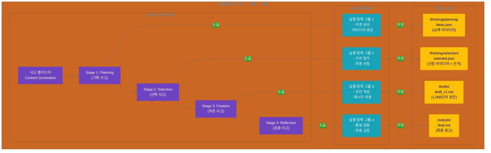
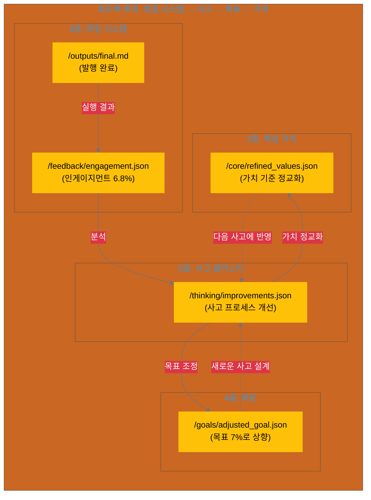

# 13.1 사고에서 파일로: 6계층의 구체화

이 섹션에서는 사고 클러스터(5층)의 결과가 실행 항목(6층)으로 도출되고, 최종적으로 파일 시스템으로 구현되는 과정을 다룹니다.

---

## 13.1.1 5층에서 6층으로: 사고의 물리적 구현

### 6계층 모델의 흐름

report_kr.md의 AI 사고 생태계는 다음과 같은 흐름을 가집니다:

```yaml
# AI 사고 생태계: 5층 → 6층 흐름

# 4층: 목표 (Goal)
goal:
  description: "소셜 미디어에 AI 협업 콘텐츠 발행"
  owner: "인간"
  derived_from: "3층(비전)"

# 5층: 사고 클러스터 (Thinking Cluster)
thinking_cluster:
  purpose: "목표를 달성하기 위한 사고 프로세스 설계"
  owner: "인간 + AI 협업"
  activities:
    - stage_1_planning: "아이디어 기획"
    - stage_2_selection: "핵심 가치 기반 선택"
    - stage_3_creation: "초안 작성"
    - stage_4_reflection: "품질 검증"
  
  # 각 Stage가 실행 항목을 도출
  outputs_to: "6층(실행 항목)"

# 6층: 실행 항목 (Execution Items)
execution_items:
  owner: "AI 주도, 인간 검증"
  derived_from: "5층(사고 클러스터)"
  
  # Stage 1의 실행 항목
  from_stage_1:
    - task: "타겟 분석 데이터 수집"
    - task: "경쟁사 콘텐츠 조사"
    - task: "아이디어 10개 브레인스토밍"
    - output: "ideas.json"  # ← 파일로 저장
  
  # Stage 2의 실행 항목
  from_stage_2:
    - task: "각 아이디어를 핵심 가치로 평가"
    - task: "최종 아이디어 선정"
    - output: "selected.json"  # ← 파일로 저장
  
  # Stage 3의 실행 항목
  from_stage_3:
    - task: "초안 1,000단어 작성"
    - task: "메시지 하우스 적용"
    - output: "draft_v1.md"  # ← 파일로 저장
  
  # Stage 4의 실행 항목
  from_stage_4:
    - task: "품질 검증 (톤앤매너, 사실 확인)"
    - task: "최종 교정"
    - output: "final.md"  # ← 파일로 저장

# 파일 시스템 구현
file_system:
  purpose: "6층 실행 항목의 산출물을 물리적으로 저장"
  structure:
    /tasks/content-001/:
      /thinking/:
        - planning/ideas.json
        - selection/selected.json
      /drafts/:
        - draft_v1.md
      /outputs/:
        - final.md
```

### 사고 → 실행 → 파일의 3단계 변환



### 핵심 원칙: 사고와 실행의 분리

**사고 클러스터(5층)**는 "무엇을", "왜", "어떻게"를 결정합니다:
- Stage 1 (Planning): "어떤 아이디어를 탐색할 것인가?"
- Stage 2 (Selection): "왜 이 아이디어를 선택하는가?"
- Stage 3 (Creation): "어떤 메시지를 전달할 것인가?"
- Stage 4 (Reflection): "품질 기준을 충족하는가?"

**실행 항목(6층)**은 사고의 결과를 "구체적 작업"으로 변환합니다:
- Stage 1 → "타겟 분석 데이터 수집", "아이디어 10개 생성"
- Stage 2 → "각 아이디어를 핵심 가치로 평가", "최종 1개 선정"
- Stage 3 → "초안 1,000단어 작성", "메시지 하우스 적용"
- Stage 4 → "톤앤매너 검증", "사실 확인", "최종 교정"

**파일 시스템**은 실행 결과를 "영속적으로 보관"합니다:
- 각 실행 항목의 산출물을 파일로 저장
- 사고 과정(`/thinking/`)과 결과물(`/outputs/`)을 구분
- 파일 이름과 디렉토리 구조로 의미 전달

---

## 13.1.2 파일 시스템의 3가지 이점

파일 시스템으로 사고 산출물을 관리하면 다음 3가지 핵심 가치를 얻을 수 있습니다.

### 1. 영속성 (Persistence): 사고의 영구 보관

**문제: 휘발성 사고**
```yaml
메모리에만 존재하는 사고:
  문제:
    - 프로세스 종료 시 사고 내용 손실
    - "3개월 전에 왜 이렇게 결정했지?" → 답할 수 없음
    - 사고 히스토리 축적 불가능
  
  예시:
    # AI와 대화로만 콘텐츠 생성
    User: "AI 협업 주제로 소셜 미디어 포스트 작성해줘"
    AI: (아이디어 10개 브레인스토밍) → 메모리에만 존재
    AI: (idea_B 선택) → 왜 선택했는지 기록 없음
    AI: (초안 작성) → 이전 버전 추적 불가
    
    # 3개월 후
    User: "왜 idea_B를 선택했었지?"
    AI: "기록이 없어서 모르겠습니다."
```

**해결: 파일로 영구 보관**
```yaml
파일 시스템으로 사고 기록:
  해결:
    - 모든 사고 단계의 산출물을 파일로 저장
    - 타임스탬프와 메타데이터 함께 기록
    - 언제든 과거 사고 과정 재확인 가능
  
  예시:
    /tasks/content-001/
      thinking/
        planning/
          ideas.json  # 10개 아이디어 + 평가 근거
          timestamp: 2025-10-13T10:00:00Z
        
        selection/
          selected.json  # idea_B 선택 + 핵심 가치 점수
          timestamp: 2025-10-13T10:15:00Z
          rationale: "실용성 8점, 신뢰 7점, 혁신 8점"
        
        creation/
          draft_v1.md  # 초안 1차
          draft_v2.md  # 초안 2차 (검토 반영)
    
    # 3개월 후
    User: "왜 idea_B를 선택했었지?"
    → selection/selected.json 파일을 열어보면 정확한 근거 확인 가능
```

**영속성의 가치**:
- **감사 가능성(Auditability)**: 의사결정 근거를 언제든 추적
- **학습**: 과거 사고 패턴을 분석하여 프로세스 개선
- **지속성**: 팀원이 바뀌어도 사고 히스토리 유지

### 2. 공유성 (Sharing): 사고의 조직적 확산

**문제: 개인에 갇힌 사고**
```yaml
공유되지 않는 사고:
  문제:
    - 팀원 A의 사고 과정을 팀원 B가 모름
    - 같은 사고를 반복 (비효율)
    - 지식이 조직에 축적되지 않음
  
  예시:
    # 팀원 A가 콘텐츠 생성 (11월)
    A: (타겟 분석 완료) → A의 로컬 메모리에만 존재
    A: (메시지 하우스 개발) → A만 알고 있음
    
    # 팀원 B가 유사 작업 (12월)
    B: "타겟 분석을 어떻게 하지?" → A의 작업 접근 불가
    B: (처음부터 다시 타겟 분석) → 중복 작업
    B: "메시지 하우스가 뭐였지?" → A에게 물어봐야 함
```

**해결: 파일 시스템으로 공유**
```yaml
파일 시스템으로 사고 공유:
  해결:
    - 모든 사고 산출물이 파일로 존재
    - 팀원 누구나 과거 사고 과정 열람 가능
    - 공통 자원(/shared)으로 재사용
  
  예시:
    /tasks/content-001/  # 팀원 A의 작업 (11월)
      thinking/
        planning/target_analysis.json
        planning/message_house.json
    
    /tasks/content-002/  # 팀원 B의 작업 (12월)
      # B는 A의 파일을 참고
      thinking/
        planning/REFERENCE.md
          → "타겟 분석은 ../content-001/thinking/planning/ 참고"
    
    /shared/  # 공통 자원
      templates/
        target_analysis_template.json  # A의 방법론을 템플릿화
        message_house_template.json
```

**공유성의 가치**:
- **비동기 협업**: 시간과 장소에 관계없이 사고 과정 공유
- **지식 재사용**: 과거 사고를 템플릿으로 만들어 재사용
- **조직 학습**: 개인의 사고가 조직의 자산으로 축적

### 3. 추적성 (Traceability): 사고 흐름의 명확화

**문제: 불투명한 사고 과정**
```yaml
추적 불가능한 사고:
  문제:
    - "이 최종 결과물이 어떻게 나왔는지" 모름
    - "중간에 어떤 판단이 있었는지" 불명확
    - 문제 발생 시 원인 추적 불가
  
  예시:
    # 최종 콘텐츠 발행
    final.md: "AI 협업으로 생산성 30% 향상"
    
    # 3개월 후 문제 발생
    User: "왜 30%라고 했지? 근거가 뭐였지?"
    → 중간 사고 과정이 없어서 추적 불가
    → "ideas.json에 어떤 아이디어들이 있었지?"
    → "왜 이 아이디어를 선택했지?"
    → "초안은 어땠고, 어떻게 수정했지?"
```

**해결: 파일로 사고 흐름 추적**
```yaml
파일 시스템으로 사고 흐름 명확화:
  해결:
    - 각 Stage의 산출물을 파일로 기록
    - 파일 간 참조 관계로 사고 흐름 표현
    - 타임스탬프로 시간 순서 추적
  
  예시:
    /tasks/content-001/
      thinking/
        planning/
          ideas.json
            idea_A: "AI로 시간 절약"
            idea_B: "AI로 생산성 향상" ← 선택됨
            idea_C: "AI로 창의성 강화"
          timestamp: 2025-10-13T10:00:00Z
        
        selection/
          selected.json
            selected: "idea_B"
            rationale:
              productivity_metric: "30% 향상 (2024 McKinsey 보고서)"
              core_value_scores:
                practicality: 8
                trust: 7
                innovation: 8
            references:
              - "../planning/ideas.json"
          timestamp: 2025-10-13T10:15:00Z
        
        creation/
          draft_v1.md
            # "AI 협업으로 생산성 30% 향상"
            references:
              - "../selection/selected.json"
          timestamp: 2025-10-13T10:30:00Z
        
      outputs/
        final.md
          # "AI 협업으로 생산성 30% 향상"
          references:
            - "../thinking/creation/draft_v1.md"
        timestamp: 2025-10-13T11:00:00Z
    
    # 3개월 후 문제 발생
    User: "왜 30%라고 했지?"
    → final.md → draft_v1.md → selected.json → ideas.json
    → "2024 McKinsey 보고서에서 인용했구나!"
```

**추적성의 가치**:
- **근거 명확화**: 모든 주장의 출처와 근거 추적 가능
- **책임 소재**: 각 결정의 주체와 시점 명확
- **개선 근거**: 사고 프로세스를 분석하여 개선 포인트 발견

---

## 13.1.3 사고 산출물의 파일 표현

사고 클러스터의 각 Stage는 서로 다른 성격의 산출물을 만듭니다. 이를 파일 시스템으로 어떻게 표현할까요?

### 사고 Stage별 파일 매핑

```yaml
# Stage 1: Planning (기획 사고)
stage_1_planning:
  purpose: "가능한 옵션 탐색"
  thinking_type: "발산적 사고 (Divergent Thinking)"
  
  outputs:
    - ideas.json:
        description: "브레인스토밍한 아이디어 목록"
        format: "JSON (구조화된 데이터)"
        location: "/thinking/planning/ideas.json"
        content:
          ideas:
            - id: "idea_A"
              title: "AI로 시간 절약"
              description: "반복 작업을 AI에게 위임"
            - id: "idea_B"
              title: "AI로 생산성 향상"
              description: "AI 협업으로 30% 더 빠르게"
            # ... 총 10개
    
    - research.md:
        description: "타겟 분석 및 경쟁사 조사 결과"
        format: "Markdown (텍스트 + 표)"
        location: "/thinking/planning/research.md"

# Stage 2: Selection (선택 사고)
stage_2_selection:
  purpose: "최적 옵션 선정"
  thinking_type: "수렴적 사고 (Convergent Thinking)"
  
  outputs:
    - selected.json:
        description: "선정된 아이디어 + 선정 근거"
        format: "JSON"
        location: "/thinking/selection/selected.json"
        content:
          selected_idea: "idea_B"
          rationale:
            core_value_scores:
              practicality: 8  # 실용성 점수
              trust: 7         # 신뢰 점수
              innovation: 8    # 혁신 점수
            weighted_score: 7.7  # 가중 평균
            reasoning: "실용성과 혁신이 높아 타겟에게 어필"
          alternatives_considered:
            - idea_A: "점수 6.8로 탈락"
            - idea_C: "점수 7.2로 차순위"

# Stage 3: Creation (작성 사고)
stage_3_creation:
  purpose: "구체적 콘텐츠 생성"
  thinking_type: "생성적 사고 (Generative Thinking)"
  
  outputs:
    - draft_v1.md:
        description: "초안 1차"
        format: "Markdown"
        location: "/drafts/draft_v1.md"
        metadata:
          word_count: 1000
          references:
            - "/thinking/selection/selected.json"
    
    - draft_v2.md:
        description: "초안 2차 (검토 반영)"
        format: "Markdown"
        location: "/drafts/draft_v2.md"

# Stage 4: Reflection (검증 사고)
stage_4_reflection:
  purpose: "품질 검증 및 개선"
  thinking_type: "비판적 사고 (Critical Thinking)"
  
  outputs:
    - quality_check.json:
        description: "품질 검증 결과"
        format: "JSON"
        location: "/thinking/reflection/quality_check.json"
        content:
          checks:
            - criterion: "톤앤매너 일관성"
              result: "통과"
              score: 9
            - criterion: "사실 확인"
              result: "통과"
              score: 10
            - criterion: "메시지 명확성"
              result: "개선 필요"
              score: 7
              feedback: "30% 수치의 출처 명시 필요"
    
    - final.md:
        description: "최종 원고"
        format: "Markdown"
        location: "/outputs/final.md"
        metadata:
          approved: true
          approved_at: "2025-10-13T11:00:00Z"
```

### 디렉토리 구조 예시

실제 파일 시스템에서는 다음과 같은 구조로 표현됩니다:

```
/tasks/content-001/
├── thinking/                    # 사고 과정
│   ├── planning/                # Stage 1: 기획
│   │   ├── ideas.json           # 10개 아이디어
│   │   ├── research.md          # 타겟 분석
│   │   └── timestamp.txt        # 2025-10-13T10:00:00Z
│   ├── selection/               # Stage 2: 선택
│   │   ├── selected.json        # 선정 아이디어 + 근거
│   │   └── timestamp.txt        # 2025-10-13T10:15:00Z
│   ├── creation/                # Stage 3: 작성
│   │   └── notes.md             # 작성 시 참고사항
│   └── reflection/              # Stage 4: 검증
│       ├── quality_check.json   # 품질 검증 결과
│       └── timestamp.txt        # 2025-10-13T10:50:00Z
├── drafts/                      # 중간 산출물
│   ├── draft_v1.md              # 초안 1차
│   └── draft_v2.md              # 초안 2차 (검토 반영)
├── outputs/                     # 최종 산출물
│   └── final.md                 # 최종 원고 (발행 준비)
└── thinking_state.json          # 전체 사고 상태 추적
```

### 파일 형식 선택 가이드

**JSON (`*.json`)**: 구조화된 데이터
- 사용처: 아이디어 목록, 평가 점수, 메타데이터
- 장점: 프로그래밍으로 처리 가능, 검증 가능
- 예시: `ideas.json`, `selected.json`, `quality_check.json`

**Markdown (`*.md`)**: 텍스트 콘텐츠
- 사용처: 원고, 리서치 노트, 가이드
- 장점: 사람이 읽기 쉬움, Git으로 diff 확인 용이
- 예시: `draft_v1.md`, `research.md`, `final.md`

**Plain Text (`*.txt`)**: 단순 텍스트
- 사용처: 타임스탬프, 간단한 메모
- 장점: 가장 단순, 호환성 최고
- 예시: `timestamp.txt`, `notes.txt`

---

## 13.1.4 피드백 루프: 파일 시스템에서 사고 클러스터로

파일 시스템의 가장 큰 가치 중 하나는 **피드백 루프**를 가능하게 한다는 것입니다. report_kr.md의 6계층 모델에서 강조하는 피드백 루프를 파일 시스템으로 구현할 수 있습니다.

### 피드백 루프의 흐름

```yaml
# 피드백 루프: 6층 → 5층 → 4층 → 2층

# Step 1: 6층 (파일 시스템)에서 실행 결과 수집
execution_result:
  file: "/outputs/final.md"
  published_at: "2025-10-13T12:00:00Z"
  engagement_data:
    views: 5000
    likes: 340
    shares: 85
    comments: 23
    engagement_rate: 6.8%  # 목표: 5%
  
  # 결과를 파일로 저장
  result_file: "/feedback/engagement_2025-10-13.json"

# Step 2: 5층 (사고 클러스터)로 피드백
thinking_improvement:
  finding:
    - "인게이지먼트 6.8% > 목표 5% (성공)"
    - "Stage 1 기획 단계에서 타겟 분석이 효과적이었음"
    - "Stage 2 선택 단계의 핵심 가치 점수가 실제 결과와 상관관계 높음"
  
  action:
    - "Stage 1에 '경쟁사 분석' 단계 추가 → 더 차별화된 아이디어"
    - "Stage 2의 핵심 가치 가중치 유지 (실용성 0.4, 신뢰 0.3, 혁신 0.3)"
  
  # 개선사항을 파일로 기록
  improvement_file: "/thinking/improvements.json"

# Step 3: 4층 (목표)로 피드백
goal_adjustment:
  original_goal:
    engagement_rate: 5%
    frequency: "주 1회"
  
  adjusted_goal:
    engagement_rate: 7%  # 6.8% 달성 → 7%로 상향
    frequency: "주 2회"  # 더 자주 발행
    follow_up: "시리즈로 확장 (3부작)"
  
  # 조정된 목표를 파일로 기록
  goal_file: "/goals/adjusted_goal_2025-10.json"

# Step 4: 2층 (핵심 가치)로 피드백
core_values_refinement:
  learning:
    - "실용성(0.4 가중치)이 가장 큰 영향을 미침"
    - "'30% 향상'처럼 구체적 수치가 신뢰 점수를 높임"
  
  refinement:
    - "실용성 기준에 '측정 가능한 지표' 추가"
    - "신뢰 기준에 '출처 명시' 강조"
  
  # 정교화된 가치를 파일로 기록
  values_file: "/core/refined_values_2025-10.json"
```

### 피드백 루프 다이어그램



---

## 요약

13.1에서는 사고 클러스터(5층)가 실행 항목(6층)을 거쳐 파일 시스템으로 구현되는 과정을 배웠습니다:

**핵심 내용**:
1. **5층 → 6층 → 파일**: 사고가 실행으로, 실행이 파일로 변환되는 3단계
2. **3가지 이점**: 영속성(영구 보관), 공유성(팀 협업), 추적성(사고 흐름 명확화)
3. **파일 표현**: Stage별로 적절한 파일 형식 선택 (JSON, Markdown, Text)
4. **피드백 루프**: 파일 시스템의 결과가 사고 클러스터, 목표, 가치로 되돌아가는 순환 구조

**다음 섹션**: 13.2에서는 사고 클러스터별로 디렉토리를 어떻게 구조화할지, 3가지 설계 원칙(격리, 공유, 명명)을 다룹니다.
