# 13.3 사고 상태 추적 메커니즘

13.2에서 사고 클러스터별로 디렉토리를 격리하고, 일관된 명명 규칙을 적용하는 방법을 배웠습니다. 이제 각 사고 클러스터의 **진행 상태**를 어떻게 추적할지 다룹니다.

---

## 13.3.1 `thinking_state.json`: 사고 상태의 스냅샷

### 왜 상태 추적이 필요한가?

**문제: 보이지 않는 진행 상황**
```yaml
상태 추적 없는 사고 클러스터:
  /thinking_clusters/TC001_content_generation/
    thinking/
      planning/ideas.json
      selection/selected.json
    drafts/
      draft_v1.md
  
  문제:
    - "이 클러스터가 현재 어느 단계인지" 알 수 없음
    - "기획 단계인지, 작성 단계인지" 파일 확인해야 함
    - "전체 진행률이 몇 %인지" 계산 불가
    - "어디서 멈췄는지" 기억에 의존
```

**해결: `thinking_state.json`으로 상태 기록**
```yaml
상태 추적하는 사고 클러스터:
  /thinking_clusters/TC001_content_generation/
    thinking/
      ...
    thinking_state.json:              # ⭐ 상태 추적 파일
      cluster_id: "TC001"
      current_stage: "creation"       # 현재: 작성 단계
      status: "in_progress"           # 진행 중
      progress: 60                    # 60% 완료
      last_updated: "2025-10-13T10:30:00Z"
  
  효과:
    - 파일 하나로 전체 상태 파악
    - 진행률 숫자로 명확히
    - 마지막 작업 시점 기록
    - 다음 할 일 즉시 확인
```

### `thinking_state.json` 표준 스키마

```yaml
# thinking_state.json 필수 필드
thinking_state_schema:
  # 클러스터 식별
  cluster_id:
    type: string
    required: true
    example: "TC001"
    description: "사고 클러스터 고유 ID"
  
  cluster_name:
    type: string
    required: true
    example: "content_generation"
    description: "클러스터 이름 (디렉토리명과 일치)"
  
  # 현재 상태
  current_stage:
    type: string
    required: true
    enum: ["planning", "reasoning", "experimenting", "reflecting", "completed"]
    description: "현재 진행 중인 사고 Stage (report_kr.md 4가지 + completed)"
  
  status:
    type: string
    required: true
    enum: ["not_started", "in_progress", "blocked", "completed"]
    description: "클러스터 전체 상태"
  
  progress:
    type: integer
    required: true
    range: [0, 100]
    description: "전체 진행률 (%)"
  
  # 타임스탬프
  created_at:
    type: string
    required: true
    format: "ISO 8601"
    example: "2025-10-13T09:00:00Z"
    description: "클러스터 시작 시각"
  
  last_updated:
    type: string
    required: true
    format: "ISO 8601"
    example: "2025-10-13T10:30:00Z"
    description: "마지막 업데이트 시각"
  
  # 선택 필드 (권장)
  goal:
    type: string
    required: false
    example: "소셜 미디어 콘텐츠 발행"
    description: "이 클러스터의 목표 (4층)"
  
  stage_history:
    type: array
    required: false
    description: "Stage 전이 이력"
    items:
      - stage: "planning"
        started_at: "2025-10-13T09:00:00Z"
        completed_at: "2025-10-13T09:30:00Z"
      - stage: "reasoning"
        started_at: "2025-10-13T09:30:00Z"
        completed_at: null  # 진행 중
  
  next_actions:
    type: array
    required: false
    description: "다음에 할 작업"
    items:
      - "초안 1차 작성 (1,000단어)"
      - "메시지 하우스 적용"
  
  blockers:
    type: array
    required: false
    description: "진행을 막는 문제들"
    items:
      - issue: "타겟 데이터 부족"
        severity: "high"
        reported_at: "2025-10-13T10:00:00Z"
  
  notes:
    type: string
    required: false
    description: "메모 및 컨텍스트"
```

### 실제 사용 예시

**시나리오 1**: 콘텐츠 생성 클러스터 (진행 중)

```json
{
  "cluster_id": "TC001",
  "cluster_name": "content_generation",
  "goal": "소셜 미디어에 AI 협업 콘텐츠 발행",
  
  "current_stage": "creation",
  "status": "in_progress",
  "progress": 60,
  
  "created_at": "2025-10-13T09:00:00Z",
  "last_updated": "2025-10-13T10:30:00Z",
  
  "stage_history": [
    {
      "stage": "planning",
      "started_at": "2025-10-13T09:00:00Z",
      "completed_at": "2025-10-13T09:30:00Z",
      "outputs": [
        "/thinking/planning/ideas.json",
        "/thinking/planning/research.md"
      ]
    },
    {
      "stage": "reasoning",
      "started_at": "2025-10-13T09:30:00Z",
      "completed_at": "2025-10-13T10:00:00Z",
      "outputs": [
        "/thinking/selection/selected.json",
        "/thinking/selection/evaluation_matrix.json"
      ]
    },
    {
      "stage": "creation",
      "started_at": "2025-10-13T10:00:00Z",
      "completed_at": null,
      "outputs": [
        "/drafts/draft_v1.md"
      ]
    }
  ],
  
  "next_actions": [
    "초안 1차 검토 및 수정",
    "메시지 하우스 적용 확인",
    "draft_v2.md 작성"
  ],
  
  "blockers": [],
  
  "notes": "아이디어 선정 단계에서 idea_B 선택. 핵심 가치 점수 7.7점으로 높음."
}
```

**시나리오 2**: 데이터 분석 클러스터 (블로킹 상태)

```json
{
  "cluster_id": "TC002",
  "cluster_name": "churn_analysis",
  "goal": "사용자 이탈률 분석 및 개선 기회 도출",
  
  "current_stage": "experimenting",
  "status": "blocked",
  "progress": 45,
  
  "created_at": "2025-10-13T08:00:00Z",
  "last_updated": "2025-10-13T11:00:00Z",
  
  "stage_history": [
    {
      "stage": "planning",
      "started_at": "2025-10-13T08:00:00Z",
      "completed_at": "2025-10-13T08:30:00Z",
      "outputs": [
        "/thinking/planning/analysis_plan.json"
      ]
    },
    {
      "stage": "reasoning",
      "started_at": "2025-10-13T08:30:00Z",
      "completed_at": "2025-10-13T09:30:00Z",
      "outputs": [
        "/thinking/reasoning/hypotheses.json",
        "/thinking/reasoning/test_results.json"
      ]
    },
    {
      "stage": "experimenting",
      "started_at": "2025-10-13T09:30:00Z",
      "completed_at": null,
      "outputs": [
        "/code/data_prep.py",
        "/thinking/experimenting/experiment_log.md"
      ]
    }
  ],
  
  "next_actions": [
    "블로커 해결 후: A/B 테스트 3개월 데이터 분석",
    "코호트 분석 실행"
  ],
  
  "blockers": [
    {
      "issue": "3개월 데이터 접근 권한 없음",
      "severity": "high",
      "reported_at": "2025-10-13T10:30:00Z",
      "owner": "user@example.com",
      "resolution": "데이터팀에 요청 중 (예상 해결: 10/15)"
    }
  ],
  
  "notes": "가설 3개 중 2개는 검증 완료. 가설 3 (이탈률과 사용 빈도 상관관계) 검증 대기 중."
}
```

**시나리오 3**: 완료된 클러스터

```json
{
  "cluster_id": "TC001",
  "cluster_name": "content_generation",
  "goal": "소셜 미디어에 AI 협업 콘텐츠 발행",
  
  "current_stage": "completed",
  "status": "completed",
  "progress": 100,
  
  "created_at": "2025-10-13T09:00:00Z",
  "last_updated": "2025-10-13T12:00:00Z",
  "completed_at": "2025-10-13T12:00:00Z",
  
  "stage_history": [
    {
      "stage": "planning",
      "started_at": "2025-10-13T09:00:00Z",
      "completed_at": "2025-10-13T09:30:00Z"
    },
    {
      "stage": "reasoning",
      "started_at": "2025-10-13T09:30:00Z",
      "completed_at": "2025-10-13T10:00:00Z"
    },
    {
      "stage": "creation",
      "started_at": "2025-10-13T10:00:00Z",
      "completed_at": "2025-10-13T10:45:00Z"
    },
    {
      "stage": "reflecting",
      "started_at": "2025-10-13T10:45:00Z",
      "completed_at": "2025-10-13T11:30:00Z"
    }
  ],
  
  "final_outputs": [
    "/outputs/final.md",
    "/outputs/metadata.json"
  ],
  
  "metrics": {
    "engagement_rate": 6.8,
    "views": 5000,
    "likes": 340,
    "shares": 85,
    "target_achieved": true
  },
  
  "next_actions": [],
  
  "notes": "목표 5% 인게이지먼트 → 실제 6.8% 달성. 다음 목표 7%로 상향 (TC011에서 진행)."
}
```

---

## 13.3.2 4가지 사고 상태와 전이 규칙

report_kr.md의 AI 사고 생태계는 5층(사고 클러스터)에서 4가지 사고 활동을 정의합니다:
1. **Planning**: 목표 설정, 전략 수립
2. **Reasoning**: 논리 전개, 대안 평가
3. **Experimenting**: 시도, 테스트
4. **Reflecting**: 피드백, 개선

이 4가지는 사고 클러스터의 **상태(stage)**로 매핑됩니다.

### 4가지 사고 상태 정의

```yaml
# Stage 1: Planning (기획 사고)
stage_planning:
  name: "planning"
  purpose: "가능한 옵션 탐색 및 전략 수립"
  thinking_type: "발산적 사고 (Divergent Thinking)"
  
  activities:
    - "목표 분석"
    - "제약 조건 파악"
    - "아이디어 브레인스토밍"
    - "리서치 및 데이터 수집"
  
  outputs:
    - "/thinking/planning/ideas.json"
    - "/thinking/planning/research.md"
    - "/thinking/planning/constraints.json"
  
  completion_criteria:
    - "10개 이상 아이디어 생성"
    - "타겟 분석 완료"
    - "제약 조건 문서화"
  
  next_stage: "reasoning"

# Stage 2: Reasoning (추론 사고)
stage_reasoning:
  name: "reasoning"
  purpose: "대안 평가 및 최적 옵션 선정"
  thinking_type: "수렴적 사고 (Convergent Thinking)"
  
  activities:
    - "대안 비교 분석"
    - "핵심 가치 기반 평가"
    - "리스크 분석"
    - "최종 선정 및 근거 작성"
  
  outputs:
    - "/thinking/reasoning/evaluation_matrix.json"
    - "/thinking/reasoning/selected.json"
    - "/thinking/reasoning/rationale.md"
  
  completion_criteria:
    - "핵심 가치 점수 계산 완료"
    - "최종 선택 및 근거 문서화"
    - "대안 2-3개 백업"
  
  next_stage: "experimenting"

# Stage 3: Experimenting (실험 사고)
stage_experimenting:
  name: "experimenting"
  purpose: "선정된 옵션을 구체화하고 시험"
  thinking_type: "생성적 사고 (Generative Thinking)"
  
  activities:
    - "프로토타입 제작"
    - "초안 작성"
    - "코드 구현"
    - "A/B 테스트"
  
  outputs:
    - "/drafts/draft_v1.md"
    - "/code/prototype.py"
    - "/thinking/experimenting/experiment_log.md"
    - "/data/test_results.csv"
  
  completion_criteria:
    - "작동하는 프로토타입/초안 완성"
    - "핵심 기능 구현"
    - "실험 결과 기록"
  
  next_stage: "reflecting"

# Stage 4: Reflecting (성찰 사고)
stage_reflecting:
  name: "reflecting"
  purpose: "품질 검증 및 피드백 반영"
  thinking_type: "비판적 사고 (Critical Thinking)"
  
  activities:
    - "품질 기준 검증"
    - "피드백 수집 및 분석"
    - "개선 사항 도출"
    - "최종 승인"
  
  outputs:
    - "/thinking/reflecting/quality_check.json"
    - "/thinking/reflecting/feedback.json"
    - "/thinking/reflecting/improvements.md"
    - "/outputs/final.md"
  
  completion_criteria:
    - "모든 품질 기준 통과"
    - "피드백 반영 완료"
    - "최종 산출물 승인"
  
  next_stage: "completed"
```

### 상태 전이 다이어그램

```mermaid
%%{init: {
  'theme': 'base',
  'themeVariables': {
    'primaryColor': '#1f77b4',
    'primaryTextColor': '#ffffff',
    'primaryBorderColor': '#1f77b4',
    'lineColor': '#6c757d',
    'background': 'transparent',
    'secondaryColor': '#ff7f0e',
    'tertiaryColor': '#2ca02c'
  }
}}%%
stateDiagram-v2
    [*] --> planning: 클러스터 시작
    
    planning --> reasoning: ✅ 기획 완료<br/>(아이디어 10개 생성)
    planning --> planning: 🔄 더 탐색 필요
    
    reasoning --> experimenting: ✅ 선정 완료<br/>(최적안 선택)
    reasoning --> planning: ⬅️ 옵션 부족<br/>(재기획 필요)
    reasoning --> reasoning: 🔄 평가 재검토
    
    experimenting --> reflecting: ✅ 프로토타입 완성<br/>(작동 확인)
    experimenting --> reasoning: ⬅️ 선택 재고<br/>(구현 불가)
    experimenting --> experimenting: 🔄 개선 반복
    
    reflecting --> completed: ✅ 품질 통과<br/>(최종 승인)
    reflecting --> experimenting: ⬅️ 수정 필요<br/>(품질 미달)
    reflecting --> reflecting: 🔄 검토 지속
    
    completed --> [*]: 클러스터 종료
    
    note right of planning
        발산적 사고:
        가능한 옵션 최대한 탐색
    end note
    
    note right of reasoning
        수렴적 사고:
        최적안 선정 + 근거
    end note
    
    note right of experimenting
        생성적 사고:
        구체화 + 시험
    end note
    
    note right of reflecting
        비판적 사고:
        검증 + 개선
    end note
```



### 상태 전이 규칙

```yaml
# 전진 전이 (Forward Transition)
forward_transitions:
  planning_to_reasoning:
    condition: "아이디어 10개 이상 생성 + 리서치 완료"
    action: "evaluation_matrix.json 생성 시작"
  
  reasoning_to_experimenting:
    condition: "최종 아이디어 선정 + 근거 문서화"
    action: "draft_v1.md 또는 prototype 작성 시작"
  
  experimenting_to_reflecting:
    condition: "프로토타입/초안 완성 + 핵심 기능 작동"
    action: "quality_check.json 작성 시작"
  
  reflecting_to_completed:
    condition: "모든 품질 기준 통과 + 최종 승인"
    action: "outputs/final.md 및 metadata.json 완성"

# 후진 전이 (Backward Transition)
backward_transitions:
  reasoning_to_planning:
    reason: "평가 결과 모든 옵션이 부적합"
    action: "새로운 아이디어 탐색"
    example: "10개 아이디어 모두 핵심 가치 점수 6점 이하"
  
  experimenting_to_reasoning:
    reason: "선정한 옵션이 구현 불가능"
    action: "대안 선택"
    example: "기술적 제약으로 idea_B 구현 불가 → idea_C로 전환"
  
  reflecting_to_experimenting:
    reason: "품질 기준 미달"
    action: "수정 및 재작성"
    example: "톤앤매너 점수 5점 → draft_v2.md 작성"

# 순환 전이 (Loop Transition)
loop_transitions:
  planning_loop:
    condition: "아이디어 수가 부족 (< 10개)"
    action: "추가 브레인스토밍"
  
  reasoning_loop:
    condition: "평가 기준 변경"
    action: "재평가"
  
  experimenting_loop:
    condition: "프로토타입 개선 필요"
    action: "반복 개발"
  
  reflecting_loop:
    condition: "일부 기준만 통과"
    action: "추가 검토"
```

---

## 13.3.3 상태 추적 유틸리티

사고 상태를 프로그래밍 방식으로 관리할 수 있는 Python 유틸리티를 제공합니다.

### Python 코드: `state_tracker.py`

```python
# /shared/libraries/state_tracker.py
import json
from datetime import datetime
from typing import Dict, List, Optional
from pathlib import Path

class ThinkingStateTracker:
    """사고 클러스터 상태 추적 유틸리티"""
    
    VALID_STAGES = ["planning", "reasoning", "experimenting", "reflecting", "completed"]
    VALID_STATUSES = ["not_started", "in_progress", "blocked", "completed"]
    
    def __init__(self, cluster_path: str):
        """
        Args:
            cluster_path: 사고 클러스터 디렉토리 경로 (예: /workspace/thinking_clusters/TC001_content)
        """
        self.cluster_path = Path(cluster_path)
        self.state_file = self.cluster_path / "thinking_state.json"
    
    def initialize(self, cluster_id: str, cluster_name: str, goal: str) -> Dict:
        """새 클러스터 초기화"""
        state = {
            "cluster_id": cluster_id,
            "cluster_name": cluster_name,
            "goal": goal,
            "current_stage": "planning",
            "status": "in_progress",
            "progress": 0,
            "created_at": datetime.now().isoformat() + "Z",
            "last_updated": datetime.now().isoformat() + "Z",
            "stage_history": [],
            "next_actions": [],
            "blockers": [],
            "notes": ""
        }
        self._save_state(state)
        return state
    
    def get_state(self) -> Dict:
        """현재 상태 조회"""
        if not self.state_file.exists():
            raise FileNotFoundError(f"State file not found: {self.state_file}")
        
        with open(self.state_file, 'r') as f:
            return json.load(f)
    
    def update_stage(self, new_stage: str, outputs: Optional[List[str]] = None) -> Dict:
        """Stage 변경 및 이력 기록"""
        if new_stage not in self.VALID_STAGES:
            raise ValueError(f"Invalid stage: {new_stage}. Must be one of {self.VALID_STAGES}")
        
        state = self.get_state()
        old_stage = state["current_stage"]
        
        # 이전 Stage 완료 처리
        if state["stage_history"] and state["stage_history"][-1]["completed_at"] is None:
            state["stage_history"][-1]["completed_at"] = datetime.now().isoformat() + "Z"
            if outputs:
                state["stage_history"][-1]["outputs"] = outputs
        
        # 새 Stage 시작
        state["current_stage"] = new_stage
        state["stage_history"].append({
            "stage": new_stage,
            "started_at": datetime.now().isoformat() + "Z",
            "completed_at": None,
            "outputs": []
        })
        
        # 진행률 업데이트
        stage_progress = {
            "planning": 25,
            "reasoning": 50,
            "experimenting": 75,
            "reflecting": 90,
            "completed": 100
        }
        state["progress"] = stage_progress[new_stage]
        
        if new_stage == "completed":
            state["status"] = "completed"
            state["completed_at"] = datetime.now().isoformat() + "Z"
        
        state["last_updated"] = datetime.now().isoformat() + "Z"
        
        self._save_state(state)
        print(f"✅ Stage transition: {old_stage} → {new_stage} (Progress: {state['progress']}%)")
        return state
    
    def add_blocker(self, issue: str, severity: str = "medium", owner: Optional[str] = None) -> Dict:
        """블로커 추가"""
        state = self.get_state()
        state["status"] = "blocked"
        state["blockers"].append({
            "issue": issue,
            "severity": severity,
            "reported_at": datetime.now().isoformat() + "Z",
            "owner": owner,
            "resolved": False
        })
        state["last_updated"] = datetime.now().isoformat() + "Z"
        self._save_state(state)
        print(f"⚠️ Blocker added: {issue} (Severity: {severity})")
        return state
    
    def resolve_blocker(self, issue: str) -> Dict:
        """블로커 해결"""
        state = self.get_state()
        for blocker in state["blockers"]:
            if blocker["issue"] == issue and not blocker["resolved"]:
                blocker["resolved"] = True
                blocker["resolved_at"] = datetime.now().isoformat() + "Z"
        
        # 모든 블로커 해결 시 상태 복구
        if all(b["resolved"] for b in state["blockers"]):
            state["status"] = "in_progress"
            print("✅ All blockers resolved. Status: in_progress")
        
        state["last_updated"] = datetime.now().isoformat() + "Z"
        self._save_state(state)
        return state
    
    def set_next_actions(self, actions: List[str]) -> Dict:
        """다음 작업 설정"""
        state = self.get_state()
        state["next_actions"] = actions
        state["last_updated"] = datetime.now().isoformat() + "Z"
        self._save_state(state)
        return state
    
    def add_note(self, note: str) -> Dict:
        """메모 추가"""
        state = self.get_state()
        if state["notes"]:
            state["notes"] += "\n\n" + note
        else:
            state["notes"] = note
        state["last_updated"] = datetime.now().isoformat() + "Z"
        self._save_state(state)
        return state
    
    def _save_state(self, state: Dict):
        """상태 파일 저장"""
        with open(self.state_file, 'w') as f:
            json.dump(state, f, indent=2, ensure_ascii=False)


# 사용 예시
if __name__ == "__main__":
    # 1. 클러스터 초기화
    tracker = ThinkingStateTracker("/workspace/thinking_clusters/TC001_content_generation")
    tracker.initialize(
        cluster_id="TC001",
        cluster_name="content_generation",
        goal="소셜 미디어에 AI 협업 콘텐츠 발행"
    )
    
    # 2. 다음 작업 설정
    tracker.set_next_actions([
        "타겟 분석 완료",
        "아이디어 10개 브레인스토밍",
        "리서치 문서 작성"
    ])
    
    # 3. Stage 전이: planning → reasoning
    tracker.update_stage("reasoning", outputs=[
        "/thinking/planning/ideas.json",
        "/thinking/planning/research.md"
    ])
    
    # 4. 블로커 추가
    tracker.add_blocker(
        issue="타겟 데이터 접근 권한 없음",
        severity="high",
        owner="user@example.com"
    )
    
    # 5. 블로커 해결
    tracker.resolve_blocker("타겟 데이터 접근 권한 없음")
    
    # 6. 현재 상태 조회
    current_state = tracker.get_state()
    print(f"\n📊 현재 상태: {current_state['current_stage']} ({current_state['progress']}%)")
```

### Python 코드: `get_cluster_status.py`

```python
# /shared/libraries/cluster_status.py
import json
from pathlib import Path
from typing import Dict, List

def get_all_clusters_status(workspace_path: str = "/workspace") -> List[Dict]:
    """모든 클러스터 상태 요약"""
    workspace = Path(workspace_path)
    clusters_dir = workspace / "thinking_clusters"
    
    clusters = []
    for cluster_path in clusters_dir.iterdir():
        if cluster_path.is_dir():
            state_file = cluster_path / "thinking_state.json"
            if state_file.exists():
                with open(state_file, 'r') as f:
                    state = json.load(f)
                    clusters.append({
                        "id": state["cluster_id"],
                        "name": state["cluster_name"],
                        "stage": state["current_stage"],
                        "status": state["status"],
                        "progress": state["progress"],
                        "last_updated": state["last_updated"]
                    })
    
    return clusters

def print_dashboard():
    """클러스터 대시보드 출력"""
    clusters = get_all_clusters_status()
    
    print("=" * 80)
    print("🎯 사고 클러스터 대시보드")
    print("=" * 80)
    print(f"{'ID':<8} {'Name':<25} {'Stage':<15} {'Status':<12} {'Progress':>10}")
    print("-" * 80)
    
    for c in clusters:
        status_emoji = {
            "in_progress": "🔄",
            "blocked": "⚠️",
            "completed": "✅",
            "not_started": "⏸️"
        }[c["status"]]
        
        print(f"{c['id']:<8} {c['name']:<25} {c['stage']:<15} {status_emoji} {c['status']:<10} {c['progress']:>8}%")
    
    print("=" * 80)
    print(f"📈 총 {len(clusters)}개 클러스터")
    
    # 통계
    in_progress = sum(1 for c in clusters if c["status"] == "in_progress")
    blocked = sum(1 for c in clusters if c["status"] == "blocked")
    completed = sum(1 for c in clusters if c["status"] == "completed")
    
    print(f"   진행 중: {in_progress}개 | 블로킹: {blocked}개 | 완료: {completed}개")
    print("=" * 80)

if __name__ == "__main__":
    print_dashboard()
```

**출력 예시**:
```
================================================================================
🎯 사고 클러스터 대시보드
================================================================================
ID       Name                      Stage           Status       Progress
--------------------------------------------------------------------------------
TC001    content_generation        reasoning       🔄 in_progress     50%
TC002    churn_analysis            experimenting   ⚠️ blocked         45%
TC003    strategy_planning         planning        🔄 in_progress     25%
TC010    weekly_report             completed       ✅ completed      100%
================================================================================
📈 총 4개 클러스터
   진행 중: 2개 | 블로킹: 1개 | 완료: 1개
================================================================================
```

---

## 13.3.4 피드백 루프: 상태 파일에 결과 기록

report_kr.md에서 강조하는 피드백 루프를 `thinking_state.json`에 구현할 수 있습니다.

### 피드백 데이터 구조

```yaml
# thinking_state.json에 피드백 섹션 추가
feedback_section:
  # 6층: 실행 결과
  execution_results:
    file: "/outputs/final.md"
    published_at: "2025-10-13T12:00:00Z"
    metrics:
      engagement_rate: 6.8
      views: 5000
      likes: 340
      shares: 85
      comments: 23
    
    target_achieved: true
    target_value: 5.0
    actual_value: 6.8
  
  # 5층: 사고 프로세스 개선
  thinking_improvements:
    - stage: "planning"
      finding: "타겟 분석이 정확했음 (인게이지먼트 목표 초과)"
      action: "다음 클러스터에서도 동일한 타겟 분석 템플릿 사용"
    
    - stage: "reasoning"
      finding: "핵심 가치 점수와 실제 결과가 높은 상관관계 (r=0.92)"
      action: "핵심 가치 가중치 유지 (실용성 0.4, 신뢰 0.3, 혁신 0.3)"
    
    - stage: "experimenting"
      finding: "draft_v2까지만 필요했음 (v3 불필요)"
      action: "초안은 2개 버전으로 충분"
  
  # 4층: 목표 조정
  goal_adjustments:
    original_goal: "인게이지먼트 5%"
    adjusted_goal: "인게이지먼트 7%"
    reason: "6.8% 달성으로 더 높은 목표 설정 가능"
    new_cluster: "TC011_content_series"
  
  # 2층: 핵심 가치 정교화
  core_values_refinement:
    learning:
      - "실용성(0.4)이 가장 큰 영향"
      - "구체적 수치('30% 향상')가 신뢰 점수 높임"
    
    refinement:
      - "실용성 기준에 '측정 가능한 지표' 명시 추가"
      - "신뢰 기준에 '출처 명시' 강조"
```

### Python 코드: 피드백 기록

```python
# /shared/libraries/feedback_tracker.py
def record_feedback(cluster_path: str, execution_results: Dict, improvements: List[Dict]):
    """피드백 루프 결과를 thinking_state.json에 기록"""
    tracker = ThinkingStateTracker(cluster_path)
    state = tracker.get_state()
    
    # 피드백 섹션 추가
    state["feedback"] = {
        "execution_results": execution_results,
        "thinking_improvements": improvements,
        "recorded_at": datetime.now().isoformat() + "Z"
    }
    
    tracker._save_state(state)
    print("✅ Feedback recorded successfully")

# 사용 예시
record_feedback(
    cluster_path="/workspace/thinking_clusters/TC001_content_generation",
    execution_results={
        "metrics": {
            "engagement_rate": 6.8,
            "views": 5000
        },
        "target_achieved": True
    },
    improvements=[
        {
            "stage": "planning",
            "finding": "타겟 분석 정확",
            "action": "템플릿 재사용"
        }
    ]
)
```

---

## 요약

13.3에서는 사고 클러스터의 상태를 추적하는 메커니즘을 배웠습니다:

**핵심 내용**:
1. **thinking_state.json**: 클러스터의 현재 Stage, 진행률, 블로커를 한눈에 파악
2. **4가지 사고 상태**: planning, reasoning, experimenting, reflecting + completed
3. **상태 전이**: 전진(forward), 후진(backward), 순환(loop) 전이 규칙
4. **Python 유틸리티**: 상태 추적, 대시보드, 피드백 기록 자동화

**다음 섹션**: 13.4에서는 실전 예시를 통해 전체 파일 시스템이 어떻게 작동하는지, 그리고 여러 클러스터가 협업하는 시나리오를 다룹니다.
