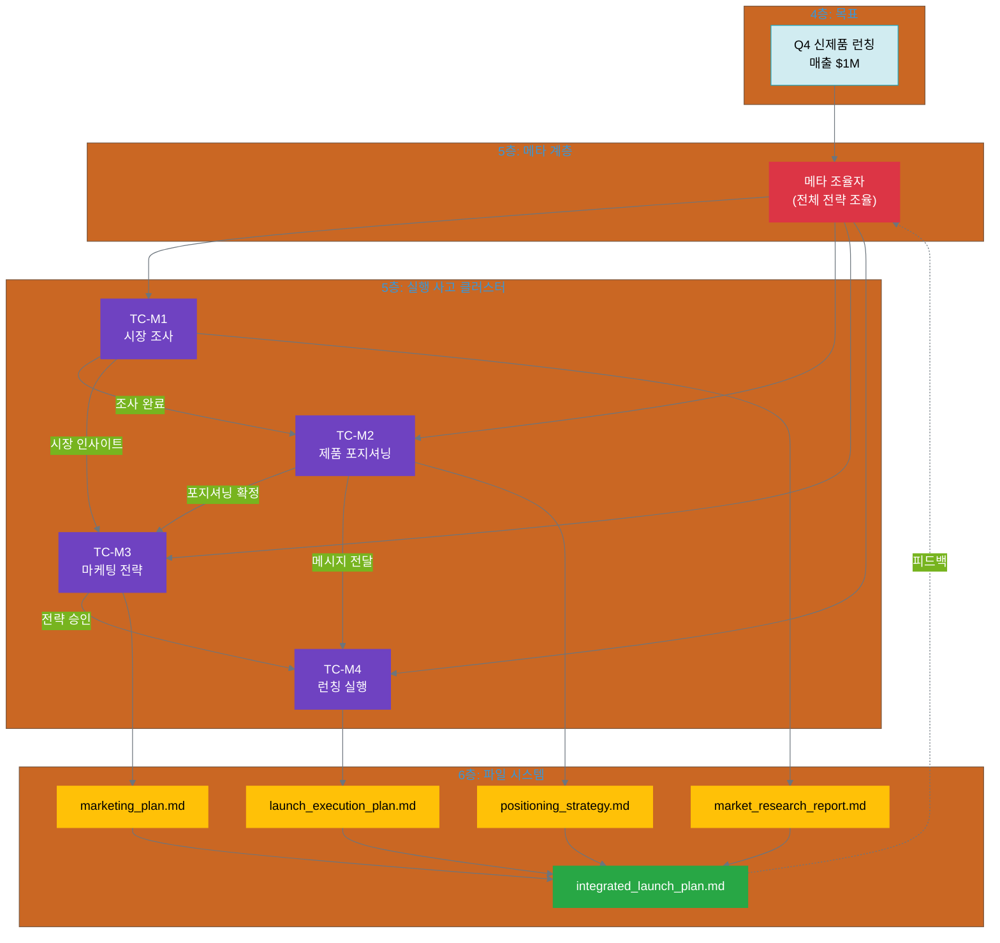

# 14.3 사례 3: 신제품 런칭 전략

**복잡도**: ⭐⭐⭐⭐⭐ (고급)  
**패턴**: 계층적 사고 클러스터 (12장) + 파일 시스템 (13장)  
**학습 목표**: 메타 조율자를 통한 복잡한 프로젝트 관리

---

## 14.3.1 프로젝트 개요 및 6계층 설계

### 프로젝트 배경

**상황**:
당신은 B2B SaaS 회사의 제품 전략팀 리더입니다. 회사는 Q4에 AI 기반 프로젝트 관리 도구의 새 버전을 런칭할 계획입니다. 이 프로젝트는 여러 팀(시장 조사, 제품 포지셔닝, 마케팅, 영업)이 협력해야 하는 복잡한 프로젝트입니다.

**문제**:
- 4개 팀이 각자 작업 중이지만 조율이 어려움
- 팀 간 의존성이 복잡: 시장 조사 → 포지셔닝 → 마케팅 → 영업
- 전체 전략의 일관성 유지가 어려움
- 목표 달성 (매출 $1M) 추적이 어려움

**목표**:
AI를 활용하여 4개 팀의 사고 과정을 체계적으로 조율하고, 전체 런칭 전략의 일관성을 유지하면서 목표를 달성합니다.

### 6계층 전체 설계

```yaml
# 1층: 미션
mission: "고객의 프로젝트 성공률을 50% 향상시키는 혁신 도구 제공"

# 2층: 핵심 가치
core_values:
  customer_focus: "고객 중심 - 고객 니즈를 최우선으로"
  innovation: "혁신성 - 시장에 없던 가치 제공"
  execution_excellence: "실행 우수성 - 약속한 것을 반드시 달성"

# 3층: 비전
vision: "2026년까지 AI 프로젝트 관리 도구 시장 점유율 15% 달성"

# 4층: 목표
goal:
  title: "Q4 신제품 런칭 성공"
  deadline: "2025-12-01"
  metrics:
    - revenue_target: "$1M (런칭 첫 달)"
    - customer_acquisition: "500개 신규 고객"
    - net_promoter_score: "NPS 50 이상"

# 5층: 계층적 사고 클러스터
thinking_clusters:
  meta_coordinator:
    name: "런칭 전략 조율자"
    purpose: "전체 런칭 전략 조율 및 일관성 유지"
    manages: ["TC-M1", "TC-M2", "TC-M3", "TC-M4"]
    
  TC-M1:
    name: "시장 조사 사고"
    purpose: "타겟 시장 및 경쟁 분석"
    depends_on: []
    
  TC-M2:
    name: "제품 포지셔닝 사고"
    purpose: "제품 차별화 포인트 정의"
    depends_on: ["TC-M1"]
    
  TC-M3:
    name: "마케팅 전략 사고"
    purpose: "Go-to-Market 전략 수립"
    depends_on: ["TC-M1", "TC-M2"]
    
  TC-M4:
    name: "런칭 실행 계획 사고"
    purpose: "세부 실행 계획 및 일정"
    depends_on: ["TC-M2", "TC-M3"]

# 6층: 실행 항목
execution:
  directory: "/projects/launch-q4/"
  outputs:
    - market_research_report.md    # TC-M1
    - positioning_strategy.md       # TC-M2
    - marketing_plan.md             # TC-M3
    - launch_execution_plan.md      # TC-M4
    - integrated_launch_plan.md     # 메타 조율자 최종 산출물
```

### 계층적 구조 시각화



---

## 14.3.2 계층적 사고 클러스터 설계

### 메타 조율자의 역할

12장에서 배운 **메타 조율자**가 전체 프로젝트를 조율합니다:

```yaml
메타_조율자:
  이름: "런칭 전략 조율자"
  
  Stage_1_Planning (전체 전략 기획):
    활동: 4개 사고 클러스터의 목표 정렬
    질문:
      - 각 팀의 목표가 전체 목표($1M)와 정렬되는가?
      - 팀 간 의존성이 명확한가?
      - 리소스 배분이 적절한가?
    산출물: coordination_plan.json
    
  Stage_2_Reasoning (조율 전략 수립):
    활동: 팀 간 충돌 해결 및 우선순위 설정
    질문:
      - 시장 조사와 포지셔닝 간 정보 전달이 원활한가?
      - 마케팅 전략이 포지셔닝과 일치하는가?
      - 실행 계획이 현실적인가?
    산출물: coordination_strategy.json
    
  Stage_3_Experimenting (조율 실행):
    활동: 4개 사고 클러스터 실행 모니터링
    질문:
      - 각 사고 클러스터가 제시간에 완료되는가?
      - 중간 산출물이 다음 사고 클러스터에 적절히 전달되는가?
      - 전체 일관성이 유지되는가?
    산출물: progress_reports.json (여러 개)
    
  Stage_4_Reflecting (전체 통합 및 검증):
    활동: 4개 사고 클러스터의 산출물을 하나로 통합
    질문:
      - 모든 핵심 가치를 충족하는가?
      - $1M 목표 달성 가능성은?
      - 개선이 필요한 부분은?
    산출물: integrated_launch_plan.md
```

### TC-M1: 시장 조사 사고

```yaml
사고_클러스터_TC-M1:
  이름: "시장 조사"
  의존성: 없음 (첫 번째 사고)
  메타_조율: 메타 조율자가 목표 정렬 및 일정 관리
  
  Stage_1_Planning:
    활동: 조사 범위 및 방법론 정의
    산출물: research_plan.json
    
  Stage_2_Reasoning:
    활동: 타겟 시장 및 경쟁사 분석
    산출물: market_analysis.json
    
  Stage_3_Experimenting:
    활동: 고객 인터뷰 및 데이터 수집
    산출물: interview_transcripts.md, survey_results.csv
    
  Stage_4_Reflecting:
    활동: 시장 인사이트 도출
    산출물: market_research_report.md
    핵심_인사이트:
      - "타겟 시장: 50-200명 규모 테크 스타트업"
      - "주요 페인 포인트: 프로젝트 가시성 부족"
      - "지불 의향: 월 $50-100 per user"
```

### TC-M2: 제품 포지셔닝 사고

```yaml
사고_클러스터_TC-M2:
  이름: "제품 포지셔닝"
  의존성: TC-M1 (시장 인사이트 필요)
  메타_조율: 메타 조율자가 TC-M1과의 정보 전달 조율
  
  Stage_1_Planning:
    활동: TC-M1 인사이트 기반 포지셔닝 방향 설정
    입력: market_research_report.md
    산출물: positioning_directions.json
    
  Stage_2_Reasoning:
    활동: 차별화 포인트 정의
    질문:
      - 경쟁사 대비 우리의 혁신성은?
      - 고객 중심: 고객 페인 포인트를 어떻게 해결?
      - 실행 우수성: 약속 가능한 가치는?
    산출물: differentiation_points.json
    
  Stage_3_Experimenting:
    활동: 포지셔닝 메시지 작성 및 테스트
    산출물: positioning_messages_v1.md, positioning_messages_v2.md
    
  Stage_4_Reflecting:
    활동: 최종 포지셔닝 전략 확정
    산출물: positioning_strategy.md
    핵심_메시지: "AI가 프로젝트를 자동으로 모니터링하여, 팀 리더가 문제를 예측하고 선제 대응"
```

### TC-M3: 마케팅 전략 사고

```yaml
사고_클러스터_TC-M3:
  이름: "마케팅 전략"
  의존성: TC-M1 (시장 인사이트), TC-M2 (포지셔닝 메시지)
  메타_조율: 메타 조율자가 2개 입력의 일관성 검증
  
  Stage_1_Planning:
    활동: Go-to-Market 전략 기획
    입력:
      - market_research_report.md (TC-M1)
      - positioning_strategy.md (TC-M2)
    산출물: gtm_strategy_plan.json
    
  Stage_2_Reasoning:
    활동: 채널 선택 및 예산 배분
    질문:
      - 타겟 고객(테크 스타트업)이 주로 사용하는 채널은?
      - $1M 목표 달성을 위한 적절한 예산은?
      - 실행 우수성: 우리가 실행 가능한 채널은?
    산출물: channel_strategy.json, budget_allocation.json
    
  Stage_3_Experimenting:
    활동: 마케팅 캠페인 설계
    산출물: campaign_designs.md
    
  Stage_4_Reflecting:
    활동: 마케팅 플랜 최종 확정
    산출물: marketing_plan.md
```

### TC-M4: 런칭 실행 계획 사고

```yaml
사고_클러스터_TC-M4:
  이름: "런칭 실행 계획"
  의존성: TC-M2 (포지셔닝), TC-M3 (마케팅 전략)
  메타_조율: 메타 조율자가 실행 가능성 검증
  
  Stage_1_Planning:
    활동: 런칭 일정 및 마일스톤 정의
    입력:
      - positioning_strategy.md (TC-M2)
      - marketing_plan.md (TC-M3)
    산출물: launch_timeline.json
    
  Stage_2_Reasoning:
    활동: 리스크 분석 및 대응 계획
    질문:
      - 실행 중 발생 가능한 리스크는?
      - 각 리스크의 대응 계획은?
      - 실행 우수성: 약속한 일정을 지킬 수 있는가?
    산출물: risk_analysis.json
    
  Stage_3_Experimenting:
    활동: 실행 플레이북 작성
    산출물: launch_playbook.md
    
  Stage_4_Reflecting:
    활동: 실행 계획 최종 검증
    산출물: launch_execution_plan.md
```

---

## 14.3.3 파일 시스템 구현 (다층 구조)

### 디렉토리 구조

계층적 사고 클러스터를 위한 **다층 디렉토리** 구조:

```
project/
├── projects/
│   └── launch-q4/                # Q4 런칭 프로젝트
│       │
│       ├── meta/                 # 메타 조율자 계층
│       │   ├── thinking/
│       │   │   ├── planning/
│       │   │   │   ├── thinking_record.json
│       │   │   │   └── coordination_plan.json
│       │   │   ├── reasoning/
│       │   │   │   ├── thinking_record.json
│       │   │   │   └── coordination_strategy.json
│       │   │   ├── experimenting/
│       │   │   │   ├── thinking_record.json
│       │   │   │   └── progress_reports.json
│       │   │   └── reflecting/
│       │   │       ├── thinking_record.json
│       │   │       └── integrated_launch_plan.md  ⭐ 최종 산출물
│       │   └── thinking_state.json
│       │
│       ├── thinking/             # 4개 실행 사고 클러스터
│       │   ├── tc-m1-market/     # TC-M1: 시장 조사
│       │   │   ├── planning/
│       │   │   ├── reasoning/
│       │   │   ├── experimenting/
│       │   │   ├── reflecting/
│       │   │   │   └── market_research_report.md
│       │   │   └── thinking_state.json
│       │   │
│       │   ├── tc-m2-positioning/  # TC-M2: 제품 포지셔닝
│       │   │   ├── planning/
│       │   │   ├── reasoning/
│       │   │   ├── experimenting/
│       │   │   ├── reflecting/
│       │   │   │   └── positioning_strategy.md
│       │   │   └── thinking_state.json
│       │   │
│       │   ├── tc-m3-marketing/  # TC-M3: 마케팅 전략
│       │   │   ├── planning/
│       │   │   ├── reasoning/
│       │   │   ├── experimenting/
│       │   │   ├── reflecting/
│       │   │   │   └── marketing_plan.md
│       │   │   └── thinking_state.json
│       │   │
│       │   └── tc-m4-execution/  # TC-M4: 런칭 실행
│       │       ├── planning/
│       │       ├── reasoning/
│       │       ├── experimenting/
│       │       ├── reflecting/
│       │       │   └── launch_execution_plan.md
│       │       └── thinking_state.json
│       │
│       ├── dependencies.json     # 사고 클러스터 간 의존성
│       ├── resource_pool.json    # 리소스 배분
│       └── project_state.json    # 전체 프로젝트 상태
│
└── shared/
    ├── core_values.json
    └── launch_templates/
```

### project_state.json (전체 프로젝트 상태)

```json
{
  "project_id": "launch-q4",
  "goal": "Q4 신제품 런칭 - 매출 $1M 달성",
  "deadline": "2025-12-01",
  "created_at": "2025-10-16T09:00:00Z",
  "updated_at": "2025-10-20T16:30:00Z",
  
  "meta_coordinator": {
    "status": "reflecting",
    "current_stage": "reflecting",
    "completion_percentage": 90,
    "thinking_state_file": "meta/thinking_state.json"
  },
  
  "thinking_clusters": [
    {
      "id": "tc-m1",
      "name": "시장 조사",
      "status": "completed",
      "completion_percentage": 100,
      "completed_at": "2025-10-17T18:00:00Z",
      "outputs": ["thinking/tc-m1-market/reflecting/market_research_report.md"]
    },
    {
      "id": "tc-m2",
      "name": "제품 포지셔닝",
      "status": "completed",
      "completion_percentage": 100,
      "completed_at": "2025-10-18T17:00:00Z",
      "dependencies_met": true,
      "outputs": ["thinking/tc-m2-positioning/reflecting/positioning_strategy.md"]
    },
    {
      "id": "tc-m3",
      "name": "마케팅 전략",
      "status": "completed",
      "completion_percentage": 100,
      "completed_at": "2025-10-19T19:00:00Z",
      "dependencies_met": true,
      "outputs": ["thinking/tc-m3-marketing/reflecting/marketing_plan.md"]
    },
    {
      "id": "tc-m4",
      "name": "런칭 실행 계획",
      "status": "completed",
      "completion_percentage": 100,
      "completed_at": "2025-10-20T16:00:00Z",
      "dependencies_met": true,
      "outputs": ["thinking/tc-m4-execution/reflecting/launch_execution_plan.md"]
    }
  ],
  
  "core_values_alignment": {
    "customer_focus": "pending_meta_review",
    "innovation": "pending_meta_review",
    "execution_excellence": "pending_meta_review"
  },
  
  "goal_metrics": {
    "revenue_target": {
      "target": "$1M",
      "estimated_achievement": "$1.2M",
      "confidence": "high"
    },
    "customer_acquisition": {
      "target": "500개",
      "estimated_achievement": "550개",
      "confidence": "medium"
    }
  }
}
```

### dependencies.json (복잡한 의존성)

```json
{
  "project": "launch-q4",
  "dependency_graph": {
    "tc-m1": {
      "depends_on": [],
      "blocks": ["tc-m2", "tc-m3"],
      "outputs_required_by": [
        {
          "consumer": "tc-m2",
          "required_file": "market_research_report.md",
          "criticality": "high"
        },
        {
          "consumer": "tc-m3",
          "required_file": "market_research_report.md",
          "criticality": "medium"
        }
      ]
    },
    "tc-m2": {
      "depends_on": ["tc-m1"],
      "blocks": ["tc-m3", "tc-m4"],
      "inputs_required": [
        {
          "provider": "tc-m1",
          "required_file": "market_research_report.md"
        }
      ],
      "outputs_required_by": [
        {
          "consumer": "tc-m3",
          "required_file": "positioning_strategy.md",
          "criticality": "high"
        },
        {
          "consumer": "tc-m4",
          "required_file": "positioning_strategy.md",
          "criticality": "high"
        }
      ]
    },
    "tc-m3": {
      "depends_on": ["tc-m1", "tc-m2"],
      "blocks": ["tc-m4"],
      "inputs_required": [
        {
          "provider": "tc-m1",
          "required_file": "market_research_report.md"
        },
        {
          "provider": "tc-m2",
          "required_file": "positioning_strategy.md"
        }
      ],
      "outputs_required_by": [
        {
          "consumer": "tc-m4",
          "required_file": "marketing_plan.md",
          "criticality": "high"
        }
      ]
    },
    "tc-m4": {
      "depends_on": ["tc-m2", "tc-m3"],
      "blocks": [],
      "inputs_required": [
        {
          "provider": "tc-m2",
          "required_file": "positioning_strategy.md"
        },
        {
          "provider": "tc-m3",
          "required_file": "marketing_plan.md"
        }
      ]
    }
  }
}
```

---

## 14.3.4 실행 과정 및 통합 피드백

### 실행 타임라인 (5일)

```yaml
Day 1 (10/16-10/17): TC-M1 시장 조사 (1.5일)
  - 메타 조율자가 목표 정렬 및 일정 확인
  - TC-M1 4단계 모두 실행
  - 산출물: market_research_report.md
  - 메타 조율자가 품질 검증 및 TC-M2, TC-M3에 전달

Day 2-3 (10/17-10/18): TC-M2 제품 포지셔닝 (1일)
  - 의존성 체크: TC-M1 완료 확인 ✅
  - TC-M2 4단계 모두 실행
  - 산출물: positioning_strategy.md
  - 메타 조율자가 TC-M1과의 일관성 검증
  - TC-M3, TC-M4에 전달

Day 3-4 (10/18-10/19): TC-M3 마케팅 전략 (1.5일)
  - 의존성 체크: TC-M1, TC-M2 완료 확인 ✅
  - TC-M3 4단계 모두 실행
  - 산출물: marketing_plan.md
  - 메타 조율자가 포지셔닝과의 정렬 검증
  - TC-M4에 전달

Day 4-5 (10/19-10/20): TC-M4 런칭 실행 계획 (1일)
  - 의존성 체크: TC-M2, TC-M3 완료 확인 ✅
  - TC-M4 4단계 모두 실행
  - 산출물: launch_execution_plan.md
  - 메타 조율자에게 전달

Day 5 (10/20 오후): 메타 조율자 통합 (0.5일)
  - 4개 산출물 통합
  - 전체 일관성 검증
  - 핵심 가치 정렬 확인
  - 최종 산출물: integrated_launch_plan.md ⭐
```

### 메타 조율자의 통합 피드백 루프

메타 조율자가 4개 사고 클러스터를 어떻게 조율하는지:

```yaml
조율_단계_1: TC-M1 완료 후
  검증_항목:
    - 시장 인사이트가 충분한가?
    - 타겟 시장이 명확한가?
    - TC-M2, TC-M3가 사용 가능한 형식인가?
  
  피드백_루프:
    - TC-M1 산출물 검토
    - 부족한 부분 발견 시 TC-M1에 재작업 요청
    - 핵심 가치 "고객 중심" 정렬 확인
  
  조치:
    - market_research_report.md를 TC-M2, TC-M3에 전달
    - dependencies.json 업데이트 (tc-m1 = "completed")

조율_단계_2: TC-M2 완료 후
  검증_항목:
    - 포지셔닝이 시장 인사이트(TC-M1)와 일치하는가?
    - 차별화 포인트가 명확한가?
    - 핵심 가치 "혁신성"을 반영하는가?
  
  피드백_루프:
    - TC-M1과 TC-M2의 일관성 검증
    - 불일치 발견 시: TC-M2에 조정 요청 또는 TC-M1 재검토
    - 핵심 가치 "혁신성" 정렬 확인
  
  조치:
    - positioning_strategy.md를 TC-M3, TC-M4에 전달

조율_단계_3: TC-M3 완료 후
  검증_항목:
    - 마케팅 전략이 포지셔닝(TC-M2)과 일치하는가?
    - 예산이 현실적인가?
    - $1M 목표 달성 가능한가?
  
  피드백_루프:
    - TC-M2와 TC-M3의 메시지 일관성 검증
    - 예산 배분이 목표 달성에 적절한지 검증
    - 핵심 가치 "실행 우수성" 정렬 확인
  
  조치:
    - marketing_plan.md를 TC-M4에 전달

조율_단계_4: TC-M4 완료 후
  검증_항목:
    - 실행 계획이 마케팅 전략(TC-M3)과 일치하는가?
    - 일정이 현실적인가?
    - 리스크 대응 계획이 충분한가?
  
  피드백_루프:
    - 전체 계획의 실행 가능성 검증
    - 핵심 가치 "실행 우수성" 최종 확인
  
  조치:
    - 4개 산출물 통합하여 integrated_launch_plan.md 생성

최종_통합: 메타 조율자 Stage 4 (Reflecting)
  활동: 전체 런칭 계획 통합 및 검증
  
  검증_항목:
    - 4개 사고 클러스터의 일관성
    - 핵심 가치 3가지 모두 충족
    - $1M 목표 달성 가능성
  
  피드백_루프_6층_→_2층:
    6층: integrated_launch_plan.md 완성
    ↓
    5층: 4개 사고 클러스터 품질 재검토
    ↓
    4층: 목표 ($1M) 달성 가능성 평가
    ↓
    2층: 핵심 가치 (고객 중심, 혁신성, 실행 우수성) 재확인
```

---

## 14.3.5 핵심 교훈

### 이 사례에서 배운 것

**1. 메타 조율자의 필수 역할**
- 4개 사고 클러스터를 독립적으로 실행할 수 없음
- 메타 조율자가 일관성, 의존성, 품질을 모두 관리
- 단순한 "관리자"가 아니라 "전략적 조율자"

**2. 복잡한 의존성 관리**
- dependencies.json으로 명시적 의존성 정의
- 의존성 체크 없이는 혼란 발생
- TC-M3는 TC-M1 + TC-M2 양쪽 입력 필요

**3. 다층 파일 구조의 필요성**
- /meta (조율자) + /thinking (실행 클러스터) 분리
- 각 계층의 역할이 명확
- 전체 프로젝트 상태 (project_state.json) 필수

**4. 통합 피드백 루프 (6층 → 5층 → 4층 → 2층)**
- 메타 조율자가 4개 산출물을 통합 검증
- 각 계층에서 핵심 가치 정렬 확인
- 피드백이 전체 시스템 개선으로 연결

### 14.1, 14.2와의 비교

| 측면 | 14.1 (콘텐츠) | 14.2 (데이터) | 14.3 (런칭) |
|------|--------------|--------------|-------------|
| 사고 클러스터 | 1개 (단일) | 3개 (병렬) | 5개 (1 메타 + 4 실행) |
| 조율 | 불필요 | dependencies.json | 메타 조율자 + dependencies.json |
| 의존성 | 없음 | 순차 (001→002→003) | 복잡 (M1→M2,M3; M2→M3,M4; M3→M4) |
| 파일 구조 | 단일 계층 | 병렬 구조 | 다층 계층 (/meta + /thinking) |
| 통합 | 불필요 | TC-003이 통합 | 메타 조율자가 최종 통합 |
| 복잡도 | ⭐⭐ | ⭐⭐⭐ | ⭐⭐⭐⭐⭐ |

### 언제 계층적 사고를 사용할까?

**계층적 사고가 필요한 신호**:
- [ ] 5개 이상의 사고 클러스터 필요
- [ ] 사고 클러스터 간 의존성이 복잡 (3개 이상의 입력 필요)
- [ ] 전체 일관성 유지가 중요
- [ ] 여러 팀이 협력하는 프로젝트
- [ ] 목표 달성을 위한 전략적 조율 필요

**아직 병렬 사고로 충분한 경우**:
- [ ] 사고 클러스터 4개 이하
- [ ] 의존성이 단순 (순차 또는 독립)
- [ ] 각 사고 클러스터가 독립적으로 완료 가능

### 다음 단계

사례 3까지 완료했습니다! 이제 14.4에서 3가지 사례의 공통 패턴을 정리하고, 자신의 프로젝트에 적용하는 방법을 배웁니다.

---

**다음**: [14.4 실전 적용 가이드](vol-2-part-4-chapter-14-04.md)
