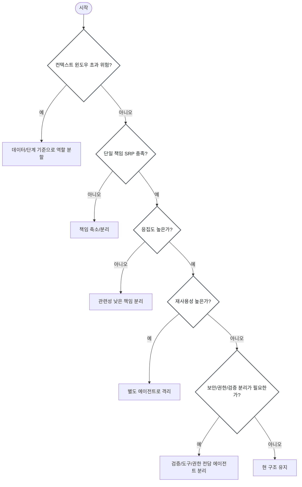

```mermaid
flowchart TD
    S([시작])
    Q1{"컨텍스트 윈도우 초과 위험?"}
    A1["데이터/단계 기준으로 역할 분할"]
    Q2{"단일 책임 SRP 충족?"}
    A2["책임 축소/분리"]
    Q3{"응집도 높은가?"}
    A3["관련성 낮은 책임 분리"]
    Q4{"재사용성 높은가?"}
    A4["별도 에이전트로 격리"]
    Q5{"보안/권한/검증 분리가 필요한가?"}
    A5["검증/도구/권한 전담 에이전트 분리"]
    A6["현 구조 유지"]

    S --> Q1
    Q1 -->|예| A1
    Q1 -->|아니오| Q2
    Q2 -->|아니오| A2
    Q2 -->|예| Q3
    Q3 -->|아니오| A3
    Q3 -->|예| Q4
    Q4 -->|예| A4
    Q4 -->|아니오| Q5
    Q5 -->|예| A5
    Q5 -->|아니오| A6

    classDef decision fill:#ffffff,stroke:#495057,stroke-width:2px,color:#212529
    class Q1,Q2,Q3,Q4,Q5 decision
```
