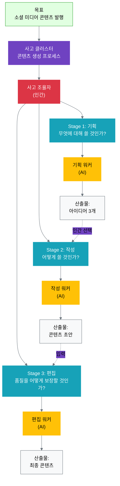
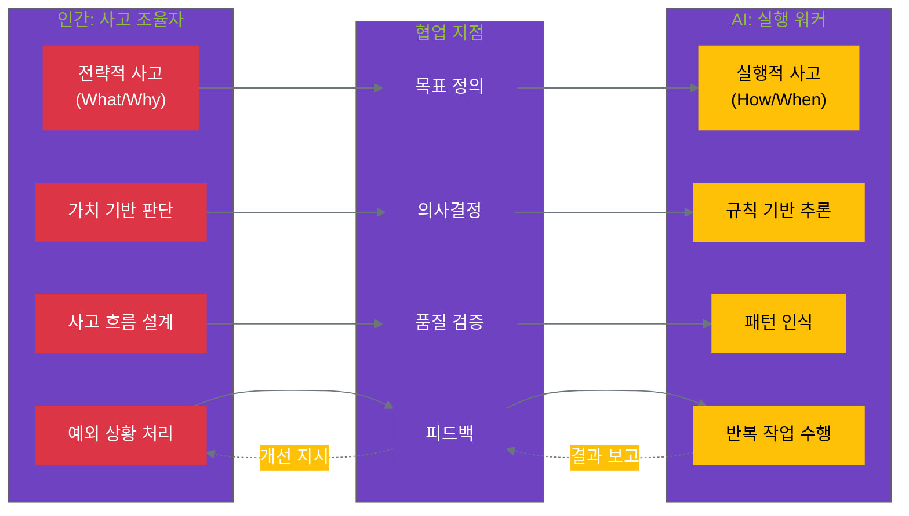

## 11.1 사고 클러스터의 기본 개념

### 11.1.1 단일 목표에서 사고 단위로

**목표의 복잡성**

전략적 목표는 종종 추상적이고 복잡합니다:
- "소셜 미디어에 콘텐츠 발행"
- "고객 데이터 분석 보고서 작성"
- "제품 비교 콘텐츠 생성"

이러한 목표를 **바로 실행 항목으로 변환**하려고 하면 문제가 발생합니다:
- 너무 애매해서 무엇을 해야 할지 불분명
- 중간 의사결정 지점이 명확하지 않음
- 품질 기준이 주관적이고 측정하기 어려움

**사고 클러스터의 역할**

사고 클러스터는 목표와 실행 사이의 **사고 계층**을 만듭니다:

```yaml
목표: 소셜 미디어에 콘텐츠 발행

사고 클러스터 (사고 프로세스 설계):
  사고_단계_1:
    이름: 콘텐츠 기획
    질문: "무엇에 대해 쓸 것인가?"
    추론: 타겟 독자 분석 → 주제 선정 → 메시지 정의
    
  사고_단계_2:
    이름: 콘텐츠 작성
    질문: "어떻게 쓸 것인가?"
    추론: 톤앤매너 결정 → 구조 설계 → 초안 작성
    
  사고_단계_3:
    이름: 콘텐츠 편집
    질문: "품질을 어떻게 보장할 것인가?"
    추론: 브랜드 가이드 검증 → 가독성 개선 → 최종 검토

실행 항목:
  - 타겟 독자 페르소나 정의 (워커 1)
  - 아이디어 3개 생성 (워커 1)
  - 선택된 아이디어로 초안 작성 (워커 2)
  - 톤앤매너 검증 (워커 3)
  - 최종본 완성 (워커 3)
```

**사고 분해 원칙**

효과적인 사고 클러스터를 설계하려면 다음 원칙을 따릅니다:

1. **명확한 질문**: 각 사고 단계는 하나의 핵심 질문에 답합니다
2. **논리적 흐름**: 사고 단계들이 자연스럽게 연결됩니다
3. **의사결정 지점**: 인간의 판단이 필요한 지점을 명시합니다
4. **검증 가능성**: 각 단계의 산출물을 평가할 수 있습니다

**기본 패턴 YAML**

```yaml
thinking_cluster:
  name: "콘텐츠 생성 사고 클러스터"
  goal: "소셜 미디어 콘텐츠 발행"
  
  coordinator:
    role: "사고 조율자"
    responsibilities:
      - "전체 사고 흐름 설계"
      - "워커들에게 작업 분배"
      - "의사결정 지점 관리"
      - "품질 검증"
  
  thinking_process:
    - stage: 1
      name: "기획"
      question: "무엇에 대해 쓸 것인가?"
      worker: "기획 워커"
      outputs:
        - "타겟 독자 페르소나"
        - "콘텐츠 아이디어 3개"
      decision_point: "인간이 아이디어 1개 선택"
    
    - stage: 2
      name: "작성"
      question: "어떻게 쓸 것인가?"
      worker: "작성 워커"
      inputs: ["선택된 아이디어"]
      outputs: ["콘텐츠 초안"]
    
    - stage: 3
      name: "편집"
      question: "품질을 어떻게 보장할 것인가?"
      worker: "편집 워커"
      inputs: ["콘텐츠 초안"]
      outputs: ["최종 콘텐츠"]
      quality_checks:
        - "브랜드 가이드 준수"
        - "가독성 (Flesch 점수 60+)"
        - "길이 (200자 이내)"
```

**사고 클러스터 기본 구조 다이어그램**



### 11.1.2 인간과 AI의 역할

사고 클러스터에서 인간과 AI는 명확한 역할 분담을 합니다.

**인간의 역할: 사고 조율자 (Thinking Coordinator)**

사고 조율자는 전체 사고 프로세스를 설계하고 관리합니다:

```yaml
thinking_coordinator:
  what_to_think:
    - "어떤 문제를 풀 것인가?" (목표 이해)
    - "어떤 순서로 생각할 것인가?" (사고 흐름)
    - "어떤 판단이 중요한가?" (의사결정 지점)
  
  why_to_think:
    - "왜 이 방향인가?" (전략적 맥락)
    - "핵심 가치는 무엇인가?" (판단 기준)
    - "성공의 정의는?" (품질 기준)
  
  responsibilities:
    - 사고 프로세스 설계
    - 의사결정 지점 관리
    - 품질 기준 정의
    - 예외 상황 처리
```

**AI의 역할: 실행 워커 (Execution Worker)**

실행 워커는 정의된 사고 프로세스에 따라 분석과 실행을 담당합니다:

```yaml
execution_worker:
  how_to_think:
    - "어떻게 분석할 것인가?" (데이터 처리)
    - "어떻게 생성할 것인가?" (콘텐츠 생성)
    - "어떻게 검증할 것인가?" (품질 확인)
  
  when_to_think:
    - "언제 시작하는가?" (트리거 조건)
    - "언제 멈추는가?" (완료 조건)
    - "언제 에스컬레이션하는가?" (예외 처리)
  
  responsibilities:
    - 데이터 분석 및 패턴 인식
    - 규칙 기반 추론
    - 콘텐츠 생성 및 변환
    - 반복 작업 수행
```

**역할 분담 표**

| 측면 | 사고 조율자 (인간) | 실행 워커 (AI) |
|------|----------------|--------------|
| **사고 수준** | 전략적 사고 (What/Why) | 실행적 사고 (How/When) |
| **의사결정** | 맥락적, 가치 기반 판단 | 규칙 기반, 데이터 기반 판단 |
| **창의성** | 새로운 접근 방식 창조 | 패턴 기반 생성 |
| **책임** | 전체 사고 흐름 설계 | 정의된 단계 실행 |
| **피드백** | 사고 프로세스 개선 | 실행 효율성 개선 |

**협업 사례**

**콘텐츠 생성 시나리오**:

```python
# 사고 조율자 (인간)
class ThinkingCoordinator:
    def design_thinking_process(self, goal):
        """
        목표: 소셜 미디어 콘텐츠 발행
        사고 프로세스 설계
        """
        return {
            'stage_1': {
                'question': '무엇에 대해 쓸 것인가?',
                'worker': 'ideation_worker',
                'decision': 'human_selects_idea'
            },
            'stage_2': {
                'question': '어떻게 쓸 것인가?',
                'worker': 'writing_worker',
                'quality': 'brand_guidelines'
            },
            'stage_3': {
                'question': '품질을 어떻게 보장할 것인가?',
                'worker': 'editing_worker',
                'criteria': ['readability', 'length', 'tone']
            }
        }
    
    def make_strategic_decision(self, ideas):
        """
        전략적 판단: 3개 아이디어 중 1개 선택
        - 타겟 적합성
        - 브랜드 일치성
        - 실행 가능성
        """
        # 인간의 맥락적 판단
        return selected_idea

# 실행 워커 (AI)
class ExecutionWorker:
    def analyze_and_generate(self, instruction, context):
        """
        분석 및 생성:
        - 타겟 독자 분석
        - 아이디어 생성
        - 콘텐츠 작성
        """
        # AI의 패턴 기반 실행
        return output
    
    def verify_quality(self, content, criteria):
        """
        품질 검증:
        - 브랜드 가이드 준수
        - 가독성 점수 계산
        - 길이 확인
        """
        # AI의 규칙 기반 검증
        return quality_report
```

**의사결정 지점 관리**

사고 조율자는 특정 지점에서 인간의 판단을 요청합니다:

```yaml
decision_points:
  - stage: "기획"
    when: "아이디어 3개 생성 후"
    question: "어떤 아이디어를 진행할 것인가?"
    human_role: "전략적 선택"
    ai_role: "옵션 제공 및 분석"
    
  - stage: "작성"
    when: "초안 완성 후"
    question: "톤이 브랜드에 맞는가?"
    human_role: "브랜드 적합성 판단"
    ai_role: "가이드라인 준수 여부 체크"
    
  - stage: "편집"
    when: "최종본 전"
    question: "발행 준비가 되었는가?"
    human_role: "최종 승인"
    ai_role: "체크리스트 검증"
```

**인간-AI 역할 분담 다이어그램**



### 11.1.3 사고 vs 실행 항목

사고 클러스터와 실행 항목의 차이를 명확히 이해하는 것이 중요합니다.

**사고 클러스터 (Thinking Cluster)**

**정의**: 어떻게 생각하고 추론할 것인가의 프로세스

**특징**:
- 추상적, 반복 가능
- 사고 흐름에 집중
- 다양한 상황에 적용 가능
- 개선 가능한 프로세스

**예시**:
```yaml
thinking_cluster: "콘텐츠 생성 사고 프로세스"
  - 타겟 이해 → 메시지 정의 → 구조 설계 → 초안 작성 → 편집
```

**실행 항목 (Execution Item)**

**정의**: 무엇을 구체적으로 할 것인가의 작업

**특징**:
- 구체적, 일회성
- 결과물에 집중
- 특정 상황에 맞춤
- 완료/미완료 판정 가능

**예시**:
```yaml
execution_items:
  - "AI 생산성 주제로 아이디어 3개 생성"
  - "선택된 아이디어로 200자 소셜 미디어 포스트 작성"
  - "브랜드 톤에 맞게 최종 편집"
```

**변환 프로세스**

사고 클러스터에서 실행 항목이 도출되는 과정:

```python
# 사고 클러스터 정의
thinking_cluster = {
    'name': '콘텐츠 생성 프로세스',
    'stages': [
        {'name': '기획', 'pattern': '타겟 분석 → 아이디어 생성'},
        {'name': '작성', 'pattern': '구조 설계 → 초안 작성'},
        {'name': '편집', 'pattern': '품질 검증 → 최종 수정'}
    ]
}

# 구체적 상황 (인풋)
context = {
    'topic': 'AI 생산성',
    'channel': '소셜 미디어',
    'length': '200자',
    'tone': '친근하고 전문적'
}

# 실행 항목 도출
def generate_execution_items(thinking_cluster, context):
    """
    사고 프로세스 + 구체적 맥락 → 실행 항목
    """
    items = []
    
    for stage in thinking_cluster['stages']:
        if stage['name'] == '기획':
            items.append({
                'task': f"{context['topic']} 주제로 아이디어 3개 생성",
                'worker': 'ideation_worker',
                'output': '아이디어 리스트'
            })
        
        elif stage['name'] == '작성':
            items.append({
                'task': f"선택된 아이디어로 {context['length']} {context['tone']} 톤의 포스트 작성",
                'worker': 'writing_worker',
                'output': '콘텐츠 초안'
            })
        
        elif stage['name'] == '편집':
            items.append({
                'task': f"브랜드 가이드 준수 확인 및 최종 편집",
                'worker': 'editing_worker',
                'output': '최종 콘텐츠'
            })
    
    return items

# 결과
execution_items = generate_execution_items(thinking_cluster, context)
```

**출력 결과**:

```yaml
execution_items:
  - task: "AI 생산성 주제로 아이디어 3개 생성"
    worker: "ideation_worker"
    output: "아이디어 리스트"
    estimated_time: "5분"
    
  - task: "선택된 아이디어로 200자 친근하고 전문적인 톤의 포스트 작성"
    worker: "writing_worker"
    input: "선택된 아이디어"
    output: "콘텐츠 초안"
    estimated_time: "10분"
    
  - task: "브랜드 가이드 준수 확인 및 최종 편집"
    worker: "editing_worker"
    input: "콘텐츠 초안"
    output: "최종 콘텐츠"
    quality_checks:
      - "길이: 200자 이내"
      - "톤: 브랜드 가이드 일치"
      - "가독성: Flesch 점수 60+"
    estimated_time: "5분"
```

**비교표**

| 측면 | 사고 클러스터 | 실행 항목 |
|------|-------------|----------|
| **추상화 수준** | 높음 (프로세스) | 낮음 (작업) |
| **재사용성** | 높음 (다양한 상황) | 낮음 (특정 상황) |
| **측정 가능성** | 프로세스 품질 | 결과물 품질 |
| **개선 대상** | 사고 흐름 | 실행 효율 |
| **예시** | "타겟 이해 → 아이디어 생성" | "AI 생산성 주제 아이디어 3개" |

**핵심 통찰**

1. **사고 클러스터는 템플릿**: 반복 사용 가능한 사고 프로세스
2. **실행 항목은 인스턴스**: 특정 상황에 적용된 구체적 작업
3. **변환은 자동화 가능**: 사고 프로세스 + 맥락 → 실행 항목
4. **개선은 각각 독립적**: 사고 개선 ≠ 실행 개선

---