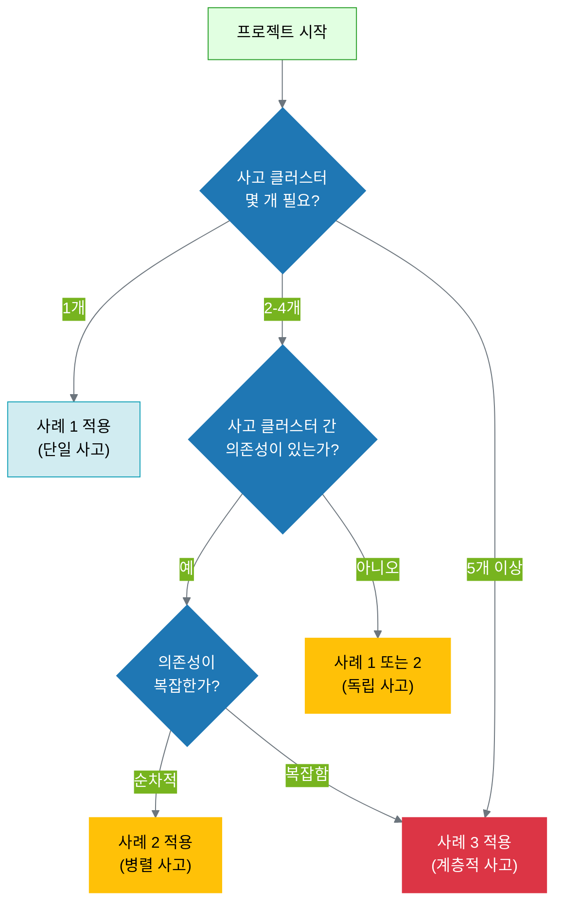

# 14.4 실전 적용 가이드

**목적**: 3가지 사례에서 배운 패턴을 자신의 프로젝트에 적용하기

---

## 14.4.1 3가지 사례의 공통 패턴

### 모든 사례에 공통된 요소

**1. 6계층 전체 설계**

모든 사례는 AI 사고 생태계의 6계층을 완전히 설계합니다:

```yaml
공통_구조:
  1층_미션: "조직의 존재 이유를 명확히 정의"
  2층_핵심_가치: "모든 의사결정의 기준 (3-4개)" ⭐
  3층_비전: "미래의 desirable 상태"
  4층_목표: "구체적이고 측정 가능한 목표"
  5층_사고_클러스터: "목표를 사고 단위로 분해"
  6층_파일_시스템: "사고 결과를 파일로 구현"

핵심_원칙:
  - 핵심 가치(2층)가 모든 계층의 의사결정 기준
  - 각 계층이 명확히 정의됨
  - 상위 계층이 하위 계층의 방향 제시
```

**2. 4단계 사고 프로세스 (11장 패턴)**

모든 사고 클러스터는 동일한 4단계를 따릅니다:

```yaml
4단계_사고:
  Stage_1_Planning: "발산적 - 가능한 모든 옵션 탐색"
  Stage_2_Reasoning: "수렴적 - 핵심 가치 기반 선택"
  Stage_3_Experimenting: "생성적 - 초안 작성 및 반복"
  Stage_4_Reflecting: "비판적 - 품질 검증 및 개선"

모든_Stage:
  - thinking_record.json: 사고 과정 기록
  - 산출물: Stage별 구체적 결과물
  - thinking_state.json 업데이트
```

**3. 파일 시스템 구조 (13장 원칙)**

모든 사례는 13.2의 3가지 원칙을 따릅니다:

```yaml
파일_구조_원칙:
  격리_Isolation:
    - 각 작업/사고 클러스터는 독립된 디렉토리
    - /tasks/ 또는 /projects/ 하위에 분리
    
  공유_Sharing:
    - /shared/에 공통 자원 (core_values.json, templates)
    - 중복 제거 (Single Source of Truth)
    
  명명_Naming:
    - 일관된 이름 규칙 (task-XXX, tc-XXX)
    - 날짜 또는 순차 번호 사용

필수_파일:
  - thinking_state.json: 각 사고 클러스터의 진행 상황
  - thinking_record.json: 각 Stage의 사고 내용
  - 산출물: 각 Stage의 구체적 결과
```

**4. 피드백 루프 (6층 → 2층)**

모든 사례는 피드백 루프를 구현합니다:

```yaml
피드백_루프:
  6층_실행_결과:
    - 산출물 완성 (파일)
    - 성과 데이터 수집 (metrics)
  
  5층_사고_개선:
    - 사고 프로세스 분석
    - 성공/실패 요인 파악
    - 다음 사고 클러스터에 반영
  
  4층_목표_조정:
    - 목표 달성 가능성 평가
    - 필요 시 목표 조정
  
  2층_핵심_가치_재확인:
    - 핵심 가치 정렬 검증
    - 필요 시 핵심 가치 재해석
```

### 사례별 차별화 요소

| 요소 | 사례 1 | 사례 2 | 사례 3 |
|------|--------|--------|--------|
| **사고 클러스터 수** | 1개 | 3개 (병렬) | 5개 (1 메타 + 4 실행) |
| **의존성** | 없음 | 순차 (TC-001→002→003) | 복잡 (그래프 구조) |
| **조율 메커니즘** | 불필요 | dependencies.json | 메타 조율자 + dependencies.json |
| **파일 구조** | 단일 계층 | 병렬 구조 | 다층 계층 (/meta + /thinking) |
| **통합** | 불필요 | TC-003이 통합 | 메타 조율자가 최종 통합 |
| **복잡도** | ⭐⭐ | ⭐⭐⭐ | ⭐⭐⭐⭐⭐ |
| **적용 대상** | 단순 작업 | 데이터/분석 | 다팀 협력 프로젝트 |

---

## 14.4.2 프로젝트 복잡도별 선택 가이드

### 의사결정 트리

자신의 프로젝트가 어느 사례에 가까운지 판단하세요:



### 사례별 선택 기준

#### 사례 1: 단일 사고 클러스터

**언제 사용하는가?**
- [ ] 하나의 명확한 목표
- [ ] 4단계 사고 프로세스로 완료 가능
- [ ] 다른 사고와 의존성 없음
- [ ] 2-3시간 내 완료 가능

**예시 프로젝트**:
- 블로그 포스트 작성
- 이메일 캠페인 설계
- 간단한 보고서 작성
- 단일 기능 개발

**장점**:
- 간단하고 빠름
- 파일 구조가 단순
- 학습 곡선이 낮음

**단점**:
- 복잡한 프로젝트에는 부적합
- 병렬 작업 불가

#### 사례 2: 병렬 사고 클러스터

**언제 사용하는가?**
- [ ] 2-4개의 명확한 작업 단계
- [ ] 각 단계가 이전 단계의 결과 필요 (순차 의존성)
- [ ] 데이터 + 코드 통합 필요
- [ ] 재현성이 중요

**예시 프로젝트**:
- 데이터 분석 파이프라인
- 연구 프로젝트 (문헌 조사 → 실험 → 분석 → 논문)
- 제품 개발 (요구사항 → 설계 → 구현 → 테스트)

**장점**:
- 복잡한 워크플로우 관리 가능
- 의존성이 명확
- 재현 가능한 결과

**단점**:
- 사례 1보다 복잡
- 의존성 관리 필요
- 순차 실행으로 시간 소요

#### 사례 3: 계층적 사고 클러스터

**언제 사용하는가?**
- [ ] 5개 이상의 사고 클러스터
- [ ] 복잡한 의존성 (그래프 구조)
- [ ] 여러 팀 협력 필요
- [ ] 전체 일관성 유지가 중요
- [ ] 전략적 조율 필요

**예시 프로젝트**:
- 신제품 런칭
- 조직 재편
- 대규모 마케팅 캠페인
- 복잡한 시스템 설계

**장점**:
- 매우 복잡한 프로젝트 관리 가능
- 메타 조율자가 일관성 유지
- 팀 간 협력 체계화

**단점**:
- 가장 복잡
- 학습 곡선이 높음
- 메타 조율자 역할 필수

---

## 14.4.3 체크리스트: "내 프로젝트는 어느 사례에 가까운가?"

### Step 1: 기본 질문

**질문 1: 사고 클러스터가 몇 개 필요한가?**

```yaml
판단_기준:
  1개:
    - 하나의 명확한 목표
    - 4단계 사고로 완료 가능
    → 사례 1 검토
  
  2-4개:
    - 여러 단계가 필요
    - 각 단계가 구분됨
    → 사례 2 검토
  
  5개 이상:
    - 매우 복잡한 프로젝트
    - 여러 팀 협력
    → 사례 3 검토
```

**질문 2: 사고 클러스터 간 의존성이 있는가?**

```yaml
의존성_유형:
  없음:
    - 각 사고가 독립적
    → 사례 1 (여러 개 병렬 실행) 또는 사례 2 수정
  
  순차적:
    - A 완료 → B 시작 → C 시작
    - 단방향 의존성
    → 사례 2
  
  복잡함:
    - A, B 완료 → C 시작
    - C, D 완료 → E 시작
    - 그래프 구조
    → 사례 3
```

**질문 3: 전체 조율이 필요한가?**

```yaml
조율_필요성:
  불필요:
    - 각 사고가 독립적
    - 일관성 유지 자동
    → 사례 1 또는 2
  
  필요:
    - 전체 일관성 유지 중요
    - 팀 간 조율 필수
    - 전략적 의사결정 필요
    → 사례 3
```

### Step 2: 프로젝트 특성 체크

**데이터 및 코드 요구사항**:
- [ ] 데이터 수집 및 정제가 필요한가? → 사례 2 적합
- [ ] 재현 가능한 분석이 필요한가? → 사례 2 적합
- [ ] 코드 버전 관리가 중요한가? → 사례 2 적합

**팀 협력 요구사항**:
- [ ] 여러 팀이 협력하는가? → 사례 3 검토
- [ ] 팀 간 의사소통이 중요한가? → 사례 3 검토
- [ ] 전체 전략 조율이 필요한가? → 사례 3 필수

**시간 및 리소스**:
- [ ] 2-3시간 내 완료 가능한가? → 사례 1 적합
- [ ] 4-6시간 소요 예상인가? → 사례 2 적합
- [ ] 1주일 이상 소요 예상인가? → 사례 3 검토

### Step 3: 최종 결정

**결정 매트릭스**:

| 체크 항목 | 사례 1 | 사례 2 | 사례 3 |
|----------|--------|--------|--------|
| 사고 클러스터 수 | 1개 | 2-4개 | 5개 이상 |
| 의존성 | 없음 | 순차 | 복잡 |
| 조율 필요성 | 불필요 | 의존성만 | 메타 조율자 |
| 데이터+코드 | 선택 | 필수 | 필수 |
| 팀 협력 | 1명 | 1-2명 | 3명 이상 |
| 소요 시간 | 2-3h | 4-6h | 1주일+ |

**추천 흐름**:
```
1. 가장 간단한 사례부터 시작 (사례 1)
2. 복잡도 증가 시 사례 2로 확장
3. 정말 필요할 때만 사례 3 사용
```

---

## 14.4.4 자주 하는 실수 및 해결책

### 실수 1: 처음부터 사례 3로 시작

**증상**:
- 복잡한 메타 조율자 구조를 만들었지만 사용하지 않음
- 파일 구조가 과도하게 복잡
- 실제 작업보다 구조 설계에 더 많은 시간 소요

**원인**:
- "완벽한 시스템"을 미리 만들려는 욕심
- 프로젝트 복잡도를 과대평가

**해결책**:
```yaml
점진적_확장:
  Step 1: 사례 1로 시작
    - 하나의 사고 클러스터로 프로토타입
    - 실제 작동 확인
  
  Step 2: 필요 시 사례 2로 확장
    - 2-3개 사고 클러스터 추가
    - 의존성 관리 도입
  
  Step 3: 정말 필요할 때 사례 3
    - 5개 이상 사고 클러스터
    - 메타 조율자 추가

원칙: "지금 필요한 최소한의 복잡도만 사용"
```

### 실수 2: 의존성 무시

**증상**:
- TC-002가 TC-001의 결과를 기다리지 않고 시작
- 파일을 찾을 수 없다는 에러 발생
- 재작업 필요

**원인**:
- dependencies.json을 만들지 않음
- 의존성 체크 없이 바로 실행

**해결책**:
```yaml
의존성_관리_프로세스:
  Step 1: dependencies.json 작성
    - 각 사고 클러스터의 depends_on 명시
    - 필요한 입력 파일 나열
  
  Step 2: 실행 전 의존성 체크
    - depends_on의 모든 사고가 완료되었는가?
    - 필요한 파일이 존재하는가?
  
  Step 3: 의존성 충족 후 시작
    - ✅ 체크 완료 → 사고 시작
    - ❌ 체크 실패 → 대기 또는 에러

도구: Python 스크립트로 자동 체크 가능
```

### 실수 3: 핵심 가치를 의사결정에 사용하지 않음

**증상**:
- Stage 2 (Reasoning)에서 주관적 판단
- 일관성 없는 의사결정
- 피드백 시 개선 방향 불명확

**원인**:
- 핵심 가치를 "장식"으로만 정의
- 실제 의사결정에 적용하지 않음

**해결책**:
```yaml
핵심_가치_활용:
  Stage_2_Reasoning:
    - 각 옵션을 핵심 가치 기준으로 평가
    - 점수화 (각 가치당 0-10점)
    - 선택 근거에 핵심 가치 명시
  
  예시 (사례 1):
    옵션_A:
      accuracy: 9 ("검증된 통계 사용")
      clarity: 7 ("다소 복잡")
      originality: 6 ("흔한 주제")
    
    옵션_B:
      accuracy: 8 ("검증 가능")
      clarity: 9 ("매우 명료")
      originality: 9 ("독창적 각도")
    
    선택: 옵션_B (총점 26 > 옵션_A 22)
    근거: "명료성과 독창성에서 우수"

원칙: "모든 의사결정에 핵심 가치 적용"
```

### 실수 4: thinking_state.json을 업데이트하지 않음

**증상**:
- 진행 상황을 알 수 없음
- "지금 어느 단계인가?" 질문에 답할 수 없음
- 재개 시 어디서부터 시작할지 모름

**원인**:
- 파일 업데이트를 잊어버림
- 상태 추적의 중요성을 인식하지 못함

**해결책**:
```yaml
상태_업데이트_루틴:
  Stage_시작_시:
    - current_stage 변경
    - started_at 타임스탬프 기록
    - status: "in_progress"
  
  Stage_완료_시:
    - completed_at 타임스탬프 기록
    - status: "completed"
    - output_files 나열
  
  자동화:
    - Python 스크립트로 자동 업데이트
    - 또는 매 Stage 끝에 수동 업데이트

원칙: "각 Stage 전후에 thinking_state.json 업데이트 필수"
```

### 실수 5: 피드백 루프를 구현하지 않음

**증상**:
- 프로젝트 완료 후 개선 없음
- 같은 실수 반복
- 시스템이 학습하지 않음

**원인**:
- 피드백 수집을 생각하지 않음
- "한 번 끝나면 끝"이라는 태도

**해결책**:
```yaml
피드백_루프_구현:
  6층_산출물_평가:
    - 목표 달성 여부 확인
    - 성과 데이터 수집
    - 사용자/고객 반응 수집
  
  5층_사고_개선:
    - 어떤 Stage가 잘 작동했는가?
    - 어떤 Stage에서 어려움이 있었는가?
    - 다음에는 어떻게 개선할 것인가?
  
  4층_목표_조정:
    - 목표가 적절했는가?
    - 너무 높거나 낮았는가?
    - 다음 목표는?
  
  2층_핵심_가치_재확인:
    - 핵심 가치가 실제로 작동했는가?
    - 강화 또는 조정 필요한가?

주기: 최소 월 1회 피드백 분석
```

---

## 14.4.5 점진적 확장 로드맵

### Step 1: 사례 1로 시작 (1주)

```yaml
목표: "가장 간단한 단일 사고 클러스터 숙달"

주간_계획:
  Day 1-2: 6계층 설계
    - 미션, 핵심 가치, 비전, 목표 정의
    - 하나의 간단한 프로젝트 선택
  
  Day 3-4: 사고 클러스터 실행
    - 4단계 모두 실행
    - thinking_state.json 업데이트
    - 산출물 완성
  
  Day 5: 피드백 및 회고
    - 무엇이 잘 되었는가?
    - 무엇이 어려웠는가?
    - 다음에는?

성공_기준:
  - [ ] 6계층 모두 정의됨
  - [ ] 4단계 사고 프로세스 완료
  - [ ] 파일 구조가 13장 원칙에 부합
  - [ ] 피드백 루프 1회 실행
```

### Step 2: 사례 2로 확장 (2주)

```yaml
목표: "병렬 사고 클러스터 및 의존성 관리 숙달"

주간_계획:
  Week 1: 병렬 사고 클러스터 설계
    - 2-3개 사고 클러스터 정의
    - dependencies.json 작성
    - 의존성 확인 프로세스 수립
  
  Week 2: 실행 및 통합
    - 순차적으로 실행 (의존성 체크)
    - 각 사고 클러스터 산출물 통합
    - 피드백 루프 실행

성공_기준:
  - [ ] 2-3개 사고 클러스터 완료
  - [ ] dependencies.json 작동
  - [ ] 데이터+코드 통합 (해당 시)
  - [ ] 재현성 100% 달성 (해당 시)
```

### Step 3: 사례 3으로 진화 (필요 시)

```yaml
목표: "계층적 사고 및 메타 조율자 숙달"

전제_조건:
  - [ ] 사례 1, 2를 각각 2회 이상 성공적으로 완료
  - [ ] 5개 이상 사고 클러스터가 필요한 프로젝트 존재
  - [ ] 팀 협력 또는 전략적 조율 필요

주간_계획:
  Week 1: 메타 조율자 및 전체 구조 설계
    - 메타 조율자 역할 정의
    - 4-5개 실행 사고 클러스터 설계
    - 복잡한 의존성 매핑
  
  Week 2-3: 실행 및 조율
    - 메타 조율자가 각 사고 클러스터 조율
    - 중간 산출물 검증 및 피드백
    - 전체 통합
  
  Week 4: 통합 및 피드백
    - 4-5개 산출물 통합
    - 전체 일관성 검증
    - 메타 조율자 역할 회고

성공_기준:
  - [ ] 메타 조율자 역할 수행 완료
  - [ ] 4-5개 사고 클러스터 조율 성공
  - [ ] 전체 일관성 유지 (핵심 가치 정렬)
  - [ ] 통합 산출물 완성
```

---

## 14.4.6 최종 요약

### 14장에서 배운 것

**1. 6계층 전체 통합**
- AI 사고 생태계의 6계층을 실전에 완전히 적용
- 미션(1층) → 핵심 가치(2층) → ... → 파일 시스템(6층)
- 핵심 가치가 모든 계층의 의사결정 기준

**2. 3가지 복잡도 수준**
- 사례 1: 단일 사고 클러스터 (입문)
- 사례 2: 병렬 사고 클러스터 (중급)
- 사례 3: 계층적 사고 클러스터 (고급)

**3. 파일 시스템의 실전 가치**
- 사고 과정의 영속성, 공유성, 추적성
- 재현 가능한 분석 및 의사결정
- 팀 협업의 기반

**4. 피드백 루프의 힘**
- 6층(실행) → 5층(사고) → 4층(목표) → 2층(가치)
- 데이터 기반 시스템 개선
- 지속적 학습 및 진화

### 다음 단계

**Part 4 완성**:
- ✅ 11장: 단일 사고 클러스터 (이론)
- ✅ 12장: 계층적 사고 클러스터 (이론)
- ✅ 13장: 파일 시스템 구현 (이론)
- ✅ 14장: 실전 사례 (실습)
- ✅ 15장: 프롬프트 엔지니어링 (기술)
- ⏳ 16장: 에이전트 설계 (예정)

**실전 적용**:
1. 사례 1로 시작 (간단한 프로젝트)
2. 필요 시 사례 2로 확장
3. 정말 필요할 때만 사례 3 사용

**핵심 원칙**:
```
"지금 필요한 최소한의 복잡도만 사용하라"
"6계층 전체를 항상 설계하라"
"핵심 가치를 모든 의사결정에 적용하라"
"피드백 루프를 반드시 구현하라"
```

---

**축하합니다!** 14장을 완료했습니다. 이제 AI와 협업하여 복잡한 프로젝트를 체계적으로 관리할 수 있는 완전한 도구를 갖추었습니다. 🎉
