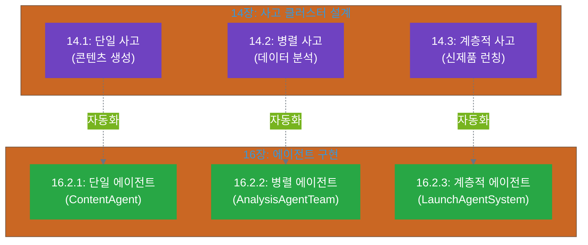

# 16장. 에이전트 설계: 사고 클러스터를 자율 실행 시스템으로

**핵심 질문**: 사고 클러스터를 자율적으로 실행되는 에이전트 팀으로 어떻게 변환할까?

---

## 도입

Part 4를 통해 우리는 AI 사고 생태계의 핵심을 배웠습니다. 사고 클러스터를 설계하고(11-12장), 파일 시스템으로 구현하며(13장), 실전 프로젝트에 통합하는(14장) 방법이었죠. 하지만 여기에는 중요한 전제가 하나 있었습니다: **인간이 사고 프로세스를 주도하고 AI가 개별 작업을 돕는다**는 것입니다.

이제 한 단계 더 나아가 보겠습니다. 사고 클러스터의 많은 부분, 특히 반복적이고 규칙적인 부분은 **에이전트(Agent)**가 자율적으로 실행할 수 있습니다. 인간은 전략 수립과 핵심 판단에 집중하고, 에이전트가 사고 프로세스를 자율적으로 수행하는 시스템입니다.

**16장에서는 11-14장에서 배운 사고 클러스터를 에이전트 팀으로 변환하는 방법을 다룹니다.**

### 에이전트 설계가 중요한 이유

사고 클러스터를 손으로 실행하는 것과 에이전트로 자동화하는 것의 차이는 무엇일까요?

**수동 사고 클러스터** (11-14장):
```yaml
인간의 역할:
  - 각 Stage마다 프롬프트 작성
  - AI 응답 검토 및 다음 단계 판단
  - 파일 생성/업데이트 수동 관리
  - thinking_state.json 수동 업데이트

장점: 완전한 통제, 유연한 조정
단점: 시간 소요, 반복 작업, 확장성 한계
```

**에이전트 시스템** (16장):
```yaml
인간의 역할:
  - 초기 설정 (목표, 핵심 가치, 제약조건)
  - 중요한 의사결정 지점에서만 개입
  - 최종 결과 검토 및 승인

에이전트의 역할:
  - 사고 프로세스 자율 실행
  - 파일 시스템 자동 관리
  - 상태 추적 및 진행 보고
  - 문제 발생 시 인간에게 알림

장점: 효율성, 확장성, 일관성
적용: 반복적 프로젝트, 대량 작업
```

**예시: 콘텐츠 생성 워크플로우**

| 단계 | 수동 (14.1) | 에이전트 (16장) |
|------|-------------|----------------|
| **1. 아이디어 발산** | 인간이 프롬프트 작성 → AI 실행 → 결과 저장 (15분) | 에이전트가 자동 실행 → ideas.json 생성 (5분) |
| **2. 아이디어 선택** | 인간이 ideas.json 읽고 → 프롬프트 작성 → 평가 → 선택 (10분) | 에이전트가 핵심 가치 기준으로 자동 평가 → selected.json 생성 (3분) |
| **3. 초안 작성** | 인간이 선택된 아이디어로 → 프롬프트 작성 → 초안 생성 (20분) | 에이전트가 자동 작성 → draft_v1.md 생성 (8분) |
| **4. 품질 검증** | 인간이 품질 기준 확인 → 수정 필요 시 반복 (15분) | 에이전트가 자동 검증 → 문제 발견 시 인간에게 알림 (5분) |
| **총 시간** | 60분 (인간 개입 많음) | 21분 (인간은 초기 설정과 최종 승인만) |

**에이전트의 가치**:
1. **효율성**: 반복 작업을 자동화하여 시간 절약 (3배 빠름)
2. **확장성**: 동시에 여러 작업 실행 (10개 콘텐츠를 병렬로)
3. **일관성**: 항상 같은 품질 기준과 프로세스 적용
4. **추적성**: 모든 단계가 자동으로 기록됨

### 에이전트와 사고 클러스터의 관계

에이전트는 사고 클러스터의 **자율 실행 버전**입니다. 사고 클러스터가 "어떤 사고를 해야 하는가"를 정의한다면, 에이전트는 "그 사고를 어떻게 자율적으로 실행할 것인가"를 구현합니다.

```yaml
사고 클러스터 (5층):
  개념: "무엇을 사고할 것인가"
  정의:
    - Stage: planning, reasoning, experimenting, reflecting
    - 각 Stage의 목적과 활동
    - Human-in-the-Loop 지점
  
에이전트 (5층 구현체):
  개념: "사고를 어떻게 자율 실행할 것인가"
  구현:
    - Stage별 프롬프트 템플릿
    - 파일 I/O 자동화
    - 상태 추적 로직
    - 오류 처리 및 인간 개입 트리거
```

**매핑 관계**:
```
사고 클러스터 (설계)   →   에이전트 (구현)
──────────────────────────────────────────
Stage 1: planning       →   PlanningAgent
Stage 2: reasoning      →   ReasoningAgent
Stage 3: experimenting  →   ExperimentAgent
Stage 4: reflecting     →   ReflectionAgent

사고 조율자             →   CoordinatorAgent
사고 실행 워커           →   WorkerAgent
메타 조율자             →   MetaCoordinatorAgent
```

### 에이전트 vs 단순 자동화

에이전트는 단순한 스크립트나 자동화와 다릅니다.

**단순 자동화**:
```text
단순 스크립트의 동작 흐름:

1. AI에게 "아이디어 10개 생성" 요청
2. 항상 첫 번째 아이디어 자동 선택
3. 선택된 아이디어로 "초안 작성" 요청
4. 결과 반환

특징:
- 고정된 순서로만 실행
- 조건 판단 없음
- 항상 같은 방식으로 동작
- 상황 변화에 대응 불가
```

**에이전트 시스템**:
```text
에이전트의 지능적 동작 흐름:

1. 준비 단계
   - 핵심 가치 설정 (미션, 가치관)
   - 제약조건 정의 (길이, 톤, 형식 등)
   - 상태 추적 시스템 준비

2. Stage 1: Planning (계획 수립)
   - 현재 상태를 "planning"으로 업데이트
   - 상황에 맞는 프롬프트 자동 생성
   - 아이디어 발산 실행

3. Stage 2: Reasoning (판단 및 선택)
   - 현재 상태를 "reasoning"으로 업데이트
   - 설정된 핵심 가치 기준으로 평가
   - 최적의 아이디어 선택

4. Stage 3: Experimenting (실행)
   - 제약조건 자동 확인
   - 조건 충족 시 → 초안 작성 진행
   - 조건 미충족 시 → 인간에게 알림 전송

5. Stage 4: Reflecting (검증)
   - 품질 기준 자동 검증
   - 기준 미달 시 → 인간에게 알림
   - 기준 통과 시 → 작업 완료

에이전트의 핵심 특징:
- 상태 추적: 현재 어느 단계인지 항상 파악
- 조건부 실행: 상황에 따라 다른 행동 선택
- 오류 처리: 문제 발생 시 적절히 대응
- Human-in-the-Loop: 필요할 때만 인간 개입 요청
- 학습 능력: 과거 결과를 참고하여 개선
```

**에이전트의 특징**:
1. **상태 추적**: 현재 어느 Stage인지 추적
2. **조건부 실행**: 상황에 따라 다른 행동
3. **오류 처리**: 문제 발생 시 대응
4. **Human-in-the-Loop**: 필요 시 인간 개입 요청
5. **학습**: 과거 결과를 참고하여 개선

### 16장의 구조: 14장 사례를 에이전트로

16장은 14장의 3가지 실전 사례를 에이전트로 구현하는 방법을 다룹니다.



### 16장에서 다룰 내용

이 장은 4개의 섹션으로 구성됩니다:

**16.1 사고 클러스터에서 에이전트로**
- 에이전트의 정의와 특성
- 사고 클러스터와 에이전트의 매핑 관계
- 에이전트 설계의 핵심 원칙
- 언제 에이전트가 필요한가 (vs 수동 사고)

**16.2 에이전트 팀 설계**
- 16.2.1 단일 에이전트 (14.1 사례 기반)
  - `ContentAgent`: 콘텐츠 생성 워크플로우
  - 4개 Stage를 자율 실행하는 구조
  
- 16.2.2 병렬 에이전트 (14.2 사례 기반)
  - `AnalysisAgentTeam`: 데이터 수집 → 분석 → 인사이트
  - 3개 에이전트 간 의존성 관리
  
- 16.2.3 계층적 에이전트 (14.3 사례 기반)
  - `LaunchAgentSystem`: 메타 조율자 + 4개 실행 에이전트
  - 복잡한 다층 구조의 자율 실행

**16.3 에이전트 구현 가이드**
- 16.3.1 구현 옵션 비교
  - API 직접 호출 (Python, JavaScript)
  - 에이전트 프레임워크 (LangChain, AutoGPT 등)
  - 클라우드 서비스 (Claude API, OpenAI Assistants)
  
- 16.3.2 핵심 구현 패턴
  - 상태 머신 패턴
  - 파일 I/O 자동화
  - 오류 처리 및 재시도
  - Human-in-the-Loop 구현
  
- 16.3.3 배포 및 모니터링
  - 에이전트 실행 환경
  - 로깅 및 디버깅
  - 성능 모니터링
  
- 16.3.4 비용 및 성능 최적화
  - API 호출 최소화
  - 캐싱 전략
  - 병렬 실행 최적화

**16.4 에이전트 설계 체크리스트**
- 16.4.1 설계 체크리스트
  - 에이전트가 필요한가?
  - 어느 부분을 자동화할 것인가?
  - Human-in-the-Loop 지점은?
  
- 16.4.2 자주 하는 실수
  - 너무 많은 자동화
  - 오류 처리 부족
  - 상태 추적 미흡
  
- 16.4.3 Part 4 요약
  - 11-16장 통합 정리
  - 사고 중심 조직의 완성
  
- 16.4.4 다음 단계
  - Part 5 예고 (시스템 확장과 운영)
  - 추가 학습 자료

### 학습 목표

이 장을 마치면 다음을 할 수 있습니다:

1. **에이전트 설계**: 사고 클러스터를 에이전트로 변환하는 방법을 이해하고 설계할 수 있습니다. 단일, 병렬, 계층적 구조 모두 에이전트로 구현할 수 있습니다.

2. **자동화 범위 결정**: 어느 부분을 에이전트가 자율 실행하고, 어느 부분에서 인간이 개입할지 판단할 수 있습니다. Human-in-the-Loop 지점을 적절히 설정할 수 있습니다.

3. **구현 선택**: 자신의 상황에 맞는 구현 방법(API, 프레임워크, 서비스)을 선택하고 적용할 수 있습니다.

4. **에이전트 팀 조율**: 여러 에이전트가 협업하는 시스템을 설계하고 의존성을 관리할 수 있습니다.

5. **실전 적용**: 자신의 프로젝트에서 에이전트를 활용하여 사고 프로세스를 자동화할 수 있습니다.

### 사고 클러스터 → 에이전트 변환 미리보기

간단한 예시로 14.1의 콘텐츠 생성 사고 클러스터를 에이전트로 변환하는 과정을 살펴봅시다:

**14.1: 수동 사고 클러스터**
```yaml
# 인간이 각 단계마다 실행
Stage 1 (planning):
  - 인간: 프롬프트 작성 ("10개 아이디어 생성")
  - AI: 아이디어 생성
  - 인간: ideas.json 저장

Stage 2 (reasoning):
  - 인간: ideas.json 읽기
  - 인간: 프롬프트 작성 ("핵심 가치로 평가")
  - AI: 평가 및 선택
  - 인간: selected.json 저장

Stage 3 (experimenting):
  - 인간: selected.json 읽기
  - 인간: 프롬프트 작성 ("초안 작성")
  - AI: 초안 생성
  - 인간: draft_v1.md 저장

Stage 4 (reflecting):
  - 인간: draft_v1.md 읽기
  - 인간: 프롬프트 작성 ("품질 검증")
  - AI: 품질 리포트
  - 인간: 최종 판단
```

**16.2.1: ContentAgent (자동화)**
```yaml
ContentAgent 구조:

초기_설정:
  핵심_가치:
    mission: "블로그 독자에게 실질적 가치 제공"
    values: ["명확성", "실용성", "친근함"]
  
  제약조건:
    길이: 1500-2000자
    톤: 친근하고 실용적
    형식: 마크다운
  
  상태_추적:
    task_id: "content-001"
    현재_stage: null
    시작_시간: null

실행_흐름:
  
  1단계_Planning:
    입력: 핵심 가치, 미션
    처리:
      - 상태를 "planning"으로 업데이트
      - AI에게 프롬프트 전달:
        "미션: [mission]
         핵심 가치: [values]
         10개의 블로그 포스트 아이디어를 생성하세요."
      - AI가 10개 아이디어 생성
    출력: ideas.json 파일 자동 저장
    오류_처리: 생성 실패 시 인간에게 알림
  
  2단계_Reasoning:
    입력: ideas.json
    처리:
      - 상태를 "reasoning"으로 업데이트
      - 각 아이디어를 핵심 가치 기준으로 평가
      - 가장 적합한 아이디어 선택
    출력: selected.json 파일 자동 저장
    오류_처리: 평가 실패 시 인간에게 알림
  
  3단계_Experimenting:
    입력: selected.json
    처리:
      - 상태를 "experimenting"으로 업데이트
      - 제약조건 확인 (길이, 톤, 형식)
      - 조건 충족 시: 선택된 아이디어로 초안 작성
      - 조건 미충족 시: 인간에게 알림
    출력: draft_v1.md 파일 자동 저장
    오류_처리: 작성 실패 또는 제약조건 위반 시 알림
  
  4단계_Reflecting:
    입력: draft_v1.md
    처리:
      - 상태를 "reflecting"으로 업데이트
      - 품질 기준 자동 검증:
        * 핵심 가치 반영 여부
        * 제약조건 준수 여부
        * 독자 가치 제공 여부
      - 통과 시: 작업 완료
      - 미달 시: 인간에게 품질 리포트와 함께 알림
    출력: quality_report.json
    오류_처리: 검증 실패 시 상세 리포트 제공

전체_오류_처리:
  - 각 단계에서 오류 발생 시
  - 현재 상태와 오류 내용을 기록
  - 인간에게 알림 전송
  - 상태 저장 후 작업 중단
  - 이후 같은 지점부터 재개 가능

인간_개입_지점:
  - 제약조건 위반 발생 시
  - 품질 기준 미달 시
  - 예상치 못한 오류 발생 시
  - 최종 승인 단계
```

**차이점**:
- **인간의 역할**: 초기 설정만 제공 (핵심 가치, 제약조건)
- **에이전트의 역할**: 4단계 전체를 자율 실행
- **자동화 범위**: 파일 읽기/쓰기, 상태 추적, 품질 검증 모두 자동
- **개입 방식**: 문제 발생 시에만 인간이 개입하여 판단

### 16장이 Part 4를 완성하는 방법

Part 4는 "사고 중심 조직 아키텍처"를 다뤘습니다. 각 장의 역할:

```yaml
Part 4: 사고 중심 조직 아키텍처

11장: 기본 사고 클러스터
  - 개념: 사고란 무엇인가
  - 설계: 4가지 Stage

12장: 계층적 사고 클러스터
  - 개념: 복잡한 사고의 분해
  - 설계: 메타 조율자, 실행 워커

13장: 파일 시스템 구현
  - 개념: 사고를 파일로
  - 구현: 디렉토리 구조, 상태 추적

14장: 실전 사례
  - 개념: 통합 적용
  - 실전: 3가지 완전한 사례

16장: 에이전트 설계 ← Part 4 완성
  - 개념: 자율 실행
  - 구현: 에이전트 팀
  - 가치: 확장성, 효율성
```

**Part 4 완성의 의미**:
- **11-12장**: 무엇을 사고할 것인가 (설계)
- **13-14장**: 어떻게 구현할 것인가 (실전)
- **16장**: 어떻게 자동화할 것인가 (확장) ← 마지막 퍼즐

16장을 마치면 Part 4의 모든 개념이 연결됩니다. 사고 설계 → 파일 구현 → 실전 적용 → 에이전트 자동화의 전체 흐름을 이해하고 적용할 수 있게 됩니다.

### 실전 적용: 언제 에이전트가 필요한가?

모든 사고 클러스터를 에이전트로 만들 필요는 없습니다. 다음 질문으로 판단하세요:

**에이전트가 적합한 경우** ✅:
- [ ] 이 작업을 월 10회 이상 반복하는가?
- [ ] 프로세스가 명확히 정의되어 있는가?
- [ ] 핵심 가치와 제약조건이 명확한가?
- [ ] 인간 개입 지점을 명확히 정의할 수 있는가?
- [ ] 실패해도 큰 손실이 없는가? (또는 검증 단계가 있는가?)

**에이전트가 부적합한 경우** ❌:
- [ ] 일회성 또는 드문 작업인가?
- [ ] 프로세스가 유동적이고 자주 변경되는가?
- [ ] 창의적 판단이 매 단계마다 필요한가?
- [ ] 실패 시 큰 손실이 발생하는가?
- [ ] 결과를 예측하기 어려운가?

**예시**:
- ✅ **에이전트 적합**: 주간 콘텐츠 생성, 정기 데이터 리포트, 고객 세그먼트 분석
- ❌ **에이전트 부적합**: 신규 전략 수립, 위기 대응, 복잡한 협상

---

**이제 16.1로 넘어가 사고 클러스터를 에이전트로 변환하는 구체적인 방법을 살펴보겠습니다.**
