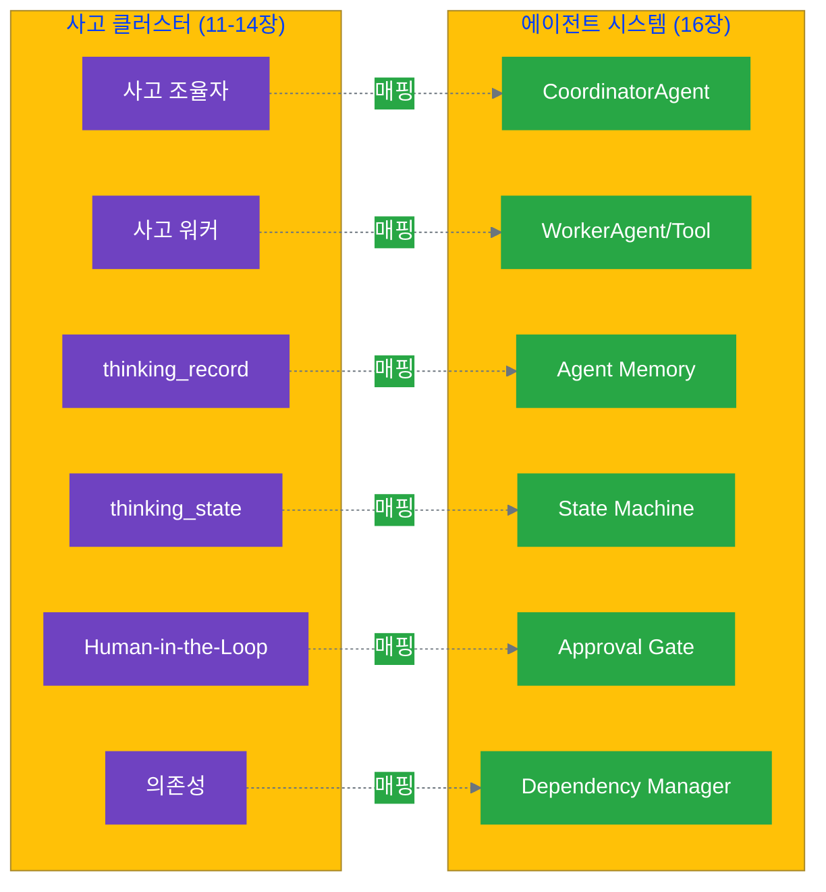

# 16.1 사고 클러스터에서 에이전트로

11-14장에서 우리는 사고 클러스터를 설계하고 파일 시스템으로 구현했습니다. 각 Stage마다 인간이 프롬프트를 작성하고, AI 응답을 검토하며, 다음 단계를 판단했죠. 이제 한 단계 더 나아가, 이러한 사고 프로세스를 **에이전트(Agent)**가 자율적으로 실행하도록 만들어 보겠습니다.

## 16.1.1 에이전트의 정의

### 에이전트란 무엇인가?

**에이전트(Agent)**는 주어진 환경에서 목표를 달성하기 위해 **자율적으로** 행동하는 소프트웨어 개체입니다. 단순히 명령을 실행하는 스크립트와 달리, 에이전트는 상황을 인식하고, 판단하며, 행동을 조정합니다.

```yaml
단순 스크립트:
  특징: "고정된 순서로 작업 실행"
  예시: |
    1. A 실행
    2. B 실행
    3. C 실행
  한계: "상황 변화에 대응 불가"

에이전트:
  특징: "목표 달성을 위해 자율적으로 행동"
  예시: |
    목표: "고품질 콘텐츠 생성"
    행동: 
      - 상황 인식 (과거 품질 데이터)
      - 판단 (어떤 전략이 효과적인가)
      - 조정 (필요 시 전략 변경)
  가치: "변화하는 상황에 적응"
```

### 에이전트의 4가지 핵심 특성

AI 에이전트 연구에서 정의하는 에이전트의 핵심 특성은 다음과 같습니다:

#### 1. 자율성 (Autonomy)

**정의**: 인간의 직접적인 개입 없이 독립적으로 작동합니다.

**사고 클러스터에서의 의미**:
```yaml
수동 사고 (11-14장):
  Stage 1: 인간이 프롬프트 작성 → AI 실행 → 인간이 결과 검토
  Stage 2: 인간이 다시 프롬프트 작성 → AI 실행 → ...
  
에이전트 사고:
  초기화: 인간이 목표와 제약조건 설정
  실행: 에이전트가 Stage 1 → 2 → 3 → 4 자율 진행
  개입: 중요한 의사결정 지점에서만 인간 개입
```

**예시**:
```text
수동 방식:
  - 각 Stage마다 인간이 개입
  - Stage 1 실행 → 인간 검토 → Stage 2 실행 → 인간 검토 → ...

자율 방식:
  - 인간은 초기에 목표만 설정
  - 에이전트가 전체 4 Stage를 자율 실행
  - 문제 발생 시에만 인간에게 알림
```

#### 2. 반응성 (Reactivity)

**정의**: 환경의 변화를 인식하고 적절히 반응합니다.

**사고 클러스터에서의 의미**:
```yaml
환경 변화 예시:
  - API 오류 발생
  - 품질 기준 미달
  - 제약조건 위반
  - 파일 누락

반응 예시:
  - API 오류 → 재시도 또는 대체 전략
  - 품질 미달 → 재생성 또는 인간 알림
  - 제약 위반 → 조정 또는 중단
```

**예시 시나리오**:
```text
상황: 품질 검증에서 기준 미달 발견

에이전트의 반응:
1. 재시도 횟수 확인
   - 재시도 가능 → 초안 다시 작성
   - 재시도 불가 → 인간에게 알림
   
2. 인간 알림 내용:
   - "품질 기준 미달"
   - "현재 점수: 6.5, 기준: 8.0"
   - "문제점: 명확성 부족, 예시 없음"
```

#### 3. 사회성 (Social Ability)

**정의**: 다른 에이전트나 인간과 협력하여 목표를 달성합니다.

**사고 클러스터에서의 의미**:
```yaml
협력 시나리오:
  단일 에이전트: "ContentAgent ↔ 인간 (승인)"
  병렬 에이전트: "Agent A → Agent B → Agent C (의존성)"
  계층적: "MetaCoordinator → Worker Agents (조율)"
```

**예시 - 병렬 에이전트 팀**:
```text
AnalysisAgentTeam 구조:

1. DataCollectionAgent
   - 역할: 데이터 수집
   - 출력: data.csv

2. AnalysisAgent
   - 역할: 데이터 분석
   - 입력: data.csv (Agent 1의 결과 필요)
   - 출력: analysis.json

3. InsightAgent
   - 역할: 인사이트 도출
   - 입력: analysis.json (Agent 2의 결과 필요)
   - 출력: insights.md

의존성: Agent 1 → Agent 2 → Agent 3 순서대로 실행
```

**예시 - 인간과의 협력**:
```text
ContentAgent의 Human-in-the-Loop:

1. 에이전트가 아이디어 자동 평가
   - 10개 아이디어를 핵심 가치 기준으로 평가
   - 최선의 아이디어 추천

2. 인간 승인 요청
   - 에이전트의 추천 제시
   - 인간이 최종 선택
   - 승인 후 다음 단계 진행
```

#### 4. 목표 지향성 (Goal-Oriented)

**정의**: 명확한 목표를 가지고, 그것을 달성하기 위해 행동을 계획합니다.

**사고 클러스터에서의 의미**:
```yaml
목표 계층:
  최상위 목표: "고품질 블로그 포스트 생성"
  
  하위 목표 (Stage별):
    Stage 1: "10개의 다양한 아이디어 생성"
    Stage 2: "핵심 가치에 맞는 최선의 아이디어 선택"
    Stage 3: "독자가 이해하기 쉬운 초안 작성"
    Stage 4: "품질 기준을 충족하는지 검증"
```

**예시 - 목표 기반 의사결정**:
```text
ContentAgent 실행 흐름:

초기 설정:
  - 최상위 목표: "고품질 콘텐츠 생성"
  - 핵심 가치: 명확성, 실용성, 친근함
  - 제약 조건: 1500-2000자, 친근한 톤

실행:
1. Planning Stage 실행 → 아이디어 생성
   
2. 목표 진척 확인:
   - 아이디어 품질이 충분한가?
   - 진행 불가 시 → 전략 조정

3. Reasoning Stage → 최적 아이디어 선택
   
4. Experimenting Stage → 초안 작성
   
5. Reflecting Stage → 품질 검증
   
6. 최종 목표 달성 확인:
   - 달성: 결과 반환
   - 미달성: 인간에게 알림 및 재시도 요청
```

### 에이전트 vs 단순 자동화

많은 사람들이 에이전트를 단순한 자동화 스크립트와 혼동합니다. 차이를 명확히 해봅시다:

| 특성 | 단순 자동화 | 에이전트 |
|------|-------------|---------|
| **행동** | 고정된 순서 | 상황에 따라 조정 |
| **판단** | 없음 (if-then 로직만) | 목표 기반 의사결정 |
| **오류 처리** | 중단 또는 무시 | 재시도, 대체 전략, 인간 알림 |
| **학습** | 없음 | 과거 결과 참고 (피드백) |
| **상태 추적** | 없음 또는 단순 | 복잡한 상태 머신 |
| **협업** | 없음 | 다른 에이전트/인간과 협력 |

**비교 예시**:

```text
❌ 단순 자동화:
  1. AI에게 "아이디어 10개" 요청
  2. 항상 첫 번째 아이디어 선택
  3. 해당 아이디어로 "초안 작성" 요청
  4. 결과 반환 (품질 검증 없음)

특징:
  - 고정된 순서
  - 조건 판단 없음
  - 항상 같은 방식

✅ 에이전트:
  1. 과거 데이터 참고 (이전 품질 문제 확인)
  
  2. 전략 조정 (품질 문제 있었다면 검증 강화)
  
  3. 목표 기반 실행:
     - Planning: 아이디어 발산
     - Reasoning: 핵심 가치 기준으로 평가 및 선택
     - Experimenting: 초안 작성
     - Reflecting: 품질 검증
  
  4. 적응적 대응:
     - 품질 통과 → 완료
     - 품질 미달 + 재시도 가능 → 재실행
     - 품질 미달 + 재시도 불가 → 인간 개입

특징:
  - 상황에 맞게 조정
  - 목표 달성 중심
  - 과거 학습 반영
```

---

## 16.1.2 변환 매핑: 사고 클러스터를 에이전트로

사고 클러스터의 각 구성 요소는 에이전트 시스템의 특정 요소로 매핑됩니다. 이 매핑을 이해하면 사고 클러스터를 에이전트로 변환하는 것이 자연스러워집니다.

### 매핑 테이블

| 사고 클러스터 (11-14장) | 에이전트 시스템 (16장) | 역할 |
|------------------------|----------------------|------|
| **사고 조율자** | `CoordinatorAgent` | Stage 간 흐름 조율, 전체 워크플로우 관리 |
| **사고 실행 워커** | `WorkerAgent` 또는 `Tool` | 개별 작업 수행 (AI 호출, 파일 처리 등) |
| **thinking_record** | `Agent Memory` | 사고 과정 기록, 과거 결과 참조 |
| **thinking_state** | `State Machine` | 현재 Stage, 진행 상황 추적 |
| **Stage (4단계)** | `Agent Methods` | planning_stage(), reasoning_stage() 등 |
| **Human-in-the-Loop** | `Approval Gate` | 인간 개입 지점, 승인 메커니즘 |
| **파일 시스템** | `File Manager` | 자동 파일 I/O, 경로 관리 |
| **의존성** | `Dependency Manager` | 에이전트 간 실행 순서 조율 |

### 상세 매핑

#### 1. 사고 조율자 → CoordinatorAgent

**사고 조율자 (11장)**:
```yaml
역할:
  - Stage 간 흐름 관리
  - 각 Stage의 결과를 다음 Stage에 전달
  - 전체 워크플로우 조율

구현 방식 (14장):
  - 인간이 직접 조율
  - 각 Stage 후 결과 검토 및 다음 Stage 실행 판단
```

**CoordinatorAgent (16장)**:
```text
역할:
  - 사고 조율자의 자동화 버전
  - 전체 워크플로우를 자율적으로 조율

핵심 기능:
  1. Stage 실행 관리
     - 각 Stage를 순서대로 실행
     - 이전 Stage 결과를 다음 Stage에 전달
  
  2. 결과 저장
     - 각 Stage 결과를 메모리에 저장
     - thinking_record.json 자동 업데이트
  
  3. 진행 가능 여부 판단
     - 각 Stage 완료 후 다음 진행 가능성 확인
     - 실패 시 오류 처리 또는 인간 알림

자동화의 가치:
  - 인간 조율 → 에이전트 자동 조율
  - 수동 Stage 전환 → 상태 머신으로 자동 전환
  - 수동 결과 전달 → 메모리를 통한 자동 전달
```

#### 2. 사고 실행 워커 → WorkerAgent / Tool

**사고 실행 워커 (11장)**:
```yaml
역할:
  - 개별 작업 수행
  - AI 호출, 데이터 처리, 파일 저장 등

예시:
  - "아이디어 생성" 워커
  - "품질 검증" 워커
  - "파일 저장" 워커
```

**WorkerAgent / Tool (16장)**:
```text
두 가지 구현 옵션:

옵션 1: WorkerAgent (복잡한 작업)
  - 상태를 가진 에이전트
  - 예: IdeaGenerationWorker
  - 역할:
    * 컨텍스트 기반 프롬프트 생성
    * AI 호출
    * 결과 파싱 및 구조화

옵션 2: Tool (단순 작업)
  - 상태가 없는 유틸리티 함수
  - 예: save_file_tool
  - 역할:
    * 파일 저장
    * 디렉토리 생성
    * 단순 데이터 변환

선택 기준:
  - 상태 필요 + 복잡한 로직 → WorkerAgent
  - 상태 불필요 + 단순 작업 → Tool
```

#### 3. thinking_record → Agent Memory

**thinking_record (13장)**:
```yaml
역할:
  - 각 Stage의 사고 과정 기록
  - 프롬프트, 응답, 판단 근거 저장

파일:
  /thinking/planning/thinking_record.json
  /thinking/reasoning/thinking_record.json
```

**Agent Memory (16장)**:
```text
역할:
  - thinking_record를 메모리 시스템으로 관리
  - 과거 기록 참조 및 학습 지원

핵심 기능:
  1. Stage별 기록 저장
     - 메모리에 저장 (빠른 접근)
     - 파일에도 저장 (영속성)
  
  2. 과거 기록 조회
     - 특정 Stage 기록 조회
     - 전체 사고 과정 조회
  
  3. 학습 지원
     - 이전 Planning에서 사용한 기준 참조
     - 일관성 유지
     - 과거 실패/성공 패턴 학습

자동화의 가치:
  - 수동 파일 관리 → 자동 저장/로드
  - 산발적 기록 → 체계적 메모리 시스템
  - 단순 보관 → 학습 및 개선 지원
```

#### 4. thinking_state → State Machine

**thinking_state (13장)**:
```json
{
  "task_id": "content-001",
  "current_stage": "reasoning",
  "status": "in_progress",
  "stages": {
    "planning": {"status": "completed", "completed_at": "..."},
    "reasoning": {"status": "in_progress", "started_at": "..."}
  }
}
```

**State Machine (16장)**:
```text
역할:
  - thinking_state를 상태 머신으로 구현
  - 자동 상태 전환 및 추적

핵심 기능:
  1. Stage 전환 관리
     - 유효성 검증 (존재하는 Stage인가?)
     - 현재 Stage 완료 기록
     - 새 Stage로 전환
     - thinking_state.json 자동 업데이트
  
  2. 현재 상태 조회
     - 어느 Stage에 있는가?
     - 전체 워크플로우 완료 여부
  
  3. 재개 지원
     - 중단된 지점 파악
     - 해당 지점부터 재개 가능

자동화의 가치:
  - 수동 업데이트 → 자동 업데이트
  - 상태 불일치 위험 제거
  - 중단 후 재개 가능
```

#### 5. Human-in-the-Loop → Approval Gate

**Human-in-the-Loop (11-14장)**:
```yaml
개념:
  - 중요한 의사결정 지점에서 인간 개입
  - 예: 아이디어 선택, 최종 승인

구현 (14장):
  - 인간이 직접 판단하고 다음 단계 실행
```

**Approval Gate (16장)**:
```text
역할:
  - Human-in-the-Loop를 자동화된 승인 시스템으로 구현

핵심 기능:
  1. 승인 요청
     - 인간에게 알림 전송 (Slack, Email 등)
     - 의사결정 컨텍스트 제공
     - 선택 옵션 제시
  
  2. 승인 대기
     - 웹 인터페이스, Slack 버튼 등으로 응답 대기
     - 타임아웃 설정 (예: 1시간)
  
  3. 응답 처리
     - 승인: 선택된 옵션 반환 및 진행
     - 거부: 작업 중단 또는 대체 전략

사용 예시:
  아이디어 선택 시점:
    1. 에이전트가 10개 아이디어 자동 평가
    2. 최선의 아이디어 추천
    3. 인간에게 승인 요청
    4. 인간 선택 대기
    5. 승인 받은 아이디어로 진행
```

#### 6. 의존성 관리 → Dependency Manager

**의존성 (12-14장)**:
```yaml
dependencies.json:
  tc-002:
    depends_on: ["tc-001"]
    required_files: ["data/cleaned.csv"]
  
  tc-003:
    depends_on: ["tc-002"]
    required_files: ["analysis/results.json"]
```

**Dependency Manager (16장)**:
```text
역할:
  - 에이전트 간 의존성 자동 관리
  - 실행 순서 조율

핵심 기능:
  1. 실행 가능 여부 확인
     - 선행 에이전트 완료 확인
     - 필요한 파일 존재 확인
     - 실행 가능 여부 판단
  
  2. 실행 순서 결정
     - 의존성 그래프 분석
     - 위상 정렬로 순서 도출
     - 예: [data_agent, analysis_agent, insight_agent]
  
  3. 완료 상태 추적
     - 각 에이전트 완료 표시
     - 다음 에이전트 실행 가능 확인

사용 예시:
  AnalysisAgentTeam:
    1. 실행 순서 결정
       - data_agent → analysis_agent → insight_agent
    
    2. 순서대로 실행:
       - data_agent 실행
       - 완료 표시
       - analysis_agent 실행 가능 확인
       - analysis_agent 실행
       - (반복)
```

### 매핑 다이어그램



---

## 16.1.3 에이전트 설계 원칙

사고 클러스터를 에이전트로 변환할 때 따라야 할 4가지 핵심 원칙이 있습니다. 이 원칙들은 안정적이고 유지보수 가능한 에이전트 시스템을 만드는 데 필수적입니다.

### 원칙 1: 명확한 책임 분리 (Clear Separation of Concerns)

**원칙**: 각 에이전트는 하나의 명확한 책임만 가져야 합니다.

**이유**:
- 디버깅이 쉬워짐
- 재사용성 증가
- 수정의 영향 범위 최소화

**나쁜 예시** ❌:
```text
SuperAgent (모든 것을 하는 에이전트 - 안티패턴)

책임:
  1. 데이터 수집
  2. 데이터 분석
  3. 인사이트 도출
  4. 리포트 작성
  5. 이메일 발송

문제점:
  - 너무 많은 책임 (5가지)
  - 각 부분을 독립적으로 테스트하기 어려움
  - 데이터 분석 로직만 변경해도 전체 에이전트 수정 필요
  - 버그 발생 시 원인 파악 어려움
```

**좋은 예시** ✅:
```text
책임 분리된 에이전트 팀:

DataCollectionAgent:
  책임: 데이터 수집만
  입력: 데이터 소스 정보
  출력: 수집된 데이터

AnalysisAgent:
  책임: 데이터 분석만
  입력: 수집된 데이터
  출력: 분석 결과

InsightAgent:
  책임: 인사이트 도출만
  입력: 분석 결과
  출력: 인사이트

AnalysisCoordinator:
  책임: 에이전트 간 흐름 조율
  역할: 위 3개 에이전트를 순서대로 실행

장점:
  - 각 에이전트를 독립적으로 개발/테스트
  - AnalysisAgent만 다른 프로젝트에서 재사용 가능
  - 버그 발생 시 원인 에이전트 즉시 파악
  - 한 에이전트 수정이 다른 에이전트에 영향 없음
```

### 원칙 2: 실패 안전 (Fail-Safe)

**원칙**: 에이전트는 실패를 예상하고, 안전하게 처리해야 합니다.

**이유**:
- API 오류, 네트워크 장애는 언제든 발생
- 부분 실패가 전체 시스템을 무너뜨리면 안 됨
- 재개 가능성 확보

**필수 실패 안전 메커니즘**:

**1. 재시도 (Retry)**:
```text
API 호출 재시도 전략:

시도 1: 즉시 실행
  실패 시 → 2초 대기 후 재시도

시도 2: 2초 대기 후 실행
  실패 시 → 4초 대기 후 재시도

시도 3: 4초 대기 후 실행
  실패 시 → 최종 실패 처리

지수 백오프 패턴:
  - 재시도마다 대기 시간 2배 증가
  - 서버 부하 분산
  - 일시적 오류 대응
```

**2. 체크포인트 (Checkpoint)**:
```text
Stage별 체크포인트 저장:

Planning Stage 완료:
  ✅ ideas.json 저장 (체크포인트)

Reasoning Stage 완료:
  ✅ selected.json 저장 (체크포인트)

Experimenting Stage 실패:
  ⚠️ 오류 발생
  📂 마지막 체크포인트(selected.json)에서 재개
  🔄 Experimenting Stage 재실행

가치:
  - 실패해도 처음부터 다시 안 해도 됨
  - 시간과 비용 절약
  - 중단 후 재개 가능
```

**3. 우아한 저하 (Graceful Degradation)**:
```text
프리미엄 모델 → 표준 모델 → 템플릿 전략:

시도 1: 프리미엄 모델 (최선)
  - GPT-4 등 고성능 모델
  - 실패 원인: 할당량 초과
  - 대응: 표준 모델로 전환

시도 2: 표준 모델 (차선)
  - GPT-3.5 등 표준 모델
  - 실패 원인: API 오류
  - 대응: 템플릿 사용

시도 3: 템플릿 (최후)
  - 미리 정의된 템플릿 사용
  - 품질은 낮지만 작업 완료 가능

원칙:
  - 100% 품질 불가능 시 → 80% 품질이라도 제공
  - 완전 실패보다는 부분 성공
```

**4. 명확한 오류 메시지**:
```text
❌ 나쁜 오류 메시지:
  "Quality check failed"

문제점:
  - 무엇이 문제인지 불명확
  - 어떻게 해결해야 할지 모름
  - 디버깅 어려움

✅ 좋은 오류 메시지:
  "품질 검증 실패
   
   현재 점수: 6.5/10
   최소 기준: 8.0/10
   
   발견된 문제:
   - 명확성 부족: 핵심 메시지가 불분명함
   - 예시 부족: 추상적 설명만 있고 구체적 예시 없음
   
   제안:
   - 핵심 메시지를 첫 문단에 명확히 제시
   - 각 개념마다 구체적 예시 추가"

장점:
  - 문제 원인 명확
  - 해결 방향 제시
  - 빠른 디버깅 가능
```

### 원칙 3: 관찰 가능성 (Observability)

**원칙**: 에이전트의 내부 상태와 행동을 외부에서 관찰할 수 있어야 합니다.

**이유**:
- 디버깅 필수
- 성능 모니터링
- 사용자에게 진행 상황 제공

**구현 방법**:

**1. 상세한 로깅**:
```text
로그 레벨별 정보:

INFO: 진행 상황
  - "Starting content generation workflow"
  - "Generated 10 ideas"
  - "Selected idea: AI의 미래"
  - "Draft generated: 1847 characters"

ERROR: 오류 정보
  - "Workflow failed at reasoning stage: API timeout"
  - "Retry attempt 2/3 failed: Rate limit exceeded"

가치:
  - 실시간 진행 상황 파악
  - 문제 발생 시 즉시 감지
  - 사후 분석 가능
```

**2. 진행 상황 보고**:
```text
사용자에게 보이는 진행 표시:

Planning (0%): 아이디어 생성 중...
  ⏳ 진행 중

Reasoning (25%): 아이디어 평가 중...
  ⏳ 진행 중

Experimenting (50%): 초안 작성 중...
  ⏳ 진행 중

Reflecting (75%): 품질 검증 중...
  ⏳ 진행 중

Completed (100%): 완료!
  ✅ 완료

가치:
  - 사용자 불안감 해소
  - 예상 소요 시간 파악
  - 중단 여부 판단 가능
```

**3. 메트릭 수집**:
```text
수집하는 메트릭:

성능 메트릭:
  - API 호출 횟수: 12회
  - 총 토큰 사용량: 8,450 tokens
  - Stage별 소요 시간:
    * Planning: 15초
    * Reasoning: 8초
    * Experimenting: 42초
    * Reflecting: 6초

품질 메트릭:
  - 품질 점수: 8.5/10
  - 재시도 횟수: 1회
  - 오류 발생 횟수: 0회

가치:
  - 성능 병목 지점 파악
  - 비용 예측 및 최적화
  - 품질 추이 모니터링
```

### 원칙 4: 점진적 자동화 (Progressive Automation)

**원칙**: 한 번에 모든 것을 자동화하지 말고, 점진적으로 자동화 범위를 확대합니다.

**이유**:
- 위험 최소화
- 학습 기회
- 신뢰 구축

**4단계 점진적 자동화**:

**Phase 1: 관찰 (Observe)** - 주 1-2
```text
목표: 데이터 수집 및 패턴 파악

방식:
  - 완전 수동 실행
  - 각 단계마다 로깅
  - 어떤 부분이 반복적인지 파악

예시:
  - 인간이 직접 Planning Stage 실행 → 로그 기록
  - 인간이 직접 Reasoning Stage 실행 → 로그 기록
  - 패턴 분석: "Reasoning은 항상 같은 기준 사용"

결과:
  - 자동화 가능 영역 파악
  - 자동화 우선순위 결정
```

**Phase 2: 제안 (Suggest)** - 주 3-4
```text
목표: AI 제안 도입, 인간이 최종 결정

방식:
  - Planning: 자동화 시작 (AI가 아이디어 생성)
  - Reasoning: 반자동 (AI 제안 + 인간 선택)
  - Experimenting: 수동 유지 (인간이 초안 작성)

예시:
  - AI가 10개 아이디어 자동 생성
  - AI가 핵심 가치 기준으로 평가 및 추천
  - 인간이 최종 선택
  - 인간이 초안 직접 작성

결과:
  - AI 제안 정확도 확인
  - 인간 선택 패턴 학습
```

**Phase 3: 자동 + 검증 (Automate with Verification)** - 주 5-8
```text
목표: 자동 실행, 품질 검증 의무화

방식:
  - Planning, Reasoning, Experimenting: 자동화
  - Reflecting: 품질 검증 필수
  - 낮은 신뢰도 → 인간 개입

예시:
  - 에이전트가 Planning, Reasoning, Experimenting 자율 실행
  - 품질 점수 계산:
    * 8.0 이상 → 자동 승인
    * 6.0-8.0 → 인간 검토 필요
    * 6.0 미만 → 재생성

결과:
  - 80% 작업 자동화
  - 20% 인간 개입
```

**Phase 4: 완전 자동 (Full Automation)** - 주 9+
```text
목표: 높은 신뢰도 작업 완전 자동화

방식:
  - 전체 자동 실행
  - 예외 상황에서만 인간 개입
  - 지속적 모니터링

예시:
  - 에이전트가 전체 4 Stage 자율 실행
  - 품질 점수 8.5 이상 → 자동 완료
  - 치명적 문제 발견 시만 → 인간 알림

결과:
  - 95% 작업 자동화
  - 5% 예외 상황 인간 개입
  - 시간 절약 70%
```

---

## 16.1.4 언제 에이전트가 필요한가?

모든 사고 클러스터를 에이전트로 만들 필요는 없습니다. 언제 에이전트가 적합한지 판단하는 기준을 알아봅시다.

### 의사결정 체크리스트

다음 질문에 답하세요:

**빈도 (Frequency)**:
- [ ] 이 작업을 월 10회 이상 수행하는가?
- [ ] 이 작업을 앞으로도 계속 수행할 것인가?

**명확성 (Clarity)**:
- [ ] 프로세스가 명확히 정의되어 있는가?
- [ ] 각 Stage의 입력과 출력이 명확한가?
- [ ] 성공 기준이 측정 가능한가?

**자율성 (Autonomy)**:
- [ ] 대부분의 단계를 규칙으로 정의할 수 있는가?
- [ ] 창의적 판단이 필요한 부분을 명확히 분리할 수 있는가?

**안전성 (Safety)**:
- [ ] 실패해도 큰 손실이 없는가?
- [ ] 품질 검증 단계를 정의할 수 있는가?
- [ ] 문제 발생 시 인간 개입 방법이 명확한가?

**가치 (Value)**:
- [ ] 자동화로 시간을 유의미하게 절약할 수 있는가?
- [ ] 일관성 향상이 중요한가?
- [ ] 확장성이 필요한가? (동시 여러 작업)

**채점**:
- 15-20개 체크: 에이전트 강력 추천 ✅✅✅
- 10-14개 체크: 에이전트 적합 ✅✅
- 5-9개 체크: 부분 자동화 고려 ✅
- 0-4개 체크: 수동 사고 유지 ❌

### 적합한 사례

**✅ 에이전트 적합**:

**1. 주간 콘텐츠 생성**
```text
평가:
  ✅ 빈도: 주 5회 (높음)
  ✅ 명확성: 4 Stage 프로세스 명확히 정의됨
  ✅ 자율성: Planning, Experimenting 자동화 가능
  ✅ 안전성: 품질 검증 + 최종 승인 단계 있음
  ✅ 가치: 시간 60% 절약 가능

결론: 에이전트 강력 추천
구현: ContentAgent로 자동화
```

**2. 월간 데이터 리포트**
```text
평가:
  ✅ 빈도: 월 1회 (매달 반복)
  ✅ 명확성: 데이터 수집 → 분석 → 인사이트 → 리포트
  ✅ 자율성: 전체 자동화 가능
  ✅ 안전성: 데이터 검증 단계 있음
  ✅ 가치: 일관된 포맷, 오류 감소

결론: 에이전트 적합
구현: ReportAgent로 자동화
```

**3. 고객 세그먼트 분석**
```text
평가:
  ✅ 빈도: 주 1회
  ✅ 명확성: 알고리즘 정의됨
  ✅ 자율성: 완전 자동화 가능
  ✅ 안전성: 통계적 검증 가능
  ✅ 가치: 실시간 분석 가능

결론: 에이전트 적합
구현: SegmentationAgent로 자동화
```

### 부적합한 사례

**❌ 에이전트 부적합**:

**1. 신규 전략 수립**
```text
평가:
  ❌ 빈도: 분기 1회 (낮음)
  ❌ 명확성: 프로세스가 유동적
  ❌ 자율성: 창의적 판단이 핵심
  ❌ 위험: 잘못된 전략은 큰 손실

결론: 수동 사고 유지
방식: 인간 주도, AI는 보조 도구로만
```

**2. 위기 대응**
```text
평가:
  ❌ 빈도: 불규칙
  ❌ 명확성: 상황마다 다름
  ❌ 자율성: 맥락 이해 필수
  ❌ 위험: 실패 시 치명적

결론: 수동 사고 유지
방식: 인간 주도, AI는 정보 제공만
```

**3. 복잡한 협상**
```text
평가:
  ❌ 자율성: 감정, 관계 고려 필수
  ❌ 위험: 관계 손상 가능
  ❌ 명확성: 상황마다 다른 전략 필요

결론: 수동 사고 유지
방식: 인간 주도
```

### 하이브리드 접근

많은 경우 완전 자동화가 아닌 **하이브리드**가 최선입니다:

**패턴 1: 자동화 + 검토**
```yaml
프로세스:
  - 에이전트가 초안 자동 생성 (Planning → Experimenting)
  - 인간이 최종 검토 및 승인 (Reflecting)

장점:
  - 시간 절약 (70%)
  - 품질 보장 (인간 검토)

적용 사례:
  - 블로그 포스트 작성
  - 리포트 생성
  - 이메일 초안 작성
```

**패턴 2: 자동화 + 예외 처리**
```yaml
프로세스:
  - 에이전트가 전체 자동 실행
  - 신뢰도 낮은 경우만 인간 개입
  
예시:
  - 품질 점수 > 8.0 → 자동 발행 (80%)
  - 품질 점수 6.0-8.0 → 인간 검토 (15%)
  - 품질 점수 < 6.0 → 재생성 또는 폐기 (5%)

장점:
  - 대부분 자동 (80%)
  - 중요한 결정만 인간 개입

적용 사례:
  - 뉴스레터 발송
  - 소셜 미디어 포스팅
  - 정기 리포트
```

**패턴 3: 자동화 + 학습**
```yaml
프로세스:
  - 에이전트가 제안 생성
  - 인간이 선택 및 수정
  - 에이전트가 인간 선택 학습

진화:
  - Week 1: 정확도 60% → 40% 인간 개입
  - Week 4: 정확도 80% → 20% 인간 개입
  - Week 8: 정확도 95% → 5% 인간 개입

장점:
  - 시간이 갈수록 자동화 비율 증가
  - 인간 선택 패턴 학습

적용 사례:
  - 콘텐츠 추천
  - 제목 생성
  - 태그 분류
```

---

## 16.1.5 정리: 사고에서 에이전트로의 도약

이 섹션에서 우리는 사고 클러스터를 에이전트로 변환하는 **개념적 기초**를 다뤘습니다:

1. **에이전트의 정의**: 자율성, 반응성, 사회성, 목표 지향성
2. **변환 매핑**: 사고 클러스터의 각 요소가 에이전트 시스템의 어떤 요소로 변환되는가
3. **설계 원칙**: 책임 분리, 실패 안전, 관찰 가능성, 점진적 자동화
4. **적용 기준**: 언제 에이전트가 적합하고, 언제 수동 사고를 유지해야 하는가

**핵심 통찰**:

```yaml
사고 클러스터 (11-14장):
  개념: "무엇을 사고할 것인가"
  주체: "인간이 주도, AI가 보조"
  가치: "깊은 사고, 전략 수립"

에이전트 (16장):
  개념: "사고를 어떻게 자율 실행할 것인가"
  주체: "에이전트가 주도, 인간이 감독"
  가치: "효율성, 확장성, 일관성"

관계:
  - 에이전트는 사고 클러스터의 자동화 버전
  - 사고 클러스터가 정의한 프로세스를 에이전트가 실행
  - 둘 다 필요: 전략은 인간, 실행은 에이전트
```

**다음 섹션 (16.2)**에서는 이 개념을 구체화합니다. 14장의 3가지 실전 사례(콘텐츠 생성, 데이터 분석, 신제품 런칭)를 실제 에이전트로 설계하는 방법을 상세히 다룹니다.

---

**이제 16.2로 넘어가 에이전트 팀을 실제로 설계해 봅시다.**
