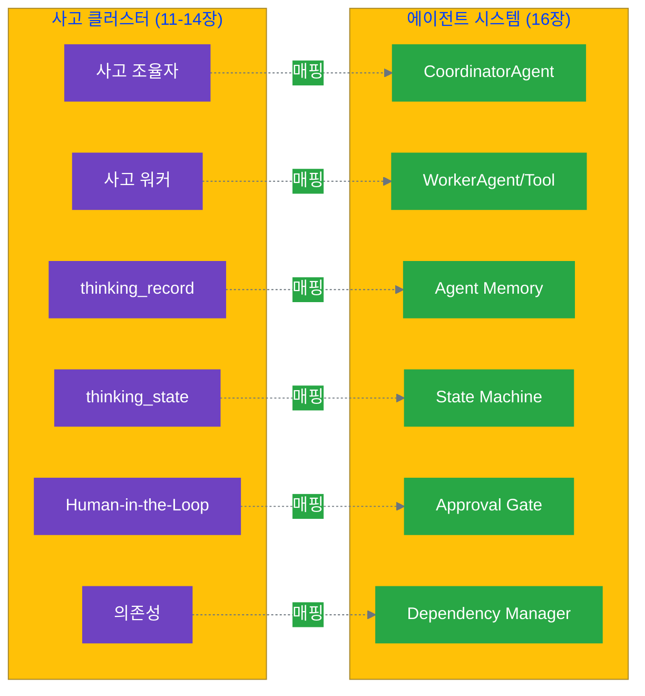

# 16.1 사고 클러스터에서 에이전트로

11-14장에서 우리는 사고 클러스터를 설계하고 파일 시스템으로 구현했습니다. 각 Stage마다 인간이 프롬프트를 작성하고, AI 응답을 검토하며, 다음 단계를 판단했죠. 이제 한 단계 더 나아가, 이러한 사고 프로세스를 **에이전트(Agent)**가 자율적으로 실행하도록 만들어 보겠습니다.

## 16.1.1 에이전트의 정의

### 에이전트란 무엇인가?

**에이전트(Agent)**는 주어진 환경에서 목표를 달성하기 위해 **자율적으로** 행동하는 소프트웨어 개체입니다. 단순히 명령을 실행하는 스크립트와 달리, 에이전트는 상황을 인식하고, 판단하며, 행동을 조정합니다.

```yaml
단순 스크립트:
  특징: "고정된 순서로 작업 실행"
  예시: |
    1. A 실행
    2. B 실행
    3. C 실행
  한계: "상황 변화에 대응 불가"

에이전트:
  특징: "목표 달성을 위해 자율적으로 행동"
  예시: |
    목표: "고품질 콘텐츠 생성"
    행동: 
      - 상황 인식 (과거 품질 데이터)
      - 판단 (어떤 전략이 효과적인가)
      - 조정 (필요 시 전략 변경)
  가치: "변화하는 상황에 적응"
```

### 에이전트의 4가지 핵심 특성

AI 에이전트 연구에서 정의하는 에이전트의 핵심 특성은 다음과 같습니다:

#### 1. 자율성 (Autonomy)

**정의**: 인간의 직접적인 개입 없이 독립적으로 작동합니다.

**사고 클러스터에서의 의미**:
```yaml
수동 사고 (11-14장):
  Stage 1: 인간이 프롬프트 작성 → AI 실행 → 인간이 결과 검토
  Stage 2: 인간이 다시 프롬프트 작성 → AI 실행 → ...
  
에이전트 사고:
  초기화: 인간이 목표와 제약조건 설정
  실행: 에이전트가 Stage 1 → 2 → 3 → 4 자율 진행
  개입: 중요한 의사결정 지점에서만 인간 개입
```

**예시**: ContentAgent
```python
# 수동: 각 Stage마다 인간 개입
stage1_result = human_prompt("아이디어 생성")
stage2_result = human_prompt(f"아이디어 평가: {stage1_result}")

# 자율: 에이전트가 전체 흐름 실행
agent = ContentAgent(goal="블로그 포스트 작성")
result = await agent.run()  # 전체 4 Stage 자율 실행
```

#### 2. 반응성 (Reactivity)

**정의**: 환경의 변화를 인식하고 적절히 반응합니다.

**사고 클러스터에서의 의미**:
```yaml
환경 변화 예시:
  - API 오류 발생
  - 품질 기준 미달
  - 제약조건 위반
  - 파일 누락

반응 예시:
  - API 오류 → 재시도 또는 대체 전략
  - 품질 미달 → 재생성 또는 인간 알림
  - 제약 위반 → 조정 또는 중단
```

**예시**: 품질 검증 실패 시 반응
```python
class ContentAgent:
    async def reflecting_stage(self, draft):
        quality = await self.verify_quality(draft)
        
        if quality.score < self.min_quality:
            # 반응 1: 재시도 가능한가?
            if self.retry_count < self.max_retries:
                self.retry_count += 1
                return await self.experimenting_stage()  # 재생성
            
            # 반응 2: 인간에게 알림
            else:
                await self.notify_human(
                    "품질 기준 미달",
                    f"점수: {quality.score}, 기준: {self.min_quality}"
                )
                raise QualityFailure()
```

#### 3. 사회성 (Social Ability)

**정의**: 다른 에이전트나 인간과 협력하여 목표를 달성합니다.

**사고 클러스터에서의 의미**:
```yaml
협력 시나리오:
  단일 에이전트: "ContentAgent ↔ 인간 (승인)"
  병렬 에이전트: "Agent A → Agent B → Agent C (의존성)"
  계층적: "MetaCoordinator → Worker Agents (조율)"
```

**예시**: 에이전트 간 통신
```python
# 병렬 에이전트 팀
class AnalysisAgentTeam:
    def __init__(self):
        self.data_agent = DataCollectionAgent()
        self.analysis_agent = AnalysisAgent()
        self.insight_agent = InsightAgent()
    
    async def run(self):
        # Agent A: 데이터 수집
        data = await self.data_agent.run()
        
        # Agent B: 분석 (A의 결과 필요)
        analysis = await self.analysis_agent.run(data)
        
        # Agent C: 인사이트 (B의 결과 필요)
        insights = await self.insight_agent.run(analysis)
        
        return insights
```

**예시**: 인간과의 협력 (Human-in-the-Loop)
```python
class ContentAgent:
    async def reasoning_stage(self, ideas):
        # 자동 평가
        auto_evaluation = self.evaluate_by_values(ideas)
        
        # 인간 승인 필요
        if self.require_human_approval:
            approved = await self.request_approval(
                "아이디어 선택",
                auto_evaluation
            )
            return approved
        
        return auto_evaluation['best_idea']
```

#### 4. 목표 지향성 (Goal-Oriented)

**정의**: 명확한 목표를 가지고, 그것을 달성하기 위해 행동을 계획합니다.

**사고 클러스터에서의 의미**:
```yaml
목표 계층:
  최상위 목표: "고품질 블로그 포스트 생성"
  
  하위 목표 (Stage별):
    Stage 1: "10개의 다양한 아이디어 생성"
    Stage 2: "핵심 가치에 맞는 최선의 아이디어 선택"
    Stage 3: "독자가 이해하기 쉬운 초안 작성"
    Stage 4: "품질 기준을 충족하는지 검증"
```

**예시**: 목표 기반 의사결정
```python
class ContentAgent:
    def __init__(self, goal, core_values, constraints):
        self.goal = goal  # "고품질 콘텐츠 생성"
        self.core_values = core_values
        self.constraints = constraints
    
    async def run(self):
        """최상위 목표 달성"""
        # 각 Stage는 하위 목표를 달성
        ideas = await self.planning_stage()  # 목표: 아이디어
        
        if not self.check_goal_progress(ideas):
            # 목표 달성 가능성 평가
            await self.adjust_strategy()
        
        selected = await self.reasoning_stage(ideas)  # 목표: 선택
        draft = await self.experimenting_stage(selected)  # 목표: 초안
        final = await self.reflecting_stage(draft)  # 목표: 검증
        
        # 최종 목표 달성 확인
        if self.goal_achieved(final):
            return final
        else:
            await self.notify_human("목표 미달성")
```

### 에이전트 vs 단순 자동화

많은 사람들이 에이전트를 단순한 자동화 스크립트와 혼동합니다. 차이를 명확히 해봅시다:

| 특성 | 단순 자동화 | 에이전트 |
|------|-------------|---------|
| **행동** | 고정된 순서 | 상황에 따라 조정 |
| **판단** | 없음 (if-then 로직만) | 목표 기반 의사결정 |
| **오류 처리** | 중단 또는 무시 | 재시도, 대체 전략, 인간 알림 |
| **학습** | 없음 | 과거 결과 참고 (피드백) |
| **상태 추적** | 없음 또는 단순 | 복잡한 상태 머신 |
| **협업** | 없음 | 다른 에이전트/인간과 협력 |

**비교 예시**:

```python
# ❌ 단순 자동화: 고정된 로직
def auto_generate_content():
    ideas = call_ai("아이디어 10개")
    selected = ideas[0]  # 항상 첫 번째
    draft = call_ai(f"초안: {selected}")
    return draft  # 품질 검증 없음

# ✅ 에이전트: 목표 지향적, 적응적
class ContentAgent:
    async def run(self):
        # 1. 과거 데이터 참고
        past_performance = self.load_history()
        
        # 2. 전략 조정
        if past_performance['quality_issues']:
            self.increase_quality_checks()
        
        # 3. 목표 기반 실행
        ideas = await self.planning_stage()
        selected = await self.reasoning_stage(ideas)  # 핵심 가치 평가
        draft = await self.experimenting_stage(selected)
        
        # 4. 품질 검증
        quality = await self.reflecting_stage(draft)
        
        # 5. 적응적 대응
        if not quality.passed:
            if self.can_retry():
                return await self.run()  # 재시도
            else:
                await self.notify_human()  # 인간 개입
        
        return draft
```

---

## 16.1.2 변환 매핑: 사고 클러스터를 에이전트로

사고 클러스터의 각 구성 요소는 에이전트 시스템의 특정 요소로 매핑됩니다. 이 매핑을 이해하면 사고 클러스터를 에이전트로 변환하는 것이 자연스러워집니다.

### 매핑 테이블

| 사고 클러스터 (11-14장) | 에이전트 시스템 (16장) | 역할 |
|------------------------|----------------------|------|
| **사고 조율자** | `CoordinatorAgent` | Stage 간 흐름 조율, 전체 워크플로우 관리 |
| **사고 실행 워커** | `WorkerAgent` 또는 `Tool` | 개별 작업 수행 (AI 호출, 파일 처리 등) |
| **thinking_record** | `Agent Memory` | 사고 과정 기록, 과거 결과 참조 |
| **thinking_state** | `State Machine` | 현재 Stage, 진행 상황 추적 |
| **Stage (4단계)** | `Agent Methods` | planning_stage(), reasoning_stage() 등 |
| **Human-in-the-Loop** | `Approval Gate` | 인간 개입 지점, 승인 메커니즘 |
| **파일 시스템** | `File Manager` | 자동 파일 I/O, 경로 관리 |
| **의존성** | `Dependency Manager` | 에이전트 간 실행 순서 조율 |

### 상세 매핑

#### 1. 사고 조율자 → CoordinatorAgent

**사고 조율자 (11장)**:
```yaml
역할:
  - Stage 간 흐름 관리
  - 각 Stage의 결과를 다음 Stage에 전달
  - 전체 워크플로우 조율

구현 방식 (14장):
  - 인간이 직접 조율
  - 각 Stage 후 결과 검토 및 다음 Stage 실행 판단
```

**CoordinatorAgent (16장)**:
```python
class CoordinatorAgent:
    """사고 조율자를 에이전트로 구현"""
    
    def __init__(self, stages, config):
        self.stages = stages  # [planning, reasoning, experimenting, reflecting]
        self.current_stage = 0
        self.config = config
        self.memory = AgentMemory()
        self.state = StateMachine(stages)
    
    async def run(self):
        """전체 워크플로우를 자율적으로 조율"""
        results = {}
        
        for stage in self.stages:
            # 1. Stage 실행
            self.state.transition_to(stage)
            result = await self.execute_stage(stage, results)
            
            # 2. 결과 저장 (thinking_record 역할)
            self.memory.save(stage, result)
            results[stage] = result
            
            # 3. 다음 Stage 진행 가능 여부 판단
            if not self.can_proceed(result):
                await self.handle_failure(stage, result)
                break
        
        return results
    
    async def execute_stage(self, stage, previous_results):
        """각 Stage를 실행 (사고 조율자의 핵심 역할)"""
        if stage == "planning":
            return await self.planning_stage()
        elif stage == "reasoning":
            return await self.reasoning_stage(previous_results['planning'])
        # ... 이하 생략
```

**차이점**:
- 인간 조율 → 에이전트 자동 조율
- 수동 Stage 전환 → 상태 머신으로 자동 전환
- 수동 결과 전달 → 메모리를 통한 자동 전달

#### 2. 사고 실행 워커 → WorkerAgent / Tool

**사고 실행 워커 (11장)**:
```yaml
역할:
  - 개별 작업 수행
  - AI 호출, 데이터 처리, 파일 저장 등

예시:
  - "아이디어 생성" 워커
  - "품질 검증" 워커
  - "파일 저장" 워커
```

**WorkerAgent / Tool (16장)**:
```python
# 옵션 1: WorkerAgent (복잡한 작업)
class IdeaGenerationWorker:
    """아이디어 생성 워커를 에이전트로"""
    
    async def generate(self, context):
        prompt = self.build_prompt(context)
        ideas = await call_ai(prompt)
        return self.parse_ideas(ideas)

# 옵션 2: Tool (단순 작업)
async def save_file_tool(path, content):
    """파일 저장 툴"""
    Path(path).parent.mkdir(parents=True, exist_ok=True)
    with open(path, 'w') as f:
        f.write(content)
```

**선택 기준**:
- **WorkerAgent**: 상태가 있고, 복잡한 로직이 필요한 경우
- **Tool**: 상태가 없고, 단순한 유틸리티 함수인 경우

#### 3. thinking_record → Agent Memory

**thinking_record (13장)**:
```yaml
역할:
  - 각 Stage의 사고 과정 기록
  - 프롬프트, 응답, 판단 근거 저장

파일:
  /thinking/planning/thinking_record.json
  /thinking/reasoning/thinking_record.json
```

**Agent Memory (16장)**:
```python
class AgentMemory:
    """thinking_record를 메모리로 관리"""
    
    def __init__(self, task_dir):
        self.task_dir = task_dir
        self.records = {}
    
    def save(self, stage, record):
        """Stage별 기록 저장"""
        self.records[stage] = record
        
        # 파일에도 저장 (영속성)
        path = f"{self.task_dir}/thinking/{stage}/thinking_record.json"
        save_json(path, record)
    
    def get(self, stage):
        """과거 기록 조회"""
        if stage in self.records:
            return self.records[stage]
        
        # 파일에서 로드
        path = f"{self.task_dir}/thinking/{stage}/thinking_record.json"
        return load_json(path)
    
    def get_all(self):
        """전체 사고 과정 조회"""
        return self.records
```

**활용 예시**:
```python
class ContentAgent:
    async def reasoning_stage(self, ideas):
        # 과거 기록 참조 (학습)
        past_records = self.memory.get_all()
        
        if 'planning' in past_records:
            # 이전 Planning에서 어떤 기준을 사용했는지 참고
            past_criteria = past_records['planning']['criteria']
            # 일관성 유지
```

#### 4. thinking_state → State Machine

**thinking_state (13장)**:
```json
{
  "task_id": "content-001",
  "current_stage": "reasoning",
  "status": "in_progress",
  "stages": {
    "planning": {"status": "completed", "completed_at": "..."},
    "reasoning": {"status": "in_progress", "started_at": "..."}
  }
}
```

**State Machine (16장)**:
```python
class StateMachine:
    """thinking_state를 상태 머신으로 구현"""
    
    def __init__(self, stages):
        self.stages = stages
        self.current_stage_index = 0
        self.state = {
            'current_stage': stages[0],
            'status': 'initialized',
            'history': []
        }
    
    def transition_to(self, next_stage):
        """Stage 전환"""
        if next_stage not in self.stages:
            raise InvalidStageError(next_stage)
        
        # 현재 Stage 완료 기록
        self.state['history'].append({
            'stage': self.state['current_stage'],
            'completed_at': datetime.now().isoformat()
        })
        
        # 새 Stage로 전환
        self.state['current_stage'] = next_stage
        self.state['status'] = 'in_progress'
        
        # thinking_state.json 자동 업데이트
        self.save_to_file()
    
    def get_current(self):
        """현재 Stage 반환"""
        return self.state['current_stage']
    
    def is_completed(self):
        """전체 워크플로우 완료 여부"""
        return self.current_stage_index >= len(self.stages) - 1
    
    def save_to_file(self):
        """thinking_state.json 자동 저장"""
        path = f"{self.task_dir}/thinking_state.json"
        save_json(path, self.state)
```

**자동화의 가치**:
- 수동 업데이트 → 자동 업데이트
- 상태 불일치 위험 제거
- 재개 (Resume) 가능

#### 5. Human-in-the-Loop → Approval Gate

**Human-in-the-Loop (11-14장)**:
```yaml
개념:
  - 중요한 의사결정 지점에서 인간 개입
  - 예: 아이디어 선택, 최종 승인

구현 (14장):
  - 인간이 직접 판단하고 다음 단계 실행
```

**Approval Gate (16장)**:
```python
class ApprovalGate:
    """Human-in-the-Loop를 자동화"""
    
    def __init__(self, notifier):
        self.notifier = notifier  # Slack, Email 등
    
    async def require_approval(self, decision_point, context):
        """승인 요청"""
        # 1. 인간에게 알림
        notification = {
            'type': 'approval_required',
            'decision_point': decision_point,
            'context': context,
            'options': context.get('options', [])
        }
        
        await self.notifier.send(notification)
        
        # 2. 승인 대기
        response = await self.wait_for_approval(timeout=3600)  # 1시간
        
        # 3. 응답 처리
        if response.approved:
            return response.data
        else:
            raise ApprovalDenied(response.reason)
    
    async def wait_for_approval(self, timeout):
        """승인 대기 (웹훅, API 등으로 수신)"""
        # 구현 방법:
        # - 웹 인터페이스에서 승인 버튼
        # - Slack 버튼 클릭
        # - API 호출로 승인
        ...
```

**적용 예시**:
```python
class ContentAgent:
    async def reasoning_stage(self, ideas):
        # 자동 평가
        evaluation = self.evaluate_by_values(ideas)
        
        # 중요 결정 → 인간 승인 필요
        if self.config['require_human_approval']:
            approved_idea = await self.approval_gate.require_approval(
                decision_point="아이디어 선택",
                context={
                    'ideas': ideas,
                    'auto_evaluation': evaluation,
                    'recommendation': evaluation['best_idea']
                }
            )
            return approved_idea
        
        # 승인 불필요 → 자동 진행
        return evaluation['best_idea']
```

#### 6. 의존성 관리 → Dependency Manager

**의존성 (12-14장)**:
```yaml
dependencies.json:
  tc-002:
    depends_on: ["tc-001"]
    required_files: ["data/cleaned.csv"]
  
  tc-003:
    depends_on: ["tc-002"]
    required_files: ["analysis/results.json"]
```

**Dependency Manager (16장)**:
```python
class DependencyManager:
    """에이전트 간 의존성 관리"""
    
    def __init__(self, dependencies):
        self.dependencies = dependencies
        self.completed = set()
    
    def can_run(self, agent_id):
        """에이전트 실행 가능 여부 확인"""
        deps = self.dependencies.get(agent_id, {})
        
        # 1. 선행 에이전트 완료 확인
        for dep_id in deps.get('depends_on', []):
            if dep_id not in self.completed:
                return False, f"Waiting for {dep_id}"
        
        # 2. 필요한 파일 존재 확인
        for file_path in deps.get('required_files', []):
            if not Path(file_path).exists():
                return False, f"Missing file: {file_path}"
        
        return True, "Ready"
    
    def mark_completed(self, agent_id):
        """에이전트 완료 표시"""
        self.completed.add(agent_id)
    
    def get_execution_order(self):
        """실행 순서 결정 (위상 정렬)"""
        # 의존성 그래프에서 위상 정렬
        return topological_sort(self.dependencies)
```

**적용 예시**:
```python
class AnalysisAgentTeam:
    async def run(self):
        # 실행 순서 결정
        order = self.dependency_manager.get_execution_order()
        # ['data_agent', 'analysis_agent', 'insight_agent']
        
        for agent_id in order:
            # 의존성 확인
            can_run, reason = self.dependency_manager.can_run(agent_id)
            
            if not can_run:
                raise DependencyError(f"{agent_id}: {reason}")
            
            # 실행
            agent = self.agents[agent_id]
            await agent.run()
            
            # 완료 표시
            self.dependency_manager.mark_completed(agent_id)
```

### 매핑 다이어그램



---

## 16.1.3 에이전트 설계 원칙

사고 클러스터를 에이전트로 변환할 때 따라야 할 4가지 핵심 원칙이 있습니다. 이 원칙들은 안정적이고 유지보수 가능한 에이전트 시스템을 만드는 데 필수적입니다.

### 원칙 1: 명확한 책임 분리 (Clear Separation of Concerns)

**원칙**: 각 에이전트는 하나의 명확한 책임만 가져야 합니다.

**이유**:
- 디버깅이 쉬워짐
- 재사용성 증가
- 수정의 영향 범위 최소화

**나쁜 예시** ❌:
```python
class SuperAgent:
    """모든 것을 하는 에이전트 (안티패턴)"""
    
    async def run(self):
        # 데이터 수집
        data = await self.collect_data()
        
        # 데이터 분석
        analysis = await self.analyze(data)
        
        # 인사이트 도출
        insights = await self.generate_insights(analysis)
        
        # 리포트 작성
        report = await self.write_report(insights)
        
        # 이메일 발송
        await self.send_email(report)
        
        return report
```

**문제점**:
- 너무 많은 책임 (5가지)
- 각 부분을 독립적으로 테스트하기 어려움
- 데이터 분석 로직 변경 시 전체 에이전트 수정 필요

**좋은 예시** ✅:
```python
# 각 에이전트는 하나의 명확한 책임
class DataCollectionAgent:
    """책임: 데이터 수집만"""
    async def run(self):
        return await self.collect_data()

class AnalysisAgent:
    """책임: 데이터 분석만"""
    async def run(self, data):
        return await self.analyze(data)

class InsightAgent:
    """책임: 인사이트 도출만"""
    async def run(self, analysis):
        return await self.generate_insights(analysis)

# 조율자가 흐름 관리
class AnalysisCoordinator:
    """책임: 에이전트 간 흐름 조율"""
    async def run(self):
        data = await self.data_agent.run()
        analysis = await self.analysis_agent.run(data)
        insights = await self.insight_agent.run(analysis)
        return insights
```

**장점**:
- 각 에이전트를 독립적으로 개발/테스트
- AnalysisAgent만 다른 프로젝트에서 재사용 가능
- 버그 발생 시 원인 에이전트 즉시 파악

### 원칙 2: 실패 안전 (Fail-Safe)

**원칙**: 에이전트는 실패를 예상하고, 안전하게 처리해야 합니다.

**이유**:
- API 오류, 네트워크 장애는 언제든 발생
- 부분 실패가 전체 시스템을 무너뜨리면 안 됨
- 재개 가능성 확보

**필수 실패 안전 메커니즘**:

1. **재시도 (Retry)**:
```python
class ContentAgent:
    async def call_ai_with_retry(self, prompt, max_retries=3):
        """API 호출 재시도"""
        for attempt in range(max_retries):
            try:
                return await call_ai(prompt)
            except APIError as e:
                if attempt == max_retries - 1:
                    raise  # 최종 실패
                
                # 지수 백오프
                wait_time = 2 ** attempt
                await asyncio.sleep(wait_time)
```

2. **체크포인트 (Checkpoint)**:
```python
class ContentAgent:
    async def run(self):
        # Stage별 체크포인트 저장
        ideas = await self.planning_stage()
        self.save_checkpoint('planning', ideas)  # ✅
        
        selected = await self.reasoning_stage(ideas)
        self.save_checkpoint('reasoning', selected)  # ✅
        
        # 실패 시 체크포인트에서 재개
        try:
            draft = await self.experimenting_stage(selected)
        except Exception as e:
            # 마지막 체크포인트에서 재개
            selected = self.load_checkpoint('reasoning')
            draft = await self.experimenting_stage(selected)
```

3. **우아한 저하 (Graceful Degradation)**:
```python
class ContentAgent:
    async def experimenting_stage(self, idea):
        """실패 시 대체 전략"""
        try:
            # 최선: 프리미엄 모델 사용
            return await self.generate_with_premium_model(idea)
        
        except QuotaExceeded:
            # 차선: 표준 모델 사용
            logger.warning("Premium model quota exceeded, using standard")
            return await self.generate_with_standard_model(idea)
        
        except APIError:
            # 최후: 템플릿 사용
            logger.error("AI unavailable, using template")
            return self.generate_from_template(idea)
```

4. **명확한 오류 메시지**:
```python
class ContentAgent:
    async def reflecting_stage(self, draft):
        quality = await self.verify_quality(draft)
        
        if not quality.passed:
            # ❌ 나쁜 메시지
            raise Exception("Quality check failed")
            
            # ✅ 좋은 메시지
            raise QualityFailure(
                f"Quality score {quality.score} below threshold {self.min_quality}. "
                f"Issues: {', '.join(quality.issues)}. "
                f"Suggestion: {quality.suggestion}"
            )
```

### 원칙 3: 관찰 가능성 (Observability)

**원칙**: 에이전트의 내부 상태와 행동을 외부에서 관찰할 수 있어야 합니다.

**이유**:
- 디버깅 필수
- 성능 모니터링
- 사용자에게 진행 상황 제공

**구현 방법**:

1. **상세한 로깅**:
```python
import logging

class ContentAgent:
    def __init__(self):
        self.logger = logging.getLogger(f"ContentAgent-{self.task_id}")
    
    async def run(self):
        self.logger.info("Starting content generation workflow")
        
        try:
            ideas = await self.planning_stage()
            self.logger.info(f"Generated {len(ideas)} ideas")
            
            selected = await self.reasoning_stage(ideas)
            self.logger.info(f"Selected idea: {selected['title']}")
            
            draft = await self.experimenting_stage(selected)
            self.logger.info(f"Draft generated: {len(draft)} characters")
            
        except Exception as e:
            self.logger.error(f"Workflow failed at {self.state.current_stage}: {e}")
            raise
```

2. **진행 상황 보고**:
```python
class ContentAgent:
    async def run(self):
        self.emit_progress(stage="planning", percent=0)
        ideas = await self.planning_stage()
        
        self.emit_progress(stage="reasoning", percent=25)
        selected = await self.reasoning_stage(ideas)
        
        self.emit_progress(stage="experimenting", percent=50)
        draft = await self.experimenting_stage(selected)
        
        self.emit_progress(stage="reflecting", percent=75)
        final = await self.reflecting_stage(draft)
        
        self.emit_progress(stage="completed", percent=100)
        return final
    
    def emit_progress(self, stage, percent):
        """진행 상황을 외부에 전달"""
        event = {
            'task_id': self.task_id,
            'stage': stage,
            'percent': percent,
            'timestamp': datetime.now().isoformat()
        }
        self.event_bus.publish('agent.progress', event)
```

3. **메트릭 수집**:
```python
class ContentAgent:
    def __init__(self):
        self.metrics = {
            'api_calls': 0,
            'total_tokens': 0,
            'stage_durations': {},
            'quality_scores': []
        }
    
    async def planning_stage(self):
        start_time = time.time()
        
        result = await call_ai(prompt)
        
        # 메트릭 기록
        self.metrics['api_calls'] += 1
        self.metrics['total_tokens'] += result['usage']['total_tokens']
        self.metrics['stage_durations']['planning'] = time.time() - start_time
        
        return result['content']
    
    def get_metrics(self):
        """메트릭 조회"""
        return self.metrics
```

4. **상태 추적 가시화**:
```python
class ContentAgent:
    def get_status(self):
        """현재 상태를 JSON으로 반환"""
        return {
            'task_id': self.task_id,
            'current_stage': self.state.get_current(),
            'status': self.state.status,
            'progress': self.calculate_progress(),
            'started_at': self.started_at,
            'elapsed_time': (datetime.now() - self.started_at).seconds,
            'metrics': self.metrics,
            'last_error': self.last_error
        }
```

### 원칙 4: 점진적 자동화 (Progressive Automation)

**원칙**: 한 번에 모든 것을 자동화하지 말고, 점진적으로 자동화 범위를 확대합니다.

**이유**:
- 위험 최소화
- 학습 기회
- 신뢰 구축

**4단계 점진적 자동화**:

**Phase 1: 관찰 (Observe)**
```python
# 완전 수동 + 로깅
class ContentAgent:
    async def run(self):
        # 인간이 각 Stage 직접 실행
        ideas = human_execute_planning()
        self.log("Planning completed manually", ideas)
        
        selected = human_execute_reasoning(ideas)
        self.log("Reasoning completed manually", selected)
        
        # 데이터만 수집, 아직 자동화 안 함
```

**Phase 2: 제안 (Suggest)**
```python
# AI가 제안하지만 인간이 최종 결정
class ContentAgent:
    async def run(self):
        # AI가 아이디어 생성 (자동화 시작)
        ideas = await self.planning_stage()
        
        # AI가 평가하지만 인간이 선택 (반자동)
        evaluation = self.evaluate_by_values(ideas)
        selected = await self.request_human_selection(evaluation)
        
        # 인간이 초안 작성 (수동 유지)
        draft = human_write_draft(selected)
```

**Phase 3: 자동 + 검증 (Automate with Verification)**
```python
# 자동 실행하지만 품질 검증 필수
class ContentAgent:
    async def run(self):
        # 자동 실행
        ideas = await self.planning_stage()
        selected = await self.reasoning_stage(ideas)
        draft = await self.experimenting_stage(selected)
        
        # 검증 + 인간 승인 (안전장치)
        quality = await self.reflecting_stage(draft)
        
        if quality.score < self.high_confidence_threshold:
            # 낮은 신뢰도 → 인간 검토 필요
            await self.request_human_review(draft, quality)
        
        return draft
```

**Phase 4: 완전 자동 (Full Automation)**
```python
# 높은 신뢰도 → 완전 자동, 예외만 인간 개입
class ContentAgent:
    async def run(self):
        # 완전 자동 실행
        ideas = await self.planning_stage()
        selected = await self.reasoning_stage(ideas)
        draft = await self.experimenting_stage(selected)
        quality = await self.reflecting_stage(draft)
        
        # 예외 상황에서만 인간 개입
        if quality.has_critical_issues():
            await self.notify_human(quality.issues)
            raise QualityFailure()
        
        # 신뢰도 높음 → 바로 발행
        return draft
```

**점진적 확대 전략**:
```yaml
Week 1-2: Phase 1 (관찰)
  - 수동 실행 + 로깅
  - 데이터 수집 및 분석
  
Week 3-4: Phase 2 (제안)
  - Planning Stage 자동화
  - AI 제안 + 인간 최종 결정
  
Week 5-8: Phase 3 (자동 + 검증)
  - Reasoning, Experimenting Stage 자동화
  - 품질 검증 의무화
  - 낮은 신뢰도 → 인간 개입
  
Week 9+: Phase 4 (완전 자동)
  - 높은 신뢰도 작업만 완전 자동
  - 예외 상황 인간 개입
  - 지속적 모니터링
```

---

## 16.1.4 언제 에이전트가 필요한가?

모든 사고 클러스터를 에이전트로 만들 필요는 없습니다. 언제 에이전트가 적합한지 판단하는 기준을 알아봅시다.

### 의사결정 체크리스트

다음 질문에 답하세요:

**빈도 (Frequency)**:
- [ ] 이 작업을 월 10회 이상 수행하는가?
- [ ] 이 작업을 앞으로도 계속 수행할 것인가?

**명확성 (Clarity)**:
- [ ] 프로세스가 명확히 정의되어 있는가?
- [ ] 각 Stage의 입력과 출력이 명확한가?
- [ ] 성공 기준이 측정 가능한가?

**자율성 (Autonomy)**:
- [ ] 대부분의 단계를 규칙으로 정의할 수 있는가?
- [ ] 창의적 판단이 필요한 부분을 명확히 분리할 수 있는가?

**안전성 (Safety)**:
- [ ] 실패해도 큰 손실이 없는가?
- [ ] 품질 검증 단계를 정의할 수 있는가?
- [ ] 문제 발생 시 인간 개입 방법이 명확한가?

**가치 (Value)**:
- [ ] 자동화로 시간을 유의미하게 절약할 수 있는가?
- [ ] 일관성 향상이 중요한가?
- [ ] 확장성이 필요한가? (동시 여러 작업)

**채점**:
- 15-20개 체크: 에이전트 강력 추천 ✅✅✅
- 10-14개 체크: 에이전트 적합 ✅✅
- 5-9개 체크: 부분 자동화 고려 ✅
- 0-4개 체크: 수동 사고 유지 ❌

### 적합한 사례

**✅ 에이전트 적합**:

1. **주간 콘텐츠 생성**
   - 빈도: 주 5회
   - 명확성: 4 Stage 프로세스 정의됨
   - 자율성: Planning, Experimenting 자동화 가능
   - 안전성: 품질 검증 + 최종 승인
   - 가치: 시간 60% 절약

2. **월간 데이터 리포트**
   - 빈도: 월 1회 (하지만 매달 반복)
   - 명확성: 데이터 수집 → 분석 → 인사이트 → 리포트
   - 자율성: 전체 자동화 가능
   - 안전성: 데이터 검증 단계 있음
   - 가치: 일관된 포맷, 오류 감소

3. **고객 세그먼트 분석**
   - 빈도: 주 1회
   - 명확성: 알고리즘 정의됨
   - 자율성: 완전 자동화 가능
   - 안전성: 통계적 검증
   - 가치: 실시간 분석 가능

### 부적합한 사례

**❌ 에이전트 부적합**:

1. **신규 전략 수립**
   - 빈도: 분기 1회 (낮음)
   - 명확성: 프로세스 유동적
   - 자율성: 창의적 판단이 핵심
   - 위험: 잘못된 전략은 큰 손실
   - → **수동 사고 유지**, AI는 보조 도구로만

2. **위기 대응**
   - 빈도: 불규칙
   - 명확성: 상황마다 다름
   - 자율성: 맥락 이해 필수
   - 위험: 실패 시 치명적
   - → **인간 주도**, AI는 정보 제공만

3. **복잡한 협상**
   - 자율성: 감정, 관계 고려 필수
   - 위험: 관계 손상 가능
   - → **인간 주도**

### 하이브리드 접근

많은 경우 완전 자동화가 아닌 **하이브리드**가 최선입니다:

**패턴 1: 자동화 + 검토**
```yaml
프로세스:
  - 에이전트가 초안 자동 생성 (Planning → Experimenting)
  - 인간이 최종 검토 및 승인 (Reflecting)

장점:
  - 시간 절약 (70%)
  - 품질 보장 (인간 검토)
```

**패턴 2: 자동화 + 예외 처리**
```yaml
프로세스:
  - 에이전트가 전체 자동 실행
  - 신뢰도 낮은 경우만 인간 개입
  
예시:
  - 품질 점수 > 8.0 → 자동 발행 (80%)
  - 품질 점수 6.0-8.0 → 인간 검토 (15%)
  - 품질 점수 < 6.0 → 재생성 또는 폐기 (5%)
```

**패턴 3: 자동화 + 학습**
```yaml
프로세스:
  - 에이전트가 제안 생성
  - 인간이 선택 및 수정
  - 에이전트가 인간 선택 학습

진화:
  - Week 1: 정확도 60% → 40% 인간 개입
  - Week 4: 정확도 80% → 20% 인간 개입
  - Week 8: 정확도 95% → 5% 인간 개입
```

---

## 16.1.5 정리: 사고에서 에이전트로의 도약

이 섹션에서 우리는 사고 클러스터를 에이전트로 변환하는 **개념적 기초**를 다뤘습니다:

1. **에이전트의 정의**: 자율성, 반응성, 사회성, 목표 지향성
2. **변환 매핑**: 사고 클러스터의 각 요소가 에이전트 시스템의 어떤 요소로 변환되는가
3. **설계 원칙**: 책임 분리, 실패 안전, 관찰 가능성, 점진적 자동화
4. **적용 기준**: 언제 에이전트가 적합하고, 언제 수동 사고를 유지해야 하는가

**핵심 통찰**:

```yaml
사고 클러스터 (11-14장):
  개념: "무엇을 사고할 것인가"
  주체: "인간이 주도, AI가 보조"
  가치: "깊은 사고, 전략 수립"

에이전트 (16장):
  개념: "사고를 어떻게 자율 실행할 것인가"
  주체: "에이전트가 주도, 인간이 감독"
  가치: "효율성, 확장성, 일관성"

관계:
  - 에이전트는 사고 클러스터의 자동화 버전
  - 사고 클러스터가 정의한 프로세스를 에이전트가 실행
  - 둘 다 필요: 전략은 인간, 실행은 에이전트
```

**다음 섹션 (16.2)**에서는 이 개념을 구체화합니다. 14장의 3가지 실전 사례(콘텐츠 생성, 데이터 분석, 신제품 런칭)를 실제 에이전트 코드로 구현하는 방법을 상세히 다룹니다.

---

**이제 16.2로 넘어가 에이전트 팀을 실제로 설계해 봅시다.**
