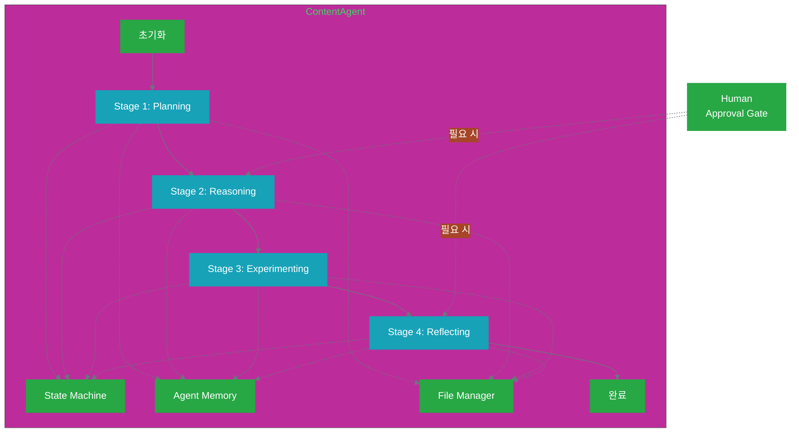
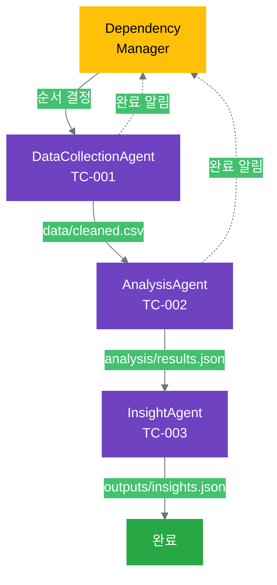

# 16.2 에이전트 팀 설계

16.1에서 사고 클러스터를 에이전트로 변환하는 개념을 배웠습니다. 이제 14장의 3가지 실전 사례를 실제 에이전트 코드로 구현해 봅시다. 각 사례는 11-12장에서 배운 패턴(단일, 병렬, 계층적)을 에이전트로 구현하는 방법을 보여줍니다.

## 16.2.1 단일 에이전트 설계 (14.1 기반)

14.1의 "마케팅 콘텐츠 생성" 사례를 단일 에이전트로 구현합니다.

### 사례 복습: 14.1 콘텐츠 생성

**목표**: 블로그 포스트 자동 생성

**사고 클러스터 (11장 패턴)**:
```yaml
4 Stage:
  Stage 1 (Planning): 10개 아이디어 발산
  Stage 2 (Reasoning): 핵심 가치 기반 선택
  Stage 3 (Experimenting): 초안 작성
  Stage 4 (Reflecting): 품질 검증

실행 방식 (14장):
  - 인간이 각 Stage 수동 실행
  - 프롬프트 작성 → AI 실행 → 결과 저장
  - thinking_state.json 수동 업데이트
```

**에이전트 목표**: 위 4 Stage를 자율적으로 실행

### ContentAgent 아키텍처



### 핵심 클래스 구조

```python
# 1. 기본 Agent 클래스
class BaseAgent:
    """모든 에이전트의 기본 클래스"""
    
    def __init__(self, task_id, config):
        self.task_id = task_id
        self.config = config
        self.task_dir = f"tasks/{task_id}"
        
        # 핵심 컴포넌트
        self.state = StateMachine(config['stages'])
        self.memory = AgentMemory(self.task_dir)
        self.file_manager = FileManager(self.task_dir)
        
        # 설정
        self.core_values = config['core_values']
        self.constraints = config.get('constraints', {})
        
        # 상태 추적
        self.started_at = None
        self.metrics = {}
    
    async def run(self):
        """하위 클래스에서 구현"""
        raise NotImplementedError()
    
    async def call_ai(self, prompt, **kwargs):
        """AI 호출 (재시도 포함)"""
        return await call_ai_with_retry(prompt, max_retries=3, **kwargs)
    
    def emit_progress(self, stage, percent, message=""):
        """진행 상황 알림"""
        event = {
            'task_id': self.task_id,
            'stage': stage,
            'percent': percent,
            'message': message,
            'timestamp': datetime.now().isoformat()
        }
        # 이벤트 버스로 전송 (웹소켓, Redis 등)
        self.event_bus.publish('agent.progress', event)


# 2. ContentAgent 구현
class ContentAgent(BaseAgent):
    """콘텐츠 생성 에이전트"""
    
    def __init__(self, task_id, config):
        super().__init__(task_id, config)
        
        # 콘텐츠 특화 설정
        self.topic = config.get('topic', '')
        self.target_length = config.get('target_length', 1000)
        self.min_quality_score = config.get('min_quality_score', 7.0)
        
        # Human-in-the-Loop 설정
        self.require_idea_approval = config.get('require_idea_approval', False)
        self.require_final_approval = config.get('require_final_approval', True)
        
        # 재시도 설정
        self.max_quality_retries = config.get('max_quality_retries', 2)
        self.quality_retry_count = 0
    
    async def run(self):
        """전체 워크플로우 실행"""
        try:
            self.started_at = datetime.now()
            self.emit_progress('started', 0, "콘텐츠 생성 시작")
            
            # Stage 1: Planning
            ideas = await self.planning_stage()
            
            # Stage 2: Reasoning
            selected_idea = await self.reasoning_stage(ideas)
            
            # Stage 3: Experimenting
            draft = await self.experimenting_stage(selected_idea)
            
            # Stage 4: Reflecting
            final_content = await self.reflecting_stage(draft)
            
            self.emit_progress('completed', 100, "콘텐츠 생성 완료")
            
            return {
                'content': final_content,
                'metrics': self.metrics,
                'task_id': self.task_id
            }
        
        except Exception as e:
            self.emit_progress('failed', -1, f"오류 발생: {str(e)}")
            raise
    
    # Stage 메서드들은 다음 섹션에서 상세히 다룸
```

### Stage 1: Planning (아이디어 발산)

```python
class ContentAgent(BaseAgent):
    async def planning_stage(self):
        """Stage 1: 아이디어 발산"""
        
        # 1. 상태 전환
        self.state.transition_to('planning')
        self.emit_progress('planning', 10, "아이디어 생성 중")
        
        # 2. 프롬프트 구성
        prompt = self._build_planning_prompt()
        
        # 3. AI 호출
        start_time = time.time()
        response = await self.call_ai(
            prompt,
            max_tokens=2000,
            temperature=0.8  # 창의성 높게
        )
        
        # 4. 결과 파싱
        ideas = self._parse_ideas(response)
        
        # 5. 메모리 저장
        thinking_record = {
            'stage': 'planning',
            'prompt': prompt,
            'response': response,
            'ideas': ideas,
            'duration': time.time() - start_time
        }
        self.memory.save('planning', thinking_record)
        
        # 6. 파일 저장
        self.file_manager.save_json(
            'thinking/planning/ideas.json',
            ideas
        )
        
        # 7. 메트릭 기록
        self.metrics['planning_duration'] = time.time() - start_time
        self.metrics['ideas_count'] = len(ideas)
        
        self.emit_progress('planning', 25, f"{len(ideas)}개 아이디어 생성 완료")
        
        return ideas
    
    def _build_planning_prompt(self):
        """Planning 프롬프트 구성"""
        
        # 과거 성공 사례 참조 (학습)
        past_successes = self._get_successful_topics()
        past_context = ""
        if past_successes:
            past_context = f"\n과거 성공한 주제들:\n" + "\n".join(
                f"- {topic}" for topic in past_successes[:3]
            )
        
        return f"""
당신은 창의적인 콘텐츠 기획자입니다.

미션: {self.config['mission']}
핵심 가치:
{self._format_core_values()}

주제: {self.topic}
목표 독자: {self.config.get('target_audience', '일반 독자')}
{past_context}

다음 기준으로 10개의 블로그 포스트 아이디어를 생성하세요:
1. 각 아이디어는 핵심 가치에 부합해야 합니다
2. 독자에게 실용적 가치를 제공해야 합니다
3. 다양한 각도에서 주제를 다뤄야 합니다
4. 제목은 명확하고 매력적이어야 합니다

각 아이디어를 다음 형식의 JSON으로 작성하세요:
{{
  "ideas": [
    {{
      "id": 1,
      "title": "제목",
      "angle": "접근 각도",
      "value_proposition": "독자가 얻는 가치",
      "key_points": ["핵심 포인트 1", "핵심 포인트 2", "핵심 포인트 3"],
      "estimated_length": 1000
    }},
    ...
  ]
}}
"""
    
    def _format_core_values(self):
        """핵심 가치를 문자열로 포맷"""
        values = self.core_values
        return "\n".join(
            f"- {v['name']}: {v['description']}"
            for v in values
        )
    
    def _parse_ideas(self, response):
        """AI 응답에서 아이디어 추출"""
        try:
            # JSON 파싱
            data = json.loads(response)
            return data['ideas']
        except json.JSONDecodeError:
            # JSON 파싱 실패 시 텍스트에서 추출
            return self._extract_ideas_from_text(response)
    
    def _get_successful_topics(self):
        """과거 성공한 주제 조회 (피드백 루프)"""
        # 과거 태스크의 품질 점수가 높은 주제들
        # 실제로는 데이터베이스나 파일에서 조회
        return []
```

### Stage 2: Reasoning (핵심 가치 기반 선택)

```python
class ContentAgent(BaseAgent):
    async def reasoning_stage(self, ideas):
        """Stage 2: 아이디어 선택"""
        
        # 1. 상태 전환
        self.state.transition_to('reasoning')
        self.emit_progress('reasoning', 30, "아이디어 평가 중")
        
        # 2. 자동 평가
        evaluation = await self._evaluate_ideas(ideas)
        
        # 3. Human-in-the-Loop (선택적)
        if self.require_idea_approval:
            selected = await self._request_idea_approval(evaluation)
        else:
            selected = evaluation['best_idea']
        
        # 4. 메모리 및 파일 저장
        thinking_record = {
            'stage': 'reasoning',
            'evaluation': evaluation,
            'selected': selected,
            'approval_required': self.require_idea_approval
        }
        self.memory.save('reasoning', thinking_record)
        
        self.file_manager.save_json(
            'thinking/reasoning/selected.json',
            selected
        )
        
        self.emit_progress('reasoning', 50, f"아이디어 선택 완료: {selected['title']}")
        
        return selected
    
    async def _evaluate_ideas(self, ideas):
        """핵심 가치 기준으로 아이디어 평가"""
        
        prompt = f"""
당신은 콘텐츠 평가 전문가입니다.

핵심 가치:
{self._format_core_values()}

다음 {len(ideas)}개 아이디어를 평가하세요:

{json.dumps(ideas, indent=2, ensure_ascii=False)}

각 아이디어를 핵심 가치별로 0-10점으로 평가하고,
총점이 가장 높은 아이디어를 추천하세요.

응답 형식:
{{
  "evaluations": [
    {{
      "idea_id": 1,
      "scores": {{
        "value1_name": 8,
        "value2_name": 7,
        ...
      }},
      "total_score": 25,
      "reasoning": "평가 근거"
    }},
    ...
  ],
  "best_idea_id": 3,
  "recommendation": "추천 이유"
}}
"""
        
        response = await self.call_ai(prompt, temperature=0.3)  # 일관성 높게
        evaluation_data = json.loads(response)
        
        # 최고 점수 아이디어 찾기
        best_id = evaluation_data['best_idea_id']
        best_idea = next(idea for idea in ideas if idea['id'] == best_id)
        
        return {
            'evaluations': evaluation_data['evaluations'],
            'best_idea': best_idea,
            'recommendation': evaluation_data['recommendation']
        }
    
    async def _request_idea_approval(self, evaluation):
        """인간에게 아이디어 승인 요청"""
        
        # Approval Gate 사용
        approval_gate = ApprovalGate(notifier=self.config['notifier'])
        
        context = {
            'task_id': self.task_id,
            'decision_point': '아이디어 선택',
            'evaluation': evaluation,
            'recommendation': evaluation['best_idea'],
            'options': [
                {
                    'type': 'approve',
                    'label': '추천 아이디어 승인',
                    'value': evaluation['best_idea']
                },
                {
                    'type': 'select_other',
                    'label': '다른 아이디어 선택',
                    'values': evaluation['evaluations']
                },
                {
                    'type': 'reject',
                    'label': '모두 거부 (재생성)'
                }
            ]
        }
        
        response = await approval_gate.require_approval(context)
        
        if response['action'] == 'approve':
            return evaluation['best_idea']
        elif response['action'] == 'select_other':
            return response['selected_idea']
        else:  # reject
            # 재생성
            new_ideas = await self.planning_stage()
            return await self.reasoning_stage(new_ideas)
```

### Stage 3: Experimenting (초안 작성)

```python
class ContentAgent(BaseAgent):
    async def experimenting_stage(self, selected_idea):
        """Stage 3: 초안 작성"""
        
        # 1. 상태 전환
        self.state.transition_to('experimenting')
        self.emit_progress('experimenting', 55, "초안 작성 중")
        
        # 2. 초안 작성 (여러 버전 생성 가능)
        drafts = []
        
        for version in range(1, 3):  # 2개 버전
            draft = await self._generate_draft(selected_idea, version)
            drafts.append(draft)
            
            # 버전별 저장
            self.file_manager.save_markdown(
                f'drafts/draft_v{version}.md',
                draft['content']
            )
        
        # 3. 최선의 초안 선택
        best_draft = await self._select_best_draft(drafts)
        
        # 4. 메모리 저장
        thinking_record = {
            'stage': 'experimenting',
            'idea': selected_idea,
            'drafts_generated': len(drafts),
            'selected_version': best_draft['version']
        }
        self.memory.save('experimenting', thinking_record)
        
        self.emit_progress('experimenting', 75, f"초안 작성 완료 (버전 {best_draft['version']})")
        
        return best_draft
    
    async def _generate_draft(self, idea, version):
        """초안 생성"""
        
        # 버전별 다른 전략
        strategies = {
            1: "실용적이고 구체적인 조언 중심",
            2: "스토리텔링과 사례 중심"
        }
        strategy = strategies.get(version, strategies[1])
        
        prompt = f"""
당신은 전문 콘텐츠 작가입니다.

제목: {idea['title']}
접근 각도: {idea['angle']}
핵심 포인트:
{chr(10).join(f"- {point}" for point in idea['key_points'])}

핵심 가치:
{self._format_core_values()}

전략: {strategy}
목표 길이: {self.target_length}자

다음 구조로 블로그 포스트 초안을 작성하세요:

1. 도입 (문제 제기 또는 흥미 유발)
2. 본문 (핵심 포인트별 상세 설명)
3. 사례 또는 예시
4. 실행 가능한 조언
5. 마무리 (요약 및 행동 촉구)

주의사항:
- 핵심 가치에 부합하는 내용
- 독자가 바로 적용할 수 있는 구체적 조언
- 명확하고 읽기 쉬운 문장
"""
        
        content = await self.call_ai(prompt, max_tokens=3000, temperature=0.7)
        
        return {
            'version': version,
            'content': content,
            'word_count': len(content),
            'strategy': strategy
        }
    
    async def _select_best_draft(self, drafts):
        """최선의 초안 선택"""
        
        if len(drafts) == 1:
            return drafts[0]
        
        # 간단한 품질 평가 (빠른 체크)
        prompt = f"""
다음 {len(drafts)}개 초안 중 더 나은 것을 선택하세요.

평가 기준:
- 명확성: 이해하기 쉬운가?
- 실용성: 바로 적용 가능한가?
- 구조: 논리적 흐름이 있는가?

초안 1:
{drafts[0]['content'][:500]}...

초안 2:
{drafts[1]['content'][:500]}...

응답: {{"selected_version": 1 또는 2, "reason": "선택 이유"}}
"""
        
        response = await self.call_ai(prompt, temperature=0.2)
        selection = json.loads(response)
        
        return next(d for d in drafts if d['version'] == selection['selected_version'])
```

### Stage 4: Reflecting (품질 검증)

```python
class ContentAgent(BaseAgent):
    async def reflecting_stage(self, draft):
        """Stage 4: 품질 검증 및 최종화"""
        
        # 1. 상태 전환
        self.state.transition_to('reflecting')
        self.emit_progress('reflecting', 80, "품질 검증 중")
        
        # 2. 품질 검증
        quality_report = await self._verify_quality(draft)
        
        # 3. 품질 기준 확인
        if quality_report['overall_score'] < self.min_quality_score:
            # 재시도 가능?
            if self.quality_retry_count < self.max_quality_retries:
                self.quality_retry_count += 1
                self.emit_progress('reflecting', 70, 
                    f"품질 미달 ({quality_report['overall_score']}), 재생성 중 ({self.quality_retry_count}/{self.max_quality_retries})")
                
                # Stage 3으로 돌아가서 재생성
                selected_idea = self.memory.get('reasoning')['selected']
                new_draft = await self.experimenting_stage(selected_idea)
                return await self.reflecting_stage(new_draft)
            
            else:
                # 최대 재시도 도달 → 인간 개입
                await self._notify_quality_failure(quality_report)
                raise QualityFailure(
                    f"품질 기준 미달: {quality_report['overall_score']}/{self.min_quality_score}"
                )
        
        # 4. 최종 승인 (선택적)
        if self.require_final_approval:
            final_content = await self._request_final_approval(draft, quality_report)
        else:
            final_content = draft['content']
        
        # 5. 최종 파일 저장
        self.file_manager.save_markdown('outputs/final.md', final_content)
        
        # 6. 메모리 저장
        thinking_record = {
            'stage': 'reflecting',
            'quality_report': quality_report,
            'retry_count': self.quality_retry_count,
            'approved': True
        }
        self.memory.save('reflecting', thinking_record)
        
        # 7. 메트릭 기록
        self.metrics['quality_score'] = quality_report['overall_score']
        self.metrics['quality_retries'] = self.quality_retry_count
        
        self.emit_progress('reflecting', 95, "품질 검증 완료")
        
        return final_content
    
    async def _verify_quality(self, draft):
        """품질 검증"""
        
        prompt = f"""
당신은 콘텐츠 품질 검증 전문가입니다.

다음 블로그 포스트를 평가하세요:

{draft['content']}

평가 기준 (각 0-10점):
1. 정확성: 내용이 정확하고 신뢰할 수 있는가?
2. 명료성: 이해하기 쉽고 명확한가?
3. 실용성: 독자가 바로 적용할 수 있는가?
4. 구조: 논리적 흐름이 있는가?
5. 가독성: 읽기 편한가?

핵심 가치 정렬 확인:
{self._format_core_values()}

응답 형식:
{{
  "scores": {{
    "accuracy": 8,
    "clarity": 9,
    "practicality": 7,
    "structure": 8,
    "readability": 9
  }},
  "overall_score": 8.2,
  "strengths": ["강점 1", "강점 2"],
  "weaknesses": ["약점 1", "약점 2"],
  "suggestions": ["개선 제안 1", "개선 제안 2"],
  "core_values_alignment": {{
    "value1": true,
    "value2": true
  }},
  "passed": true
}}
"""
        
        response = await self.call_ai(prompt, temperature=0.2)
        quality_report = json.loads(response)
        
        # 파일로도 저장
        self.file_manager.save_json(
            'thinking/reflecting/quality_report.json',
            quality_report
        )
        
        return quality_report
    
    async def _request_final_approval(self, draft, quality_report):
        """최종 승인 요청"""
        
        approval_gate = ApprovalGate(notifier=self.config['notifier'])
        
        context = {
            'task_id': self.task_id,
            'decision_point': '최종 승인',
            'content': draft['content'],
            'quality_report': quality_report,
            'options': [
                {'type': 'approve', 'label': '승인 및 발행'},
                {'type': 'edit', 'label': '수정 후 승인'},
                {'type': 'reject', 'label': '거부 (재작성)'}
            ]
        }
        
        response = await approval_gate.require_approval(context, timeout=7200)
        
        if response['action'] == 'approve':
            return draft['content']
        elif response['action'] == 'edit':
            # 인간이 수정한 버전 반환
            return response['edited_content']
        else:  # reject
            # Stage 3부터 재시작
            selected_idea = self.memory.get('reasoning')['selected']
            new_draft = await self.experimenting_stage(selected_idea)
            return await self.reflecting_stage(new_draft)
    
    async def _notify_quality_failure(self, quality_report):
        """품질 실패 알림"""
        
        notification = {
            'type': 'quality_failure',
            'task_id': self.task_id,
            'quality_score': quality_report['overall_score'],
            'required_score': self.min_quality_score,
            'retry_count': self.quality_retry_count,
            'weaknesses': quality_report['weaknesses'],
            'suggestions': quality_report['suggestions']
        }
        
        await self.config['notifier'].send(notification)
```

### 사용 예시

```python
# ContentAgent 사용
async def main():
    # 1. 설정
    config = {
        'mission': '독자에게 실용적 가치 제공',
        'core_values': [
            {'name': '정확성', 'description': '검증된 정보만 제공'},
            {'name': '명료성', 'description': '이해하기 쉽게 설명'},
            {'name': '실용성', 'description': '바로 적용 가능한 조언'}
        ],
        'topic': 'AI 생산성 도구 활용법',
        'target_audience': 'IT 실무자',
        'target_length': 1500,
        'min_quality_score': 7.5,
        'require_idea_approval': False,  # 자동 진행
        'require_final_approval': True,  # 최종만 승인
        'notifier': SlackNotifier(channel='#content-review')
    }
    
    # 2. 에이전트 생성
    agent = ContentAgent(
        task_id='content-001',
        config=config
    )
    
    # 3. 실행
    try:
        result = await agent.run()
        
        print(f"✅ 콘텐츠 생성 완료!")
        print(f"Task ID: {result['task_id']}")
        print(f"품질 점수: {result['metrics']['quality_score']}")
        print(f"총 소요 시간: {result['metrics']['total_duration']}초")
        
    except QualityFailure as e:
        print(f"❌ 품질 기준 미달: {e}")
    except ApprovalDenied as e:
        print(f"❌ 승인 거부: {e}")
    except Exception as e:
        print(f"❌ 오류 발생: {e}")


# 실행
if __name__ == "__main__":
    asyncio.run(main())
```

### 단일 에이전트 패턴 요약

**핵심 특징**:
1. **상태 머신**: 4 Stage를 순차적으로 진행
2. **메모리**: 각 Stage 결과를 저장하고 다음 Stage에서 참조
3. **파일 자동화**: thinking_record, 산출물 자동 저장
4. **Human-in-the-Loop**: 선택적 승인 지점 (아이디어 선택, 최종 승인)
5. **재시도**: 품질 미달 시 자동 재시도 (최대 N회)
6. **관찰 가능성**: 진행 상황 실시간 알림, 메트릭 수집

**적용 시나리오**:
- 정기적 콘텐츠 생성 (블로그, 뉴스레터)
- 리포트 자동 생성
- 이메일 캠페인 작성
- 소셜 미디어 포스트

**확장 포인트**:
- Stage 추가 (예: Editing Stage)
- 다양한 콘텐츠 타입 지원 (비디오 스크립트, 프레젠테이션)
- A/B 테스트 통합 (여러 버전 동시 생성)

---

## 16.2.2 병렬 에이전트 팀 (14.2 기반)

14.2의 "고객 데이터 분석" 사례를 병렬 에이전트 팀으로 구현합니다.

### 사례 복습: 14.2 데이터 분석

**목표**: 고객 세그먼트 분석 및 인사이트 도출

**사고 클러스터 (11장 패턴 × 3)**:
```yaml
TC-001: 데이터 수집 및 정제
TC-002: 세그먼트 분석
TC-003: 인사이트 도출

의존성:
  TC-002 depends_on: [TC-001]
  TC-003 depends_on: [TC-002]

실행 방식 (14장):
  - 인간이 의존성 확인 후 순차 실행
```

**에이전트 목표**: 3개 에이전트가 자동으로 순차 실행

### AnalysisAgentTeam 아키텍처



### 의존성 관리자

```python
class DependencyManager:
    """에이전트 간 의존성 관리"""
    
    def __init__(self, dependencies_config):
        """
        dependencies_config 예시:
        {
            "data_agent": {
                "depends_on": [],
                "outputs": ["data/cleaned.csv"]
            },
            "analysis_agent": {
                "depends_on": ["data_agent"],
                "requires": ["data/cleaned.csv"],
                "outputs": ["analysis/results.json"]
            },
            "insight_agent": {
                "depends_on": ["analysis_agent"],
                "requires": ["analysis/results.json"],
                "outputs": ["outputs/insights.json"]
            }
        }
        """
        self.dependencies = dependencies_config
        self.completed = set()
        self.in_progress = set()
    
    def can_start(self, agent_id, base_dir):
        """에이전트 시작 가능 여부 확인"""
        
        config = self.dependencies.get(agent_id, {})
        
        # 1. 선행 에이전트 완료 확인
        for dep_id in config.get('depends_on', []):
            if dep_id not in self.completed:
                return False, f"Waiting for {dep_id} to complete"
        
        # 2. 필요한 파일 존재 확인
        for file_path in config.get('requires', []):
            full_path = Path(base_dir) / file_path
            if not full_path.exists():
                return False, f"Required file missing: {file_path}"
        
        # 3. 이미 실행 중이거나 완료됐는지 확인
        if agent_id in self.in_progress:
            return False, f"{agent_id} already in progress"
        
        if agent_id in self.completed:
            return False, f"{agent_id} already completed"
        
        return True, "Ready to start"
    
    def mark_started(self, agent_id):
        """에이전트 시작 표시"""
        self.in_progress.add(agent_id)
    
    def mark_completed(self, agent_id):
        """에이전트 완료 표시"""
        self.in_progress.discard(agent_id)
        self.completed.add(agent_id)
    
    def get_execution_order(self):
        """실행 순서 결정 (위상 정렬)"""
        # 의존성 그래프에서 위상 정렬
        graph = {
            agent_id: config.get('depends_on', [])
            for agent_id, config in self.dependencies.items()
        }
        
        return topological_sort(graph)
    
    def get_next_ready_agents(self, base_dir):
        """현재 실행 가능한 에이전트 목록"""
        ready = []
        
        for agent_id in self.dependencies.keys():
            can_start, reason = self.can_start(agent_id, base_dir)
            if can_start:
                ready.append(agent_id)
        
        return ready


def topological_sort(graph):
    """위상 정렬 구현"""
    in_degree = {node: 0 for node in graph}
    
    for node in graph:
        for neighbor in graph[node]:
            in_degree[neighbor] = in_degree.get(neighbor, 0) + 1
    
    queue = [node for node in graph if in_degree[node] == 0]
    result = []
    
    while queue:
        node = queue.pop(0)
        result.append(node)
        
        for neighbor in graph.get(node, []):
            in_degree[neighbor] -= 1
            if in_degree[neighbor] == 0:
                queue.append(neighbor)
    
    if len(result) != len(graph):
        raise CyclicDependencyError("순환 의존성 감지")
    
    return result
```

### 팀 조율자

```python
class AnalysisAgentTeam:
    """병렬 에이전트 팀 조율"""
    
    def __init__(self, task_id, config):
        self.task_id = task_id
        self.config = config
        self.base_dir = f"tasks/{task_id}"
        
        # 의존성 관리자
        self.dependency_manager = DependencyManager(config['dependencies'])
        
        # 에이전트들 초기화
        self.agents = {
            'data_agent': DataCollectionAgent(task_id, config['data_config']),
            'analysis_agent': AnalysisAgent(task_id, config['analysis_config']),
            'insight_agent': InsightAgent(task_id, config['insight_config'])
        }
        
        # 상태 추적
        self.results = {}
        self.errors = {}
    
    async def run(self):
        """전체 팀 실행"""
        
        # 1. 실행 순서 결정
        execution_order = self.dependency_manager.get_execution_order()
        print(f"실행 순서: {' → '.join(execution_order)}")
        
        # 2. 순차 실행
        for agent_id in execution_order:
            await self._run_agent(agent_id)
        
        # 3. 결과 반환
        return {
            'task_id': self.task_id,
            'results': self.results,
            'errors': self.errors
        }
    
    async def _run_agent(self, agent_id):
        """개별 에이전트 실행"""
        
        # 1. 의존성 확인
        can_start, reason = self.dependency_manager.can_start(agent_id, self.base_dir)
        
        if not can_start:
            raise DependencyError(f"{agent_id} cannot start: {reason}")
        
        # 2. 시작 표시
        self.dependency_manager.mark_started(agent_id)
        print(f"▶ {agent_id} 시작")
        
        try:
            # 3. 에이전트 실행
            agent = self.agents[agent_id]
            result = await agent.run()
            
            # 4. 결과 저장
            self.results[agent_id] = result
            
            # 5. 완료 표시
            self.dependency_manager.mark_completed(agent_id)
            print(f"✅ {agent_id} 완료")
            
        except Exception as e:
            # 오류 기록
            self.errors[agent_id] = str(e)
            print(f"❌ {agent_id} 실패: {e}")
            
            # 후속 에이전트 실행 불가 → 중단
            raise AgentFailure(f"{agent_id} failed, stopping pipeline") from e
```

### 개별 에이전트 구현

```python
# 1. DataCollectionAgent
class DataCollectionAgent(BaseAgent):
    """데이터 수집 및 정제 에이전트"""
    
    async def run(self):
        """데이터 수집 워크플로우"""
        
        # Stage 1: 데이터 소스 연결
        raw_data = await self.collect_raw_data()
        
        # Stage 2: 데이터 정제
        cleaned_data = await self.clean_data(raw_data)
        
        # Stage 3: 검증
        validation = await self.validate_data(cleaned_data)
        
        if not validation['passed']:
            raise DataQualityError(validation['issues'])
        
        # Stage 4: 저장
        output_path = self.file_manager.save_csv('data/cleaned.csv', cleaned_data)
        
        return {
            'status': 'completed',
            'output_file': output_path,
            'row_count': len(cleaned_data),
            'validation': validation
        }
    
    async def collect_raw_data(self):
        """데이터 수집"""
        # 데이터베이스, API, 파일 등에서 수집
        ...
    
    async def clean_data(self, raw_data):
        """데이터 정제"""
        # 결측치 처리, 이상치 제거, 포맷 통일
        ...
    
    async def validate_data(self, data):
        """데이터 검증"""
        # 스키마 확인, 통계 검증
        ...


# 2. AnalysisAgent
class AnalysisAgent(BaseAgent):
    """세그먼트 분석 에이전트"""
    
    async def run(self):
        """분석 워크플로우"""
        
        # Stage 1: 데이터 로드
        data = self.file_manager.load_csv('data/cleaned.csv')
        
        # Stage 2: 세그먼트 분석
        segments = await self.segment_customers(data)
        
        # Stage 3: 각 세그먼트 특성 분석
        segment_profiles = await self.analyze_segments(segments)
        
        # Stage 4: 결과 저장
        results = {
            'segments': segments,
            'profiles': segment_profiles,
            'statistics': self.calculate_statistics(segments)
        }
        
        self.file_manager.save_json('analysis/results.json', results)
        
        return {
            'status': 'completed',
            'segment_count': len(segments),
            'output_file': 'analysis/results.json'
        }
    
    async def segment_customers(self, data):
        """고객 세그먼트 분석"""
        # 클러스터링 알고리즘 적용
        ...
    
    async def analyze_segments(self, segments):
        """세그먼트별 특성 분석"""
        # 각 세그먼트의 인구통계, 행동 패턴 등 분석
        ...


# 3. InsightAgent
class InsightAgent(BaseAgent):
    """인사이트 도출 에이전트"""
    
    async def run(self):
        """인사이트 도출 워크플로우"""
        
        # Stage 1: 분석 결과 로드
        analysis_results = self.file_manager.load_json('analysis/results.json')
        
        # Stage 2: AI를 활용한 인사이트 도출
        insights = await self.generate_insights(analysis_results)
        
        # Stage 3: 액션 아이템 도출
        action_items = await self.generate_action_items(insights)
        
        # Stage 4: 리포트 생성
        report = await self.generate_report(insights, action_items)
        
        # Stage 5: 저장
        output = {
            'insights': insights,
            'action_items': action_items,
            'report': report
        }
        
        self.file_manager.save_json('outputs/insights.json', output)
        self.file_manager.save_markdown('outputs/report.md', report)
        
        return {
            'status': 'completed',
            'insight_count': len(insights),
            'action_count': len(action_items)
        }
    
    async def generate_insights(self, analysis_results):
        """AI로 인사이트 생성"""
        
        prompt = f"""
고객 세그먼트 분석 결과:

{json.dumps(analysis_results, indent=2)}

각 세그먼트에 대해 다음을 도출하세요:
1. 핵심 특징
2. 비즈니스 의미
3. 기회와 위험
4. 다른 세그먼트와의 차이점

인사이트는 데이터에 근거하고 실행 가능해야 합니다.
"""
        
        response = await self.call_ai(prompt, max_tokens=2000)
        return json.loads(response)
```

### 사용 예시

```python
async def main():
    # 설정
    config = {
        'dependencies': {
            'data_agent': {
                'depends_on': [],
                'outputs': ['data/cleaned.csv']
            },
            'analysis_agent': {
                'depends_on': ['data_agent'],
                'requires': ['data/cleaned.csv'],
                'outputs': ['analysis/results.json']
            },
            'insight_agent': {
                'depends_on': ['analysis_agent'],
                'requires': ['analysis/results.json'],
                'outputs': ['outputs/insights.json']
            }
        },
        'data_config': {...},
        'analysis_config': {...},
        'insight_config': {...}
    }
    
    # 팀 생성 및 실행
    team = AnalysisAgentTeam(task_id='analysis-001', config=config)
    
    try:
        result = await team.run()
        print("✅ 분석 완료!")
        print(f"결과: {result}")
    except DependencyError as e:
        print(f"❌ 의존성 오류: {e}")
    except AgentFailure as e:
        print(f"❌ 에이전트 실패: {e}")


asyncio.run(main())
```

### 병렬 에이전트 패턴 요약

**핵심 특징**:
1. **의존성 관리**: 자동으로 실행 순서 결정
2. **팀 조율**: 에이전트 간 데이터 흐름 관리
3. **독립성**: 각 에이전트는 독립적으로 개발/테스트 가능
4. **재사용성**: 개별 에이전트를 다른 팀에서 재사용

**적용 시나리오**:
- 데이터 파이프라인 (수집 → 처리 → 분석 → 시각화)
- 멀티 스텝 워크플로우
- 각 단계가 명확히 구분되는 프로세스

---

다음 섹션(16.2.3)에서는 계층적 에이전트 시스템을 다룹니다.
