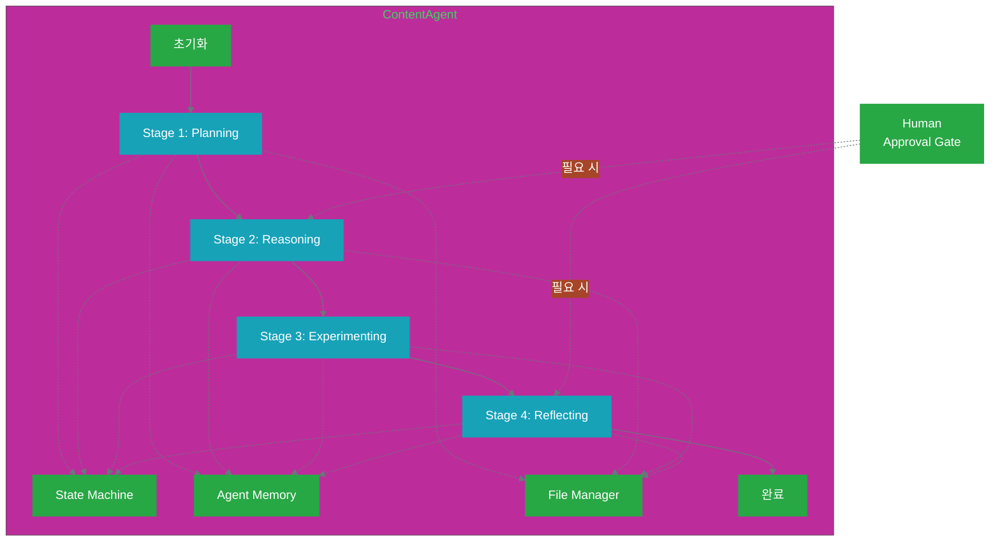
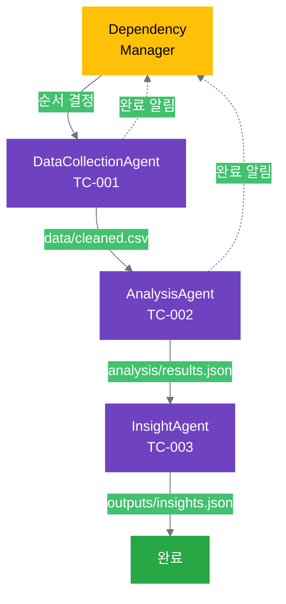

# 16.2 에이전트 팀 설계

16.1에서 사고 클러스터를 에이전트로 변환하는 개념을 배웠습니다. 이제 14장의 3가지 실전 사례를 실제 에이전트로 설계하는 방법을 살펴봅시다. 각 사례는 11-12장에서 배운 패턴(단일, 병렬, 계층적)을 에이전트로 구현하는 방법을 보여줍니다.

## 16.2.1 단일 에이전트 설계 (14.1 기반)

14.1의 "마케팅 콘텐츠 생성" 사례를 단일 에이전트로 구현합니다.

### 사례 복습: 14.1 콘텐츠 생성

**목표**: 블로그 포스트 자동 생성

**사고 클러스터 (11장 패턴)**:
```yaml
4 Stage:
  Stage 1 (Planning): 10개 아이디어 발산
  Stage 2 (Reasoning): 핵심 가치 기반 선택
  Stage 3 (Experimenting): 초안 작성
  Stage 4 (Reflecting): 품질 검증

실행 방식 (14장):
  - 인간이 각 Stage 수동 실행
  - 프롬프트 작성 → AI 실행 → 결과 저장
  - thinking_state.json 수동 업데이트
```

**에이전트 목표**: 위 4 Stage를 자율적으로 실행

### ContentAgent 아키텍처



### ContentAgent 구조

```yaml
ContentAgent:
  
  초기_설정:
    task_id: "content-001"
    config:
      mission: "독자에게 실용적 가치 제공"
      core_values:
        - name: "정확성"
          description: "검증된 정보만 제공"
        - name: "명료성"
          description: "이해하기 쉽게 설명"
        - name: "실용성"
          description: "바로 적용 가능한 조언"
      topic: "AI 생산성 도구 활용법"
      target_audience: "IT 실무자"
      target_length: 1500
      min_quality_score: 7.5
  
  핵심_컴포넌트:
    state_machine:
      역할: "Stage 전환 관리"
      상태: ["planning", "reasoning", "experimenting", "reflecting"]
    
    agent_memory:
      역할: "각 Stage 결과 저장 및 참조"
      저장: "thinking/[stage]/thinking_record.json"
    
    file_manager:
      역할: "파일 자동 저장/로드"
      경로: "tasks/content-001/"
    
    approval_gate:
      역할: "Human-in-the-Loop 처리"
      지점: ["아이디어 선택", "최종 승인"]
  
  재시도_설정:
    max_quality_retries: 2
    quality_retry_count: 0

전체_실행_흐름:
  1. 초기화
     - 설정 로드
     - 컴포넌트 초기화
     - 진행 상황 알림 시작
  
  2. Stage 1 (Planning) 실행
     - 10개 아이디어 생성
     - ideas.json 저장
     - 메모리 및 메트릭 기록
  
  3. Stage 2 (Reasoning) 실행
     - 아이디어 자동 평가
     - 인간 승인 요청 (선택적)
     - selected.json 저장
  
  4. Stage 3 (Experimenting) 실행
     - 초안 작성 (2개 버전)
     - 최선 버전 선택
     - draft.md 저장
  
  5. Stage 4 (Reflecting) 실행
     - 품질 검증
     - 기준 미달 시 재시도
     - 최종 승인 요청 (선택적)
     - final.md 저장
  
  6. 완료
     - 결과 반환
     - 메트릭 보고
```

### Stage 1: Planning (아이디어 발산)

```text
목적: 10개의 다양한 아이디어 생성

실행 흐름:
  1. 상태 전환
     - State Machine을 "planning"으로 전환
     - 진행 상황 알림: "아이디어 생성 중 (10%)"
  
  2. 프롬프트 구성
     - 미션과 핵심 가치 포함
     - 주제와 목표 독자 명시
     - 과거 성공 사례 참조 (학습)
     - JSON 형식 요청
  
  3. AI 호출
     - 프롬프트 전송
     - 재시도 메커니즘 (최대 3회)
     - 응답 대기
  
  4. 결과 파싱
     - JSON 파싱
     - 10개 아이디어 추출
     - 각 아이디어 구조:
       * id: 번호
       * title: 제목
       * angle: 접근 각도
       * value_proposition: 독자 가치
       * key_points: 핵심 포인트 3개
       * estimated_length: 예상 길이
  
  5. 저장
     - Agent Memory에 저장
     - ideas.json 파일 생성
     - thinking_record.json 업데이트
  
  6. 메트릭 기록
     - 소요 시간
     - 생성된 아이디어 수
     - API 호출 횟수
  
  7. 진행 상황 알림
     - "10개 아이디어 생성 완료 (25%)"

프롬프트 예시:
  "당신은 창의적인 콘텐츠 기획자입니다.
   
   미션: 독자에게 실용적 가치 제공
   핵심 가치:
   - 정확성: 검증된 정보만 제공
   - 명료성: 이해하기 쉽게 설명
   - 실용성: 바로 적용 가능한 조언
   
   주제: AI 생산성 도구 활용법
   목표 독자: IT 실무자
   
   다음 기준으로 10개의 블로그 포스트 아이디어를 생성하세요:
   1. 각 아이디어는 핵심 가치에 부합해야 합니다
   2. 독자에게 실용적 가치를 제공해야 합니다
   3. 다양한 각도에서 주제를 다뤄야 합니다"

학습 메커니즘:
  - 과거 성공한 주제 패턴 참조
  - 독자 반응이 좋았던 각도 우선
  - 실패한 접근 방식 회피
```

### Stage 2: Reasoning (핵심 가치 기반 선택)

```text
목적: 핵심 가치 기준으로 최적 아이디어 선택

실행 흐름:
  1. 상태 전환
     - State Machine을 "reasoning"으로 전환
     - 진행 상황 알림: "아이디어 평가 중 (30%)"
  
  2. 자동 평가
     - ideas.json 로드
     - 각 아이디어를 핵심 가치별로 평가
     - 평가 기준:
       * 정확성: 검증 가능한 정보인가?
       * 명료성: 이해하기 쉬운 구조인가?
       * 실용성: 바로 적용 가능한가?
     - 각 기준별 0-10점 부여
     - 총점 계산 및 순위 결정
  
  3. 평가 결과:
     evaluations:
       - idea_id: 1
         scores:
           정확성: 8
           명료성: 7
           실용성: 9
         total_score: 24
         reasoning: "매우 실용적이고 검증 가능"
       - idea_id: 2
         scores: ...
     
     best_idea_id: 3
     recommendation: "독자에게 즉시 적용 가능하고 명확함"
  
  4. Human-in-the-Loop (선택적)
     - require_idea_approval = true인 경우:
       * 평가 결과를 인간에게 전송
       * 추천 아이디어 제시
       * 승인 옵션:
         - 추천 아이디어 승인
         - 다른 아이디어 선택
         - 모두 거부 (재생성)
       * 승인 대기 (타임아웃: 1시간)
     
     - require_idea_approval = false인 경우:
       * 자동으로 최고 점수 아이디어 선택
  
  5. 저장
     - 평가 결과를 Agent Memory에 저장
     - selected.json 파일 생성
     - thinking_record.json 업데이트
  
  6. 진행 상황 알림
     - "아이디어 선택 완료: [제목] (50%)"

자동 평가 프롬프트 예시:
  "당신은 콘텐츠 평가 전문가입니다.
   
   핵심 가치:
   - 정확성: 검증된 정보만 제공
   - 명료성: 이해하기 쉽게 설명
   - 실용성: 바로 적용 가능한 조언
   
   다음 10개 아이디어를 평가하세요:
   [아이디어 목록]
   
   각 아이디어를 핵심 가치별로 0-10점으로 평가하고,
   총점이 가장 높은 아이디어를 추천하세요."

거부 처리:
  - 모두 거부 시 → Stage 1로 돌아가 재생성
  - 새로운 아이디어로 Stage 2 재실행
```

### Stage 3: Experimenting (초안 작성)

```text
목적: 선택된 아이디어로 초안 작성

실행 흐름:
  1. 상태 전환
     - State Machine을 "experimenting"으로 전환
     - 진행 상황 알림: "초안 작성 중 (55%)"
  
  2. 다중 버전 생성 전략
     - 2개 버전 생성 (다양성 확보)
     
     버전 1: 실용적 조언 중심
       - 전략: "구체적이고 실행 가능한 조언 제공"
       - 구조:
         * 도입: 문제 제기
         * 본문: 단계별 가이드
         * 사례: 실제 적용 예시
         * 조언: 즉시 실행 가능한 팁
         * 마무리: 요약 및 다음 단계
     
     버전 2: 스토리텔링 중심
       - 전략: "사례와 스토리로 설명"
       - 구조:
         * 도입: 실제 사례 소개
         * 본문: 사례 분석 및 인사이트
         * 교훈: 핵심 포인트 추출
         * 적용: 독자 상황에 적용 방법
         * 마무리: 행동 촉구
  
  3. 각 버전 생성
     - selected.json 로드
     - 버전별 프롬프트 구성
     - AI 호출
     - 결과 파싱
     - 파일 저장: drafts/draft_v1.md, drafts/draft_v2.md
  
  4. 최선 버전 선택
     - 2개 버전을 AI로 비교 평가
     - 평가 기준:
       * 명확성: 이해하기 쉬운가?
       * 실용성: 바로 적용 가능한가?
       * 구조: 논리적 흐름이 있는가?
     - 점수 높은 버전 선택
  
  5. 저장
     - 선택된 버전을 draft.md로 저장
     - 메모리 업데이트
     - thinking_record.json 업데이트
  
  6. 진행 상황 알림
     - "초안 작성 완료 (버전 2 선택) (75%)"

초안 작성 프롬프트 예시:
  "당신은 전문 콘텐츠 작가입니다.
   
   제목: [선택된 아이디어 제목]
   접근 각도: [접근 방식]
   핵심 포인트:
   - [포인트 1]
   - [포인트 2]
   - [포인트 3]
   
   전략: 실용적이고 구체적인 조언 중심
   목표 길이: 1500자
   
   다음 구조로 블로그 포스트 초안을 작성하세요:
   1. 도입 (문제 제기)
   2. 본문 (핵심 포인트별 설명)
   3. 사례 또는 예시
   4. 실행 가능한 조언
   5. 마무리 (요약 및 행동 촉구)
   
   주의사항:
   - 핵심 가치에 부합하는 내용
   - 독자가 바로 적용할 수 있는 구체적 조언
   - 명확하고 읽기 쉬운 문장"

다중 버전의 가치:
  - 다양한 접근 방식 탐색
  - 최선의 전략 선택
  - 실패 위험 분산
```

### Stage 4: Reflecting (품질 검증)

```text
목적: 품질 검증 및 최종화

실행 흐름:
  1. 상태 전환
     - State Machine을 "reflecting"으로 전환
     - 진행 상황 알림: "품질 검증 중 (80%)"
  
  2. 품질 검증
     - draft.md 로드
     - AI로 다면적 평가
     
     평가 기준 (각 0-10점):
       1. 정확성: 내용이 정확하고 신뢰할 수 있는가?
       2. 명료성: 이해하기 쉽고 명확한가?
       3. 실용성: 독자가 바로 적용할 수 있는가?
       4. 구조: 논리적 흐름이 있는가?
       5. 가독성: 읽기 편한가?
     
     핵심 가치 정렬 확인:
       - 각 핵심 가치가 반영되었는가?
       - 미션에 부합하는가?
  
  3. 품질 리포트:
     scores:
       정확성: 8
       명료성: 9
       실용성: 7
       구조: 8
       가독성: 9
     
     overall_score: 8.2
     
     strengths:
       - "명확하고 이해하기 쉬움"
       - "구조가 논리적임"
     
     weaknesses:
       - "실용성이 다소 부족"
       - "구체적 예시 더 필요"
     
     suggestions:
       - "2번 섹션에 더 구체적인 예시 추가"
       - "실행 단계를 더 명확히"
     
     passed: true (overall_score >= 7.5)
  
  4. 품질 기준 확인
     - 기준: min_quality_score = 7.5
     
     Case A: 기준 통과 (8.2 >= 7.5)
       → 다음 단계로 진행
     
     Case B: 기준 미달 (6.5 < 7.5)
       → 재시도 로직 실행:
          * retry_count < max_retries (2회):
            - retry_count 증가
            - "품질 미달, 재생성 중 (1/2)" 알림
            - Stage 3으로 돌아가 재작성
            - Stage 4 재실행
          
          * retry_count >= max_retries:
            - "품질 기준 미달, 인간 개입 필요" 알림
            - 품질 리포트 전송
            - 작업 중단
  
  5. 최종 승인 (선택적)
     - require_final_approval = true인 경우:
       * 초안과 품질 리포트를 인간에게 전송
       * 승인 옵션:
         - 승인 및 발행
         - 수정 후 승인 (인간이 직접 수정)
         - 거부 (재작성)
       * 승인 대기 (타임아웃: 2시간)
     
     - require_final_approval = false인 경우:
       * 품질 통과 시 자동 완료
  
  6. 최종 저장
     - 승인된 콘텐츠를 outputs/final.md에 저장
     - 메모리 업데이트
     - 메트릭 기록:
       * quality_score: 8.2
       * retry_count: 0
       * approved: true
  
  7. 진행 상황 알림
     - "품질 검증 완료 (95%)"
     - "콘텐츠 생성 완료 (100%)"

품질 검증 프롬프트 예시:
  "당신은 콘텐츠 품질 검증 전문가입니다.
   
   다음 블로그 포스트를 평가하세요:
   [초안 내용]
   
   평가 기준 (각 0-10점):
   1. 정확성: 내용이 정확하고 신뢰할 수 있는가?
   2. 명료성: 이해하기 쉽고 명확한가?
   3. 실용성: 독자가 바로 적용할 수 있는가?
   4. 구조: 논리적 흐름이 있는가?
   5. 가독성: 읽기 편한가?
   
   핵심 가치 정렬 확인:
   - 정확성, 명료성, 실용성
   
   평가 결과를 JSON으로 반환하세요."

재시도 전략의 가치:
  - 일시적 품질 문제 해결
  - 최대 재시도 후 인간 개입
  - 무한 루프 방지
```

### 사용 시나리오

```yaml
시나리오_1: 완전 자동 (승인 불필요)
  설정:
    require_idea_approval: false
    require_final_approval: false
  
  흐름:
    Planning → Reasoning (자동 선택) → Experimenting → Reflecting (자동 완료)
  
  소요_시간: 약 5-10분
  인간_개입: 없음 (품질 미달 시에만)
  
  적용:
    - 정기 콘텐츠 생성 (뉴스레터)
    - 높은 신뢰도 작업
    - 대량 생성

시나리오_2: 부분 승인 (아이디어만)
  설정:
    require_idea_approval: true
    require_final_approval: false
  
  흐름:
    Planning → Reasoning (인간 승인) → Experimenting → Reflecting (자동 완료)
  
  소요_시간: 약 10-15분 + 승인 대기
  인간_개입: 아이디어 선택 시점
  
  적용:
    - 중요한 주제 선정
    - 방향성 확인 필요
    - 브랜드 일관성 중요

시나리오_3: 완전 승인 (양쪽 모두)
  설정:
    require_idea_approval: true
    require_final_approval: true
  
  흐름:
    Planning → Reasoning (인간 승인) → Experimenting → Reflecting (인간 승인)
  
  소요_시간: 약 15-20분 + 승인 대기 2회
  인간_개입: 아이디어 선택, 최종 승인
  
  적용:
    - 고위험 콘텐츠
    - 공식 발표문
    - 법적 검토 필요
```

### 단일 에이전트 패턴 요약

**핵심 특징**:
```yaml
특징:
  1. 상태_머신:
     - 4 Stage 순차 진행
     - 자동 전환 및 추적
  
  2. 메모리_시스템:
     - 각 Stage 결과 저장
     - 다음 Stage에서 참조
     - 학습 및 개선
  
  3. 파일_자동화:
     - thinking_record.json 자동 업데이트
     - 산출물 자동 저장
     - 디렉토리 자동 생성
  
  4. Human-in-the-Loop:
     - 선택적 승인 지점
     - Approval Gate 통합
     - 타임아웃 관리
  
  5. 재시도_메커니즘:
     - 품질 미달 시 자동 재시도
     - 최대 횟수 제한
     - 최종 실패 시 인간 알림
  
  6. 관찰_가능성:
     - 실시간 진행 상황 알림
     - 메트릭 자동 수집
     - 상세 로깅

적용_시나리오:
  - 정기적 콘텐츠 생성 (블로그, 뉴스레터)
  - 리포트 자동 생성
  - 이메일 캠페인 작성
  - 소셜 미디어 포스트

장점:
  - 시간 절약: 60-70%
  - 일관성: 항상 같은 품질 기준
  - 확장성: 동시 여러 작업 가능
  - 추적성: 모든 단계 자동 기록

제약:
  - 창의성: 인간보다 제한적
  - 맥락 이해: 복잡한 상황 어려움
  - 최종 책임: 인간 검토 필수
```

---

## 16.2.2 병렬 에이전트 팀 (14.2 기반)

14.2의 "고객 데이터 분석" 사례를 병렬 에이전트 팀으로 구현합니다.

### 사례 복습: 14.2 데이터 분석

**목표**: 고객 세그먼트 분석 및 인사이트 도출

**사고 클러스터 (11장 패턴 × 3)**:
```yaml
TC-001: 데이터 수집 및 정제
TC-002: 세그먼트 분석
TC-003: 인사이트 도출

의존성:
  TC-002 depends_on: [TC-001]
  TC-003 depends_on: [TC-002]

실행 방식 (14장):
  - 인간이 의존성 확인 후 순차 실행
```

**에이전트 목표**: 3개 에이전트가 자동으로 순차 실행

### AnalysisAgentTeam 아키텍처



### 핵심 컴포넌트

#### 1. Dependency Manager (의존성 관리자)

```yaml
역할:
  - 에이전트 간 실행 순서 자동 결정
  - 선행 에이전트 완료 확인
  - 필요한 파일 존재 확인
  - 실행 가능 에이전트 식별

의존성_정의:
  data_agent:
    depends_on: []
    outputs: ["data/cleaned.csv"]
  
  analysis_agent:
    depends_on: ["data_agent"]
    requires: ["data/cleaned.csv"]
    outputs: ["analysis/results.json"]
  
  insight_agent:
    depends_on: ["analysis_agent"]
    requires: ["analysis/results.json"]
    outputs: ["outputs/insights.json"]

핵심_기능:
  1. can_start(agent_id):
     확인_사항:
       - 선행 에이전트가 모두 완료되었는가?
       - 필요한 파일이 모두 존재하는가?
       - 이미 실행 중이거나 완료되지 않았는가?
     
     반환:
       - (true, "Ready to start")
       - (false, "Waiting for data_agent to complete")
  
  2. get_execution_order():
     방법: 위상 정렬 (Topological Sort)
     결과: ["data_agent", "analysis_agent", "insight_agent"]
     
     위상_정렬:
       - 의존성 그래프 분석
       - 순환 의존성 감지
       - 실행 가능 순서 도출
  
  3. mark_completed(agent_id):
     역할: 에이전트 완료 표시
     효과: 다음 에이전트 실행 가능

오류_처리:
  순환_의존성:
    예시: A → B → C → A
    감지: 위상 정렬 실패
    대응: CyclicDependencyError 발생
  
  파일_누락:
    감지: requires 파일 없음
    대응: DependencyError 발생
    메시지: "Required file missing: data/cleaned.csv"
```

#### 2. Team Coordinator (팀 조율자)

```yaml
역할:
  - 전체 팀 실행 조율
  - 에이전트 순차 실행
  - 결과 수집 및 오류 처리

구조:
  AnalysisAgentTeam:
    초기화:
      task_id: "analysis-001"
      base_dir: "tasks/analysis-001/"
      dependency_manager: DependencyManager
      agents:
        data_agent: DataCollectionAgent
        analysis_agent: AnalysisAgent
        insight_agent: InsightAgent
    
    상태_추적:
      results: {}  # 각 에이전트 결과
      errors: {}   # 각 에이전트 오류

실행_흐름:
  1. 실행 순서 결정
     - Dependency Manager에 요청
     - 순서: ["data_agent", "analysis_agent", "insight_agent"]
  
  2. 순차 실행
     for agent_id in execution_order:
       a. 의존성 확인
          - can_start(agent_id) 호출
          - false면 DependencyError 발생
       
       b. 에이전트 시작
          - mark_started(agent_id)
          - 진행 상황 알림: "▶ data_agent 시작"
       
       c. 에이전트 실행
          - agent.run() 호출
          - 결과 대기
       
       d. 결과 처리
          - 성공: results[agent_id] = result
          - 실패: errors[agent_id] = error
       
       e. 완료 표시
          - mark_completed(agent_id)
          - 진행 상황 알림: "✅ data_agent 완료"
  
  3. 최종 결과 반환
     - 모든 에이전트 결과 취합
     - 메트릭 수집
     - 전체 리포트 생성

오류_처리:
  에이전트_실패:
    - 오류 기록: errors[agent_id] = error
    - 후속 에이전트 실행 중단
    - AgentFailure 예외 발생
    - 인간에게 알림
  
  파이프라인_중단:
    - 실패 시점까지의 결과 보존
    - 체크포인트 저장
    - 재개 가능 상태 유지
```

### 개별 에이전트 설계

#### Agent 1: DataCollectionAgent

```yaml
목적: 데이터 수집 및 정제

실행_단계:
  Stage 1: 데이터 소스 연결
    - 데이터베이스 연결
    - API 호출
    - 파일 읽기
    - 원시 데이터 수집
  
  Stage 2: 데이터 정제
    - 결측치 처리 (평균, 중앙값, 제거)
    - 이상치 제거 (IQR, Z-score)
    - 중복 제거
    - 포맷 통일 (날짜, 문자열 등)
  
  Stage 3: 데이터 검증
    - 스키마 확인 (컬럼, 타입)
    - 통계 검증 (범위, 분포)
    - 무결성 확인
    - 품질 점수 계산
  
  Stage 4: 저장
    - data/cleaned.csv 생성
    - 메타데이터 저장 (행 수, 컬럼 등)
    - 검증 리포트 생성

출력:
  data/cleaned.csv:
    - 정제된 고객 데이터
    - 컬럼: customer_id, age, purchase_amount, ...
  
  data/metadata.json:
    - row_count: 10000
    - columns: [...]
    - data_quality_score: 8.5

의존성:
  선행: 없음
  후행: AnalysisAgent가 이 파일 필요
```

#### Agent 2: AnalysisAgent

```yaml
목적: 고객 세그먼트 분석

실행_단계:
  Stage 1: 데이터 로드
    - data/cleaned.csv 읽기
    - 데이터 구조 확인
  
  Stage 2: 세그먼트 분석
    - 클러스터링 알고리즘 적용 (K-means, DBSCAN 등)
    - 최적 세그먼트 수 결정
    - 각 고객을 세그먼트에 할당
  
  Stage 3: 세그먼트 프로파일링
    - 각 세그먼트 특성 분석:
      * 인구통계 (나이, 지역 등)
      * 행동 패턴 (구매 빈도, 금액 등)
      * 선호도 (카테고리, 채널 등)
  
  Stage 4: 저장
    - analysis/results.json 생성
    - 세그먼트 정보 및 프로파일
    - 통계 데이터

출력:
  analysis/results.json:
    segments:
      - id: 1
        name: "고가치 고객"
        size: 1500
        characteristics:
          avg_age: 35
          avg_purchase: 500000
          frequency: "주 1회"
      - id: 2
        name: "잠재 고객"
        ...
    
    statistics:
      total_customers: 10000
      segment_count: 4

의존성:
  선행: DataCollectionAgent
  필요_파일: data/cleaned.csv
  후행: InsightAgent가 이 파일 필요
```

#### Agent 3: InsightAgent

```yaml
목적: 인사이트 도출 및 리포트 생성

실행_단계:
  Stage 1: 분석 결과 로드
    - analysis/results.json 읽기
    - 세그먼트 데이터 파싱
  
  Stage 2: AI 인사이트 도출
    - 각 세그먼트 특징 해석
    - 비즈니스 의미 분석
    - 기회와 위험 식별
    - 세그먼트 간 비교
  
  Stage 3: 액션 아이템 생성
    - 실행 가능한 제안:
      * 마케팅 전략
      * 상품 추천
      * 타겟팅 방법
    - 우선순위 지정
  
  Stage 4: 리포트 생성
    - 종합 리포트 작성
    - 시각화 데이터 생성
    - 경영진 요약
  
  Stage 5: 저장
    - outputs/insights.json
    - outputs/report.md
    - outputs/executive_summary.md

출력:
  outputs/insights.json:
    insights:
      - segment_id: 1
        key_findings:
          - "평균 구매액이 전체의 3배"
          - "충성도 매우 높음"
        business_meaning:
          - "핵심 수익원"
        opportunities:
          - "프리미엄 제품 확대"
        risks:
          - "경쟁사 이탈 위험"
    
    action_items:
      - priority: 1
        action: "고가치 고객 VIP 프로그램 신설"
        expected_impact: "수익 20% 증가"
      - priority: 2
        ...

의존성:
  선행: AnalysisAgent
  필요_파일: analysis/results.json
  후행: 없음 (최종 단계)
```

### 실행 시나리오

```yaml
정상_실행:
  1. 시작
     - AnalysisAgentTeam 초기화
     - 의존성 그래프 로드
  
  2. data_agent 실행
     - 상태: "실행 중"
     - 진행: "데이터 수집 중..."
     - 완료: data/cleaned.csv 생성
     - 알림: "✅ data_agent 완료"
  
  3. analysis_agent 실행
     - 대기: data_agent 완료 확인
     - 파일: data/cleaned.csv 존재 확인
     - 상태: "실행 중"
     - 진행: "세그먼트 분석 중..."
     - 완료: analysis/results.json 생성
     - 알림: "✅ analysis_agent 완료"
  
  4. insight_agent 실행
     - 대기: analysis_agent 완료 확인
     - 파일: analysis/results.json 존재 확인
     - 상태: "실행 중"
     - 진행: "인사이트 도출 중..."
     - 완료: outputs/insights.json 생성
     - 알림: "✅ insight_agent 완료"
  
  5. 최종 완료
     - 전체 결과 취합
     - 메트릭 보고:
       * 총 소요 시간: 15분
       * 데이터 행 수: 10000
       * 세그먼트 수: 4
       * 인사이트 수: 12

오류_시나리오:
  analysis_agent_실패:
    1. data_agent 완료 ✅
    2. analysis_agent 시작
    3. 오류 발생: "클러스터링 실패"
    4. 오류 기록
    5. insight_agent 실행 중단
    6. 인간에게 알림:
       - "analysis_agent 실패"
       - "오류: 클러스터링 실패"
       - "data_agent 결과는 보존됨"
    7. 재개 가능 상태 저장

재개_시나리오:
  1. 오류 수정 후
  2. AnalysisAgentTeam 재실행
  3. Dependency Manager 확인:
     - data_agent: 이미 완료 (스킵)
     - analysis_agent: 재실행
     - insight_agent: 대기
  4. analysis_agent부터 재개
  5. 정상 완료
```

### 병렬 에이전트 패턴 요약

```yaml
핵심_특징:
  1. 의존성_관리:
     - 자동 실행 순서 결정
     - 선행 조건 자동 확인
     - 파일 존재 검증
  
  2. 팀_조율:
     - 에이전트 간 데이터 흐름 관리
     - 순차 실행 조율
     - 오류 시 파이프라인 중단
  
  3. 독립성:
     - 각 에이전트 독립 개발/테스트
     - 느슨한 결합 (파일 기반 통신)
     - 개별 에이전트 재사용 가능
  
  4. 재개_가능성:
     - 실패 지점 기록
     - 완료된 작업 보존
     - 재실행 시 중복 제거

적용_시나리오:
  - 데이터 파이프라인 (수집 → 처리 → 분석)
  - 멀티 스텝 워크플로우
  - 각 단계가 명확히 구분되는 프로세스
  - ETL (Extract, Transform, Load) 작업

장점:
  - 모듈성: 각 에이전트 독립
  - 재사용성: 다른 팀에서 재활용
  - 안정성: 부분 실패 시 재개 가능
  - 확장성: 에이전트 추가 용이

제약:
  - 순차 실행: 병렬 처리 불가
  - 파일 의존: 파일 I/O 오버헤드
  - 오류 전파: 한 에이전트 실패 시 전체 중단

확장_방향:
  - 병렬 실행: 의존성 없는 에이전트 동시 실행
  - 조건부 실행: if-then 로직 추가
  - 재시도: 개별 에이전트 자동 재시도
```

---

다음 섹션(16.2.3)에서는 계층적 에이전트 시스템을 다룹니다.
