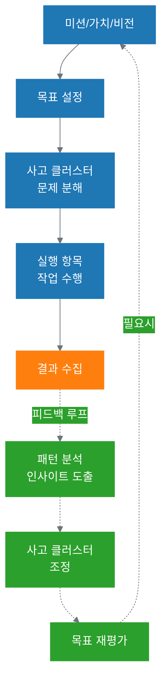
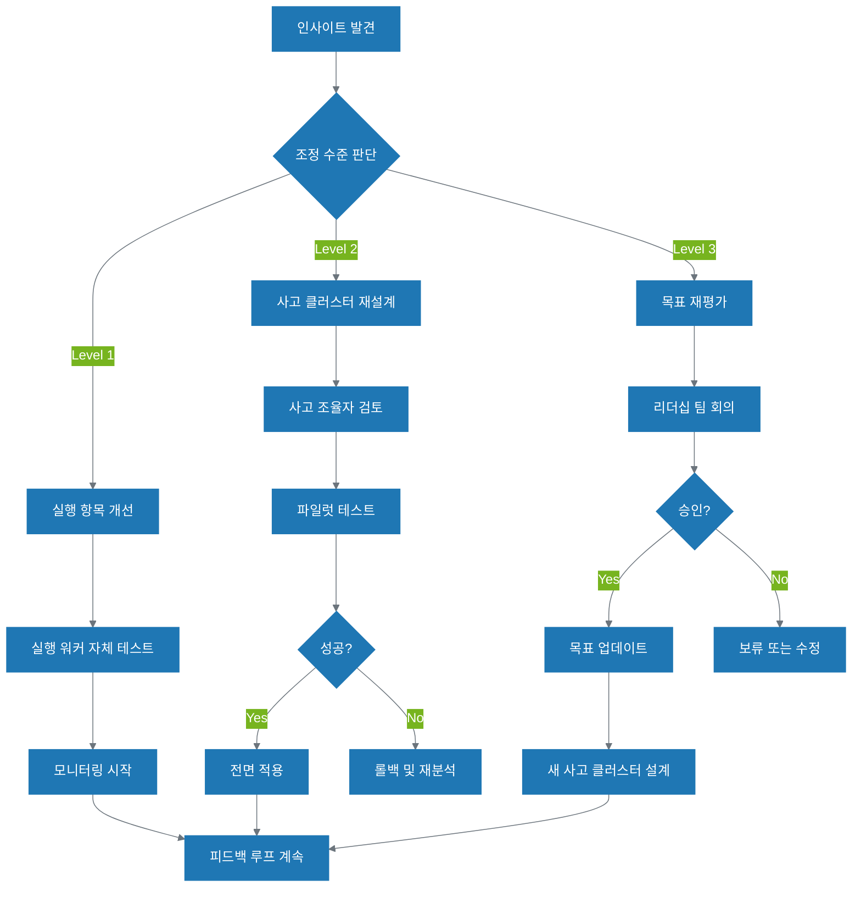
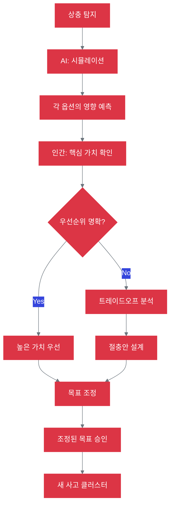
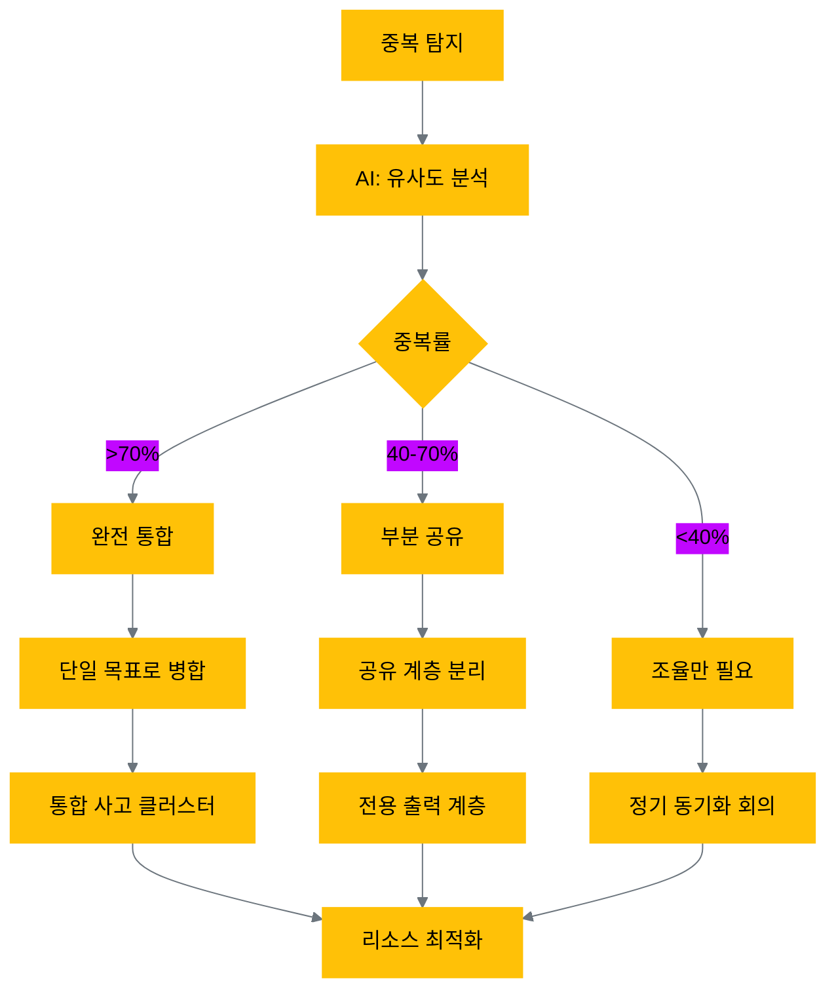
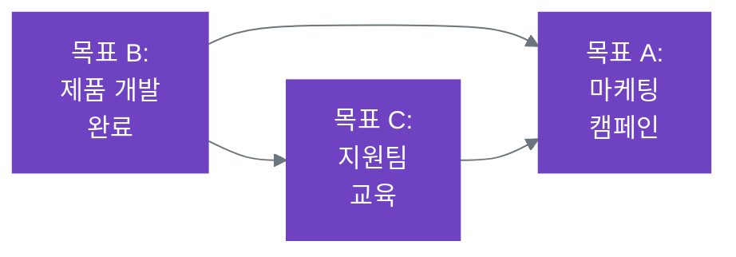
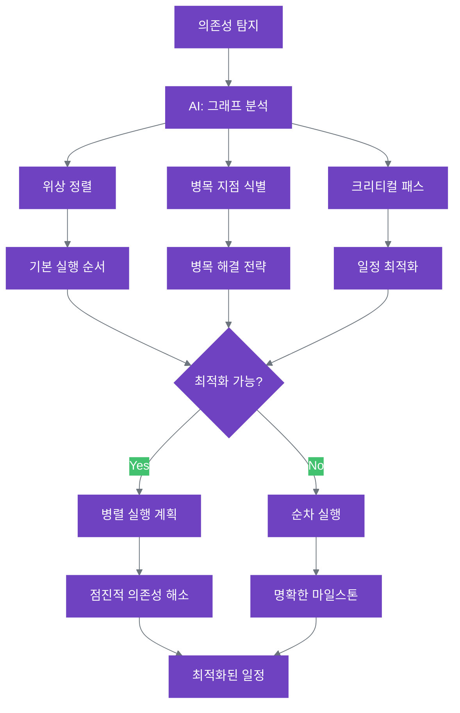
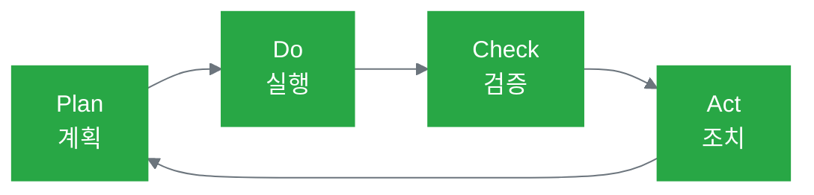

# 15장. 피드백 루프와 지속적 학습

**Part 5: 시스템 확장과 운영**

**난이도**: ⭐⭐⭐⭐ (심화)

**목적:** AI 사고 생태계의 핵심 메커니즘인 피드백 루프를 이해하고, 실행 결과를 사고와 전략으로 되돌려 지속적으로 학습하고 개선하는 조직을 만드는 방법을 배웁니다.

### 이 장에서 배우는 것
- AI 사고 생태계의 완성: 실행 → 사고 → 전략으로의 피드백 루프
- 피드백 루프의 3단계: 결과 수집, 패턴 분석, 조정
- 목표 충돌 해결: 상충, 중복, 의존성 관리
- 학습하는 조직 구축: 피드백 문화와 지속적 개선
- 시스템 진화 전략: 조직 성장과 기술 발전 대응

---

## 들어가며: AI 사고 생태계의 완성

2권 서문에서 소개한 **AI 사고 생태계 6계층 구조**를 기억하시나요?

```
미션 (Mission)
  ↓
핵심 가치 (Core Values)
  ↓
비전 (Vision)
  ↓
목표 (Goals)
  ↓
사고 클러스터 (Thinking Clusters)
  ↓
실행 항목 (Execution Items)
```

11-14장을 통해 우리는 목표를 사고 클러스터로 분해하고(11-12장), 실행 항목을 효과적으로 지원하며(13장), 사고 워크플로우를 명확히 정의하는(14장) 방법을 배웠습니다. 이제 이 구조를 완성하는 마지막 퍼즐 조각, **피드백 루프(Feedback Loop)**를 살펴볼 차례입니다.

### 피드백 루프: 학습하는 조직의 핵심

피드백 루프는 실행 항목의 결과를 다시 사고 클러스터로, 나아가 목표와 전략으로 되돌리는 메커니즘입니다. 이것이 없다면 우리의 AI 사고 생태계는 단순히 "계획하고 실행하는" 일회성 시스템에 불과합니다. 피드백 루프가 있어야 비로소 **"실행 → 학습 → 개선"의 선순환**이 만들어지고, 조직은 경험으로부터 배우며 지속적으로 진화할 수 있습니다.



### 피드백 루프가 해결하는 세 가지 핵심 과제

이 장에서는 피드백 루프를 통해 다음 세 가지 핵심 과제를 해결하는 방법을 배웁니다:

1. **지속적 개선**: 실행 결과를 체계적으로 수집하고 분석하여, 사고 프로세스를 개선합니다.
2. **목표 충돌 해결**: 서로 상충하거나, 중복되거나, 의존적인 목표들을 조기에 발견하고 조정합니다.
3. **조직 진화**: 조직의 성장과 기술의 발전에 맞춰 시스템 전체를 진화시킵니다.

이것이 바로 **2권이 1권과 차별화되는 핵심**입니다. 1권에서는 개인이 AI와 효과적으로 협업하는 방법을 배웠다면, 2권에서는 조직 전체가 **사고 중심으로 움직이며 지속적으로 학습하는 시스템**을 만드는 방법을 배우는 것입니다.

---

## 15.1 피드백 루프의 3단계

피드백 루프는 **결과 수집 → 패턴 분석 → 조정**의 3단계로 이루어집니다. 각 단계에서 인간과 AI는 각기 다른 역할을 수행하며 협력합니다.

### 15.1.1 1단계: 결과 수집 및 측정

첫 번째 단계는 실행 항목의 결과를 체계적으로 수집하고 측정하는 것입니다. 단순히 "일이 끝났다"고 기록하는 것을 넘어, **성공과 실패의 구체적인 지표**를 수집해야 합니다.

#### 수집해야 할 데이터

**1. 정량적 지표 (Quantitative Metrics)**
- **성과 지표**: 완료율, 정확도, 처리 시간, 비용
- **품질 지표**: 오류율, 재작업비율, 폐기율
- **효율성 지표**: 리소스 사용량, API 호출 횟수, 토큰 소비

**2. 정성적 피드백 (Qualitative Feedback)**
- **사용자 평가**: 만족도, 불만 사항, 개선 요청
- **팀 피드백**: 사고 프로세스의 적절성, 협업의 원활함
- **예외 상황**: 예상치 못한 문제, 엣지 케이스

**3. 컨텍스트 정보 (Context Information)**
- **실행 환경**: 언제, 누가, 어떤 상황에서
- **입력 데이터**: 어떤 데이터를 받았는가
- **의사결정 지점**: Human-in-the-Loop에서 인간의 개입이 있었는가

#### 수집 방법 및 도구

```yaml
# 결과 수집 설정 예시
result_collection:
  metrics:
    - name: "완료율"
      type: "percentage"
      threshold: 95
    
    - name: "평균 처리시간"
      type: "duration"
      target: "< 5분"
    
    - name: "사용자 만족도"
      type: "rating"
      scale: "1-5"
  
  feedback_channels:
    - "사용자 설문"
    - "팀 회고 미팅"
    - "자동 로그 분석"
  
  logging:
    level: "detailed"
    include_context: true
    retention: "90일"
```

**추천 도구**:
- **로그 수집**: Elasticsearch, Splunk, CloudWatch
- **메트릭 추적**: Datadog, Prometheus, Grafana
- **사용자 피드백**: Slack 통합, 설문 도구, 내부 티켓 시스템

#### 사례: 콘텐츠 생성 파이프라인

11장에서 다룬 "소셜 미디어 콘텐츠 발행" 사고 클러스터의 결과 수집 예시:

```markdown
주간 결과 보고 (Week 23)

정량 지표:
- 발행된 제품: 25개 (목표: 20개) ✅
- 평균 생성 시간: 4.2분 (목표: 5분) ✅
- 재작업률: 12% (목표: 15%) ✅
- 비용: $127 (예산: $150) ✅

정성 피드백:
- 좋았던 점:
  * 이미지 선택이 브랜드 가이드에 잘 맞음
  * 해시태그 제안이 트렌드에 적절

- 개선 필요:
  * 커피가 너무 길어 편집에 시간 소요
  * 제품 설명이 특정 타겟층에게는 어렵다는 피드백

예외 상황:
- 3건: 제품 링크 오류 (API 문제)
- 1건: 이미지 라이선스 확인 필요
```

이러한 데이터는 다음 단계인 패턴 분석의 기초가 됩니다.

### 15.1.2 2단계: 패턴 분석 및 인사이트 도출

수집된 데이터에서 의미있는 패턴을 발견하고 인사이트를 도출하는 단계입니다. 여기서 **AI와 인간의 협업**이 빛을 발합니다.

#### AI의 역할: 패턴 인식

AI는 대량의 데이터에서 패턴을 발견하는 데 훌륭합니다:

**1. 통계적 패턴**
- **상관관계**: "특정 제품 유형에서 재작업률이 높다"
- **시간별 추세**: "주말에 생성된 콘텐츠의 품질이 낮다"
- **이상치 탐지**: "어제 갑자기 오류율이 3배 증가했다"

**2. 의미론적 패턴**
- **피드백 분류**: "불만 사항의 70%가 '너무 길다'와 관련"
- **키워드 추출**: "사용자들이 자주 언급하는 단어: '어려움', '불명확'"
- **감정 분석**: "평균 감정 점수가 -0.3 (약간 부정적)"

**3. 예측 모델링**
- **실패 예측**: "이 유형의 입력은 80% 확률로 재작업 필요"
- **병목 현상**: "이 사고 클러스터가 점점 느려지고 있다"

```python
# AI를 활용한 패턴 분석 예시
import pandas as pd
from sklearn.cluster import KMeans

# 데이터 로드
results_df = load_execution_results()

# 패턴 1: 재작업이 많은 콘텐츠 유형 파악
high_rework = results_df[results_df['rework_rate'] > 0.2]
pattern_1 = high_rework.groupby('content_type').size()

print(f"재작업이 많은 유형: {pattern_1.nlargest(3)}")
# 출력: "제품 비교" (32건), "기술 리뷰" (28건)

# 패턴 2: 시간대별 품질 분석
results_df['hour'] = pd.to_datetime(results_df['created_at']).dt.hour
quality_by_hour = results_df.groupby('hour')['quality_score'].mean()

print(f"가장 품질이 낮은 시간대: {quality_by_hour.nsmallest(3)}")
# 출력: 22시 (3.2), 23시 (3.1), 21시 (3.4)
```

#### 인간의 역할: 의미 해석

AI가 발견한 패턴에 **비즈니스 맥락과 의미**를 부여하는 것은 인간의 몫입니다:

**1. 인과관계 파악**
```markdown
AI 분석: "주말 콘텐츠의 품질이 낮다"

인간 해석:
- 주말에 생성된 콘텐츠는 월요일 매니저 검토 없이 발행됨
- 대응: 주말 생성 콘텐츠는 월요일 아침에 최종 검토 단계 추가
```

**2. 비즈니스 영향 평가**
```markdown
AI 분석: "제품 비교 콘텐츠의 재작업률 32%"

인간 해석:
- 제품 비교는 구매 전환율이 가장 높은 콘텐츠 (비즈니스 핵심)
- 현재 품질 문제로 인한 예상 손실: 월 $45K
- 대응: 최우선 개선 필요 → 사고 클러스터 재설계
```

**3. 개선 기회 발견**
```markdown
AI 분석: "일부 제품에서 사용자 만족도 4.8/5.0"

인간 해석:
- 해당 제품들의 공통점 분석
- 발견: "고객 사례"가 포함된 콘텐츠
- 기회: 모든 콘텐츠에 사례 추가 패턴 확산 → 새로운 사고 패턴
```

#### 인사이트 보고서 예시

```markdown
# 월간 피드백 분석 보고서 (2025년 3월)

## 핵심 인사이트

### 1. 제품 비교 콘텐츠 품질 문제 ⚠️
- **패턴**: 재작업률 32% (평균대비 2.1배)
- **원인**: 사고 조율자가 기술 사양을 충분히 분석하지 못함
- **비즈니스 영향**: 월 $45K 손실 추정
- **권장 조치**: 사고 클러스터 재설계 (제품 분석 단계 추가)

### 2. 고객 사례 포함 시 품질 향상 ⭐
- **패턴**: 사례 포함 콘텐츠 만족도 4.8/5.0 (vs 평균 4.1)
- **기회**: 모든 콘텐츠에 사례 추가 패턴 확산
- **예상 효과**: 전체 만족도 +0.7점 상승
- **행동 아이템**: 사례 데이터베이스 구축 및 사고 클러스터에 통합

### 3. 주말 생성 콘텐츠 품질 하락
- **패턴**: 주말 품질 점수 3.6/5.0 (vs 평일 4.2)
- **원인**: 월요일 검토 없이 자동 발행
- **조치**: 주말 생성 콘텐츠 월요일 검토 단계 추가

## 다음 단계
1. 제품 비교 사고 클러스터 재설계 (우선순위 1)
2. 사례 데이터베이스 구축 (우선순위 2)
3. 주말 워크플로우 개선 (우선순위 3)
```

이러한 인사이트는 다음 단계인 조정의 기초가 됩니다.

### 15.1.3 3단계: 사고 클러스터 및 목표 조정

분석에서 도출된 인사이트를 바탕으로 실제로 **시스템을 개선**하는 단계입니다. AI 사고 생태계의 여러 계층에서 조정이 일어날 수 있습니다.

#### 조정의 3가지 수준

**수준 1: 실행 항목 개선 (가장 빈번함)**
- **무엇을**: 개별 작업의 효율성, 품질 개선
- **예시**: 
  - 프롬프트 개선 ("300자 이내" → "200-250자")
  - 도구 파라미터 조정
  - 검증 규칙 강화

```yaml
# 제품 비교 콘텐츠 생성 실행 항목 개선
execution_item:
  name: "제품 비교 분석"
  
  # 기존
  old_prompt: |
    두 제품을 비교하세요.
    기능, 가격, 사양을 표로 정리하세요.
  
  # 개선 (15.1.2 분석 반영)
  new_prompt: |
    두 제품을 체계적으로 비교 분석하세요.
    
    1단계: 기술 사양 수집
    - CPU, RAM, 저장용량 등 주요 사양 추출
    - 명시되지 않은 사양은 "미제공"으로 표시
    
    2단계: 비교 표 작성
    - 각 항목별로 명확한 차이점 표시
    - 설명은 기술 비전문가도 이해하기 쉽게
    
    3단계: 결론 및 추천
    - 사용 목적별 추천 (예: 게임용 vs 업무용)
```

**수준 2: 사고 클러스터 재설계 (중간 빈도)**
- **무엇을**: 사고 프로세스 자체를 변경
- **예시**:
  - 사고 단계 추가/제거
  - 사고 조율자의 역할 분리
  - Human-in-the-Loop 지점 조정

```markdown
기존 사고 흐름:
1. 키워드 분석
2. 커피 생성
3. 이미지 선택
4. 최종 검토

개선된 사고 흐름 (제품 비교 전용):
1. 키워드 분석
2. **제품 사양 수집 (신규)** ← 15.1.2 인사이트 반영
3. **사양 비교 표 작성 (신규)**
4. 커피 생성
5. 이미지 선택
6. **사례 추가 (신규)** ← 15.1.2 인사이트 반영
7. 최종 검토
```

**수준 3: 목표 재평가 (드물지만 중요)**
- **무엇을**: 목표 자체의 타당성, 우선순위 재평가
- **예시**:
  - 목표 수정 ("20개/주" → "25개/주")
  - 목표 추가 ("고객 사례 데이터베이스 구축" 신규 목표)
  - 목표 통합 (중복 목표 발견 시)

```yaml
# 목표 조정 예시
goal_adjustment:
  trigger: "15.1.2 분석에서 사례 포함 콘텐츠 효과 발견"
  
  new_goal:
    name: "고객 사례 데이터베이스 구축"
    rationale: "사례가 있는 콘텐츠의 만족도가 17% 높음"
    target: "100개 사례 수집 (3개월 내)"
    dependencies: 
      - "고객 팀과 협업"
      - "법적 검토 필요"
  
  existing_goal_update:
    name: "콘텐츠 생성 자동화"
    change: "모든 콘텐츠에 사례 포함 패턴 추가"
```

#### 조정 의사결정 프로세스

모든 조정은 명확한 근거와 승인 프로세스를 거쳐야 합니다:



#### 조정 사례: 제품 비교 콘텐츠 개선

15.1.2에서 분석한 "제품 비교 콘텐츠 품질 문제"에 대한 조정 사례:

**1단계: 실행 항목 개선 (Week 1)**
```markdown
변경 내용:
- 프롬프트에 사양 분석 단계 추가
- 기술 비전문가 언어 지침 강화

결과:
- 재작업률: 32% → 24% (현저한 개선)
- 하지만 여전히 평균(15%)보다 높음 → 더 깊은 개선 필요
```

**2단계: 사고 클러스터 재설계 (Week 2-3)**
```markdown
변경 내용:
- 사고 단계 추가: 사양 수집 → 비교 표 작성
- 사고 조율자의 역할 분리:
  * 워커 A: 제품 사양 수집 전문
  * 워커 B: 비교 분석 전문
  * 워커 C: 커피 작성

파일럿 결과 (50건):
- 재작업률: 24% → 12% (50% 감소 ✅)
- 비용: +15% 증가 (단계 추가로 인한)
- 사용자 만족도: 4.1 → 4.5 (+0.4)

결정: 전면 적용 승인 ✅
```

**3단계: 새로운 목표 추가 (Week 4)**
```markdown
변경 내용:
- 새 목표: "고객 사례 데이터베이스 구축"
- 근거: 15.1.2 분석에서 사례 효과 확인

새 사고 클러스터 설계:
- 사고 조율자: 사례 매칭 전문가
- 실행 워커:
  * 사례 수집기 (고객팀 협업)
  * 사례 필터링 (관련성 평가)
  * 사례 통합 (콘텐츠에 삽입)
```

#### 피드백 루프의 순환

조정이 완료되면, 다시 15.1.1로 돌아가 새로운 결과를 수집합니다. 이것이 **지속적 학습과 개선의 선순환**입니다.

```
결과 수집 (Week 1-2)
    ↓
패턴 분석 (Week 3)
    ↓
조정 (Week 4-5)
    ↓
새로운 결과 수집 (Week 6-7)
    ↓
새로운 패턴 분석 (Week 8)
    ↓
추가 조정 (Week 9)
    ↓
... (지속적 순환)
```

이렇게 **피드백 루프의 3단계**를 통해 AI 사고 생태계는 경험으로부터 학습하고 지속적으로 진화합니다. 다음 절에서는 피드백 루프가 해결하는 또 다른 중요한 문제인 **목표 충돌**을 다룹니다.

---

## 15.2 목표 충돌 해결

조직이 여러 목표를 동시에 추구할 때, 목표들 사이에 **충돌**이 발생할 수 있습니다. 이러한 충돌을 조기에 발견하고 해결하지 못하면, 자원 낭비, 팀 갈등, 그리고 전략적 혼란으로 이어집니다. AI 사고 생태계에서는 **피드백 루프**를 통해 목표 충돌을 체계적으로 탐지하고 해결할 수 있습니다.

### 목표 충돌이 발생하는 이유

**1. 서로 다른 출처의 목표**
- 마케팅 팀: "빠른 콘텐츠 생산 (주 50개)"
- 품질 팀: "철저한 검증과 높은 품질"
- → **상충**: 속도 vs 품질

**2. 빠르게 변화하는 환경**
- Q1 목표: "신규 고객 확보에 집중"
- Q2 목표: "기존 고객 리텐션 강화"
- → 두 목표가 동일한 리소스(콘텐츠 팀)를 필요로 함

**3. 명확하지 않은 목표 정의**
- 목표 A: "소셜 미디어 참여도 증대"
- 목표 B: "브랜드 인지도 향상을 위한 소셜 활동"
- → **중복**: 실제로는 같은 목표

AI 사고 생태계의 6계층 구조에서는 목표들이 명확히 정의되어 있지만, 그럼에도 불구하고 세 가지 유형의 충돌이 발생할 수 있습니다: **상충**, **중복**, **의존**.

| 유형 | 정의 | 해결 방안 |
| --- | --- | --- |
| **상충 (Conflict)** | 서로 다른 목표가 반대 방향을 추구할 때 | 핵심 가치의 우선순위를 평가하여 목표를 조정합니다. |
| **중복 (Redundancy)** | 서로 다른 목표가 같은 결과를 추구하거나 노력을 반복할 때 | 중복된 목표를 병합하거나 통합합니다. |
| **의존 (Dependency)** | 한 목표가 다른 목표의 결과에 의존할 때 | 실행 순서를 명확히 하고 일정과 우선순위를 조정합니다. |

### 15.2.1 상충 (Conflict): 반대 방향으로 가는 목표들

#### 정의 및 탐지 방법

**상충**은 두 목표가 서로 **상반되는 방향**을 추구하거나, 동일한 제한된 자원을 경쟁적으로 필요로 할 때 발생합니다. 한 목표의 성취가 다른 목표의 달성을 방해하는 상황입니다.

**AI 탐지 방법**:
```python
# 목표 상충 탐지 예시
def detect_goal_conflicts(goals):
    conflicts = []
    
    for goal_a, goal_b in combinations(goals, 2):
        # 1. 의미론적 반대 관계 탐지
        if are_semantically_opposite(goal_a.description, goal_b.description):
            conflicts.append({
                'type': 'semantic_conflict',
                'goals': [goal_a, goal_b],
                'reason': "목표의 방향성이 정반대입니다"
            })
        
        # 2. 자원 경쟁 탐지
        shared_resources = goal_a.resources & goal_b.resources
        if shared_resources and goal_a.priority == goal_b.priority:
            conflicts.append({
                'type': 'resource_conflict',
                'goals': [goal_a, goal_b],
                'reason': f"동일한 자원 필요: {shared_resources}"
            })
    
    return conflicts

# 사용 예시
goals = [
    Goal(name="빠른 콘텐츠 생산", resources={'content_team'}, priority=1),
    Goal(name="철저한 품질 검증", resources={'content_team'}, priority=1)
]

conflicts = detect_goal_conflicts(goals)
# 출력: resource_conflict - 동일한 자원 필요: {'content_team'}
```

#### 실제 사례 1: 비용 절감 vs 품질 향상

**상황**:
- **목표 A**: "AI 비용 30% 절감" (CFO 주도)
- **목표 B**: "콘텐츠 품질 점수 4.5/5.0 달성" (CMO 주도)

**상충 지점**:
- 비용 절감을 위해 저렴한 모델 사용 → 품질 하락
- 품질 향상을 위해 프리미엄 모델 사용 → 비용 증가

**AI 탐지 결과**:
```markdown
⚠️ 목표 상충 탐지

목표 A: AI 비용 30% 절감
목표 B: 콘텐츠 품질 4.5/5.0 달성

상충 이유:
- 시뮬레이션 결과, 비용 30% 절감 시 품질 3.8로 하락 예상
- 품질 4.5 달성 시 비용 15% 증가 예상

추천: 핵심 가치 기반 우선순위 결정 필요
```

**인간 판단 프로세스**:

1. **핵심 가치 확인**
```yaml
core_values:
  - name: "고객 신뢰"
    priority: 1
    description: "고객에게 항상 가치 있는 정보 제공"
  
  - name: "지속 가능성"
    priority: 2
    description: "장기적으로 유지 가능한 비즈니스 모델"
```

2. **트레이드오프 분석**
```markdown
옵션 1: 비용 우선
- 비용: -30% ✅
- 품질: 3.8/5.0 ❌ (핵심 가치 "고객 신뢰" 위배)
- 예상 영향: 고객 이탈 +15%

옵션 2: 품질 우선
- 비용: +15% ❌
- 품질: 4.5/5.0 ✅
- 예상 영향: 고객 만족도 +25%, 신규 고객 +10%

옵션 3: 절충안
- 중요 콘텐츠(제품 비교)는 프리미엄 모델
- 일반 콘텐츠(소셜 포스트)는 표준 모델
- 비용: -12%, 품질: 4.3/5.0 ⚖️
```

3. **최종 결정**
```yaml
decision:
  chosen_option: "옵션 3 - 절충안"
  rationale: |
    핵심 가치 "고객 신뢰"를 우선하되, 
    "지속 가능성"도 고려하여 차별화된 전략 채택
  
  goal_adjustments:
    - goal: "AI 비용 30% 절감"
      new_target: "12% 절감 (선택적 모델 사용)"
    
    - goal: "콘텐츠 품질 4.5/5.0"
      new_target: "핵심 콘텐츠 4.5, 일반 콘텐츠 4.0"
```

#### 실제 사례 2: 빠른 출시 vs 완벽한 테스트

**상황**:
- **목표 A**: "신기능 2주 내 출시" (제품 팀)
- **목표 B**: "모든 기능 100% 테스트 커버리지" (QA 팀)

**AI 탐지 및 시뮬레이션**:
```python
# 시간 vs 품질 트레이드오프 분석
scenarios = [
    {'launch': '2주', 'coverage': '60%', 'bugs': 'medium'},
    {'launch': '3주', 'coverage': '85%', 'bugs': 'low'},
    {'launch': '4주', 'coverage': '100%', 'bugs': 'very_low'}
]

# 비즈니스 영향 평가
for scenario in scenarios:
    impact = calculate_business_impact(scenario)
    print(f"{scenario['launch']}: 수익 {impact.revenue}, 브랜드 {impact.brand_damage}")

# 출력:
# 2주: 수익 +$100K, 브랜드 손실 -$50K
# 3주: 수익 +$85K, 브랜드 손실 -$10K ← 최적
# 4주: 수익 +$70K, 브랜드 손실 $0
```

**해결책**:
```yaml
resolution:
  approach: "단계적 출시 (Phased Rollout)"
  
  phases:
    - phase: 1
      timeline: "2주"
      scope: "베타 사용자 10%"
      testing: "60% 커버리지"
    
    - phase: 2
      timeline: "+1주"
      scope: "일반 사용자 50%"
      testing: "85% 커버리지"
    
    - phase: 3
      timeline: "+1주"
      scope: "전체 사용자 100%"
      testing: "100% 커버리지"
  
  benefits:
    - "빠른 시장 진입 (2주)"
    - "리스크 관리 (점진적 확대)"
    - "품질 보장 (최종 100% 테스트)"
```

#### 상충 해결 프로세스



### 15.2.2 중복 (Redundancy): 같은 결과를 추구하는 목표들

#### 정의 및 탐지 방법

**중복**은 서로 다른 이름의 목표들이 실제로는 **동일하거나 매우 유사한 결과**를 추구할 때 발생합니다. 이는 자원 낭비와 조직 내 혼란을 야기합니다.

**AI 탐지 방법**:
```python
# 목표 중복 탐지 예시
from sklearn.metrics.pairwise import cosine_similarity
import numpy as np

def detect_goal_redundancy(goals, threshold=0.85):
    redundancies = []
    
    # 1. 목표 설명의 의미론적 유사도 계산
    embeddings = [get_embedding(goal.description) for goal in goals]
    similarities = cosine_similarity(embeddings)
    
    # 2. 높은 유사도를 가진 목표 쌍 식별
    for i in range(len(goals)):
        for j in range(i+1, len(goals)):
            if similarities[i][j] > threshold:
                redundancies.append({
                    'goals': [goals[i], goals[j]],
                    'similarity': similarities[i][j],
                    'type': 'semantic_redundancy'
                })
    
    # 3. 동일한 KPI를 추구하는 목표 탐지
    for goal_a, goal_b in combinations(goals, 2):
        shared_kpis = goal_a.kpis & goal_b.kpis
        if len(shared_kpis) >= 2:  # 2개 이상 KPI 공유
            redundancies.append({
                'goals': [goal_a, goal_b],
                'shared_kpis': shared_kpis,
                'type': 'kpi_redundancy'
            })
    
    return redundancies
```

#### 실제 사례 1: 중복된 콘텐츠 전략

**상황**:
- **목표 A** (마케팅 팀): "소셜 미디어 참여도 30% 증대"
  - KPI: 좋아요, 댓글, 공유 수
  - 사고 클러스터: 소셜 콘텐츠 생성 자동화
  
- **목표 B** (브랜드 팀): "브랜드 인지도 향상을 위한 소셜 활동 강화"
  - KPI: 팔로워 증가, 게시물 도달 범위
  - 사고 클러스터: 브랜드 콘텐츠 파이프라인 구축

**AI 탐지 결과**:
```markdown
🔍 목표 중복 탐지

목표 A: 소셜 미디어 참여도 증대
목표 B: 브랜드 인지도 향상을 위한 소셜 활동

중복 이유:
- 의미론적 유사도: 0.91 (매우 높음)
- 공유 KPI: 소셜 참여도, 도달 범위
- 두 팀 모두 소셜 콘텐츠 생성에 리소스 투입

영향:
- 중복 작업으로 인한 리소스 낭비: 월 $12K 추정
- 팀 간 조율 부재로 메시지 불일치 위험

권장 조치: 목표 통합 및 단일 사고 클러스터 구성
```

**목표 병합 전략**:
```yaml
# 통합 전
goals:
  - name: "소셜 미디어 참여도 증대"
    owner: "마케팅 팀"
    kpis: ['engagement_rate', 'shares']
  
  - name: "브랜드 인지도 향상"
    owner: "브랜드 팀"
    kpis: ['followers', 'reach']

# 통합 후
merged_goal:
  name: "소셜 미디어를 통한 브랜드 성장"
  description: |
    참여도 증대와 인지도 향상을 통합하여
    소셜 미디어에서 브랜드의 전반적 성장 달성
  
  owners: 
    - "마케팅 팀 (실행)"
    - "브랜드 팀 (전략 및 가이드라인)"
  
  kpis:
    engagement:
      - name: "참여도"
        target: "+30%"
        owner: "마케팅"
    
    awareness:
      - name: "팔로워"
        target: "+25%"
        owner: "브랜드"
  
  single_thinking_cluster:
    name: "통합 소셜 콘텐츠 파이프라인"
    coordinator: "소셜 미디어 조율자"
    workers:
      - "콘텐츠 생성 워커" (마케팅)
      - "브랜드 검증 워커" (브랜드)
      - "발행 워커" (공동)
```

**통합 효과**:
```markdown
통합 전:
- 마케팅 팀: 주 15개 콘텐츠 생성
- 브랜드 팀: 주 12개 콘텐츠 생성
- 총 비용: $3,000/월
- 중복률: 약 40%

통합 후:
- 통합 파이프라인: 주 20개 고품질 콘텐츠
- 총 비용: $2,000/월 (33% 절감)
- 메시지 일관성: +45%
- 팀 간 조율 시간: -60%
```

#### 실제 사례 2: 데이터 분석 작업 중복

**상황**:
- **목표 A** (제품 팀): "사용자 행동 분석 자동화"
- **목표 B** (데이터 팀): "제품 사용 패턴 인사이트 도출"

**AI 중복 탐지 알고리즘**:
```python
# 작업 흐름 유사도 분석
def analyze_workflow_overlap(goal_a_cluster, goal_b_cluster):
    workflow_a = goal_a_cluster.get_workflow_steps()
    workflow_b = goal_b_cluster.get_workflow_steps()
    
    # 단계별 유사도 계산
    overlapping_steps = []
    for step_a in workflow_a:
        for step_b in workflow_b:
            similarity = calculate_step_similarity(step_a, step_b)
            if similarity > 0.8:
                overlapping_steps.append({
                    'step_a': step_a,
                    'step_b': step_b,
                    'similarity': similarity
                })
    
    overlap_ratio = len(overlapping_steps) / max(len(workflow_a), len(workflow_b))
    
    return {
        'overlap_ratio': overlap_ratio,
        'overlapping_steps': overlapping_steps,
        'recommendation': 'merge' if overlap_ratio > 0.6 else 'coordinate'
    }

# 실행 결과
result = analyze_workflow_overlap(
    goal_a_thinking_cluster,
    goal_b_thinking_cluster
)

print(f"중복률: {result['overlap_ratio']:.1%}")
print(f"권장: {result['recommendation']}")

# 출력:
# 중복률: 75%
# 권장: merge
# 중복 단계:
#   - 데이터 수집 (유사도: 0.95)
#   - 전처리 (유사도: 0.88)
#   - 패턴 분석 (유사도: 0.82)
```

**리소스 최적화 방안**:
```yaml
optimization:
  approach: "공유 사고 클러스터 + 전용 출력 계층"
  
  architecture:
    shared_cluster:
      name: "사용자 행동 분석 엔진"
      tasks:
        - "데이터 수집"
        - "전처리 및 정제"
        - "기본 패턴 분석"
      output: "표준화된 분석 결과"
    
    specialized_outputs:
      - team: "제품 팀"
        focus: "제품 개선 인사이트"
        format: "대시보드 + 주간 리포트"
      
      - team: "데이터 팀"
        focus: "심층 분석 및 예측"
        format: "월간 분석 보고서"
  
  benefits:
    cost_reduction: "40% (중복 작업 제거)"
    consistency: "단일 데이터 소스로 일관성 확보"
    scalability: "새 팀 추가 시 출력 계층만 추가"
```

#### 중복 해결 프로세스



### 15.2.3 의존 (Dependency): 순서가 중요한 목표들

#### 정의 및 탐지 방법

**의존**은 한 목표의 성공이 다른 목표의 완료에 **의존**할 때 발생합니다. 의존 관계가 명확하지 않으면, 순서 문제로 인한 지연과 비효율이 발생합니다.

**AI 탐지 방법**:
```python
# 목표 의존성 탐지 예시
def detect_goal_dependencies(goals):
    dependencies = []
    
    # 1. 명시적 의존성 확인
    for goal in goals:
        if goal.prerequisites:
            dependencies.extend([
                {
                    'dependent': goal,
                    'prerequisite': prereq,
                    'type': 'explicit'
                }
                for prereq in goal.prerequisites
            ])
    
    # 2. 암묵적 의존성 추론
    for goal_a, goal_b in combinations(goals, 2):
        # 출력-입력 매칭
        if goal_a.outputs & goal_b.inputs:
            dependencies.append({
                'dependent': goal_b,
                'prerequisite': goal_a,
                'type': 'implicit_data_flow',
                'shared_artifacts': goal_a.outputs & goal_b.inputs
            })
        
        # 자원 순서 필요성
        if requires_sequential_access(goal_a, goal_b):
            dependencies.append({
                'dependent': goal_b,
                'prerequisite': goal_a,
                'type': 'implicit_resource_order'
            })
    
    return dependencies

# 의존성 그래프 생성
def build_dependency_graph(goals):
    deps = detect_goal_dependencies(goals)
    graph = nx.DiGraph()
    
    for dep in deps:
        graph.add_edge(
            dep['prerequisite'].id,
            dep['dependent'].id,
            type=dep['type']
        )
    
    # 순환 의존성 탐지
    cycles = list(nx.simple_cycles(graph))
    if cycles:
        raise DependencyCycleError(f"순환 의존성 발견: {cycles}")
    
    # 위상 정렬 (실행 순서)
    execution_order = list(nx.topological_sort(graph))
    
    return graph, execution_order
```

#### 실제 사례 1: 제품 출시 의존성

**상황**:
- **목표 A**: "신제품 마케팅 캠페인 시작"
- **목표 B**: "제품 개발 완료 및 QA 통과"
- **목표 C**: "고객 지원 팀 교육"

**의존성 그래프 분석**:


**AI 탐지 결과**:
```markdown
📊 의존성 분석

의존 관계:
1. 목표 A (마케팅) ← 목표 B (개발)
   - 이유: 제품이 없으면 마케팅 불가능
   - 유형: 필수 (blocking)

2. 목표 A (마케팅) ← 목표 C (교육)
   - 이유: 고객 문의 대응 준비 필요
   - 유형: 필수 (blocking)

3. 목표 C (교육) ← 목표 B (개발)
   - 이유: 제품을 알아야 교육 가능
   - 유형: 필수 (blocking)

추천 실행 순서:
1. 목표 B (개발) - Week 1-8
2. 목표 C (교육) - Week 7-9 (overlap 가능)
3. 목표 A (마케팅) - Week 10-12

병목 지점:
- 목표 B (개발)가 모든 것의 선행 조건
- 지연 시 전체 일정 영향
```

**실행 순서 최적화**:
```yaml
optimization:
  strategy: "병렬 실행 + 단계적 의존성 해소"
  
  timeline:
    week_1_6:
      - goal: "제품 개발 (목표 B)"
        status: "진행 중"
        progress: "0% → 75%"
    
    week_7_8:
      - goal: "제품 개발 (목표 B)"
        status: "완료 단계"
        progress: "75% → 100%"
      
      - goal: "지원팀 교육 (목표 C)"
        status: "시작 가능"
        note: "개발이 75% 완료되면 초기 교육 가능"
        approach: "베타 버전 기반 교육"
    
    week_9:
      - goal: "제품 개발 (목표 B)"
        status: "완료 ✅"
      
      - goal: "지원팀 교육 (목표 C)"
        status: "진행 중"
        note: "최종 제품으로 심화 교육"
    
    week_10_12:
      - goal: "지원팀 교육 (목표 C)"
        status: "완료 ✅"
      
      - goal: "마케팅 캠페인 (목표 A)"
        status: "전면 시작"
        note: "모든 전제 조건 충족"
  
  time_saved: "2주 (병렬 처리로 Week 7-8 중복)"
  risk_mitigation: "베타 버전 교육으로 최종 제품 변경 리스크 최소화"
```

#### 실제 사례 2: 데이터 파이프라인 의존성

**상황**:
- **목표 A**: "실시간 대시보드 구축"
- **목표 B**: "데이터 웨어하우스 구축"
- **목표 C**: "데이터 수집 자동화"

**AI 의존성 및 병목 분석**:
```python
# 의존성 그래프 및 병목 지점 분석
def analyze_bottlenecks(goals, dependencies):
    graph = build_dependency_graph(goals)
    
    # 1. 각 목표의 의존 깊이 계산
    depths = {}
    for goal in goals:
        depths[goal.id] = nx.shortest_path_length(graph, source=goal.id)
    
    # 2. 병목 지점 식별 (많은 목표가 의존하는 노드)
    in_degrees = dict(graph.in_degree())
    bottlenecks = [goal for goal, degree in in_degrees.items() if degree >= 2]
    
    # 3. 크리티컬 패스 계산
    critical_path = nx.dag_longest_path(graph, weight='duration')
    
    return {
        'bottlenecks': bottlenecks,
        'critical_path': critical_path,
        'total_duration': sum(graph[u][v]['duration'] for u, v in zip(critical_path[:-1], critical_path[1:]))
    }

# 실행 결과
result = analyze_bottlenecks(goals, dependencies)

print("병목 지점:")
for bottleneck in result['bottlenecks']:
    print(f"  - {bottleneck.name} (의존 목표 수: {graph.in_degree(bottleneck.id)})")

print(f"\n크리티컬 패스: {' → '.join([g.name for g in result['critical_path']])}")
print(f"예상 소요 시간: {result['total_duration']} 주")

# 출력:
# 병목 지점:
#   - 데이터 수집 자동화 (의존 목표 수: 2)
#
# 크리티컬 패스: 데이터 수집 → 웨어하우스 → 대시보드
# 예상 소요 시간: 12주
```

**병목 지점 해결 전략**:
```yaml
bottleneck_resolution:
  bottleneck: "데이터 수집 자동화 (목표 C)"
  impact: "모든 후속 목표가 이것에 의존"
  
  strategies:
    1_prioritize:
      action: "최우선 순위 할당"
      resources: "팀 전체 리소스 집중"
      timeline: "Week 1-4"
    
    2_parallel_prep:
      action: "의존 목표들의 준비 작업 병렬 진행"
      details:
        - goal: "데이터 웨어하우스 (B)"
          prep: "아키텍처 설계, 툴 선정"
          timeline: "Week 2-3"
        
        - goal: "대시보드 (A)"
          prep: "UI/UX 디자인, 목업 작성"
          timeline: "Week 2-4"
    
    3_incremental_delivery:
      action: "단계적 데이터 수집 완성"
      phases:
        - phase: 1
          data: "핵심 데이터 소스 (20%)"
          timeline: "Week 4"
          note: "웨어하우스 및 대시보드 개발 시작 가능"
        
        - phase: 2
          data: "추가 데이터 소스 (50%)"
          timeline: "Week 6"
        
        - phase: 3
          data: "전체 데이터 (100%)"
          timeline: "Week 8"
  
  optimized_timeline:
    original: "12주 (순차 실행)"
    optimized: "9주 (병렬 + 점진적)"
    time_saved: "3주 (25% 단축)"
```

#### 의존성 관리 프로세스



### 목표 충돌 종합 관리

세 가지 유형의 충돌(상충, 중복, 의존)은 독립적이지 않으며, 종종 복합적으로 발생합니다. 효과적인 목표 관리를 위해서는 **통합적인 접근**이 필요합니다.

#### 통합 충돌 관리 대시보드

```yaml
# 목표 충돌 통합 분석 결과
goal_conflict_dashboard:
  analysis_date: "2025-03-15"
  total_goals: 12
  
  conflicts:
    total: 8
    by_type:
      - type: "상충"
        count: 3
        severity: "high"
      - type: "중복"
        count: 3
        severity: "medium"
      - type: "의존"
        count: 2
        severity: "low"
  
  top_priorities:
    1:
      issue: "목표 A와 B 상충 (비용 vs 품질)"
      action: "핵심 가치 기반 재평가 필요"
      deadline: "Week 1"
    
    2:
      issue: "목표 C, D, E 중복 (소셜 미디어 전략)"
      action: "통합 목표로 병합"
      deadline: "Week 2"
    
    3:
      issue: "목표 F의 의존성 (데이터 수집 병목)"
      action: "우선순위 상향 및 리소스 집중"
      deadline: "Week 1"
  
  estimated_impact:
    cost_savings: "$24K/월 (중복 제거)"
    time_savings: "5주 (의존성 최적화)"
    risk_reduction: "상충으로 인한 전략적 혼란 해소"
```

#### 정기적 목표 검토 프로세스

```markdown
# 월간 목표 충돌 검토 회의

## 사전 준비 (AI 수행)
1. 모든 목표 간 충돌 분석
2. 새로운 충돌 패턴 탐지
3. 이전 달 해결 사항 추적

## 회의 진행 (인간 주도)
1. AI 분석 결과 리뷰 (30분)
2. 우선순위 충돌 토론 (60분)
3. 해결 전략 수립 (30분)
4. 실행 계획 및 책임자 할당 (30분)

## 사후 조치
1. 조정된 목표 문서화
2. 관련 사고 클러스터 업데이트
3. 다음 달 모니터링 계획 수립
```

목표 충돌을 체계적으로 관리함으로써, AI 사고 생태계는 **자원을 효율적으로 사용**하고, **전략적 일관성**을 유지하며, **조직의 성장과 함께 진화**할 수 있습니다.

---

## 15.3 학습하는 조직 만들기

피드백 루프와 목표 충돌 해결은 **메커니즘**입니다. 하지만 이러한 메커니즘이 실제로 작동하려면, 조직에 **학습 문화**가 뿌리내려야 합니다. 이 절에서는 AI 사고 생태계가 지속적으로 학습하고 개선하는 조직을 만드는 방법을 다룹니다.

### 학습하는 조직의 특징

**학습하는 조직(Learning Organization)**은 다음과 같은 특징을 가집니다:

1. **개방적 피드백**: 실패와 성공 모두 솔직하게 공유됩니다.
2. **데이터 기반 의사결정**: 의견이 아닌 데이터에 근거한 판단이 이루어집니다.
3. **지속적 개선**: 현 상태에 만족하지 않고 항상 더 나은 방법을 찾습니다.
4. **심리적 안전감**: 실수를 두려워하지 않고 시도할 수 있는 문화가 있습니다.

### 15.3.1 피드백 문화 구축

피드백 루프가 기술적 메커니즘이라면, **피드백 문화**는 그것을 지탱하는 조직적 토대입니다.

#### 심리적 안전감 확보

**왜 중요한가?**
- 피드백에는 실패와 문제가 포함됩니다.
- 실패를 처벌하는 문화에서는 솔직한 피드백이 나올 수 없습니다.
- 심리적 안전감이 있어야 팀원들이 문제를 조기에 보고합니다.

**실천 방법**:

**1. 실패를 처벌하지 않는 원칙 수립**
```yaml
# 조직 원칙
principles:
  - name: "실패는 학습의 기회"
    description: |
      실패 자체는 문제가 아닙니다.
      실패를 숨기거나 반복하는 것이 문제입니다.
    
    practice:
      - "실패 사례를 공개적으로 공유"
      - "What went wrong → What did we learn"
      - "Blameless culture (비난 없는 문화)"
  
  - name: "질문을 권장하는 문화"
    description: "이해하지 못한 것을 질문하는 것은 용기입니다"
    practice:
      - "회의에서 '멍청한 질문'은 없다"
      - "질문하지 않는 것이 더 큰 리스크"
```

**2. 리더십의 솔선수범**
```markdown
# CEO의 월간 피드백 공유 (예시)

"이번 달 우리 팀이 경험한 주요 실패:

1. 신제품 출시 지연 (2주)
   - 원인: QA 단계를 과소평가
   - 배운 점: 복잡한 기능은 테스트 시간 2배 확보
   - 적용: 다음 출시부터 반영

2. 마케팅 캠페인 타겟팅 실패 (ROI -30%)
   - 원인: 가정에 기반한 타겟팅, 데이터 부족
   - 배운 점: A/B 테스트 없이 전면 실행 금지
   - 적용: 모든 캠페인 10% 파일럿 의무화

이러한 실패가 없었다면 배울 수 없었던 교훈들입니다.
여러분도 자신의 실패를 공유해 주세요."
```

#### 정기적 회고 프로세스

**회고(Retrospective)**는 피드백 루프를 조직 문화로 만드는 핵심 의식입니다.

**주간 팀 회고**:
```markdown
# 주간 회고 템플릿

날짜: 2025-03-15
참석자: 콘텐츠 팀 전체

## 이번 주 성과
- 목표: 20개 콘텐츠 생산 → 실제: 23개 ✅
- 품질 점수: 4.3/5.0 (목표: 4.0 이상) ✅
- 비용: $127 (예산: $150 이내) ✅

## 잘된 점 (Keep Doing)
1. 새로운 사례 데이터베이스 활용
   - 콘텐츠에 사례 추가 → 만족도 +0.5점
   - 팀 제안으로 구축 → 계속 확대

2. 주말 생성 콘텐츠 검토 프로세스
   - 월요일 아침 검토 추가 → 품질 개선

## 개선 필요 (Problems)
1. 제품 비교 콘텐츠 여전히 시간 소요
   - 평균 7분 (목표: 5분)
   - 원인: 사양 데이터 수집 수동 작업

2. 팀원 간 워크로드 불균형
   - A: 30개, B: 18개, C: 15개
   - B와 C의 병목 파악 필요

## 다음 주 액션 아이템
- [ ] 제품 사양 수집 자동화 검토 (담당: Tech Lead)
- [ ] B와 C의 작업 프로세스 분석 (담당: Team Lead)
- [ ] 사례 데이터베이스 10개 추가 (담당: 전체)
```

**월간 조직 회고**:
```markdown
# 월간 조직 회고 (전체 팀)

날짜: 2025-03-31

## 이번 달 조직 성과
- 전체 목표 달성률: 85%
- 신규 사고 클러스터: 3개 추가
- 비용 효율: 전월 대비 12% 개선

## 패턴 분석 (AI 리포트 기반)
1. 금요일 생산성이 일관되게 낮음 (−15%)
   - 가설: 주간 피로 누적
   - 실험: 금요일 워크로드 20% 감축 테스트

2. 신규 팀원 온보딩 기간 길어짐 (평균 6주)
   - 원인: 체계적인 교육 자료 부족
   - 조치: AI 온보딩 가이드 자동 생성 프로젝트 시작

## 조직 차원 액션 아이템
- [ ] 금요일 워크로드 실험 (4주간)
- [ ] 온보딩 자동화 프로젝트 착수
- [ ] 사고 클러스터 템플릿 표준화
```

#### 데이터 기반 의사결정

**의견 vs 데이터**:
```markdown
# 안 좋은 예 (의견 기반)
"저는 A 방법이 더 좋다고 생각합니다."
"제 경험상 B가 더 효과적이었습니다."

# 좋은 예 (데이터 기반)
"A 방법은 지난 4주간 평균 4.2분 소요, B 방법은 5.1분입니다."
"12주 데이터를 보면, A 방법의 품질 점수가 B보다 0.3점 높습니다."
"하지만 B 방법은 비용이 A보다 20% 저렴하므로, 트레이드오프 논의가 필요합니다."
```

**데이터 기반 의사결정 프로세스**:
```yaml
decision_process:
  1_hypothesis:
    question: "신규 프롬프트가 기존보다 나은가?"
    hypothesis: "새 프롬프트는 생성 시간을 20% 단축할 것"
  
  2_experiment:
    method: "A/B 테스트"
    duration: "2주"
    sample_size: "100개 콘텐츠 (각 50개)"
    metrics:
      - "생성 시간"
      - "품질 점수"
      - "재작업률"
  
  3_data_collection:
    tools: ["로그 시스템", "품질 평가 설문"]
    frequency: "실시간"
  
  4_analysis:
    statistical_test: "t-test"
    significance_level: "p < 0.05"
  
  5_decision:
    if_significant: "신규 프롬프트 전면 적용"
    if_not: "기존 방법 유지 또는 추가 실험"
```

**피드백 데이터 활용 예시**:
```python
# 피드백 데이터 기반 의사결정 지원
def analyze_feedback_for_decision(feedback_data, decision_context):
    """
    피드백 데이터를 분석하여 의사결정을 지원합니다.
    """
    # 1. 관련 데이터 필터링
    relevant_data = feedback_data[
        (feedback_data['context'] == decision_context['context']) &
        (feedback_data['date'] >= decision_context['start_date'])
    ]
    
    # 2. 통계 분석
    stats = {
        'mean': relevant_data['metric'].mean(),
        'std': relevant_data['metric'].std(),
        'confidence_interval': calculate_ci(relevant_data['metric'])
    }
    
    # 3. 추세 분석
    trend = analyze_trend(relevant_data, time_window='4weeks')
    
    # 4. 의사결정 권장
    recommendation = {
        'action': 'proceed' if stats['mean'] > decision_context['threshold'] else 'reconsider',
        'confidence': calculate_confidence(stats, trend),
        'rationale': generate_rationale(stats, trend, decision_context)
    }
    
    return recommendation

# 사용 예시
decision = analyze_feedback_for_decision(
    feedback_data=monthly_results,
    decision_context={
        'context': 'new_prompt_adoption',
        'threshold': 4.0,
        'start_date': '2025-03-01'
    }
)

print(f"권장 조치: {decision['action']}")
print(f"신뢰도: {decision['confidence']:.1%}")
print(f"근거: {decision['rationale']}")
```

### 15.3.2 실패에서 배우기

실패는 조직이 가장 빠르게 배울 수 있는 기회입니다. 하지만 대부분의 조직은 실패를 숨기거나, 누군가를 비난하는 데 에너지를 쏟습니다. 학습하는 조직은 실패를 **학습 자산**으로 전환합니다.

#### 실패의 재정의

**기존 관점**:
```
실패 = 나쁜 것 = 처벌 대상
```

**학습하는 조직의 관점**:
```
실패 = 가설 검증 = 배울 기회
```

**실패의 유형과 대응**:
```yaml
failure_types:
  1_intelligent_failure:
    definition: "새로운 시도에서 예상치 못한 결과"
    examples:
      - "새로운 알고리즘 테스트 → 예상과 다른 결과"
      - "신규 시장 진입 → 고객 반응 미온적"
    response: "축하 및 학습 공유 (Try → Learn)"
  
  2_preventable_failure:
    definition: "알려진 best practice를 무시한 결과"
    examples:
      - "코드 리뷰 없이 배포 → 버그 발생"
      - "데이터 백업 없이 작업 → 손실"
    response: "프로세스 개선 및 재발 방지"
  
  3_complex_failure:
    definition: "여러 요인이 복합적으로 작용한 결과"
    examples:
      - "시스템 장애 (설정 오류 + 부하 증가 + 모니터링 부재)"
    response: "Blameless Postmortem으로 시스템 개선"
```

#### Blameless Postmortem

**Blameless Postmortem**은 실패를 분석할 때 **누구의 잘못인지를 찾지 않고**, **무엇을 배울 수 있는지**에 집중하는 프로세스입니다.

**템플릿**:
```markdown
# Blameless Postmortem

**사건**: 콘텐츠 생성 파이프라인 장애
**날짜**: 2025-03-18, 14:30-16:45 (2시간 15분)
**영향**: 15개 콘텐츠 생성 실패, 3개 고객 불만

---

## 무슨 일이 있었는가? (Timeline)

14:30 - 새로운 프롬프트 배포
14:45 - 첫 번째 오류 발생 (자동 로그에 기록)
15:00 - 오류율 50% 도달 (자동 알람 미작동)
15:30 - 고객 불만 접수 → 팀이 문제 인지
15:45 - 긴급 롤백 시작
16:00 - 이전 버전으로 복구
16:15 - 정상 작동 확인
16:45 - 실패한 15개 콘텐츠 재생성 완료

---

## 왜 일어났는가? (Root Causes)

### 직접 원인
- 새 프롬프트에 특수문자 처리 버그 존재
- 테스트 환경에서 재현되지 않았음 (테스트 데이터 불충분)

### 근본 원인
1. **테스트 커버리지 부족**
   - 프로덕션 데이터 샘플링하지 않음
   - 특수문자 케이스 테스트 누락

2. **모니터링 알람 미작동**
   - 오류율 임계값이 너무 높게 설정 (90%)
   - 실시간 알람이 15분 지연

3. **롤백 프로세스 느림**
   - 수동 배포 → 롤백도 수동
   - 롤백 절차 문서화 부족

---

## 무엇을 배웠는가? (Learnings)

### 기술적 교훈
1. 프로덕션 데이터 샘플링 필수
2. 특수문자 등 엣지 케이스 체크리스트 작성
3. 자동화된 롤백 메커니즘 필요

### 프로세스 교훈
1. 실시간 알람 임계값 재조정 (50% 이상 오류 시)
2. 배포 전 체크리스트 강화
3. 롤백 훈련 및 문서화

### 조직적 교훈
1. 고객 피드백 채널이 가장 빠른 알람이었음
   → 내부 모니터링 개선 필요

---

## 어떻게 개선할 것인가? (Action Items)

- [ ] 프로덕션 데이터 샘플링 자동화 (담당: DevOps, 기한: Week 1)
- [ ] 엣지 케이스 테스트 슈트 작성 (담당: QA, 기한: Week 2)
- [ ] 자동 롤백 시스템 구축 (담당: DevOps, 기한: Week 3)
- [ ] 알람 임계값 조정 및 테스트 (담당: SRE, 기한: 즉시)
- [ ] 배포 체크리스트 업데이트 (담당: Team Lead, 기한: Week 1)
- [ ] 월간 장애 대응 훈련 실시 (담당: 전체, 기한: 분기별)

---

## 감사 (Appreciations)

- **고객 지원팀**: 빠른 문제 인지 및 에스컬레이션
- **DevOps 팀**: 긴급 롤백 신속 처리
- **콘텐츠 팀**: 저녁 시간 재생성 작업 자발적 참여

---

**결론**: 이번 사건을 통해 우리는 테스트, 모니터링, 배포 프로세스를 크게 개선할 기회를 얻었습니다. 이러한 실패가 없었다면 시스템의 취약점을 발견하지 못했을 것입니다.
```

#### 실패 사례 데이터베이스

학습을 조직 자산으로 만들기 위해서는 **실패 사례를 체계적으로 기록**해야 합니다.

**데이터베이스 구조**:
```yaml
# 실패 사례 데이터베이스
failure_case_001:
  title: "콘텐츠 생성 파이프라인 장애"
  date: "2025-03-18"
  category: "시스템 장애"
  severity: "medium"
  
  context:
    what: "새 프롬프트 배포 후 오류율 급증"
    impact: "15개 콘텐츠 실패, 2.25시간 다운타임"
    cost: "$3,500 (기회비용 + 재작업)"
  
  root_causes:
    - "테스트 데이터 불충분"
    - "모니터링 알람 설정 부적절"
    - "수동 롤백 프로세스"
  
  lessons_learned:
    technical:
      - "프로덕션 데이터 샘플링 필수"
      - "엣지 케이스 테스트 강화"
    
    process:
      - "배포 전 체크리스트 확대"
      - "자동 롤백 시스템 필요"
  
  preventive_actions:
    - id: "PA-001"
      action: "프로덕션 데이터 샘플링 자동화"
      status: "completed"
      completion_date: "2025-03-25"
    
    - id: "PA-002"
      action: "자동 롤백 시스템 구축"
      status: "in_progress"
      target_date: "2025-04-08"
  
  related_cases: ["failure_case_007", "failure_case_015"]
  tags: ["deployment", "testing", "monitoring"]
```

**활용 방법**:
```python
# 실패 사례 검색 및 학습
def search_similar_failures(current_context):
    """
    현재 상황과 유사한 과거 실패 사례를 검색합니다.
    """
    similar_cases = failure_db.search(
        category=current_context['category'],
        tags=current_context['tags'],
        similarity_threshold=0.7
    )
    
    if similar_cases:
        print("⚠️ 유사한 과거 실패 사례 발견:")
        for case in similar_cases:
            print(f"\n사례: {case['title']}")
            print(f"교훈: {case['lessons_learned']}")
            print(f"예방 조치: {case['preventive_actions']}")
            print(f"\n이 교훈을 현재 상황에 적용할 수 있는지 검토하세요.")
    
    return similar_cases

# 배포 전 자동 검사
current_deployment = {
    'category': '시스템 변경',
    'tags': ['deployment', 'new_feature']
}

similar_failures = search_similar_failures(current_deployment)
if similar_failures:
    print("\n⚠️ 배포 전 과거 사례를 참고하세요!")
```

### 15.3.3 지속적 개선 사이클

피드백 문화와 실패에서의 학습은 **지속적 개선 사이클**로 완성됩니다.

#### PDCA 사이클 (Plan-Do-Check-Act)

**PDCA**는 품질 관리의 아버지 데밍(W. Edwards Deming)이 제안한 지속적 개선 방법론입니다. AI 사고 생태계에 완벽히 적용됩니다.



**AI 사고 생태계에서의 PDCA**:
```yaml
pdca_cycle:
  plan:
    description: "개선 목표와 가설 수립"
    ai_role: "데이터 분석, 개선 기회 제안"
    human_role: "목표 설정, 우선순위 결정"
    output: "개선 계획서"
    duration: "1주"
    
    example:
      goal: "콘텐츠 생성 시간 20% 단축"
      hypothesis: "사양 수집 자동화로 2분 절감 가능"
      success_criteria: "평균 5분 → 4분 이하"
  
  do:
    description: "계획을 소규모로 실행 (파일럿)"
    ai_role: "자동화 구현, 실행"
    human_role: "모니터링, 예외 처리"
    output: "파일럿 결과 데이터"
    duration: "2주"
    
    example:
      scope: "제품 비교 콘텐츠 50개"
      implementation: "사양 수집 API 통합"
      monitoring: "시간, 품질, 오류율 추적"
  
  check:
    description: "결과 분석 및 가설 검증"
    ai_role: "통계 분석, 패턴 인식"
    human_role: "비즈니스 영향 평가"
    output: "분석 보고서"
    duration: "1주"
    
    example:
      results:
        time: "4.8분 → 3.2분 (-33% ✅)"
        quality: "4.1 → 4.3 (+0.2 ✅)"
        errors: "12% → 15% (+3% ⚠️)"
      assessment: "시간 단축 성공, 오류율 약간 증가 → 조정 필요"
  
  act:
    description: "결과에 따른 조치 (확대 or 개선 or 폐기)"
    ai_role: "조정 시뮬레이션"
    human_role: "최종 결정"
    output: "조치 계획"
    duration: "1주"
    
    example:
      decision: "조정 후 전면 적용"
      adjustments:
        - "사양 검증 로직 강화 → 오류율 감소 기대"
        - "자동화 범위 확대 → 모든 제품 콘텐츠"
      rollout: "4주에 걸쳐 단계적 확대"
      next_cycle: "오류율 개선을 다음 PDCA 목표로"
```

**PDCA 적용 사례: 콘텐츠 품질 개선**:
```markdown
# PDCA 사이클 #3: 콘텐츠 품질 개선

## Plan (Week 1)
목표: 제품 비교 콘텐츠 품질 4.5/5.0 달성
현재: 4.1/5.0
근거: 15.1.2 분석에서 사양 분석 부족 확인

가설:
- 사양 수집 단계 추가 → 정확도 향상
- 비교 표 자동 생성 → 일관성 향상
- 고객 사례 추가 → 유용성 향상

성공 기준:
- 품질 점수 4.5 이상
- 재작업률 12% 이하
- 비용 증가 20% 이내

## Do (Week 2-3)
파일럿 범위: 제품 비교 콘텐츠 50개
변경 사항:
- 사고 클러스터에 3단계 추가
- 사양 데이터베이스 연동
- 사례 데이터베이스 연동

실행 결과:
- 생성된 콘텐츠: 52개
- 평균 생성 시간: 6.2분 (+24%)
- 즉시 품질 점수: 알 수 없음 (2주 후 측정)

## Check (Week 4)
품질 측정 (2주 누적):
- 품질 점수: 4.6/5.0 (목표 달성 ✅)
- 재작업률: 8% (목표 달성 ✅)
- 사용자 만족도: "제품 비교가 훨씬 유용해졌다" (정성)

비용 분석:
- 생성 시간 +24% (6.2분)
- API 비용 +18% (추가 단계)
- 총 비용 증가: +20% (기준 이내 ✅)

트레이드오프 평가:
- 품질 향상: +0.5점 (12% 개선)
- 비용 증가: +20%
- ROI: 고품질 콘텐츠로 전환율 향상 예상

## Act (Week 5)
결정: 전면 적용 승인 ✅

롤아웃 계획:
- Week 5: 제품 비교 100%
- Week 6-7: 기술 리뷰로 확대
- Week 8: 전체 콘텐츠 타입 평가

다음 PDCA 사이클:
- 목표: 생성 시간 단축 (6.2분 → 5분)
- 가설: 사양 수집 캐싱으로 시간 절감
- 시작: Week 6

## 성과
- 목표 달성: 3/3 ✅
- 투자 대비 효과: 높음
- 학습: 품질과 비용의 균형점 발견
```

#### 작은 실험의 반복

지속적 개선의 핵심은 **작고 빠른 실험을 반복**하는 것입니다.

**원칙**:
```yaml
small_experiments:
  1_mvp_approach:
    principle: "최소 기능 제품으로 빠르게 검증"
    example:
      bad: "완벽한 솔루션을 3개월에 걸쳐 개발"
      good: "핵심 기능만 2주 만에 구현하여 파일럿"
  
  2_fail_fast:
    principle: "실패하더라도 빠르게 실패"
    example:
      - "2주 실험 → 실패 → 2주 손실"
      - "vs 3개월 개발 → 실패 → 3개월 손실"
  
  3_iterate:
    principle: "한 번에 완벽하지 않아도 됨, 반복 개선"
    example:
      - "v0.1 (50% 기능) → 피드백"
      - "v0.2 (75% 기능) → 피드백"
      - "v1.0 (100% 기능)"
```

**A/B 테스트 문화**:
```python
# A/B 테스트 프레임워크
class ABTest:
    def __init__(self, name, variants, metric, duration):
        self.name = name
        self.variants = variants  # ['control', 'variant_a', 'variant_b']
        self.metric = metric  # 'quality_score', 'time', 'cost'
        self.duration = duration  # weeks
        self.results = {}
    
    def run(self):
        """실험을 실행하고 자동으로 결과를 수집합니다."""
        for variant in self.variants:
            # 각 변형을 병렬로 실행
            self.results[variant] = execute_variant(variant, self.duration)
    
    def analyze(self):
        """통계적 유의성을 검증합니다."""
        control = self.results['control']
        
        for variant_name, variant_data in self.results.items():
            if variant_name == 'control':
                continue
            
            # t-test로 유의성 검증
            p_value = ttest_ind(control, variant_data).pvalue
            
            improvement = (variant_data.mean() - control.mean()) / control.mean()
            
            print(f"\n{variant_name}:")
            print(f"  개선: {improvement:+.1%}")
            print(f"  유의성: {'✅ 유의함' if p_value < 0.05 else '❌ 유의하지 않음'}")
    
    def decide(self):
        """최적의 변형을 선택합니다."""
        best_variant = max(
            self.results.items(),
            key=lambda x: x[1].mean()
        )[0]
        
        return {
            'winner': best_variant,
            'recommendation': f"{best_variant}을(를) 전면 적용하세요"
        }

# 사용 예시
test = ABTest(
    name="프롬프트 비교 테스트",
    variants=['control', 'short_prompt', 'detailed_prompt'],
    metric='quality_score',
    duration=2  # weeks
)

test.run()
test.analyze()
decision = test.decide()

print(f"\n최종 결정: {decision['recommendation']}")
```

**점진적 롤아웃(Gradual Rollout)**:
```yaml
rollout_strategy:
  purpose: "리스크를 최소화하면서 새로운 변경을 적용"
  
  phases:
    phase_1:
      name: "카나리 배포"
      scope: "5% 트래픽"
      duration: "3일"
      criteria: "오류율 < 1%, 품질 점수 > 4.0"
    
    phase_2:
      name: "확대 배포"
      scope: "25% 트래픽"
      duration: "1주"
      criteria: "phase_1 기준 유지"
    
    phase_3:
      name: "전면 배포"
      scope: "100% 트래픽"
      duration: "진행 중"
      monitoring: "지속적 모니터링"
  
  rollback_trigger:
    - "오류율 > 5%"
    - "품질 점수 < 3.5"
    - "사용자 불만 > 10건/일"
```

#### 개선 사례 공유 문화

개인이나 팀의 학습을 **조직 전체의 자산**으로 만들기 위해서는 공유 문화가 필요합니다.

**내부 블로그/위키**:
```markdown
# 사내 개선 사례 블로그

## 이번 주의 개선 사례

### 제품 비교 콘텐츠 품질 12% 향상 🎉
**팀**: 콘텐츠 자동화 팀
**기간**: 4주
**성과**: 품질 4.1 → 4.6, 재작업률 32% → 8%

**무엇을 했나?**
1. 사양 수집 단계를 사고 클러스터에 추가
2. 사례 데이터베이스 구축 및 통합
3. 주말 생성 콘텐츠 검토 프로세스

**배운 점**:
- 품질 개선에는 비용 증가가 수반됨 (20% 증가)
- 하지만 사용자 만족도와 전환율 향상으로 ROI 긍정적
- 작은 변경(사례 추가)도 큰 영향(+0.5점)

**다른 팀이 적용할 수 있는 것**:
- 사례 데이터베이스는 다른 콘텐츠 타입에도 활용 가능
- 주말 생성 콘텐츠 검토 패턴은 모든 자동화에 적용 검토

**관련 문서**: [상세 PDCA 보고서 링크]
**질문/피드백**: #content-automation 채널
```

**정기 공유 세션**:
```yaml
sharing_sessions:
  monthly_demo_day:
    format: "각 팀 15분 발표"
    content:
      - "이번 달 주요 개선 사항"
      - "배운 점과 실패 사례"
      - "다음 달 계획"
    audience: "전사"
    duration: "2시간"
  
  weekly_brown_bag:
    format: "점심 먹으면서 자유롭게"
    content:
      - "흥미로운 기술/방법론 소개"
      - "해결한 문제 공유"
    audience: "관심 있는 사람 누구나"
    duration: "30분"
  
  quarterly_retro:
    format: "전사 회고"
    content:
      - "분기별 주요 성과 및 학습"
      - "조직 차원 개선 방향"
    audience: "전사"
    duration: "반나절"
```

**개선 인센티브**:
```yaml
incentives:
  recognition:
    - name: "이달의 개선 상"
      criteria: "가장 영향력 있는 개선 사례"
      reward: "사내 블로그 특집, CEO 언급"
    
    - name: "실패 공유 상"
      criteria: "가장 솔직하고 유용한 실패 사례 공유"
      reward: "학습 문화 기여 인정"
  
  career_growth:
    - "지속적 개선 활동을 승진 평가에 반영"
    - "크로스 팀 개선 프로젝트 리딩 기회"
  
  tangible_benefits:
    - "개선으로 절감된 비용의 일부를 팀 복지에 재투자"
```

---

## 마무리: 진화하는 AI 사고 생태계

15장에서 우리는 AI 사고 생태계를 완성하는 핵심 메커니즘인 **피드백 루프**를 배웠습니다. 피드백 루프는 단순히 데이터를 수집하는 것이 아닙니다. 그것은:

1. **실행 결과를 체계적으로 수집하고** (15.1.1)
2. **AI와 인간이 협업하여 패턴을 발견하며** (15.1.2)
3. **사고와 전략을 조정하고** (15.1.3)
4. **목표 충돌을 해결하며** (15.2)
5. **학습하는 조직 문화를 구축하는** (15.3)

**지속적 학습 시스템**입니다.

이것이 바로 AI 시대에 성공하는 조직의 비밀입니다. 가장 강력한 AI 도구를 가진 조직이 아니라, **가장 빠르게 배우고 적응하는 조직**이 승리합니다.

다음 장인 결론에서는 2권 전체를 정리하고, 여러분의 조직이 AI 사고 생태계를 실제로 구축하기 위한 로드맵을 제시합니다.

---

## 실습 체크리스트
> 참고: 심화 과제는 [실습 과제 모음](practice-guide.md)을 참고하세요.

### 이 장을 완료하셨다면 다음을 확인하세요:
- [ ] 피드백 루프의 3단계(결과 수집, 패턴 분석, 조정)를 설명할 수 있다
- [ ] AI와 인간의 역할 분담을 이해하고 적용할 수 있다
- [ ] 조정의 3가지 수준(실행 항목, 사고 클러스터, 목표)을 구분할 수 있다
- [ ] 목표 충돌의 3가지 유형(상충, 중복, 의존)을 탐지하고 해결할 수 있다
- [ ] Blameless Postmortem을 작성할 수 있다
- [ ] PDCA 사이클을 조직에 적용할 수 있다

### 실습 과제
1. 현재 운영 중인 사고 클러스터에서 결과 수집 체계를 설계하세요.
2. 수집된 데이터를 분석하여 최소 3가지 인사이트를 도출하세요.
3. 도출된 인사이트를 바탕으로 구체적인 조정 계획을 수립하세요.
4. 조직의 모든 목표를 나열하고, 상충/중복/의존 관계를 분석하세요.
5. 최근 실패 사례 하나를 Blameless Postmortem 형식으로 문서화하세요.
6. 한 가지 개선 목표를 PDCA 사이클로 계획하고 실행하세요.

## 참고 자료

- Senge, P. M. (2006). *The fifth discipline: The art and practice of the learning organization*. Broadway Business.
- Deming, W. E. (2000). *Out of the Crisis*. MIT Press.
- Kim, D. H. (1993). The link between individual and organizational learning. *MIT Sloan Management Review*.
- Edmondson, A. C. (2018). *The Fearless Organization: Creating Psychological Safety in the Workplace for Learning, Innovation, and Growth*. Wiley.
- Ries, E. (2011). *The Lean Startup: How Today's Entrepreneurs Use Continuous Innovation to Create Radically Successful Businesses*. Crown Business.
