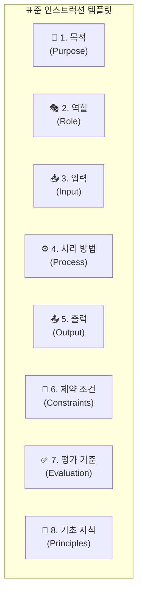

# 3장. 좋은 인스트럭션의 조건

1장에서 우리는 일회성 '메모'인 프롬프트와 체계적인 '업무 매뉴얼'인 인스트럭션의 차이를 배웠습니다. 그렇다면 좋은 인스트럭션, 즉 AI가 언제나 똑똑하게 일을 처리하게 만드는 '업무 매뉴얼'은 어떻게 만들어야 할까요?

이는 마치 자동차 네비게이션으로 길을 찾는 것과 같습니다. 단순히 "광화문 가자"라고 말하는 것(프롬프트)과, "서울시청을 거쳐서, 유료도로는 피하고, 가장 빠른 길로 광화문까지 안내해줘"(인스트럭션)라고 말하는 것은 전혀 다른 결과를 가져옵니다.

이 장에서는 좋은 인스트럭션을 만드는 5가지 핵심 원칙과, 이를 바탕으로 누구나 쉽게 따라 할 수 있는 '표준 템플릿'을 알아보겠습니다.

## 3.1 좋은 인스트럭션의 5가지 원칙

### 1. 명확성 (Clear)
"알아서, 적당히, 잘" 과 같은 모호한 표현을 피하고, 누가 봐도 오해 없이 의도를 파악할 수 있도록 작성해야 합니다.

> **나쁜 예:** "고객 불만 좀 정리해줘."
> 
> **좋은 예:** "지난주 접수된 고객 불만 중 가장 자주 언급된 3가지 유형을 찾고, 각 유형별 원인과 해결책을 한 문장씩 요약해줘."

### 2. 구체성 (Specific)
결과물의 범위, 대상, 기간, 형식 등을 명확히 지정하여 AI가 헤매지 않도록 해야 합니다.

> **나쁜 예:** "시장 동향 보고서 써줘."
> 
> **좋은 예:** "**20대 타겟 뷰티 시장**에 대한 동향 보고서를, **최근 3개월**간의 데이터를 바탕으로 **A4 1페이지 분량의 마크다운 형식[^1]**으로 작성해줘."

### 3. 단계성 (Step-wise)
복잡한 작업은 한 번에 지시하기보다, 여러 개의 작은 단계로 나누어 순서대로 지시하는 것이 효과적입니다.

> **나쁜 예:** "블로그 글 하나 써서 올려줘."
> 
> **좋은 예:** "다음 단계를 순서대로 진행해줘.
> 1. 'MZ세대 재테크 방법'이라는 주제로 3가지 소제목을 정해줘.
> 2. 각 소제목에 맞춰 200자 내외의 초안을 작성해줘.
> 3. 전체 글의 맞춤법을 검사하고, 자극적인 제목 3개를 추천해줘."

### 4. 제약 조건 (Constraints)
시간, 예산, 정책 등 현실적인 제약 조건을 명시하여, AI가 실행 가능한 답변을 생성하도록 유도해야 합니다.

> **나쁜 예:** "신제품 홍보 이벤트 기획해줘."
> 
> **좋은 예:** "**예산 500만원 이내**에서, **온라인으로만 진행**하는 신제품 홍보 이벤트를 기획해줘. **개인정보 수집은 절대 금지**야."

### 5. 실패하는 지시(안티패턴) 피하기
위의 원칙들을 뒤집어보면 실패하는 지시의 특징을 알 수 있습니다. **대상, 범위, 형식, 길이, 성공 기준**이 빠진 지시는 대부분 실패합니다. "이거 좀 좋게 만들어줘"라는 지시는 최악의 **안티패턴[^2]**입니다.

---

## 3.2 표준 인스트럭션 템플릿: 8가지 핵심 구성 요소

이제 위 원칙들을 실제 인스트럭션으로 구현하기 위한 **8가지 핵심 구성 요소**를 '표준 템플릿' 형태로 정리해 보겠습니다. 이 템플릿은 여러분이 새로운 인스트럭션을 만들 때마다 사용할 수 있는 강력한 체크리스트이자 출발점입니다.

### 템플릿 활용 예시: "신제품 회의록 요약 및 정리"

- **1. 목적 (Purpose):** 신제품 아이디어 회의록을 정리하여, 다음 단계의 액션 아이템을 도출한다.
- **2. 역할 (Role):** 15년차 대기업의 꼼꼼하고 핵심을 잘 짚는 기획팀장.
- **3. 입력 (Input):** 회의 내용을 날것 그대로 기록한 텍스트 파일 (`meeting_log.txt`).
- **4. 처리 방법 (Process):**
  1. 회의록 전체를 읽고, 논의된 아이디어를 모두 식별한다.
  2. 각 아이디어에 대해 '결정된 사항'과 '추가 논의가 필요한 사항'을 구분한다.
  3. 결정된 사항을 바탕으로, 각 팀(마케팅, 디자인, 개발)이 수행해야 할 **'액션 아이템(Action Item)[^3]'**을 정리한다.
- **5. 출력 (Output):** 아래 구조를 가진 마크다운 형식의 보고서.
  - `## 1. 핵심 결정사항 (3줄 요약)`
  - `## 2. 주요 아이디어 및 논의 내용`
  - `## 3. Action Items (담당팀, 기한 명시)`
- **6. 제약 조건 (Constraints):** 개인의 의견이 아닌, 회의에서 나온 객관적인 사실만을 기록할 것. 전체 보고서는 A4 1페이지를 넘지 말 것.
- **7. 평가 기준 (Evaluation):** 회의 참석자들이 보고서 내용에 동의하고, 액션 아이템이 명확하여 바로 실행 가능한가?
- **8. 기초 지식 (Principles):** 우리 회사의 신제품 개발 프로세스를 참고할 것. 모든 용어는 사내 표준 용어 사전을 따를 것.

이처럼 8가지 구성 요소를 체계적으로 정의하면, 누가 언제 실행하더라도 일관되고 예측 가능한 고품질의 결과물을 얻을 수 있습니다.

---
[^1]: **마크다운(Markdown):** `#`이나 `*` 같은 간단한 기호를 사용해 제목, 목록, 강조 등을 표현하는 문서 작성 방식입니다. 개발자가 아니더라도 쉽게 배워 깔끔한 보고서나 문서를 만들 수 있습니다.
[^2]: **안티패턴(Anti-pattern):** 일반적으로 비효율적이거나 나쁜 결과를 가져오는 것으로 알려진 습관적인 해결책을 의미합니다. '이렇게 하면 보통 실패한다'는 일종의 실패 공식입니다.
[^3]: **액션 아이템(Action Item):** 회의나 논의가 끝난 후, '누가, 무엇을, 언제까지' 해야 하는지를 명확히 정한 실행 항목을 의미합니다.