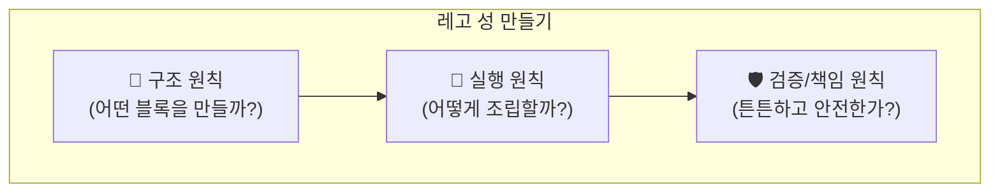

# 4장. 설계의 나침반: 흔들리지 않는 11가지 원칙

좋은 인스트럭션을 만드는 것은 마치 '레고 블록으로 멋진 성을 만드는 것'과 같습니다. 어떤 블록을 만들지, 어떻게 조립할지, 완성된 성이 튼튼한지 확인하는 과정이죠. 이 과정에서 길을 잃지 않도록 도와주는 11가지 '설계의 나침반(메타 원칙)'을 소개합니다.

이 원칙들은 크게 세 그룹으로 나뉩니다.

## 4.1 구조 원칙: 어떤 모양의 블록을 만들까?
> 튼튼한 성을 만들려면, 잘 설계된 블록이 필요합니다. 구조 원칙은 재사용 가능하고, 관리하기 쉬우며, 확장이 용이한 '인스트럭션 블록'을 만드는 기준이 됩니다.

- **1. 하나의 진실 (SSOT, Single Source of Truth):** 중요한 규칙이나 정보는 단 한 곳에서만 관리합니다. 예를 들어, 여러 인스트럭션에서 공통으로 사용하는 '회사소개' 내용은 별도 파일로 만들어두고, 필요할 때마다 가져다 쓰는 것이죠. 나중에 회사소개가 바뀌어도 그 파일 하나만 수정하면 되니 편리합니다.
- **2. 역할 나누기 (SoC, Separation of Concerns):** 하나의 인스트럭션이 너무 많은 일을 하게 두지 않습니다. '자료 조사 에이전트', '초안 작성 에이전트', '검수 에이전트'처럼 역할을 명확히 나누면, 각 부분을 독립적으로 개선하거나 다른 프로젝트에 재사용하기 좋습니다.
- **3. 빠짐없이, 겹치지 않게 (MECE):** 고객 불만을 분석할 때 '배송', '품질', '상담' 처럼 항목을 중복되지 않으면서도 전체를 포함하도록 나누는 것입니다. 이렇게 하면 분석이 체계적이고 명확해집니다.
- **4. 최소 단위로 쪼개기 (Atomicity):** '보고서 작성'이라는 큰 작업을 '1) 데이터 수집 → 2) 분석 → 3) 초안 작성' 처럼 더 이상 나눌 수 없는 최소 단위로 쪼개는 것입니다. 각 단계의 성공/실패가 명확해져 문제 해결이 쉬워집니다.

## 4.2 실행 원칙: 어떻게 조립할까?
> 좋은 블록이 있어도, 조립 설명서가 엉망이면 성을 완성할 수 없습니다. 실행 원칙은 AI가 우리의 의도대로 작업을 정확하고 효율적으로 수행하게 만드는 '조립 설명서' 작성법입니다.

- **5. 결과물 먼저 생각하기 (Output-Driven):** "알아서 잘 써줘"가 아니라, "이 보고서는 반드시 3개의 소제목과 1개의 결론을 포함해야 해" 처럼 최종 결과물의 모습을 먼저 명확하게 정의하고 시작하는 것입니다.
- **6. 끊임없이 되묻기 (Feedback Loop):** AI가 지시가 모호할 때 "이 보고서의 독자는 누구인가요?" 라고 되묻게 하고, 작업을 마친 후에는 "요구사항 3가지를 모두 충족했는지 스스로 확인했습니다" 라고 보고하게 만드는 순환 구조입니다.
- **7. 일단 시작하고, 계속 다듬기 (Iterative Refinement):** 처음부터 완벽한 보고서를 요구하기보다, 빠른 초안을 받은 뒤 피드백을 통해 점차 완성도를 높여나가는 방식입니다.
- **8. 배경까지 알려주기 (Context Explicitness):** "보고서 써줘"가 아니라, "**비전문가인 경영진**을 대상으로, **의사결정을 돕기 위해** 작성하는 보고서야" 처럼 작업의 배경(Context)을 명확히 알려주어 AI의 추측을 막습니다.

## 4.3 검증/책임 원칙: 튼튼하고 안전한가?
> 멋지게 완성된 성이 쉽게 무너지거나, 다른 사람을 다치게 하면 안 되겠죠? 검증 및 책임 원칙은 우리가 만든 인스트럭션 시스템이 신뢰할 수 있고, 안전하게 작동하도록 만드는 '품질 검수' 과정입니다.

- **9. 출처와 근거 남기기 (Transparency & Traceability):** AI가 "시장 점유율이 30% 상승했습니다"라고 보고할 때, "**A 리서치의 2024년 3분기 보고서 5페이지**에 따르면..." 과 같이 모든 주장의 근거를 명확히 밝히도록 하여 결과의 신뢰도를 높입니다.
- **10. 넘지 말아야 할 선 알려주기 (Ethical Boundaries):** "절대 고객의 개인정보(이름, 연락처)를 보고서에 포함하지 마" 와 같이, AI가 지켜야 할 윤리적, 법적 경계를 명확히 설정합니다.
- **11. 최종 결정은 사람이 (Human-in-the-Loop):** "최종 이메일 발송 전, 반드시 나의 최종 승인을 받아라" 와 같이, 중요하거나 되돌릴 수 없는 결정은 반드시 사람의 검토를 거치도록 안전장치를 마련합니다.

이 11가지 원칙은 여러분이 인스트럭션을 설계할 때마다 길을 밝혀주는 든든한 나침반이 될 것입니다.

---
[^1]: **SSOT (Single Source of Truth):** 여러 곳에 흩어져 있는 정보를 하나의 신뢰할 수 있는 출처로 통일하는 원칙입니다. 정보의 일관성을 유지하고 관리를 쉽게 만듭니다.
[^2]: **SoC (Separation of Concerns):** 하나의 구성요소가 하나의 책임만 갖도록 시스템을 분리하여 설계하는 원칙입니다.
[^3]: **MECE (Mutually Exclusive, Collectively Exhaustive):** '서로 중복되지 않으면서, 전체적으로는 빠짐이 없는' 상태를 의미하는 분석적 사고의 기본 원칙입니다.
[^4]: **멱등성(Idempotency):** 동일한 작업을 여러 번 수행해도 결과가 항상 같은 특성을 의미합니다. (예: 100에 0을 여러 번 더해도 결과는 항상 100)
