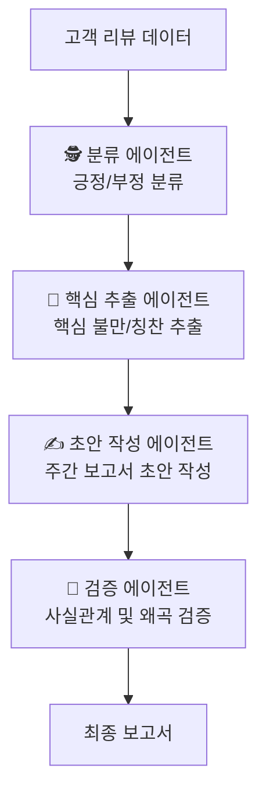

# 5장. AI에게 페르소나 부여하기: 역할(Agent)과 제약(Constraint) 설계

지금까지 우리는 좋은 인스트럭션을 만드는 법을 배웠습니다. 하지만 작업이 복잡해지면, 아무리 잘 만든 인스트럭션이라도 하나의 거대한 프롬프트만으로는 한계에 부딪힙니다. 이는 마치 모든 일을 혼자 처리하려는 '만능 일꾼'에게 의존하는 것과 같습니다.

## 5.1 만능 일꾼의 한계

처음에는 혼자서 모든 일을 척척 해내는 '만능 일꾼'이 효율적인 것 같지만, 일이 조금만 복잡해져도 문제가 생기기 시작합니다.

- **자꾸 깜빡 잊어버립니다:** 지시가 길어지면 "아까 뭐라고 하셨죠?"라며 앞의 내용을 잊어버리기 일쑤입니다. (컨텍스트 윈도우 한계[^1])
- **모르면 지어냅니다:** 잘 모르는 내용에 대해 질문하면, 모른다고 솔직히 말하는 대신 그럴듯한 거짓말을 둘러댑니다. (할루시네이션[^2])
- **결과물이 매번 다릅니다:** 어제는 보고서를 표로 깔끔하게 정리해오더니, 오늘은 줄글로 장황하게 늘어놓는 등 결과물의 일관성이 없습니다.
- **인수인계가 불가능합니다:** 그 사람만 아는 노하우가 너무 많아, 다른 사람에게 업무를 인수인계하거나 협업하기가 거의 불가능합니다. (유지보수 및 확장성 문제)

이처럼 한 명의 만능 일꾼에게 모든 것을 맡기는 방식은 결국 실패로 돌아가기 쉽습니다.

## 5.2 전문가 팀이라는 새로운 기회

그렇다면 해결책은 무엇일까요? 바로 '전문가 팀'을 꾸리는 것입니다. '만능 일꾼' 한 명 대신, 각자 역할이 명확한 전문가들을 모아 팀으로 일하게 하는 것이죠. 이것이 바로 **에이전트(Agent)** 설계의 핵심 아이디어입니다.

'에이전트'는 특정 역할, 책임, 제약 조건을 가진 독립적인 AI 전문가입니다. 예를 들어, '고객 리뷰 분석'이라는 큰 작업은 다음과 같은 '전문가 팀'의 협력으로 수행될 수 있습니다.

이렇게 역할을 나누면 어떤 장점이 있을까요?

- **품질 향상:** 각 에이전트는 자신이 맡은 좁은 영역에만 집중하므로, 실수가 줄고 결과물의 품질이 높아집니다. '검증 에이전트'를 두어 할루시네이션을 막을 수도 있습니다.
- **효율성 증대:** 각 에이전트의 인스트럭션이 짧고 명확해져 AI가 더 빠르고 정확하게 작업을 처리합니다.
- **재사용성 극대화:** 여기서 만든 '분류 에이전트'는 나중에 '사내 제안 분석' 프로젝트에도 레고 블록처럼 가져다 쓸 수 있습니다.

## 5.3 어떻게 '전문가 팀'을 설계할까?

좋은 전문가 팀을 만들려면, 각 팀원(에이전트)의 역할을 명확히 정의해야 합니다.

- **역할(Role)과 페르소나(Persona) 부여:** "당신은 20년차 베테랑 데이터 분석가입니다. 날카로운 통찰력을 보여주되, 비전문가도 이해할 수 있도록 쉬운 용어를 사용해야 합니다." 와 같이 구체적인 역할과 말투(페르소나)를 부여하면, 에이전트의 행동이 일관되고 전문적으로 변합니다.
- **책임(Responsibility)과 제약(Constraint) 설정:** "당신은 주어진 데이터 안에서만 분석해야 하며, 절대 추측해서는 안 됩니다." 와 같이 명확한 책임과 한계를 설정해주면, 에이전트는 우리가 정해준 선을 넘지 않고 안전하게 작업을 수행합니다.

결국 에이전트 설계는, **하나의 거대한 만능 프롬프트를 버리고, 명확하게 정의된 단일 책임을 가진 여러 전문가 에이전트들의 협력 시스템으로 문제를 해결하는 것**입니다. 이는 4장에서 배운 **역할 나누기(SoC, Separation of Concerns)** 원칙의 가장 중요한 적용 사례입니다.

---
[^1]: **컨텍스트 윈도우(Context Window):** AI가 한 번에 기억하고 처리할 수 있는 정보의 양입니다. 대화가 길어지거나 지시가 너무 길면, AI는 앞부분의 내용을 잊어버릴 수 있습니다.
[^2]: **할루시네이션(Hallucination):** '환각'이라는 뜻으로, AI가 사실이 아닌 정보를 마치 진짜인 것처럼 그럴듯하게 지어내는 현상을 말합니다.
[^3]: **프롬프트 인젝션(Prompt Injection):** 사용자의 입력값에 악의적인 지시를 몰래 숨겨, AI가 원래의 지시를 무시하고 공격자의 의도대로 작동하도록 만드는 해킹 공격의 일종입니다.
[^4]: **RAG(Retrieval-Augmented Generation):** AI가 답변을 생성할 때, 우리가 제공한 최신 문서나 데이터베이스에서 관련 정보를 실시간으로 찾아(Retrieval), 그 내용을 바탕으로 답변을 생성(Generation)하게 하는 기술입니다. 할루시네이션을 줄이는 효과적인 방법입니다.
