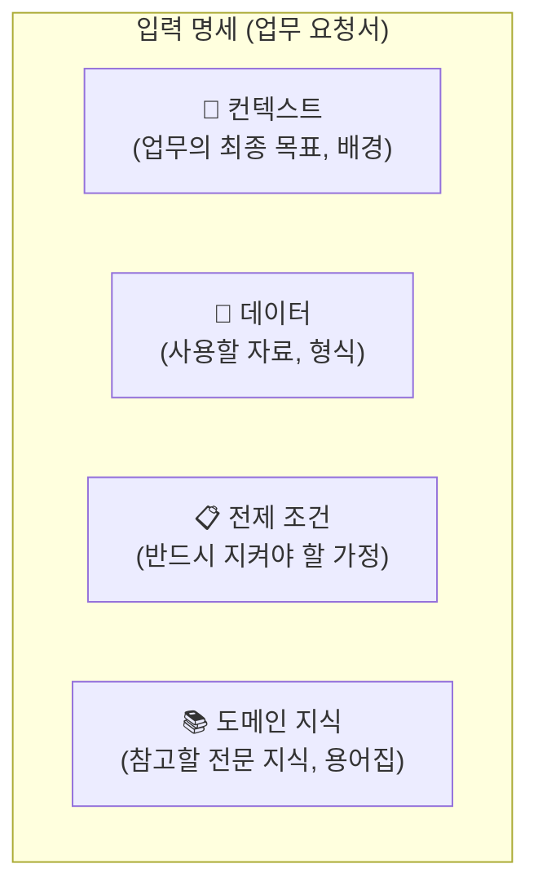
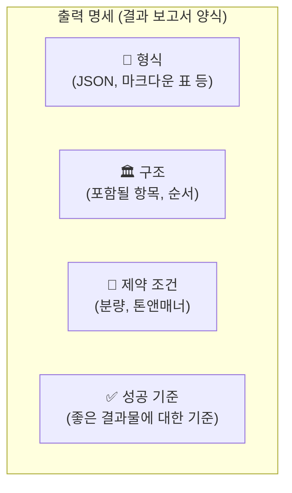

# 6장. 데이터 명세화: 쓰레기를 넣으면 쓰레기가 나온다

5장에서 우리는 각자의 역할이 명확한 '전문가 팀'으로서 에이전트를 설계하는 법을 배웠습니다. 하지만 아무리 뛰어난 전문가들로 팀을 꾸려도, 서로 '어떤 정보'를 '어떤 양식'으로 주고받을지 약속하지 않으면 프로젝트는 엉망이 되고 맙니다.

이는 마치 외국인 동료와 협업하는 것과 같습니다. 그 동료에게 일을 맡기려면, **(1) 필요한 모든 정보를 담은 명확한 '업무 요청서'(입력)를 주어야 하고, (2) 일이 끝난 뒤 나에게 전달할 '결과 보고서 양식'(출력)을 미리 정해주어야 합니다.** 만약 보고서 양식을 정해주지 않는다면, 동료는 자신이 편한 방식대로 이메일, 메신저, 구두 등 제각각으로 보고하여 후속 작업을 진행할 수 없게 될 것입니다.

입력과 출력 설계는 바로 이 '업무 요청서'와 '결과 보고서 양식'을 만드는 과정, 즉 **데이터 명세(Specification)**를 만드는 과정입니다.

## 6.1 "쓰레기를 넣으면 쓰레기가 나온다"

컴퓨터 과학의 오랜 격언인 "쓰레기를 넣으면 쓰레기가 나온다(Garbage In, Garbage Out)[^1]"는 AI 시대에 더욱 중요해졌습니다. AI에게 모호하거나 잘못된 '업무 요청서'(입력)를 주면, AI는 엉뚱한 결과물을 내놓을 수밖에 없습니다.

마찬가지로, 명확한 '결과 보고서 양식'(출력)을 정해주지 않으면, AI는 매번 다른 형식으로 결과물을 '창작'합니다. 이는 여러 에이전트가 협력하는 자동화 시스템에서 심각한 오류를 일으키는 주범이 됩니다. '요약 에이전트'가 결과를 줄글로 전달하면, 그 결과를 입력받아 표를 만들어야 하는 '시각화 에이전트'는 작업을 수행할 수 없는 것이죠.

## 6.2 무엇을 설계해야 하는가?: 입력과 출력 명세

이러한 문제를 해결하기 위해, 우리는 에이전트가 주고받을 데이터에 대한 명확한 '명세'를 설계해야 합니다.

### 입력 명세: 친절한 '업무 요청서' 만들기



### 출력 명세: 명확한 '결과 보고서 양식' 정하기



## 6.3 어떻게 설계할까?: '결과 보고서 양식'부터 정하기

효과적인 설계는 4장에서 배운 **결과물 먼저 생각하기(Output-Driven)** 원칙을 따릅니다. 즉, 최종적으로 받고 싶은 '결과 보고서 양식'(출력)을 먼저 명확하게 정의하고, 그 결과물을 만드는 데 필요한 '업무 요청서'(입력)를 역으로 설계하는 것이 가장 효율적입니다.

### 예시: 시장 조사 보고서 요약하기

**상황:** 50페이지 분량의 시장 조사 보고서를 바쁜 경영진을 위해 빠르게 요약해야 합니다.

#### 1단계: 내가 받고 싶은 '결과 보고서 양식'(출력) 먼저 정의하기
단순히 "요약해줘" 라고 하는 대신, 내가 원하는 결과물의 형식을 **JSON[^2]** 형식으로 명확하게 정의합니다.

```json
{
  "title": "시장 조사 보고서 핵심 요약",
  "target_audience": "경영진",
  "summary": {
    "market_size": "시장의 전체 규모와 성장률",
    "key_trends": [
      "핵심 트렌드 1",
      "핵심 트렌드 2",
      "핵심 트렌드 3"
    ],
    "opportunities": "새로운 기회 요인",
    "threats": "위협 요인"
  },
  "recommendation": "이 보고서를 바탕으로 우리가 취해야 할 다음 액션"
}
```
이렇게 최종 결과물의 '틀'을 정해두면, AI는 이 틀을 채우기 위해 필요한 정보가 무엇인지 스스로 파악하게 됩니다.

#### 2단계: 정의된 출력을 만들기 위한 '업무 요청서'(입력) 설계하기
이제 위 JSON 결과물을 만들기 위해 필요한 모든 정보를 담아 AI에게 '업무 요청서'를 전달합니다.

> **나쁜 요청:** "이 보고서 요약해줘."
> 
> **좋은 요청:**
> ```markdown
> ## 시장 조사 보고서 요약 작업 명세
> 
> - **지시:** 아래 명세에 따라 첨부된 시장 조사 보고서를 요약하고, 최종 결과물을 반드시 지정된 JSON 형식으로 반환하세요.
> - **입력 데이터:** `market_research_report_2024.pdf`
> - **컨텍스트:** 이 요약본은 신사업 진출을 빠르게 결정해야 하는 **경영진**을 위한 것입니다. 전문 용어보다는 쉽고 간결한 표현을 사용해주세요.
> - **출력 형식:**
>   (여기에 1단계에서 정의한 JSON 구조를 그대로 붙여넣습니다)
> ```

이렇게 명확한 입력과 출력 명세를 사용하면, 우리는 AI로부터 언제나 일관되고 예측 가능한, 그리고 내가 원하는 형식의 결과물을 얻을 수 있습니다. 이는 여러 에이전트가 협력하는 자동화 시스템을 구축하는 가장 기본적인 첫걸음입니다.

---
[^1]: **Garbage In, Garbage Out (GIGO):** '쓰레기 같은 데이터를 입력하면, 쓰레기 같은 결과가 나올 수밖에 없다'는 컴퓨터 과학의 오랜 격언입니다. 입력 데이터의 품질이 결과물의 품질을 결정한다는 점을 강조하는 말입니다.
[^2]: **JSON (JavaScript Object Notation):** "이름: 값" 형태로 데이터를 저장하고 교환하는 데 사용되는 텍스트 형식입니다. 사람이 읽기 쉽고 기계가 처리하기도 용이하여, 프로그램 간에 데이터를 주고받을 때 널리 사용됩니다.
[^3]: **YAML (YAML Ain't Markup Language):** JSON과 유사하지만, 괄호와 따옴표를 덜 사용하여 사람이 더 읽고 쓰기 편하게 만든 데이터 형식입니다. 주로 설정 파일에 많이 사용됩니다.
[^4]: **JSON Schema:** JSON 데이터가 어떤 구조와 규칙을 가져야 하는지를 정의하는 '설계도'입니다. 예를 들어, '이메일' 필드는 반드시 이메일 형식이어야 하고, '나이' 필드는 0보다 커야 한다는 규칙을 정할 수 있습니다.
[^5]: **파싱(Parsing):** 컴퓨터가 특정 형식의 텍스트 데이터(예: JSON, HTML)를 읽어들여, 의미 있는 구조로 변환하고 이해하는 과정을 말합니다.
