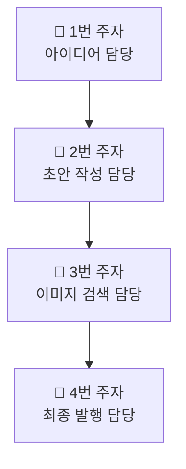
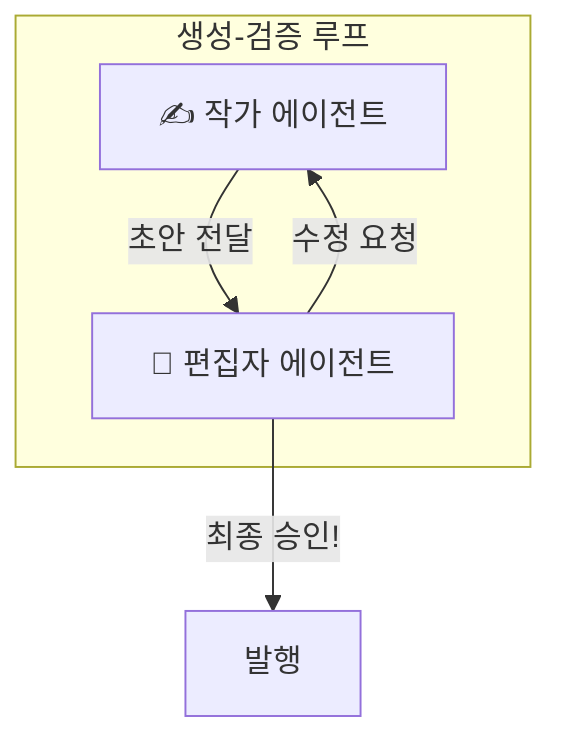
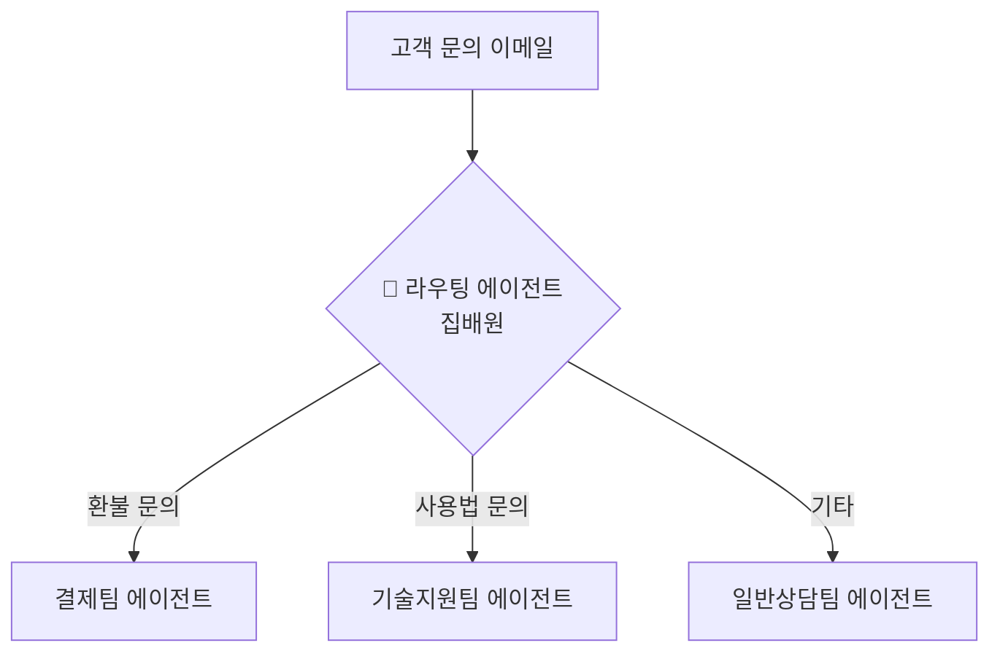

# 7장. AI 팀의 협업 방식: 기본 워크플로우 패턴

5장과 6장에서 우리는 각자의 역할이 명확한 '전문가 에이전트'를 만들고, 이들이 서로 데이터를 주고받는 '규칙'을 정했습니다. 이제 이 전문가들을 한 팀으로 묶어 복잡한 문제를 해결하는 '협업 방식', 즉 **워크플로우(Workflow)[^1]**를 설계할 차례입니다.

이번 장에서는 가장 기본적이면서도 강력한 세 가지 협업 패턴을 알아보겠습니다.

## 7.1 파이프라인 패턴: 릴레이 달리기
> 첫 번째 주자가 다음 주자에게 바통을 넘기듯, 작업 순서가 정해져 있을 때 사용합니다.

**파이프라인(Pipeline)[^2]**은 가장 직관적인 협업 방식으로, 여러 에이전트가 작업을 순서대로 처리하는 모델입니다. 마치 릴레이 달리처럼, 한 에이전트의 작업 결과(바통)가 다음 에이전트의 입력으로 전달됩니다.

**예시: 블로그 포스팅 자동화**

1.  **아이디어 담당:** "AI 생산성"이라는 주제로 블로그 글 아이디어 3개를 제안합니다.
2.  **초안 작성 담당:** 선택된 아이디어를 바탕으로 블로그 글 초안을 작성합니다.
3.  **이미지 검색 담당:** 작성된 글 내용에 어울리는 무료 이미지를 3개 찾아 제안합니다.
4.  **최종 발행 담당:** 완성된 글과 이미지를 합쳐 최종 발행 전 검토를 요청합니다.

## 7.2 생성-검증 패턴: 환상의 콤비, 작가와 편집자
> 한 명은 만들고, 다른 한 명은 검수합니다. 결과물의 품질을 높이고 싶을 때 반드시 필요합니다.

이 패턴은 한 에이전트가 결과물을 만들면(생성), 다른 에이전트가 그 결과물을 검증하고 피드백을 주는(검증) 협업 모델입니다. 마치 창의적인 '작가 에이전트'와 꼼꼼한 '편집자 에이전트'가 함께 일하는 것과 같습니다.

**예시: 마케팅 문구 작성 및 검수**

- **작가 에이전트:** "신제품 런칭 이벤트 홍보 문구 초안을 작성해줘."
- **편집자 에이전트:** "좋은데, '혁신적인'이라는 단어는 너무 식상하니 다른 표현으로 바꿔보자. 그리고 오타가 하나 있네."

이처럼 서로 피드백을 주고받으며 결과물의 완성도를 함께 높여나갑니다.

## 7.3 라우팅 패턴: 똑똑한 우체국 집배원
> 편지의 주소를 보고 올바른 집으로 배달하듯, 작업의 종류에 따라 담당자를 지정합니다.

**라우팅(Routing)[^3]**은 들어온 작업의 내용을 보고, 어떤 에이전트가 처리해야 할지 결정하는 '교통정리' 패턴입니다.

**예시: 고객 문의 자동 분류**
마치 우체국 집배원이 편지의 주소를 보고 올바른 집으로 배달하듯, '라우팅 에이전트'가 고객 문의 내용을 읽고 담당 팀으로 자동 연결해줍니다.


> **라우팅 에이전트의 인스트럭션:** "당신은 고객 문의 분류 담당자입니다. 이메일 내용을 읽고, '환불/결제' 관련 문의는 '결제팀'으로, '사용법/오류' 관련 문의는 '기술지원팀'으로, 그 외에는 '일반상담팀'으로 분류하여 전달하세요."

## 7.4 워크플로우를 '설계도'로 관리하기: `workflow.yaml`

워크플로우가 복잡해질수록, 이 모든 과정을 코드로 작성하는 것은 비효율적입니다. 대신, 우리는 워크플로우의 구조를 '설계도'처럼 별도의 설정 파일로 정의할 수 있습니다.

다음은 `YAML`[^4]이라는 간단한 형식으로 '주말 부산 여행 계획' 워크플로우를 정의한 예시입니다.

```yaml
# workflow.yaml: 주말 부산 여행 계획
name: "주말 부산 여행 계획 자동화"
workflow:
  # 1단계: KTX 기차표를 검색합니다.
  - agent: "기차표 검색 에이전트"
    prompt: "이번 주 토요일 아침 서울에서 부산 가는 KTX 시간표 알려줘."
    output: "train_tickets.json"

  # 2단계: 검색된 기차표를 바탕으로, 숙소를 검색합니다.
  - agent: "숙소 검색 에이전트"
    prompt: "train_tickets.json 파일의 도착 시간에 맞춰, 부산역 근처의 10만원 이하 호텔을 찾아줘."
    input: "train_tickets.json"
    output: "hotels.json"

  # 3단계: 검색된 숙소 정보를 바탕으로, 맛집을 검색합니다.
  - agent: "맛집 검색 에이전트"
    prompt: "hotels.json 파일에 있는 호텔 근처의 현지인 맛집 3곳을 추천해줘."
    input: "hotels.json"
```
이처럼 워크플로우를 코드가 아닌 데이터로 정의하면, 나중에 순서를 바꾸거나 새로운 단계를 추가하는 등 유연한 변경이 가능해집니다.

---
[^1]: **워크플로우(Workflow):** '작업의 흐름'이라는 뜻으로, 어떤 목표를 달성하기 위해 정해진 일련의 작업 순서나 절차를 의미합니다.
[^2]: **파이프라인(Pipeline):** 여러 처리 단계가 직선으로 연결되어, 한 단계의 출력이 다음 단계의 입력으로 바로 이어지는 가장 단순한 형태의 워크플로우입니다.
[^3]: **라우팅(Routing):** '경로 설정'이라는 뜻으로, 주어진 조건이나 규칙에 따라 데이터나 작업이 가야 할 길을 정해주는 것을 의미합니다.
[^4]: **YAML (YAML Ain't Markup Language):** JSON과 유사하지만, 괄호와 따옴표를 덜 사용하여 사람이 더 읽고 쓰기 편하게 만든 데이터 형식입니다. 주로 설정 파일에 많이 사용됩니다.
