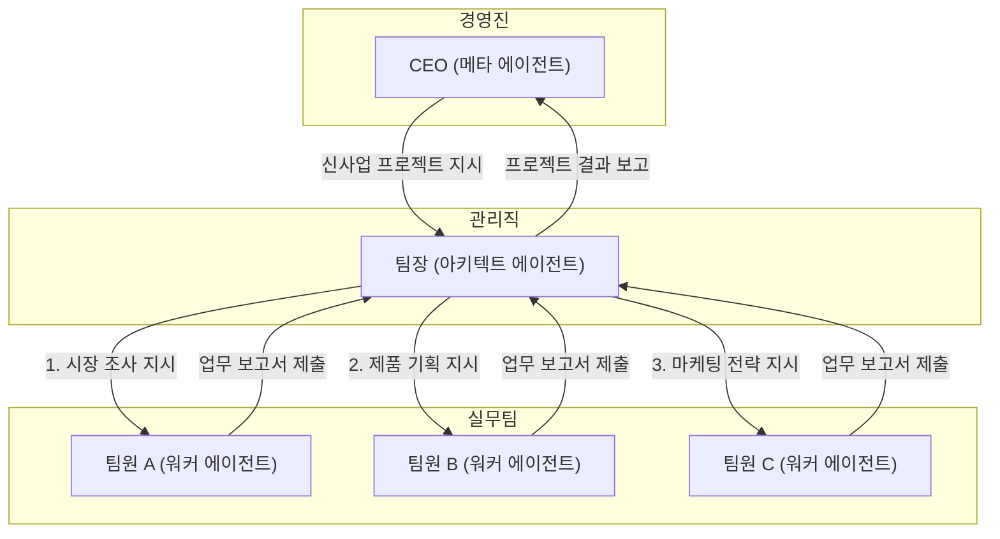

# 10장. 고급 협업 아키텍처: 'AI 회사' 조직도 짜기

지금까지 우리는 각자의 전문성을 가진 'AI 전문가(에이전트)'들을 만들었습니다. 하지만 '신제품 출시'와 같은 복잡한 프로젝트는 한두 명의 전문가만으로는 해결할 수 없습니다. 기획, 개발, 마케팅, 디자인 등 여러 전문가들의 '협업'이 필수적입니다.

이번 장에서는 개별 AI 에이전트들을 유기적으로 연결하여, 복잡한 실제 업무를 안정적으로 자동화하는 'AI 회사'의 조직도를 짜는 방법을 배웁니다.

## 10.1 왜 '회사'가 필요한가?

모든 일을 처리하는 '만능 슈퍼 에이전트' 하나를 만드는 것은, 모든 일을 혼자 다 하려는 '1인 기업'과 같습니다. 처음에는 빠를지 몰라도, 일이 복잡해지면 금방 한계에 부딪히고 맙니다.

따라서 우리는 여러 에이전트가 각자의 역할과 책임에 따라 협력하는 '회사'라는 시스템을 만들어야 합니다. 이것이 바로 **고급 협업 아키텍처[^1]**의 기본 개념입니다.

## 10.2 협업의 기본: '업무 보고서'로 소통하기

회사가 제대로 돌아가려면, 팀원들이 서로 어떻게 소통하고 업무를 인계할지에 대한 규칙이 필요합니다. AI 회사에서는 **산출물(Artifact)**, 즉 '업무 보고서'가 바로 그 소통의 핵심입니다.

'업무 보고서'는 단순히 한 에이전트의 결과물이 아닙니다. 이는 다음 담당자에게 업무를 넘기기 위한 공식적인 **인터페이스[^2]**이자, 모든 업무 과정을 투명하게 기록하는 **로그(Log)** 역할을 합니다.

- **파일로 소통하세요:** 모든 업무 보고서는 정해진 폴더에, 명확한 파일 이름으로 저장합니다.
- **정해진 양식을 사용하세요:** 단순 메모가 아닌, `JSON`과 같은 구조화된 양식을 사용합니다.
- **진행 상황을 함께 담으세요:** 결과물뿐만 아니라, '작업 성공 여부', '시작 및 종료 시간' 등 **메타데이터[^3]**를 함께 담아 누가 언제 무엇을 했는지 명확히 합니다.

## 10.3 AI 회사 조직도 짜기: CEO, 팀장, 그리고 팀원

복잡한 프로젝트를 효과적으로 관리하기 위해, 우리는 실제 회사 조직도와 유사한 계층 구조를 도입합니다.



- **팀원 (워커 에이전트):** "자료 조사", "초안 작성"처럼 명확하게 주어진 실무를 수행하는 '실행 전문가'입니다. 자신의 업무 외에 다른 팀원의 일이나 프로젝트 전체 그림은 알지 못합니다.
- **팀장 (아키텍트 에이전트):** CEO의 지시를 받아 프로젝트 계획을 세우고, 각 업무를 가장 잘할 팀원에게 분배하며, 프로젝트 전체를 감독하는 '프로젝트 매니저'입니다. 팀원들이 제출한 업무 보고서를 검토하고, 문제가 생기면 재작업을 지시하는 등 품질 관리를 책임집니다.
- **CEO (메타 에이전트):** "이번 분기 매출 20% 상승"과 같은 회사의 큰 목표를 설정하고, 이를 달성하기 위한 핵심 프로젝트를 팀장에게 위임하는 '최고 경영자'입니다.

이러한 계층적 책임 분리는 각 에이전트의 역할을 단순하고 명확하게 만들어, 전체 시스템의 안정성과 예측 가능성을 크게 높여줍니다.

## 10.4 팀장의 프로젝트 관리법: 업무 보고서 확인하기

팀장(아키텍트)은 팀원(워커)들이 제출하는 '업무 보고서(산출물)'를 주기적으로 확인하여 프로젝트가 계획대로 진행되고 있는지 감독합니다.

```json
// 예시: 팀원 A의 시장조사 업무 보고서
{
  "metadata": {
    "task_id": "task-01-market-research",
    "agent_name": "research-worker-v3",
    "status": "success", // "success" 또는 "failure"
    "timestamp_end": "2025-10-03T10:05:12Z"
  },
  "data": { 
    "market_size": "1조원",
    "top_competitor": "경쟁사 Z" 
  }
}
```
팀장은 이 보고서의 `status`가 'success'인지 확인하고, 'failure'일 경우 원인을 파악하여 다른 팀원에게 재지시하는 등 프로젝트의 위험을 관리합니다.

이처럼 '업무 보고서'를 중심으로 소통하고 협업하는 시스템을 구축하면, 복잡한 프로젝트도 체계적으로 관리하고 자동화할 수 있게 됩니다.

---
[^1]: **아키텍처(Architecture):** 건물의 '건축 양식'이나 '구조'를 의미하는 말로, IT 분야에서는 시스템의 전체적인 구조와 구성 요소들이 어떻게 상호작용하는지를 나타내는 '설계도'를 의미합니다.
[^2]: **인터페이스(Interface):** 서로 다른 두 시스템이나 장치가 만나서 정보를 주고받는 '접점'을 의미합니다. 예를 들어, 컴퓨터의 USB 포트는 주변기기와 컴퓨터를 연결하는 인터페이스입니다.
[^3]: **메타데이터(Metadata):** '데이터에 대한 데이터'라는 뜻으로, 데이터의 내용 자체가 아니라 그 데이터가 언제, 어떻게, 누구에 의해 만들어졌는지 등을 설명하는 부가 정보를 말합니다.
[^4]: **프로토콜(Protocol):** 컴퓨터나 시스템끼리 원활하게 통신하기 위해 미리 정해놓은 '통신 규약'이나 '약속'을 의미합니다.
