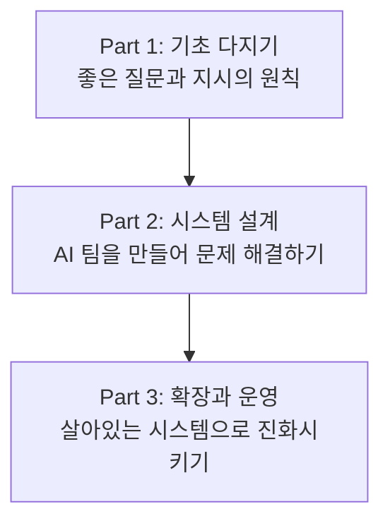

# 📚 AI 인스트럭션 설계 가이드북

> 이 책은 AI에게 '제대로' 일 시키는 법을 배우고 싶은 모든 분들을 위한 안내서입니다. 코드를 모르는 기획자, 마케터부터 AI를 활용해 더 나은 시스템을 만들고 싶은 개발자, 팀의 생산성을 높이고 싶은 리더까지, AI와의 협업 능력을 한 단계 끌어올리는 체계적인 방법론을 제시합니다.

---

### [서문: AI, 유능한 동료에게 '제대로' 일 시키는 법](00-preface.md)

## Part 1. 기초 다지기: 무엇을, 어떻게 지시할 것인가?
> AI와의 협업은 '좋은 질문'에서 시작됩니다. 1부에서는 일회성 프롬프트의 한계를 넘어, 명확하고 재사용 가능한 '인스트럭션'을 설계하는 기본 원칙과 생각의 틀을 배웁니다.

*   **[1장. 프롬프트와 인스트럭션: AI와 대화의 첫걸음](01-introduction.md)**
    *   프롬프트란 무엇인가?
    *   프롬프트의 한계와 인스트럭션의 필요성
*   **[2장. 질문의 기술: 원하는 답을 얻는 6가지 질문법](02-questions.md)**
    *   상황에 맞는 질문 유형 선택하기 (폐쇄형, 개방형, 탐색형 등)
*   **[3장. 좋은 인스트럭션의 조건: 명확함, 구체성, 그리고 단계](03-good-instructions.md)**
    *   실패하는 지시의 특징(안티패턴) 피하기
    *   표준 인스트럭션 템플릿: 8가지 핵심 구성 요소

## Part 2. 시스템 설계: 나만의 'AI 어벤져스' 팀 만들기
> 뛰어난 전문가 한 명보다, 각자의 역할을 가진 전문가 '팀'이 더 큰 문제를 해결합니다. 2부에서는 단일 책임을 가진 여러 AI 에이전트를 만들어 협력시키고, 복잡한 업무를 자동화하는 '인스트럭션 시스템'을 구축하는 구체적인 방법론을 배웁니다.

*   **[4장. 설계의 나침반: 흔들리지 않는 11가지 메타 원칙](04-meta-principles.md)**
    *   구조, 실행, 검증을 위한 핵심 설계 원칙
*   **[5장. AI에게 페르소나 부여하기: 역할(Agent)과 제약(Constraint) 설계](05-agent-constraints.md)**
    *   왜 '만능 에이전트'가 아닌 '전문가 에이전트'를 만들어야 하는가?
*   **[6장. 데이터 명세화: 쓰레기를 넣으면 쓰레기가 나온다](06-input-output.md)**
    *   예측 가능한 결과를 위한 입력과 출력 설계
*   **[7장. AI 팀의 협업 방식: 기본 워크플로우 패턴](07-process-workflow.md)**
    *   파이프라인, 생성-검증, 라우팅 패턴
*   **[8장. 성능과 비용의 줄다리기: 한정된 자원으로 최대 효율 뽑아내기](08-performance.md)**
    *   품질, 비용, 속도의 균형을 맞추는 트레이드오프 전략
*   **[9장. '감'이 아닌 '데이터'로 개선하기: 인스트럭션의 평가와 검증](09-productivity.md)**
    *   나만의 A/B 테스트와 오답 노트 만들기

## Part 3. 확장과 운영: 변화에 적응하는 살아있는 시스템
> 최고의 시스템도 관리하지 않으면 금방 낡아버립니다. 3부에서는 우리가 만든 인스트럭션 시스템을 외부 도구와 연결하고, 조직과 기술의 변화에 맞춰 지속적으로 진화시키는 운영 전략을 알아봅니다.

*   **[10장. 고급 협업 아키텍처: '아키텍트-워커' 모델로 복잡성 다루기](10-advanced-collaboration-architectures.md)**
    *   계층적 협업 아키텍처와 실행 감독
*   **[11장. 실전! 설계 패턴 예제: 상황별 인스트럭션 레시피](11-1-single-agent-patterns.md)**
    *   [1부: 단일 에이전트 설계 패턴](11-1-single-agent-patterns.md)
    *   [2부: 조직 표준 시스템 확장 패턴](11-2-organizational-standards.md)
*   **[12장. AI에게 손과 발을: 도구(Tools)와 플러그인 활용](12-tools.md)**
    *   웹 검색, 코드 실행, API 호출 능력 부여하기
*   **[13장. 우리만의 언어 만들기: 워크플로우를 코드가 아닌 '설계도'로](13-workflow-as-code.md)**
    *   도메인 특화 언어(DSL)의 필요성과 설계
*   **[14장. 인스트럭션의 진화: '부패'를 막고 가치를 유지하는 법](14-evolution.md)**
    *   조직과 기술의 변화에 대응하는 전략

### [결론: AI 시대, 지시하는 자가 미래를 지배한다](15-conclusion.md)
---
