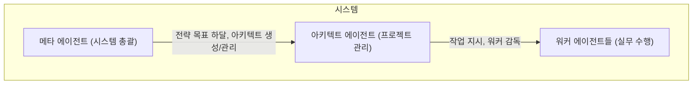
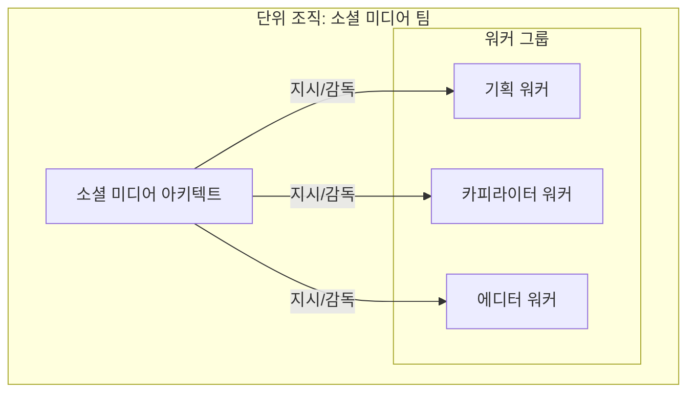
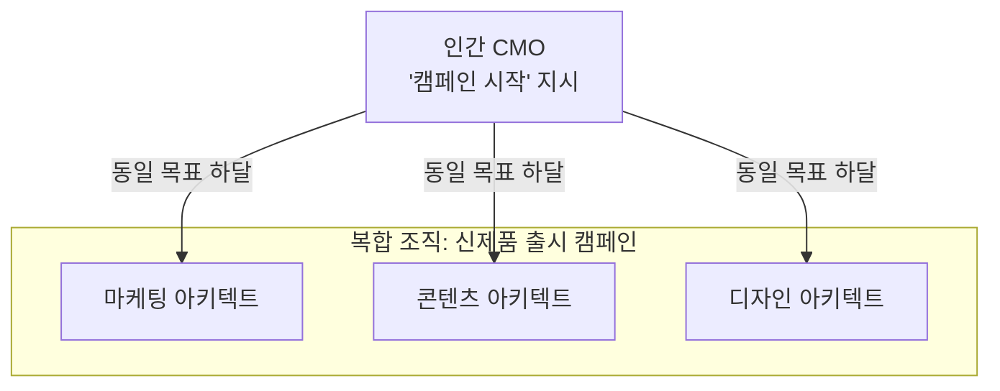

# 아키텍트 에이전트 패턴

> 이 문서는 워크플로우를 설계하고 워커 에이전트를 관리하는 아키텍트 에이전트의 설계 패턴과 조직 구조를 제공합니다.

## 1. 아키텍트의 역할과 위상

### 1.1. 핵심 정의

**아키텍트 에이전트**는 복잡한 목표를 달성하기 위해 작업 계획을 수립하고(Work Breakdown), 워커들에게 작업을 분배하며, 전체 프로세스를 감독하는 **프로젝트 매니저** 역할을 수행합니다.

### 1.2. 계층 구조



- **메타 에이전트**: 시스템 전체를 설계하고, **아키텍트의 요청에 따라** 필요한 워커를 생성하는 등 자원을 관리합니다.
- **아키텍트**: 단일 프로젝트/워크플로우를 관리하고 여러 워커를 감독하며, **필요시 메타 에이전트에게 새로운 워커 생성을 요청**합니다.
- **워커**: 단일 구체적 작업을 실행합니다.

## 2. 조직 구조 패턴

아키텍트는 관리하는 워커의 규모와 상호작용 방식에 따라 다음 두 가지 기본 조직 구조를 형성합니다.

### 2.1. 단위 조직 (Unit Organization)

- **정의**: 하나의 아키텍트가 2~5명의 워커로 구성된 작은 팀을 이끌어 특정 프로젝트를 수행하는 구조입니다.
- **특징**: 팀 내의 워커들은 긴밀하게 협력하며, 주로 순차적이거나 반복적인 워크플로우를 따릅니다.
- **주요 워크플로우 패턴**: **파이프라인**, **생성-검증** 패턴이 주로 사용됩니다.



### 2.2. 복합 조직 (Complex Organization)

- **정의**: 여러 '단위 조직'이 모여 하나의 거대한 목표를 병렬적으로 수행하는 구조입니다. 각 단위 조직은 자체 아키텍트에 의해 관리됩니다.
- **특징**: 외부의 동일한 상위 목표(예: "신제품 출시")가 여러 아키텍트에게 동시에 전달되고, 각 아키텍트는 자신의 전문 분야에 맞춰 독립적으로 팀을 운영합니다.
- **주요 워크플로우 패턴**: **병렬 실행** 패턴이 핵심입니다.



## 3. 핵심 워크플로우 패턴

### 3.1. 파이프라인 패턴 (단위 조직)

- **특징**: 순차적 작업 흐름. 한 단계의 출력이 다음 단계의 입력이 됩니다.
- **적용**: 데이터 처리, 콘텐츠 생성 등 단계가 명확한 작업.
- **구조**: `[리서치 워커] → [초안 작성 워커] → [검수 워커]`

### 3.2. 생성-검증 패턴 (단위 조직)

- **특징**: 생성 워커와 검증 워커를 쌍으로 묶어 피드백 루프를 통해 품질을 보장합니다.
- **적용**: 코드 생성+리뷰, 문서 작성+팩트 체크 등 고품질 결과물이 중요한 작업.
- **구조**: `[생성 워커] ↔ [검증 워커]` 루프를 `N`회 반복 후 최종 승인.

### 3.3. 병렬 실행 패턴 (복합 조직)

- **특징**: 여러 아키텍트 또는 워커가 독립적인 작업을 동시에 실행하여 전체 시간을 단축합니다.
- **적용**: 여러 팀이 협력하는 대규모 프로젝트, 다국어 번역 등.
- **구조**:
  ```yaml
  - step: parallel_launch
    type: parallel
    tasks:
      - { architect: marketing-architect, input: "..." }
      - { architect: content-architect, input: "..." }
      - { architect: design-architect, input: "..." }
  - step: aggregate_results
  ```

### 3.4. 조건부 라우팅 패턴 (모든 조직)

- **특징**: 중간 결과에 따라 다음 경로를 동적으로 결정합니다.
- **적용**: 우선순위 분류, 승인/거부에 따른 분기 처리.
- **구조**: `[분류 워커] → [라우팅 결정] → (if urgent) [긴급 처리 워커] or (if normal) [일반 처리 워커]`

## 4. 워커 평가 전략

| 전략 | 설명 | 사용 사례 |
| :--- | :--- | :--- |
| **직접 평가** | 아키텍트가 스스로 간단하고 명확한 기준(파일 존재, 스키마 검증 등)으로 평가합니다. | 파일 생성 여부, 단어 수 체크 |
| **평가자 위임** | 별도의 '평가 전문 워커'에게 복잡하고 주관적인 기준(코드 품질, 논리성 등)의 평가를 위임합니다. | 코드 품질 점수, 디자인 일관성 |

## 5. 아키텍트 인스트럭션 템플릿

```markdown
# [아키텍트 이름]

## 1. 목적: [복잡한 목표 한 문장]
## 2. 역할: 프로젝트 매니저 / 워크플로우 오케스트레이터
## 3. 조직 구조: [단위 조직 / 복합 조직의 일부]
## 4. 관리 대상 워커:
  - worker1: [역할과 책임]
  - worker2: [역할과 책임]
## 5. 워크플로우 정의 (`workflow.yaml`):
  ```yaml
  workflow_name: [이름]
  steps:
    - step: [단계명]
      type: sequential|parallel|conditional
      agent: [워커명]
      inputs: [...]
      outputs: [...]
      validation: [...]
      on_failure: { action: retry, max_attempts: 3 }
  ```
## 6. 평가 전략:
  - [직접 평가 기준 또는 평가자 위임 설정]
## 7. 예외 처리:
  - [재시도, 대체 워커, 에스컬레이션 조건]
## 8. 로깅:
  - 모든 워커 실행 기록을 `_job_log.json`에 기록
```

---
## 6. 메타 에이전트의 패턴 선택 가이드

> **메타 에이전트 지시사항:**
> 주어진 목표를 분석하여 최적의 아키텍트와 워크플로우 패턴을 결정하시오. 다음 의사결정 과정을 따르시오.

1.  **목표 분석:**
    - **질문 1: 목표 달성을 위해 여러 전문 분야(예: 마케팅, 디자인, 개발)의 독립적인 작업이 동시에 필요한가?**
      - **예:** "신제품 출시 캠페인" → `복합 조직` 구조와 `병렬 실행` 패턴을 선택한다. 각 전문 분야를 담당할 아키텍트들을 생성하거나 할당한다.
      - **아니오:** 다음 질문으로 넘어간다.

    - **질문 2: 목표가 명확한 순서를 가진 단계들로 구성되는가?**
      - **예:** "블로그 포스트 작성" (리서치 → 초안 → 검수) → `단위 조직` 구조와 `파이프라인` 패턴을 선택한다. 이 파이프라인을 관리할 단일 아키텍트를 생성한다.
      - **아니오:** 다음 질문으로 넘어간다.

2.  **품질 요건 분석:**
    - **질문 3: 결과물의 품질, 정확성, 안전성이 매우 중요한가?**
      - **예:** "코드 생성", "법률 문서 초안 작성" → 기존 워크플로우(파이프라인 등)에 `생성-검증` 패턴을 반드시 포함시킨다. 생성 워커와 검증 워커를 쌍으로 구성하도록 아키텍트에게 지시한다.

3.  **동적 흐름 분석:**
    - **질문 4: 작업 중간 결과에 따라 프로세스가 달라져야 하는가?**
      - **예:** "고객 지원 티켓 처리" (긴급도에 따라 처리 방식 변경) → 워크플로우에 `조건부 라우팅` 패턴을 포함시킨다. 분류 워커와 라우팅 로직을 구현하도록 아키텍트에게 지시한다.
