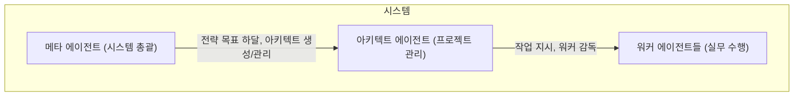

# 아키텍트 에이전트 패턴

> 이 문서는 워크플로우를 설계하고 워커 에이전트를 관리하는 아키텍트 에이전트의 설계 패턴과 조직 구조를 제공합니다.

## 1. 아키텍트의 역할과 위상

### 1.1. 핵심 정의

**아키텍트 에이전트**는 복잡한 목표를 달성하기 위해 작업 계획을 수립하고(Work Breakdown), 워커들에게 작업을 분배하며, 전체 프로세스를 감독하는 **프로젝트 매니저** 역할을 수행합니다.

### 1.2. 계층 구조



- **메타 에이전트**: 시스템 전체를 설계하고, **아키텍트의 요청에 따라** 필요한 워커를 생성하는 등 자원을 관리합니다.
- **아키텍트**: 단일 프로젝트/워크플로우를 관리하고 여러 워커를 감독하며, **필요시 메타 에이전트에게 새로운 워커 생성을 요청**합니다.
- **워커**: 단일 구체적 작업을 실행합니다.

## 2. 조직 구조 패턴

아키텍트는 관리하는 워커의 규모와 상호작용 방식에 따라 다음 두 가지 기본 조직 구조를 형성합니다.

### 2.1. 단위 조직 (Unit Organization)

- **한 줄 요약**: 하나의 아키텍트가 소규모 팀을 이끌어 단일 프로젝트를 수행합니다.
- **정의**: 하나의 아키텍트가 2~5명의 워커로 구성된 작은 팀을 이끌어 특정 프로젝트를 수행하는 구조입니다.
- **주요 워크플로우 패턴**: **파이프라인**, **생성-검증** 패턴이 주로 사용됩니다.

### 2.2. 복합 조직 (Complex Organization)

- **한 줄 요약**: 여러 아키텍트(팀)가 각자의 전문 분야에 따라 거대 목표를 병렬적으로 수행합니다.
- **정의**: 여러 '단위 조직'이 모여 하나의 거대한 목표를 병렬적으로 수행하는 구조입니다. 각 단위 조직은 자체 아키텍트에 의해 관리됩니다.
- **주요 워크플로우 패턴**: **병렬 실행** 패턴이 핵심입니다.

## 3. 핵심 워크플로우 패턴

### 3.1. 파이프라인 패턴 (단위 조직)

- **한 줄 요약**: 컨베이어 벨트처럼 작업을 순차적으로 처리합니다.
- **적용 시나리오**: 단계별 콘텐츠 생성(리서치→초안→검수), 데이터 ETL(추출→변환→적재) 작업.

### 3.2. 생성-검증 패턴 (단위 조직)

- **한 줄 요약**: '생성'과 '검증'을 반복하여 결과물의 품질을 높입니다.
- **적용 시나리오**: 고품질 코드 생성(생성→리뷰→수정), 법률 문서 초안 작성(작성→검토→수정).

### 3.3. 병렬 실행 패턴 (복합 조직)

- **한 줄 요약**: 여러 작업을 동시에 실행하여 전체 시간을 단축합니다.
- **적용 시나리오**: 신제품 출시 캠페인(마케팅, 콘텐츠, 디자인 팀 동시 작업), 다국어 번역.

### 3.4. 조건부 라우팅 패턴 (모든 조직)

- **한 줄 요약**: 중간 결과에 따라 다음 작업 경로를 동적으로 결정합니다.
- **적용 시나리오**: 고객 지원 티켓 처리(긴급도에 따라 담당자 변경), 이메일 분류 후 스팸/정상 메일 처리.

### 3.5. 작업 할당 프로토콜

> **아키텍트 지시사항:**
> 모든 워커에게 작업을 할당할 때는 반드시 아래의 표준 프로토콜을 따라야 한다. 이는 모든 작업의 컨텍스트를 명확히 하고 추적성을 보장하기 위함이다.

아키텍트가 워커에게 작업을 위임할 때는 다음 정보가 포함된 `JSON` 형식의 메시지(또는 이에 준하는 산출물)를 생성하여 전달해야 한다.

```json
{
  "job_id": "job_abc123",
  "task_id": "task_01_extract_data",
  "worker_instruction_path": "/agents/workers/extractor-v2.md",
  "inputs": {
    "source_text": "/jobs/job_abc123/source_document.txt",
    "schema": "/shared/schemas/document_schema.json"
  },
  "output_path": "/jobs/job_abc123/extracted_data.json"
}
```
- `job_id`: 전체 프로젝트 식별자.
- `task_id`: 현재 작업의 고유 식별자.
- `worker_instruction_path`: 워커가 따라야 할 인스트럭션 파일의 절대 경로.
- `inputs`: 워커가 작업을 수행하는 데 필요한 입력 파일 경로 또는 값.
- `output_path`: 워커가 결과물을 저장해야 할 경로.

## 4. 워커 평가 전략

| 전략 | 설명 | 사용 사례 |
| :--- | :--- | :--- |
| **직접 평가** | 아키텍트가 스스로 간단하고 명확한 기준(파일 존재, 스키마 검증 등)으로 평가합니다. | 파일 생성 여부, 단어 수 체크 |
| **평가자 위임** | 별도의 '평가 전문 워커'에게 복잡하고 주관적인 기준(코드 품질, 논리성 등)의 평가를 위임합니다. | 코드 품질 점수, 디자인 일관성 |

## 5. 아키텍트 인스트럭션 템플릿

```markdown
# [아키텍트 이름]

## 1. 목적: [복잡한 목표 한 문장]
## 2. 역할: 프로젝트 매니저 / 워크플로우 오케스트레이터
## 3. 조직 구조: [단위 조직 / 복합 조직의 일부]
## 4. 관리 대상 워커:
  - worker1: [역할과 책임]
## 5. 워크플로우 정의 (`workflow.yaml`):
  ```yaml
  steps:
    - step: [단계명]
      type: sequential|parallel|conditional
      ...
  ```
## 6. 평가 전략:
  - [직접 평가 기준 또는 평가자 위임 설정]
## 7. 예외 처리:
  - [재시도, 에스컬레이션 조건]
## 8. 로깅:
  - 모든 워커 실행 기록을 `_job_log.json`에 기록
```

---
## 6. 최종 지침: 메타 에이전트의 패턴 선택

> **메타 에이전트 지시사항:**
> 주어진 목표를 분석하여 최적의 아키텍트와 워크플로우 패턴을 결정하시오. 다음 의사결정 프로토콜을 따르시오.

1.  **목표 분석:**
    - **질문 1: 목표 달성을 위해 여러 전문 분야(예: 마케팅, 디자인, 개발)의 독립적인 작업이 동시에 필요한가?**
      - **예:** "신제품 출시 캠페인" → `복합 조직` 구조와 `병렬 실행` 패턴을 선택한다. 각 전문 분야를 담당할 아키텍트들을 생성하거나 할당한다.
      - **아니오:** 다음 질문으로 넘어간다.

    - **질문 2: 목표가 명확한 순서를 가진 단계들로 구성되는가?**
      - **예:** "블로그 포스트 작성" (리서치 → 초안 → 검수) → `단위 조직` 구조와 `파이프라인` 패턴을 선택한다. 이 파이프라인을 관리할 단일 아키텍트를 생성한다.
      - **아니오:** 다음 질문으로 넘어간다.

2.  **품질 요건 분석:**
    - **질문 3: 결과물의 품질, 정확성, 안전성이 매우 중요한가?**
      - **예:** "코드 생성", "법률 문서 초안 작성" → 기존 워크플로우(파이프라인 등)에 `생성-검증` 패턴을 반드시 포함시킨다. 생성 워커와 검증 워커를 쌍으로 구성하도록 아키텍트에게 지시한다.

3.  **동적 흐름 분석:**
    - **질문 4: 작업 중간 결과에 따라 프로세스가 달라져야 하는가?**
      - **예:** "고객 지원 티켓 처리" (긴급도에 따라 처리 방식 변경) → 워크플로우에 `조건부 라우팅` 패턴을 포함시킨다. 분류 워커와 라우팅 로직을 구현하도록 아키텍트에게 지시한다.